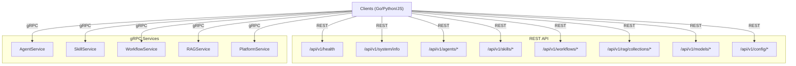
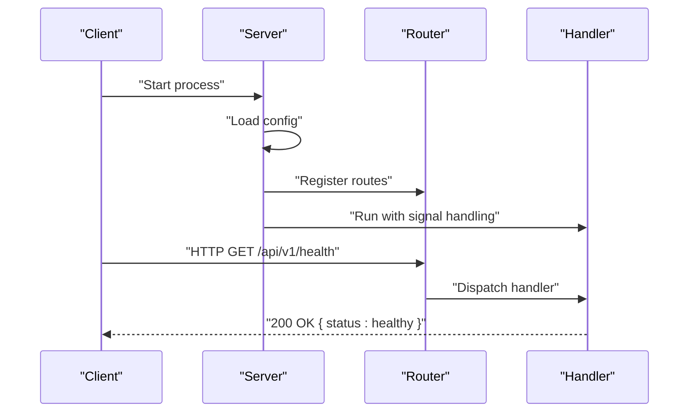
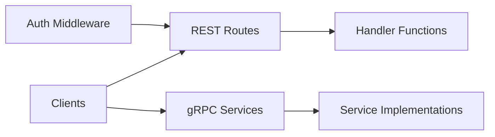

# API Reference

<cite>
**Referenced Files in This Document**
- [router.go](file://pkg/server/router.go)
- [auth.go](file://pkg/server/middleware/auth.go)
- [main.go](file://cmd/resolvenet-server/main.go)
- [client.ts](file://web/src/api/client.ts)
- [agent.proto](file://api/proto/resolvenet/v1/agent.proto)
- [skill.proto](file://api/proto/resolvenet/v1/skill.proto)
- [workflow.proto](file://api/proto/resolvenet/v1/workflow.proto)
- [rag.proto](file://api/proto/resolvenet/v1/rag.proto)
- [platform.proto](file://api/proto/resolvenet/v1/platform.proto)
- [common.proto](file://api/proto/resolvenet/v1/common.proto)
- [create.go](file://internal/cli/agent/create.go)
- [install.go](file://internal/cli/skill/install.go)
- [create.go](file://internal/cli/workflow/create.go)
- [ingest.go](file://internal/cli/rag/ingest.go)
</cite>

## Table of Contents
1. [Introduction](#introduction)
2. [Project Structure](#project-structure)
3. [Core Components](#core-components)
4. [Architecture Overview](#architecture-overview)
5. [Detailed Component Analysis](#detailed-component-analysis)
6. [Dependency Analysis](#dependency-analysis)
7. [Performance Considerations](#performance-considerations)
8. [Troubleshooting Guide](#troubleshooting-guide)
9. [Conclusion](#conclusion)
10. [Appendices](#appendices)

## Introduction
This document provides a comprehensive API reference for ResolveNet’s REST and gRPC surfaces, along with client library usage patterns for Go, Python, and JavaScript/TypeScript. It covers agent management, skill operations, workflow execution, and RAG functionality. It also documents authentication, authorization, rate limiting, and security considerations, and provides SDK usage patterns, error handling, status codes, and performance optimization tips.

## Project Structure
ResolveNet exposes:
- REST endpoints under /api/v1 for health, system info, agents, skills, workflows, RAG collections, models, and configuration.
- gRPC services defined in Protocol Buffers under api/proto/resolvenet/v1, including AgentService, SkillService, WorkflowService, RAGService, and PlatformService.

**Diagram sources**
- [router.go:10-55](file://pkg/server/router.go#L10-L55)
- [agent.proto:11-29](file://api/proto/resolvenet/v1/agent.proto#L11-L29)
- [skill.proto:10-17](file://api/proto/resolvenet/v1/skill.proto#L10-L17)
- [workflow.proto:11-20](file://api/proto/resolvenet/v1/workflow.proto#L11-L20)
- [rag.proto:10-18](file://api/proto/resolvenet/v1/rag.proto#L10-L18)
- [platform.proto:9-15](file://api/proto/resolvenet/v1/platform.proto#L9-L15)

**Section sources**
- [router.go:10-55](file://pkg/server/router.go#L10-L55)
- [agent.proto:11-29](file://api/proto/resolvenet/v1/agent.proto#L11-L29)
- [skill.proto:10-17](file://api/proto/resolvenet/v1/skill.proto#L10-L17)
- [workflow.proto:11-20](file://api/proto/resolvenet/v1/workflow.proto#L11-L20)
- [rag.proto:10-18](file://api/proto/resolvenet/v1/rag.proto#L10-L18)
- [platform.proto:9-15](file://api/proto/resolvenet/v1/platform.proto#L9-L15)

## Core Components
- REST server registers routes and stub handlers for health, system info, agents, skills, workflows, RAG, models, and configuration.
- Authentication middleware exists but currently allows all requests; future versions will enforce JWT or API keys.
- gRPC services define strongly typed request/response messages and streaming responses for agent execution and workflow execution.

Key capabilities:
- Agent lifecycle: create, get, list, update, delete, execute, list executions.
- Skill lifecycle: register, get, list, unregister, test.
- Workflow lifecycle: create, get, list, update, delete, validate, execute.
- RAG: create/delete collections, ingest documents, query collections.
- Platform: health checks, get/update config, system info.

**Section sources**
- [router.go:10-55](file://pkg/server/router.go#L10-L55)
- [auth.go:8-17](file://pkg/server/middleware/auth.go#L8-L17)
- [agent.proto:11-29](file://api/proto/resolvenet/v1/agent.proto#L11-L29)
- [skill.proto:10-17](file://api/proto/resolvenet/v1/skill.proto#L10-L17)
- [workflow.proto:11-20](file://api/proto/resolvenet/v1/workflow.proto#L11-L20)
- [rag.proto:10-18](file://api/proto/resolvenet/v1/rag.proto#L10-L18)
- [platform.proto:9-15](file://api/proto/resolvenet/v1/platform.proto#L9-L15)

## Architecture Overview
The server initializes configuration, constructs a server, and starts it with signal handling. REST routes are registered on a ServeMux. Authentication middleware is available for future enforcement.

**Diagram sources**
- [main.go:16-55](file://cmd/resolvenet-server/main.go#L16-L55)
- [router.go:10-67](file://pkg/server/router.go#L10-L67)

**Section sources**
- [main.go:16-55](file://cmd/resolvenet-server/main.go#L16-L55)
- [router.go:10-67](file://pkg/server/router.go#L10-L67)

## Detailed Component Analysis

### REST API Specification

#### Base URL
- All REST endpoints are prefixed with /api/v1.

#### Health and System Info
- GET /api/v1/health
  - Purpose: Health check.
  - Response: 200 OK with status field.
- GET /api/v1/system/info
  - Purpose: Retrieve platform version/build info.
  - Response: 200 OK with version, commit, build_date.

**Section sources**
- [router.go:12-16](file://pkg/server/router.go#L12-L16)
- [router.go:57-67](file://pkg/server/router.go#L57-L67)

#### Agent Management
- GET /api/v1/agents
  - Purpose: List agents with pagination.
  - Response: 200 OK with agents array and total count.
- POST /api/v1/agents
  - Purpose: Create an agent.
  - Response: 501 Not Implemented (stub).
- GET /api/v1/agents/{id}
  - Purpose: Retrieve an agent by ID.
  - Response: 404 Not Found (stub).
- PUT /api/v1/agents/{id}
  - Purpose: Update an agent.
  - Response: 501 Not Implemented (stub).
- DELETE /api/v1/agents/{id}
  - Purpose: Delete an agent.
  - Response: 501 Not Implemented (stub).
- POST /api/v1/agents/{id}/execute
  - Purpose: Execute an agent.
  - Response: 501 Not Implemented (stub).

Notes:
- Pagination is supported via path parameters in the underlying gRPC messages; REST handlers currently return stub responses.

**Section sources**
- [router.go:18-24](file://pkg/server/router.go#L18-L24)
- [router.go:71-94](file://pkg/server/router.go#L71-L94)

#### Skill Operations
- GET /api/v1/skills
  - Purpose: List skills.
  - Response: 200 OK with skills array and total count.
- POST /api/v1/skills
  - Purpose: Register a skill.
  - Response: 501 Not Implemented (stub).
- GET /api/v1/skills/{name}
  - Purpose: Retrieve a skill by name.
  - Response: 404 Not Found (stub).
- DELETE /api/v1/skills/{name}
  - Purpose: Unregister a skill.
  - Response: 501 Not Implemented (stub).

**Section sources**
- [router.go:26-31](file://pkg/server/router.go#L26-L31)
- [router.go:96-111](file://pkg/server/router.go#L96-L111)

#### Workflow Execution (FTA)
- GET /api/v1/workflows
  - Purpose: List workflows.
  - Response: 200 OK with workflows array and total count.
- POST /api/v1/workflows
  - Purpose: Create a workflow.
  - Response: 501 Not Implemented (stub).
- GET /api/v1/workflows/{id}
  - Purpose: Retrieve a workflow by ID.
  - Response: 404 Not Found (stub).
- PUT /api/v1/workflows/{id}
  - Purpose: Update a workflow.
  - Response: 501 Not Implemented (stub).
- DELETE /api/v1/workflows/{id}
  - Purpose: Delete a workflow.
  - Response: 501 Not Implemented (stub).
- POST /api/v1/workflows/{id}/validate
  - Purpose: Validate a workflow.
  - Response: 501 Not Implemented (stub).
- POST /api/v1/workflows/{id}/execute
  - Purpose: Execute a workflow.
  - Response: 501 Not Implemented (stub).

**Section sources**
- [router.go:32-39](file://pkg/server/router.go#L32-L39)
- [router.go:113-140](file://pkg/server/router.go#L113-L140)

#### RAG Functionality
- GET /api/v1/rag/collections
  - Purpose: List RAG collections.
  - Response: 200 OK with collections array and total count.
- POST /api/v1/rag/collections
  - Purpose: Create a collection.
  - Response: 501 Not Implemented (stub).
- DELETE /api/v1/rag/collections/{id}
  - Purpose: Delete a collection.
  - Response: 501 Not Implemented (stub).
- POST /api/v1/rag/collections/{id}/ingest
  - Purpose: Ingest documents into a collection.
  - Response: 501 Not Implemented (stub).
- POST /api/v1/rag/collections/{id}/query
  - Purpose: Query a collection.
  - Response: 501 Not Implemented (stub).

**Section sources**
- [router.go:41-46](file://pkg/server/router.go#L41-L46)
- [router.go:142-160](file://pkg/server/router.go#L142-L160)

#### Models and Configuration
- GET /api/v1/models
  - Purpose: List available models.
  - Response: 200 OK with models array and total count.
- POST /api/v1/models
  - Purpose: Add a model.
  - Response: 501 Not Implemented (stub).
- GET /api/v1/config
  - Purpose: Get configuration.
  - Response: 501 Not Implemented (stub).
- PUT /api/v1/config
  - Purpose: Update configuration.
  - Response: 501 Not Implemented (stub).

**Section sources**
- [router.go:48-55](file://pkg/server/router.go#L48-L55)
- [router.go:162-176](file://pkg/server/router.go#L162-L176)

### gRPC API Specification

#### AgentService
- Methods:
  - CreateAgent(CreateAgentRequest) -> Agent
  - GetAgent(GetAgentRequest) -> Agent
  - ListAgents(ListAgentsRequest) -> ListAgentsResponse
  - UpdateAgent(UpdateAgentRequest) -> Agent
  - DeleteAgent(DeleteAgentRequest) -> DeleteAgentResponse
  - ExecuteAgent(ExecuteAgentRequest) -> stream ExecuteAgentResponse
  - GetExecution(GetExecutionRequest) -> Execution
  - ListExecutions(ListExecutionsRequest) -> ListExecutionsResponse

- Streaming:
  - ExecuteAgent returns a server-stream of ExecuteAgentResponse containing content, event, or error.

- Enums:
  - AgentType: unspecified, mega, skill, fta, rag, custom
  - ExecutionStatus: unspecified, pending, running, completed, failed
  - RouteType: unspecified, fta, skill, rag, multi, direct

- Messages:
  - Agent, AgentConfig, SelectorConfig, Execution, RouteDecision, ExecutionEvent, ExecutionError

**Section sources**
- [agent.proto:11-29](file://api/proto/resolvenet/v1/agent.proto#L11-L29)
- [agent.proto:31-177](file://api/proto/resolvenet/v1/agent.proto#L31-L177)

#### SkillService
- Methods:
  - RegisterSkill(RegisterSkillRequest) -> Skill
  - GetSkill(GetSkillRequest) -> Skill
  - ListSkills(ListSkillsRequest) -> ListSkillsResponse
  - UnregisterSkill(UnregisterSkillRequest) -> UnregisterSkillResponse
  - TestSkill(TestSkillRequest) -> TestSkillResponse

- Messages:
  - Skill, SkillManifest, SkillParameter, SkillPermissions

**Section sources**
- [skill.proto:10-17](file://api/proto/resolvenet/v1/skill.proto#L10-L17)
- [skill.proto:19-101](file://api/proto/resolvenet/v1/skill.proto#L19-L101)

#### WorkflowService (FTA)
- Methods:
  - CreateWorkflow(CreateWorkflowRequest) -> Workflow
  - GetWorkflow(GetWorkflowRequest) -> Workflow
  - ListWorkflows(ListWorkflowsRequest) -> ListWorkflowsResponse
  - UpdateWorkflow(UpdateWorkflowRequest) -> Workflow
  - DeleteWorkflow(DeleteWorkflowRequest) -> DeleteWorkflowResponse
  - ValidateWorkflow(ValidateWorkflowRequest) -> ValidateWorkflowResponse
  - ExecuteWorkflow(ExecuteWorkflowRequest) -> stream WorkflowEvent

- Streaming:
  - ExecuteWorkflow returns a server-stream of WorkflowEvent with types such as started, node_evaluating, node_completed, gate_evaluating, gate_completed, completed, failed.

- Messages:
  - Workflow, FaultTree, FTAEvent, FTAGate, WorkflowEvent, ValidateWorkflowResponse

**Section sources**
- [workflow.proto:11-20](file://api/proto/resolvenet/v1/workflow.proto#L11-L20)
- [workflow.proto:22-145](file://api/proto/resolvenet/v1/workflow.proto#L22-L145)

#### RAGService
- Methods:
  - CreateCollection(CreateCollectionRequest) -> Collection
  - GetCollection(GetCollectionRequest) -> Collection
  - ListCollections(ListCollectionsRequest) -> ListCollectionsResponse
  - DeleteCollection(DeleteCollectionRequest) -> DeleteCollectionResponse
  - IngestDocuments(IngestDocumentsRequest) -> IngestDocumentsResponse
  - QueryCollection(QueryCollectionRequest) -> QueryCollectionResponse

- Messages:
  - Collection, ChunkConfig, Document, RetrievedChunk, IngestDocumentsResponse, QueryCollectionResponse

**Section sources**
- [rag.proto:10-18](file://api/proto/resolvenet/v1/rag.proto#L10-L18)
- [rag.proto:20-99](file://api/proto/resolvenet/v1/rag.proto#L20-L99)

#### PlatformService
- Methods:
  - HealthCheck(HealthCheckRequest) -> HealthCheckResponse
  - GetConfig(GetConfigRequest) -> GetConfigResponse
  - UpdateConfig(UpdateConfigRequest) -> UpdateConfigResponse
  - GetSystemInfo(GetSystemInfoRequest) -> GetSystemInfoResponse

- Messages:
  - HealthCheckResponse, ServiceHealth, HealthStatus, GetSystemInfoResponse

**Section sources**
- [platform.proto:9-15](file://api/proto/resolvenet/v1/platform.proto#L9-L15)
- [platform.proto:17-61](file://api/proto/resolvenet/v1/platform.proto#L17-L61)

#### Shared Types and Utilities
- PaginationRequest/PaginationResponse
- ResourceMeta, ResourceStatus
- ErrorDetail

**Section sources**
- [common.proto:9-49](file://api/proto/resolvenet/v1/common.proto#L9-L49)

### Authentication and Authorization
- Current state: Authentication middleware exists but does not enforce tokens; all requests are allowed.
- Future state: JWT or API key validation will be implemented in the middleware.

Recommendations:
- Enforce bearer tokens on protected endpoints.
- Scope tokens per resource and operation.
- Log unauthorized attempts for audit.

**Section sources**
- [auth.go:8-17](file://pkg/server/middleware/auth.go#L8-L17)

### Rate Limiting and Security Considerations
- Rate limiting: Not implemented yet.
- Security:
  - Transport: Use HTTPS/TLS in production.
  - CORS: Configure origins in deployment.
  - Input sanitization/validation at ingress.
  - Principle of least privilege for service accounts.

[No sources needed since this section provides general guidance]

### Client Implementation Examples

#### Go
- Use the generated gRPC clients for AgentService, SkillService, WorkflowService, RAGService, and PlatformService.
- Example usage patterns:
  - Initialize gRPC connection and create service clients.
  - Call unary methods like CreateAgent, RegisterSkill, CreateWorkflow, CreateCollection.
  - For streaming methods, iterate over server-stream responses (ExecuteAgent, ExecuteWorkflow).

References:
- [agent.proto:11-29](file://api/proto/resolvenet/v1/agent.proto#L11-L29)
- [skill.proto:10-17](file://api/proto/resolvenet/v1/skill.proto#L10-L17)
- [workflow.proto:11-20](file://api/proto/resolvenet/v1/workflow.proto#L11-L20)
- [rag.proto:10-18](file://api/proto/resolvenet/v1/rag.proto#L10-L18)
- [platform.proto:9-15](file://api/proto/resolvenet/v1/platform.proto#L9-L15)

#### Python
- Use the generated gRPC stubs and protobuf messages.
- Example usage patterns:
  - Build requests using generated message types.
  - Handle streaming responses for ExecuteAgent and ExecuteWorkflow.
  - Manage pagination using PaginationRequest/PaginationResponse.

References:
- [agent.proto:11-29](file://api/proto/resolvenet/v1/agent.proto#L11-L29)
- [skill.proto:10-17](file://api/proto/resolvenet/v1/skill.proto#L10-L17)
- [workflow.proto:11-20](file://api/proto/resolvenet/v1/workflow.proto#L11-L20)
- [rag.proto:10-18](file://api/proto/resolvenet/v1/rag.proto#L10-L18)
- [platform.proto:9-15](file://api/proto/resolvenet/v1/platform.proto#L9-L15)

#### JavaScript/TypeScript
- Use the generated gRPC-web or Node gRPC clients.
- Example usage patterns:
  - Construct typed requests from generated message types.
  - Subscribe to server-stream responses for ExecuteAgent and ExecuteWorkflow.
  - Handle pagination and error responses.

References:
- [client.ts:20-48](file://web/src/api/client.ts#L20-L48)

### Error Handling Strategies
- REST:
  - 200 OK for successful reads.
  - 404 Not Found for missing resources (e.g., agent/skill not found).
  - 501 Not Implemented for unimplemented endpoints.
- gRPC:
  - Use ErrorDetail for structured errors.
  - Streamed responses include ExecutionError or WorkflowEvent with error details.

**Section sources**
- [router.go:79-82](file://pkg/server/router.go#L79-L82)
- [router.go:104-107](file://pkg/server/router.go#L104-L107)
- [common.proto:21-26](file://api/proto/resolvenet/v1/common.proto#L21-L26)

### Status Codes and Response Formats
- REST:
  - 200 OK: Successful read operations.
  - 404 Not Found: Entity not found.
  - 501 Not Implemented: Endpoint not implemented.
- gRPC:
  - Standard gRPC status codes apply.
  - Structured error messages via ErrorDetail.

**Section sources**
- [router.go:71-94](file://pkg/server/router.go#L71-L94)
- [router.go:96-111](file://pkg/server/router.go#L96-L111)
- [router.go:113-140](file://pkg/server/router.go#L113-L140)
- [router.go:142-160](file://pkg/server/router.go#L142-L160)
- [common.proto:21-26](file://api/proto/resolvenet/v1/common.proto#L21-L26)

### SDK Usage Patterns and Best Practices
- Use pagination consistently for list endpoints.
- For streaming endpoints, handle partial results and errors gracefully.
- Validate inputs against manifests for skills and workflows.
- Prefer immutable updates and idempotent operations where possible.

[No sources needed since this section provides general guidance]

### API Versioning, Backwards Compatibility, and Migration
- Versioning: REST endpoints are under /api/v1; gRPC services live under resolvenet.v1.
- Backwards compatibility: Keep field additions backward compatible; deprecate fields with comments.
- Migration:
  - Introduce new versions under new paths or service packages.
  - Provide deprecation notices and migration timelines.

[No sources needed since this section provides general guidance]

## Dependency Analysis
The server composes routes and middleware; clients consume either REST or gRPC.

**Diagram sources**
- [router.go:10-55](file://pkg/server/router.go#L10-L55)
- [auth.go:8-17](file://pkg/server/middleware/auth.go#L8-L17)

**Section sources**
- [router.go:10-55](file://pkg/server/router.go#L10-L55)
- [auth.go:8-17](file://pkg/server/middleware/auth.go#L8-L17)

## Performance Considerations
- Use pagination for list endpoints to avoid large payloads.
- For streaming endpoints, process events incrementally and close connections promptly.
- Cache frequently accessed configurations and metadata.
- Use compression for large payloads (REST) and leverage gRPC compression where applicable.

[No sources needed since this section provides general guidance]

## Troubleshooting Guide
Common issues and resolutions:
- 404 Not Found: Verify entity IDs and names; ensure correct path parameters.
- 501 Not Implemented: Expect stub responses during development; implement handlers.
- Authentication failures: Ensure tokens are present and valid when middleware is enabled.
- Streaming timeouts: Increase client-side timeouts and handle reconnection logic.

**Section sources**
- [router.go:79-82](file://pkg/server/router.go#L79-L82)
- [router.go:104-107](file://pkg/server/router.go#L104-L107)
- [router.go:113-140](file://pkg/server/router.go#L113-L140)
- [router.go:142-160](file://pkg/server/router.go#L142-L160)
- [auth.go:8-17](file://pkg/server/middleware/auth.go#L8-L17)

## Conclusion
ResolveNet provides a robust foundation for agent orchestration, skill management, workflow execution, and RAG operations via both REST and gRPC. While REST endpoints are currently stubbed, the gRPC surface is well-defined. Implement authentication, rate limiting, and comprehensive error handling to harden the API for production. Adopt the provided client patterns and best practices for reliable integrations.

[No sources needed since this section summarizes without analyzing specific files]

## Appendices

### CLI Usage References
- Agent management commands (create, list, run, delete, logs) are defined in the CLI package.
- Skill management commands (install, list, info, test, remove) are defined in the CLI package.
- Workflow management commands (create, list, run, validate, visualize) are defined in the CLI package.
- RAG ingestion commands (ingest) are defined in the CLI package.

**Section sources**
- [create.go:9-31](file://internal/cli/agent/create.go#L9-L31)
- [install.go:26-40](file://internal/cli/skill/install.go#L26-L40)
- [create.go:26-44](file://internal/cli/workflow/create.go#L26-L44)
- [ingest.go:9-27](file://internal/cli/rag/ingest.go#L9-L27)