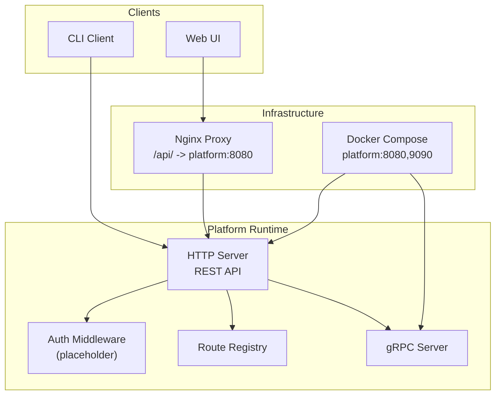
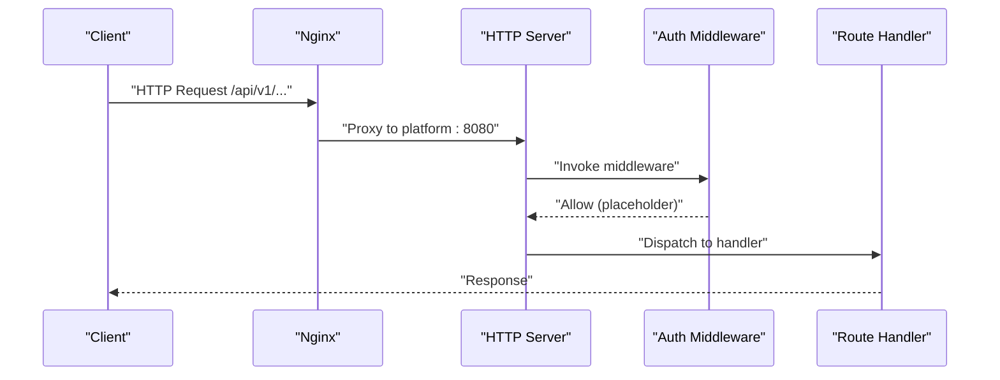
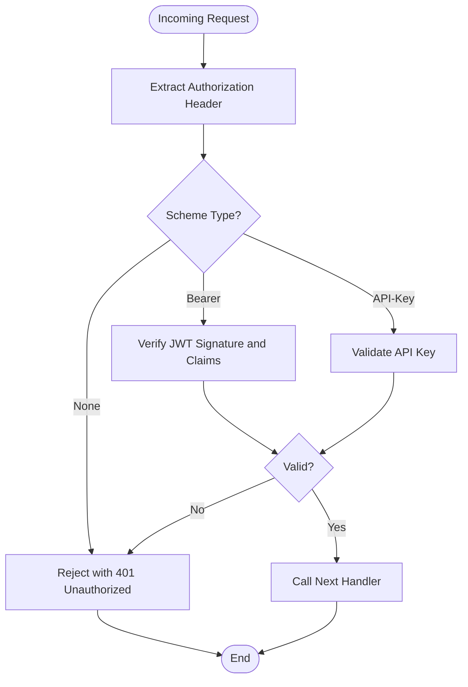
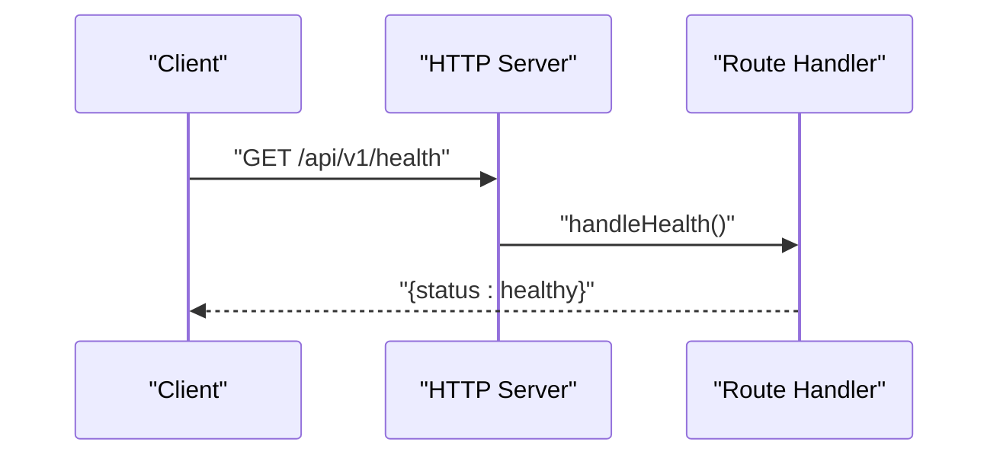
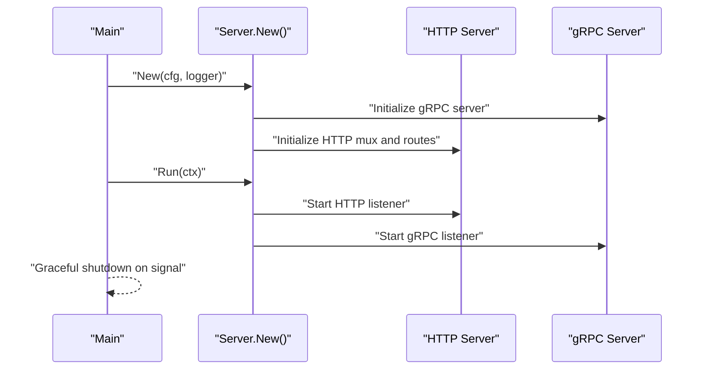
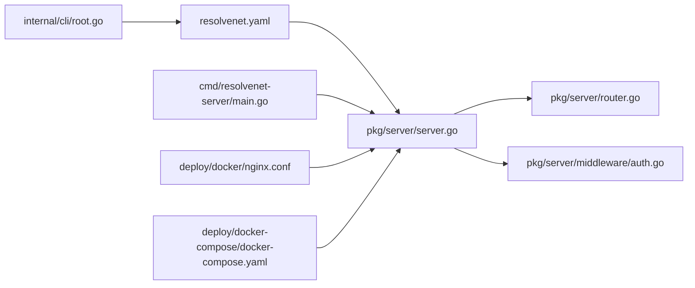

# Authentication and Authorization

<cite>
**Referenced Files in This Document**
- [auth.go](file://pkg/server/middleware/auth.go)
- [router.go](file://pkg/server/router.go)
- [server.go](file://pkg/server/server.go)
- [resolvenet.yaml](file://configs/resolvenet.yaml)
- [nginx.conf](file://deploy/docker/nginx.conf)
- [docker-compose.yaml](file://deploy/docker-compose/docker-compose.yaml)
- [root.go](file://internal/cli/root.go)
- [main.go](file://cmd/resolvenet-server/main.go)
- [SECURITY.md](file://SECURITY.md)
</cite>

## Table of Contents
1. [Introduction](#introduction)
2. [Project Structure](#project-structure)
3. [Core Components](#core-components)
4. [Architecture Overview](#architecture-overview)
5. [Detailed Component Analysis](#detailed-component-analysis)
6. [Dependency Analysis](#dependency-analysis)
7. [Performance Considerations](#performance-considerations)
8. [Security Headers, CORS, and HTTPS](#security-headers-cors-and-https)
9. [Token Management and Session Handling](#token-management-and-session-handling)
10. [Implementation Examples for Secure Client Integration](#implementation-examples-for-secure-client-integration)
11. [Security Best Practices and Compliance](#security-best-practices-and-compliance)
12. [Troubleshooting Guide](#troubleshooting-guide)
13. [Conclusion](#conclusion)

## Introduction
This document defines ResolveNet’s API security model with a focus on authentication and authorization. It explains how authentication mechanisms (API keys, JWT tokens, and OAuth2) and authorization patterns (role-based access control and permissions) are intended to be integrated into the platform. It also covers security headers, CORS configuration, HTTPS requirements, token management, refresh strategies, session handling, and practical client integration examples. Finally, it provides troubleshooting guidance and security audit procedures aligned with the current repository state.

## Project Structure
ResolveNet exposes REST endpoints via an embedded HTTP server and registers routes for agents, skills, workflows, RAG collections, models, and configuration. Authentication middleware currently passes all requests and is marked for implementation. The server listens on HTTP and gRPC endpoints, while the included Nginx configuration proxies API traffic to the platform service. CLI clients connect to the platform via configurable server addresses.

**Diagram sources**
- [server.go:44-51](file://pkg/server/server.go#L44-L51)
- [router.go:11-55](file://pkg/server/router.go#L11-L55)
- [auth.go:8-17](file://pkg/server/middleware/auth.go#L8-L17)
- [nginx.conf:11-16](file://deploy/docker/nginx.conf#L11-L16)
- [docker-compose.yaml:8-10](file://deploy/docker-compose/docker-compose.yaml#L8-L10)

**Section sources**
- [server.go:44-51](file://pkg/server/server.go#L44-L51)
- [router.go:11-55](file://pkg/server/router.go#L11-L55)
- [auth.go:8-17](file://pkg/server/middleware/auth.go#L8-L17)
- [nginx.conf:11-16](file://deploy/docker/nginx.conf#L11-L16)
- [docker-compose.yaml:8-10](file://deploy/docker-compose/docker-compose.yaml#L8-L10)

## Core Components
- HTTP Server and Route Registration: The HTTP server initializes a ServeMux and registers REST endpoints for agents, skills, workflows, RAG, models, and configuration. All endpoints are currently stubbed and return NotImplemented or NotFound responses.
- Auth Middleware: A placeholder middleware exists but does not enforce authentication; it currently forwards all requests.
- Server Startup: The server initializes gRPC and HTTP listeners based on configuration and gracefully shuts down on context cancellation.
- Configuration: The platform reads configuration from files and environment variables, including HTTP/gRPC addresses, database, Redis, NATS, runtime gRPC, gateway, and telemetry settings.
- Infrastructure: Nginx proxies /api/ to the platform HTTP server, and Docker Compose exposes platform and runtime ports.

**Section sources**
- [router.go:11-55](file://pkg/server/router.go#L11-L55)
- [auth.go:8-17](file://pkg/server/middleware/auth.go#L8-L17)
- [server.go:28-51](file://pkg/server/server.go#L28-L51)
- [resolvenet.yaml:3-34](file://configs/resolvenet.yaml#L3-L34)
- [nginx.conf:11-16](file://deploy/docker/nginx.conf#L11-L16)
- [docker-compose.yaml:8-10](file://deploy/docker-compose/docker-compose.yaml#L8-L10)

## Architecture Overview
The platform exposes REST APIs under /api/v1/ and relies on middleware for authentication and authorization. Currently, the auth middleware is a placeholder. Clients include a CLI and Web UI, with the latter proxied through Nginx.

**Diagram sources**
- [nginx.conf:11-16](file://deploy/docker/nginx.conf#L11-L16)
- [server.go:44-51](file://pkg/server/server.go#L44-L51)
- [auth.go:8-17](file://pkg/server/middleware/auth.go#L8-L17)
- [router.go:11-55](file://pkg/server/router.go#L11-L55)

## Detailed Component Analysis

### Authentication Middleware
The current implementation is a placeholder that forwards all requests. It is annotated to implement JWT and API key validation. To enable authentication, integrate token extraction from Authorization headers, validate signatures, and enforce per-route policies.

**Diagram sources**
- [auth.go:8-17](file://pkg/server/middleware/auth.go#L8-L17)

**Section sources**
- [auth.go:8-17](file://pkg/server/middleware/auth.go#L8-L17)

### Authorization Patterns and Role-Based Access Control
Authorization is not implemented in the current codebase. Intended patterns include:
- Role-based access control (RBAC): Assign roles (e.g., admin, developer, viewer) to users and enforce role checks against resource and action scopes.
- Permission systems: Define granular permissions per endpoint and resource, enforcing checks before invoking handlers.
- Resource-level permissions: Scope access to specific resources (e.g., agent ID, workflow ID) using claims or ACLs.
- Audit logging: Log authorization decisions and sensitive actions for compliance.

[No sources needed since this section outlines intended future implementation]

### Route Handlers and Endpoint Exposure
The HTTP server registers endpoints under /api/v1/ for health, system info, agents, skills, workflows, RAG collections, models, and configuration. Handlers currently return NotImplemented or NotFound stubs.

**Diagram sources**
- [router.go:12-13](file://pkg/server/router.go#L12-L13)
- [router.go:57-59](file://pkg/server/router.go#L57-L59)

**Section sources**
- [router.go:11-55](file://pkg/server/router.go#L11-L55)
- [router.go:57-67](file://pkg/server/router.go#L57-L67)

### Server Initialization and Lifecycle
The server initializes gRPC and HTTP servers, registers health and reflection for gRPC, and starts both servers concurrently. It listens on configured addresses and handles graceful shutdown.

**Diagram sources**
- [server.go:28-51](file://pkg/server/server.go#L28-L51)
- [server.go:55-103](file://pkg/server/server.go#L55-L103)
- [main.go:16-55](file://cmd/resolvenet-server/main.go#L16-L55)

**Section sources**
- [server.go:28-51](file://pkg/server/server.go#L28-L51)
- [server.go:55-103](file://pkg/server/server.go#L55-L103)
- [main.go:16-55](file://cmd/resolvenet-server/main.go#L16-L55)

## Dependency Analysis
- HTTP server depends on route registration and middleware injection.
- Auth middleware is currently a placeholder and not yet wired into the HTTP chain.
- Nginx depends on platform HTTP address configuration.
- CLI depends on server address configuration and environment overrides.

**Diagram sources**
- [resolvenet.yaml:3-34](file://configs/resolvenet.yaml#L3-L34)
- [main.go:24-30](file://cmd/resolvenet-server/main.go#L24-L30)
- [server.go:28-51](file://pkg/server/server.go#L28-L51)
- [router.go:11-55](file://pkg/server/router.go#L11-L55)
- [auth.go:8-17](file://pkg/server/middleware/auth.go#L8-L17)
- [nginx.conf:11-16](file://deploy/docker/nginx.conf#L11-L16)
- [docker-compose.yaml:8-10](file://deploy/docker-compose/docker-compose.yaml#L8-L10)
- [root.go:36-41](file://internal/cli/root.go#L36-L41)

**Section sources**
- [resolvenet.yaml:3-34](file://configs/resolvenet.yaml#L3-L34)
- [main.go:24-30](file://cmd/resolvenet-server/main.go#L24-L30)
- [server.go:28-51](file://pkg/server/server.go#L28-L51)
- [router.go:11-55](file://pkg/server/router.go#L11-L55)
- [auth.go:8-17](file://pkg/server/middleware/auth.go#L8-L17)
- [nginx.conf:11-16](file://deploy/docker/nginx.conf#L11-L16)
- [docker-compose.yaml:8-10](file://deploy/docker-compose/docker-compose.yaml#L8-L10)
- [root.go:36-41](file://internal/cli/root.go#L36-L41)

## Performance Considerations
- Middleware overhead: Add lightweight token parsing and caching to minimize latency.
- Concurrency: Ensure handlers are stateless and thread-safe.
- Caching: Cache frequently accessed authorization decisions where appropriate.
- Observability: Instrument authentication and authorization paths for latency and failure rates.

[No sources needed since this section provides general guidance]

## Security Headers, CORS, and HTTPS
- Current state: The HTTP server listens on the configured address without explicit security headers or CORS configuration in the provided code. Nginx proxy configuration forwards headers but does not set security headers.
- Recommendations:
  - Enforce HTTPS in production behind a reverse proxy or ingress with TLS termination.
  - Add security headers (e.g., Content-Security-Policy, X-Frame-Options, X-Content-Type-Options, Referrer-Policy).
  - Configure CORS for browser clients with precise origins, methods, and headers.
  - Use HSTS for long-term security.

**Section sources**
- [resolvenet.yaml:3-6](file://configs/resolvenet.yaml#L3-L6)
- [nginx.conf:11-16](file://deploy/docker/nginx.conf#L11-L16)

## Token Management and Session Handling
- Token types:
  - API Keys: Prefer short-lived keys with scopes and rotation. Store hashed on the server and rotate regularly.
  - JWT: Use compact tokens with minimal claims, short expiration, and refresh tokens stored securely (HttpOnly, SameSite cookies).
  - OAuth2: Implement Authorization Code with PKCE for browser clients and Client Credentials for service-to-service.
- Refresh strategies:
  - Short-lived access tokens with long-lived refresh tokens.
  - Rotate refresh tokens upon reuse and revoke on logout.
- Session handling:
  - Stateless JWT preferred; avoid server-side sessions.
  - For cookie-based sessions, use HttpOnly, Secure, SameSite flags and strict CSRF protection.

[No sources needed since this section provides general guidance]

## Implementation Examples for Secure Client Integration
Below are secure integration patterns for clients. Replace placeholders with actual values and follow the security recommendations.

- CLI client configuration
  - Configure server address and optional API key or bearer token via environment variables or config file.
  - Example pattern: set server address and credentials in the CLI config, then construct requests with Authorization header.

- Browser/Web client integration
  - OAuth2 Authorization Code with PKCE: redirect to authorization server, exchange code for tokens, store refresh token securely, and renew tokens before expiry.
  - API key integration: send API-Key header for server-to-server integrations.

- gRPC client
  - Use TLS channel credentials and propagate bearer tokens via metadata for auth.

[No sources needed since this section provides general guidance]

## Security Best Practices and Compliance
- Principle of least privilege: Grant minimal required permissions to roles and users.
- Secrets management: Never hardcode secrets; use environment variables or secret managers.
- Input validation and sanitization: Prevent injection attacks.
- Audit logging: Log authentication attempts, authorization decisions, and sensitive actions.
- Dependency hygiene: Keep dependencies updated and monitor advisories.
- Compliance: Align with applicable standards (e.g., SOC 2, ISO 27001) and maintain documentation.

**Section sources**
- [SECURITY.md:30-39](file://SECURITY.md#L30-L39)

## Troubleshooting Guide
- Authentication failures
  - Symptom: 401 Unauthorized on protected endpoints.
  - Checks: Confirm Authorization header presence, correct scheme (Bearer/API-Key), and valid token format/signature.
  - Resolution: Reissue tokens, verify issuer and audience claims, and ensure middleware is wired.

- CORS errors
  - Symptom: Preflight or fetch blocked due to CORS.
  - Checks: Verify allowed origins, methods, and headers in CORS configuration.
  - Resolution: Align CORS policy with client origin and required headers.

- HTTPS/TLS issues
  - Symptom: Mixed content warnings or TLS handshake failures.
  - Checks: Ensure TLS termination at reverse proxy or ingress and correct certificates.
  - Resolution: Update certificate configuration and enforce HTTPS redirects.

- Token expiration
  - Symptom: Requests fail after token expiry.
  - Checks: Validate token exp claim and refresh token availability.
  - Resolution: Implement automatic refresh and handle token renewal errors gracefully.

[No sources needed since this section provides general guidance]

## Conclusion
ResolveNet’s authentication and authorization model is currently a placeholder. The HTTP server exposes REST endpoints and the auth middleware is ready for implementation. Production deployments should enforce HTTPS, implement robust authentication (API keys, JWT, OAuth2), define RBAC and permission systems, configure CORS and security headers, and adopt secure token management and session handling. The CLI and Web UI clients should integrate securely using the recommended patterns. Adopt the best practices and troubleshooting steps to ensure a secure and compliant platform.