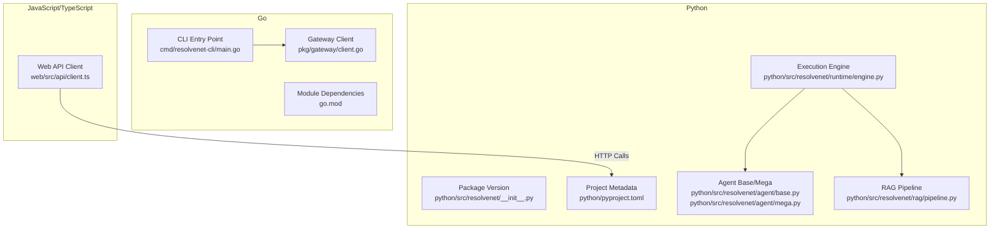
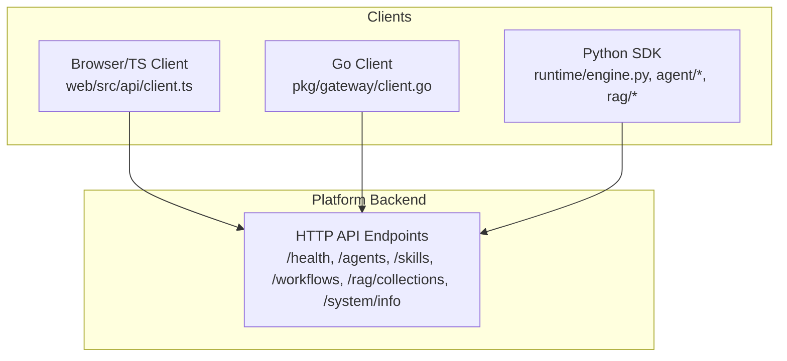
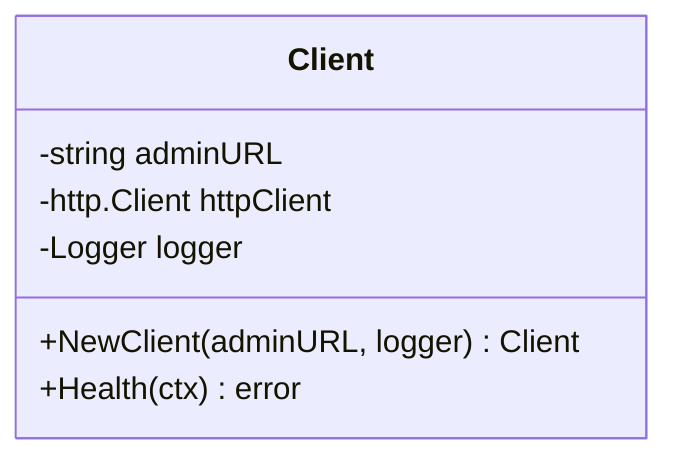
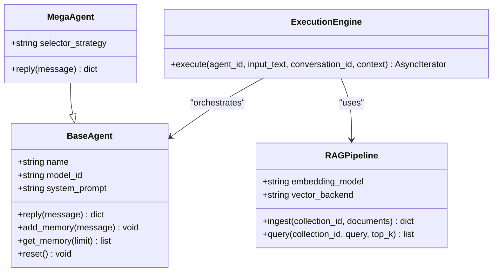
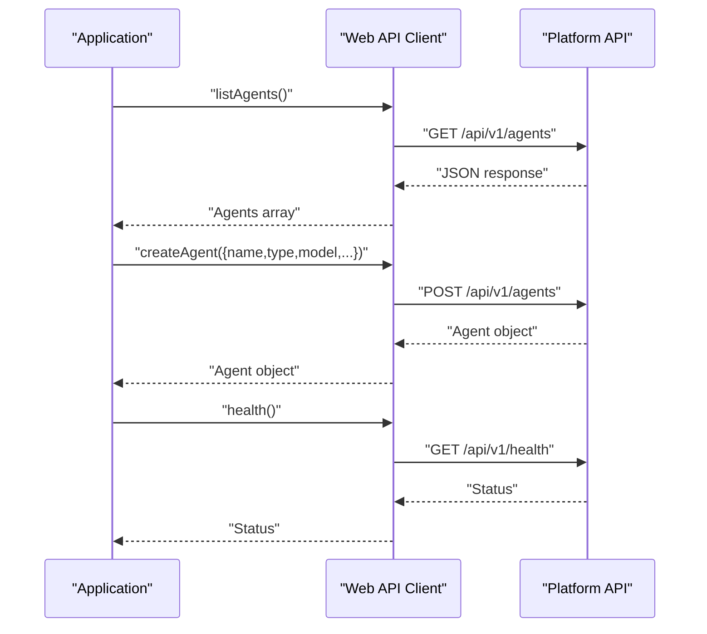
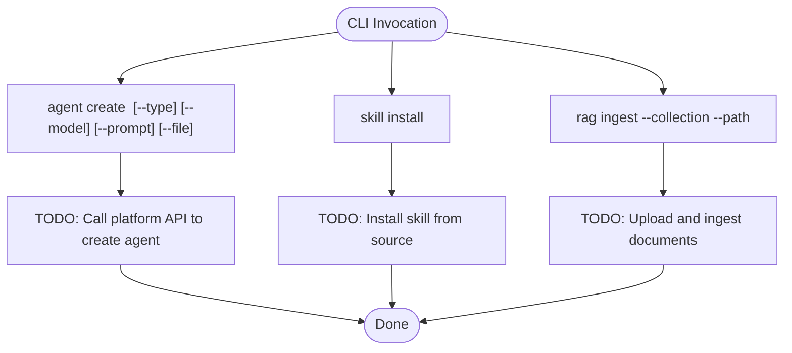
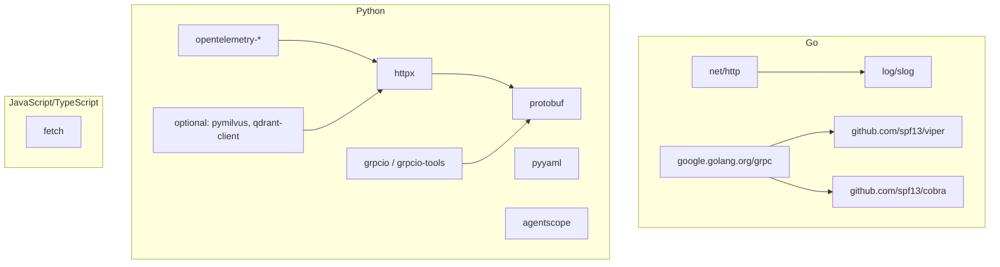

# Client Libraries and SDKs

<cite>
**Referenced Files in This Document**
- [client.ts](file://web/src/api/client.ts)
- [__init__.py](file://python/src/resolvenet/__init__.py)
- [pyproject.toml](file://python/pyproject.toml)
- [client.go](file://pkg/gateway/client.go)
- [go.mod](file://go.mod)
- [main.go](file://cmd/resolvenet-cli/main.go)
- [create.go](file://internal/cli/agent/create.go)
- [install.go](file://internal/cli/skill/install.go)
- [ingest.go](file://internal/cli/rag/ingest.go)
- [engine.py](file://python/src/resolvenet/runtime/engine.py)
- [base.py](file://python/src/resolvenet/agent/base.py)
- [mega.py](file://python/src/resolvenet/agent/mega.py)
- [pipeline.py](file://python/src/resolvenet/rag/pipeline.py)
- [tracing.go](file://pkg/server/middleware/tracing.go)
</cite>

## Table of Contents
1. [Introduction](#introduction)
2. [Project Structure](#project-structure)
3. [Core Components](#core-components)
4. [Architecture Overview](#architecture-overview)
5. [Detailed Component Analysis](#detailed-component-analysis)
6. [Dependency Analysis](#dependency-analysis)
7. [Performance Considerations](#performance-considerations)
8. [Troubleshooting Guide](#troubleshooting-guide)
9. [Conclusion](#conclusion)
10. [Appendices](#appendices)

## Introduction
This document provides comprehensive client library and SDK documentation for ResolveNet’s API clients across Go, Python, and JavaScript/TypeScript. It focuses on official client implementations present in the repository, covering initialization, authentication, configuration, error handling, and practical usage patterns for common operations such as agent creation, skill registration, workflow execution, and RAG queries. It also outlines client-side caching, retry mechanisms, connection pooling strategies, production best practices, performance optimization, troubleshooting, SDK versioning, backwards compatibility, and migration guidance.

## Project Structure
The repository organizes client-related code across three primary languages:
- Go: Gateway client and CLI entry points for interacting with the platform.
- Python: Agent runtime, execution engine, and RAG pipeline abstractions.
- JavaScript/TypeScript: Web client SDK for browser-based integrations.

**Diagram sources**
- [main.go:1-14](file://cmd/resolvenet-cli/main.go#L1-L14)
- [client.go:1-30](file://pkg/gateway/client.go#L1-L30)
- [go.mod:1-52](file://go.mod#L1-L52)
- [__init__.py:1-4](file://python/src/resolvenet/__init__.py#L1-L4)
- [pyproject.toml:1-66](file://python/pyproject.toml#L1-L66)
- [engine.py:1-89](file://python/src/resolvenet/runtime/engine.py#L1-L89)
- [base.py:1-62](file://python/src/resolvenet/agent/base.py#L1-L62)
- [mega.py:1-74](file://python/src/resolvenet/agent/mega.py#L1-L74)
- [pipeline.py:1-75](file://python/src/resolvenet/rag/pipeline.py#L1-L75)
- [client.ts:1-85](file://web/src/api/client.ts#L1-L85)

**Section sources**
- [main.go:1-14](file://cmd/resolvenet-cli/main.go#L1-L14)
- [client.go:1-30](file://pkg/gateway/client.go#L1-L30)
- [go.mod:1-52](file://go.mod#L1-L52)
- [__init__.py:1-4](file://python/src/resolvenet/__init__.py#L1-L4)
- [pyproject.toml:1-66](file://python/pyproject.toml#L1-L66)
- [engine.py:1-89](file://python/src/resolvenet/runtime/engine.py#L1-L89)
- [base.py:1-62](file://python/src/resolvenet/agent/base.py#L1-L62)
- [mega.py:1-74](file://python/src/resolvenet/agent/mega.py#L1-L74)
- [pipeline.py:1-75](file://python/src/resolvenet/rag/pipeline.py#L1-L75)
- [client.ts:1-85](file://web/src/api/client.ts#L1-L85)

## Core Components
This section summarizes the client libraries and their roles:
- Go Gateway Client: Provides a lightweight HTTP client wrapper for administrative endpoints and a placeholder for health checks.
- Python SDK: Offers agent abstractions, an execution engine, and a RAG pipeline orchestration layer.
- JavaScript/TypeScript Web Client: Exposes typed API functions for health, agents, skills, workflows, RAG collections, and system info.

Key capabilities:
- Initialization: Construct clients with base URLs and optional logging or HTTP clients.
- Authentication: Not implemented in the referenced client code; see Authentication Strategies below.
- Configuration: Environment-driven configuration via Viper in the Go CLI; Python project metadata defines dependencies and optional extras.
- Error Handling: Go client health check logs; TypeScript client throws errors on non-OK responses; Python code uses logging and raises exceptions where applicable.
- Common Operations: Agent CRUD, skill management, workflow listing, RAG collection listing, and system info.

**Section sources**
- [client.go:1-30](file://pkg/gateway/client.go#L1-L30)
- [__init__.py:1-4](file://python/src/resolvenet/__init__.py#L1-L4)
- [pyproject.toml:1-66](file://python/pyproject.toml#L1-L66)
- [client.ts:1-85](file://web/src/api/client.ts#L1-L85)

## Architecture Overview
The client libraries integrate with the platform’s backend through HTTP APIs. The Go CLI and Python runtime demonstrate how clients can be composed to support agent orchestration, skill execution, and RAG workflows.

**Diagram sources**
- [client.ts:1-85](file://web/src/api/client.ts#L1-L85)
- [client.go:1-30](file://pkg/gateway/client.go#L1-L30)
- [engine.py:1-89](file://python/src/resolvenet/runtime/engine.py#L1-L89)

## Detailed Component Analysis

### Go Client Library
The Go client provides a minimal HTTP client wrapper suitable for administrative tasks and future extension.

- Initialization: Construct a client with an admin URL and a logger.
- Authentication: Not implemented in the referenced code; consider bearer tokens or API keys via request headers.
- Configuration: No explicit configuration options in the client; pass a configured http.Client if needed.
- Error Handling: Health currently logs and returns nil; extend to propagate HTTP errors.
- Usage Patterns: Use the client to call platform endpoints after setting up authentication.

**Diagram sources**
- [client.go:1-30](file://pkg/gateway/client.go#L1-L30)

**Section sources**
- [client.go:1-30](file://pkg/gateway/client.go#L1-L30)
- [go.mod:1-52](file://go.mod#L1-L52)

### Python SDK
The Python SDK exposes agent abstractions, an execution engine, and a RAG pipeline.

- Initialization: Instantiate agents with name, model ID, and system prompt; configure selector strategy for MegaAgent.
- Authentication: Not implemented in the referenced code; integrate via HTTP client configuration.
- Configuration: Optional dependencies for RAG (Milvus, Qdrant) via extras; project metadata defines dependencies and optional groups.
- Error Handling: Uses logging; raise exceptions where applicable in higher-level flows.
- Common Operations:
  - Agent creation: Use CLI commands to create agents with type, model, and prompt.
  - Skill registration: Use CLI commands to install, list, test, and remove skills.
  - Workflow execution: Use CLI commands to list and run workflows.
  - RAG queries: Use RAG pipeline to ingest and query collections.

**Diagram sources**
- [base.py:1-62](file://python/src/resolvenet/agent/base.py#L1-L62)
- [mega.py:1-74](file://python/src/resolvenet/agent/mega.py#L1-L74)
- [engine.py:1-89](file://python/src/resolvenet/runtime/engine.py#L1-L89)
- [pipeline.py:1-75](file://python/src/resolvenet/rag/pipeline.py#L1-L75)

**Section sources**
- [base.py:1-62](file://python/src/resolvenet/agent/base.py#L1-L62)
- [mega.py:1-74](file://python/src/resolvenet/agent/mega.py#L1-L74)
- [engine.py:1-89](file://python/src/resolvenet/runtime/engine.py#L1-L89)
- [pipeline.py:1-75](file://python/src/resolvenet/rag/pipeline.py#L1-L75)
- [pyproject.toml:1-66](file://python/pyproject.toml#L1-L66)

### JavaScript/TypeScript Client
The web client provides typed API functions for platform operations.

- Initialization: The client sets a base URL and a shared JSON content-type header.
- Authentication: Not implemented in the referenced code; set Authorization headers externally.
- Configuration: No built-in retry or caching; configure via fetch options.
- Error Handling: Throws on non-OK responses with a message derived from the payload or status text.
- Common Operations: Health checks, agent listing, agent creation, skill listing, workflow listing, RAG collection listing, and system info.

**Diagram sources**
- [client.ts:1-85](file://web/src/api/client.ts#L1-L85)

**Section sources**
- [client.ts:1-85](file://web/src/api/client.ts#L1-L85)

### CLI Commands and Integration Examples
The CLI demonstrates how to create agents, install skills, and ingest RAG documents.

- Agent Creation: Parses flags for type, model, prompt, and YAML file; prints a message and TODO for API call.
- Skill Management: Installs skills from local path, Git, or registry; prints a message and TODO for installation.
- RAG Ingestion: Requires collection and path; prints a message and TODO for upload and ingestion.

**Diagram sources**
- [create.go:1-49](file://internal/cli/agent/create.go#L1-L49)
- [install.go:1-41](file://internal/cli/skill/install.go#L1-L41)
- [ingest.go:1-28](file://internal/cli/rag/ingest.go#L1-L28)

**Section sources**
- [create.go:1-49](file://internal/cli/agent/create.go#L1-L49)
- [install.go:1-41](file://internal/cli/skill/install.go#L1-L41)
- [ingest.go:1-28](file://internal/cli/rag/ingest.go#L1-L28)
- [main.go:1-14](file://cmd/resolvenet-cli/main.go#L1-L14)

## Dependency Analysis
This section maps external dependencies for each client stack.

**Diagram sources**
- [go.mod:1-52](file://go.mod#L1-L52)
- [pyproject.toml:1-66](file://python/pyproject.toml#L1-L66)

**Section sources**
- [go.mod:1-52](file://go.mod#L1-L52)
- [pyproject.toml:1-66](file://python/pyproject.toml#L1-L66)

## Performance Considerations
- Connection pooling: Reuse a single HTTP client instance across requests to benefit from keep-alive and reduced TCP overhead.
- Retry mechanisms: Implement exponential backoff for transient failures; avoid retrying non-retryable status codes.
- Caching: Cache frequently accessed metadata (agents, skills, workflows) with short TTLs; invalidate on mutations.
- Streaming: For long-running operations, prefer streaming responses to reduce latency and memory footprint.
- Telemetry: Enable structured logging and OpenTelemetry traces for observability; avoid excessive logging in hot paths.
- RAG optimization: Tune embedding model and vector backend selection; batch ingestion and precompute embeddings when feasible.

[No sources needed since this section provides general guidance]

## Troubleshooting Guide
Common issues and resolutions:
- Authentication failures: Ensure Authorization headers are set consistently; verify token validity and scopes.
- Network errors: Check base URL correctness, proxy settings, and TLS certificates; enable verbose logging.
- Rate limiting: Implement client-side throttling and exponential backoff; monitor rate-limit headers.
- Timeout handling: Configure request timeouts and context cancellation; handle context.DeadlineExceeded gracefully.
- CORS (browser): Verify Access-Control-Allow-Origin and credentials settings on the server.
- Health checks: Use the health endpoint to validate connectivity; inspect returned status and logs.

**Section sources**
- [client.ts:1-85](file://web/src/api/client.ts#L1-L85)
- [client.go:1-30](file://pkg/gateway/client.go#L1-L30)
- [tracing.go:1-18](file://pkg/server/middleware/tracing.go#L1-L18)

## Conclusion
ResolveNet’s client libraries provide a foundation for building applications that interact with the platform across Go, Python, and JavaScript/TypeScript. While authentication, advanced retry, and caching are not implemented in the referenced client code, the existing abstractions and CLI commands offer clear integration points. Adopt the recommended patterns for configuration, error handling, and performance to ensure robust and scalable deployments.

[No sources needed since this section summarizes without analyzing specific files]

## Appendices

### Authentication Strategies
- Go: Set Authorization headers on outgoing requests; consider bearer tokens or API keys.
- Python: Configure an HTTP client with authentication; pass credentials via headers or environment variables.
- JavaScript/TypeScript: Add Authorization headers to RequestInit options; secure tokens using environment variables or secure storage.

[No sources needed since this section provides general guidance]

### Configuration Options
- Go: Pass a preconfigured http.Client to the gateway client; set adminURL via environment or config.
- Python: Use Viper for environment-driven configuration; define defaults and validation.
- JavaScript/TypeScript: Externalize base URL and headers; inject via environment variables.

[No sources needed since this section provides general guidance]

### Error Handling Strategies
- Propagate HTTP errors with structured messages; include status codes and error payloads.
- Log contextual information (request IDs, operation types) for traceability.
- Distinguish between retryable and non-retryable errors; apply circuit breaker patterns when appropriate.

[No sources needed since this section provides general guidance]

### Production Best Practices
- Use HTTPS endpoints; enforce certificate pinning where applicable.
- Implement circuit breakers and bulkheads for resilience.
- Monitor latency, error rates, and throughput; alert on anomalies.
- Rotate credentials regularly; restrict scopes to least privilege.

[No sources needed since this section provides general guidance]

### Performance Optimization
- Reuse HTTP connections; tune keep-alive and connection limits.
- Compress payloads where supported; minimize payload sizes.
- Cache metadata; invalidate on change; use ETags or Last-Modified.
- Batch operations where possible; stream large responses.

[No sources needed since this section provides general guidance]

### SDK Versioning and Migration
- Versioning: The Python package declares a semantic version; align client versions with platform releases.
- Backwards compatibility: Maintain stable API surfaces; deprecate features with migration timelines.
- Migration: Provide migration scripts or upgrade steps for breaking changes; document breaking changes clearly.

**Section sources**
- [__init__.py:1-4](file://python/src/resolvenet/__init__.py#L1-L4)
- [pyproject.toml:1-66](file://python/pyproject.toml#L1-L66)