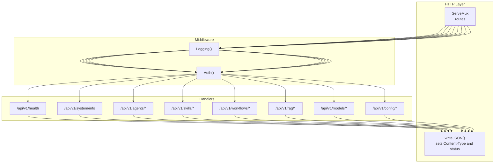
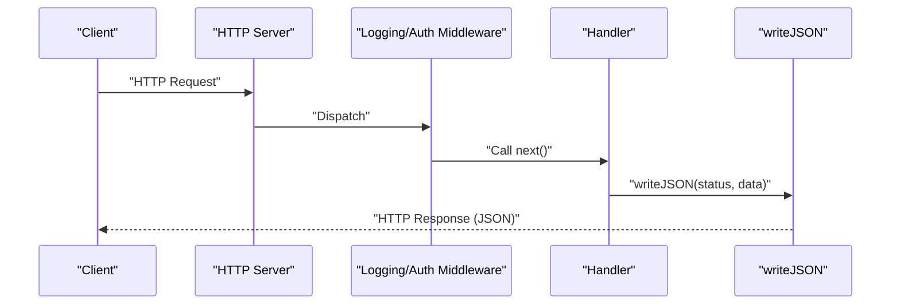
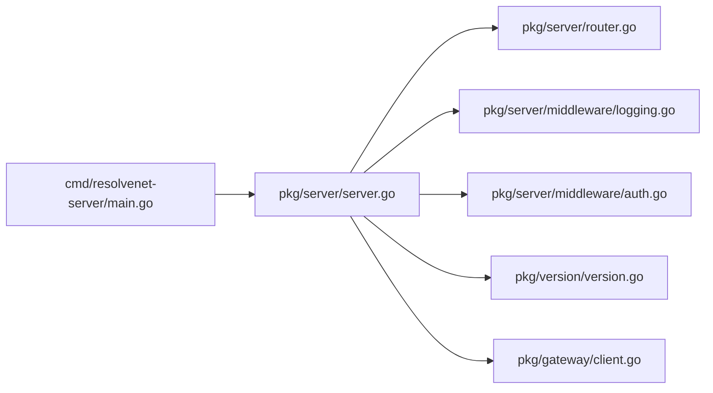

# Error Handling and Status Codes

<cite>
**Referenced Files in This Document**
- [router.go](file://pkg/server/router.go)
- [auth.go](file://pkg/server/middleware/auth.go)
- [logging.go](file://pkg/server/middleware/logging.go)
- [server.go](file://pkg/server/server.go)
- [main.go](file://cmd/resolvenet-server/main.go)
- [client.go](file://pkg/gateway/client.go)
- [version.go](file://pkg/version/version.go)
- [runbook-502.md](file://docs/demo/demo/rag/documents/runbook-502.md)
</cite>

## Table of Contents
1. [Introduction](#introduction)
2. [Project Structure](#project-structure)
3. [Core Components](#core-components)
4. [Architecture Overview](#architecture-overview)
5. [Detailed Component Analysis](#detailed-component-analysis)
6. [Dependency Analysis](#dependency-analysis)
7. [Performance Considerations](#performance-considerations)
8. [Troubleshooting Guide](#troubleshooting-guide)
9. [Conclusion](#conclusion)

## Introduction
This document defines standardized error handling and HTTP status code usage for ResolveNet’s API surface. It consolidates observed patterns from the server implementation and documents recommended error response formats, client handling strategies, and operational guidance for reliability and observability.

## Project Structure
The API server exposes REST endpoints under a single HTTP mux and logs request telemetry. Authentication middleware is present but currently a pass-through. The server also integrates gRPC health and reflection for diagnostics.

**Diagram sources**
- [router.go:10-55](file://pkg/server/router.go#L10-L55)
- [router.go:57-182](file://pkg/server/router.go#L57-L182)
- [logging.go:19-37](file://pkg/server/middleware/logging.go#L19-L37)
- [auth.go:8-17](file://pkg/server/middleware/auth.go#L8-L17)

**Section sources**
- [router.go:10-55](file://pkg/server/router.go#L10-L55)
- [router.go:57-182](file://pkg/server/router.go#L57-L182)
- [logging.go:19-37](file://pkg/server/middleware/logging.go#L19-L37)
- [auth.go:8-17](file://pkg/server/middleware/auth.go#L8-L17)

## Core Components
- HTTP handler routing and JSON responses
- Request logging middleware
- Authentication middleware (placeholder)
- Server orchestration and graceful shutdown

Key behaviors:
- Handlers consistently return JSON with a Content-Type header and an explicit HTTP status code.
- Some endpoints return 501 Not Implemented for stubbed functionality.
- Specific resource-not-found scenarios return 404 Not Found with a structured error payload containing identifiers.

**Section sources**
- [router.go:57-182](file://pkg/server/router.go#L57-L182)
- [logging.go:19-37](file://pkg/server/middleware/logging.go#L19-L37)
- [auth.go:8-17](file://pkg/server/middleware/auth.go#L8-L17)
- [server.go:54-103](file://pkg/server/server.go#L54-L103)

## Architecture Overview
The HTTP server registers routes and delegates to handlers. Middleware wraps handlers to log request telemetry. Responses are emitted via a shared JSON writer.

**Diagram sources**
- [router.go:10-55](file://pkg/server/router.go#L10-L55)
- [router.go:178-182](file://pkg/server/router.go#L178-L182)
- [logging.go:19-37](file://pkg/server/middleware/logging.go#L19-L37)
- [auth.go:8-17](file://pkg/server/middleware/auth.go#L8-L17)

## Detailed Component Analysis

### Handler Status Code Patterns
Observed patterns across handlers:
- 200 OK for successful listings and health/system info.
- 501 Not Implemented for endpoints not yet implemented.
- 404 Not Found for missing resources, including identifiers in the payload.

Recommended standardized error payload shape:
- error: string (human-readable summary)
- code: string (optional machine-readable error code)
- details: map (optional structured details)
- request_id: string (optional correlation ID)

Examples of current responses:
- Resource not found: includes an error field and a resource identifier.
- Not implemented: includes an error field indicating the endpoint is not implemented.

**Section sources**
- [router.go:57-67](file://pkg/server/router.go#L57-L67)
- [router.go:75-94](file://pkg/server/router.go#L75-L94)
- [router.go:79-82](file://pkg/server/router.go#L79-L82)
- [router.go:104-107](file://pkg/server/router.go#L104-L107)
- [router.go:121-124](file://pkg/server/router.go#L121-L124)
- [router.go:166-176](file://pkg/server/router.go#L166-L176)

### Authentication Middleware
Current behavior:
- Authentication middleware is a placeholder that forwards requests without validation.
- Future implementation should enforce JWT or API key validation and return 401 Unauthorized or 403 Forbidden accordingly.

Recommended statuses:
- 401 Unauthorized: missing, invalid, or expired credentials.
- 403 Forbidden: valid credentials but insufficient permissions.

**Section sources**
- [auth.go:8-17](file://pkg/server/middleware/auth.go#L8-L17)

### Logging Middleware
Behavior:
- Wraps the response writer to capture the status code.
- Logs method, path, status, duration, and remote address.

Observability recommendations:
- Include request_id in logs for cross-system correlation.
- Add structured fields for tenant_id, user_id, and endpoint group when available.

**Section sources**
- [logging.go:9-17](file://pkg/server/middleware/logging.go#L9-L17)
- [logging.go:28-34](file://pkg/server/middleware/logging.go#L28-L34)

### Server Lifecycle and Shutdown
Behavior:
- Starts both HTTP and gRPC servers concurrently.
- Graceful shutdown stops gRPC immediately and shuts down HTTP gracefully.
- Errors during startup or serving are propagated.

Operational guidance:
- Ensure clients handle transient connection drops during graceful shutdown.
- Implement idempotent retries for critical operations.

**Section sources**
- [server.go:54-103](file://pkg/server/server.go#L54-L103)

### Version and System Info
Behavior:
- System info endpoint returns version metadata.
- Health endpoint returns a simple status.

Recommendations:
- Include a revision/build timestamp in production builds.
- Consider adding a readiness probe alongside the health endpoint.

**Section sources**
- [router.go:61-67](file://pkg/server/router.go#L61-L67)
- [version.go:8-19](file://pkg/version/version.go#L8-L19)

## Dependency Analysis

**Diagram sources**
- [main.go:16-55](file://cmd/resolvenet-server/main.go#L16-L55)
- [server.go:27-52](file://pkg/server/server.go#L27-L52)
- [router.go:10-55](file://pkg/server/router.go#L10-L55)
- [logging.go:19-37](file://pkg/server/middleware/logging.go#L19-L37)
- [auth.go:8-17](file://pkg/server/middleware/auth.go#L8-L17)
- [version.go:8-19](file://pkg/version/version.go#L8-L19)
- [client.go:16-30](file://pkg/gateway/client.go#L16-L30)

**Section sources**
- [main.go:16-55](file://cmd/resolvenet-server/main.go#L16-L55)
- [server.go:27-52](file://pkg/server/server.go#L27-L52)
- [router.go:10-55](file://pkg/server/router.go#L10-L55)
- [logging.go:19-37](file://pkg/server/middleware/logging.go#L19-L37)
- [auth.go:8-17](file://pkg/server/middleware/auth.go#L8-L17)
- [version.go:8-19](file://pkg/version/version.go#L8-L19)
- [client.go:16-30](file://pkg/gateway/client.go#L16-L30)

## Performance Considerations
- Keep error payloads minimal to reduce bandwidth and parsing overhead.
- Prefer 429 Too Many Requests for rate-limiting scenarios to enable client backoff strategies.
- Use structured logging to avoid expensive string formatting in hot paths.
- Implement circuit breakers upstream for transient failures.

## Troubleshooting Guide

### HTTP Status Code Reference
- 200 OK: Successful operation (e.g., health, listings).
- 404 Not Found: Resource not found; includes an error field and resource identifier.
- 501 Not Implemented: Endpoint not implemented; includes an error field.

Note: The current implementation does not consistently return 401/403 for auth failures because authentication middleware is a placeholder. Plan to implement proper auth enforcement and return 401/403 as documented above.

**Section sources**
- [router.go:75-94](file://pkg/server/router.go#L75-L94)
- [router.go:79-82](file://pkg/server/router.go#L79-L82)
- [router.go:104-107](file://pkg/server/router.go#L104-L107)
- [router.go:121-124](file://pkg/server/router.go#L121-L124)
- [router.go:166-176](file://pkg/server/router.go#L166-L176)
- [auth.go:8-17](file://pkg/server/middleware/auth.go#L8-L17)

### Client-Side Handling Patterns
- Retry strategy:
  - Exponential backoff with jitter for 5xx and 429.
  - Immediate retry for 503 (service unavailable) if applicable to the operation.
  - Fail fast for 4xx except 408 Request Timeout and 429 Too Many Requests.
- Idempotency:
  - Mark operations idempotent when safe to retry (GET, HEAD, etc.) or implement client-side deduplication.
- Circuit breaker:
  - Open after N consecutive failures to protect upstream systems.
- Correlation:
  - Capture request_id from logs for end-to-end tracing.

### Rate Limiting and Maintenance Mode
- 429 Too Many Requests: Use Retry-After header when available.
- 503 Service Unavailable: Indicate maintenance or overload; include a Retry-After header.
- Graceful degradation:
  - Fall back to cached data or reduced functionality when upstream is degraded.
  - Prioritize critical paths and shed non-essential workloads.

### Error Monitoring, Logging, and Debugging Best Practices
- Centralized logging:
  - Emit structured logs with severity, module, and request_id.
  - Index by endpoint, status, and duration for alerting.
- Observability:
  - Instrument latency histograms and error counters per endpoint.
  - Correlate logs with traces for complex requests.
- Debugging:
  - Include stack traces for internal errors (5xx) only in controlled environments.
  - Provide a debug flag to include additional context without leaking secrets.

### Operational Runbooks
- 502 Bad Gateway:
  - Validate upstream service health and connectivity.
  - Confirm proxy/gateway configuration and timeouts.
  - Apply temporary traffic redirection or circuit breaking.

**Section sources**
- [runbook-502.md:1-58](file://docs/demo/demo/rag/documents/runbook-502.md#L1-L58)

## Conclusion
ResolveNet’s current API surfaces a consistent JSON response pattern and logging behavior. To achieve robust error handling:
- Implement authentication middleware to return 401/403.
- Standardize error payloads with error, code, and optional details.
- Adopt 429/503 for rate limiting and maintenance.
- Strengthen client-side retry/backoff and circuit-breaking logic.
- Enhance observability with request_id correlation and structured telemetry.