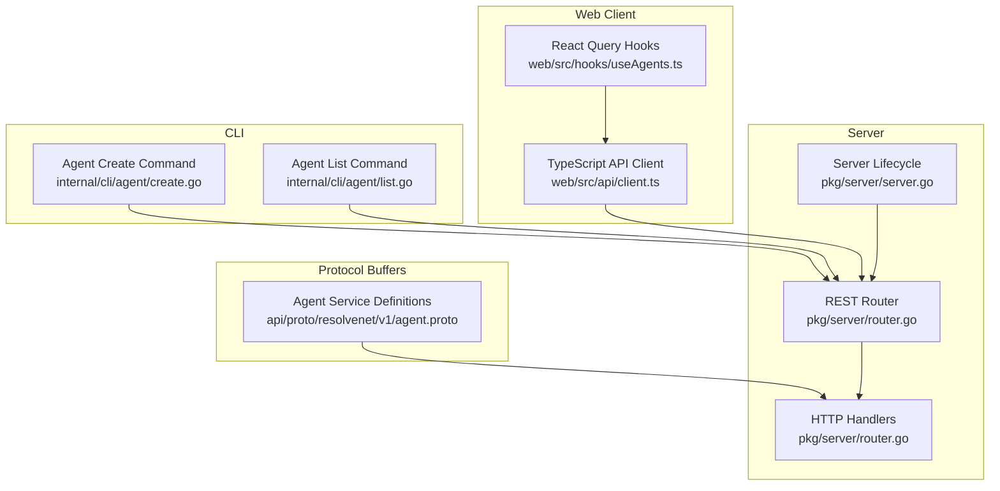
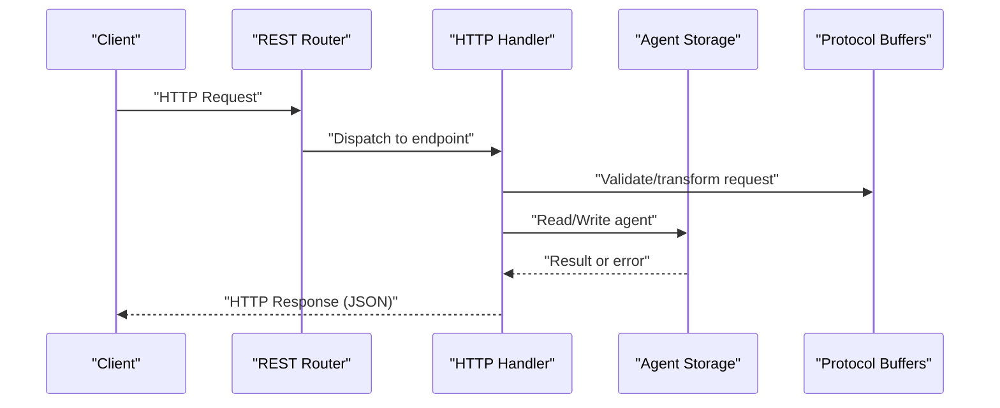
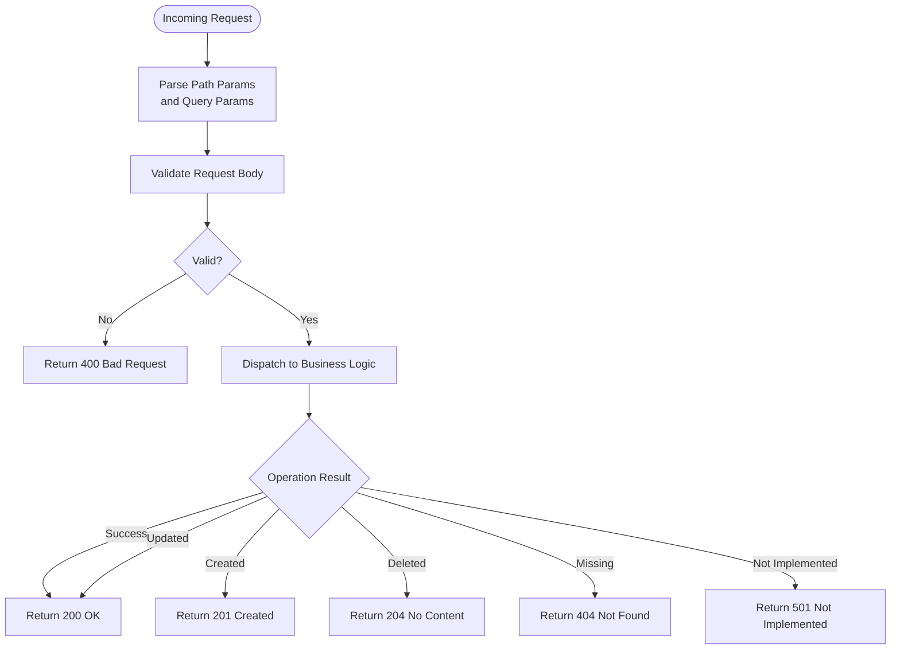
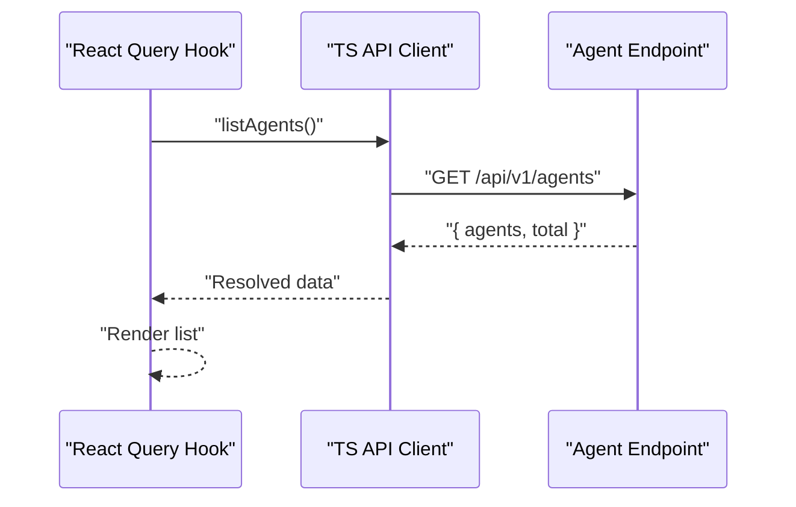
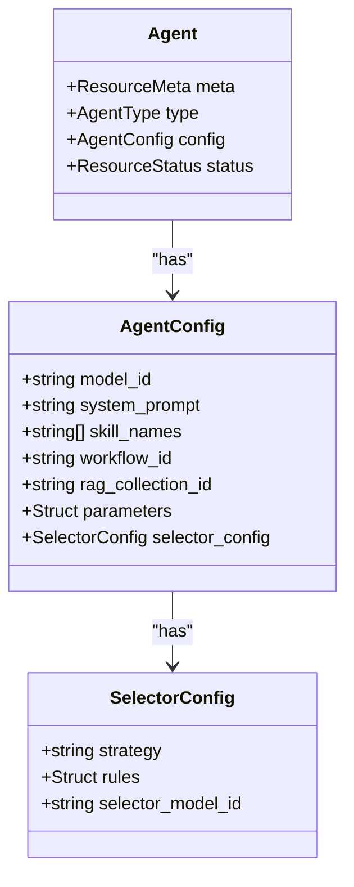
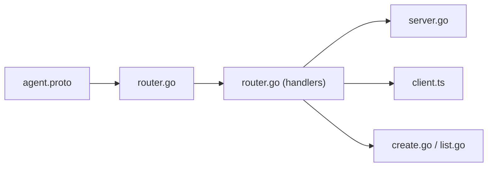

# Agent Management Endpoints

<cite>
**Referenced Files in This Document**
- [README.md](file://README.md)
- [router.go](file://pkg/server/router.go)
- [server.go](file://pkg/server/server.go)
- [client.ts](file://web/src/api/client.ts)
- [useAgents.ts](file://web/src/hooks/useAgents.ts)
- [agent.proto](file://api/proto/resolvenet/v1/agent.proto)
- [agent-example.yaml](file://configs/examples/agent-example.yaml)
- [create.go](file://internal/cli/agent/create.go)
- [list.go](file://internal/cli/agent/list.go)
</cite>

## Table of Contents
1. [Introduction](#introduction)
2. [Project Structure](#project-structure)
3. [Core Components](#core-components)
4. [Architecture Overview](#architecture-overview)
5. [Detailed Component Analysis](#detailed-component-analysis)
6. [Dependency Analysis](#dependency-analysis)
7. [Performance Considerations](#performance-considerations)
8. [Troubleshooting Guide](#troubleshooting-guide)
9. [Conclusion](#conclusion)
10. [Appendices](#appendices)

## Introduction
This document provides comprehensive REST API documentation for agent management endpoints in the platform. It covers all CRUD operations for agents, including listing, creating, retrieving, updating, deleting, and executing agents. It also documents request/response schemas, path/query parameters, status codes, error handling, and client implementation examples for Go, Python, and JavaScript/TypeScript.

The platform exposes a REST API surface under /api/v1 with dedicated endpoints for agents, skills, workflows, RAG collections, models, and configuration. Agent management endpoints are defined in the server router and mapped to handler functions. The underlying protocol buffer definitions describe the canonical agent model and execution semantics.

**Section sources**
- [README.md:10-46](file://README.md#L10-L46)

## Project Structure
The agent management API is implemented in the Go server package and consumed by the WebUI client. The key components are:
- REST router registering agent endpoints
- Handler stubs implementing the HTTP endpoints
- Protocol buffer service definitions describing agent data structures
- Web client bindings for TypeScript/React
- CLI commands for agent operations

**Diagram sources**
- [router.go:10-55](file://pkg/server/router.go#L10-L55)
- [server.go:27-52](file://pkg/server/server.go#L27-L52)
- [agent.proto:11-29](file://api/proto/resolvenet/v1/agent.proto#L11-L29)
- [client.ts:20-48](file://web/src/api/client.ts#L20-L48)
- [useAgents.ts:1-28](file://web/src/hooks/useAgents.ts#L1-L28)
- [create.go:9-31](file://internal/cli/agent/create.go#L9-L31)
- [list.go:9-28](file://internal/cli/agent/list.go#L9-L28)

**Section sources**
- [router.go:10-55](file://pkg/server/router.go#L10-L55)
- [server.go:27-52](file://pkg/server/server.go#L27-L52)

## Core Components
This section documents the agent management endpoints, their request/response schemas, and error handling behavior.

### Endpoint Catalog
- GET /api/v1/agents
  - Purpose: List agents with optional pagination and filters
  - Path parameters: None
  - Query parameters: pagination, type_filter, status_filter
  - Response: ListAgentsResponse with agents array and pagination metadata
  - Status codes: 200 OK, 501 Not Implemented (current handler stub)
- POST /api/v1/agents
  - Purpose: Create a new agent
  - Path parameters: None
  - Request body: CreateAgentRequest containing agent definition
  - Response: Agent object
  - Status codes: 201 Created, 400 Bad Request, 501 Not Implemented (current handler stub)
- GET /api/v1/agents/{id}
  - Purpose: Retrieve an agent by ID
  - Path parameters: id (agent identifier)
  - Query parameters: None
  - Response: Agent object
  - Status codes: 200 OK, 404 Not Found (current handler stub)
- PUT /api/v1/agents/{id}
  - Purpose: Update an existing agent
  - Path parameters: id (agent identifier)
  - Request body: UpdateAgentRequest containing updated agent definition
  - Response: Agent object
  - Status codes: 200 OK, 404 Not Found, 501 Not Implemented (current handler stub)
- DELETE /api/v1/agents/{id}
  - Purpose: Delete an agent
  - Path parameters: id (agent identifier)
  - Query parameters: None
  - Response: Empty on success
  - Status codes: 204 No Content, 501 Not Implemented (current handler stub)
- POST /api/v1/agents/{id}/execute
  - Purpose: Execute an agent with input and optional context
  - Path parameters: id (agent identifier)
  - Request body: ExecuteAgentRequest with input, conversation_id, and context
  - Response: Streaming response with content, events, or errors
  - Status codes: 200 OK, 404 Not Found, 501 Not Implemented (current handler stub)

### Request/Response Schemas
Agent model and related messages are defined in the protocol buffer specification. The canonical schemas are:

- Agent
  - Fields: meta, type, config, status
- AgentConfig
  - Fields: model_id, system_prompt, skill_names, workflow_id, rag_collection_id, parameters, selector_config
- SelectorConfig
  - Fields: strategy, rules, selector_model_id
- CreateAgentRequest
  - Fields: agent (Agent)
- GetAgentRequest
  - Fields: id (string)
- ListAgentsRequest
  - Fields: pagination, type_filter, status_filter
- ListAgentsResponse
  - Fields: agents (repeated Agent), pagination
- UpdateAgentRequest
  - Fields: agent (Agent)
- DeleteAgentRequest
  - Fields: id (string)
- ExecuteAgentRequest
  - Fields: agent_id, input, conversation_id, context
- ExecuteAgentResponse
  - Fields: response (oneof: content, event, error)
- ExecutionEvent
  - Fields: type, message, data, timestamp
- ExecutionError
  - Fields: code, message

These definitions establish the canonical data structures for agent configuration and execution.

**Section sources**
- [agent.proto:41-122](file://api/proto/resolvenet/v1/agent.proto#L41-L122)
- [agent.proto:124-176](file://api/proto/resolvenet/v1/agent.proto#L124-L176)

### Error Handling
Current handler stubs return standardized JSON error responses:
- 404 Not Found for missing resources (e.g., GET /api/v1/agents/{id})
- 501 Not Implemented for endpoints not yet implemented (e.g., POST /api/v1/agents)
- 400 Bad Request for invalid requests (validation errors)

Future implementations should expand these to include:
- Validation errors with field-specific details
- Execution failures with structured error codes and messages
- Proper HTTP status code mapping aligned with request semantics

**Section sources**
- [router.go:71-94](file://pkg/server/router.go#L71-L94)

## Architecture Overview
The agent management API follows a layered architecture:
- HTTP transport layer registers routes and delegates to handlers
- Handlers process requests, validate parameters, and marshal responses
- Protocol buffers define the canonical data model for agents and executions
- Web client consumes the API using typed bindings and React Query
- CLI commands demonstrate programmatic usage

**Diagram sources**
- [router.go:11-24](file://pkg/server/router.go#L11-L24)
- [server.go:44-49](file://pkg/server/server.go#L44-L49)
- [agent.proto:68-102](file://api/proto/resolvenet/v1/agent.proto#L68-L102)

## Detailed Component Analysis

### REST Router and Handlers
The router registers agent endpoints and delegates to handler functions. Current handlers are stubs that return placeholder responses. Implementations should:
- Parse path parameters and query parameters
- Validate request bodies against protocol buffer schemas
- Interact with the agent registry/store
- Stream execution responses for execute endpoint
- Return appropriate HTTP status codes

**Diagram sources**
- [router.go:11-24](file://pkg/server/router.go#L11-L24)
- [router.go:71-94](file://pkg/server/router.go#L71-L94)

**Section sources**
- [router.go:11-24](file://pkg/server/router.go#L11-L24)
- [router.go:71-94](file://pkg/server/router.go#L71-L94)

### Web Client API Bindings
The WebUI provides a TypeScript client with typed endpoints and React Query hooks:
- Base URL: /api/v1
- Endpoints: listAgents, getAgent, createAgent, deleteAgent
- Types: Agent, CreateAgentRequest, and others
- Error handling: Throws on non-OK responses with parsed error messages

**Diagram sources**
- [client.ts:24-28](file://web/src/api/client.ts#L24-L28)
- [useAgents.ts:4-8](file://web/src/hooks/useAgents.ts#L4-L8)

**Section sources**
- [client.ts:20-48](file://web/src/api/client.ts#L20-L48)
- [useAgents.ts:1-28](file://web/src/hooks/useAgents.ts#L1-L28)

### Protocol Buffer Model
The agent model is defined in the protocol buffer specification. The Agent message encapsulates:
- Resource metadata (meta)
- Agent type enumeration
- Configuration object (AgentConfig)
- Status information

AgentConfig includes:
- Model identifier
- System prompt
- Skill names
- Workflow identifier
- RAG collection identifier
- Arbitrary parameters
- Selector configuration

SelectorConfig supports:
- Routing strategy
- Rule-based configuration
- Selector model identifier

**Diagram sources**
- [agent.proto:41-65](file://api/proto/resolvenet/v1/agent.proto#L41-L65)
- [agent.proto:49-65](file://api/proto/resolvenet/v1/agent.proto#L49-L65)

**Section sources**
- [agent.proto:41-65](file://api/proto/resolvenet/v1/agent.proto#L41-L65)

### CLI Agent Commands
The CLI provides commands for agent management:
- agent create: Creates an agent with type, model, prompt, and optional file
- agent list: Lists agents with filtering and output format options

These commands demonstrate expected payload structures and flags for agent creation.

**Section sources**
- [create.go:9-31](file://internal/cli/agent/create.go#L9-L31)
- [list.go:9-28](file://internal/cli/agent/list.go#L9-L28)

## Dependency Analysis
The agent management API depends on:
- Protocol buffer service definitions for canonical schemas
- Server router for endpoint registration
- HTTP handlers for request processing
- Web client for consumption
- CLI for operational tasks

**Diagram sources**
- [agent.proto:11-29](file://api/proto/resolvenet/v1/agent.proto#L11-L29)
- [router.go:11-24](file://pkg/server/router.go#L11-L24)
- [server.go:44-49](file://pkg/server/server.go#L44-L49)
- [client.ts:20-48](file://web/src/api/client.ts#L20-L48)
- [create.go:9-31](file://internal/cli/agent/create.go#L9-L31)
- [list.go:9-28](file://internal/cli/agent/list.go#L9-L28)

**Section sources**
- [router.go:11-24](file://pkg/server/router.go#L11-L24)
- [server.go:44-49](file://pkg/server/server.go#L44-L49)

## Performance Considerations
- Use pagination for list endpoints to limit response sizes
- Implement efficient filtering on the server side
- For execution endpoints, consider streaming responses to reduce latency
- Cache frequently accessed agent metadata
- Monitor request rates and implement rate limiting at the gateway level

## Troubleshooting Guide
Common issues and resolutions:
- 404 Not Found: Verify the agent ID exists and is correctly formatted
- 501 Not Implemented: Expect this during development; implement the handler
- 400 Bad Request: Check request body against protocol buffer schemas
- Network errors: Confirm server is running and reachable at the configured address

**Section sources**
- [router.go:71-94](file://pkg/server/router.go#L71-L94)

## Conclusion
The agent management API provides a comprehensive set of endpoints for lifecycle and execution operations. While current handlers are stubs, the protocol buffer definitions and client bindings establish a clear foundation for implementation. Future work should focus on completing handler implementations, adding robust validation, and enabling streaming execution responses.

## Appendices

### Client Implementation Examples

#### Go
Use net/http or a higher-level HTTP client to call the endpoints. Example patterns:
- GET /api/v1/agents: parse JSON response into a slice of agent structs
- POST /api/v1/agents: serialize agent config to JSON and send with Content-Type application/json
- GET /api/v1/agents/{id}: extract ID from path and handle 404 responses
- PUT /api/v1/agents/{id}: send updated agent config
- DELETE /api/v1/agents/{id}: handle 204 responses
- POST /api/v1/agents/{id}/execute: stream response for long-running executions

#### Python
Use requests or aiohttp to interact with the API:
- GET /api/v1/agents: requests.get(base_url + "/agents").json()
- POST /api/v1/agents: requests.post(base_url + "/agents", json=payload).json()
- GET /api/v1/agents/{id}: requests.get(f"{base_url}/agents/{id}").json()
- PUT /api/v1/agents/{id}: requests.put(f"{base_url}/agents/{id}", json=payload).json()
- DELETE /api/v1/agents/{id}: requests.delete(f"{base_url}/agents/{id}")
- POST /api/v1/agents/{id}/execute: stream response and process content/event/error

#### JavaScript/TypeScript
Use fetch or a library like axios:
- GET /api/v1/agents: fetch("/api/v1/agents").then(r => r.json())
- POST /api/v1/agents: fetch("/api/v1/agents", { method: "POST", body: JSON.stringify(payload), headers: { "Content-Type": "application/json" } }).then(r => r.json())
- GET /api/v1/agents/{id}: fetch(`/api/v1/agents/${id}`).then(r => r.json())
- PUT /api/v1/agents/{id}: fetch(`/api/v1/agents/${id}`, { method: "PUT", body: JSON.stringify(payload), headers: { "Content-Type": "application/json" } }).then(r => r.json())
- DELETE /api/v1/agents/{id}: fetch(`/api/v1/agents/${id}`, { method: "DELETE" })
- POST /api/v1/agents/{id}/execute: handle streaming response events

### Example Payloads
Agent creation payload structure (from CLI and YAML example):
- name: string
- type: string (e.g., "mega")
- model: string (e.g., "qwen-plus")
- system_prompt: optional string

Agent configuration object (from protocol buffer):
- model_id: string
- system_prompt: string
- skill_names: array of strings
- workflow_id: optional string
- rag_collection_id: optional string
- parameters: arbitrary JSON object
- selector_config: object with strategy, rules, selector_model_id

**Section sources**
- [create.go:25-28](file://internal/cli/agent/create.go#L25-L28)
- [agent-example.yaml:3-17](file://configs/examples/agent-example.yaml#L3-L17)
- [agent.proto:49-65](file://api/proto/resolvenet/v1/agent.proto#L49-L65)