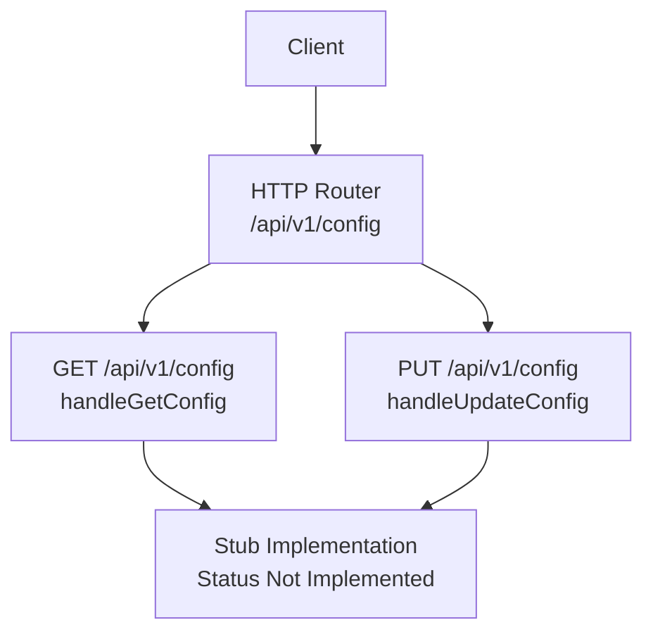
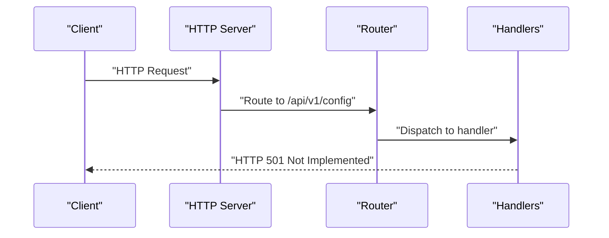
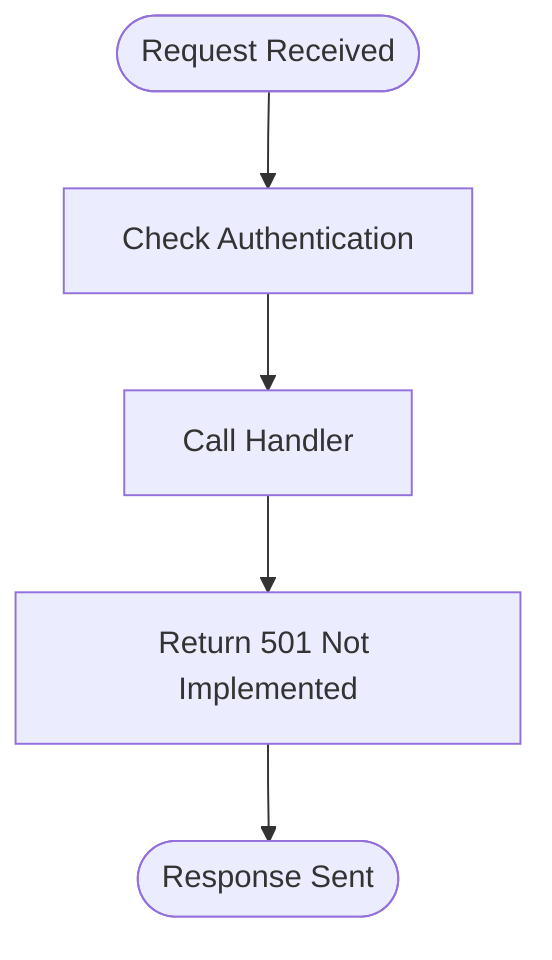
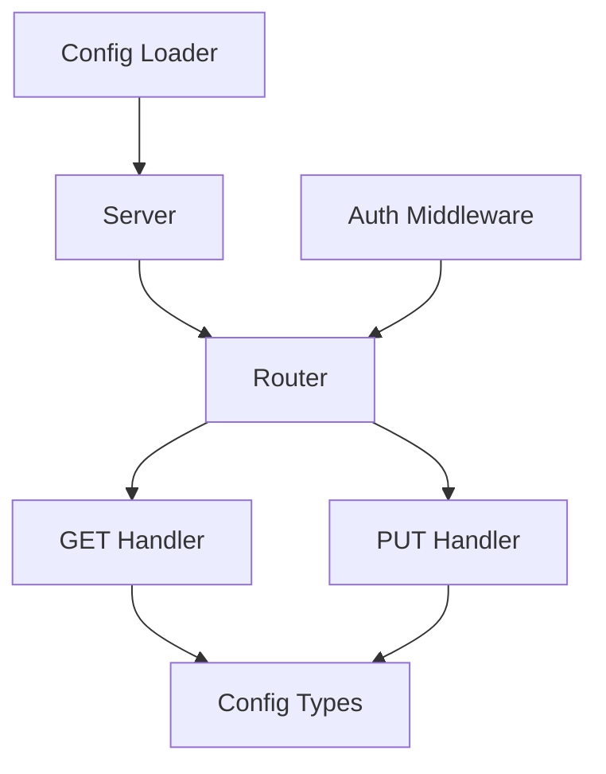

# Configuration Endpoints

<cite>
**Referenced Files in This Document**
- [router.go](file://pkg/server/router.go)
- [server.go](file://pkg/server/server.go)
- [auth.go](file://pkg/server/middleware/auth.go)
- [config.go](file://pkg/config/config.go)
- [types.go](file://pkg/config/types.go)
- [resolvenet.yaml](file://configs/resolvenet.yaml)
- [runtime.yaml](file://configs/runtime.yaml)
- [main.go](file://cmd/resolvenet-server/main.go)
</cite>

## Table of Contents
1. [Introduction](#introduction)
2. [Project Structure](#project-structure)
3. [Core Components](#core-components)
4. [Architecture Overview](#architecture-overview)
5. [Detailed Component Analysis](#detailed-component-analysis)
6. [Dependency Analysis](#dependency-analysis)
7. [Performance Considerations](#performance-considerations)
8. [Troubleshooting Guide](#troubleshooting-guide)
9. [Conclusion](#conclusion)

## Introduction
This document specifies the REST API for configuration management endpoints. It covers the GET and PUT operations for retrieving and updating platform configuration, including request/response schemas, path/query parameters, status codes, and client implementation guidance. The endpoints are currently in stub implementation and return "not implemented" responses.

## Project Structure
The configuration management endpoints are part of the HTTP API server:
- Routes are registered in the server router
- Handlers are currently stubbed and return "not implemented"
- Configuration models are defined in the config package
- Example configuration files demonstrate the configuration structure

**Diagram sources**
- [router.go:52-55](file://pkg/server/router.go#L52-L55)
- [router.go:170-176](file://pkg/server/router.go#L170-L176)

**Section sources**
- [router.go:52-55](file://pkg/server/router.go#L52-L55)
- [router.go:170-176](file://pkg/server/router.go#L170-L176)

## Core Components
- Configuration data model: Defines the structure of the configuration object returned by GET /api/v1/config
- Configuration loading: Viper-based configuration loading with file and environment overrides
- HTTP server: Exposes REST endpoints with basic authentication middleware
- Example configurations: Provide reference structures for platform and runtime settings

**Section sources**
- [types.go:3-70](file://pkg/config/types.go#L3-L70)
- [config.go:10-62](file://pkg/config/config.go#L10-L62)
- [resolvenet.yaml:1-34](file://configs/resolvenet.yaml#L1-L34)
- [runtime.yaml:1-18](file://configs/runtime.yaml#L1-L18)

## Architecture Overview
The configuration endpoints integrate with the HTTP server and authentication middleware. The current implementation routes requests to stub handlers that return "not implemented".

**Diagram sources**
- [router.go:52-55](file://pkg/server/router.go#L52-L55)
- [router.go:170-176](file://pkg/server/router.go#L170-L176)

## Detailed Component Analysis

### Endpoint Specifications

#### GET /api/v1/config
- Purpose: Retrieve the current platform configuration
- Authentication: Currently passes through middleware (no validation implemented)
- Path Parameters: None
- Query Parameters: None
- Request Body: None
- Response Codes:
  - 200 OK: Returns configuration object
  - 501 Not Implemented: Current stub response
- Response Body Schema: Configuration object (see Configuration Object Schema)

#### PUT /api/v1/config
- Purpose: Update platform configuration
- Authentication: Currently passes through middleware (no validation implemented)
- Path Parameters: None
- Query Parameters: None
- Request Body: Partial or full configuration object
- Response Codes:
  - 200 OK: Configuration updated successfully
  - 400 Bad Request: Validation failed
  - 501 Not Implemented: Current stub response
- Response Body Schema: Configuration object (see Configuration Object Schema)

### Configuration Object Schema
The configuration object consists of the following top-level sections:

- server: Server configuration
  - http_addr: string (default ":8080")
  - grpc_addr: string (default ":9090")

- database: Database configuration
  - host: string (default "localhost")
  - port: integer (default 5432)
  - user: string (default "resolvenet")
  - password: string (default "resolvenet")
  - dbname: string (default "resolvenet")
  - sslmode: string (default "disable")

- redis: Redis configuration
  - addr: string (default "localhost:6379")
  - db: integer (default 0)

- nats: NATS configuration
  - url: string (default "nats://localhost:4222")

- runtime: Runtime configuration
  - grpc_addr: string (default "localhost:9091")

- gateway: Gateway configuration
  - admin_url: string (default "http://localhost:8888")
  - enabled: boolean (default false)

- telemetry: Telemetry configuration
  - enabled: boolean (default false)
  - otlp_endpoint: string (default "localhost:4317")
  - service_name: string (default "resolvenet-platform")
  - metrics_enabled: boolean (default true)

### Environment Variables
Configuration can be overridden via environment variables with the prefix RESOLVENET and dot notation converted to underscore (e.g., RESOLVENET_SERVER_HTTP_ADDR).

**Section sources**
- [types.go:3-70](file://pkg/config/types.go#L3-L70)
- [config.go:44-47](file://pkg/config/config.go#L44-L47)
- [resolvenet.yaml:3-34](file://configs/resolvenet.yaml#L3-L34)

### Authentication and Middleware
- Authentication middleware currently allows all requests (placeholder implementation)
- Future implementation should validate JWT or API keys
- Middleware is applied globally to HTTP routes

**Section sources**
- [auth.go:8-17](file://pkg/server/middleware/auth.go#L8-L17)

### Server Initialization and Routing
- HTTP server listens on address from configuration
- Routes are registered during server initialization
- Both GET and PUT handlers are registered for /api/v1/config

**Section sources**
- [server.go:54-52](file://pkg/server/server.go#L54-L52)
- [router.go:52-55](file://pkg/server/router.go#L52-L55)

### Client Implementation Examples

#### Example 1: Retrieving Configuration
- Method: GET
- URL: http://localhost:8080/api/v1/config
- Headers: Content-Type: application/json
- Response Processing: Parse JSON body as configuration object

#### Example 2: Updating Configuration
- Method: PUT
- URL: http://localhost:8080/api/v1/config
- Headers: Content-Type: application/json
- Request Body: Partial or full configuration object
- Response Processing: Handle 200 OK with updated configuration or 400 Bad Request with validation errors

#### Example 3: With Authentication (Future)
- Add Authorization header with JWT or API key
- Ensure server-side authentication middleware validates credentials

**Section sources**
- [router.go:52-55](file://pkg/server/router.go#L52-L55)

### Current Handler Behavior
Both GET and PUT handlers currently return HTTP 501 Not Implemented with an error message indicating the endpoint is not implemented.

**Diagram sources**
- [router.go:170-176](file://pkg/server/router.go#L170-L176)

**Section sources**
- [router.go:170-176](file://pkg/server/router.go#L170-L176)

## Dependency Analysis
The configuration endpoints depend on:
- HTTP router registration
- Server initialization with configuration
- Authentication middleware
- Configuration data models

**Diagram sources**
- [router.go:52-55](file://pkg/server/router.go#L52-L55)
- [server.go:27-52](file://pkg/server/server.go#L27-L52)
- [auth.go:8-17](file://pkg/server/middleware/auth.go#L8-L17)
- [config.go:10-62](file://pkg/config/config.go#L10-L62)

**Section sources**
- [router.go:52-55](file://pkg/server/router.go#L52-L55)
- [server.go:27-52](file://pkg/server/server.go#L27-L52)
- [auth.go:8-17](file://pkg/server/middleware/auth.go#L8-L17)
- [config.go:10-62](file://pkg/config/config.go#L10-L62)

## Performance Considerations
- Configuration retrieval is lightweight and should complete quickly
- Updates may require validation and persistence; consider async processing for large updates
- Caching strategies can be implemented to avoid frequent disk writes

## Troubleshooting Guide
- 501 Not Implemented: Endpoints are not yet implemented; expect this response until implementation is complete
- Authentication Issues: Current middleware allows all requests; future validation will require proper credentials
- Configuration Loading: Verify configuration file location and environment variable overrides

**Section sources**
- [router.go:170-176](file://pkg/server/router.go#L170-L176)
- [auth.go:12-14](file://pkg/server/middleware/auth.go#L12-L14)
- [config.go:49-62](file://pkg/config/config.go#L49-L62)

## Conclusion
The configuration management endpoints provide a foundation for retrieving and updating platform configuration. While currently in stub implementation, the underlying data models and server infrastructure are established. Future implementation should focus on robust validation, secure authentication, and reliable persistence of configuration changes.