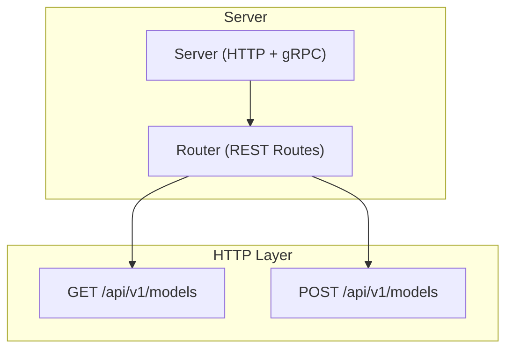
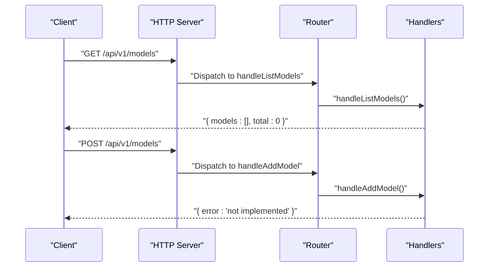
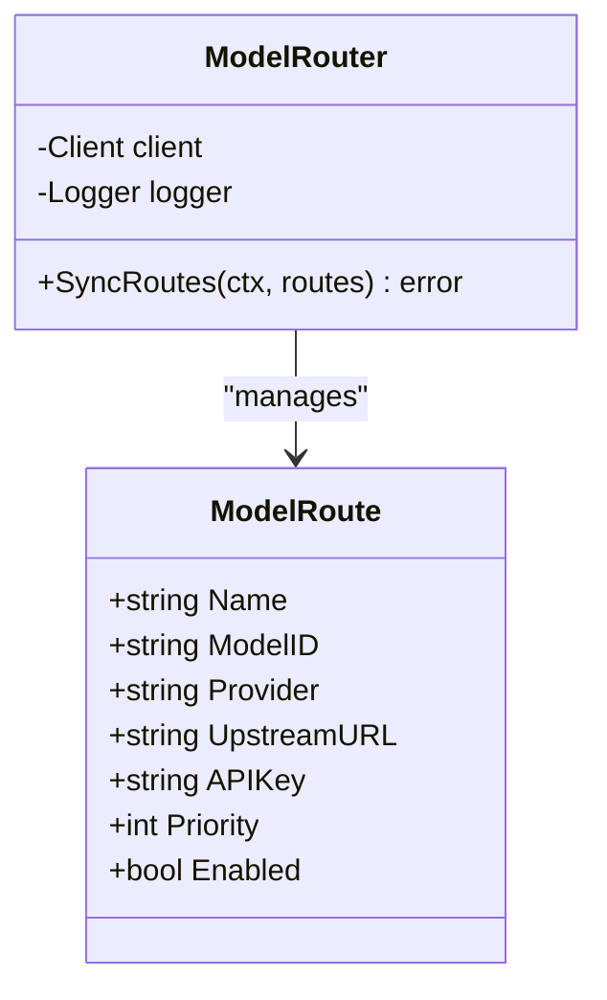
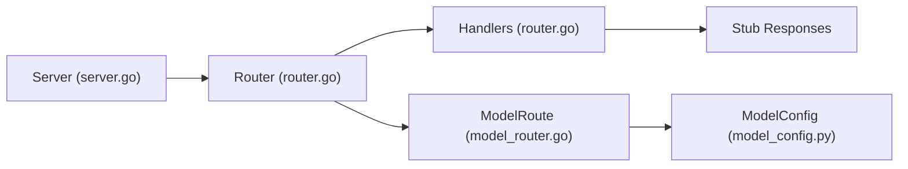

# Model Management Endpoints

<cite>
**Referenced Files in This Document**
- [router.go](file://pkg/server/router.go)
- [server.go](file://pkg/server/server.go)
- [client.ts](file://web/src/api/client.ts)
- [model_config.py](file://python/src/resolvenet/llm/model_config.py)
- [models.yaml](file://configs/models.yaml)
- [model_router.go](file://pkg/gateway/model_router.go)
- [client.go](file://pkg/gateway/client.go)
</cite>

## Table of Contents
1. [Introduction](#introduction)
2. [Project Structure](#project-structure)
3. [Core Components](#core-components)
4. [Architecture Overview](#architecture-overview)
5. [Detailed Component Analysis](#detailed-component-analysis)
6. [Dependency Analysis](#dependency-analysis)
7. [Performance Considerations](#performance-considerations)
8. [Troubleshooting Guide](#troubleshooting-guide)
9. [Conclusion](#conclusion)
10. [Appendices](#appendices)

## Introduction
This document describes the REST API for model management endpoints. It covers the current stub implementation for listing and adding models, the intended request/response schemas, and client usage patterns. The endpoints are:
- GET /api/v1/models: List models
- POST /api/v1/models: Add a model

Note: The add-model endpoint is currently a stub returning a not implemented response. The listing endpoint returns an empty list with a total count of zero.

## Project Structure
The model management endpoints are part of the HTTP server routing layer. The server initializes HTTP and gRPC servers and registers REST routes, including model endpoints.

**Diagram sources**
- [server.go:44-51](file://pkg/server/server.go#L44-L51)
- [router.go:48-51](file://pkg/server/router.go#L48-L51)

**Section sources**
- [server.go:44-51](file://pkg/server/server.go#L44-L51)
- [router.go:48-51](file://pkg/server/router.go#L48-L51)

## Core Components
- HTTP server initialization and route registration
- Model endpoints handler stubs
- Client-side API client for making requests

Key implementation references:
- Route registration for models: [router.go:48-51](file://pkg/server/router.go#L48-L51)
- Handler stubs for listing and adding models: [router.go:162-168](file://pkg/server/router.go#L162-L168)
- Server startup wiring HTTP mux: [server.go:44-49](file://pkg/server/server.go#L44-L49)
- Web client request wrapper: [client.ts:3-18](file://web/src/api/client.ts#L3-L18)

**Section sources**
- [router.go:48-51](file://pkg/server/router.go#L48-L51)
- [router.go:162-168](file://pkg/server/router.go#L162-L168)
- [server.go:44-49](file://pkg/server/server.go#L44-L49)
- [client.ts:3-18](file://web/src/api/client.ts#L3-L18)

## Architecture Overview
The model management endpoints are handled by the HTTP server’s ServeMux. The handlers currently return stubbed responses. The gateway module contains a model routing abstraction that aligns with model configuration structures.

**Diagram sources**
- [router.go:48-51](file://pkg/server/router.go#L48-L51)
- [router.go:162-168](file://pkg/server/router.go#L162-L168)

## Detailed Component Analysis

### Endpoint: GET /api/v1/models
- Purpose: Retrieve the list of registered models.
- Path: /api/v1/models
- Method: GET
- Query parameters: None (current stub)
- Response body:
  - models: array of model objects (currently empty)
  - total: integer count of models (currently 0)
- Status codes:
  - 200 OK: Successful retrieval of model list
- Example response shape:
  - {
      "models": [],
      "total": 0
    }

Current implementation:
- Handler: [router.go:162-164](file://pkg/server/router.go#L162-L164)

Client usage pattern (TypeScript):
- The web client wraps fetch with a shared base path and JSON handling: [client.ts:3-18](file://web/src/api/client.ts#L3-L18)
- Example call: request("/models") or via a typed wrapper similar to existing endpoints

**Section sources**
- [router.go:162-164](file://pkg/server/router.go#L162-L164)
- [client.ts:3-18](file://web/src/api/client.ts#L3-L18)

### Endpoint: POST /api/v1/models
- Purpose: Register or add a new model configuration.
- Path: /api/v1/models
- Method: POST
- Path parameters: None
- Query parameters: None
- Request body: Model configuration object (see schema below)
- Response body:
  - On success: Model registration confirmation (schema to be defined)
  - On failure: Error object (e.g., error message)
- Status codes:
  - 201 Created: Model successfully added
  - 501 Not Implemented: Endpoint not yet implemented (current stub)
  - 400 Bad Request: Invalid request payload
  - 409 Conflict: Duplicate model ID or conflict
  - 500 Internal Server Error: Unexpected server error

Current implementation:
- Handler: [router.go:166-168](file://pkg/server/router.go#L166-L168)

Client usage pattern (TypeScript):
- Use the shared request wrapper with method "POST" and JSON body: [client.ts:3-18](file://web/src/api/client.ts#L3-L18)
- Example call: request("/models", { method: "POST", body: JSON.stringify(modelConfig) })

**Section sources**
- [router.go:166-168](file://pkg/server/router.go#L166-L168)
- [client.ts:3-18](file://web/src/api/client.ts#L3-L18)

### Request/Response Schemas

#### Model Configuration Schema (POST /api/v1/models)
This schema defines the structure for registering a model. It aligns with the Python model configuration class and the YAML model registry.

- id: string (required)
- provider: string (enum: "qwen", "wenxin", "zhipu", "openai-compat"; required)
- model_name: string (required)
- api_key: string (optional)
- base_url: string (optional)
- default_temperature: number (optional, default 0.7)
- max_tokens: integer (optional, default 4096)
- extra: object (optional, free-form key-value pairs)

Example (conceptual):
- {
    "id": "custom-model",
    "provider": "openai-compat",
    "model_name": "gpt-4",
    "api_key": "sk-...",
    "base_url": "https://api.openai.com/v1",
    "default_temperature": 0.7,
    "max_tokens": 8192,
    "extra": { "routing_group": "premium" }
  }

Mapping to existing structures:
- Python model configuration class: [model_config.py:10-21](file://python/src/resolvenet/llm/model_config.py#L10-L21)
- YAML model registry examples: [models.yaml:3-31](file://configs/models.yaml#L3-L31)

#### Response Schema for GET /api/v1/models
- models: array of model configuration objects (empty in current stub)
- total: integer (count of models)

Example (conceptual):
- {
    "models": [
      {
        "id": "qwen-turbo",
        "provider": "qwen",
        "model_name": "qwen-turbo",
        "max_tokens": 8192,
        "default_temperature": 0.7
      }
    ],
    "total": 1
  }

#### Response Schema for POST /api/v1/models
- On success: Model registration confirmation (to be defined)
- On error: {
    "error": "string"
  }

Example (conceptual):
- {
    "error": "not implemented"
  }

**Section sources**
- [model_config.py:10-21](file://python/src/resolvenet/llm/model_config.py#L10-L21)
- [models.yaml:3-31](file://configs/models.yaml#L3-L31)
- [router.go:162-168](file://pkg/server/router.go#L162-L168)

### Client Implementation Examples

#### TypeScript (Web)
- Base request wrapper: [client.ts:3-18](file://web/src/api/client.ts#L3-L18)
- Example GET models:
  - Call: request("/models")
  - Response: { models: Model[], total: number }
- Example POST model:
  - Call: request("/models", { method: "POST", body: JSON.stringify(modelConfig) })
  - Handle errors via thrown error from request wrapper

#### Go (Server-side)
- The server uses a simple JSON writer for responses: [router.go:178-182](file://pkg/server/router.go#L178-L182)

Notes:
- The web client does not currently expose typed wrappers for models; mirror the pattern used for agents/workflows/skills in the same file: [client.ts:24-48](file://web/src/api/client.ts#L24-L48)

**Section sources**
- [client.ts:3-18](file://web/src/api/client.ts#L3-L18)
- [client.ts:24-48](file://web/src/api/client.ts#L24-L48)
- [router.go:178-182](file://pkg/server/router.go#L178-L182)

### Conceptual Overview
The model management feature integrates with the broader platform configuration and gateway routing. The gateway module defines a model route structure that mirrors model configuration, enabling dynamic routing to LLM providers.

**Diagram sources**
- [model_router.go:8-38](file://pkg/gateway/model_router.go#L8-L38)

**Section sources**
- [model_router.go:8-38](file://pkg/gateway/model_router.go#L8-L38)

## Dependency Analysis
- The HTTP server constructs a ServeMux and registers model routes: [server.go:44-49](file://pkg/server/server.go#L44-L49)
- Router maps endpoints to handler stubs: [router.go:48-51](file://pkg/server/router.go#L48-L51)
- Handlers return stub responses: [router.go:162-168](file://pkg/server/router.go#L162-L168)
- Gateway model routing structure aligns with model configuration: [model_router.go:8-17](file://pkg/gateway/model_router.go#L8-L17), [model_config.py:10-21](file://python/src/resolvenet/llm/model_config.py#L10-L21)

**Diagram sources**
- [server.go:44-49](file://pkg/server/server.go#L44-L49)
- [router.go:48-51](file://pkg/server/router.go#L48-L51)
- [router.go:162-168](file://pkg/server/router.go#L162-L168)
- [model_router.go:8-17](file://pkg/gateway/model_router.go#L8-L17)
- [model_config.py:10-21](file://python/src/resolvenet/llm/model_config.py#L10-L21)

**Section sources**
- [server.go:44-49](file://pkg/server/server.go#L44-L49)
- [router.go:48-51](file://pkg/server/router.go#L48-L51)
- [router.go:162-168](file://pkg/server/router.go#L162-L168)
- [model_router.go:8-17](file://pkg/gateway/model_router.go#L8-L17)
- [model_config.py:10-21](file://python/src/resolvenet/llm/model_config.py#L10-L21)

## Performance Considerations
- Current stub handlers return immediately; performance is not a concern.
- Future implementations should consider:
  - Efficient model listing with pagination support
  - Validation caching for provider credentials
  - Asynchronous model registration workflows

## Troubleshooting Guide
Common issues and resolutions:
- 501 Not Implemented on POST /api/v1/models:
  - Cause: Endpoint is not implemented yet.
  - Resolution: Implement model registration logic in the handler and update the response schema accordingly.
  - Reference: [router.go:166-168](file://pkg/server/router.go#L166-L168)
- Empty list on GET /api/v1/models:
  - Cause: No models registered or stub response.
  - Resolution: Populate the model registry or implement persistent storage.
  - Reference: [router.go:162-164](file://pkg/server/router.go#L162-L164)
- Client request failures:
  - Verify base path and JSON serialization in the client wrapper.
  - Reference: [client.ts:3-18](file://web/src/api/client.ts#L3-L18)

**Section sources**
- [router.go:162-168](file://pkg/server/router.go#L162-L168)
- [client.ts:3-18](file://web/src/api/client.ts#L3-L18)

## Conclusion
The model management endpoints are currently in stub implementation. GET /api/v1/models returns an empty list, and POST /api/v1/models returns a not implemented response. The request/response schemas are aligned with the existing Python model configuration and YAML registry. Clients should prepare for future schema updates and implement robust error handling for the not yet implemented endpoint.

## Appendices

### Appendix A: Endpoint Summary
- GET /api/v1/models
  - Method: GET
  - Body: none
  - Response: { models: Model[], total: number }
  - Status: 200 OK
- POST /api/v1/models
  - Method: POST
  - Body: Model configuration object
  - Response: Model registration confirmation or error
  - Status: 201 Created (planned), 501 Not Implemented (current)

### Appendix B: Related Structures
- Model configuration class: [model_config.py:10-21](file://python/src/resolvenet/llm/model_config.py#L10-L21)
- YAML model registry: [models.yaml:3-31](file://configs/models.yaml#L3-L31)
- Gateway model route: [model_router.go:8-17](file://pkg/gateway/model_router.go#L8-L17)