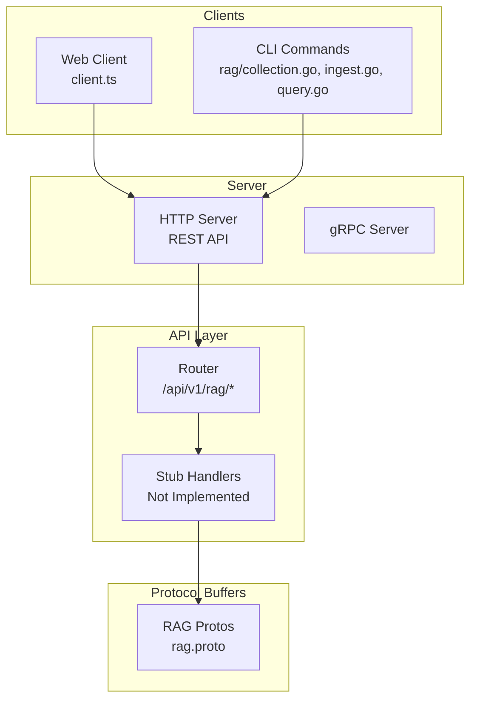
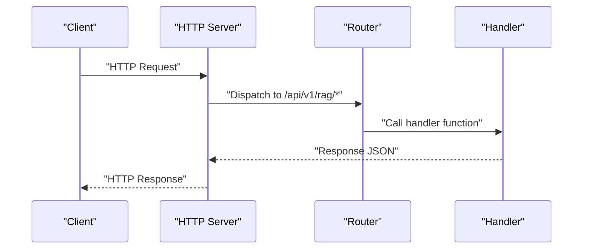
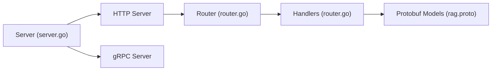

# RAG Management Endpoints

<cite>
**Referenced Files in This Document**
- [rag.proto](file://api/proto/resolvenet/v1/rag.proto)
- [router.go](file://pkg/server/router.go)
- [server.go](file://pkg/server/server.go)
- [client.ts](file://web/src/api/client.ts)
- [root.go](file://internal/cli/root.go)
- [collection.go](file://internal/cli/rag/collection.go)
- [ingest.go](file://internal/cli/rag/ingest.go)
- [query.go](file://internal/cli/rag/query.go)
</cite>

## Table of Contents
1. [Introduction](#introduction)
2. [Project Structure](#project-structure)
3. [Core Components](#core-components)
4. [Architecture Overview](#architecture-overview)
5. [Detailed Component Analysis](#detailed-component-analysis)
6. [Dependency Analysis](#dependency-analysis)
7. [Performance Considerations](#performance-considerations)
8. [Troubleshooting Guide](#troubleshooting-guide)
9. [Conclusion](#conclusion)

## Introduction
This document provides comprehensive REST API documentation for RAG (Retrieval-Augmented Generation) management endpoints. It covers collection and document operations, including listing, creating, deleting collections, ingesting documents, and querying collections. The specification defines request/response schemas, path parameters, content types, and status codes. It also includes practical client implementation examples for HTTP clients, multipart form handling, and response processing.

## Project Structure
The RAG REST API is exposed via HTTP endpoints registered in the server router and defined in protocol buffers. The frontend client library demonstrates usage patterns for fetching collections. The CLI provides command groups for RAG operations, and the server initializes both HTTP and gRPC servers.

**Diagram sources**
- [router.go:41-46](file://pkg/server/router.go#L41-L46)
- [server.go:44-49](file://pkg/server/server.go#L44-L49)
- [rag.proto:10-18](file://api/proto/resolvenet/v1/rag.proto#L10-L18)
- [client.ts:1](file://web/src/api/client.ts#L1-L1)
- [collection.go:10-31](file://internal/cli/rag/collection.go#L10-L31)

**Section sources**
- [router.go:41-46](file://pkg/server/router.go#L41-L46)
- [server.go:44-49](file://pkg/server/server.go#L44-L49)
- [rag.proto:10-18](file://api/proto/resolvenet/v1/rag.proto#L10-L18)
- [client.ts:1](file://web/src/api/client.ts#L1-L1)
- [collection.go:10-31](file://internal/cli/rag/collection.go#L10-L31)

## Core Components
This section defines the RAG REST API surface and the underlying protobuf models that describe request/response structures.

- Base URL: `/api/v1/rag`
- Content-Type: `application/json` for JSON payloads
- Path parameters:
  - `{id}`: Collection identifier (string)

Endpoints:
- GET `/api/v1/rag/collections`
  - Purpose: List collections with pagination
  - Response: `{"collections": [...], "total": number}`
- POST `/api/v1/rag/collections`
  - Purpose: Create a new collection
  - Request body: `{"collection": Collection}`
  - Response: `Collection`
- DELETE `/api/v1/rag/collections/{id}`
  - Purpose: Delete a collection by ID
  - Response: `{}` (empty object)
- POST `/api/v1/rag/collections/{id}/ingest`
  - Purpose: Ingest documents into a collection
  - Request body: `{"documents": [Document, ...]}`
  - Response: `{"documents_processed": number, "chunks_created": number, "errors": [string, ...]}`
- POST `/api/v1/rag/collections/{id}/query`
  - Purpose: Query a collection
  - Request body: `{"query": string, "top_k": number, "filters": {...}}`
  - Response: `{"chunks": [RetrievedChunk, ...]}`

Protobuf models:
- Collection
  - Fields: `meta`, `embedding_model`, `chunk_config`, `document_count`, `vector_count`, `status`
  - ChunkConfig
    - Fields: `strategy`, `chunk_size`, `chunk_overlap`
- Document
  - Fields: `id`, `title`, `content`, `content_type`, `metadata`
  - Content types: `"text/plain"`, `"text/markdown"`, `"application/pdf"`
- RetrievedChunk
  - Fields: `document_id`, `document_title`, `content`, `score`, `metadata`
- Query filters
  - Type: `google.protobuf.Struct` (arbitrary key-value filters)

Status codes:
- 200 OK: Successful operation
- 404 Not Found: Resource not found
- 501 Not Implemented: Endpoint not yet implemented in server stubs

**Section sources**
- [router.go:41-46](file://pkg/server/router.go#L41-L46)
- [rag.proto:20-98](file://api/proto/resolvenet/v1/rag.proto#L20-L98)

## Architecture Overview
The RAG REST API is served by the HTTP server, which registers routes and delegates to handler functions. The current implementation includes stub handlers that return "not implemented" responses. The gRPC server is initialized separately and is not used for REST endpoints.

**Diagram sources**
- [server.go:54-87](file://pkg/server/server.go#L54-L87)
- [router.go:41-46](file://pkg/server/router.go#L41-L46)

**Section sources**
- [server.go:54-87](file://pkg/server/server.go#L54-L87)
- [router.go:41-46](file://pkg/server/router.go#L41-L46)

## Detailed Component Analysis

### Endpoint: GET /api/v1/rag/collections
- Method: GET
- Path: `/api/v1/rag/collections`
- Purpose: Retrieve paginated collections
- Request parameters:
  - Pagination: Controlled by `PaginationRequest` (from common.proto)
- Response:
  - Body: `{"collections": [Collection, ...], "total": number}`
  - Status: 200 OK
  - Notes: Current stub returns empty collections array

Example request:
- curl -X GET http://localhost:8080/api/v1/rag/collections

Example response:
- 200 OK with collections array and total count

**Section sources**
- [router.go:42](file://pkg/server/router.go#L42)
- [router.go:142-144](file://pkg/server/router.go#L142-L144)

### Endpoint: POST /api/v1/rag/collections
- Method: POST
- Path: `/api/v1/rag/collections`
- Purpose: Create a new collection
- Request body:
  - `{"collection": Collection}`
  - Collection fields: `embedding_model`, `chunk_config`, `meta`, `status` (status may be ignored by server)
- Response:
  - Body: `Collection`
  - Status: 200 OK or 501 Not Implemented (stub)

Example request:
- curl -X POST http://localhost:8080/api/v1/rag/collections -H "Content-Type: application/json" -d '{"collection":{"embedding_model":"model-name","chunk_config":{"strategy":"sentence","chunk_size":500,"chunk_overlap":50}}}'

Example response:
- 200 OK with created Collection or 501 Not Implemented

**Section sources**
- [router.go:43](file://pkg/server/router.go#L43)
- [router.go:146-148](file://pkg/server/router.go#L146-L148)
- [rag.proto:20-28](file://api/proto/resolvenet/v1/rag.proto#L20-L28)

### Endpoint: DELETE /api/v1/rag/collections/{id}
- Method: DELETE
- Path: `/api/v1/rag/collections/{id}`
- Purpose: Delete a collection by ID
- Path parameters:
  - `id`: Collection identifier (string)
- Response:
  - Body: `{}` (empty object)
  - Status: 200 OK or 501 Not Implemented (stub)

Example request:
- curl -X DELETE http://localhost:8080/api/v1/rag/collections/<id>

Example response:
- 200 OK with empty body or 501 Not Implemented

**Section sources**
- [router.go:44](file://pkg/server/router.go#L44)
- [router.go:150-152](file://pkg/server/router.go#L150-L152)

### Endpoint: POST /api/v1/rag/collections/{id}/ingest
- Method: POST
- Path: `/api/v1/rag/collections/{id}/ingest`
- Purpose: Ingest documents into a collection
- Path parameters:
  - `id`: Collection identifier (string)
- Request body:
  - `{"documents": [Document, ...]}`
  - Document fields: `id`, `title`, `content`, `content_type`, `metadata`
  - Supported content types: `"text/plain"`, `"text/markdown"`, `"application/pdf"`
- Response:
  - Body: `{"documents_processed": number, "chunks_created": number, "errors": [string, ...]}`
  - Status: 200 OK or 501 Not Implemented (stub)

Notes on file uploads:
- The current stub does not implement ingestion logic. For production, implement multipart/form-data handling to accept files and parse content according to `content_type`.

Example request:
- curl -X POST http://localhost:8080/api/v1/rag/collections/<id>/ingest -H "Content-Type: application/json" -d '{"documents":[{"id":"doc1","title":"Doc 1","content":"...", "content_type":"text/plain"}]}'

Example response:
- 200 OK with statistics or 501 Not Implemented

**Section sources**
- [router.go:45](file://pkg/server/router.go#L45)
- [router.go:154-156](file://pkg/server/router.go#L154-L156)
- [rag.proto:36-43](file://api/proto/resolvenet/v1/rag.proto#L36-L43)

### Endpoint: POST /api/v1/rag/collections/{id}/query
- Method: POST
- Path: `/api/v1/rag/collections/{id}/query`
- Purpose: Query a collection
- Path parameters:
  - `id`: Collection identifier (string)
- Request body:
  - `{"query": string, "top_k": number, "filters": {...}}`
  - Filters: Arbitrary key-value pairs (`google.protobuf.Struct`)
- Response:
  - Body: `{"chunks": [RetrievedChunk, ...]}`
  - Status: 200 OK or 501 Not Implemented (stub)

Example request:
- curl -X POST http://localhost:8080/api/v1/rag/collections/<id>/query -H "Content-Type: application/json" -d '{"query":"What is RAG?","top_k":5}'

Example response:
- 200 OK with retrieved chunks or 501 Not Implemented

**Section sources**
- [router.go:46](file://pkg/server/router.go#L46)
- [router.go:158-160](file://pkg/server/router.go#L158-L160)
- [rag.proto:45-52](file://api/proto/resolvenet/v1/rag.proto#L45-L52)

### Client Implementation Examples

#### Using the Web Client Library
The web client library demonstrates a generic request wrapper that adds JSON content type and handles non-OK responses. It includes a convenience method for listing collections.

Key usage pattern:
- Construct request with `fetch` using base URL `/api/v1`
- Set `Content-Type: application/json`
- Parse JSON response or throw on non-OK status

Example: Listing collections
- Call `api.listCollections()` which performs a GET to `/api/v1/rag/collections`

**Section sources**
- [client.ts:1](file://web/src/api/client.ts#L1-L1)
- [client.ts:40-41](file://web/src/api/client.ts#L40-L41)

#### Using the CLI
The CLI provides commands for RAG operations. While the CLI currently prints placeholders and marks operations as TODO, the command structure shows intended flags and arguments.

- rag collection create
  - Flags: `--embedding-model`, `--chunk-strategy`
- rag collection list
  - Aliases: `ls`
- rag collection delete
  - Argument: collection ID
- rag ingest
  - Flags: `--collection`, `--path`
- rag query
  - Flags: `--collection`, `--top-k`

Note: The CLI currently prints placeholder messages and does not call the API.

**Section sources**
- [collection.go:33-50](file://internal/cli/rag/collection.go#L33-L50)
- [ingest.go:9-27](file://internal/cli/rag/ingest.go#L9-L27)
- [query.go:9-29](file://internal/cli/rag/query.go#L9-L29)

## Dependency Analysis
The RAG REST API depends on the HTTP router and server initialization. The router registers endpoints and delegates to handler functions. The server initializes both HTTP and gRPC servers concurrently.

**Diagram sources**
- [server.go:27-52](file://pkg/server/server.go#L27-L52)
- [router.go:11-55](file://pkg/server/router.go#L11-L55)
- [rag.proto:10-18](file://api/proto/resolvenet/v1/rag.proto#L10-L18)

**Section sources**
- [server.go:27-52](file://pkg/server/server.go#L27-L52)
- [router.go:11-55](file://pkg/server/router.go#L11-L55)
- [rag.proto:10-18](file://api/proto/resolvenet/v1/rag.proto#L10-L18)

## Performance Considerations
- Pagination: Use pagination parameters for listing collections to avoid large payloads.
- Batch ingestion: Group documents in batches to reduce overhead during ingestion.
- Query limits: Control `top_k` to balance relevance and performance.
- Content types: Prefer efficient content types and sizes to minimize processing time.
- Concurrency: The server runs HTTP and gRPC concurrently; ensure ingestion and query workloads are balanced.

## Troubleshooting Guide
Common issues and resolutions:
- 501 Not Implemented: The server stubs return "not implemented" for RAG endpoints. Implement handlers in the server to enable functionality.
- 404 Not Found: Occurs when resources (e.g., agents) are accessed but not found; similar patterns apply to RAG resources when implemented.
- Non-JSON responses: Ensure the client sets `Content-Type: application/json` for requests expecting JSON responses.
- CLI placeholders: The CLI currently prints placeholder messages; use the HTTP endpoints directly for testing until CLI support is implemented.

**Section sources**
- [router.go:146-160](file://pkg/server/router.go#L146-L160)
- [router.go:71-94](file://pkg/server/router.go#L71-L94)

## Conclusion
The RAG REST API is defined by protocol buffer models and registered HTTP endpoints. While the current server implementation provides stub handlers returning "not implemented," the documented schemas and endpoint definitions enable clients to integrate with future implementations. Clients should adhere to JSON content types, handle pagination, and prepare for batch ingestion and query filtering. The CLI and web client demonstrate usage patterns that can be extended to support the RAG endpoints as they become available.