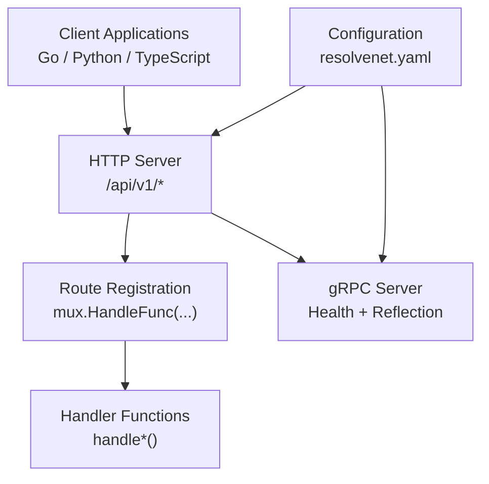
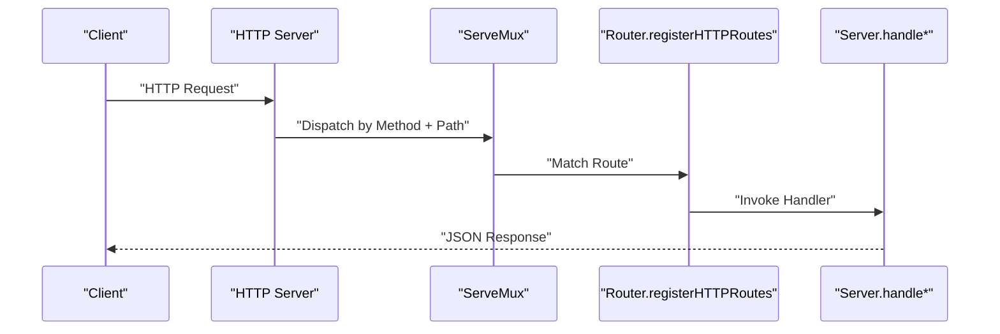

# REST API Endpoints

<cite>
**Referenced Files in This Document**
- [main.go](file://cmd/resolvenet-server/main.go)
- [router.go](file://pkg/server/router.go)
- [server.go](file://pkg/server/server.go)
- [auth.go](file://pkg/server/middleware/auth.go)
- [logging.go](file://pkg/server/middleware/logging.go)
- [tracing.go](file://pkg/server/middleware/tracing.go)
- [resolvenet.yaml](file://configs/resolvenet.yaml)
- [client.ts](file://web/src/api/client.ts)
- [root.go](file://internal/cli/root.go)
- [platform.proto](file://api/proto/resolvenet/v1/platform.proto)
</cite>

## Table of Contents
1. [Introduction](#introduction)
2. [Project Structure](#project-structure)
3. [Core Components](#core-components)
4. [Architecture Overview](#architecture-overview)
5. [Detailed Endpoint Specifications](#detailed-endpoint-specifications)
6. [Client Implementation Examples](#client-implementation-examples)
7. [Security and Compliance](#security-and-compliance)
8. [Performance Considerations](#performance-considerations)
9. [Troubleshooting Guide](#troubleshooting-guide)
10. [Conclusion](#conclusion)

## Introduction
This document provides comprehensive REST API documentation for ResolveNet's HTTP endpoints. It covers all HTTP methods, URL patterns, request/response schemas, status codes, authentication, error handling, and client implementation examples for Go, Python, and JavaScript/TypeScript. The API follows a versioned path pattern (/api/v1) and exposes endpoints for health checks, system information, agent management, skill operations, workflow execution, RAG functionality, model management, and configuration.

## Project Structure
ResolveNet exposes a dual-stack server: HTTP REST and gRPC. The HTTP server registers REST routes and delegates to handler functions. The gRPC server provides health checking and reflection for debugging. Configuration is loaded from YAML and environment variables.

**Diagram sources**
- [server.go:44-49](file://pkg/server/server.go#L44-L49)
- [router.go:11-55](file://pkg/server/router.go#L11-L55)
- [resolvenet.yaml:3-34](file://configs/resolvenet.yaml#L3-L34)

**Section sources**
- [main.go:16-55](file://cmd/resolvenet-server/main.go#L16-L55)
- [server.go:27-52](file://pkg/server/server.go#L27-L52)
- [router.go:10-55](file://pkg/server/router.go#L10-L55)
- [resolvenet.yaml:3-34](file://configs/resolvenet.yaml#L3-L34)

## Core Components
- HTTP Server: Initializes the HTTP multiplexer, registers routes, and starts the server bound to configured addresses.
- gRPC Server: Initializes gRPC with health checking and reflection.
- Middleware: Authentication (placeholder), logging, and tracing (placeholder).
- Configuration: Loads server addresses, database, Redis, NATS, runtime, gateway, and telemetry settings.

Key behaviors:
- HTTP server listens on the configured address and serves REST endpoints.
- gRPC server listens on the configured address and exposes health and reflection services.
- Route registration maps HTTP methods to handler functions with path parameters where applicable.

**Section sources**
- [server.go:27-52](file://pkg/server/server.go#L27-L52)
- [server.go:54-103](file://pkg/server/server.go#L54-L103)
- [router.go:10-55](file://pkg/server/router.go#L10-L55)
- [auth.go:8-17](file://pkg/server/middleware/auth.go#L8-L17)
- [logging.go:19-37](file://pkg/server/middleware/logging.go#L19-L37)
- [tracing.go:7-18](file://pkg/server/middleware/tracing.go#L7-L18)
- [resolvenet.yaml:3-34](file://configs/resolvenet.yaml#L3-L34)

## Architecture Overview
The HTTP server acts as the primary API surface. Routes are registered against a ServeMux and mapped to handler functions. Handlers currently return stubbed responses for unimplemented endpoints. The gRPC server complements the HTTP API with health and reflection services.

**Diagram sources**
- [server.go:44-49](file://pkg/server/server.go#L44-L49)
- [router.go:11-55](file://pkg/server/router.go#L11-L55)

## Detailed Endpoint Specifications

### Base URL and Versioning
- Base URL: /api/v1
- Versioning: All endpoints are under /api/v1

### Authentication and Security
- Authentication: Not implemented yet (placeholder middleware passes all requests).
- Authorization: Not implemented yet.
- TLS: Not enforced by server code; configure at reverse proxy/load balancer.
- CORS: Not implemented; configure at reverse proxy/load balancer.

### Rate Limiting
- Not implemented in server code.
- Recommended: Apply at reverse proxy or ingress controller.

### Error Handling Patterns
- All handlers write JSON responses with Content-Type: application/json.
- Non-2xx responses include an error object with a message field.
- Path parameter errors include the missing identifier in the response payload.

Example patterns:
- Health: Returns {"status":"healthy"} on success.
- System Info: Returns version, commit, and build date.
- Unimplemented endpoints: Return 501 Not Implemented with {"error":"not implemented"}.
- Not Found: Returns 404 with {"error":"... not found","id":"..."} for path parameters.

**Section sources**
- [router.go:57-67](file://pkg/server/router.go#L57-L67)
- [router.go:71-94](file://pkg/server/router.go#L71-L94)
- [router.go:104-111](file://pkg/server/router.go#L104-L111)
- [router.go:121-124](file://pkg/server/router.go#L121-L124)
- [router.go:159-160](file://pkg/server/router.go#L159-L160)
- [router.go:178-182](file://pkg/server/router.go#L178-L182)

### Health Checks
- GET /api/v1/health
  - Description: Returns platform health status.
  - Authentication: Not implemented.
  - Response: 200 OK with {"status":"healthy"}.
  - Error: None (always healthy in current implementation).

**Section sources**
- [router.go:12-13](file://pkg/server/router.go#L12-L13)
- [router.go:57-59](file://pkg/server/router.go#L57-L59)

### System Information
- GET /api/v1/system/info
  - Description: Returns system metadata (version, commit, build date).
  - Authentication: Not implemented.
  - Response: 200 OK with {"version":"...","commit":"...","build_date":"..."}.
  - Error: None (returns static version metadata).

**Section sources**
- [router.go:15-16](file://pkg/server/router.go#L15-L16)
- [router.go:61-67](file://pkg/server/router.go#L61-L67)

### Agent Management
- GET /api/v1/agents
  - Description: Lists agents.
  - Authentication: Not implemented.
  - Response: 200 OK with {"agents":[],"total":0}.
  - Error: None.

- POST /api/v1/agents
  - Description: Creates a new agent.
  - Authentication: Not implemented.
  - Response: 501 Not Implemented with {"error":"not implemented"}.
  - Error: 501.

- GET /api/v1/agents/{id}
  - Description: Retrieves an agent by ID.
  - Path Parameters: id (string).
  - Authentication: Not implemented.
  - Response: 404 Not Found with {"error":"agent not found","id":"..."}.
  - Error: 404.

- PUT /api/v1/agents/{id}
  - Description: Updates an agent by ID.
  - Path Parameters: id (string).
  - Authentication: Not implemented.
  - Response: 501 Not Implemented with {"error":"not implemented"}.
  - Error: 501.

- DELETE /api/v1/agents/{id}
  - Description: Deletes an agent by ID.
  - Path Parameters: id (string).
  - Authentication: Not implemented.
  - Response: 501 Not Implemented with {"error":"not implemented"}.
  - Error: 501.

- POST /api/v1/agents/{id}/execute
  - Description: Executes an agent by ID.
  - Path Parameters: id (string).
  - Authentication: Not implemented.
  - Response: 501 Not Implemented with {"error":"not implemented"}.
  - Error: 501.

**Section sources**
- [router.go:18-25](file://pkg/server/router.go#L18-L25)
- [router.go:71-94](file://pkg/server/router.go#L71-L94)
- [router.go:79-82](file://pkg/server/router.go#L79-L82)
- [router.go:84-90](file://pkg/server/router.go#L84-L90)
- [router.go:92-94](file://pkg/server/router.go#L92-L94)

### Skill Operations
- GET /api/v1/skills
  - Description: Lists skills.
  - Authentication: Not implemented.
  - Response: 200 OK with {"skills":[],"total":0}.
  - Error: None.

- POST /api/v1/skills
  - Description: Registers a skill.
  - Authentication: Not implemented.
  - Response: 501 Not Implemented with {"error":"not implemented"}.
  - Error: 501.

- GET /api/v1/skills/{name}
  - Description: Retrieves a skill by name.
  - Path Parameters: name (string).
  - Authentication: Not implemented.
  - Response: 404 Not Found with {"error":"skill not found","name":"..."}.
  - Error: 404.

- DELETE /api/v1/skills/{name}
  - Description: Unregisters a skill by name.
  - Path Parameters: name (string).
  - Authentication: Not implemented.
  - Response: 501 Not Implemented with {"error":"not implemented"}.
  - Error: 501.

**Section sources**
- [router.go:26-31](file://pkg/server/router.go#L26-L31)
- [router.go:96-111](file://pkg/server/router.go#L96-L111)
- [router.go:104-107](file://pkg/server/router.go#L104-L107)
- [router.go:109-111](file://pkg/server/router.go#L109-L111)

### Workflow Execution
- GET /api/v1/workflows
  - Description: Lists workflows.
  - Authentication: Not implemented.
  - Response: 200 OK with {"workflows":[],"total":0}.
  - Error: None.

- POST /api/v1/workflows
  - Description: Creates a new workflow.
  - Authentication: Not implemented.
  - Response: 501 Not Implemented with {"error":"not implemented"}.
  - Error: 501.

- GET /api/v1/workflows/{id}
  - Description: Retrieves a workflow by ID.
  - Path Parameters: id (string).
  - Authentication: Not implemented.
  - Response: 404 Not Found with {"error":"workflow not found","id":"..."}.
  - Error: 404.

- PUT /api/v1/workflows/{id}
  - Description: Updates a workflow by ID.
  - Path Parameters: id (string).
  - Authentication: Not implemented.
  - Response: 501 Not Implemented with {"error":"not implemented"}.
  - Error: 501.

- DELETE /api/v1/workflows/{id}
  - Description: Deletes a workflow by ID.
  - Path Parameters: id (string).
  - Authentication: Not implemented.
  - Response: 501 Not Implemented with {"error":"not implemented"}.
  - Error: 501.

- POST /api/v1/workflows/{id}/validate
  - Description: Validates a workflow by ID.
  - Path Parameters: id (string).
  - Authentication: Not implemented.
  - Response: 501 Not Implemented with {"error":"not implemented"}.
  - Error: 501.

- POST /api/v1/workflows/{id}/execute
  - Description: Executes a workflow by ID.
  - Path Parameters: id (string).
  - Authentication: Not implemented.
  - Response: 501 Not Implemented with {"error":"not implemented"}.
  - Error: 501.

**Section sources**
- [router.go:32-40](file://pkg/server/router.go#L32-L40)
- [router.go:113-140](file://pkg/server/router.go#L113-L140)
- [router.go:121-124](file://pkg/server/router.go#L121-L124)
- [router.go:134-140](file://pkg/server/router.go#L134-L140)

### RAG Functionality
- GET /api/v1/rag/collections
  - Description: Lists RAG collections.
  - Authentication: Not implemented.
  - Response: 200 OK with {"collections":[],"total":0}.
  - Error: None.

- POST /api/v1/rag/collections
  - Description: Creates a RAG collection.
  - Authentication: Not implemented.
  - Response: 501 Not Implemented with {"error":"not implemented"}.
  - Error: 501.

- DELETE /api/v1/rag/collections/{id}
  - Description: Deletes a RAG collection by ID.
  - Path Parameters: id (string).
  - Authentication: Not implemented.
  - Response: 501 Not Implemented with {"error":"not implemented"}.
  - Error: 501.

- POST /api/v1/rag/collections/{id}/ingest
  - Description: Ingests documents into a RAG collection by ID.
  - Path Parameters: id (string).
  - Authentication: Not implemented.
  - Response: 501 Not Implemented with {"error":"not implemented"}.
  - Error: 501.

- POST /api/v1/rag/collections/{id}/query
  - Description: Queries a RAG collection by ID.
  - Path Parameters: id (string).
  - Authentication: Not implemented.
  - Response: 501 Not Implemented with {"error":"not implemented"}.
  - Error: 501.

**Section sources**
- [router.go:41-47](file://pkg/server/router.go#L41-L47)
- [router.go:142-160](file://pkg/server/router.go#L142-L160)

### Model Management
- GET /api/v1/models
  - Description: Lists available models.
  - Authentication: Not implemented.
  - Response: 200 OK with {"models":[],"total":0}.
  - Error: None.

- POST /api/v1/models
  - Description: Adds a model.
  - Authentication: Not implemented.
  - Response: 501 Not Implemented with {"error":"not implemented"}.
  - Error: 501.

**Section sources**
- [router.go:48-51](file://pkg/server/router.go#L48-L51)
- [router.go:162-168](file://pkg/server/router.go#L162-L168)

### Configuration
- GET /api/v1/config
  - Description: Retrieves configuration.
  - Authentication: Not implemented.
  - Response: 501 Not Implemented with {"error":"not implemented"}.
  - Error: 501.

- PUT /api/v1/config
  - Description: Updates configuration.
  - Authentication: Not implemented.
  - Response: 501 Not Implemented with {"error":"not implemented"}.
  - Error: 501.

**Section sources**
- [router.go:52-54](file://pkg/server/router.go#L52-L54)
- [router.go:170-176](file://pkg/server/router.go#L170-L176)

## Client Implementation Examples

### Go
Use net/http or github.com/go-resty/resty for HTTP clients. Set Content-Type: application/json for POST/PUT requests. Handle non-2xx responses by parsing the JSON error object.

Recommended approach:
- Create an HTTP client with timeout.
- For each endpoint, construct the URL with /api/v1 prefix.
- For requests with bodies, set Content-Type and marshal JSON.
- Parse responses into structs or maps.
- Implement retry/backoff for transient errors.

### Python
Use httpx or requests. Configure base URL as /api/v1 and set headers appropriately. Handle exceptions and parse JSON error responses.

Recommended approach:
- Use httpx.AsyncClient for async operations.
- Wrap requests in try/except blocks.
- Parse error responses with {"error":"..."}.
- Implement exponential backoff for retries.

### JavaScript/TypeScript
Use fetch or axios. The web client demonstrates a typed wrapper around fetch with automatic JSON parsing and error handling.

Recommended approach:
- Use the provided client pattern: wrap fetch, set Content-Type, handle non-OK responses.
- Define TypeScript interfaces for request/response payloads.
- Centralize error handling and retry logic.

Note: The web client in the repository uses a relative base path and does not set Authorization headers. Add headers as needed when authentication is implemented.

**Section sources**
- [client.ts:1-18](file://web/src/api/client.ts#L1-L18)
- [client.ts:20-48](file://web/src/api/client.ts#L20-L48)

## Security and Compliance
- Authentication: Placeholder middleware exists; implement JWT or API key validation before enabling in production.
- Authorization: Not implemented; design RBAC policies for endpoints.
- TLS: Not enforced by server code; enable at reverse proxy/load balancer.
- CORS: Not implemented; configure at reverse proxy/load balancer.
- Rate Limiting: Not implemented; apply at reverse proxy or ingress controller.
- Secrets: Store sensitive configuration via environment variables or secret managers.

Operational guidance:
- Deploy behind a reverse proxy (e.g., NGINX, Traefik) for TLS termination, CORS, and rate limiting.
- Use mTLS or API keys for internal service-to-service communication.
- Rotate secrets regularly and audit access logs.

**Section sources**
- [auth.go:8-17](file://pkg/server/middleware/auth.go#L8-L17)
- [logging.go:19-37](file://pkg/server/middleware/logging.go#L19-L37)
- [resolvenet.yaml:3-34](file://configs/resolvenet.yaml#L3-L34)

## Performance Considerations
- Concurrency: HTTP server uses goroutines per connection; ensure adequate resources.
- Logging overhead: Enable structured logging in production; avoid excessive debug logs.
- gRPC vs HTTP: Use gRPC for internal microservices and HTTP for external APIs.
- Caching: Implement caching for read-heavy endpoints (e.g., /api/v1/system/info, /api/v1/agents, /api/v1/skills).
- Connection pooling: Reuse HTTP clients and keep-alive connections.

[No sources needed since this section provides general guidance]

## Troubleshooting Guide
Common issues and resolutions:
- 404 Not Found: Verify path parameter values (e.g., agent id, skill name, workflow id).
- 501 Not Implemented: Expect this for endpoints not yet implemented; implement handlers or avoid calling them.
- 500 Internal Server Error: Check server logs for panics or unhandled exceptions.
- Authentication failures: Implement and configure authentication middleware before enabling.

Diagnostic steps:
- Confirm server is running and listening on configured addresses.
- Test /api/v1/health and /api/v1/system/info endpoints.
- Review structured logs for method, path, status, duration, and remote address.

**Section sources**
- [router.go:79-82](file://pkg/server/router.go#L79-L82)
- [router.go:104-107](file://pkg/server/router.go#L104-L107)
- [router.go:121-124](file://pkg/server/router.go#L121-L124)
- [router.go:159-160](file://pkg/server/router.go#L159-L160)
- [logging.go:28-34](file://pkg/server/middleware/logging.go#L28-L34)

## Conclusion
ResolveNet exposes a versioned REST API under /api/v1 with health checks, system information, and comprehensive resource endpoints for agents, skills, workflows, RAG, models, and configuration. Authentication, authorization, CORS, and rate limiting are not implemented in server code and should be added via middleware or reverse proxy. Client implementations are available for Go, Python, and JavaScript/TypeScript. Plan to implement handlers for unstubbed endpoints and secure the API before production deployment.