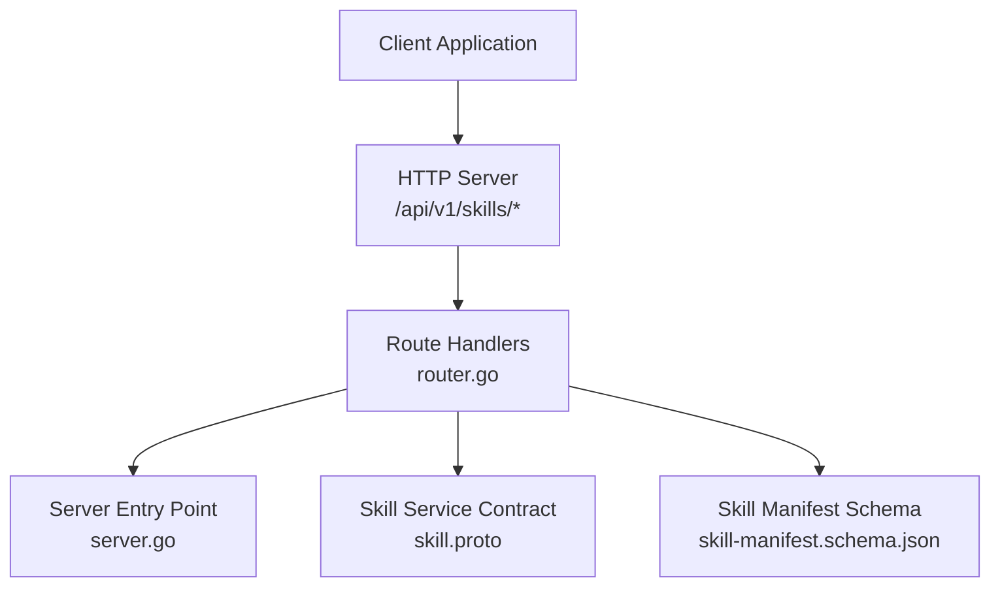
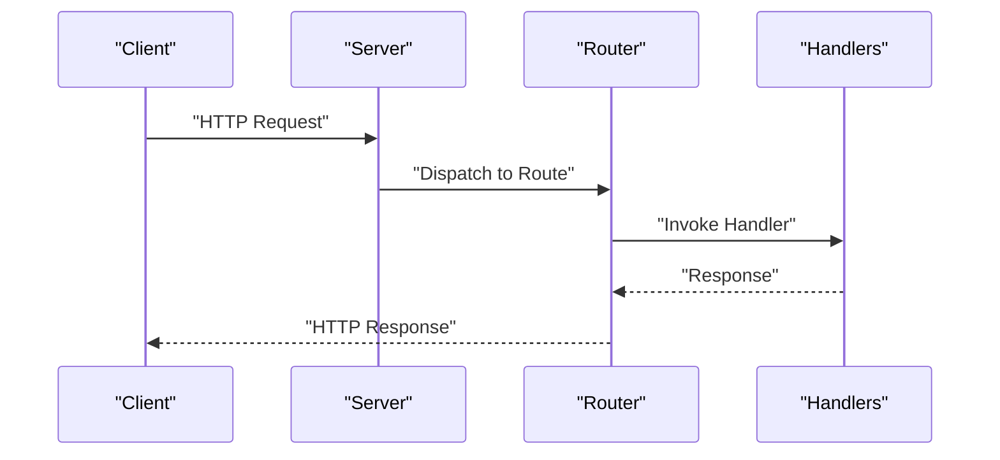
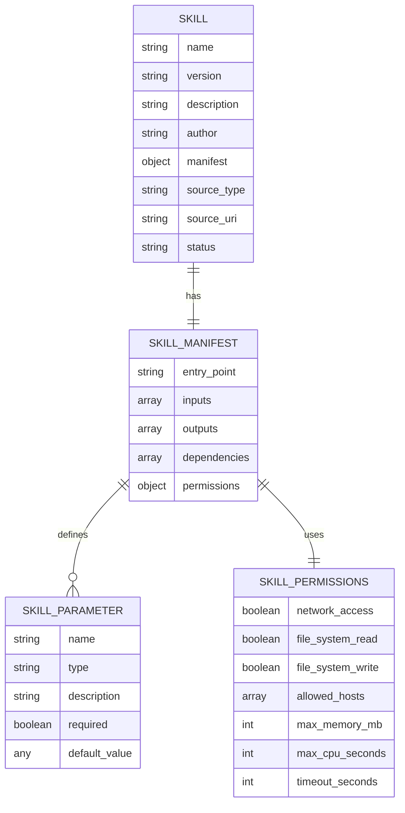
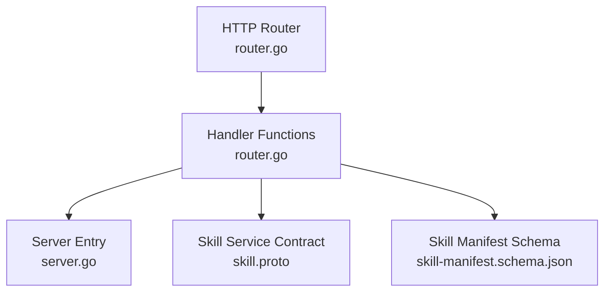

# Skill Management Endpoints

<cite>
**Referenced Files in This Document**
- [router.go](file://pkg/server/router.go)
- [server.go](file://pkg/server/server.go)
- [skill.proto](file://api/proto/resolvenet/v1/skill.proto)
- [skill-manifest.schema.json](file://api/jsonschema/skill-manifest.schema.json)
- [skill.go](file://pkg/registry/skill.go)
- [client.ts](file://web/src/api/client.ts)
- [skill-example.yaml](file://configs/examples/skill-example.yaml)
- [manifest.yaml](file://skills/examples/hello-world/manifest.yaml)
- [skill.py](file://skills/examples/hello-world/skill.py)
- [registry.yaml](file://skills/registry.yaml)
</cite>

## Table of Contents
1. [Introduction](#introduction)
2. [Project Structure](#project-structure)
3. [Core Components](#core-components)
4. [Architecture Overview](#architecture-overview)
5. [Detailed Component Analysis](#detailed-component-analysis)
6. [Dependency Analysis](#dependency-analysis)
7. [Performance Considerations](#performance-considerations)
8. [Troubleshooting Guide](#troubleshooting-guide)
9. [Conclusion](#conclusion)

## Introduction
This document provides comprehensive REST API documentation for skill management endpoints in the ResolveNet platform. It covers the HTTP endpoints for listing, registering, retrieving, and unregistering skills, along with detailed request/response schemas, path/query parameters, status codes, and practical client implementation examples. The documentation consolidates the current HTTP route definitions, underlying protocol buffer service contracts, and JSON schema definitions for skill manifests.

## Project Structure
The skill management REST API is exposed via an HTTP server that registers routes for skills under the /api/v1/skills path. The server currently stubs out the skill handlers, indicating that the endpoints are defined but not yet fully implemented. The underlying gRPC service contract and JSON schema define the canonical data structures for skills and their manifests.

**Diagram sources**
- [router.go:11-30](file://pkg/server/router.go#L11-L30)
- [server.go:44-49](file://pkg/server/server.go#L44-L49)
- [skill.proto:11-17](file://api/proto/resolvenet/v1/skill.proto#L11-L17)
- [skill-manifest.schema.json:1-74](file://api/jsonschema/skill-manifest.schema.json#L1-L74)

**Section sources**
- [router.go:11-30](file://pkg/server/router.go#L11-L30)
- [server.go:44-49](file://pkg/server/server.go#L44-L49)

## Core Components
This section documents the four primary skill management endpoints, including their HTTP methods, paths, parameters, and expected responses.

- GET /api/v1/skills
  - Purpose: List all registered skills.
  - Path Parameters: None.
  - Query Parameters: None.
  - Status Codes:
    - 200 OK: Returns a list of skills and total count.
    - 501 Not Implemented: Current handler stub returns a not-implemented response.
  - Response Body: An object containing an array of skills and a total count integer.
  - Notes: The current handler stub returns an empty skills array and zero total.

- POST /api/v1/skills
  - Purpose: Register a new skill.
  - Path Parameters: None.
  - Query Parameters: None.
  - Status Codes:
    - 200 OK: Registration successful.
    - 501 Not Implemented: Current handler stub returns a not-implemented response.
  - Request Body: Skill payload conforming to the skill definition structure.
  - Notes: The request body should include skill metadata and manifest details.

- GET /api/v1/skills/{name}
  - Purpose: Retrieve details for a specific skill by name.
  - Path Parameters:
    - name (string): Unique skill identifier.
  - Query Parameters: None.
  - Status Codes:
    - 200 OK: Skill details returned.
    - 404 Not Found: Skill not found.
  - Response Body: Skill details object.
  - Notes: The current handler stub returns a not-found response with the requested name.

- DELETE /api/v1/skills/{name}
  - Purpose: Unregister (delete) a skill by name.
  - Path Parameters:
    - name (string): Unique skill identifier.
  - Query Parameters: None.
  - Status Codes:
    - 200 OK: Deletion successful.
    - 501 Not Implemented: Current handler stub returns a not-implemented response.
  - Response Body: Empty on success; error object on failure.
  - Notes: The current handler stub returns a not-implemented response.

**Section sources**
- [router.go:26-30](file://pkg/server/router.go#L26-L30)
- [router.go:96-111](file://pkg/server/router.go#L96-L111)

## Architecture Overview
The skill management API is part of the broader REST API surface exposed by the platform server. Routes are registered against an HTTP ServeMux and handled by dedicated handler functions. The handlers currently return stub responses, indicating that business logic integration is pending.

**Diagram sources**
- [router.go:11-30](file://pkg/server/router.go#L11-L30)
- [server.go:44-49](file://pkg/server/server.go#L44-L49)

## Detailed Component Analysis

### Skill Definition and Manifest Schema
Skills are represented by a structured definition and validated against a JSON schema for manifests. The schema defines required fields, parameter types, and permission constraints.

**Diagram sources**
- [skill.proto:19-63](file://api/proto/resolvenet/v1/skill.proto#L19-L63)
- [skill-manifest.schema.json:7-72](file://api/jsonschema/skill-manifest.schema.json#L7-L72)

**Section sources**
- [skill.proto:19-63](file://api/proto/resolvenet/v1/skill.proto#L19-L63)
- [skill-manifest.schema.json:7-72](file://api/jsonschema/skill-manifest.schema.json#L7-L72)

### Request/Response Schemas

- Skill Definition (JSON)
  - Fields:
    - name (string): Unique skill name.
    - version (string): Semantic version.
    - description (string): Optional description.
    - author (string): Author attribution.
    - manifest (object): Skill manifest object.
    - source_type (string): Source type (e.g., local, git, oci, registry).
    - source_uri (string): URI or reference to the skill source.
    - status (string): Operational status.
    - labels (object, optional): Additional metadata labels.

- Skill Manifest (JSON Schema)
  - Required Properties:
    - name (string): Unique skill name.
    - version (string): Semantic version.
    - entry_point (string): Python module:function format.
  - Properties:
    - description (string)
    - author (string)
    - inputs (array of parameters)
    - outputs (array of parameters)
    - dependencies (array of strings)
    - permissions (object)
  - Parameter Definition:
    - name (string)
    - type (string): Enumerated type (string, number, boolean, object, array).
    - description (string)
    - required (boolean)
    - default (any)
  - Permissions Definition:
    - network_access (boolean)
    - file_system_read (boolean)
    - file_system_write (boolean)
    - allowed_hosts (array of strings)
    - max_memory_mb (integer)
    - max_cpu_seconds (integer)
    - timeout_seconds (integer)

- Example Manifest (from repository)
  - A minimal example demonstrates inputs, outputs, and permissions.

**Section sources**
- [skill-manifest.schema.json:7-72](file://api/jsonschema/skill-manifest.schema.json#L7-L72)
- [manifest.yaml:1-21](file://skills/examples/hello-world/manifest.yaml#L1-L21)

### Endpoint Implementation Details

- GET /api/v1/skills
  - Current Behavior: Returns an empty skills array and total count.
  - Expected Behavior: Return a paginated list of skills using the ListSkills RPC contract.

- POST /api/v1/skills
  - Current Behavior: Returns a not-implemented response.
  - Expected Behavior: Accept a skill definition and register it via the RegisterSkill RPC.

- GET /api/v1/skills/{name}
  - Current Behavior: Returns a not-found error with the requested name.
  - Expected Behavior: Return the skill details for the given name using the GetSkill RPC.

- DELETE /api/v1/skills/{name}
  - Current Behavior: Returns a not-implemented response.
  - Expected Behavior: Remove the skill by name using the UnregisterSkill RPC.

**Section sources**
- [router.go:96-111](file://pkg/server/router.go#L96-L111)
- [skill.proto:66-87](file://api/proto/resolvenet/v1/skill.proto#L66-L87)

### Client Implementation Examples

- Web Client Usage (TypeScript)
  - The web client exposes a typed API wrapper that performs fetch requests against /api/v1 endpoints.
  - Example usage patterns:
    - Listing skills: Call listSkills() to retrieve skills and total count.
    - Error handling: Non-OK responses throw errors with a message derived from the response body or status text.

- Authentication and Headers
  - The client sets Content-Type to application/json and forwards additional headers as provided.
  - Authentication requirements are not enforced by the client; implement authentication at the server level and propagate tokens via headers if needed.

- Response Processing
  - Successful responses are parsed as JSON and returned as typed objects.
  - Error responses trigger exceptions; callers should catch and handle errors appropriately.

**Section sources**
- [client.ts:3-18](file://web/src/api/client.ts#L3-L18)
- [client.ts:32-48](file://web/src/api/client.ts#L32-L48)

### Example Requests and Responses

- Skill Registration Request (POST /api/v1/skills)
  - Request Body: Skill definition object including name, version, manifest, source_type, source_uri, and status.
  - Example: A skill configuration example is provided in YAML format, demonstrating inputs, permissions, and entry_point.

- Skill Listing Response (GET /api/v1/skills)
  - Response Body: Object containing skills array and total integer count.
  - Current Handler: Returns empty array and zero total.

- Skill Detail Response (GET /api/v1/skills/{name})
  - Response Body: Skill details object.
  - Current Handler: Returns a not-found error with the requested name.

- Unregister Skill Request (DELETE /api/v1/skills/{name})
  - Request Body: None.
  - Current Handler: Returns a not-implemented response.

**Section sources**
- [skill-example.yaml:3-23](file://configs/examples/skill-example.yaml#L3-L23)
- [router.go:96-111](file://pkg/server/router.go#L96-L111)

## Dependency Analysis
The skill management endpoints depend on the HTTP router and server initialization. The router delegates to handler functions that currently return stub responses. The underlying gRPC service contract and JSON schema define the canonical data structures.

**Diagram sources**
- [router.go:11-30](file://pkg/server/router.go#L11-L30)
- [server.go:44-49](file://pkg/server/server.go#L44-L49)
- [skill.proto:11-17](file://api/proto/resolvenet/v1/skill.proto#L11-L17)
- [skill-manifest.schema.json:1-74](file://api/jsonschema/skill-manifest.schema.json#L1-L74)

**Section sources**
- [router.go:11-30](file://pkg/server/router.go#L11-L30)
- [server.go:44-49](file://pkg/server/server.go#L44-L49)

## Performance Considerations
- Current Handler Limitations: The handlers return stub responses, so performance characteristics are not yet representative of production logic.
- Pagination: The ListSkills RPC contract includes pagination support; implement pagination-aware handlers to avoid large payloads.
- Caching: Consider caching skill metadata for frequently accessed endpoints to reduce latency.
- Concurrency: Ensure thread-safe access to shared registries if implementing concurrent handlers.

## Troubleshooting Guide
- 404 Not Found (GET /api/v1/skills/{name})
  - Cause: Skill not found or handler stub returns not-found.
  - Resolution: Verify the skill name and ensure the handler is implemented to fetch from the registry.

- 501 Not Implemented (POST /api/v1/skills, DELETE /api/v1/skills/{name})
  - Cause: Handlers are not implemented.
  - Resolution: Implement handlers to process requests and integrate with the skill registry.

- Error Handling in Client
  - The web client throws errors for non-OK responses. Ensure clients catch and handle errors gracefully, displaying meaningful messages to users.

**Section sources**
- [router.go:104-111](file://pkg/server/router.go#L104-L111)
- [client.ts:12-15](file://web/src/api/client.ts#L12-L15)

## Conclusion
The skill management REST API endpoints are defined in the HTTP router and gRPC service contract, with JSON schema validation for skill manifests. While the current handlers return stub responses, the documented schemas and examples provide a clear blueprint for implementing robust skill registration, retrieval, listing, and unregistration workflows. Integrating the handlers with the skill registry and adding pagination, error handling, and authentication will complete the implementation aligned with the existing data models and examples.