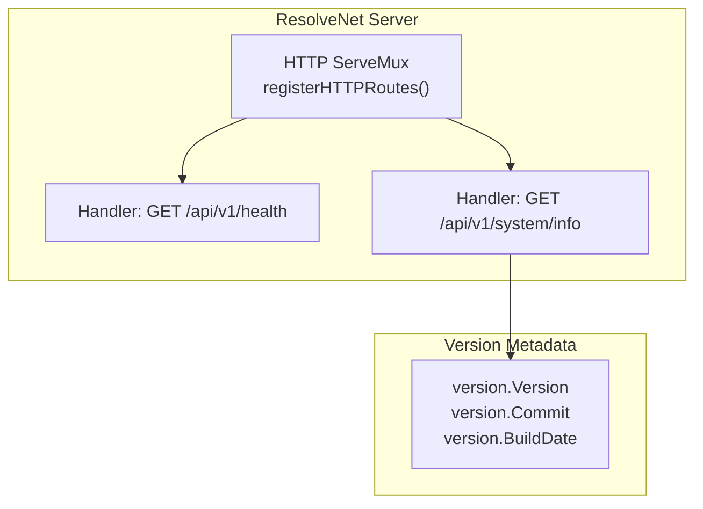
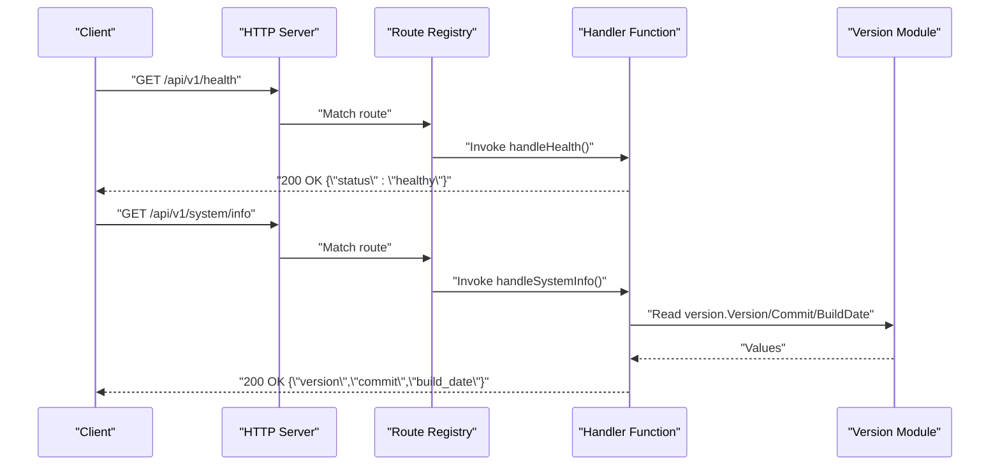
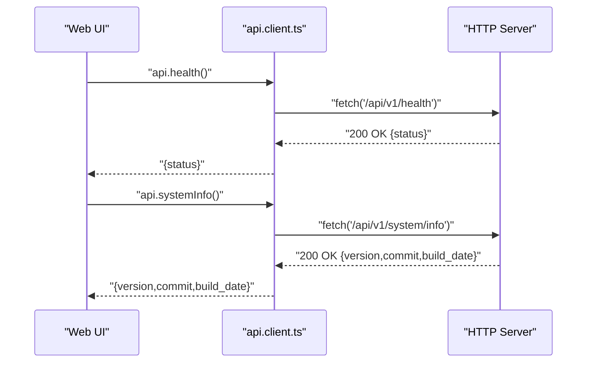
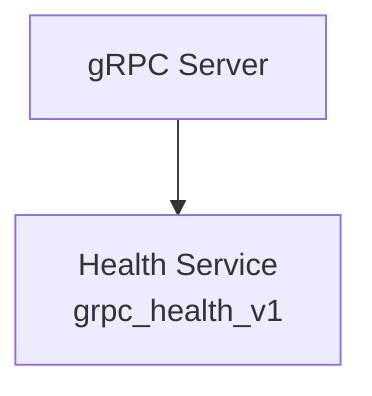
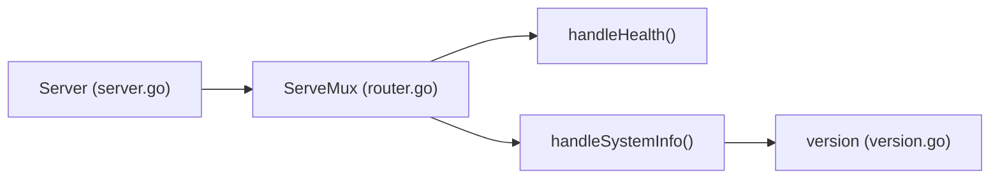

# System and Health Endpoints

<cite>
**Referenced Files in This Document**
- [router.go](file://pkg/server/router.go)
- [server.go](file://pkg/server/server.go)
- [version.go](file://pkg/version/version.go)
- [client.ts](file://web/src/api/client.ts)
- [platform.proto](file://api/proto/resolvenet/v1/platform.proto)
- [logging.go](file://pkg/server/middleware/logging.go)
- [root.go](file://internal/cli/root.go)
</cite>

## Table of Contents
1. [Introduction](#introduction)
2. [Project Structure](#project-structure)
3. [Core Components](#core-components)
4. [Architecture Overview](#architecture-overview)
5. [Detailed Component Analysis](#detailed-component-analysis)
6. [Dependency Analysis](#dependency-analysis)
7. [Performance Considerations](#performance-considerations)
8. [Troubleshooting Guide](#troubleshooting-guide)
9. [Conclusion](#conclusion)

## Introduction
This document describes the system and health monitoring endpoints exposed by ResolveNet’s HTTP API. It covers:
- Health check endpoint for liveness/readiness verification
- System information endpoint for version, commit, and build metadata
- Response schemas, HTTP status codes, and example curl commands
- Purpose for monitoring, deployment verification, and version tracking
- Client implementation guidance for robust HTTP usage, error handling, and response processing

These endpoints are part of the REST API surface and complement the gRPC health service registered by the server.

## Project Structure
The HTTP endpoints are registered and handled within the server module. The system information endpoint consumes build-time version variables populated during compilation.



**Diagram sources**
- [router.go:10-17](file://pkg/server/router.go#L10-L17)
- [router.go:57-67](file://pkg/server/router.go#L57-L67)
- [version.go:8-13](file://pkg/version/version.go#L8-L13)

**Section sources**
- [router.go:10-17](file://pkg/server/router.go#L10-L17)
- [version.go:8-13](file://pkg/version/version.go#L8-L13)

## Core Components
- Health endpoint: Returns a simple status indicating the service is healthy.
- System info endpoint: Returns version, commit, and build date metadata.

Both endpoints are implemented as HTTP handlers and return JSON responses with appropriate HTTP status codes.

**Section sources**
- [router.go:57-67](file://pkg/server/router.go#L57-L67)

## Architecture Overview
The HTTP server registers REST routes and delegates to handler functions. The system info handler reads version metadata injected at build time.



**Diagram sources**
- [server.go:44-51](file://pkg/server/server.go#L44-L51)
- [router.go:10-17](file://pkg/server/router.go#L10-L17)
- [router.go:57-67](file://pkg/server/router.go#L57-L67)
- [version.go:8-13](file://pkg/version/version.go#L8-L13)

## Detailed Component Analysis

### Health Endpoint (/api/v1/health)
- Method: GET
- Path: /api/v1/health
- Purpose: Liveness/readiness probe for monitoring and load balancers
- Response Schema:
  - status: string (fixed value: "healthy")
- HTTP Status Codes:
  - 200 OK: Service is healthy
- Example curl:
  - curl -sS http://localhost:8080/api/v1/health
- Typical Monitoring Use Cases:
  - Kubernetes readiness/liveness probes
  - Load balancer health checks
  - CI/CD deployment verification

```mermaid
flowchart TD
Start(["Request: GET /api/v1/health"]) --> Route["Route Match"]
Route --> Handler["handleHealth()"]
Handler --> Encode["Encode JSON {\"status\":\"healthy\"}"]
Encode --> Respond["Respond 200 OK"]
Respond --> End(["Done"])
```

**Diagram sources**
- [router.go:12-13](file://pkg/server/router.go#L12-L13)
- [router.go:57-59](file://pkg/server/router.go#L57-L59)

**Section sources**
- [router.go:12-13](file://pkg/server/router.go#L12-L13)
- [router.go:57-59](file://pkg/server/router.go#L57-L59)

### System Information Endpoint (/api/v1/system/info)
- Method: GET
- Path: /api/v1/system/info
- Purpose: Expose version, commit, and build date for audit and troubleshooting
- Response Schema:
  - version: string
  - commit: string
  - build_date: string
- HTTP Status Codes:
  - 200 OK: Metadata returned successfully
- Example curl:
  - curl -sS http://localhost:8080/api/v1/system/info
- Typical Monitoring Use Cases:
  - Deployment verification and rollback decisions
  - Debugging environment-specific issues
  - Compliance and change tracking

```mermaid
flowchart TD
StartSys(["Request: GET /api/v1/system/info"]) --> RouteSys["Route Match"]
RouteSys --> HandlerSys["handleSystemInfo()"]
HandlerSys --> ReadVer["Read version.Version/Commit/BuildDate"]
ReadVer --> EncodeSys["Encode JSON {\"version\",\"commit\",\"build_date\"}"]
EncodeSys --> RespondSys["Respond 200 OK"]
RespondSys --> EndSys(["Done"])
```

**Diagram sources**
- [router.go:15-16](file://pkg/server/router.go#L15-L16)
- [router.go:61-67](file://pkg/server/router.go#L61-L67)
- [version.go:8-13](file://pkg/version/version.go#L8-L13)

**Section sources**
- [router.go:15-16](file://pkg/server/router.go#L15-L16)
- [router.go:61-67](file://pkg/server/router.go#L61-L67)
- [version.go:8-13](file://pkg/version/version.go#L8-L13)

### Client Implementation Examples
The frontend client demonstrates recommended patterns for HTTP consumption:
- Centralized request wrapper with JSON content-type and error handling
- Typed API methods for health and system info
- Robust error extraction from HTTP responses



**Diagram sources**
- [client.ts:3-18](file://web/src/api/client.ts#L3-L18)
- [client.ts:22](file://web/src/api/client.ts#L22)
- [client.ts:44-47](file://web/src/api/client.ts#L44-L47)

Implementation highlights:
- JSON request/response handling
- Error propagation with meaningful messages
- Type-safe return types for consumers

**Section sources**
- [client.ts:3-18](file://web/src/api/client.ts#L3-L18)
- [client.ts:22](file://web/src/api/client.ts#L22)
- [client.ts:44-47](file://web/src/api/client.ts#L44-L47)

### gRPC Health Service (Context)
While separate from the HTTP endpoints documented here, the server also registers a gRPC health service for compatibility with gRPC clients.



**Diagram sources**
- [server.go:37-42](file://pkg/server/server.go#L37-L42)

**Section sources**
- [server.go:37-42](file://pkg/server/server.go#L37-L42)

## Dependency Analysis
- The HTTP router depends on the server instance to bind handlers.
- The system info handler depends on the version module for build metadata.
- The server composes both HTTP and gRPC servers.



**Diagram sources**
- [server.go:44-51](file://pkg/server/server.go#L44-L51)
- [router.go:10-17](file://pkg/server/router.go#L10-L17)
- [router.go:57-67](file://pkg/server/router.go#L57-L67)
- [version.go:8-13](file://pkg/version/version.go#L8-L13)

**Section sources**
- [server.go:44-51](file://pkg/server/server.go#L44-L51)
- [router.go:10-17](file://pkg/server/router.go#L10-L17)
- [router.go:57-67](file://pkg/server/router.go#L57-L67)
- [version.go:8-13](file://pkg/version/version.go#L8-L13)

## Performance Considerations
- Both endpoints are lightweight and suitable for frequent polling.
- Keep polling intervals reasonable to avoid unnecessary load.
- Use connection reuse and keep-alive where applicable.
- Consider caching responses at monitoring proxies if repeated within short windows.

## Troubleshooting Guide
Common issues and resolutions:
- 404 Not Found: Verify the correct path and base URL. Confirm the server is running and serving the HTTP port.
- 5xx Internal Server Error: Inspect server logs for errors. The logging middleware records request details including status and duration.
- Network connectivity: Ensure the client can reach the configured HTTP address and port.
- Authentication: While the auth middleware currently passes through requests, future updates may require tokens. Plan for optional auth headers.

Operational tips:
- Use curl to validate endpoints quickly.
- For UI integration, follow the client.ts pattern for error handling and typed responses.

**Section sources**
- [logging.go:19-37](file://pkg/server/middleware/logging.go#L19-L37)
- [root.go:38-41](file://internal/cli/root.go#L38-L41)

## Conclusion
ResolveNet exposes two essential endpoints for monitoring and operational visibility:
- /api/v1/health for quick liveness/readiness checks
- /api/v1/system/info for version and build metadata

They are designed for simplicity, reliability, and ease of integration across clients and monitoring systems. The included client patterns demonstrate robust HTTP usage and error handling that can be adapted to various environments.