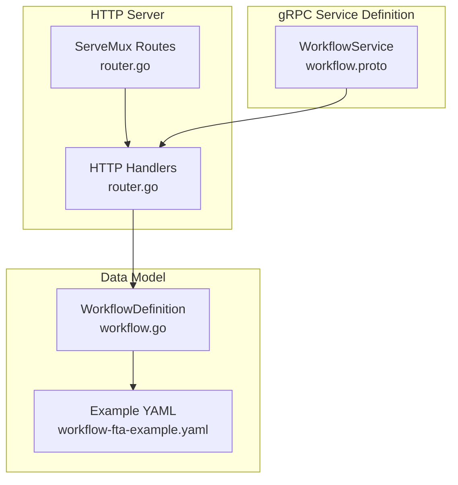
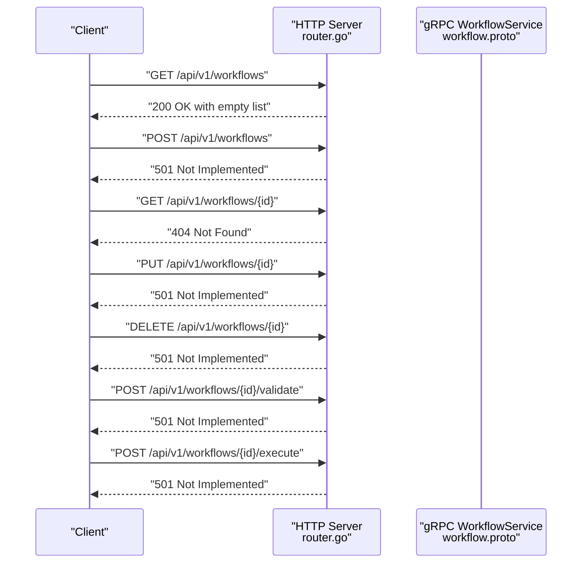
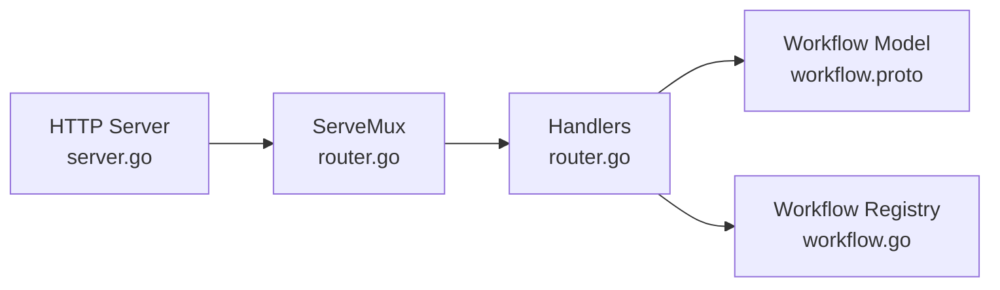

# Workflow Management Endpoints

<cite>
**Referenced Files in This Document**
- [workflow.proto](file://api/proto/resolvenet/v1/workflow.proto)
- [router.go](file://pkg/server/router.go)
- [server.go](file://pkg/server/server.go)
- [workflow.go](file://pkg/registry/workflow.go)
- [workflow-fta-example.yaml](file://configs/examples/workflow-fta-example.yaml)
- [workflow_execution_test.go](file://test/e2e/workflow_execution_test.go)
- [workflow_execution.tsx](file://web/src/pages/Workflows/WorkflowExecution.tsx)
- [engine.py](file://python/src/resolvenet/fta/engine.py)
</cite>

## Table of Contents
1. [Introduction](#introduction)
2. [Project Structure](#project-structure)
3. [Core Components](#core-components)
4. [Architecture Overview](#architecture-overview)
5. [Detailed Component Analysis](#detailed-component-analysis)
6. [Dependency Analysis](#dependency-analysis)
7. [Performance Considerations](#performance-considerations)
8. [Troubleshooting Guide](#troubleshooting-guide)
9. [Conclusion](#conclusion)

## Introduction
This document provides comprehensive REST API documentation for workflow management endpoints in the platform. It covers the HTTP endpoints for listing, creating, retrieving, updating, deleting, validating, and executing workflows. It also documents request/response schemas, path parameters, validation rules, status codes, and client implementation guidance for consuming these endpoints.

Important note: As of the current repository state, the REST endpoints are registered but stubbed out. The actual business logic for workflow persistence and execution is not yet implemented in the HTTP handlers. The documentation below describes the intended behavior and schemas based on the protocol buffer definitions and example configurations.

## Project Structure
The workflow management REST API is exposed by the HTTP server and routed via ServeMux. The gRPC service definitions describe the canonical workflow data model and execution semantics. Example workflow definitions are provided in YAML.

**Diagram sources**
- [router.go:11-55](file://pkg/server/router.go#L11-L55)
- [workflow.proto:11-20](file://api/proto/resolvenet/v1/workflow.proto#L11-L20)
- [workflow.go:9-26](file://pkg/registry/workflow.go#L9-L26)
- [workflow-fta-example.yaml:1-50](file://configs/examples/workflow-fta-example.yaml#L1-L50)

**Section sources**
- [router.go:11-55](file://pkg/server/router.go#L11-L55)
- [server.go:44-51](file://pkg/server/server.go#L44-L51)

## Core Components
- WorkflowService gRPC service defines the canonical workflow operations and data structures.
- HTTP router registers REST endpoints for workflows.
- WorkflowDefinition represents persisted workflow metadata and tree structure.
- Example YAML demonstrates a valid workflow tree with events and gates.

Key schemas and types:
- Workflow: includes metadata, fault tree, and status.
- FaultTree: top-level event ID, list of events, and list of gates.
- FTAEvent: node in the tree with ID, name, description, type, evaluator, and parameters.
- FTAGate: logical connectors with inputs, output, and optional k-value for voting gates.
- WorkflowStatus: draft, active, archived, unspecified.
- WorkflowEventType: started, node evaluating/completed, gate evaluating/completed, completed, failed.

**Section sources**
- [workflow.proto:22-101](file://api/proto/resolvenet/v1/workflow.proto#L22-L101)
- [workflow.proto:104-144](file://api/proto/resolvenet/v1/workflow.proto#L104-L144)
- [workflow.go:9-17](file://pkg/registry/workflow.go#L9-L17)

## Architecture Overview
The HTTP server exposes REST endpoints that are currently stubbed. The gRPC service definitions provide the authoritative workflow model and execution semantics. The example YAML shows a real-world workflow structure.

**Diagram sources**
- [router.go:32-39](file://pkg/server/router.go#L32-L39)
- [router.go:113-140](file://pkg/server/router.go#L113-L140)

## Detailed Component Analysis

### Endpoint: GET /api/v1/workflows
- Purpose: List workflows with pagination support.
- Path parameters: None.
- Query parameters: Pagination controls (as defined by the pagination request type in the gRPC service).
- Request body: None.
- Response body: ListWorkflowsResponse containing workflows array and pagination metadata.
- Status codes:
  - 200 OK: Successful retrieval of workflow list.
  - 501 Not Implemented: Handler is not implemented in the current server.

Notes:
- The handler currently returns an empty list with total count zero.
- Pagination is supported by the underlying gRPC message.

**Section sources**
- [router.go:32-34](file://pkg/server/router.go#L32-L34)
- [router.go:113-115](file://pkg/server/router.go#L113-L115)
- [workflow.proto:112-119](file://api/proto/resolvenet/v1/workflow.proto#L112-L119)

### Endpoint: POST /api/v1/workflows
- Purpose: Create a new workflow.
- Path parameters: None.
- Request body: CreateWorkflowRequest containing a Workflow object.
- Response body: Workflow object representing the created workflow.
- Status codes:
  - 201 Created: Workflow created successfully.
  - 400 Bad Request: Validation errors in the request payload.
  - 409 Conflict: Duplicate workflow ID.
  - 501 Not Implemented: Handler is not implemented in the current server.

Validation rules:
- Workflow must include valid metadata and a well-formed FaultTree.
- FaultTree.top_event_id must reference an existing event ID.
- Events must have unique IDs and valid types.
- Gates must reference existing event IDs for inputs and output.
- Voting gates must specify a valid k-value.

**Section sources**
- [router.go:34-34](file://pkg/server/router.go#L34-L34)
- [router.go:117-119](file://pkg/server/router.go#L117-L119)
- [workflow.proto:104-106](file://api/proto/resolvenet/v1/workflow.proto#L104-L106)
- [workflow.proto:22-27](file://api/proto/resolvenet/v1/workflow.proto#L22-L27)
- [workflow.proto:37-41](file://api/proto/resolvenet/v1/workflow.proto#L37-L41)
- [workflow.proto:44-51](file://api/proto/resolvenet/v1/workflow.proto#L44-L51)
- [workflow.proto:63-70](file://api/proto/resolvenet/v1/workflow.proto#L63-L70)

### Endpoint: GET /api/v1/workflows/{id}
- Purpose: Retrieve a workflow by ID.
- Path parameters:
  - id: Workflow identifier (string).
- Request body: None.
- Response body: Workflow object.
- Status codes:
  - 200 OK: Workflow found.
  - 404 Not Found: Workflow does not exist.
  - 501 Not Implemented: Handler is not implemented in the current server.

**Section sources**
- [router.go:35-35](file://pkg/server/router.go#L35-L35)
- [router.go:121-124](file://pkg/server/router.go#L121-L124)
- [workflow.proto:108-110](file://api/proto/resolvenet/v1/workflow.proto#L108-L110)

### Endpoint: PUT /api/v1/workflows/{id}
- Purpose: Update an existing workflow.
- Path parameters:
  - id: Workflow identifier (string).
- Request body: UpdateWorkflowRequest containing a Workflow object.
- Response body: Workflow object.
- Status codes:
  - 200 OK: Workflow updated.
  - 404 Not Found: Workflow does not exist.
  - 400 Bad Request: Validation errors.
  - 501 Not Implemented: Handler is not implemented in the current server.

Validation rules:
- Same as create endpoint; additionally, the ID must match the path parameter.

**Section sources**
- [router.go:36-36](file://pkg/server/router.go#L36-L36)
- [router.go:126-128](file://pkg/server/router.go#L126-L128)
- [workflow.proto:121-123](file://api/proto/resolvenet/v1/workflow.proto#L121-L123)

### Endpoint: DELETE /api/v1/workflows/{id}
- Purpose: Delete a workflow by ID.
- Path parameters:
  - id: Workflow identifier (string).
- Request body: None.
- Response body: Empty on success.
- Status codes:
  - 200 OK: Workflow deleted.
  - 404 Not Found: Workflow does not exist.
  - 501 Not Implemented: Handler is not implemented in the current server.

**Section sources**
- [router.go:37-37](file://pkg/server/router.go#L37-L37)
- [router.go:130-132](file://pkg/server/router.go#L130-L132)
- [workflow.proto:125-127](file://api/proto/resolvenet/v1/workflow.proto#L125-L127)

### Endpoint: POST /api/v1/workflows/{id}/validate
- Purpose: Validate a workflow definition without persisting it.
- Path parameters:
  - id: Workflow identifier (string).
- Request body: ValidateWorkflowRequest containing a FaultTree.
- Response body: ValidateWorkflowResponse with validity, errors, and warnings.
- Status codes:
  - 200 OK: Validation result returned.
  - 400 Bad Request: Malformed FaultTree.
  - 501 Not Implemented: Handler is not implemented in the current server.

Validation rules:
- Top event ID must reference an existing event.
- Event IDs must be unique.
- Gate inputs and outputs must reference existing event IDs.
- Voting gates must have a valid k-value (1 <= k <= n).

**Section sources**
- [router.go:38-38](file://pkg/server/router.go#L38-L38)
- [router.go:134-136](file://pkg/server/router.go#L134-L136)
- [workflow.proto:131-139](file://api/proto/resolvenet/v1/workflow.proto#L131-L139)

### Endpoint: POST /api/v1/workflows/{id}/execute
- Purpose: Execute a workflow and stream execution events.
- Path parameters:
  - id: Workflow identifier (string).
- Request body: ExecuteWorkflowRequest containing workflow_id and optional context.
- Response body: Server-sent events (SSE) of WorkflowEvent messages.
- Status codes:
  - 200 OK: Streaming started.
  - 404 Not Found: Workflow does not exist.
  - 501 Not Implemented: Handler is not implemented in the current server.

Execution events:
- started: Execution begins.
- node.evaluating/node.completed: Individual event evaluation lifecycle.
- gate.evaluating/gate.completed: Gate evaluation lifecycle.
- completed: Execution finished.
- failed: Execution encountered an error.

**Section sources**
- [router.go:39-39](file://pkg/server/router.go#L39-L39)
- [router.go:138-140](file://pkg/server/router.go#L138-L140)
- [workflow.proto:141-144](file://api/proto/resolvenet/v1/workflow.proto#L141-L144)
- [workflow.proto:82-90](file://api/proto/resolvenet/v1/workflow.proto#L82-L90)
- [workflow.proto:92-101](file://api/proto/resolvenet/v1/workflow.proto#L92-L101)

## Dependency Analysis
The HTTP server depends on ServeMux routing to dispatch requests to handlers. The handlers currently return stub responses. The gRPC service definitions define the canonical data model and execution semantics.

**Diagram sources**
- [server.go:44-51](file://pkg/server/server.go#L44-L51)
- [router.go:11-55](file://pkg/server/router.go#L11-L55)
- [workflow.proto:22-101](file://api/proto/resolvenet/v1/workflow.proto#L22-L101)
- [workflow.go:19-26](file://pkg/registry/workflow.go#L19-L26)

**Section sources**
- [server.go:44-51](file://pkg/server/server.go#L44-L51)
- [router.go:11-55](file://pkg/server/router.go#L11-L55)

## Performance Considerations
- Streaming execution events: Use SSE or WebSocket for efficient real-time updates during execution.
- Pagination: Implement server-side pagination for listing workflows to avoid large payloads.
- Validation: Pre-validate workflows before execution to reduce runtime failures.
- Concurrency: Ensure thread-safe access to shared workflow state during concurrent executions.

## Troubleshooting Guide
Common issues and resolutions:
- 501 Not Implemented: Handlers are not implemented. Implement the missing business logic in the server.
- 404 Not Found: Verify the workflow ID exists and is correctly passed as a path parameter.
- 400 Bad Request: Validate the request payload against the schema and ensure all required fields are present.
- 409 Conflict: Duplicate workflow ID. Choose a unique ID or update the existing workflow.

**Section sources**
- [router.go:117-119](file://pkg/server/router.go#L117-L119)
- [router.go:121-124](file://pkg/server/router.go#L121-L124)
- [router.go:134-136](file://pkg/server/router.go#L134-L136)
- [router.go:138-140](file://pkg/server/router.go#L138-L140)

## Client Implementation Examples

### HTTP Client Usage (Generic)
- Use an HTTP client library to send requests to the REST endpoints.
- For execution, handle streaming responses (SSE) and parse JSON events.
- Validate responses against the documented schemas.

### Web Client Integration
- The frontend includes a workflow execution page that extracts the workflow ID from the route parameters.

**Section sources**
- [workflow_execution.tsx:1-16](file://web/src/pages/Workflows/WorkflowExecution.tsx#L1-L16)

### Python Client Integration
- The Python FTA engine yields structured events during execution, which aligns with the WorkflowEvent schema.

**Section sources**
- [engine.py:53-82](file://python/src/resolvenet/fta/engine.py#L53-L82)

## Schema Definitions

### Workflow
- Fields:
  - meta: ResourceMeta
  - tree: FaultTree
  - status: WorkflowStatus

**Section sources**
- [workflow.proto:22-27](file://api/proto/resolvenet/v1/workflow.proto#L22-L27)

### FaultTree
- Fields:
  - top_event_id: string
  - events: repeated FTAEvent
  - gates: repeated FTAGate

**Section sources**
- [workflow.proto:37-41](file://api/proto/resolvenet/v1/workflow.proto#L37-L41)

### FTAEvent
- Fields:
  - id: string
  - name: string
  - description: string
  - type: FTAEventType
  - evaluator: string
  - parameters: google.protobuf.Struct

**Section sources**
- [workflow.proto:44-51](file://api/proto/resolvenet/v1/workflow.proto#L44-L51)

### FTAGate
- Fields:
  - id: string
  - name: string
  - type: FTAGateType
  - input_ids: repeated string
  - output_id: string
  - k_value: int32

**Section sources**
- [workflow.proto:63-70](file://api/proto/resolvenet/v1/workflow.proto#L63-L70)

### WorkflowEvent (Streaming)
- Fields:
  - workflow_id: string
  - execution_id: string
  - type: WorkflowEventType
  - node_id: string
  - message: string
  - data: google.protobuf.Struct
  - timestamp: google.protobuf.Timestamp

**Section sources**
- [workflow.proto:82-90](file://api/proto/resolvenet/v1/workflow.proto#L82-L90)

### Validation Response
- Fields:
  - valid: bool
  - errors: repeated string
  - warnings: repeated string

**Section sources**
- [workflow.proto:135-139](file://api/proto/resolvenet/v1/workflow.proto#L135-L139)

## Example Payloads

### Example Workflow Creation Payload
- Reference: [workflow-fta-example.yaml:1-50](file://configs/examples/workflow-fta-example.yaml#L1-L50)
- Structure:
  - tree.top_event_id: Root cause identifier
  - events: Array of events with IDs, names, types, evaluators, and parameters
  - gates: Array of gates connecting events

**Section sources**
- [workflow-fta-example.yaml:1-50](file://configs/examples/workflow-fta-example.yaml#L1-L50)

### Example Validation Response
- valid: true/false
- errors: ["..."]
- warnings: ["..."]

**Section sources**
- [workflow.proto:135-139](file://api/proto/resolvenet/v1/workflow.proto#L135-L139)

### Example Execution Request
- workflow_id: string
- context: google.protobuf.Struct (optional)

**Section sources**
- [workflow.proto:141-144](file://api/proto/resolvenet/v1/workflow.proto#L141-L144)

## End-to-End Test Notes
- An end-to-end test exists but is currently skipped pending infrastructure.

**Section sources**
- [workflow_execution_test.go:1-12](file://test/e2e/workflow_execution_test.go#L1-L12)

## Conclusion
The workflow management REST API is defined by the gRPC service and HTTP routes. While the routes are registered, the handlers are currently stubbed. Implementing the handlers will enable full CRUD operations, validation, and streaming execution of workflows. The example YAML and schemas provide a clear blueprint for building robust workflow definitions and clients.