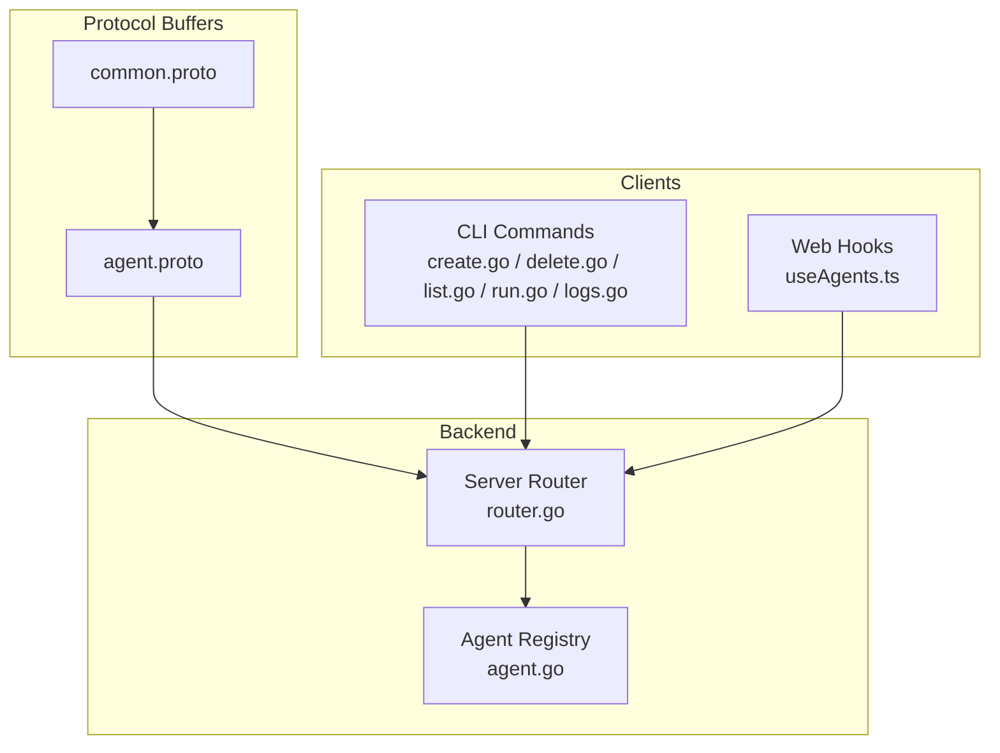
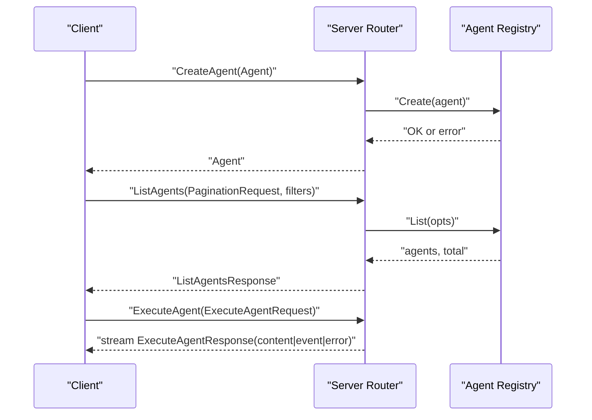
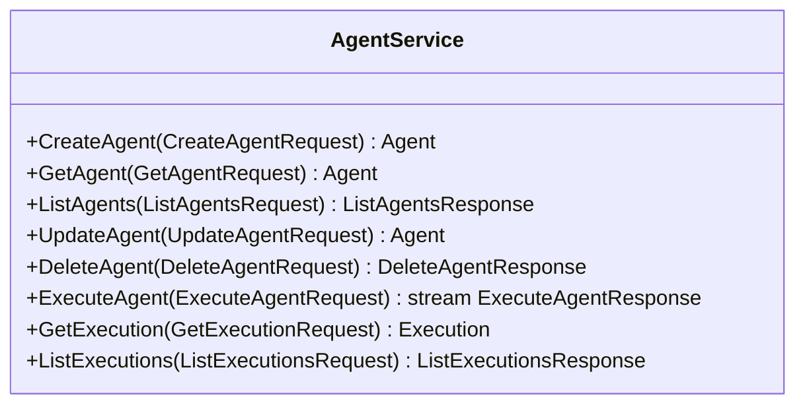
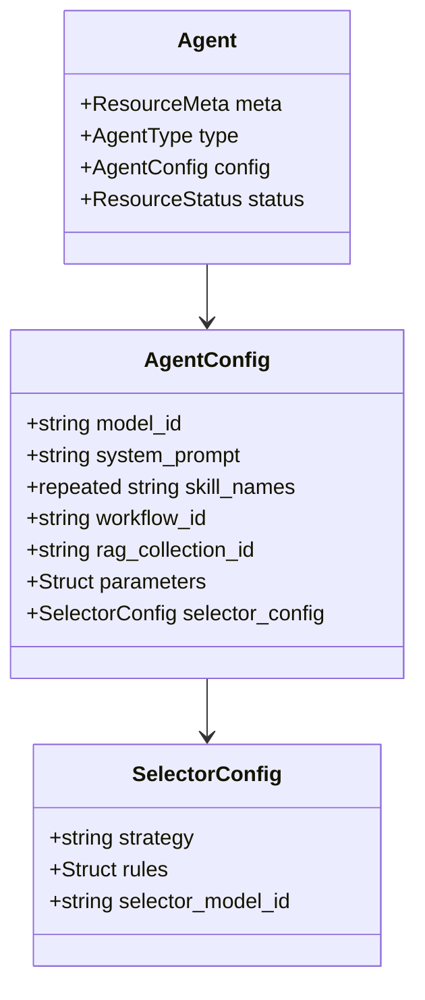
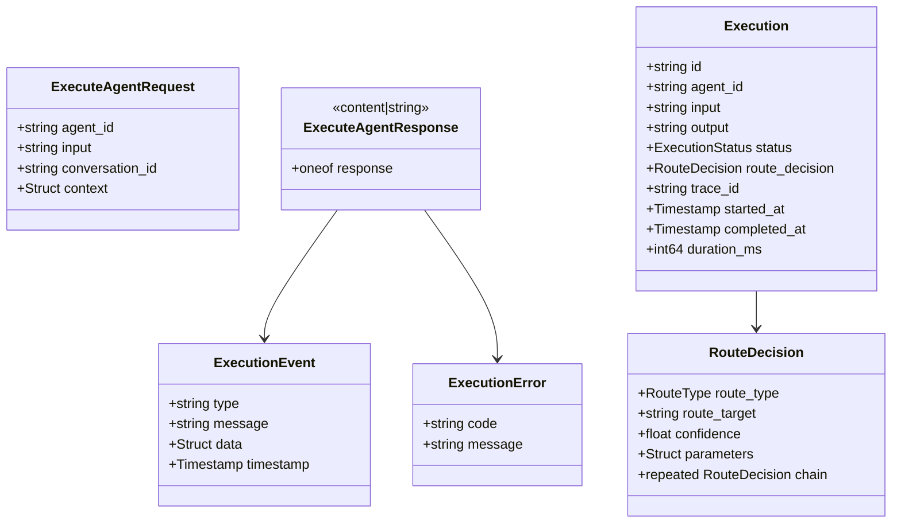
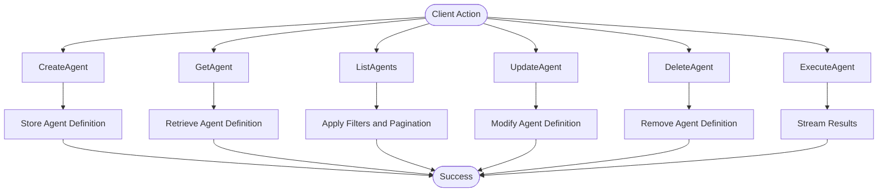
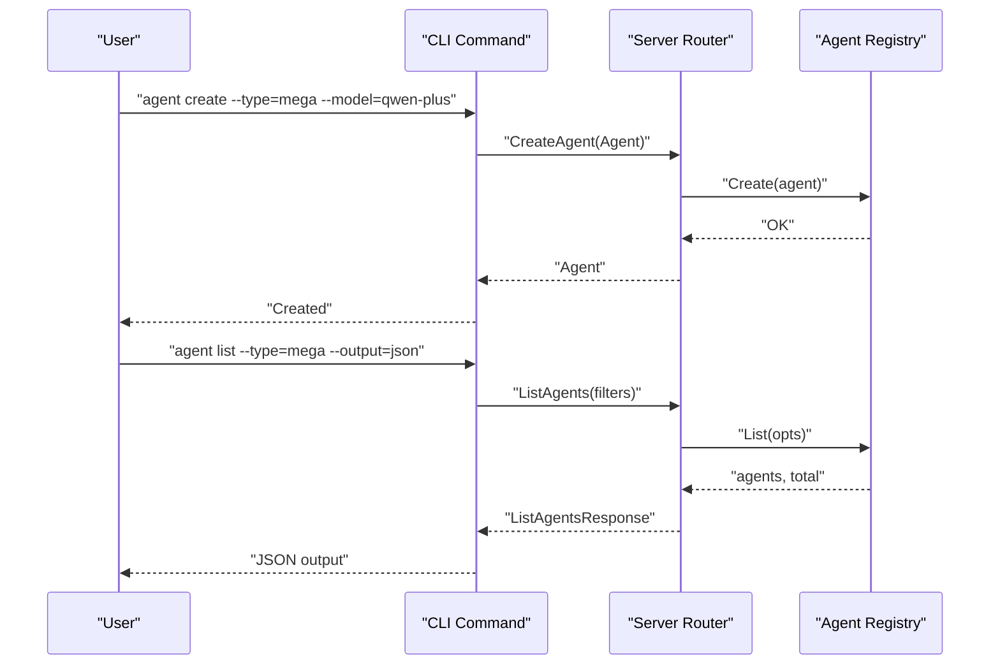
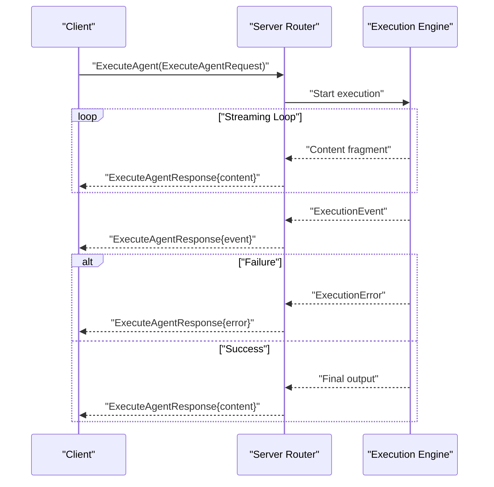
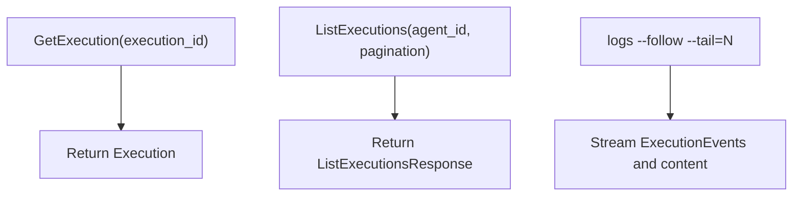
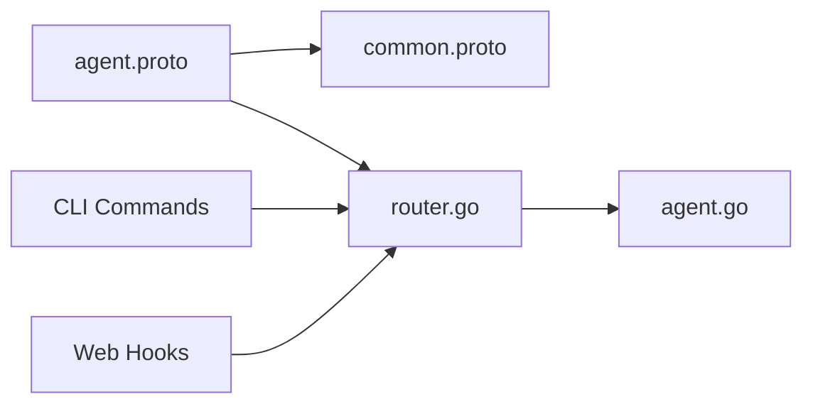

# Agent Service

<cite>
**Referenced Files in This Document**
- [agent.proto](file://api/proto/resolvenet/v1/agent.proto)
- [common.proto](file://api/proto/resolvenet/v1/common.proto)
- [agent.go](file://pkg/registry/agent.go)
- [router.go](file://pkg/server/router.go)
- [create.go](file://internal/cli/agent/create.go)
- [delete.go](file://internal/cli/agent/delete.go)
- [list.go](file://internal/cli/agent/list.go)
- [run.go](file://internal/cli/agent/run.go)
- [logs.go](file://internal/cli/agent/logs.go)
- [useAgents.ts](file://web/src/hooks/useAgents.ts)
- [agent-example.yaml](file://configs/examples/agent-example.yaml)
</cite>

## Table of Contents
1. [Introduction](#introduction)
2. [Project Structure](#project-structure)
3. [Core Components](#core-components)
4. [Architecture Overview](#architecture-overview)
5. [Detailed Component Analysis](#detailed-component-analysis)
6. [Dependency Analysis](#dependency-analysis)
7. [Performance Considerations](#performance-considerations)
8. [Troubleshooting Guide](#troubleshooting-guide)
9. [Conclusion](#conclusion)
10. [Appendices](#appendices)

## Introduction
This document provides comprehensive gRPC service documentation for the AgentService. It covers agent lifecycle operations (creation, retrieval, listing, update, deletion), execution orchestration with streaming updates, execution metadata and status tracking, configuration schemas, and monitoring endpoints. It also outlines message type specifications for agent definitions, execution context, and result reporting, along with client implementation patterns for management operations and streaming execution.

## Project Structure
The AgentService is defined in Protocol Buffers and integrated with backend services and CLI clients. The key elements are:
- Protocol Buffer definitions for the AgentService and shared types
- Backend server handlers (HTTP stubs; gRPC server implementation pending)
- CLI commands for agent management and execution
- Web client hooks for agent listing and creation
- Example agent configuration YAML

**Diagram sources**
- [agent.proto:11-29](file://api/proto/resolvenet/v1/agent.proto#L11-L29)
- [common.proto:9-48](file://api/proto/resolvenet/v1/common.proto#L9-L48)
- [router.go:11-25](file://pkg/server/router.go#L11-L25)
- [agent.go:21-28](file://pkg/registry/agent.go#L21-L28)
- [create.go:9-31](file://internal/cli/agent/create.go#L9-L31)
- [delete.go:9-21](file://internal/cli/agent/delete.go#L9-L21)
- [list.go:9-28](file://internal/cli/agent/list.go#L9-L28)
- [run.go:9-28](file://internal/cli/agent/run.go#L9-L28)
- [logs.go:9-27](file://internal/cli/agent/logs.go#L9-L27)
- [useAgents.ts:4-28](file://web/src/hooks/useAgents.ts#L4-L28)

**Section sources**
- [agent.proto:1-177](file://api/proto/resolvenet/v1/agent.proto#L1-L177)
- [common.proto:1-49](file://api/proto/resolvenet/v1/common.proto#L1-L49)
- [router.go:11-25](file://pkg/server/router.go#L11-L25)

## Core Components
- AgentService gRPC API: Defines lifecycle and execution operations with streaming support.
- Agent definition and configuration: Structured metadata, type, config, and status.
- Execution model: Execution records, status, route decisions, and timing.
- Shared types: Pagination, resource metadata, and status enums.
- Backend registry: In-memory storage abstraction for agent definitions.
- CLI and web clients: Management and execution command patterns.

**Section sources**
- [agent.proto:11-29](file://api/proto/resolvenet/v1/agent.proto#L11-L29)
- [agent.proto:42-47](file://api/proto/resolvenet/v1/agent.proto#L42-L47)
- [agent.proto:49-58](file://api/proto/resolvenet/v1/agent.proto#L49-L58)
- [agent.proto:124-136](file://api/proto/resolvenet/v1/agent.proto#L124-L136)
- [common.proto:9-48](file://api/proto/resolvenet/v1/common.proto#L9-L48)
- [agent.go:9-28](file://pkg/registry/agent.go#L9-L28)

## Architecture Overview
The AgentService exposes lifecycle and execution RPCs. Clients (CLI, web) interact with the backend server. The server currently implements HTTP handlers as stubs; gRPC server implementation is pending. Executions are streamed to clients via ExecuteAgent RPC.

**Diagram sources**
- [agent.proto:13-28](file://api/proto/resolvenet/v1/agent.proto#L13-L28)
- [router.go:71-94](file://pkg/server/router.go#L71-L94)
- [agent.go:23-27](file://pkg/registry/agent.go#L23-L27)

## Detailed Component Analysis

### AgentService API Surface
- CreateAgent: Creates a new agent definition from an Agent message.
- GetAgent: Retrieves an agent by ID.
- ListAgents: Lists agents with pagination and optional filters.
- UpdateAgent: Updates an existing agent definition.
- DeleteAgent: Removes an agent by ID.
- ExecuteAgent: Executes an agent and streams content, events, or errors.
- GetExecution: Retrieves a single execution record by ID.
- ListExecutions: Lists executions for an agent with pagination.

**Diagram sources**
- [agent.proto:12-29](file://api/proto/resolvenet/v1/agent.proto#L12-L29)

**Section sources**
- [agent.proto:13-28](file://api/proto/resolvenet/v1/agent.proto#L13-L28)

### Agent Definition and Configuration
- Agent: Contains ResourceMeta, AgentType, AgentConfig, and ResourceStatus.
- AgentConfig: Includes model_id, system_prompt, skill_names, workflow_id, rag_collection_id, parameters, and SelectorConfig.
- SelectorConfig: Strategy selection ("llm", "rule", "hybrid"), rules, and selector_model_id.

**Diagram sources**
- [agent.proto:42-58](file://api/proto/resolvenet/v1/agent.proto#L42-L58)
- [agent.proto:60-65](file://api/proto/resolvenet/v1/agent.proto#L60-L65)

**Section sources**
- [agent.proto:42-58](file://api/proto/resolvenet/v1/agent.proto#L42-L58)
- [agent.proto:60-65](file://api/proto/resolvenet/v1/agent.proto#L60-L65)

### Execution Model and Streaming
- ExecuteAgentRequest: agent_id, input, conversation_id, and context.
- ExecuteAgentResponse: oneof content, event, or error.
- Execution: execution metadata, status, route decision, trace_id, timestamps, and duration.
- ExecutionStatus: pending, running, completed, failed.
- ExecutionEvent: type, message, data, and timestamp.
- ExecutionError: code and message.
- RouteDecision and RouteType: routing decisions and targets.

**Diagram sources**
- [agent.proto:97-110](file://api/proto/resolvenet/v1/agent.proto#L97-L110)
- [agent.proto:124-136](file://api/proto/resolvenet/v1/agent.proto#L124-L136)
- [agent.proto:112-122](file://api/proto/resolvenet/v1/agent.proto#L112-L122)
- [agent.proto:146-162](file://api/proto/resolvenet/v1/agent.proto#L146-L162)

**Section sources**
- [agent.proto:97-110](file://api/proto/resolvenet/v1/agent.proto#L97-L110)
- [agent.proto:124-136](file://api/proto/resolvenet/v1/agent.proto#L124-L136)
- [agent.proto:112-122](file://api/proto/resolvenet/v1/agent.proto#L112-L122)
- [agent.proto:138-144](file://api/proto/resolvenet/v1/agent.proto#L138-L144)
- [agent.proto:146-162](file://api/proto/resolvenet/v1/agent.proto#L146-L162)

### Lifecycle Operations Flow

**Diagram sources**
- [agent.proto:13-28](file://api/proto/resolvenet/v1/agent.proto#L13-L28)
- [agent.go:23-27](file://pkg/registry/agent.go#L23-L27)

**Section sources**
- [agent.proto:13-28](file://api/proto/resolvenet/v1/agent.proto#L13-L28)
- [agent.go:23-27](file://pkg/registry/agent.go#L23-L27)

### Client Implementation Patterns
- CLI commands:
  - Create agent: newCreateCmd parses flags and prepares agent creation.
  - List agents: newListCmd supports filtering and output formats.
  - Run agent: newRunCmd initiates interactive sessions.
  - Delete agent: newDeleteCmd removes agents by ID.
  - Logs: newLogsCmd streams logs with follow and tail options.
- Web client hooks:
  - useAgents: fetches agent list.
  - useAgent: fetches a specific agent by ID.
  - useCreateAgent: mutation to create an agent and invalidate queries.

**Diagram sources**
- [create.go:9-31](file://internal/cli/agent/create.go#L9-L31)
- [list.go:9-28](file://internal/cli/agent/list.go#L9-L28)
- [router.go:71-73](file://pkg/server/router.go#L71-L73)
- [agent.go:23-27](file://pkg/registry/agent.go#L23-L27)

**Section sources**
- [create.go:9-31](file://internal/cli/agent/create.go#L9-L31)
- [delete.go:9-21](file://internal/cli/agent/delete.go#L9-L21)
- [list.go:9-28](file://internal/cli/agent/list.go#L9-L28)
- [run.go:9-28](file://internal/cli/agent/run.go#L9-L28)
- [logs.go:9-27](file://internal/cli/agent/logs.go#L9-L27)
- [useAgents.ts:4-28](file://web/src/hooks/useAgents.ts#L4-L28)

### Execution Streaming Pattern
- ExecuteAgent is declared as a server-streaming RPC returning ExecuteAgentResponse.
- Responses can carry:
  - Content fragments for incremental output
  - Events for progress and diagnostics
  - Errors for failure conditions
- Clients should handle the oneof response field and process content incrementally.

**Diagram sources**
- [agent.proto:23-24](file://api/proto/resolvenet/v1/agent.proto#L23-L24)
- [agent.proto:104-110](file://api/proto/resolvenet/v1/agent.proto#L104-L110)
- [agent.proto:112-122](file://api/proto/resolvenet/v1/agent.proto#L112-L122)

**Section sources**
- [agent.proto:23-24](file://api/proto/resolvenet/v1/agent.proto#L23-L24)
- [agent.proto:104-110](file://api/proto/resolvenet/v1/agent.proto#L104-L110)
- [agent.proto:112-122](file://api/proto/resolvenet/v1/agent.proto#L112-L122)

### Monitoring and Logging Endpoints
- Execution retrieval: GetExecution returns a single execution record.
- Execution listing: ListExecutions returns paginated execution history for an agent.
- Logs streaming: CLI logs command supports follow mode and tail count; streaming pattern aligns with ExecuteAgent’s streaming semantics.

**Diagram sources**
- [agent.proto:164-176](file://api/proto/resolvenet/v1/agent.proto#L164-L176)
- [logs.go:9-27](file://internal/cli/agent/logs.go#L9-L27)

**Section sources**
- [agent.proto:164-176](file://api/proto/resolvenet/v1/agent.proto#L164-L176)
- [logs.go:9-27](file://internal/cli/agent/logs.go#L9-L27)

## Dependency Analysis
- Protocol Buffer dependencies:
  - agent.proto imports common.proto and Google protobuf types.
  - Uses ResourceMeta, ResourceStatus, PaginationRequest/Response, and Struct/Timestamp.
- Backend integration:
  - Server router defines HTTP endpoints; gRPC server implementation is pending.
  - AgentRegistry provides in-memory storage for agent definitions.
- Client integration:
  - CLI commands demonstrate flag-driven creation and execution.
  - Web hooks integrate with REST API client for listing and creation.

**Diagram sources**
- [agent.proto:7-9](file://api/proto/resolvenet/v1/agent.proto#L7-L9)
- [common.proto:1-8](file://api/proto/resolvenet/v1/common.proto#L1-L8)
- [router.go:11-25](file://pkg/server/router.go#L11-L25)
- [agent.go:21-28](file://pkg/registry/agent.go#L21-L28)
- [create.go:9-31](file://internal/cli/agent/create.go#L9-L31)
- [useAgents.ts:4-28](file://web/src/hooks/useAgents.ts#L4-L28)

**Section sources**
- [agent.proto:7-9](file://api/proto/resolvenet/v1/agent.proto#L7-L9)
- [common.proto:1-8](file://api/proto/resolvenet/v1/common.proto#L1-L8)
- [router.go:11-25](file://pkg/server/router.go#L11-L25)
- [agent.go:21-28](file://pkg/registry/agent.go#L21-L28)
- [create.go:9-31](file://internal/cli/agent/create.go#L9-L31)
- [useAgents.ts:4-28](file://web/src/hooks/useAgents.ts#L4-L28)

## Performance Considerations
- Streaming execution: Use ExecuteAgent streaming to minimize latency and memory overhead for long-running operations.
- Pagination: Apply ListAgents and ListExecutions pagination to limit payload sizes.
- Filtering: Use type_filter and status_filter to reduce server-side processing.
- Concurrency: Ensure thread-safe access to in-memory registry during concurrent operations.
- Backpressure: Clients should process streaming responses promptly to avoid blocking the server.

## Troubleshooting Guide
- HTTP stubs: Current server handlers return NotImplemented or NotFound; implement gRPC server to enable full functionality.
- Execution failures: Inspect ExecutionError for error codes and messages; verify agent configuration and model availability.
- Streaming issues: Ensure client handles oneof response variants and retries on transient network errors.
- Registry errors: InMemoryAgentRegistry returns not found or already exists errors; validate agent IDs and uniqueness.

**Section sources**
- [router.go:75-94](file://pkg/server/router.go#L75-L94)
- [agent.go:43-52](file://pkg/registry/agent.go#L43-L52)
- [agent.go:55-63](file://pkg/registry/agent.go#L55-L63)
- [agent.go:77-86](file://pkg/registry/agent.go#L77-L86)
- [agent.go:89-94](file://pkg/registry/agent.go#L89-L94)

## Conclusion
The AgentService provides a robust foundation for managing agents and orchestrating their execution with streaming updates. While the gRPC server implementation is pending, the Protocol Buffer definitions and shared types establish a clear contract. Clients can leverage CLI and web integrations to manage agents and execute them interactively. Future work includes implementing the gRPC server and integrating execution engines to realize streaming execution and monitoring.

## Appendices

### Message Type Specifications
- Agent: ResourceMeta, AgentType, AgentConfig, ResourceStatus
- AgentConfig: model_id, system_prompt, skill_names, workflow_id, rag_collection_id, parameters, selector_config
- SelectorConfig: strategy, rules, selector_model_id
- ExecuteAgentRequest: agent_id, input, conversation_id, context
- ExecuteAgentResponse: oneof content, event, error
- Execution: id, agent_id, input, output, status, route_decision, trace_id, timestamps, duration
- ExecutionEvent: type, message, data, timestamp
- ExecutionError: code, message
- RouteDecision: route_type, route_target, confidence, parameters, chain
- RouteType: fta, skill, rag, multi, direct
- ExecutionStatus: pending, running, completed, failed

**Section sources**
- [agent.proto:42-47](file://api/proto/resolvenet/v1/agent.proto#L42-L47)
- [agent.proto:49-58](file://api/proto/resolvenet/v1/agent.proto#L49-L58)
- [agent.proto:97-110](file://api/proto/resolvenet/v1/agent.proto#L97-L110)
- [agent.proto:124-136](file://api/proto/resolvenet/v1/agent.proto#L124-L136)
- [agent.proto:112-122](file://api/proto/resolvenet/v1/agent.proto#L112-L122)
- [agent.proto:146-162](file://api/proto/resolvenet/v1/agent.proto#L146-L162)
- [agent.proto:138-144](file://api/proto/resolvenet/v1/agent.proto#L138-L144)

### Example Agent Configuration
- Example YAML demonstrates agent name, type, description, model_id, system_prompt, skill_names, and selector_config.

**Section sources**
- [agent-example.yaml:1-18](file://configs/examples/agent-example.yaml#L1-L18)