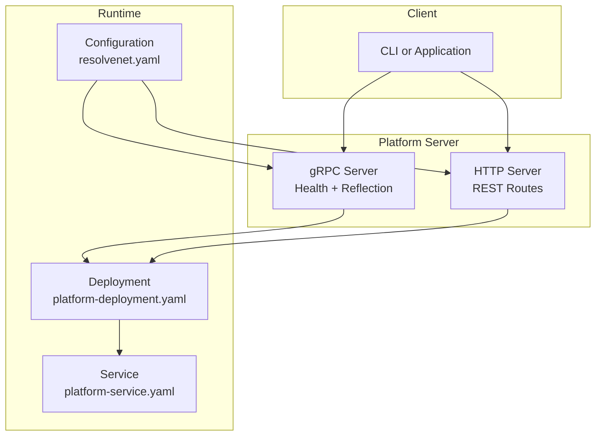
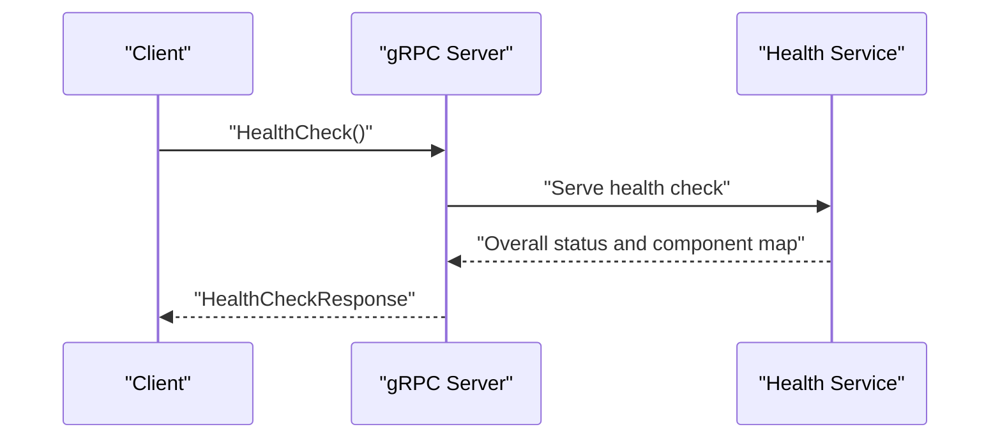
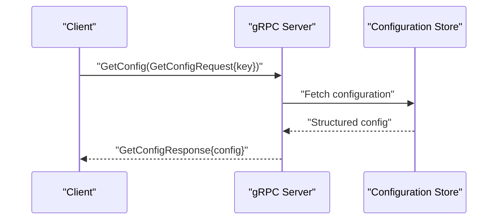
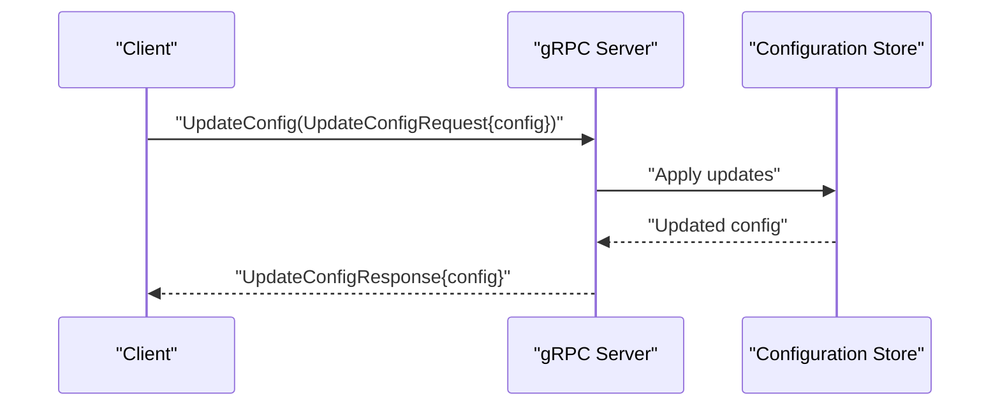
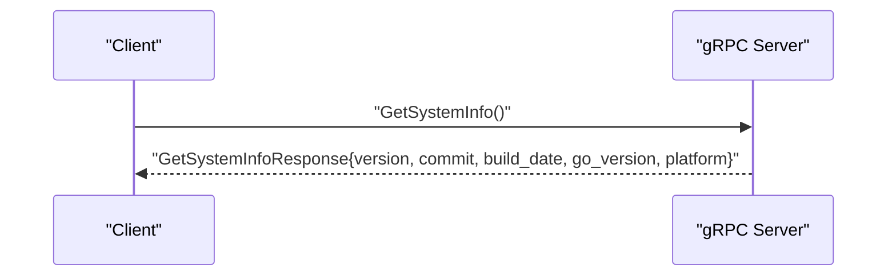
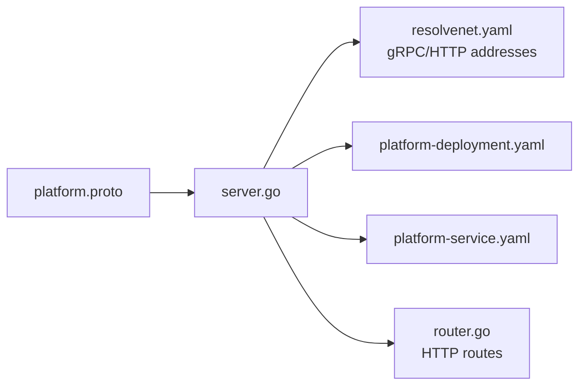

# Platform Service

<cite>
**Referenced Files in This Document**
- [platform.proto](file://api/proto/resolvenet/v1/platform.proto)
- [server.go](file://pkg/server/server.go)
- [router.go](file://pkg/server/router.go)
- [resolvenet.yaml](file://configs/resolvenet.yaml)
- [platform-service.yaml](file://deploy/helm/resolvenet/templates/platform-service.yaml)
- [platform-deployment.yaml](file://deploy/helm/resolvenet/templates/platform-deployment.yaml)
- [main.go](file://cmd/resolvenet-server/main.go)
</cite>

## Table of Contents
1. [Introduction](#introduction)
2. [Project Structure](#project-structure)
3. [Core Components](#core-components)
4. [Architecture Overview](#architecture-overview)
5. [Detailed Component Analysis](#detailed-component-analysis)
6. [Dependency Analysis](#dependency-analysis)
7. [Performance Considerations](#performance-considerations)
8. [Troubleshooting Guide](#troubleshooting-guide)
9. [Conclusion](#conclusion)

## Introduction
This document provides comprehensive gRPC service documentation for the PlatformService. It covers platform-level operations including HealthCheck, GetConfig, UpdateConfig, and GetSystemInfo. It also documents the associated message schemas, enums, and operational guidelines for clients. The PlatformService is defined in the protocol buffer specification and integrated into the platform server runtime, which exposes both gRPC and HTTP endpoints.

## Project Structure
The PlatformService is defined in the protocol buffer specification and is part of the platform service runtime. The server initializes a gRPC server, registers health checking, and exposes HTTP endpoints for system information and configuration. Helm templates define deployment and service configuration for Kubernetes environments.

```mermaid
graph TB
subgraph "Protocol Buffer Definitions"
P["platform.proto<br/>Defines PlatformService RPCs and messages"]
end
subgraph "Server Runtime"
S["server.go<br/>Creates gRPC server, registers health, starts listeners"]
R["router.go<br/>Registers HTTP routes for system info and config"]
end
subgraph "Deployment"
D["platform-deployment.yaml<br/>Kubernetes Deployment"]
SVC["platform-service.yaml<br/>Kubernetes Service exposing gRPC/HTTP"]
end
subgraph "Configuration"
C["resolvenet.yaml<br/>Server addresses for gRPC/HTTP"]
end
P --> S
S --> R
S --> D
D --> SVC
C --> S
```

**Diagram sources**
- [platform.proto](file://api/proto/resolvenet/v1/platform.proto)
- [server.go](file://pkg/server/server.go)
- [router.go](file://pkg/server/router.go)
- [platform-deployment.yaml](file://deploy/helm/resolvenet/templates/platform-deployment.yaml)
- [platform-service.yaml](file://deploy/helm/resolvenet/templates/platform-service.yaml)
- [resolvenet.yaml](file://configs/resolvenet.yaml)

**Section sources**
- [platform.proto](file://api/proto/resolvenet/v1/platform.proto)
- [server.go](file://pkg/server/server.go)
- [router.go](file://pkg/server/router.go)
- [resolvenet.yaml](file://configs/resolvenet.yaml)
- [platform-deployment.yaml](file://deploy/helm/resolvenet/templates/platform-deployment.yaml)
- [platform-service.yaml](file://deploy/helm/resolvenet/templates/platform-service.yaml)

## Core Components
This section documents the PlatformService RPCs and their associated messages and enums.

- Service: PlatformService
  - RPCs:
    - HealthCheck(HealthCheckRequest) returns (HealthCheckResponse)
    - GetConfig(GetConfigRequest) returns (GetConfigResponse)
    - UpdateConfig(UpdateConfigRequest) returns (UpdateConfigResponse)
    - GetSystemInfo(GetSystemInfoRequest) returns (GetSystemInfoResponse)

- Messages and Enums

  - HealthCheckRequest
    - Purpose: Trigger a health check operation.
    - Fields: None.

  - HealthCheckResponse
    - overall: ServiceHealth
      - status: HealthStatus
      - message: string
    - components: map<string, ServiceHealth>
      - Keys: Component identifiers (string).
      - Values: ServiceHealth per component.

  - ServiceHealth
    - status: HealthStatus
    - message: string

  - HealthStatus
    - HEALTH_STATUS_UNSPECIFIED
    - HEALTH_STATUS_HEALTHY
    - HEALTH_STATUS_DEGRADED
    - HEALTH_STATUS_UNHEALTHY

  - GetConfigRequest
    - key: string
      - Empty string means return all configuration.
      - Non-empty string indicates a specific configuration key.

  - GetConfigResponse
    - config: google.protobuf.Struct
      - Contains the requested configuration as a structured value.

  - UpdateConfigRequest
    - config: google.protobuf.Struct
      - Full or partial configuration payload to update.

  - UpdateConfigResponse
    - config: google.protobuf.Struct
      - Updated configuration returned to confirm changes.

  - GetSystemInfoRequest
    - Purpose: Retrieve platform system information.
    - Fields: None.

  - GetSystemInfoResponse
    - version: string
    - commit: string
    - build_date: string
    - go_version: string
    - platform: string

Validation and Behavior Notes
- HealthCheckResponse.components is a map keyed by component identifier. Clients should handle missing keys gracefully.
- GetConfigRequest.key supports wildcard semantics: empty key returns all configuration.
- UpdateConfigRequest accepts a structured configuration payload; the server should apply updates atomically where possible.
- GetSystemInfoResponse fields are informational and intended for diagnostics and monitoring.

**Section sources**
- [platform.proto](file://api/proto/resolvenet/v1/platform.proto)

## Architecture Overview
The PlatformService is served by the platform server, which runs both gRPC and HTTP endpoints. The gRPC server is initialized with health checking and reflection support. The HTTP server exposes REST endpoints for system information and configuration. Kubernetes deployment and service manifests expose both HTTP and gRPC ports.

**Diagram sources**
- [server.go](file://pkg/server/server.go)
- [router.go](file://pkg/server/router.go)
- [resolvenet.yaml](file://configs/resolvenet.yaml)
- [platform-deployment.yaml](file://deploy/helm/resolvenet/templates/platform-deployment.yaml)
- [platform-service.yaml](file://deploy/helm/resolvenet/templates/platform-service.yaml)

**Section sources**
- [server.go](file://pkg/server/server.go)
- [router.go](file://pkg/server/router.go)
- [resolvenet.yaml](file://configs/resolvenet.yaml)
- [platform-deployment.yaml](file://deploy/helm/resolvenet/templates/platform-deployment.yaml)
- [platform-service.yaml](file://deploy/helm/resolvenet/templates/platform-service.yaml)

## Detailed Component Analysis

### HealthCheck Operation
Purpose
- Provides overall service health and per-component health status.

Message Flow

Behavior
- Returns an overall HealthStatus and a map of component-specific HealthStatus entries.
- Clients should interpret HEALTH_STATUS_HEALTHY as fully operational, HEALTH_STATUS_DEGRADED as partially functional, and HEALTH_STATUS_UNHEALTHY as non-operational.

**Diagram sources**
- [platform.proto](file://api/proto/resolvenet/v1/platform.proto)
- [server.go](file://pkg/server/server.go)

**Section sources**
- [platform.proto](file://api/proto/resolvenet/v1/platform.proto)
- [server.go](file://pkg/server/server.go)

### GetConfig Operation
Purpose
- Retrieves configuration values either fully or by a specific key.

Message Flow

Behavior
- If key is empty, returns the entire configuration as a structured value.
- If key is specified, returns only the matching configuration subtree or value.

**Diagram sources**
- [platform.proto](file://api/proto/resolvenet/v1/platform.proto)

**Section sources**
- [platform.proto](file://api/proto/resolvenet/v1/platform.proto)

### UpdateConfig Operation
Purpose
- Updates configuration with provided values.

Message Flow

Behavior
- Accepts a structured configuration payload.
- Returns the updated configuration to confirm changes.
- Apply semantics are implementation-dependent; atomicity depends on the underlying store.

**Diagram sources**
- [platform.proto](file://api/proto/resolvenet/v1/platform.proto)

**Section sources**
- [platform.proto](file://api/proto/resolvenet/v1/platform.proto)

### GetSystemInfo Operation
Purpose
- Returns platform metadata such as version, commit, build date, Go version, and platform.

Message Flow

Behavior
- Returns static or runtime-derived metadata.
- Useful for diagnostics, logging, and automated tooling.

**Diagram sources**
- [platform.proto](file://api/proto/resolvenet/v1/platform.proto)

**Section sources**
- [platform.proto](file://api/proto/resolvenet/v1/platform.proto)

### Message Schema Reference
- HealthCheckRequest
  - Fields: none
- HealthCheckResponse
  - overall: ServiceHealth
  - components: map<string, ServiceHealth>
- ServiceHealth
  - status: HealthStatus
  - message: string
- HealthStatus
  - HEALTH_STATUS_UNSPECIFIED
  - HEALTH_STATUS_HEALTHY
  - HEALTH_STATUS_DEGRADED
  - HEALTH_STATUS_UNHEALTHY
- GetConfigRequest
  - key: string
- GetConfigResponse
  - config: google.protobuf.Struct
- UpdateConfigRequest
  - config: google.protobuf.Struct
- UpdateConfigResponse
  - config: google.protobuf.Struct
- GetSystemInfoRequest
  - Fields: none
- GetSystemInfoResponse
  - version: string
  - commit: string
  - build_date: string
  - go_version: string
  - platform: string

Validation Rules
- HealthCheckResponse.components may be empty if no components are tracked.
- GetConfigRequest.key is optional; empty means fetch all.
- UpdateConfigRequest.config must be a valid structured configuration payload.
- GetSystemInfoResponse fields are informational and may vary by build/runtime.

**Section sources**
- [platform.proto](file://api/proto/resolvenet/v1/platform.proto)

## Dependency Analysis
The PlatformService relies on the gRPC server runtime and configuration. The server initializes gRPC, registers health checking, and starts listeners based on configuration. HTTP routes complement gRPC for system information and configuration endpoints.

**Diagram sources**
- [platform.proto](file://api/proto/resolvenet/v1/platform.proto)
- [server.go](file://pkg/server/server.go)
- [router.go](file://pkg/server/router.go)
- [resolvenet.yaml](file://configs/resolvenet.yaml)
- [platform-deployment.yaml](file://deploy/helm/resolvenet/templates/platform-deployment.yaml)
- [platform-service.yaml](file://deploy/helm/resolvenet/templates/platform-service.yaml)

**Section sources**
- [server.go](file://pkg/server/server.go)
- [router.go](file://pkg/server/router.go)
- [resolvenet.yaml](file://configs/resolvenet.yaml)
- [platform-deployment.yaml](file://deploy/helm/resolvenet/templates/platform-deployment.yaml)
- [platform-service.yaml](file://deploy/helm/resolvenet/templates/platform-service.yaml)

## Performance Considerations
- HealthCheck is lightweight and suitable for frequent polling; cache results client-side to reduce load.
- GetConfig with an empty key may return large payloads; consider specifying a key to limit response size.
- UpdateConfig should be rate-limited by clients to avoid excessive writes to the configuration store.
- Use keepalive and compression settings appropriate for your network conditions to optimize gRPC throughput.

## Troubleshooting Guide
Common Issues and Resolutions
- Connection refused
  - Verify gRPC address from configuration and ensure the server is running.
  - Confirm Kubernetes service ports match the configured gRPC port.
- Health status UNHEALTHY
  - Inspect component-specific entries in HealthCheckResponse.components for details.
  - Review server logs for errors during startup or runtime.
- Large GetConfig responses
  - Use a specific key in GetConfigRequest to narrow the response.
- UpdateConfig failures
  - Validate the structure of the provided configuration payload.
  - Retry with backoff on transient errors; ensure idempotent updates where possible.

Operational References
- Server initialization and listener setup:
  - gRPC address binding and graceful shutdown.
- HTTP system info endpoint:
  - Used for basic system metadata retrieval and health verification.
- Kubernetes service exposure:
  - Ensure both HTTP and gRPC ports are exposed and reachable.

**Section sources**
- [server.go](file://pkg/server/server.go)
- [router.go](file://pkg/server/router.go)
- [resolvenet.yaml](file://configs/resolvenet.yaml)
- [platform-service.yaml](file://deploy/helm/resolvenet/templates/platform-service.yaml)

## Client Implementation Examples
Note: The following examples describe patterns and steps. Replace placeholders with actual values and integrate with your chosen gRPC client library.

Channel Setup
- Create a gRPC client channel targeting the configured gRPC address.
- Configure credentials if TLS is enabled; otherwise use plaintext.
- Set reasonable timeouts and keepalive parameters.

Stub Creation
- Generate the PlatformService stub from the protocol buffer definition.
- Instantiate the stub with the channel.

Method Invocation Patterns
- HealthCheck
  - Call HealthCheck with an empty request.
  - Inspect HealthCheckResponse.overall and HealthCheckResponse.components for status and messages.
- GetConfig
  - Call GetConfig with GetConfigRequest{key: ""} to fetch all configuration.
  - For specific keys, set key to the desired configuration path.
- UpdateConfig
  - Prepare a structured configuration payload.
  - Call UpdateConfig with UpdateConfigRequest{config: ...}.
  - Validate the returned configuration in UpdateConfigResponse.config.
- GetSystemInfo
  - Call GetSystemInfo with an empty request.
  - Use fields from GetSystemInfoResponse for diagnostics.

Error Handling and Retries
- Wrap calls in retry loops with exponential backoff for transient errors.
- Distinguish between transient and permanent errors (e.g., invalid argument vs. unavailable).
- Log errors with context (method name, request ID if applicable).

Connection Management
- Reuse channels across multiple RPCs to minimize overhead.
- Monitor connection health via keepalive and health checks.
- Gracefully close channels on shutdown.

**Section sources**
- [platform.proto](file://api/proto/resolvenet/v1/platform.proto)
- [server.go](file://pkg/server/server.go)
- [resolvenet.yaml](file://configs/resolvenet.yaml)

## Conclusion
The PlatformService provides essential platform-level capabilities: health monitoring, configuration retrieval and updates, and system information access. Its protocol buffer definitions and server runtime enable robust integration across clients and environments. By following the documented schemas, invocation patterns, and operational guidance, teams can reliably consume these services in development and production.