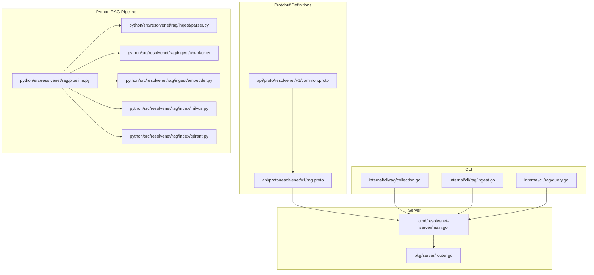
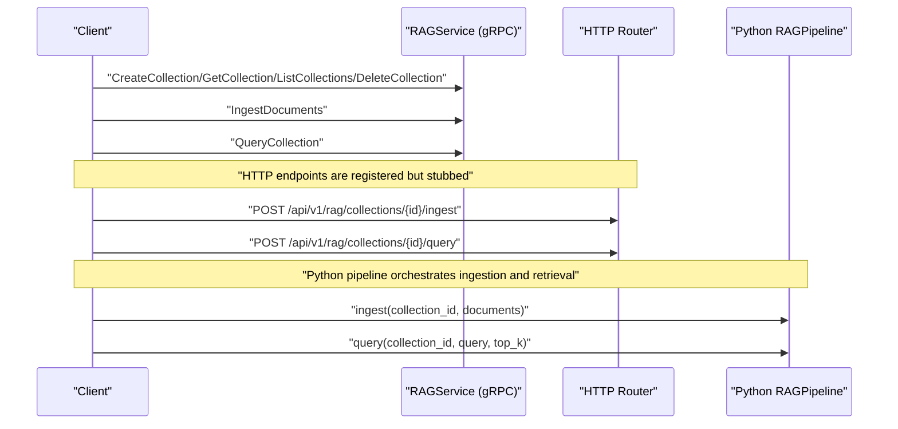
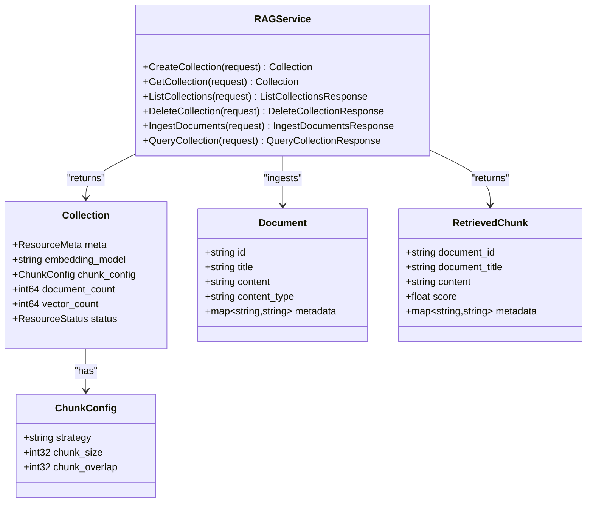
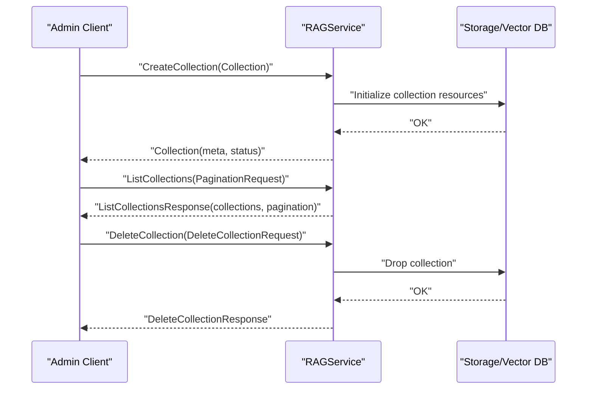
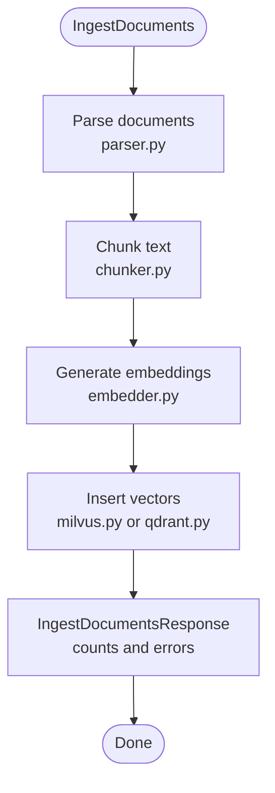
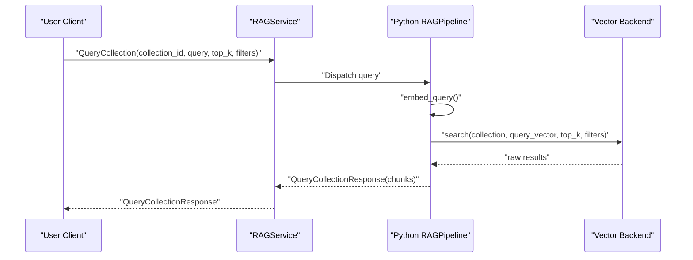
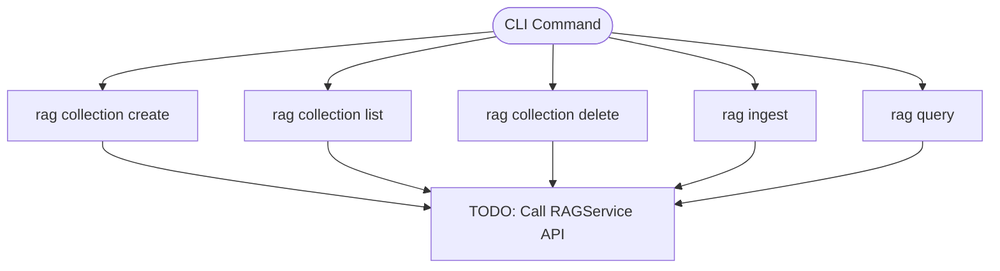
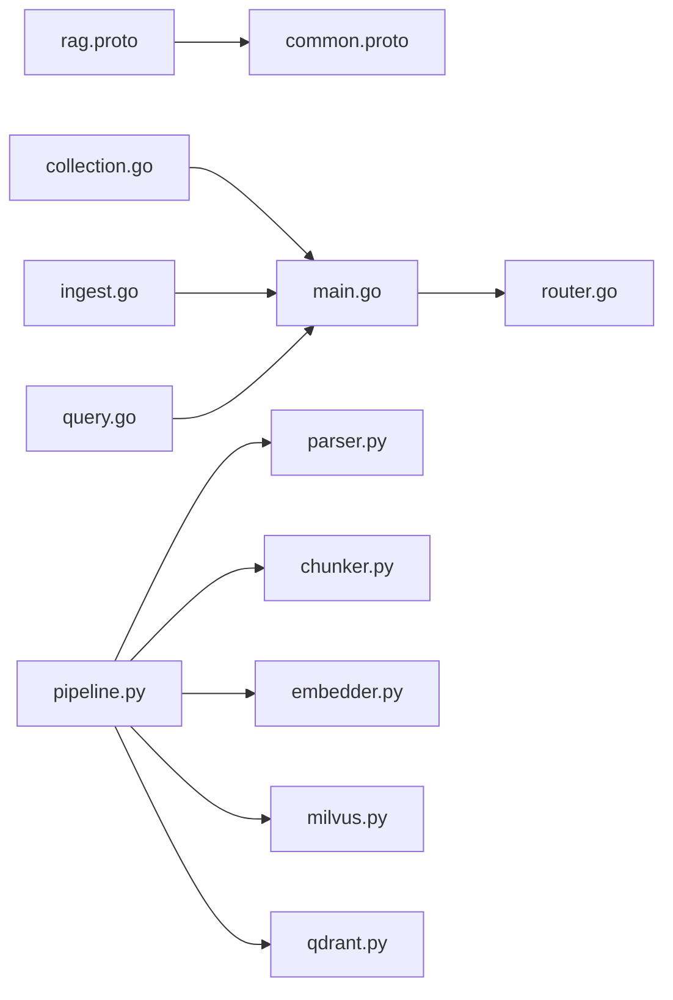

# RAG Service

<cite>
**Referenced Files in This Document**
- [rag.proto](file://api/proto/resolvenet/v1/rag.proto)
- [common.proto](file://api/proto/resolvenet/v1/common.proto)
- [router.go](file://pkg/server/router.go)
- [main.go](file://cmd/resolvenet-server/main.go)
- [collection.go](file://internal/cli/rag/collection.go)
- [ingest.go](file://internal/cli/rag/ingest.go)
- [query.go](file://internal/cli/rag/query.go)
- [pipeline.py](file://python/src/resolvenet/rag/pipeline.py)
- [milvus.py](file://python/src/resolvenet/rag/index/milvus.py)
- [qdrant.py](file://python/src/resolvenet/rag/index/qdrant.py)
- [chunker.py](file://python/src/resolvenet/rag/ingest/chunker.py)
- [parser.py](file://python/src/resolvenet/rag/ingest/parser.py)
- [embedder.py](file://python/src/resolvenet/rag/ingest/embedder.py)
</cite>

## Table of Contents
1. [Introduction](#introduction)
2. [Project Structure](#project-structure)
3. [Core Components](#core-components)
4. [Architecture Overview](#architecture-overview)
5. [Detailed Component Analysis](#detailed-component-analysis)
6. [Dependency Analysis](#dependency-analysis)
7. [Performance Considerations](#performance-considerations)
8. [Troubleshooting Guide](#troubleshooting-guide)
9. [Conclusion](#conclusion)
10. [Appendices](#appendices)

## Introduction
This document provides comprehensive gRPC service documentation for the RAGService, focusing on the Retrieval-Augmented Generation pipeline. It covers collection management, document ingestion, and query execution. It also details collection schema definitions, vector indexing operations, retrieval configuration, ingestion workflows (parsing, chunking, embedding), query operations (semantic search, optional reranking, result aggregation), and message type specifications. Client implementation examples are included for managing the RAG pipeline, along with guidance on performance optimization, batch operations, and streaming for large-scale retrieval.

## Project Structure
The RAGService spans protocol buffers definitions, server-side HTTP routing, CLI commands, and a Python-based RAG pipeline implementation. The gRPC surface is defined in protobuf, while HTTP endpoints are registered in the server router. The CLI provides user-facing commands for collection management, ingestion, and querying. The Python pipeline encapsulates ingestion and retrieval logic with pluggable components for parsing, chunking, embedding, and vector indexing.

**Diagram sources**
- [rag.proto:1-99](file://api/proto/resolvenet/v1/rag.proto#L1-L99)
- [common.proto](file://api/proto/resolvenet/v1/common.proto)
- [router.go:1-183](file://pkg/server/router.go#L1-L183)
- [main.go:1-56](file://cmd/resolvenet-server/main.go#L1-L56)
- [collection.go:1-80](file://internal/cli/rag/collection.go#L1-L80)
- [ingest.go:1-28](file://internal/cli/rag/ingest.go#L1-L28)
- [query.go:1-30](file://internal/cli/rag/query.go#L1-L30)
- [pipeline.py:1-75](file://python/src/resolvenet/rag/pipeline.py#L1-L75)
- [milvus.py:1-54](file://python/src/resolvenet/rag/index/milvus.py#L1-L54)
- [qdrant.py:1-52](file://python/src/resolvenet/rag/index/qdrant.py#L1-L52)
- [parser.py:1-49](file://python/src/resolvenet/rag/ingest/parser.py#L1-L49)
- [chunker.py:1-73](file://python/src/resolvenet/rag/ingest/chunker.py#L1-L73)
- [embedder.py:1-49](file://python/src/resolvenet/rag/ingest/embedder.py#L1-L49)

**Section sources**
- [rag.proto:1-99](file://api/proto/resolvenet/v1/rag.proto#L1-L99)
- [router.go:1-183](file://pkg/server/router.go#L1-L183)
- [main.go:1-56](file://cmd/resolvenet-server/main.go#L1-L56)
- [collection.go:1-80](file://internal/cli/rag/collection.go#L1-L80)
- [ingest.go:1-28](file://internal/cli/rag/ingest.go#L1-L28)
- [query.go:1-30](file://internal/cli/rag/query.go#L1-L30)
- [pipeline.py:1-75](file://python/src/resolvenet/rag/pipeline.py#L1-L75)
- [milvus.py:1-54](file://python/src/resolvenet/rag/index/milvus.py#L1-L54)
- [qdrant.py:1-52](file://python/src/resolvenet/rag/index/qdrant.py#L1-L52)
- [parser.py:1-49](file://python/src/resolvenet/rag/ingest/parser.py#L1-L49)
- [chunker.py:1-73](file://python/src/resolvenet/rag/ingest/chunker.py#L1-L73)
- [embedder.py:1-49](file://python/src/resolvenet/rag/ingest/embedder.py#L1-L49)

## Core Components
- RAGService gRPC API: Defines collection CRUD, listing, document ingestion, and collection querying operations.
- Collection schema: Includes resource metadata, embedding model, chunk configuration, document/vector counts, and status.
- Document ingestion: Accepts documents with identifiers, titles, content, content type, and metadata.
- Retrieval result: Returns retrieved chunks with document identifiers, titles, content, score, and metadata.
- HTTP routing: Registers REST endpoints for RAG operations (currently stubbed).
- CLI commands: Provides rag collection create/list/delete and ingest/query commands.
- Python RAG pipeline: Orchestrates ingestion and retrieval with pluggable components for parsing, chunking, embedding, and vector indexing.

**Section sources**
- [rag.proto:10-99](file://api/proto/resolvenet/v1/rag.proto#L10-L99)
- [router.go:41-46](file://pkg/server/router.go#L41-L46)
- [collection.go:33-50](file://internal/cli/rag/collection.go#L33-L50)
- [ingest.go:9-27](file://internal/cli/rag/ingest.go#L9-L27)
- [query.go:9-29](file://internal/cli/rag/query.go#L9-L29)
- [pipeline.py:11-75](file://python/src/resolvenet/rag/pipeline.py#L11-L75)

## Architecture Overview
The RAGService exposes both gRPC and HTTP surfaces. Protobuf definitions describe the service interface and message types. The server registers HTTP routes for RAG operations, while the CLI provides operational commands. The Python pipeline implements ingestion and retrieval logic with modular components for parsing, chunking, embedding, and vector indexing.

**Diagram sources**
- [rag.proto:11-18](file://api/proto/resolvenet/v1/rag.proto#L11-L18)
- [router.go:41-46](file://pkg/server/router.go#L41-L46)
- [pipeline.py:28-75](file://python/src/resolvenet/rag/pipeline.py#L28-L75)

## Detailed Component Analysis

### RAGService gRPC API
- Service definition: RAGService exposes RPCs for collection management and document operations.
- Message types:
  - Collection: includes resource metadata, embedding model, chunk configuration, document/vector counts, and status.
  - ChunkConfig: defines chunking strategy, size, and overlap.
  - Document: includes id, title, content, content type, and metadata.
  - RetrievedChunk: includes document id/title, content, score, and metadata.
  - Requests/Responses: Create, Get, List, Delete, IngestDocuments, QueryCollection with pagination support.

**Diagram sources**
- [rag.proto:11-99](file://api/proto/resolvenet/v1/rag.proto#L11-L99)

**Section sources**
- [rag.proto:10-99](file://api/proto/resolvenet/v1/rag.proto#L10-L99)

### Collection Management
- CreateCollection: Initializes a collection with embedding model and chunk configuration.
- GetCollection: Retrieves collection metadata and status.
- ListCollections: Lists collections with pagination.
- DeleteCollection: Removes a collection.

**Diagram sources**
- [rag.proto:55-76](file://api/proto/resolvenet/v1/rag.proto#L55-L76)

**Section sources**
- [rag.proto:55-76](file://api/proto/resolvenet/v1/rag.proto#L55-L76)

### Document Ingestion Workflow
- IngestDocuments: Accepts a collection ID and a list of documents.
- Python pipeline ingestion orchestrates:
  - Parsing: Converts raw content to text based on content type.
  - Chunking: Splits text into overlapping segments using configured strategy.
  - Embedding: Generates dense vectors for chunks.
  - Indexing: Stores vectors with metadata in a vector database backend (Milvus or Qdrant).

**Diagram sources**
- [rag.proto:78-87](file://api/proto/resolvenet/v1/rag.proto#L78-L87)
- [parser.py:21-32](file://python/src/resolvenet/rag/ingest/parser.py#L21-L32)
- [chunker.py:25-73](file://python/src/resolvenet/rag/ingest/chunker.py#L25-L73)
- [embedder.py:23-49](file://python/src/resolvenet/rag/ingest/embedder.py#L23-L49)
- [milvus.py:30-36](file://python/src/resolvenet/rag/index/milvus.py#L30-L36)
- [qdrant.py:29-35](file://python/src/resolvenet/rag/index/qdrant.py#L29-L35)

**Section sources**
- [rag.proto:78-87](file://api/proto/resolvenet/v1/rag.proto#L78-L87)
- [parser.py:21-49](file://python/src/resolvenet/rag/ingest/parser.py#L21-L49)
- [chunker.py:25-73](file://python/src/resolvenet/rag/ingest/chunker.py#L25-L73)
- [embedder.py:23-49](file://python/src/resolvenet/rag/ingest/embedder.py#L23-L49)
- [milvus.py:30-36](file://python/src/resolvenet/rag/index/milvus.py#L30-L36)
- [qdrant.py:29-35](file://python/src/resolvenet/rag/index/qdrant.py#L29-L35)

### Query Execution and Retrieval
- QueryCollection: Accepts a collection ID, query text, top_k, and optional filters.
- Python pipeline query orchestrates:
  - Embedding the query.
  - Vector search in the selected backend.
  - Optional reranking and result aggregation.

**Diagram sources**
- [rag.proto:89-98](file://api/proto/resolvenet/v1/rag.proto#L89-L98)
- [pipeline.py:53-75](file://python/src/resolvenet/rag/pipeline.py#L53-L75)
- [embedder.py:38-49](file://python/src/resolvenet/rag/ingest/embedder.py#L38-L49)
- [milvus.py:38-48](file://python/src/resolvenet/rag/index/milvus.py#L38-L48)
- [qdrant.py:37-47](file://python/src/resolvenet/rag/index/qdrant.py#L37-L47)

**Section sources**
- [rag.proto:89-98](file://api/proto/resolvenet/v1/rag.proto#L89-L98)
- [pipeline.py:53-75](file://python/src/resolvenet/rag/pipeline.py#L53-L75)
- [embedder.py:38-49](file://python/src/resolvenet/rag/ingest/embedder.py#L38-L49)
- [milvus.py:38-48](file://python/src/resolvenet/rag/index/milvus.py#L38-L48)
- [qdrant.py:37-47](file://python/src/resolvenet/rag/index/qdrant.py#L37-L47)

### CLI Commands for RAG Pipeline Management
- rag collection create: Creates a collection with specified embedding model and chunking strategy.
- rag collection list: Lists existing collections.
- rag collection delete: Deletes a collection by ID.
- rag ingest: Ingests documents from a path into a target collection.
- rag query: Queries a collection with a given query text and top_k.

**Diagram sources**
- [collection.go:33-50](file://internal/cli/rag/collection.go#L33-L50)
- [ingest.go:9-27](file://internal/cli/rag/ingest.go#L9-L27)
- [query.go:9-29](file://internal/cli/rag/query.go#L9-L29)

**Section sources**
- [collection.go:33-50](file://internal/cli/rag/collection.go#L33-L50)
- [ingest.go:9-27](file://internal/cli/rag/ingest.go#L9-L27)
- [query.go:9-29](file://internal/cli/rag/query.go#L9-L29)

## Dependency Analysis
- Protobuf dependencies: rag.proto imports common.proto for shared types.
- Server routing: HTTP endpoints for RAG are registered in the router.
- CLI depends on Cobra for command construction.
- Python pipeline composes parser, chunker, embedder, and vector index backends.

**Diagram sources**
- [rag.proto:7-8](file://api/proto/resolvenet/v1/rag.proto#L7-L8)
- [router.go:1-183](file://pkg/server/router.go#L1-L183)
- [main.go:1-56](file://cmd/resolvenet-server/main.go#L1-L56)
- [collection.go:1-80](file://internal/cli/rag/collection.go#L1-L80)
- [ingest.go:1-28](file://internal/cli/rag/ingest.go#L1-L28)
- [query.go:1-30](file://internal/cli/rag/query.go#L1-L30)
- [pipeline.py:1-75](file://python/src/resolvenet/rag/pipeline.py#L1-L75)
- [parser.py:1-49](file://python/src/resolvenet/rag/ingest/parser.py#L1-L49)
- [chunker.py:1-73](file://python/src/resolvenet/rag/ingest/chunker.py#L1-L73)
- [embedder.py:1-49](file://python/src/resolvenet/rag/ingest/embedder.py#L1-L49)
- [milvus.py:1-54](file://python/src/resolvenet/rag/index/milvus.py#L1-L54)
- [qdrant.py:1-52](file://python/src/resolvenet/rag/index/qdrant.py#L1-L52)

**Section sources**
- [rag.proto:7-8](file://api/proto/resolvenet/v1/rag.proto#L7-L8)
- [router.go:41-46](file://pkg/server/router.go#L41-L46)
- [main.go:1-56](file://cmd/resolvenet-server/main.go#L1-L56)
- [collection.go:1-80](file://internal/cli/rag/collection.go#L1-L80)
- [ingest.go:1-28](file://internal/cli/rag/ingest.go#L1-L28)
- [query.go:1-30](file://internal/cli/rag/query.go#L1-L30)
- [pipeline.py:1-75](file://python/src/resolvenet/rag/pipeline.py#L1-L75)
- [parser.py:1-49](file://python/src/resolvenet/rag/ingest/parser.py#L1-L49)
- [chunker.py:1-73](file://python/src/resolvenet/rag/ingest/chunker.py#L1-L73)
- [embedder.py:1-49](file://python/src/resolvenet/rag/ingest/embedder.py#L1-L49)
- [milvus.py:1-54](file://python/src/resolvenet/rag/index/milvus.py#L1-L54)
- [qdrant.py:1-52](file://python/src/resolvenet/rag/index/qdrant.py#L1-L52)

## Performance Considerations
- Batch operations:
  - IngestDocuments accepts repeated documents; process in batches to reduce overhead.
  - Embedder supports batch embedding; leverage batching to improve throughput.
- Vector indexing:
  - Choose appropriate index types and parameters in the vector backend (e.g., IVF, HNSW) for large-scale retrieval.
  - Tune nlist/nprobe for Milvus or equivalent parameters for Qdrant to balance recall and latency.
- Retrieval configuration:
  - Increase initial top_k to capture diverse candidates, then rerank to refine results.
  - Use metadata filters to narrow the search space and reduce compute.
- Streaming:
  - For large result sets, consider streaming responses to clients to reduce latency and memory usage.
- Embedding model:
  - Select models optimized for the target language and domain to improve retrieval quality.
- Chunking strategy:
  - Adjust chunk size and overlap to balance semantic coherence and coverage.

[No sources needed since this section provides general guidance]

## Troubleshooting Guide
- HTTP endpoints are currently stubbed:
  - Handlers return NotImplemented or generic responses; implement business logic in the server.
- CLI commands are placeholders:
  - Commands print messages and contain TODO markers; integrate with the RAGService API.
- Vector backend operations are not implemented:
  - Milvus and Qdrant backends log operations but do not perform actual inserts/searches; implement client calls to the respective databases.
- Parser and chunker are partial:
  - Some parsing methods are placeholders; implement PDF/HTML parsing for robust ingestion.
- Embedder returns placeholder vectors:
  - Integrate with an embedding model API or local model to generate real embeddings.

**Section sources**
- [router.go:142-160](file://pkg/server/router.go#L142-L160)
- [collection.go:38-42](file://internal/cli/rag/collection.go#L38-L42)
- [ingest.go:13-18](file://internal/cli/rag/ingest.go#L13-L18)
- [query.go:14-20](file://internal/cli/rag/query.go#L14-L20)
- [milvus.py:23-28](file://python/src/resolvenet/rag/index/milvus.py#L23-L28)
- [qdrant.py:22-27](file://python/src/resolvenet/rag/index/qdrant.py#L22-L27)
- [parser.py:40-48](file://python/src/resolvenet/rag/ingest/parser.py#L40-L48)
- [chunker.py:34-39](file://python/src/resolvenet/rag/ingest/chunker.py#L34-L39)
- [embedder.py:32-36](file://python/src/resolvenet/rag/ingest/embedder.py#L32-L36)

## Conclusion
The RAGService provides a structured framework for collection management, document ingestion, and query execution. The protobuf definitions establish a clear API surface, while the HTTP router and CLI offer operational entry points. The Python pipeline outlines a modular ingestion and retrieval workflow with extensible components for parsing, chunking, embedding, and vector indexing. As the server and backend integrations are under development, this documentation serves as a blueprint for implementing scalable, high-performance RAG operations.

[No sources needed since this section summarizes without analyzing specific files]

## Appendices

### Message Type Specifications
- Collection: includes resource metadata, embedding model, chunk configuration, document/vector counts, and status.
- ChunkConfig: defines strategy ("fixed", "sentence", "semantic"), chunk size, and overlap.
- Document: includes id, title, content, content type, and metadata.
- RetrievedChunk: includes document id/title, content, score, and metadata.
- IngestDocumentsResponse: reports processed documents, created chunks, and errors.
- QueryCollectionRequest: includes collection_id, query, top_k, and optional filters.
- QueryCollectionResponse: returns a list of RetrievedChunk.

**Section sources**
- [rag.proto:21-98](file://api/proto/resolvenet/v1/rag.proto#L21-L98)

### Client Implementation Examples
- Collection management:
  - Create a collection with an embedding model and chunking strategy.
  - List and delete collections as needed.
- Ingestion:
  - Prepare documents with content and metadata; send via IngestDocuments.
- Query:
  - Send a query with top_k and optional filters; receive ranked RetrievedChunk results.

Note: The CLI commands are placeholders and must be wired to the RAGService API.

**Section sources**
- [collection.go:33-50](file://internal/cli/rag/collection.go#L33-L50)
- [ingest.go:9-27](file://internal/cli/rag/ingest.go#L9-L27)
- [query.go:9-29](file://internal/cli/rag/query.go#L9-L29)
- [rag.proto:78-98](file://api/proto/resolvenet/v1/rag.proto#L78-L98)