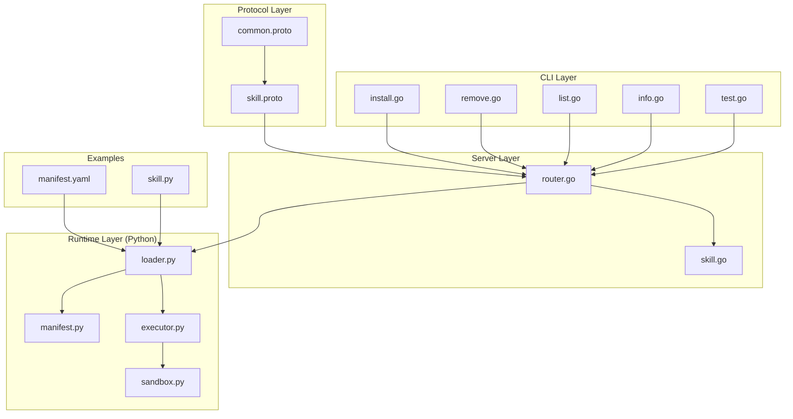
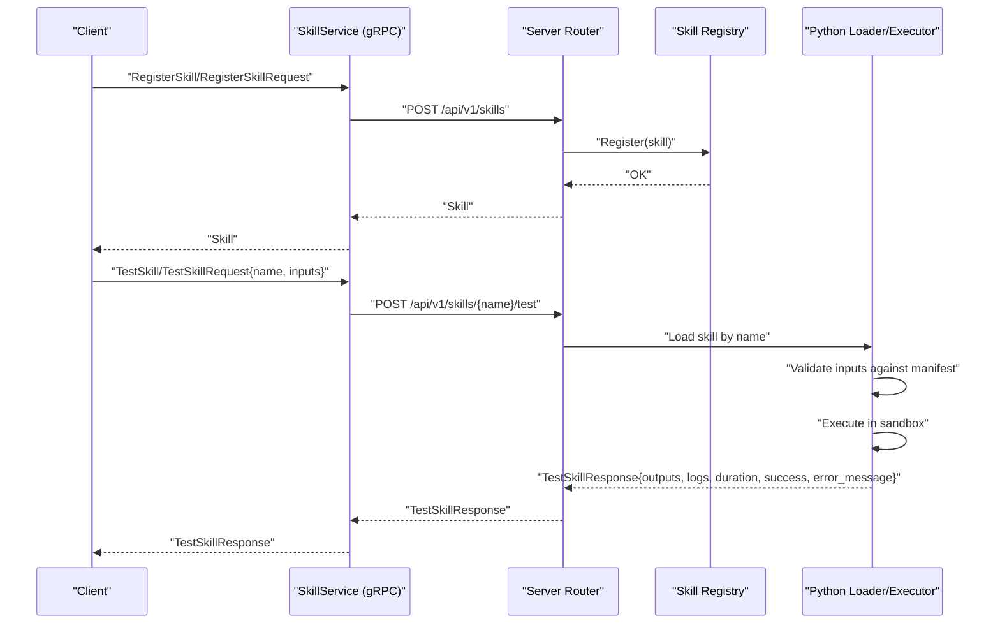
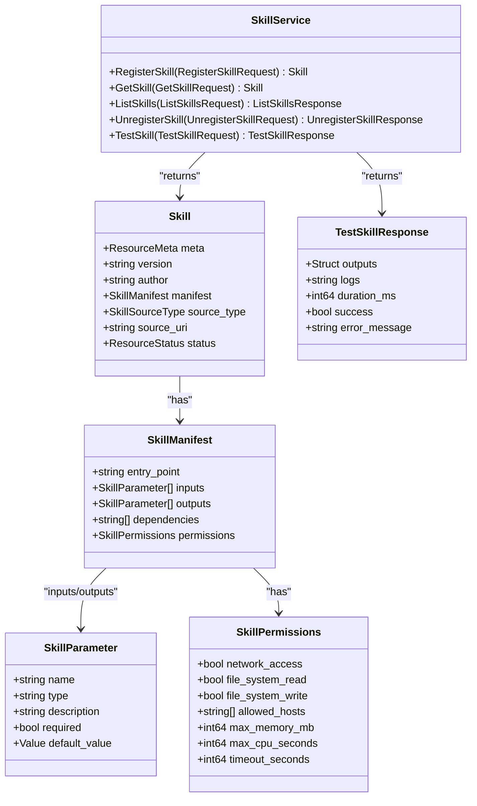
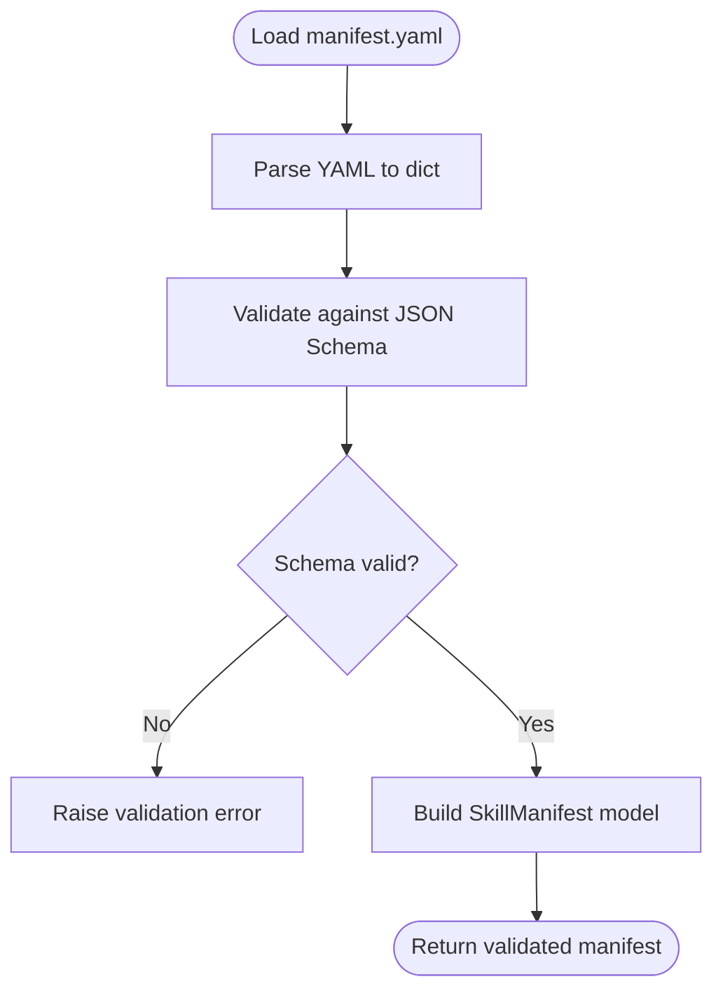
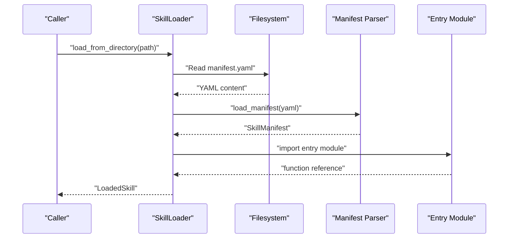
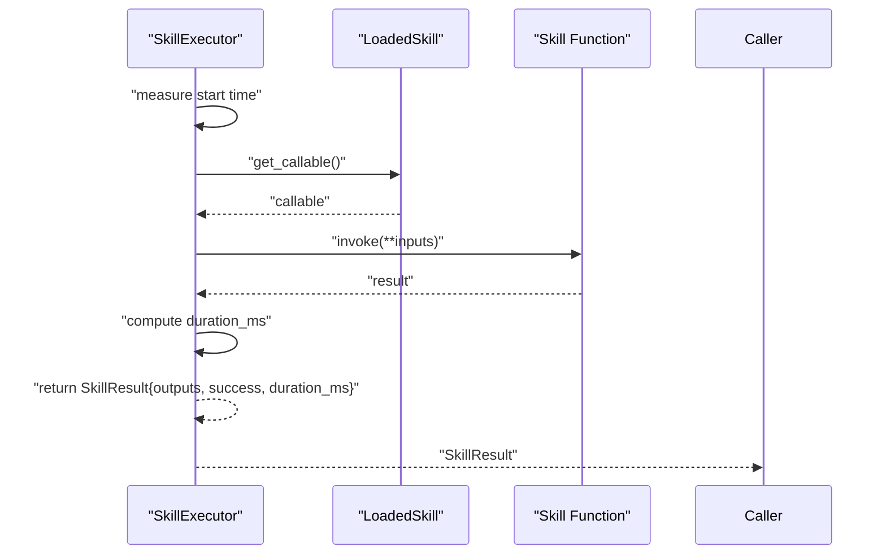
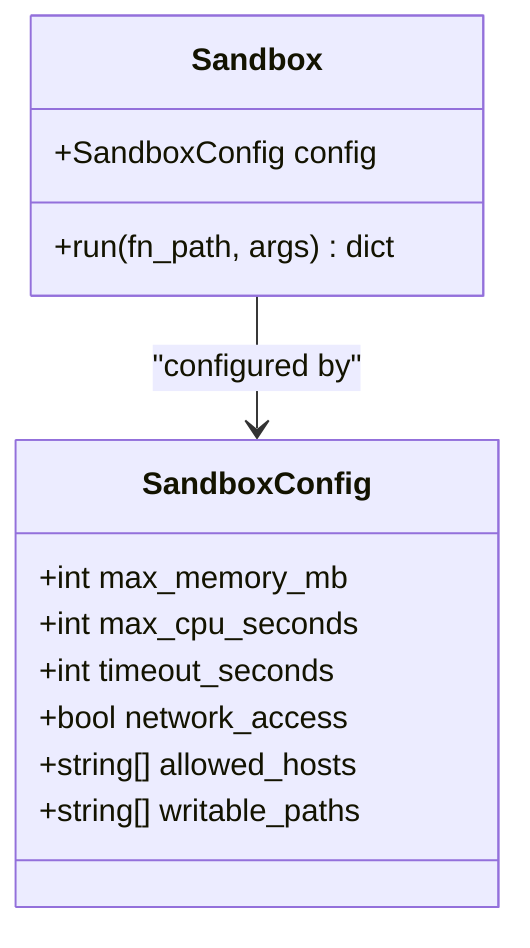
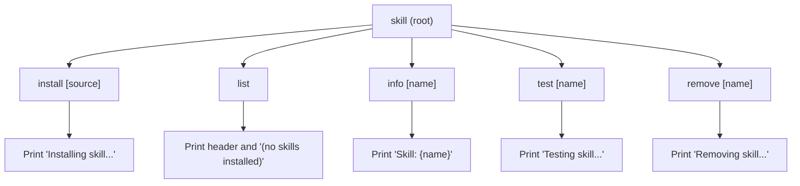
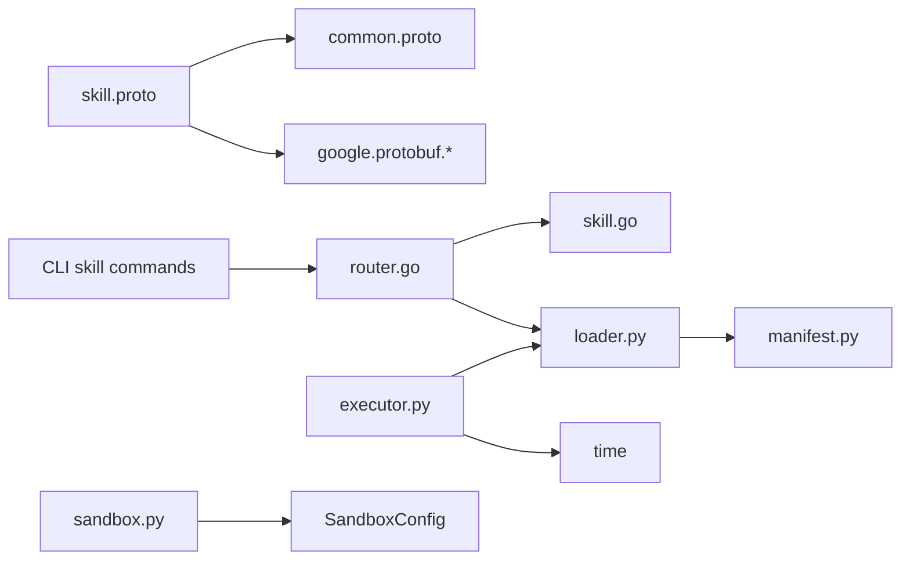

# Skill Service

<cite>
**Referenced Files in This Document**
- [skill.proto](file://api/proto/resolvenet/v1/skill.proto)
- [common.proto](file://api/proto/resolvenet/v1/common.proto)
- [skill-manifest.schema.json](file://api/jsonschema/skill-manifest.schema.json)
- [skill.go](file://pkg/registry/skill.go)
- [router.go](file://pkg/server/router.go)
- [loader.py](file://python/src/resolvenet/skills/loader.py)
- [manifest.py](file://python/src/resolvenet/skills/manifest.py)
- [executor.py](file://python/src/resolvenet/skills/executor.py)
- [sandbox.py](file://python/src/resolvenet/skills/sandbox.py)
- [install.go](file://internal/cli/skill/install.go)
- [remove.go](file://internal/cli/skill/remove.go)
- [list.go](file://internal/cli/skill/list.go)
- [info.go](file://internal/cli/skill/info.go)
- [test.go](file://internal/cli/skill/test.go)
- [manifest.yaml](file://skills/examples/hello-world/manifest.yaml)
- [skill.py](file://skills/examples/hello-world/skill.py)
</cite>

## Table of Contents
1. [Introduction](#introduction)
2. [Project Structure](#project-structure)
3. [Core Components](#core-components)
4. [Architecture Overview](#architecture-overview)
5. [Detailed Component Analysis](#detailed-component-analysis)
6. [Dependency Analysis](#dependency-analysis)
7. [Performance Considerations](#performance-considerations)
8. [Troubleshooting Guide](#troubleshooting-guide)
9. [Conclusion](#conclusion)
10. [Appendices](#appendices)

## Introduction
This document provides comprehensive gRPC service documentation for the SkillService. It covers skill lifecycle operations (registration, retrieval, listing, unregistration), skill manifest schemas, dependency and permission declarations, execution workflows with parameter passing and result reporting, and sandbox isolation boundaries. It also outlines client-side CLI commands for managing skills and highlights validation and error handling mechanisms during skill execution.

## Project Structure
The SkillService spans protocol definitions, server-side routing, Python skill loader and executor, and CLI commands for client-side management.



**Diagram sources**
- [skill.proto:1-101](file://api/proto/resolvenet/v1/skill.proto#L1-L101)
- [common.proto:1-49](file://api/proto/resolvenet/v1/common.proto#L1-L49)
- [router.go:1-128](file://pkg/server/router.go#L1-L128)
- [skill.go:1-80](file://pkg/registry/skill.go#L1-L80)
- [loader.py:1-90](file://python/src/resolvenet/skills/loader.py#L1-L90)
- [manifest.py:1-59](file://python/src/resolvenet/skills/manifest.py#L1-L59)
- [executor.py:1-85](file://python/src/resolvenet/skills/executor.py#L1-L85)
- [sandbox.py:1-56](file://python/src/resolvenet/skills/sandbox.py#L1-L56)
- [install.go:1-41](file://internal/cli/skill/install.go#L1-L41)
- [remove.go:1-22](file://internal/cli/skill/remove.go#L1-L22)
- [list.go:1-23](file://internal/cli/skill/list.go#L1-L23)
- [info.go:1-22](file://internal/cli/skill/info.go#L1-L22)
- [test.go:1-21](file://internal/cli/skill/test.go#L1-L21)
- [manifest.yaml:1-21](file://skills/examples/hello-world/manifest.yaml#L1-L21)
- [skill.py:1-14](file://skills/examples/hello-world/skill.py#L1-L14)

**Section sources**
- [skill.proto:1-101](file://api/proto/resolvenet/v1/skill.proto#L1-L101)
- [common.proto:1-49](file://api/proto/resolvenet/v1/common.proto#L1-L49)
- [router.go:1-128](file://pkg/server/router.go#L1-L128)
- [loader.py:1-90](file://python/src/resolvenet/skills/loader.py#L1-L90)
- [manifest.py:1-59](file://python/src/resolvenet/skills/manifest.py#L1-L59)
- [executor.py:1-85](file://python/src/resolvenet/skills/executor.py#L1-L85)
- [sandbox.py:1-56](file://python/src/resolvenet/skills/sandbox.py#L1-L56)
- [install.go:1-41](file://internal/cli/skill/install.go#L1-L41)
- [remove.go:1-22](file://internal/cli/skill/remove.go#L1-L22)
- [list.go:1-23](file://internal/cli/skill/list.go#L1-L23)
- [info.go:1-22](file://internal/cli/skill/info.go#L1-L22)
- [test.go:1-21](file://internal/cli/skill/test.go#L1-L21)
- [manifest.yaml:1-21](file://skills/examples/hello-world/manifest.yaml#L1-L21)
- [skill.py:1-14](file://skills/examples/hello-world/skill.py#L1-L14)

## Core Components
- SkillService gRPC API: Defines RPCs for registering, retrieving, listing, unregistering, and testing skills, plus message types for skill definitions, manifests, parameters, permissions, and test results.
- Skill Registry: Provides an interface and in-memory implementation for storing skill definitions.
- Python Runtime: Loads skills from local directories, validates manifests, executes functions with optional sandboxing, and reports structured results.
- Server Routing: Exposes HTTP endpoints mirroring skill operations; current implementation indicates planned integration with gRPC and runtime.
- CLI Commands: Provide client-side commands for installing, removing, listing, retrieving info, and testing skills.

Key capabilities:
- Skill lifecycle management via gRPC and HTTP.
- Manifest-driven skill definition with inputs, outputs, dependencies, and permissions.
- Execution with parameter validation, sandboxing, and result reporting.
- Pagination support for listing skills.

**Section sources**
- [skill.proto:10-17](file://api/proto/resolvenet/v1/skill.proto#L10-L17)
- [skill.proto:19-28](file://api/proto/resolvenet/v1/skill.proto#L19-L28)
- [skill.proto:38-45](file://api/proto/resolvenet/v1/skill.proto#L38-L45)
- [skill.proto:47-53](file://api/proto/resolvenet/v1/skill.proto#L47-L53)
- [skill.proto:55-63](file://api/proto/resolvenet/v1/skill.proto#L55-L63)
- [skill.proto:66-100](file://api/proto/resolvenet/v1/skill.proto#L66-L100)
- [skill.go:9-28](file://pkg/registry/skill.go#L9-L28)
- [loader.py:15-66](file://python/src/resolvenet/skills/loader.py#L15-L66)
- [manifest.py:33-44](file://python/src/resolvenet/skills/manifest.py#L33-L44)
- [executor.py:14-67](file://python/src/resolvenet/skills/executor.py#L14-L67)
- [sandbox.py:23-55](file://python/src/resolvenet/skills/sandbox.py#L23-L55)
- [router.go:26-33](file://pkg/server/router.go#L26-L33)
- [router.go:96-111](file://pkg/server/router.go#L96-L111)

## Architecture Overview
The SkillService integrates gRPC-defined messages and enums with a server that exposes HTTP endpoints and a Python runtime for loading, validating, and executing skills. Permissions and resource limits are declared in the manifest and enforced by the sandbox.



**Diagram sources**
- [skill.proto:11-17](file://api/proto/resolvenet/v1/skill.proto#L11-L17)
- [skill.proto:66-100](file://api/proto/resolvenet/v1/skill.proto#L66-L100)
- [router.go:26-33](file://pkg/server/router.go#L26-L33)
- [router.go:131-138](file://pkg/server/router.go#L131-L138)
- [loader.py:59-66](file://python/src/resolvenet/skills/loader.py#L59-L66)
- [manifest.py:47-59](file://python/src/resolvenet/skills/manifest.py#L47-L59)
- [executor.py:20-67](file://python/src/resolvenet/skills/executor.py#L20-L67)
- [sandbox.py:35-55](file://python/src/resolvenet/skills/sandbox.py#L35-L55)

## Detailed Component Analysis

### SkillService API Surface
- RPCs:
  - RegisterSkill: Registers a skill definition.
  - GetSkill: Retrieves a skill by name.
  - ListSkills: Lists skills with pagination.
  - UnregisterSkill: Removes a skill by name.
  - TestSkill: Executes a skill with provided inputs and returns outputs/logs/duration/success/error.
- Messages:
  - Skill: Includes metadata, version, author, manifest, source type/URI, and status.
  - SkillManifest: Declares entry point, inputs/outputs, dependencies, and permissions.
  - SkillParameter: Describes parameter name/type/description/required/default.
  - SkillPermissions: Controls network access, FS read/write, allowed hosts, and resource limits.
  - TestSkillResponse: Reports outputs, logs, duration, success flag, and error message.



**Diagram sources**
- [skill.proto:11-17](file://api/proto/resolvenet/v1/skill.proto#L11-L17)
- [skill.proto:19-28](file://api/proto/resolvenet/v1/skill.proto#L19-L28)
- [skill.proto:38-45](file://api/proto/resolvenet/v1/skill.proto#L38-L45)
- [skill.proto:47-53](file://api/proto/resolvenet/v1/skill.proto#L47-L53)
- [skill.proto:55-63](file://api/proto/resolvenet/v1/skill.proto#L55-L63)
- [skill.proto:94-100](file://api/proto/resolvenet/v1/skill.proto#L94-L100)

**Section sources**
- [skill.proto:10-17](file://api/proto/resolvenet/v1/skill.proto#L10-L17)
- [skill.proto:19-28](file://api/proto/resolvenet/v1/skill.proto#L19-L28)
- [skill.proto:38-45](file://api/proto/resolvenet/v1/skill.proto#L38-L45)
- [skill.proto:47-53](file://api/proto/resolvenet/v1/skill.proto#L47-L53)
- [skill.proto:55-63](file://api/proto/resolvenet/v1/skill.proto#L55-L63)
- [skill.proto:66-100](file://api/proto/resolvenet/v1/skill.proto#L66-L100)

### Skill Manifest Schema and Validation
- JSON Schema enforces required fields (name, version, entry_point) and defines parameter and permissions structures.
- Python manifest parsing mirrors the schema with Pydantic models for strong typing and validation.
- Example manifest demonstrates inputs, outputs, permissions, and entry point.



**Diagram sources**
- [skill-manifest.schema.json:1-74](file://api/jsonschema/skill-manifest.schema.json#L1-L74)
- [manifest.py:47-59](file://python/src/resolvenet/skills/manifest.py#L47-L59)
- [manifest.yaml:1-21](file://skills/examples/hello-world/manifest.yaml#L1-L21)

**Section sources**
- [skill-manifest.schema.json:6-47](file://api/jsonschema/skill-manifest.schema.json#L6-L47)
- [manifest.py:33-44](file://python/src/resolvenet/skills/manifest.py#L33-L44)
- [manifest.py:47-59](file://python/src/resolvenet/skills/manifest.py#L47-L59)
- [manifest.yaml:1-21](file://skills/examples/hello-world/manifest.yaml#L1-L21)

### Skill Loading and Discovery
- The loader discovers skills from local directories, parses the manifest, and imports the entry point module/function.
- LoadedSkill caches the callable for efficient reuse.



**Diagram sources**
- [loader.py:27-57](file://python/src/resolvenet/skills/loader.py#L27-L57)
- [manifest.py:47-59](file://python/src/resolvenet/skills/manifest.py#L47-L59)

**Section sources**
- [loader.py:15-66](file://python/src/resolvenet/skills/loader.py#L15-L66)
- [manifest.py:47-59](file://python/src/resolvenet/skills/manifest.py#L47-L59)

### Skill Execution and Result Reporting
- The executor runs the skill’s entry function with provided inputs, measures duration, and returns a structured result.
- Results include outputs, success flag, optional error, logs placeholder, and duration in milliseconds.
- Current implementation includes TODOs for input validation and sandboxing.



**Diagram sources**
- [executor.py:20-67](file://python/src/resolvenet/skills/executor.py#L20-L67)

**Section sources**
- [executor.py:14-85](file://python/src/resolvenet/skills/executor.py#L14-L85)

### Sandbox Isolation Boundaries
- SandboxConfig defines resource limits and access controls (memory, CPU seconds, timeout, network access, allowed hosts, writable paths).
- Sandbox provides a placeholder for subprocess-based sandboxing with notes for applying resource limits, network restrictions, and filesystem mounts.



**Diagram sources**
- [sandbox.py:11-21](file://python/src/resolvenet/skills/sandbox.py#L11-L21)
- [sandbox.py:23-55](file://python/src/resolvenet/skills/sandbox.py#L23-L55)

**Section sources**
- [sandbox.py:11-55](file://python/src/resolvenet/skills/sandbox.py#L11-L55)

### Server Routing and HTTP Endpoints
- HTTP endpoints mirror skill operations:
  - GET /api/v1/skills
  - POST /api/v1/skills
  - GET /api/v1/skills/{name}
  - DELETE /api/v1/skills/{name}
  - POST /api/v1/skills/{name}/test
- Current implementation returns placeholders or “not implemented” responses; integration with gRPC and runtime is expected.

```mermaid
flowchart TD
A["HTTP Request"] --> B{"Route"}
B --> |GET /api/v1/skills| C["handleListSkills"]
B --> |POST /api/v1/skills| D["handleRegisterSkill"]
B --> |GET /api/v1/skills/{name}| E["handleGetSkill"]
B --> |DELETE /api/v1/skills/{name}| F["handleUnregisterSkill"]
B --> |POST /api/v1/skills/{name}/test| G["handleTestSkill"]
C --> H["Return empty list or placeholder"]
D --> H
E --> H
F --> H
G --> H
```

**Diagram sources**
- [router.go:26-33](file://pkg/server/router.go#L26-L33)
- [router.go:96-138](file://pkg/server/router.go#L96-L138)

**Section sources**
- [router.go:26-33](file://pkg/server/router.go#L26-L33)
- [router.go:96-138](file://pkg/server/router.go#L96-L138)

### Client Implementation Examples (CLI)
- CLI skill commands provide a practical way to manage skills locally:
  - install: Installs a skill from a source (local path, git, registry).
  - list: Lists installed skills.
  - info: Shows details for a named skill.
  - test: Tests a skill in isolation.
  - remove: Uninstalls a skill by name.
- These commands currently print placeholders and are marked as TODO for actual API integration.



**Diagram sources**
- [install.go:26-40](file://internal/cli/skill/install.go#L26-L40)
- [list.go:9-22](file://internal/cli/skill/list.go#L9-L22)
- [info.go:9-21](file://internal/cli/skill/info.go#L9-L21)
- [test.go:9-21](file://internal/cli/skill/test.go#L9-L21)
- [remove.go:9-21](file://internal/cli/skill/remove.go#L9-L21)

**Section sources**
- [install.go:26-40](file://internal/cli/skill/install.go#L26-L40)
- [list.go:9-22](file://internal/cli/skill/list.go#L9-L22)
- [info.go:9-21](file://internal/cli/skill/info.go#L9-L21)
- [test.go:9-21](file://internal/cli/skill/test.go#L9-L21)
- [remove.go:9-21](file://internal/cli/skill/remove.go#L9-L21)

## Dependency Analysis
- Protocol dependencies:
  - skill.proto imports common.proto and google.protobuf.struct for Struct/Value.
  - SkillService depends on ResourceMeta, ResourceStatus, PaginationRequest/Response, and Struct/Value for inputs/outputs.
- Runtime dependencies:
  - loader.py depends on manifest.py for validation.
  - executor.py depends on loader.py and uses time for timing.
  - sandbox.py defines configuration and placeholder execution.
- Server dependencies:
  - router.go registers HTTP handlers for skills and delegates to registry/runtime as implemented.
- CLI dependencies:
  - CLI commands depend on Cobra and print to stdout; they are placeholders awaiting API integration.



**Diagram sources**
- [skill.proto:7-8](file://api/proto/resolvenet/v1/skill.proto#L7-L8)
- [common.proto:1-49](file://api/proto/resolvenet/v1/common.proto#L1-L49)
- [router.go:1-128](file://pkg/server/router.go#L1-L128)
- [skill.go:1-80](file://pkg/registry/skill.go#L1-L80)
- [loader.py:1-90](file://python/src/resolvenet/skills/loader.py#L1-L90)
- [manifest.py:1-59](file://python/src/resolvenet/skills/manifest.py#L1-L59)
- [executor.py:1-85](file://python/src/resolvenet/skills/executor.py#L1-L85)
- [sandbox.py:1-56](file://python/src/resolvenet/skills/sandbox.py#L1-L56)
- [install.go:1-41](file://internal/cli/skill/install.go#L1-L41)
- [list.go:1-23](file://internal/cli/skill/list.go#L1-L23)
- [info.go:1-22](file://internal/cli/skill/info.go#L1-L22)
- [test.go:1-21](file://internal/cli/skill/test.go#L1-L21)
- [remove.go:1-22](file://internal/cli/skill/remove.go#L1-L22)

**Section sources**
- [skill.proto:7-8](file://api/proto/resolvenet/v1/skill.proto#L7-L8)
- [common.proto:1-49](file://api/proto/resolvenet/v1/common.proto#L1-L49)
- [router.go:1-128](file://pkg/server/router.go#L1-L128)
- [loader.py:1-90](file://python/src/resolvenet/skills/loader.py#L1-L90)
- [manifest.py:1-59](file://python/src/resolvenet/skills/manifest.py#L1-L59)
- [executor.py:1-85](file://python/src/resolvenet/skills/executor.py#L1-L85)
- [sandbox.py:1-56](file://python/src/resolvenet/skills/sandbox.py#L1-L56)
- [install.go:1-41](file://internal/cli/skill/install.go#L1-L41)
- [list.go:1-23](file://internal/cli/skill/list.go#L1-L23)
- [info.go:1-22](file://internal/cli/skill/info.go#L1-L22)
- [test.go:1-21](file://internal/cli/skill/test.go#L1-L21)
- [remove.go:1-22](file://internal/cli/skill/remove.go#L1-L22)

## Performance Considerations
- Execution timing: The executor measures duration in milliseconds to report performance metrics.
- Resource limits: Permissions define memory, CPU seconds, and timeout; the sandbox is intended to enforce these limits.
- Pagination: Listing skills supports pagination to avoid large payloads.
- Recommendations:
  - Implement input validation against manifest parameters before execution.
  - Enforce sandbox isolation with subprocesses, resource limits, and network/file restrictions.
  - Cache loaded skills to reduce repeated imports and manifest parsing overhead.

[No sources needed since this section provides general guidance]

## Troubleshooting Guide
- Validation failures:
  - Manifest schema errors will prevent loading; ensure required fields and types match the JSON schema.
- Execution errors:
  - Exceptions during skill execution are caught, logged, and returned as failure results with error messages and duration.
- Sandbox not implemented:
  - The sandbox currently logs a placeholder; implement subprocess-based isolation with resource limits and network restrictions.
- HTTP endpoint placeholders:
  - Server endpoints return placeholders or “not implemented”; integrate with gRPC and runtime to provide full functionality.

**Section sources**
- [skill-manifest.schema.json:6-47](file://api/jsonschema/skill-manifest.schema.json#L6-L47)
- [executor.py:57-66](file://python/src/resolvenet/skills/executor.py#L57-L66)
- [sandbox.py:45-55](file://python/src/resolvenet/skills/sandbox.py#L45-L55)
- [router.go:96-111](file://pkg/server/router.go#L96-L111)

## Conclusion
The SkillService provides a robust foundation for skill lifecycle management with clear protocol definitions, manifest-driven validation, and a Python runtime for loading, executing, and sandboxing skills. While HTTP endpoints and CLI commands are placeholders, the underlying architecture supports seamless integration with gRPC and runtime components. Implementing sandboxing, input validation, and full HTTP/gRPC integration will deliver a secure and scalable skill management system.

[No sources needed since this section summarizes without analyzing specific files]

## Appendices

### Message Type Specifications
- Skill: Contains metadata, version, author, manifest, source type/URI, and status.
- SkillManifest: Declares entry point, inputs/outputs, dependencies, and permissions.
- SkillParameter: Describes parameter name/type/description/required/default.
- SkillPermissions: Controls network access, FS read/write, allowed hosts, and resource limits.
- TestSkillResponse: Reports outputs, logs, duration, success flag, and error message.

**Section sources**
- [skill.proto:19-28](file://api/proto/resolvenet/v1/skill.proto#L19-L28)
- [skill.proto:38-45](file://api/proto/resolvenet/v1/skill.proto#L38-L45)
- [skill.proto:47-53](file://api/proto/resolvenet/v1/skill.proto#L47-L53)
- [skill.proto:55-63](file://api/proto/resolvenet/v1/skill.proto#L55-L63)
- [skill.proto:94-100](file://api/proto/resolvenet/v1/skill.proto#L94-L100)

### Example Skill Definition
- Example manifest and skill function demonstrate inputs, outputs, permissions, and entry point.

**Section sources**
- [manifest.yaml:1-21](file://skills/examples/hello-world/manifest.yaml#L1-L21)
- [skill.py:4-13](file://skills/examples/hello-world/skill.py#L4-L13)