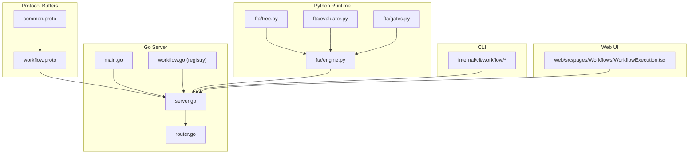
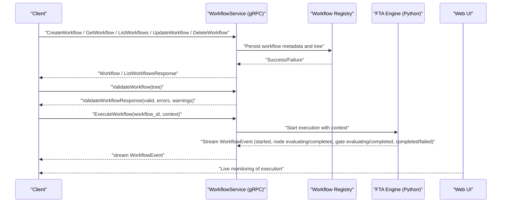
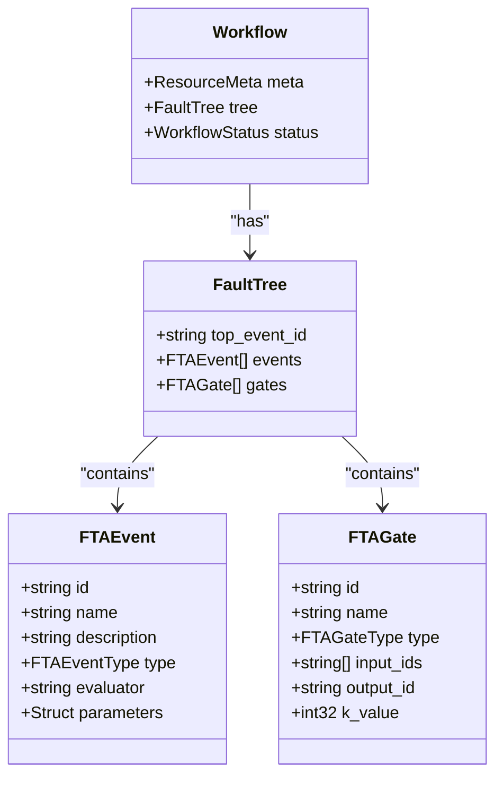
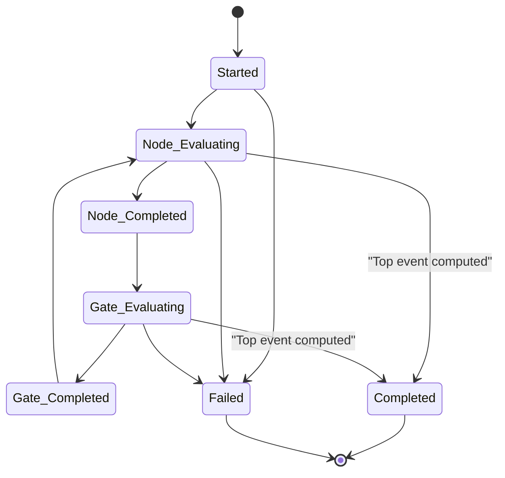
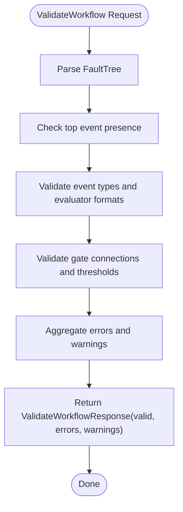
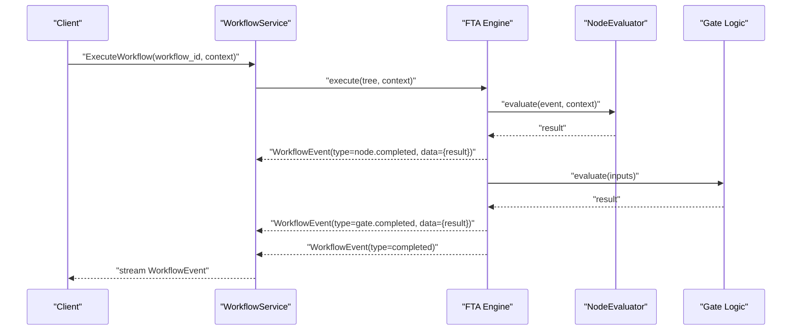
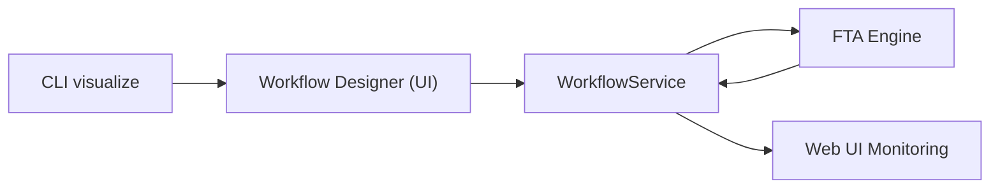
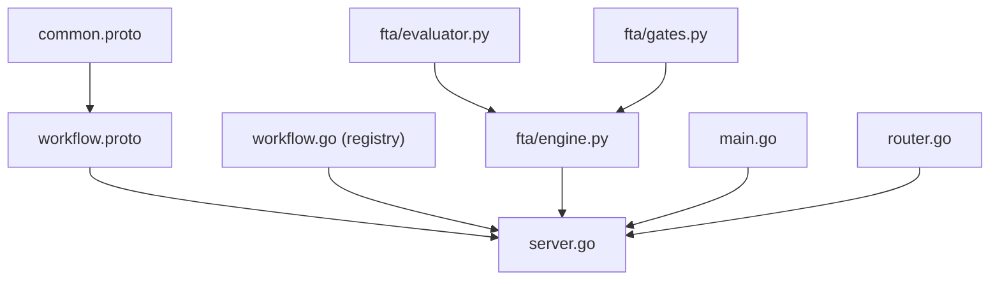

# Workflow Service

<cite>
**Referenced Files in This Document**
- [workflow.proto](file://api/proto/resolvenet/v1/workflow.proto)
- [workflow.go](file://pkg/registry/workflow.go)
- [engine.py](file://python/src/resolvenet/fta/engine.py)
- [tree.py](file://python/src/resolvenet/fta/tree.py)
- [evaluator.py](file://python/src/resolvenet/fta/evaluator.py)
- [gates.py](file://python/src/resolvenet/fta/gates.py)
- [server.go](file://pkg/server/server.go)
- [main.go](file://cmd/resolvenet-server/main.go)
- [router.go](file://pkg/server/router.go)
- [workflow_execution_test.go](file://test/e2e/workflow_execution_test.go)
- [WorkflowExecution.tsx](file://web/src/pages/Workflows/WorkflowExecution.tsx)
- [common.proto](file://api/proto/resolvenet/v1/common.proto)
</cite>

## Table of Contents
1. [Introduction](#introduction)
2. [Project Structure](#project-structure)
3. [Core Components](#core-components)
4. [Architecture Overview](#architecture-overview)
5. [Detailed Component Analysis](#detailed-component-analysis)
6. [Dependency Analysis](#dependency-analysis)
7. [Performance Considerations](#performance-considerations)
8. [Troubleshooting Guide](#troubleshooting-guide)
9. [Conclusion](#conclusion)
10. [Appendices](#appendices)

## Introduction
This document provides comprehensive gRPC service documentation for the WorkflowService, focusing on Fault Tree Analysis (FTA) workflows. It covers workflow definition and schema, validation, execution, and visualization. It also documents message types for workflow definitions, execution states, and progress tracking, along with streaming execution monitoring, error reporting, and integration points for the workflow designer and visualization exports.

## Project Structure
The WorkflowService spans protocol buffers, Go server infrastructure, Python execution engines, CLI commands, and a web UI. The key areas are:
- Protocol buffer definitions for the gRPC service and messages
- Go server initialization and HTTP/gRPC hosting
- Python FTA engine and tree structures
- CLI commands for workflow operations
- Web UI for execution monitoring and visualization

**Diagram sources**
- [workflow.proto:1-145](file://api/proto/resolvenet/v1/workflow.proto#L1-L145)
- [common.proto:1-200](file://api/proto/resolvenet/v1/common.proto#L1-L200)
- [main.go:1-56](file://cmd/resolvenet-server/main.go#L1-L56)
- [server.go:1-104](file://pkg/server/server.go#L1-L104)
- [router.go:96-128](file://pkg/server/router.go#L96-L128)
- [workflow.go:1-94](file://pkg/registry/workflow.go#L1-L94)
- [engine.py:1-83](file://python/src/resolvenet/fta/engine.py#L1-L83)
- [tree.py:1-120](file://python/src/resolvenet/fta/tree.py#L1-L120)
- [evaluator.py:1-74](file://python/src/resolvenet/fta/evaluator.py#L1-L74)
- [gates.py:1-29](file://python/src/resolvenet/fta/gates.py#L1-L29)
- [WorkflowExecution.tsx:1-16](file://web/src/pages/Workflows/WorkflowExecution.tsx#L1-L16)

**Section sources**
- [workflow.proto:1-145](file://api/proto/resolvenet/v1/workflow.proto#L1-L145)
- [server.go:1-104](file://pkg/server/server.go#L1-L104)
- [main.go:1-56](file://cmd/resolvenet-server/main.go#L1-L56)

## Core Components
- WorkflowService gRPC API: Defines CRUD, validation, and streaming execution operations for FTA workflows.
- Workflow schema: FaultTree with events and gates, plus workflow metadata and status.
- Execution events: Structured streaming events for workflow lifecycle and progress.
- Validation response: Structured feedback with validity, errors, and warnings.
- Execution context: Structured context passed to evaluators during execution.
- Registry abstraction: In-memory storage for workflow definitions.
- Python FTA engine: Asynchronous execution of fault trees with event streaming.
- Web UI integration: Real-time execution monitoring page.

**Section sources**
- [workflow.proto:11-20](file://api/proto/resolvenet/v1/workflow.proto#L11-L20)
- [workflow.proto:22-41](file://api/proto/resolvenet/v1/workflow.proto#L22-L41)
- [workflow.proto:81-101](file://api/proto/resolvenet/v1/workflow.proto#L81-L101)
- [workflow.proto:131-144](file://api/proto/resolvenet/v1/workflow.proto#L131-L144)
- [workflow.go:9-26](file://pkg/registry/workflow.go#L9-L26)
- [engine.py:14-83](file://python/src/resolvenet/fta/engine.py#L14-L83)

## Architecture Overview
The WorkflowService exposes a gRPC interface for managing and executing FTA workflows. The Go server hosts the gRPC service and integrates with the Python FTA engine for execution. The CLI and web UI consume the gRPC API for workflow operations and live monitoring.

**Diagram sources**
- [workflow.proto:11-20](file://api/proto/resolvenet/v1/workflow.proto#L11-L20)
- [workflow.proto:131-144](file://api/proto/resolvenet/v1/workflow.proto#L131-L144)
- [workflow.go:19-26](file://pkg/registry/workflow.go#L19-L26)
- [engine.py:24-83](file://python/src/resolvenet/fta/engine.py#L24-L83)
- [WorkflowExecution.tsx:1-16](file://web/src/pages/Workflows/WorkflowExecution.tsx#L1-L16)

## Detailed Component Analysis

### Workflow Definition and Schema
- Workflow: Contains metadata, FaultTree, and status.
- FaultTree: Top-level event identifier and collections of events and gates.
- FTAEvent: Node with id, name, description, type, evaluator, and parameters.
- FTAGate: Logical connector with inputs, output, and optional k-value for voting gates.
- Status: Draft, Active, Archived.

**Diagram sources**
- [workflow.proto:22-79](file://api/proto/resolvenet/v1/workflow.proto#L22-L79)

**Section sources**
- [workflow.proto:22-79](file://api/proto/resolvenet/v1/workflow.proto#L22-L79)

### Workflow Events and Execution States
- WorkflowEvent: Carries workflow_id, execution_id, type, node_id, message, data, and timestamp.
- WorkflowEventType: Started, Node Evaluating/Completed, Gate Evaluating/Completed, Completed, Failed.
- Execution context: Structured context passed to the execution engine.

**Diagram sources**
- [workflow.proto:81-101](file://api/proto/resolvenet/v1/workflow.proto#L81-L101)

**Section sources**
- [workflow.proto:81-101](file://api/proto/resolvenet/v1/workflow.proto#L81-L101)
- [workflow.proto:141-144](file://api/proto/resolvenet/v1/workflow.proto#L141-L144)

### Validation Operations
- ValidateWorkflowRequest: Accepts a FaultTree.
- ValidateWorkflowResponse: Reports validity, errors, and warnings.
- Validation process: Implemented in Python FTA engine and exposed via gRPC.

**Diagram sources**
- [workflow.proto:131-139](file://api/proto/resolvenet/v1/workflow.proto#L131-L139)
- [engine.py:24-83](file://python/src/resolvenet/fta/engine.py#L24-L83)

**Section sources**
- [workflow.proto:131-139](file://api/proto/resolvenet/v1/workflow.proto#L131-L139)

### Execution and Streaming Progress Updates
- ExecuteWorkflowRequest: workflow_id and context.
- Streaming: WorkflowEvent stream covering lifecycle and progress.
- Python FTA engine yields structured events for node evaluation, gate evaluation, and completion.

**Diagram sources**
- [workflow.proto:141-144](file://api/proto/resolvenet/v1/workflow.proto#L141-L144)
- [engine.py:24-83](file://python/src/resolvenet/fta/engine.py#L24-L83)
- [evaluator.py:23-49](file://python/src/resolvenet/fta/evaluator.py#L23-L49)
- [gates.py:6-28](file://python/src/resolvenet/fta/gates.py#L6-L28)

**Section sources**
- [workflow.proto:141-144](file://api/proto/resolvenet/v1/workflow.proto#L141-L144)
- [engine.py:24-83](file://python/src/resolvenet/fta/engine.py#L24-L83)

### Workflow Designer Integration and Visualization
- CLI visualization: Terminal ASCII rendering placeholder.
- Web UI: Execution monitoring page indicating live updates and tree node highlighting.
- Export capability: Not implemented in the current codebase; future extension points include exporting visualization formats.

**Diagram sources**
- [WorkflowExecution.tsx:1-16](file://web/src/pages/Workflows/WorkflowExecution.tsx#L1-L16)
- [visualize.go:1-27](file://internal/cli/workflow/visualize.go#L1-L27)

**Section sources**
- [WorkflowExecution.tsx:1-16](file://web/src/pages/Workflows/WorkflowExecution.tsx#L1-L16)
- [visualize.go:1-27](file://internal/cli/workflow/visualize.go#L1-L27)

### Message Type Specifications
- CreateWorkflowRequest: Workflow
- GetWorkflowRequest: id
- ListWorkflowsRequest: PaginationRequest
- ListWorkflowsResponse: repeated Workflow, PaginationResponse
- UpdateWorkflowRequest: Workflow
- DeleteWorkflowRequest: id
- DeleteWorkflowResponse: empty
- ValidateWorkflowRequest: FaultTree
- ValidateWorkflowResponse: valid (bool), errors (repeated string), warnings (repeated string)
- ExecuteWorkflowRequest: workflow_id (string), context (Struct)

**Section sources**
- [workflow.proto:104-144](file://api/proto/resolvenet/v1/workflow.proto#L104-L144)

## Dependency Analysis
- Protocol buffers define the API contract and data models.
- Go server initializes gRPC and HTTP servers, registers health checks, and enables reflection.
- Registry provides workflow persistence abstraction.
- Python FTA engine executes fault trees and streams events.
- CLI and web UI consume the gRPC API.

**Diagram sources**
- [workflow.proto:1-145](file://api/proto/resolvenet/v1/workflow.proto#L1-L145)
- [server.go:1-104](file://pkg/server/server.go#L1-L104)
- [workflow.go:1-94](file://pkg/registry/workflow.go#L1-L94)
- [engine.py:1-83](file://python/src/resolvenet/fta/engine.py#L1-L83)
- [evaluator.py:1-74](file://python/src/resolvenet/fta/evaluator.py#L1-L74)
- [gates.py:1-29](file://python/src/resolvenet/fta/gates.py#L1-L29)
- [main.go:1-56](file://cmd/resolvenet-server/main.go#L1-L56)
- [router.go:96-128](file://pkg/server/router.go#L96-L128)

**Section sources**
- [server.go:1-104](file://pkg/server/server.go#L1-L104)
- [workflow.go:1-94](file://pkg/registry/workflow.go#L1-L94)
- [engine.py:1-83](file://python/src/resolvenet/fta/engine.py#L1-L83)

## Performance Considerations
- Streaming execution: Use server-side streaming to minimize latency and memory overhead during long-running executions.
- Event granularity: Keep WorkflowEvent payloads minimal; avoid large data in the data field unless necessary.
- Context size: Limit execution context size to reduce serialization overhead.
- Concurrency: Ensure the registry and execution engine are thread-safe; the in-memory registry uses mutexes.
- Network: Prefer local gRPC address bindings for low-latency deployments.

## Troubleshooting Guide
- Validation failures: Inspect ValidateWorkflowResponse for errors and warnings to identify malformed FaultTree structures.
- Execution stalls: Verify that the Python FTA engine is reachable and that the evaluator types are supported.
- Streaming issues: Confirm the gRPC server is running and that clients properly handle stream cancellation.
- Registry errors: Check for duplicate IDs or missing workflows when performing CRUD operations.

**Section sources**
- [workflow.proto:131-139](file://api/proto/resolvenet/v1/workflow.proto#L131-L139)
- [workflow.go:41-93](file://pkg/registry/workflow.go#L41-L93)

## Conclusion
The WorkflowService provides a robust gRPC interface for managing and executing FTA workflows. Its schema supports complex fault trees with diverse event types and gates. Validation ensures structural soundness, while streaming execution delivers real-time progress updates. The Python FTA engine and Go server infrastructure integrate cleanly, and the web UI enables live monitoring. Future enhancements could include richer visualization exports and expanded evaluator integrations.

## Appendices

### API Reference Summary
- CreateWorkflow: Creates a workflow with metadata and FaultTree.
- GetWorkflow: Retrieves a workflow by id.
- ListWorkflows: Lists workflows with pagination.
- UpdateWorkflow: Updates an existing workflow.
- DeleteWorkflow: Deletes a workflow by id.
- ValidateWorkflow: Validates a FaultTree and returns errors/warnings.
- ExecuteWorkflow: Streams WorkflowEvent updates for a workflow execution.

**Section sources**
- [workflow.proto:11-20](file://api/proto/resolvenet/v1/workflow.proto#L11-L20)

### End-to-End Test Status
- E2E test placeholder indicates pending infrastructure for full lifecycle testing.

**Section sources**
- [workflow_execution_test.go:1-12](file://test/e2e/workflow_execution_test.go#L1-L12)