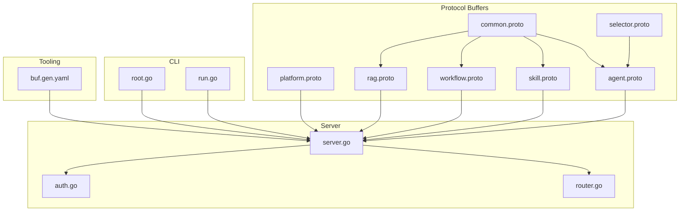
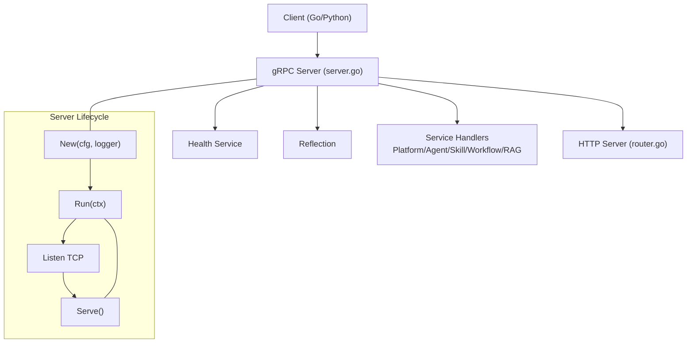
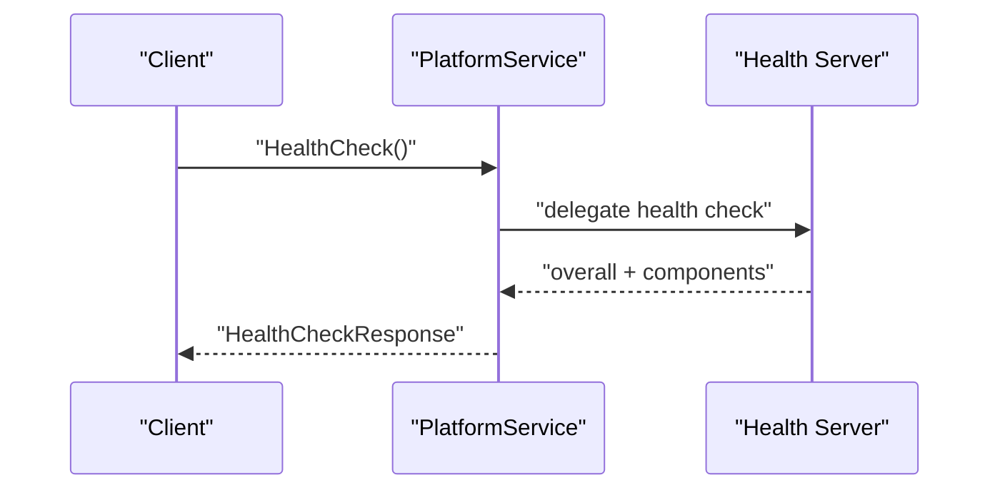
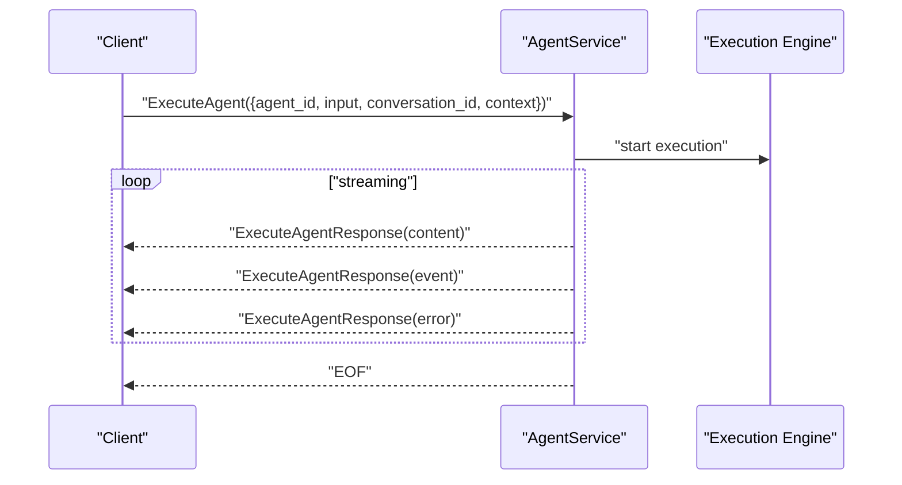
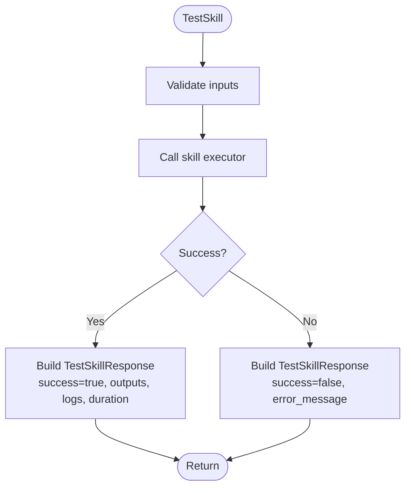
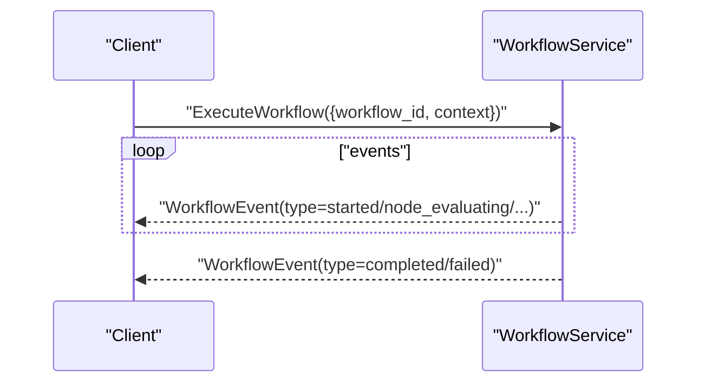
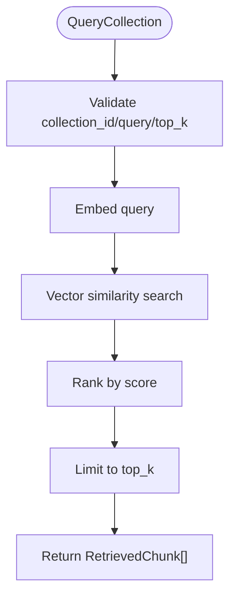
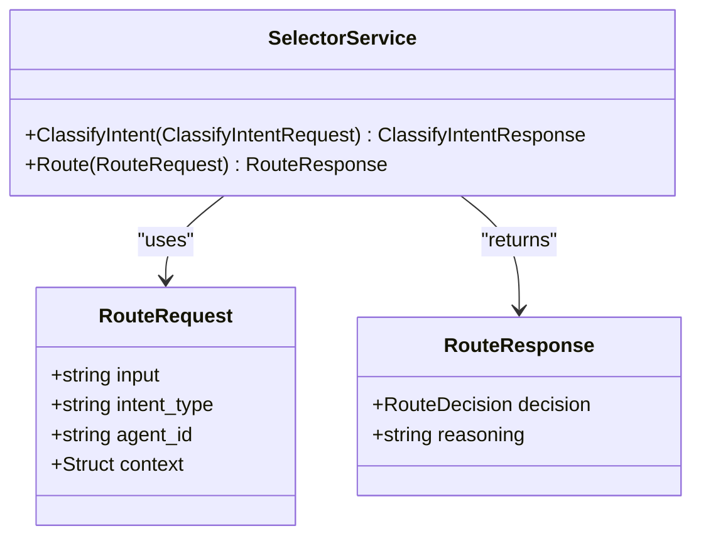
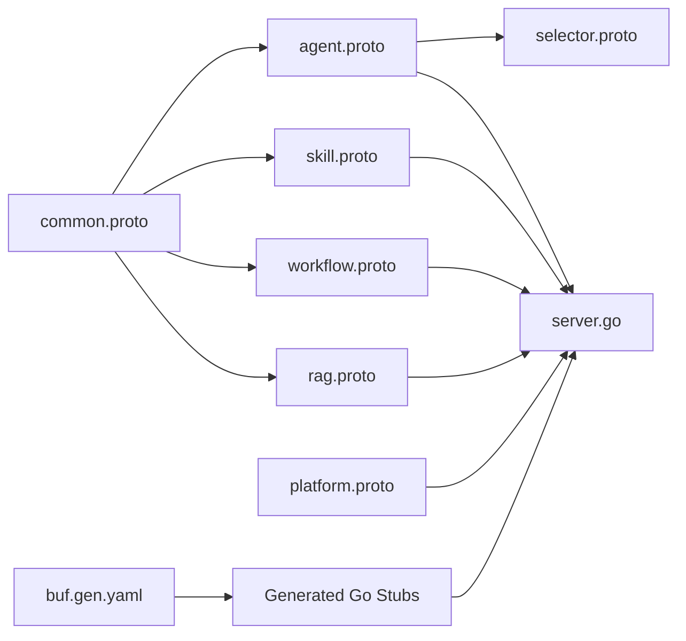

# gRPC Services

<cite>
**Referenced Files in This Document**
- [platform.proto](file://api/proto/resolvenet/v1/platform.proto)
- [agent.proto](file://api/proto/resolvenet/v1/agent.proto)
- [skill.proto](file://api/proto/resolvenet/v1/skill.proto)
- [workflow.proto](file://api/proto/resolvenet/v1/workflow.proto)
- [rag.proto](file://api/proto/resolvenet/v1/rag.proto)
- [common.proto](file://api/proto/resolvenet/v1/common.proto)
- [selector.proto](file://api/proto/resolvenet/v1/selector.proto)
- [server.go](file://pkg/server/server.go)
- [router.go](file://pkg/server/router.go)
- [auth.go](file://pkg/server/middleware/auth.go)
- [main.go](file://cmd/resolvenet-server/main.go)
- [root.go](file://internal/cli/root.go)
- [run.go](file://internal/cli/agent/run.go)
- [buf.gen.yaml](file://tools/buf/buf.gen.yaml)
- [pyproject.toml](file://python/pyproject.toml)
</cite>

## Table of Contents
1. [Introduction](#introduction)
2. [Project Structure](#project-structure)
3. [Core Components](#core-components)
4. [Architecture Overview](#architecture-overview)
5. [Detailed Component Analysis](#detailed-component-analysis)
6. [Dependency Analysis](#dependency-analysis)
7. [Performance Considerations](#performance-considerations)
8. [Troubleshooting Guide](#troubleshooting-guide)
9. [Conclusion](#conclusion)
10. [Appendices](#appendices)

## Introduction
This document describes the gRPC services exposed by ResolveNet’s Protocol Buffer definitions. It covers service specifications, method signatures, message schemas, streaming patterns, and client implementation guidance for Go and Python. It also outlines connection management, authentication considerations, error handling, and retry strategies for robust gRPC communications.

## Project Structure
ResolveNet defines its public APIs using Protocol Buffers under api/proto/resolvenet/v1. The server initializes a gRPC server and registers health and reflection services. The CLI exposes commands to interact with the platform.

**Diagram sources**
- [platform.proto:1-61](file://api/proto/resolvenet/v1/platform.proto#L1-L61)
- [agent.proto:1-177](file://api/proto/resolvenet/v1/agent.proto#L1-L177)
- [skill.proto:1-101](file://api/proto/resolvenet/v1/skill.proto#L1-L101)
- [workflow.proto:1-145](file://api/proto/resolvenet/v1/workflow.proto#L1-L145)
- [rag.proto:1-99](file://api/proto/resolvenet/v1/rag.proto#L1-L99)
- [common.proto:1-49](file://api/proto/resolvenet/v1/common.proto#L1-L49)
- [selector.proto:1-39](file://api/proto/resolvenet/v1/selector.proto#L1-L39)
- [server.go:1-104](file://pkg/server/server.go#L1-L104)
- [router.go:1-183](file://pkg/server/router.go#L1-L183)
- [auth.go:1-18](file://pkg/server/middleware/auth.go#L1-L18)
- [root.go:1-72](file://internal/cli/root.go#L1-L72)
- [run.go:1-28](file://internal/cli/agent/run.go#L1-L28)
- [buf.gen.yaml:1-14](file://tools/buf/buf.gen.yaml#L1-L14)

**Section sources**
- [platform.proto:1-61](file://api/proto/resolvenet/v1/platform.proto#L1-L61)
- [agent.proto:1-177](file://api/proto/resolvenet/v1/agent.proto#L1-L177)
- [skill.proto:1-101](file://api/proto/resolvenet/v1/skill.proto#L1-L101)
- [workflow.proto:1-145](file://api/proto/resolvenet/v1/workflow.proto#L1-L145)
- [rag.proto:1-99](file://api/proto/resolvenet/v1/rag.proto#L1-L99)
- [common.proto:1-49](file://api/proto/resolvenet/v1/common.proto#L1-L49)
- [selector.proto:1-39](file://api/proto/resolvenet/v1/selector.proto#L1-L39)
- [server.go:1-104](file://pkg/server/server.go#L1-L104)
- [router.go:1-183](file://pkg/server/router.go#L1-L183)
- [auth.go:1-18](file://pkg/server/middleware/auth.go#L1-L18)
- [root.go:1-72](file://internal/cli/root.go#L1-L72)
- [run.go:1-28](file://internal/cli/agent/run.go#L1-L28)
- [buf.gen.yaml:1-14](file://tools/buf/buf.gen.yaml#L1-L14)

## Core Components
This section summarizes the gRPC services, their methods, and the primary message types they exchange.

- PlatformService
  - Purpose: Health checks, system configuration retrieval and update, system info.
  - Methods:
    - HealthCheck(HealthCheckRequest) returns (HealthCheckResponse)
    - GetConfig(GetConfigRequest) returns (GetConfigResponse)
    - UpdateConfig(UpdateConfigRequest) returns (UpdateConfigResponse)
    - GetSystemInfo(GetSystemInfoRequest) returns (GetSystemInfoResponse)

- AgentService
  - Purpose: Agent lifecycle management and execution with streaming results.
  - Methods:
    - CreateAgent(CreateAgentRequest) returns (Agent)
    - GetAgent(GetAgentRequest) returns (Agent)
    - ListAgents(ListAgentsRequest) returns (ListAgentsResponse)
    - UpdateAgent(UpdateAgentRequest) returns (Agent)
    - DeleteAgent(DeleteAgentRequest) returns (DeleteAgentResponse)
    - ExecuteAgent(ExecuteAgentRequest) returns (stream ExecuteAgentResponse)
    - GetExecution(GetExecutionRequest) returns (Execution)
    - ListExecutions(ListExecutionsRequest) returns (ListExecutionsResponse)

- SkillService
  - Purpose: Skill registration, discovery, removal, and testing.
  - Methods:
    - RegisterSkill(RegisterSkillRequest) returns (Skill)
    - GetSkill(GetSkillRequest) returns (Skill)
    - ListSkills(ListSkillsRequest) returns (ListSkillsResponse)
    - UnregisterSkill(UnregisterSkillRequest) returns (UnregisterSkillResponse)
    - TestSkill(TestSkillRequest) returns (TestSkillResponse)

- WorkflowService
  - Purpose: Fault Tree Analysis (FTA) workflow definition, validation, and execution with streaming events.
  - Methods:
    - CreateWorkflow(CreateWorkflowRequest) returns (Workflow)
    - GetWorkflow(GetWorkflowRequest) returns (Workflow)
    - ListWorkflows(ListWorkflowsRequest) returns (ListWorkflowsResponse)
    - UpdateWorkflow(UpdateWorkflowRequest) returns (Workflow)
    - DeleteWorkflow(DeleteWorkflowRequest) returns (DeleteWorkflowResponse)
    - ValidateWorkflow(ValidateWorkflowRequest) returns (ValidateWorkflowResponse)
    - ExecuteWorkflow(ExecuteWorkflowRequest) returns (stream WorkflowEvent)

- RAGService
  - Purpose: Vector collection management and retrieval.
  - Methods:
    - CreateCollection(CreateCollectionRequest) returns (Collection)
    - GetCollection(GetCollectionRequest) returns (Collection)
    - ListCollections(ListCollectionsRequest) returns (ListCollectionsResponse)
    - DeleteCollection(DeleteCollectionRequest) returns (DeleteCollectionResponse)
    - IngestDocuments(IngestDocumentsRequest) returns (IngestDocumentsResponse)
    - QueryCollection(QueryCollectionRequest) returns (QueryCollectionResponse)

- SelectorService
  - Purpose: Intent classification and routing decisions.
  - Methods:
    - ClassifyIntent(ClassifyIntentRequest) returns (ClassifyIntentResponse)
    - Route(RouteRequest) returns (RouteResponse)

Message families commonly used across services:
- ResourceMeta, ResourceStatus, PaginationRequest/PaginationResponse, ErrorDetail
- Execution, ExecutionStatus, RouteDecision, RouteType
- Skill, SkillManifest, SkillParameter, SkillPermissions, SkillSourceType
- Workflow, FaultTree, FTAEvent, FTAGate, WorkflowStatus, WorkflowEvent, WorkflowEventType
- Collection, ChunkConfig, Document, RetrievedChunk

**Section sources**
- [platform.proto:9-15](file://api/proto/resolvenet/v1/platform.proto#L9-L15)
- [agent.proto:11-29](file://api/proto/resolvenet/v1/agent.proto#L11-L29)
- [skill.proto:10-17](file://api/proto/resolvenet/v1/skill.proto#L10-L17)
- [workflow.proto:11-20](file://api/proto/resolvenet/v1/workflow.proto#L11-L20)
- [rag.proto:10-18](file://api/proto/resolvenet/v1/rag.proto#L10-L18)
- [selector.proto:10-14](file://api/proto/resolvenet/v1/selector.proto#L10-L14)
- [common.proto:9-48](file://api/proto/resolvenet/v1/common.proto#L9-L48)

## Architecture Overview
The server initializes a gRPC server, registers health and reflection, and serves both gRPC and HTTP endpoints. The CLI provides commands to interact with the platform.

**Diagram sources**
- [server.go:27-52](file://pkg/server/server.go#L27-L52)
- [server.go:54-103](file://pkg/server/server.go#L54-L103)
- [router.go:10-55](file://pkg/server/router.go#L10-L55)

**Section sources**
- [server.go:1-104](file://pkg/server/server.go#L1-L104)
- [router.go:1-183](file://pkg/server/router.go#L1-L183)
- [main.go:16-55](file://cmd/resolvenet-server/main.go#L16-L55)

## Detailed Component Analysis

### PlatformService
- Unary methods:
  - HealthCheck: Returns overall and per-component health status.
  - GetConfig: Retrieves configuration; empty key returns all.
  - UpdateConfig: Updates configuration.
  - GetSystemInfo: Returns version/build/platform details.

Validation and constraints:
- GetConfigRequest.key: Empty means return all configuration.
- HealthStatus enum supports unspecified, healthy, degraded, unhealthy.

**Diagram sources**
- [platform.proto:9-15](file://api/proto/resolvenet/v1/platform.proto#L9-L15)
- [server.go:37-42](file://pkg/server/server.go#L37-L42)

**Section sources**
- [platform.proto:9-60](file://api/proto/resolvenet/v1/platform.proto#L9-L60)

### AgentService
- Unary methods:
  - CreateAgent, GetAgent, UpdateAgent, DeleteAgent
  - GetExecution, ListExecutions
- Streaming method:
  - ExecuteAgent: Streams ExecuteAgentResponse containing content, execution events, or errors.

Key message types:
- Agent, AgentConfig, SelectorConfig, Execution, ExecutionStatus, RouteDecision, RouteType
- ExecuteAgentRequest: agent_id, input, optional conversation_id, optional context
- ExecuteAgentResponse: oneof content/event/error

**Diagram sources**
- [agent.proto:12-29](file://api/proto/resolvenet/v1/agent.proto#L12-L29)
- [agent.proto:97-110](file://api/proto/resolvenet/v1/agent.proto#L97-L110)

**Section sources**
- [agent.proto:11-177](file://api/proto/resolvenet/v1/agent.proto#L11-L177)

### SkillService
- Unary methods:
  - RegisterSkill, GetSkill, ListSkills, UnregisterSkill
  - TestSkill: Returns outputs, logs, duration, success flag, and error message.

Skill schema:
- Skill: ResourceMeta, version, author, manifest, source_type, source_uri, status
- SkillManifest: entry_point, inputs/outputs (SkillParameter), dependencies, permissions
- SkillPermissions: network/file permissions, allowed hosts, resource limits, timeout

**Diagram sources**
- [skill.proto:10-17](file://api/proto/resolvenet/v1/skill.proto#L10-L17)
- [skill.proto:89-100](file://api/proto/resolvenet/v1/skill.proto#L89-L100)

**Section sources**
- [skill.proto:10-101](file://api/proto/resolvenet/v1/skill.proto#L10-L101)

### WorkflowService
- Unary methods:
  - CreateWorkflow, GetWorkflow, UpdateWorkflow, DeleteWorkflow
  - ValidateWorkflow: returns validity plus errors/warnings
  - ListWorkflows
- Streaming method:
  - ExecuteWorkflow: streams WorkflowEvent with execution lifecycle events.

Workflow schema:
- Workflow: ResourceMeta, FaultTree, status
- FaultTree: top_event_id, events (FTAEvent), gates (FTAGate)
- FTAEvent: id, name, description, type, evaluator, parameters
- FTAGate: id, name, type, input_ids, output_id, k_value
- WorkflowEvent: workflow_id, execution_id, type, node_id, message, data, timestamp
- WorkflowEventType: started, node_evaluating, node_completed, gate_evaluating, gate_completed, completed, failed

**Diagram sources**
- [workflow.proto:12-20](file://api/proto/resolvenet/v1/workflow.proto#L12-L20)
- [workflow.proto:82-101](file://api/proto/resolvenet/v1/workflow.proto#L82-L101)

**Section sources**
- [workflow.proto:11-145](file://api/proto/resolvenet/v1/workflow.proto#L11-L145)

### RAGService
- Unary methods:
  - CreateCollection, GetCollection, ListCollections, DeleteCollection
  - IngestDocuments: returns processed count, created chunks, and errors
  - QueryCollection: returns top-k retrieved chunks with scores and metadata

RAG schema:
- Collection: ResourceMeta, embedding_model, chunk_config, counts, status
- ChunkConfig: strategy ("fixed","sentence","semantic"), chunk_size, chunk_overlap
- Document: id, title, content, content_type, metadata
- RetrievedChunk: document_id, document_title, content, score, metadata

**Diagram sources**
- [rag.proto:10-18](file://api/proto/resolvenet/v1/rag.proto#L10-L18)
- [rag.proto:89-98](file://api/proto/resolvenet/v1/rag.proto#L89-L98)

**Section sources**
- [rag.proto:10-99](file://api/proto/resolvenet/v1/rag.proto#L10-L99)

### SelectorService
- Unary methods:
  - ClassifyIntent: intent_type, confidence, entities, metadata
  - Route: returns RouteDecision and reasoning

Selector schema:
- RouteDecision mirrors AgentService’s RouteDecision
- RouteRequest: input, intent_type, agent_id, context

**Diagram sources**
- [selector.proto:10-14](file://api/proto/resolvenet/v1/selector.proto#L10-L14)
- [selector.proto:29-39](file://api/proto/resolvenet/v1/selector.proto#L29-L39)

**Section sources**
- [selector.proto:10-39](file://api/proto/resolvenet/v1/selector.proto#L10-L39)

## Dependency Analysis
The Protocol Buffer definitions share common types and are consumed by the server. Tooling generates Go stubs and gRPC-Gateway bindings.

**Diagram sources**
- [common.proto:1-49](file://api/proto/resolvenet/v1/common.proto#L1-L49)
- [agent.proto:7-9](file://api/proto/resolvenet/v1/agent.proto#L7-L9)
- [skill.proto:7-8](file://api/proto/resolvenet/v1/skill.proto#L7-L8)
- [workflow.proto:7-9](file://api/proto/resolvenet/v1/workflow.proto#L7-L9)
- [rag.proto:7-8](file://api/proto/resolvenet/v1/rag.proto#L7-L8)
- [selector.proto:7-8](file://api/proto/resolvenet/v1/selector.proto#L7-L8)
- [server.go:34-42](file://pkg/server/server.go#L34-L42)
- [buf.gen.yaml:1-14](file://tools/buf/buf.gen.yaml#L1-L14)

**Section sources**
- [common.proto:1-49](file://api/proto/resolvenet/v1/common.proto#L1-L49)
- [agent.proto:1-10](file://api/proto/resolvenet/v1/agent.proto#L1-L10)
- [skill.proto:1-10](file://api/proto/resolvenet/v1/skill.proto#L1-L10)
- [workflow.proto:1-10](file://api/proto/resolvenet/v1/workflow.proto#L1-L10)
- [rag.proto:1-10](file://api/proto/resolvenet/v1/rag.proto#L1-L10)
- [selector.proto:1-10](file://api/proto/resolvenet/v1/selector.proto#L1-L10)
- [server.go:34-42](file://pkg/server/server.go#L34-L42)
- [buf.gen.yaml:1-14](file://tools/buf/buf.gen.yaml#L1-L14)

## Performance Considerations
- Streaming efficiency: Prefer streaming methods (AgentService.ExecuteAgent, WorkflowService.ExecuteWorkflow) for long-running tasks to reduce latency and memory overhead.
- Pagination: Use PaginationRequest/PaginationResponse consistently to limit payload sizes for list operations.
- Chunking and batching: For RAG ingestion, tune ChunkConfig and batch Document arrays to balance embedding costs and recall.
- Health and reflection: Keep health checks enabled and reflection for development; disable reflection in production for security.
- Concurrency: Ensure gRPC server listeners and HTTP server are started concurrently during graceful startup.

[No sources needed since this section provides general guidance]

## Troubleshooting Guide
Common issues and remedies:
- Connection refused: Verify server address and ports configured in the CLI and server configuration. Confirm the gRPC server is listening on the expected address.
- Authentication: The HTTP auth middleware is a placeholder. For production, integrate JWT or API key validation. gRPC does not automatically inherit HTTP auth.
- Health checks: Use the gRPC Health service to probe liveness and readiness. Reflection helps inspect services and methods.
- Streaming interruptions: Implement client-side retries for transient failures. Ensure clients drain streams and handle EOF properly.
- Error propagation: Use ErrorDetail for structured error metadata across services.

Operational references:
- Server initialization and graceful shutdown
- HTTP routes and placeholders
- Auth middleware placeholder

**Section sources**
- [server.go:54-103](file://pkg/server/server.go#L54-L103)
- [router.go:10-55](file://pkg/server/router.go#L10-L55)
- [auth.go:8-17](file://pkg/server/middleware/auth.go#L8-L17)

## Conclusion
ResolveNet’s gRPC surface provides a comprehensive set of services for managing agents, skills, workflows, and RAG collections. The Protocol Buffer definitions define strong schemas and streaming semantics suitable for real-time execution and monitoring. Clients should leverage health checks, reflection during development, and robust retry/backoff strategies for resilient communications.

[No sources needed since this section summarizes without analyzing specific files]

## Appendices

### Client Implementation Guidance

- Go
  - Channel setup: Connect to the configured gRPC address.
  - Stub creation: Use generated service stubs from the proto files.
  - Method invocation: Call unary or streaming methods as defined.
  - Example references:
    - CLI root command flags for server address
    - Server startup and address binding

- Python
  - Dependencies: grpcio, grpcio-tools, protobuf, pydantic, httpx, OpenTelemetry.
  - Channel setup: Create a secure or insecure channel depending on deployment.
  - Stub creation: Generated stubs from proto files.
  - Streaming: Handle server-streaming responses for ExecuteAgent and ExecuteWorkflow.
  - Example references:
    - pyproject dependencies
    - CLI root command flags for server address

- Connection Management
  - Keepalive: Configure keepalive pings for long-lived channels.
  - Compression: Enable compression for large payloads.
  - TLS: Use TLS in production deployments.

- Authentication
  - HTTP auth middleware is a placeholder. Integrate JWT or API keys at the transport or interceptor level.
  - Propagate credentials via metadata for protected methods.

- Error Handling and Retries
  - Use gRPC status codes and ErrorDetail for structured errors.
  - Implement exponential backoff for transient errors.
  - Retry idempotent unary calls; avoid retrying non-idempotent streaming calls without careful state management.

**Section sources**
- [root.go:36-41](file://internal/cli/root.go#L36-L41)
- [server.go:63-72](file://pkg/server/server.go#L63-L72)
- [pyproject.toml:19-29](file://python/pyproject.toml#L19-L29)