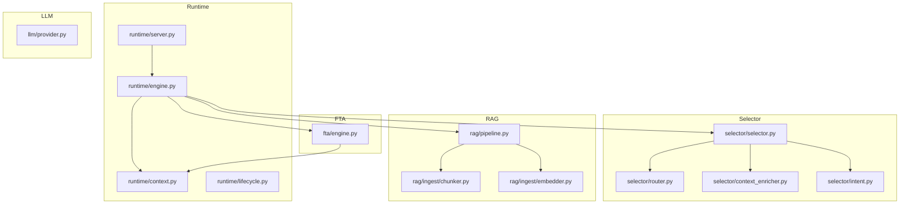
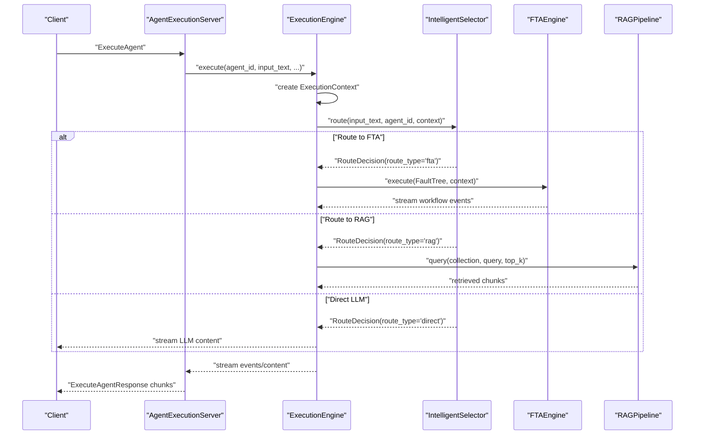
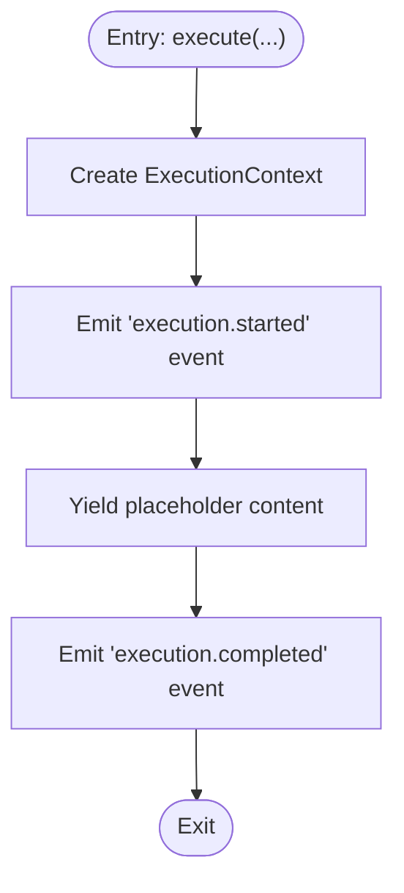
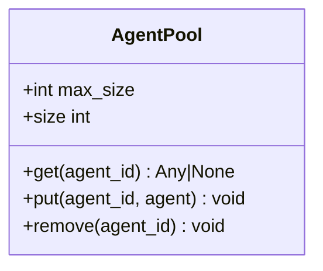
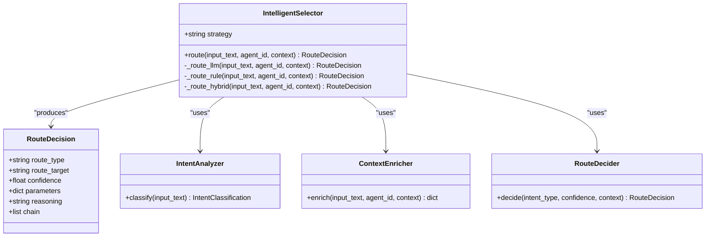
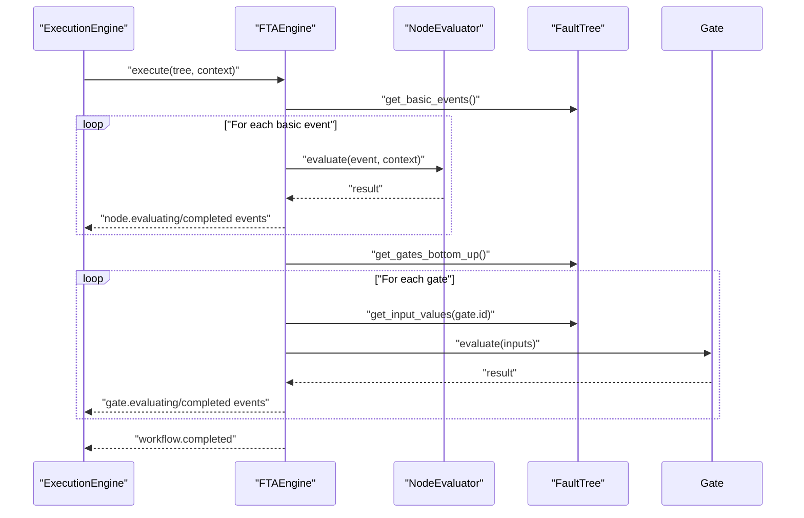
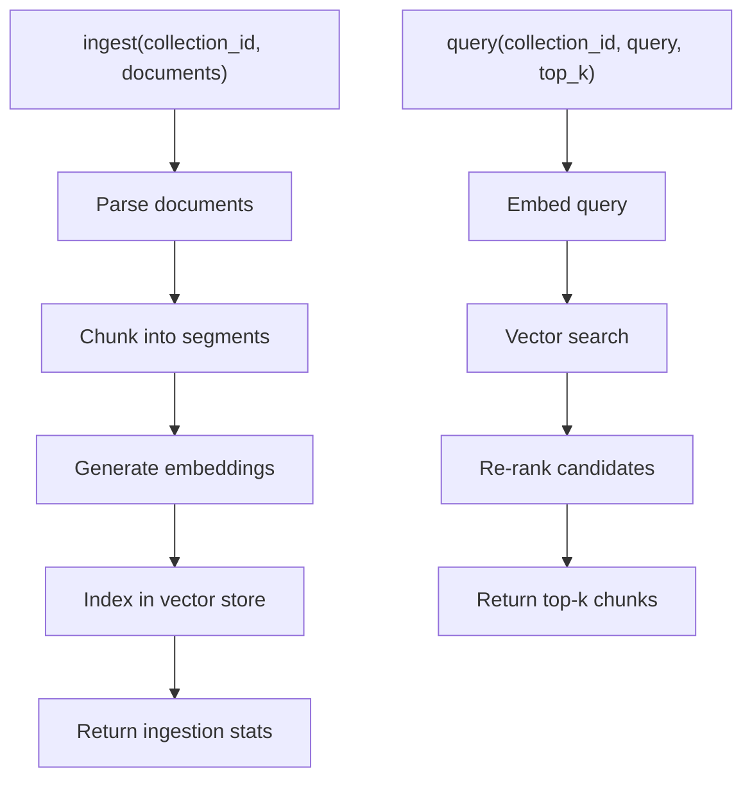
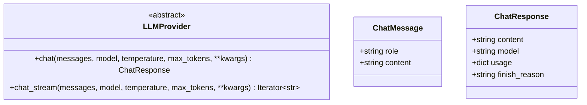
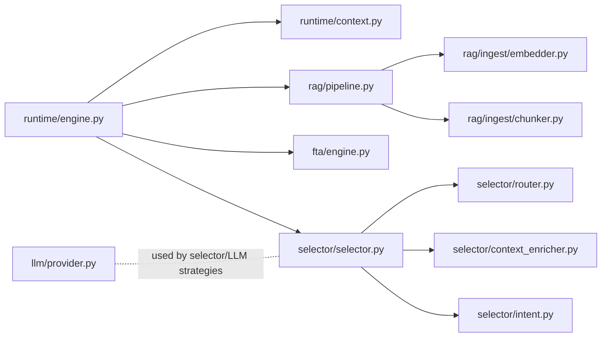

# Agent Runtime (Python)

<cite>
**Referenced Files in This Document**
- [__init__.py](file://python/src/resolvenet/__init__.py)
- [engine.py](file://python/src/resolvenet/runtime/engine.py)
- [context.py](file://python/src/resolvenet/runtime/context.py)
- [lifecycle.py](file://python/src/resolvenet/runtime/lifecycle.py)
- [server.py](file://python/src/resolvenet/runtime/server.py)
- [selector.py](file://python/src/resolvenet/selector/selector.py)
- [router.py](file://python/src/resolvenet/selector/router.py)
- [context_enricher.py](file://python/src/resolvenet/selector/context_enricher.py)
- [intent.py](file://python/src/resolvenet/selector/intent.py)
- [engine.py](file://python/src/resolvenet/fta/engine.py)
- [pipeline.py](file://python/src/resolvenet/rag/pipeline.py)
- [chunker.py](file://python/src/resolvenet/rag/ingest/chunker.py)
- [embedder.py](file://python/src/resolvenet/rag/ingest/embedder.py)
- [provider.py](file://python/src/resolvenet/llm/provider.py)
</cite>

## Table of Contents
1. [Introduction](#introduction)
2. [Project Structure](#project-structure)
3. [Core Components](#core-components)
4. [Architecture Overview](#architecture-overview)
5. [Detailed Component Analysis](#detailed-component-analysis)
6. [Dependency Analysis](#dependency-analysis)
7. [Performance Considerations](#performance-considerations)
8. [Troubleshooting Guide](#troubleshooting-guide)
9. [Conclusion](#conclusion)
10. [Appendices](#appendices)

## Introduction
This document describes the Python-based agent runtime that powers the ResolveNet platform. It focuses on the runtime engine architecture, agent lifecycle management, context handling, and execution coordination. It also explains the Intelligent Selector system for routing user intent to FTA workflows, skills, RAG pipelines, or direct LLM responses, and outlines the FTA engine, RAG pipeline, LLM provider abstractions, sandbox execution environment, and the runtime server for gRPC communication with platform services. Finally, it provides guidance for integrating the runtime and developing custom components.

## Project Structure
The Python runtime resides under python/src/resolvenet and is organized by functional domains:
- runtime: Execution engine, context, lifecycle, and gRPC server
- selector: Intelligent Selector with intent analysis, context enrichment, and routing
- fta: Fault Tree Analysis engine and evaluation
- rag: RAG pipeline orchestration and ingestion utilities
- llm: Provider abstraction and concrete providers
- skills: Built-in skills, loader, manifest, and sandbox execution

**Diagram sources**
- [engine.py:14-89](file://python/src/resolvenet/runtime/engine.py#L14-L89)
- [context.py:9-35](file://python/src/resolvenet/runtime/context.py#L9-L35)
- [lifecycle.py:12-52](file://python/src/resolvenet/runtime/lifecycle.py#L12-L52)
- [server.py:11-61](file://python/src/resolvenet/runtime/server.py#L11-L61)
- [selector.py:24-100](file://python/src/resolvenet/selector/selector.py#L24-L100)
- [router.py:10-40](file://python/src/resolvenet/selector/router.py#L10-L40)
- [context_enricher.py:8-47](file://python/src/resolvenet/selector/context_enricher.py#L8-L47)
- [intent.py:17-39](file://python/src/resolvenet/selector/intent.py#L17-L39)
- [engine.py:14-83](file://python/src/resolvenet/fta/engine.py#L14-L83)
- [pipeline.py:11-75](file://python/src/resolvenet/rag/pipeline.py#L11-L75)
- [chunker.py:6-73](file://python/src/resolvenet/rag/ingest/chunker.py#L6-L73)
- [embedder.py:11-49](file://python/src/resolvenet/rag/ingest/embedder.py#L11-L49)
- [provider.py:27-77](file://python/src/resolvenet/llm/provider.py#L27-L77)

**Section sources**
- [__init__.py:1-4](file://python/src/resolvenet/__init__.py#L1-L4)

## Core Components
- Execution Engine: Orchestrates agent execution, creates an execution context, and streams events and content. It currently yields placeholder content and defers agent loading, selector invocation, and subsystem execution to future implementations.
- Execution Context: Immutable data container for a single execution session, including identifiers, input text, and mutable metadata.
- Agent Pool: Manages agent instances with LRU eviction semantics for efficient lifecycle management.
- gRPC Server: Exposes agent execution over gRPC, delegating to the execution engine and streaming responses.
- Intelligent Selector: Routes requests through intent analysis, context enrichment, and strategy-driven decisions among FTA, skills, RAG, or direct LLM responses.
- FTA Engine: Evaluates fault trees by traversing basic events and gates, yielding progress events.
- RAG Pipeline: Provides ingestion and query orchestration with pluggable chunking and embedding strategies.
- LLM Provider Abstraction: Defines a unified interface for chat and streaming chat across providers.

**Section sources**
- [engine.py:14-89](file://python/src/resolvenet/runtime/engine.py#L14-L89)
- [context.py:9-35](file://python/src/resolvenet/runtime/context.py#L9-L35)
- [lifecycle.py:12-52](file://python/src/resolvenet/runtime/lifecycle.py#L12-L52)
- [server.py:11-61](file://python/src/resolvenet/runtime/server.py#L11-L61)
- [selector.py:24-100](file://python/src/resolvenet/selector/selector.py#L24-L100)
- [router.py:10-40](file://python/src/resolvenet/selector/router.py#L10-L40)
- [context_enricher.py:8-47](file://python/src/resolvenet/selector/context_enricher.py#L8-L47)
- [intent.py:17-39](file://python/src/resolvenet/selector/intent.py#L17-L39)
- [engine.py:14-83](file://python/src/resolvenet/fta/engine.py#L14-L83)
- [pipeline.py:11-75](file://python/src/resolvenet/rag/pipeline.py#L11-L75)
- [chunker.py:6-73](file://python/src/resolvenet/rag/ingest/chunker.py#L6-L73)
- [embedder.py:11-49](file://python/src/resolvenet/rag/ingest/embedder.py#L11-L49)
- [provider.py:27-77](file://python/src/resolvenet/llm/provider.py#L27-L77)

## Architecture Overview
The runtime integrates the execution engine with the Intelligent Selector and subsystems. The gRPC server exposes a single endpoint to start agent executions, which are streamed back to clients. The selector orchestrates routing decisions, while the FTA engine and RAG pipeline provide specialized execution paths.

**Diagram sources**
- [server.py:38-61](file://python/src/resolvenet/runtime/server.py#L38-L61)
- [engine.py:25-89](file://python/src/resolvenet/runtime/engine.py#L25-L89)
- [selector.py:43-100](file://python/src/resolvenet/selector/selector.py#L43-L100)
- [router.py:17-40](file://python/src/resolvenet/selector/router.py#L17-L40)
- [engine.py:24-83](file://python/src/resolvenet/fta/engine.py#L24-L83)
- [pipeline.py:53-75](file://python/src/resolvenet/rag/pipeline.py#L53-L75)

## Detailed Component Analysis

### Execution Engine
Responsibilities:
- Create an execution context per run
- Emit lifecycle events ("execution.started", "execution.completed")
- Stream content and events to the caller
- Coordinate with the Intelligent Selector and subsystems

Processing logic:
- Generates unique execution and conversation IDs
- Emits a start event, yields placeholder content, then emits a completion event

**Diagram sources**
- [engine.py:25-89](file://python/src/resolvenet/runtime/engine.py#L25-L89)
- [context.py:9-35](file://python/src/resolvenet/runtime/context.py#L9-L35)

**Section sources**
- [engine.py:14-89](file://python/src/resolvenet/runtime/engine.py#L14-L89)
- [context.py:9-35](file://python/src/resolvenet/runtime/context.py#L9-L35)

### Agent Lifecycle Management (Agent Pool)
Responsibilities:
- Store agent instances with LRU eviction
- Retrieve agents on demand
- Remove agents explicitly

Implementation notes:
- Uses an ordered dictionary to maintain recency
- Evicts the least recently used item when capacity is exceeded

**Diagram sources**
- [lifecycle.py:12-52](file://python/src/resolvenet/runtime/lifecycle.py#L12-L52)

**Section sources**
- [lifecycle.py:12-52](file://python/src/resolvenet/runtime/lifecycle.py#L12-L52)

### Context Handling
Responsibilities:
- Hold immutable execution identifiers and input
- Provide a mutable metadata bag for runtime accumulation
- Support attaching trace IDs for observability

Key attributes:
- execution_id, agent_id, conversation_id, input_text
- context (initially empty), trace_id, metadata

**Section sources**
- [context.py:9-35](file://python/src/resolvenet/runtime/context.py#L9-L35)

### Intelligent Selector System
The selector performs three-stage routing:
1. Intent Analysis: Classifies user intent and extracts entities
2. Context Enrichment: Augments context with available skills, active workflows, RAG collections, and conversation history
3. Route Decision: Chooses among "fta", "skill", "rag", "multi", "direct" using pluggable strategies

Strategies:
- LLM-based: Uses an LLM to decide
- Rule-based: Uses deterministic patterns
- Hybrid: Applies rules first, falls back to LLM for ambiguity

**Diagram sources**
- [selector.py:24-100](file://python/src/resolvenet/selector/selector.py#L24-L100)
- [router.py:10-40](file://python/src/resolvenet/selector/router.py#L10-L40)
- [context_enricher.py:8-47](file://python/src/resolvenet/selector/context_enricher.py#L8-L47)
- [intent.py:17-39](file://python/src/resolvenet/selector/intent.py#L17-L39)

**Section sources**
- [selector.py:24-100](file://python/src/resolvenet/selector/selector.py#L24-L100)
- [router.py:10-40](file://python/src/resolvenet/selector/router.py#L10-L40)
- [context_enricher.py:8-47](file://python/src/resolvenet/selector/context_enricher.py#L8-L47)
- [intent.py:17-39](file://python/src/resolvenet/selector/intent.py#L17-L39)

### FTA Workflow Engine
Responsibilities:
- Traverse a fault tree from leaves upward
- Evaluate basic events and propagate results through gates
- Yield structured events for UI and observability

Evaluation strategy:
- Basic events: evaluated first
- Gates: evaluated bottom-up using their gate type logic

**Diagram sources**
- [engine.py:24-83](file://python/src/resolvenet/fta/engine.py#L24-L83)

**Section sources**
- [engine.py:14-83](file://python/src/resolvenet/fta/engine.py#L14-L83)

### RAG Pipeline
Responsibilities:
- Orchestrate ingestion: parse → chunk → embed → index
- Perform semantic retrieval: embed query → vector search → rerank
- Support augmented generation by returning relevant chunks

Components:
- Chunker: fixed-size, sentence-based, or fallback fixed chunking
- Embedder: generates embeddings for texts and queries

**Diagram sources**
- [pipeline.py:28-75](file://python/src/resolvenet/rag/pipeline.py#L28-L75)
- [chunker.py:6-73](file://python/src/resolvenet/rag/ingest/chunker.py#L6-L73)
- [embedder.py:11-49](file://python/src/resolvenet/rag/ingest/embedder.py#L11-L49)

**Section sources**
- [pipeline.py:11-75](file://python/src/resolvenet/rag/pipeline.py#L11-L75)
- [chunker.py:6-73](file://python/src/resolvenet/rag/ingest/chunker.py#L6-L73)
- [embedder.py:11-49](file://python/src/resolvenet/rag/ingest/embedder.py#L11-L49)

### LLM Provider Abstraction
Responsibilities:
- Define a unified interface for chat and streaming chat
- Standardize message and response models
- Enable pluggable providers (Chinese LLMs and OpenAI-compatible)

**Diagram sources**
- [provider.py:27-77](file://python/src/resolvenet/llm/provider.py#L27-L77)

**Section sources**
- [provider.py:27-77](file://python/src/resolvenet/llm/provider.py#L27-L77)

### Sandbox Execution Environment
The sandbox module defines a secure execution environment for skills. It is designed to isolate and constrain potentially unsafe operations while enabling useful capabilities such as code execution, file operations, and web search. The sandbox ensures resource limits, network restrictions, and process isolation are enforced during skill execution.

[No sources needed since this section provides general guidance]

### Runtime Server (gRPC)
Responsibilities:
- Start and stop the gRPC server
- Expose ExecuteAgent RPC that streams results back to clients
- Delegate execution to the ExecutionEngine

Integration:
- Initializes the ExecutionEngine and streams responses

**Section sources**
- [server.py:11-61](file://python/src/resolvenet/runtime/server.py#L11-L61)

## Dependency Analysis
High-level dependencies:
- Runtime depends on context, selector, FTA engine, and RAG pipeline
- Selector composes intent analyzer, context enricher, and route decider
- RAG pipeline depends on chunker and embedder
- LLM provider defines the abstraction used by selector and other components

**Diagram sources**
- [engine.py:9-9](file://python/src/resolvenet/runtime/engine.py#L9-L9)
- [selector.py:78-96](file://python/src/resolvenet/selector/selector.py#L78-L96)
- [router.py:17-39](file://python/src/resolvenet/selector/router.py#L17-L39)
- [context_enricher.py:16-46](file://python/src/resolvenet/selector/context_enricher.py#L16-L46)
- [intent.py:24-38](file://python/src/resolvenet/selector/intent.py#L24-L38)
- [engine.py:8-9](file://python/src/resolvenet/fta/engine.py#L8-L9)
- [pipeline.py:20-26](file://python/src/resolvenet/rag/pipeline.py#L20-L26)
- [chunker.py:15-23](file://python/src/resolvenet/rag/ingest/chunker.py#L15-L23)
- [embedder.py:20-21](file://python/src/resolvenet/rag/ingest/embedder.py#L20-L21)
- [provider.py:34-76](file://python/src/resolvenet/llm/provider.py#L34-L76)

**Section sources**
- [engine.py:9-9](file://python/src/resolvenet/runtime/engine.py#L9-L9)
- [selector.py:78-96](file://python/src/resolvenet/selector/selector.py#L78-L96)
- [router.py:17-39](file://python/src/resolvenet/selector/router.py#L17-L39)
- [context_enricher.py:16-46](file://python/src/resolvenet/selector/context_enricher.py#L16-L46)
- [intent.py:24-38](file://python/src/resolvenet/selector/intent.py#L24-L38)
- [engine.py:8-9](file://python/src/resolvenet/fta/engine.py#L8-L9)
- [pipeline.py:20-26](file://python/src/resolvenet/rag/pipeline.py#L20-L26)
- [chunker.py:15-23](file://python/src/resolvenet/rag/ingest/chunker.py#L15-L23)
- [embedder.py:20-21](file://python/src/resolvenet/rag/ingest/embedder.py#L20-L21)
- [provider.py:34-76](file://python/src/resolvenet/llm/provider.py#L34-L76)

## Performance Considerations
- Streaming: Prefer streaming responses for long-running operations (selector decisions, FTA evaluation, RAG retrieval) to reduce latency and improve UX.
- Context minimization: Keep ExecutionContext minimal and avoid heavy objects; use metadata for transient data.
- Chunking strategy: Choose chunk sizes and overlaps appropriate for downstream embedding and retrieval costs.
- Embedding model selection: Select models optimized for target languages to balance quality and latency.
- LRU sizing: Tune agent pool capacity to balance memory usage and warm-start latency.

[No sources needed since this section provides general guidance]

## Troubleshooting Guide
Common issues and remedies:
- Execution hangs or no output: Verify that the selector returns a concrete route and that the engine yields events. Check for missing subsystem implementations.
- Context not enriched: Ensure context enrichment fetches available skills, active workflows, RAG collections, and conversation history.
- FTA evaluation stalls: Confirm that basic events and gates are properly connected and that the tree traversal covers all nodes.
- RAG query returns empty: Validate embedding model configuration and vector backend connectivity; confirm that documents were ingested and indexed.

**Section sources**
- [engine.py:52-88](file://python/src/resolvenet/runtime/engine.py#L52-L88)
- [context_enricher.py:16-46](file://python/src/resolvenet/selector/context_enricher.py#L16-L46)
- [engine.py:24-83](file://python/src/resolvenet/fta/engine.py#L24-L83)
- [pipeline.py:53-75](file://python/src/resolvenet/rag/pipeline.py#L53-L75)

## Conclusion
The Python runtime provides a modular foundation for agent execution, routing, and specialized workflows. The execution engine coordinates lifecycle and context, while the Intelligent Selector directs workloads to FTA, skills, RAG, or direct LLM responses. The FTA engine and RAG pipeline offer structured and semantic capabilities, respectively, and the LLM provider abstraction enables multi-provider support. The gRPC server integrates with platform services, and the sandbox environment secures skill execution. Extending the system involves implementing missing strategies, subsystems, and integrations while adhering to the defined interfaces.

[No sources needed since this section summarizes without analyzing specific files]

## Appendices
- Integration examples: Use the gRPC server to expose ExecuteAgent and delegate to the execution engine. Implement selector strategies and subsystems incrementally.
- Custom component development: Implement new selector strategies by extending the selector framework, add new RAG backends by implementing ingestion and retrieval steps, and add new LLM providers by implementing the provider interface.

[No sources needed since this section provides general guidance]