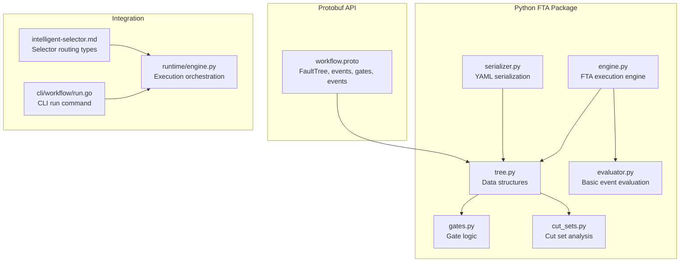
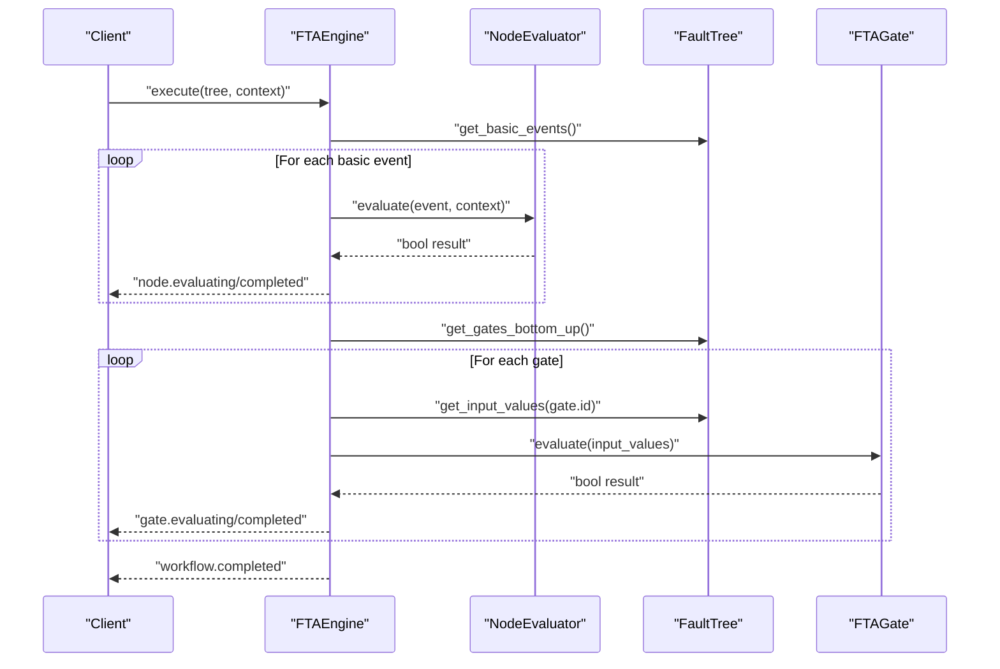
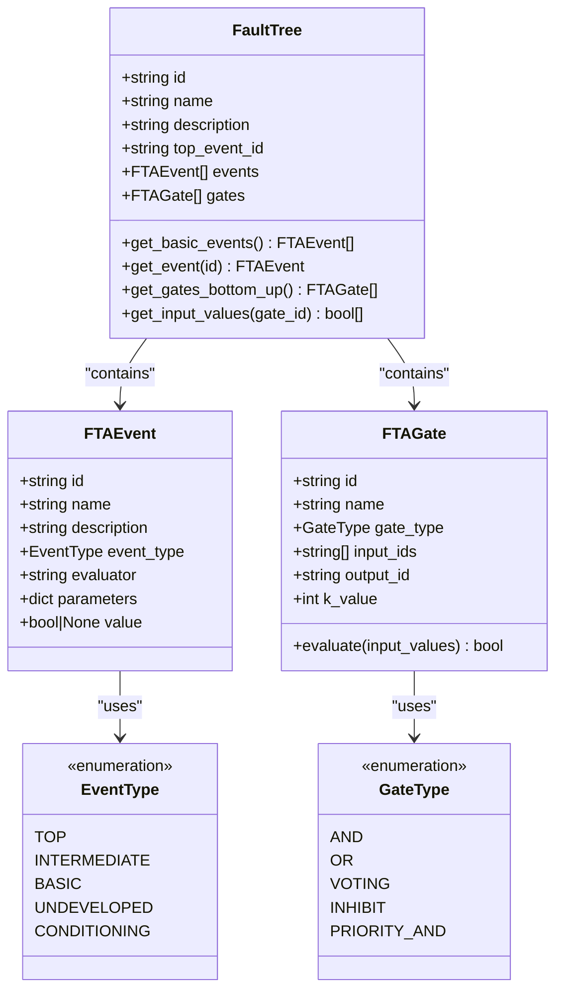
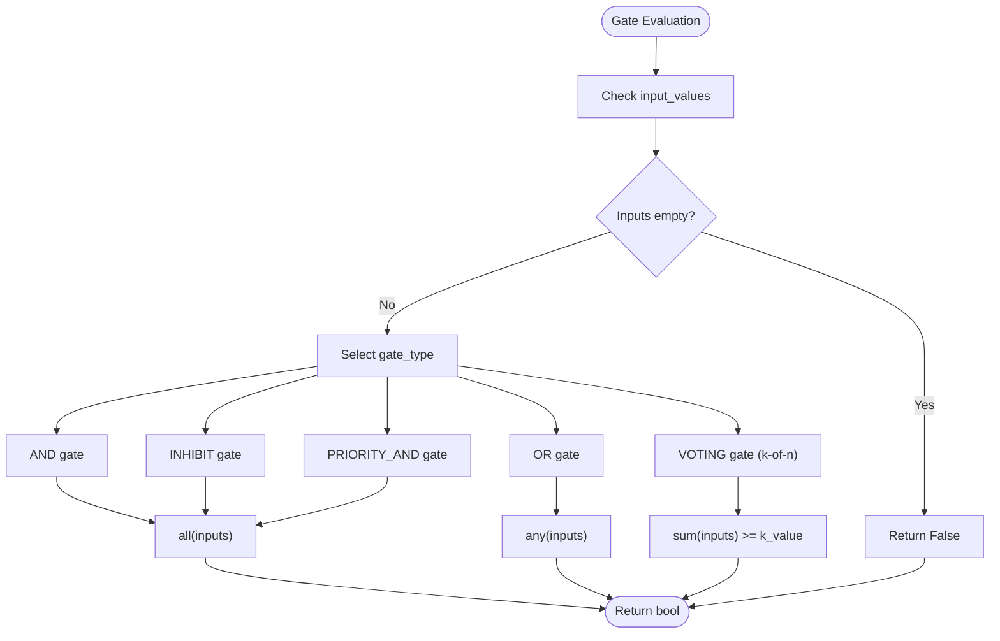
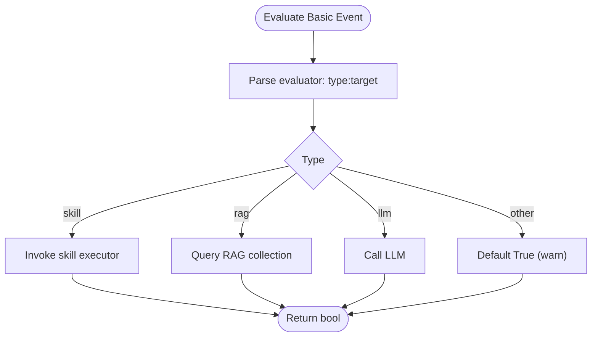
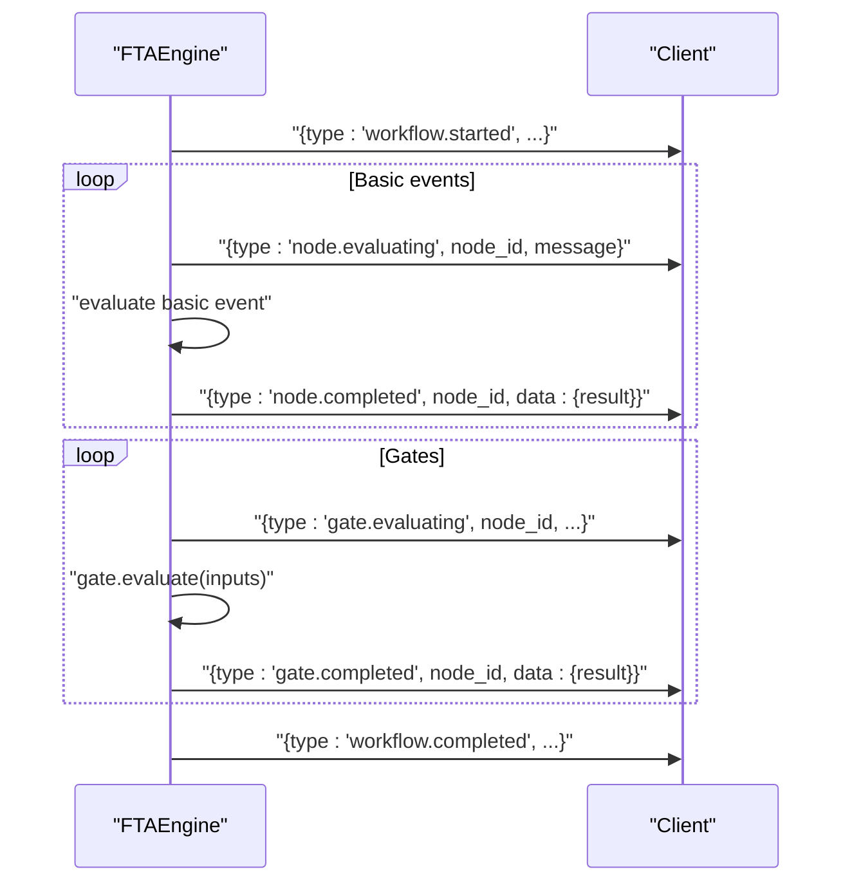
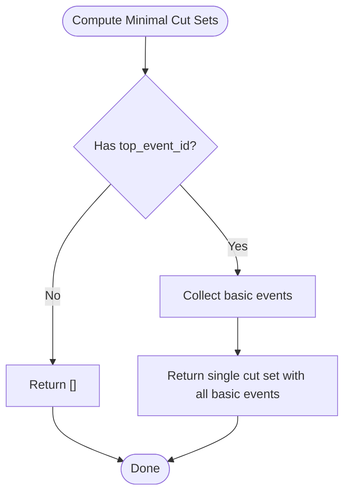
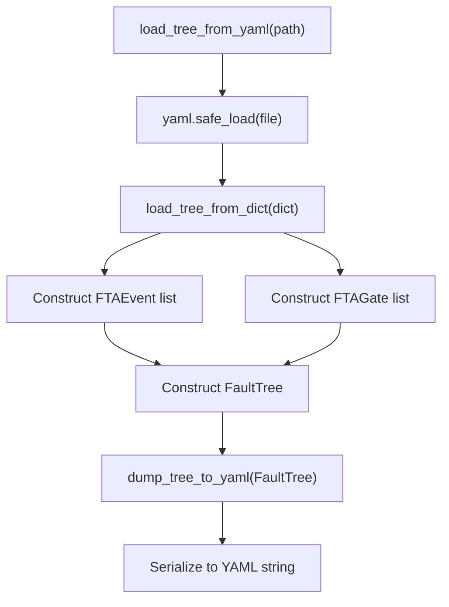
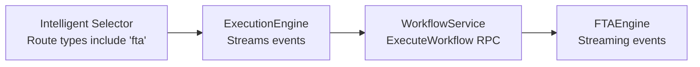
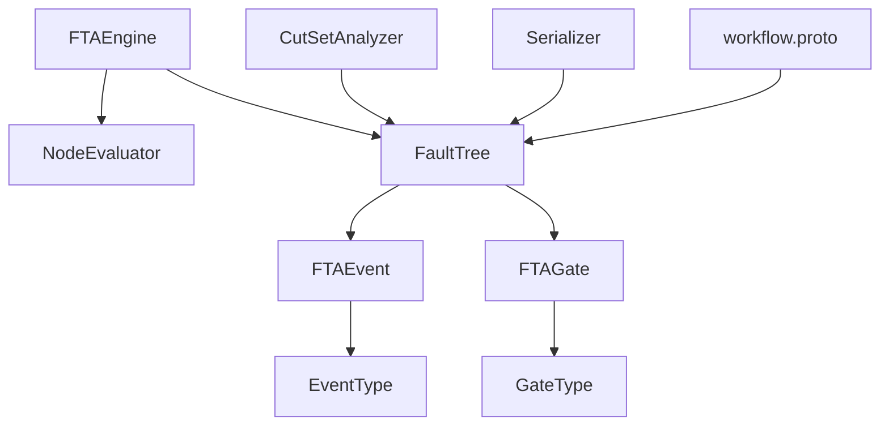

# FTA Workflow Engine

<cite>
**Referenced Files in This Document**
- [engine.py](file://python/src/resolvenet/fta/engine.py)
- [tree.py](file://python/src/resolvenet/fta/tree.py)
- [gates.py](file://python/src/resolvenet/fta/gates.py)
- [evaluator.py](file://python/src/resolvenet/fta/evaluator.py)
- [cut_sets.py](file://python/src/resolvenet/fta/cut_sets.py)
- [serializer.py](file://python/src/resolvenet/fta/serializer.py)
- [workflow.proto](file://api/proto/resolvenet/v1/workflow.proto)
- [fta-engine.md](file://docs/architecture/fta-engine.md)
- [intelligent-selector.md](file://docs/architecture/intelligent-selector.md)
- [workflow-fta-example.yaml](file://configs/examples/workflow-fta-example.yaml)
- [sample_fta_tree.yaml](file://python/tests/fixtures/sample_fta_tree.yaml)
- [test_fta_engine.py](file://python/tests/unit/test_fta_engine.py)
- [run.go](file://internal/cli/workflow/run.go)
- [engine.py](file://python/src/resolvenet/runtime/engine.py)
</cite>

## Table of Contents
1. [Introduction](#introduction)
2. [Project Structure](#project-structure)
3. [Core Components](#core-components)
4. [Architecture Overview](#architecture-overview)
5. [Detailed Component Analysis](#detailed-component-analysis)
6. [Dependency Analysis](#dependency-analysis)
7. [Performance Considerations](#performance-considerations)
8. [Troubleshooting Guide](#troubleshooting-guide)
9. [Conclusion](#conclusion)
10. [Appendices](#appendices)

## Introduction
This document describes the Fault Tree Analysis (FTA) workflow engine that powers structured problem-solving through decision trees. It covers the tree structure representation, gate evaluation algorithms, execution progress tracking, supported gate types, event evaluation strategies, cut set analysis, and serialization. It also explains how the FTA engine integrates with the intelligent selector and the broader runtime system, and provides practical examples for building and running FTA workflows.

## Project Structure
The FTA engine resides in the Python package under python/src/resolvenet/fta and is complemented by protocol buffers, documentation, configuration examples, and tests. The engine exposes a streaming execution interface compatible with the workflow service and integrates with the intelligent selector routing system.

**Diagram sources**
- [engine.py:14-83](file://python/src/resolvenet/fta/engine.py#L14-L83)
- [tree.py:30-120](file://python/src/resolvenet/fta/tree.py#L30-L120)
- [gates.py:6-29](file://python/src/resolvenet/fta/gates.py#L6-L29)
- [evaluator.py:13-74](file://python/src/resolvenet/fta/evaluator.py#L13-L74)
- [cut_sets.py:8-49](file://python/src/resolvenet/fta/cut_sets.py#L8-L49)
- [serializer.py:12-113](file://python/src/resolvenet/fta/serializer.py#L12-L113)
- [workflow.proto:36-101](file://api/proto/resolvenet/v1/workflow.proto#L36-L101)
- [intelligent-selector.md:1-18](file://docs/architecture/intelligent-selector.md#L1-L18)
- [runtime/engine.py:14-89](file://python/src/resolvenet/runtime/engine.py#L14-L89)
- [run.go:9-22](file://internal/cli/workflow/run.go#L9-L22)

**Section sources**
- [fta-engine.md:1-19](file://docs/architecture/fta-engine.md#L1-L19)
- [workflow.proto:11-27](file://api/proto/resolvenet/v1/workflow.proto#L11-L27)

## Core Components
- FaultTree: Holds the tree metadata, events, and gates; provides traversal helpers for basic events and gates.
- FTAEvent: Represents nodes (top, intermediate, basic, undeveloped, conditioning) with optional evaluator hints and parameters.
- FTAGate: Logical connectors supporting AND, OR, VOTING (k-of-n), INHIBIT, and PRIORITY_AND.
- NodeEvaluator: Evaluates basic events using skill, RAG, or LLM strategies; defaults to True for unknown evaluators.
- FTAEngine: Orchestrates execution, streams progress events, evaluates basic events, and propagates through gates bottom-up.
- CutSetAnalyzer: Computes minimal cut sets and generates human-readable explanations.
- Serializer: Loads and dumps FTA trees from/to YAML/dict.

**Section sources**
- [tree.py:30-120](file://python/src/resolvenet/fta/tree.py#L30-L120)
- [evaluator.py:13-74](file://python/src/resolvenet/fta/evaluator.py#L13-L74)
- [engine.py:14-83](file://python/src/resolvenet/fta/engine.py#L14-L83)
- [cut_sets.py:8-49](file://python/src/resolvenet/fta/cut_sets.py#L8-L49)
- [serializer.py:12-113](file://python/src/resolvenet/fta/serializer.py#L12-L113)

## Architecture Overview
The FTA engine follows a streaming execution model compatible with the workflow service. It parses a FaultTree, evaluates basic events (possibly invoking skills, RAG, or LLM), and propagates results bottom-up through gates to compute the top event outcome. Progress is emitted as structured events for observability and UI updates.

**Diagram sources**
- [engine.py:24-83](file://python/src/resolvenet/fta/engine.py#L24-L83)
- [evaluator.py:23-74](file://python/src/resolvenet/fta/evaluator.py#L23-L74)
- [tree.py:92-120](file://python/src/resolvenet/fta/tree.py#L92-L120)

## Detailed Component Analysis

### Tree Structure Representation
- EventType enumerates top, intermediate, basic, undeveloped, and conditioning events.
- GateType enumerates AND, OR, VOTING, INHIBIT, and PRIORITY_AND.
- FaultTree holds id, name, description, top_event_id, lists of events and gates, and helper methods to traverse nodes.
- FTAEvent carries id, name, description, event_type, evaluator hint, parameters, and computed value.
- FTAGate carries id, name, gate_type, input_ids, output_id, and k_value for VOTING gates, with an evaluate method implementing the logic.

**Diagram sources**
- [tree.py:10-120](file://python/src/resolvenet/fta/tree.py#L10-L120)

**Section sources**
- [tree.py:10-120](file://python/src/resolvenet/fta/tree.py#L10-L120)

### Gate Evaluation Algorithms
Supported gates and their behaviors:
- AND: True only if all inputs are True.
- OR: True if at least one input is True.
- VOTING (k-of-n): True if at least k inputs are True.
- INHIBIT: Implemented as AND with a conditioning event conceptually present; currently mirrors AND.
- PRIORITY_AND: AND with order dependency conceptually present; currently mirrors AND.

These are implemented both in FTAGate.evaluate and in standalone functions for modularity.

**Diagram sources**
- [tree.py:54-78](file://python/src/resolvenet/fta/tree.py#L54-L78)
- [gates.py:6-29](file://python/src/resolvenet/fta/gates.py#L6-L29)

**Section sources**
- [tree.py:54-78](file://python/src/resolvenet/fta/tree.py#L54-L78)
- [gates.py:6-29](file://python/src/resolvenet/fta/gates.py#L6-L29)

### Event Evaluation Strategies
Basic events can be evaluated via:
- skill:target → invoke a skill via the skill executor.
- rag:collection → query a retrieval collection.
- llm:model → classify or evaluate via an LLM.
- Unknown/static → default to True with a warning.

The NodeEvaluator routes based on the evaluator string prefix and defers to asynchronous handlers for each strategy.

**Diagram sources**
- [evaluator.py:23-74](file://python/src/resolvenet/fta/evaluator.py#L23-L74)

**Section sources**
- [evaluator.py:13-74](file://python/src/resolvenet/fta/evaluator.py#L13-L74)

### Execution Progress Tracking
The FTAEngine streams structured events during execution:
- workflow.started
- node.evaluating/node.completed (with node_id and result data)
- gate.evaluating/gate.completed (with node_id and result data)
- workflow.completed

These align with the WorkflowEventType enum in the protobuf definition.

**Diagram sources**
- [engine.py:24-83](file://python/src/resolvenet/fta/engine.py#L24-L83)
- [workflow.proto:82-101](file://api/proto/resolvenet/v1/workflow.proto#L82-L101)

**Section sources**
- [engine.py:24-83](file://python/src/resolvenet/fta/engine.py#L24-L83)
- [workflow.proto:82-101](file://api/proto/resolvenet/v1/workflow.proto#L82-L101)

### Cut Set Analysis
Minimal cut sets represent the smallest combinations of basic events that cause the top event. The current implementation returns a placeholder containing all basic events. A future enhancement could implement MOCUS or Binary Decision Diagram (BDD)-based computation.

**Diagram sources**
- [cut_sets.py:8-27](file://python/src/resolvenet/fta/cut_sets.py#L8-L27)

**Section sources**
- [cut_sets.py:8-49](file://python/src/resolvenet/fta/cut_sets.py#L8-L49)

### Serialization System
The serializer supports loading and dumping FaultTree instances:
- load_tree_from_yaml: Reads a YAML file and constructs a FaultTree.
- load_tree_from_dict: Parses a dictionary into FaultTree.
- dump_tree_to_yaml: Serializes a FaultTree to a YAML string.

This enables persistence and sharing of FTA structures.

**Diagram sources**
- [serializer.py:12-113](file://python/src/resolvenet/fta/serializer.py#L12-L113)

**Section sources**
- [serializer.py:12-113](file://python/src/resolvenet/fta/serializer.py#L12-L113)

### Examples

#### Building an FTA Tree
Use the example configuration to define a tree with top, intermediate, and basic events, and connect them with gates. The example demonstrates:
- Top-level event identification.
- Basic events with evaluator hints and parameters.
- An OR gate aggregating multiple evidence sources into the top event.

**Section sources**
- [workflow-fta-example.yaml:1-50](file://configs/examples/workflow-fta-example.yaml#L1-L50)
- [sample_fta_tree.yaml:1-23](file://python/tests/fixtures/sample_fta_tree.yaml#L1-L23)

#### Gate Configuration
Configure gates by specifying:
- id, name, type (and/or/voting/inhibit/priority_and).
- inputs (IDs of input events).
- output (ID of the downstream event).
- k_value for VOTING gates.

**Section sources**
- [tree.py:44-78](file://python/src/resolvenet/fta/tree.py#L44-L78)
- [workflow-fta-example.yaml:41-49](file://configs/examples/workflow-fta-example.yaml#L41-L49)

#### Custom Evaluation Strategies
Extend NodeEvaluator by adding new evaluator types and implementing their handlers. The current skeleton shows how skill, rag, and llm evaluators are dispatched.

**Section sources**
- [evaluator.py:23-74](file://python/src/resolvenet/fta/evaluator.py#L23-L74)

#### Integration with the Intelligent Selector
The intelligent selector routes requests to workflow types including fta. The runtime engine orchestrates execution and streams results back to clients.

**Diagram sources**
- [intelligent-selector.md:11-18](file://docs/architecture/intelligent-selector.md#L11-L18)
- [runtime/engine.py:25-89](file://python/src/resolvenet/runtime/engine.py#L25-L89)
- [workflow.proto:19-19](file://api/proto/resolvenet/v1/workflow.proto#L19-L19)

**Section sources**
- [intelligent-selector.md:1-18](file://docs/architecture/intelligent-selector.md#L1-L18)
- [runtime/engine.py:14-89](file://python/src/resolvenet/runtime/engine.py#L14-L89)
- [workflow.proto:11-27](file://api/proto/resolvenet/v1/workflow.proto#L11-L27)

## Dependency Analysis
The FTA engine components are loosely coupled:
- FTAEngine depends on FaultTree and NodeEvaluator.
- FaultTree encapsulates FTAEvent and FTAGate and provides traversal helpers.
- NodeEvaluator depends on the evaluator string to dispatch to external systems.
- CutSetAnalyzer depends on FaultTree structure.
- Serializer depends on the dataclasses and enums in tree.py.
- Protobuf definitions formalize the wire format for the workflow service.

**Diagram sources**
- [engine.py:14-83](file://python/src/resolvenet/fta/engine.py#L14-L83)
- [tree.py:30-120](file://python/src/resolvenet/fta/tree.py#L30-L120)
- [cut_sets.py:8-49](file://python/src/resolvenet/fta/cut_sets.py#L8-L49)
- [serializer.py:12-113](file://python/src/resolvenet/fta/serializer.py#L12-L113)
- [workflow.proto:36-79](file://api/proto/resolvenet/v1/workflow.proto#L36-L79)

**Section sources**
- [engine.py:14-83](file://python/src/resolvenet/fta/engine.py#L14-L83)
- [tree.py:30-120](file://python/src/resolvenet/fta/tree.py#L30-L120)
- [cut_sets.py:8-49](file://python/src/resolvenet/fta/cut_sets.py#L8-L49)
- [serializer.py:12-113](file://python/src/resolvenet/fta/serializer.py#L12-L113)
- [workflow.proto:36-79](file://api/proto/resolvenet/v1/workflow.proto#L36-L79)

## Performance Considerations
- Bottom-up traversal: The current gate ordering uses a reversed gate list; a topological sort would improve correctness for complex trees.
- Asynchronous evaluation: NodeEvaluator uses async methods; ensure upstream systems (skills, RAG, LLM) are designed for concurrency.
- Cut set computation: Placeholder implementation returns a single large cut set; replacing with MOCUS or BDD-based methods will improve scalability and accuracy.
- Serialization: YAML I/O is straightforward but may be a bottleneck for very large trees; consider binary formats if needed.

## Troubleshooting Guide
Common issues and resolutions:
- Empty input values to gates: Gates return False when inputs are empty; ensure all input events are evaluated before gate evaluation.
- Unknown evaluator types: Unknown prefixes default to True with a warning; verify evaluator strings and implement handlers.
- Missing top_event_id: Cut set computation returns an empty list; set a valid top_event_id to enable analysis.
- Gate ordering: Reversed gate list ordering is a placeholder; implement topological sorting to avoid incorrect propagation.

**Section sources**
- [tree.py:63-64](file://python/src/resolvenet/fta/tree.py#L63-L64)
- [evaluator.py:46-49](file://python/src/resolvenet/fta/evaluator.py#L46-L49)
- [cut_sets.py:20-21](file://python/src/resolvenet/fta/cut_sets.py#L20-L21)
- [tree.py:103-106](file://python/src/resolvenet/fta/tree.py#L103-L106)

## Conclusion
The FTA workflow engine provides a modular, extensible framework for structured problem-solving. Its streaming execution model, flexible event evaluation strategies, and YAML-based persistence integrate well with the intelligent selector and broader runtime. Future enhancements—such as topological gate ordering, robust cut set computation, and expanded evaluator strategies—will further strengthen its analytical capabilities.

## Appendices

### Supported Gate Types and Use Cases
- AND: All contributing causes must occur (e.g., dual-system failure).
- OR: Any single cause suffices (e.g., multiple detection paths).
- VOTING (k-of-n): Requires a threshold of contributors (e.g., majority consensus).
- INHIBIT: Conditional suppression of a cause (conceptually modeled here).
- PRIORITY_AND: Ordered dependencies among causes (conceptually modeled here).

**Section sources**
- [tree.py:20-28](file://python/src/resolvenet/fta/tree.py#L20-L28)
- [gates.py:6-29](file://python/src/resolvenet/fta/gates.py#L6-L29)

### Example YAML Tree Construction
See the example configuration for a complete FTA tree with top, intermediate, and basic events, plus an OR gate connecting multiple evidence sources.

**Section sources**
- [workflow-fta-example.yaml:1-50](file://configs/examples/workflow-fta-example.yaml#L1-L50)
- [sample_fta_tree.yaml:1-23](file://python/tests/fixtures/sample_fta_tree.yaml#L1-L23)

### CLI and Runtime Integration
- CLI run command is a placeholder for executing workflows via streaming gRPC.
- Runtime engine orchestrates execution and streams results; FTA integration is planned.

**Section sources**
- [run.go:9-22](file://internal/cli/workflow/run.go#L9-L22)
- [runtime/engine.py:25-89](file://python/src/resolvenet/runtime/engine.py#L25-L89)