# Intelligent Selector System

<cite>
**Referenced Files in This Document**
- [selector.py](file://python/src/resolvenet/selector/selector.py)
- [router.py](file://python/src/resolvenet/selector/router.py)
- [intent.py](file://python/src/resolvenet/selector/intent.py)
- [context_enricher.py](file://python/src/resolvenet/selector/context_enricher.py)
- [rule_strategy.py](file://python/src/resolvenet/selector/strategies/rule_strategy.py)
- [llm_strategy.py](file://python/src/resolvenet/selector/strategies/llm_strategy.py)
- [hybrid_strategy.py](file://python/src/resolvenet/selector/strategies/hybrid_strategy.py)
- [test_selector.py](file://python/tests/unit/test_selector.py)
- [resolvenet.yaml](file://configs/resolvenet.yaml)
- [runtime.yaml](file://configs/runtime.yaml)
- [intelligent-selector.md](file://docs/architecture/intelligent-selector.md)
- [selector.proto](file://api/proto/resolvenet/v1/selector.proto)
- [router.go](file://pkg/server/router.go)
- [server.go](file://pkg/server/server.go)
</cite>

## Table of Contents
1. [Introduction](#introduction)
2. [Project Structure](#project-structure)
3. [Core Components](#core-components)
4. [Architecture Overview](#architecture-overview)
5. [Detailed Component Analysis](#detailed-component-analysis)
6. [Dependency Analysis](#dependency-analysis)
7. [Performance Considerations](#performance-considerations)
8. [Troubleshooting Guide](#troubleshooting-guide)
9. [Conclusion](#con conclusion)
10. [Appendices](#appendices)

## Introduction
The Intelligent Selector system is the LLM-powered meta-router that dynamically chooses the optimal execution path for user requests. It orchestrates three stages:
- Intent analysis: classifies user goals and preferences
- Context enrichment: augments input with system state and history
- Route decision: selects among Fault Tree Analysis (FTA) workflows, skill execution, Retrieval-Augmented Generation (RAG) pipelines, multi-step chains, or direct LLM responses

The selector supports pluggable strategies:
- Rule-based: deterministic pattern matching for known request types
- LLM-based: contextual decision-making for ambiguous requests
- Hybrid: rules-first with LLM fallback for balanced performance and accuracy

## Project Structure
The selector implementation resides in the Python package under python/src/resolvenet/selector, with strategy implementations under strategies/, and supporting configuration under configs/.

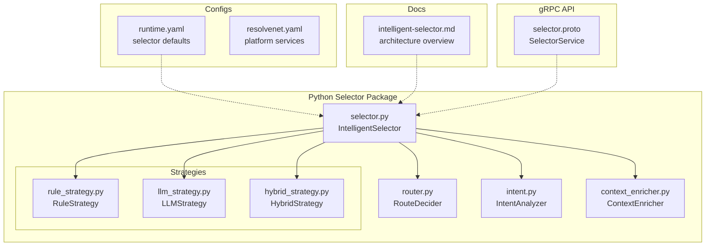

**Diagram sources**
- [selector.py:1-100](file://python/src/resolvenet/selector/selector.py#L1-L100)
- [router.py:1-40](file://python/src/resolvenet/selector/router.py#L1-L40)
- [intent.py:1-39](file://python/src/resolvenet/selector/intent.py#L1-L39)
- [context_enricher.py:1-47](file://python/src/resolvenet/selector/context_enricher.py#L1-L47)
- [rule_strategy.py:1-77](file://python/src/resolvenet/selector/strategies/rule_strategy.py#L1-L77)
- [llm_strategy.py:1-44](file://python/src/resolvenet/selector/strategies/llm_strategy.py#L1-L44)
- [hybrid_strategy.py:1-42](file://python/src/resolvenet/selector/strategies/hybrid_strategy.py#L1-L42)
- [runtime.yaml:1-18](file://configs/runtime.yaml#L1-L18)
- [resolvenet.yaml:1-34](file://configs/resolvenet.yaml#L1-L34)
- [intelligent-selector.md:1-18](file://docs/architecture/intelligent-selector.md#L1-L18)
- [selector.proto:1-40](file://api/proto/resolvenet/v1/selector.proto#L1-L40)

**Section sources**
- [selector.py:1-100](file://python/src/resolvenet/selector/selector.py#L1-L100)
- [runtime.yaml:1-18](file://configs/runtime.yaml#L1-L18)
- [intelligent-selector.md:1-18](file://docs/architecture/intelligent-selector.md#L1-L18)

## Core Components
- IntelligentSelector: orchestrates intent analysis, context enrichment, and strategy-driven route decisions. It exposes a route method and supports strategies via a dispatch map.
- RouteDecision: standardized output model containing route_type, route_target, confidence, parameters, reasoning, and optional chaining for multi-step decisions.
- IntentAnalyzer: extracts intent type, confidence, entities, and metadata from user input.
- ContextEnricher: augments context with available skills, active workflows, RAG collections, and conversation history.
- RouteDecider: makes the final routing decision given intent and enriched context (placeholder implementation currently).
- Strategies: RuleStrategy, LLMStrategy, and HybridStrategy implement different routing approaches.

Key configuration:
- runtime.yaml defines default_strategy and confidence_threshold for hybrid routing.
- resolvenet.yaml configures platform services and telemetry.

**Section sources**
- [selector.py:13-100](file://python/src/resolvenet/selector/selector.py#L13-L100)
- [intent.py:8-39](file://python/src/resolvenet/selector/intent.py#L8-L39)
- [context_enricher.py:8-47](file://python/src/resolvenet/selector/context_enricher.py#L8-L47)
- [router.py:10-40](file://python/src/resolvenet/selector/router.py#L10-L40)
- [runtime.yaml:11-13](file://configs/runtime.yaml#L11-L13)

## Architecture Overview
The selector follows a staged pipeline: input text enters the IntelligentSelector, which delegates to a chosen strategy. The strategy produces a RouteDecision. The RouteDecider consumes intent and context to finalize routing. gRPC APIs expose ClassifyIntent and Route RPCs for external clients.

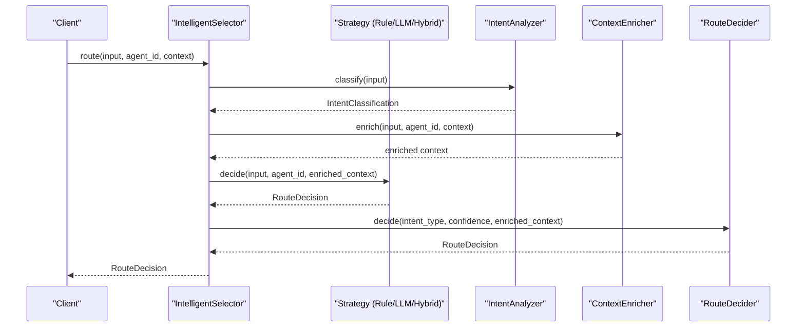

**Diagram sources**
- [selector.py:43-100](file://python/src/resolvenet/selector/selector.py#L43-L100)
- [intent.py:24-39](file://python/src/resolvenet/selector/intent.py#L24-L39)
- [context_enricher.py:16-47](file://python/src/resolvenet/selector/context_enricher.py#L16-L47)
- [router.py:17-40](file://python/src/resolvenet/selector/router.py#L17-L40)
- [rule_strategy.py:35-77](file://python/src/resolvenet/selector/strategies/rule_strategy.py#L35-L77)
- [llm_strategy.py:33-44](file://python/src/resolvenet/selector/strategies/llm_strategy.py#L33-L44)
- [hybrid_strategy.py:27-42](file://python/src/resolvenet/selector/strategies/hybrid_strategy.py#L27-L42)

## Detailed Component Analysis

### IntelligentSelector
- Responsibilities:
  - Dispatches to strategy implementations based on configured strategy
  - Aggregates results and logs route decisions
- Strategy selection:
  - Supported keys: "llm", "rule", "hybrid"
  - Defaults to hybrid if unknown strategy is provided
- Route method:
  - Accepts input_text, agent_id, and context
  - Returns RouteDecision with route_type, confidence, reasoning, and optional chain

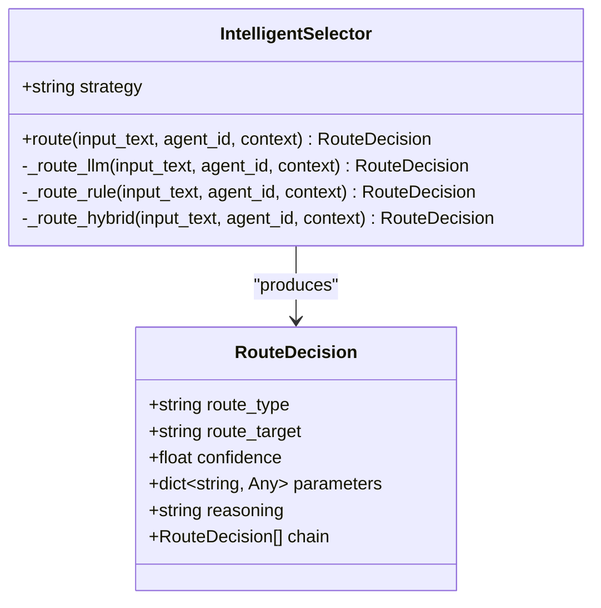

**Diagram sources**
- [selector.py:24-100](file://python/src/resolvenet/selector/selector.py#L24-L100)
- [selector.py:13-22](file://python/src/resolvenet/selector/selector.py#L13-L22)

**Section sources**
- [selector.py:24-100](file://python/src/resolvenet/selector/selector.py#L24-L100)

### Strategy Implementations

#### RuleStrategy
- Purpose: Deterministic routing via regex patterns
- Patterns:
  - FTA: diagnostic/troubleshooting keywords
  - Skill: tool execution keywords (web search, code execution, file ops)
  - RAG: knowledge/document keywords
- Confidence: high for strong matches, lower default when no rule applies

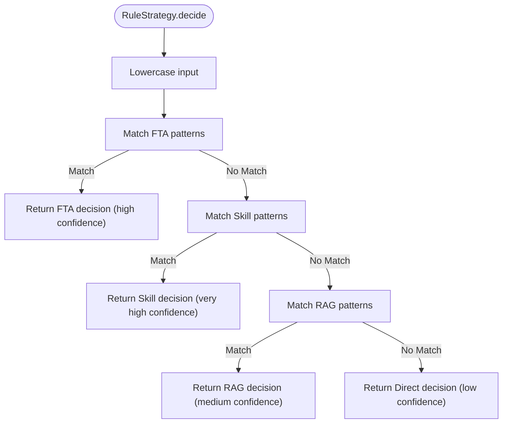

**Diagram sources**
- [rule_strategy.py:18-77](file://python/src/resolvenet/selector/strategies/rule_strategy.py#L18-L77)

**Section sources**
- [rule_strategy.py:11-77](file://python/src/resolvenet/selector/strategies/rule_strategy.py#L11-L77)

#### LLMStrategy
- Purpose: Contextual routing for ambiguous requests
- Mechanism: Uses a structured prompt to classify route_type, route_target, confidence, and reasoning
- Current state: Placeholder returning a default decision; production systems would integrate with an LLM provider

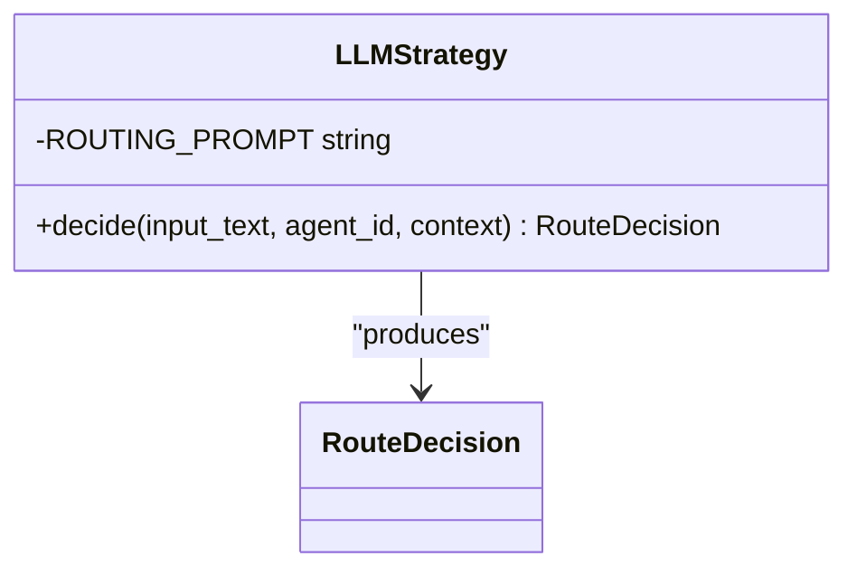

**Diagram sources**
- [llm_strategy.py:10-44](file://python/src/resolvenet/selector/strategies/llm_strategy.py#L10-L44)

**Section sources**
- [llm_strategy.py:10-44](file://python/src/resolvenet/selector/strategies/llm_strategy.py#L10-L44)

#### HybridStrategy
- Purpose: Combine speed and accuracy
- Logic:
  - First apply RuleStrategy
  - If confidence >= threshold, return rule decision
  - Else, apply LLMStrategy and return its decision
- Threshold: configurable via runtime.yaml

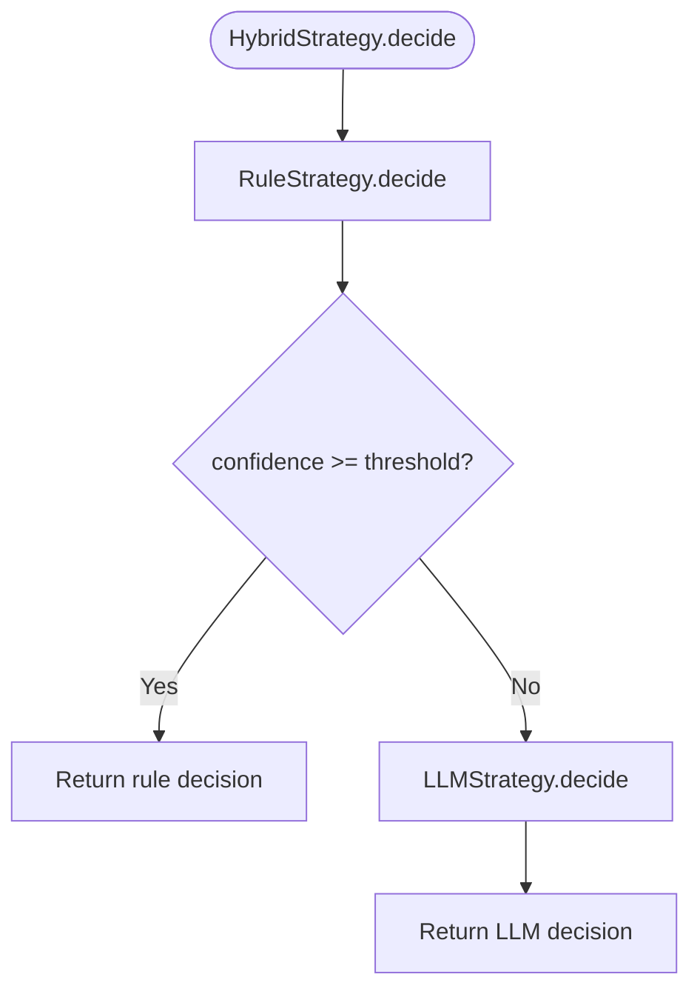

**Diagram sources**
- [hybrid_strategy.py:21-42](file://python/src/resolvenet/selector/strategies/hybrid_strategy.py#L21-L42)
- [runtime.yaml:12-13](file://configs/runtime.yaml#L12-L13)

**Section sources**
- [hybrid_strategy.py:12-42](file://python/src/resolvenet/selector/strategies/hybrid_strategy.py#L12-L42)
- [runtime.yaml:11-13](file://configs/runtime.yaml#L11-L13)

### Intent Analysis
- IntentAnalyzer classifies user input into intent_type, confidence, entities, and metadata
- Current implementation returns a default classification; production systems would integrate with an LLM for classification

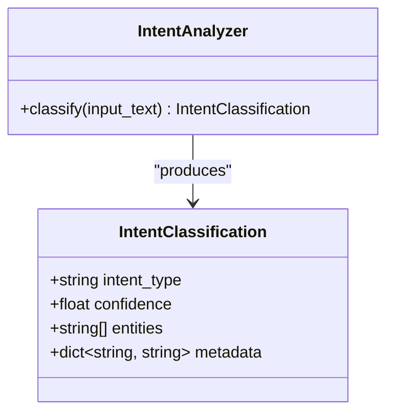

**Diagram sources**
- [intent.py:17-39](file://python/src/resolvenet/selector/intent.py#L17-L39)
- [intent.py:8-15](file://python/src/resolvenet/selector/intent.py#L8-L15)

**Section sources**
- [intent.py:17-39](file://python/src/resolvenet/selector/intent.py#L17-L39)

### Context Enricher
- ContextEnricher augments the request context with:
  - available_skills
  - active_workflows
  - rag_collections
  - conversation_history
- Current implementation returns placeholders; production systems would fetch from registries and storage

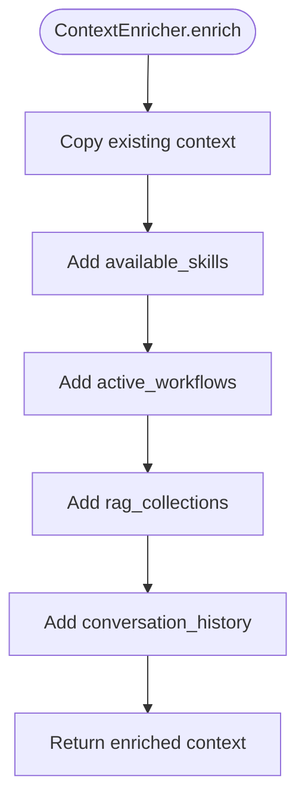

**Diagram sources**
- [context_enricher.py:16-47](file://python/src/resolvenet/selector/context_enricher.py#L16-L47)

**Section sources**
- [context_enricher.py:8-47](file://python/src/resolvenet/selector/context_enricher.py#L8-L47)

### Route Decision Engine
- RouteDecider consumes intent_type, confidence, and enriched context to produce a final RouteDecision
- Current implementation defaults to direct responses; future versions will implement sophisticated routing logic

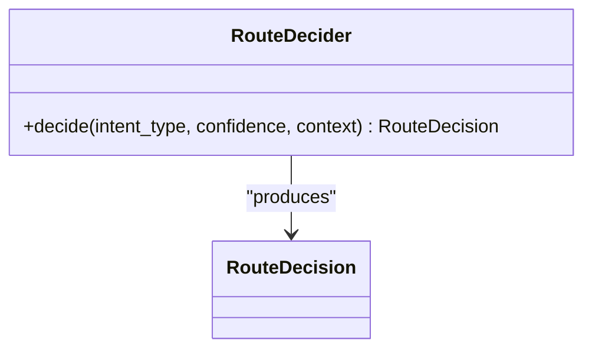

**Diagram sources**
- [router.py:10-40](file://python/src/resolvenet/selector/router.py#L10-L40)

**Section sources**
- [router.py:10-40](file://python/src/resolvenet/selector/router.py#L10-L40)

### gRPC API Integration
- SelectorService defines ClassifyIntent and Route RPCs
- Messages include input, conversation_id, agent_id, and context Struct
- Enables external clients to integrate with the selector pipeline

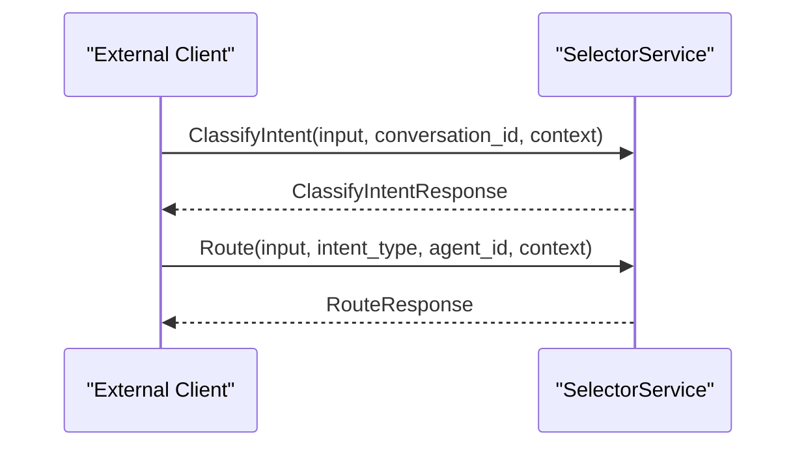

**Diagram sources**
- [selector.proto:10-40](file://api/proto/resolvenet/v1/selector.proto#L10-L40)

**Section sources**
- [selector.proto:10-40](file://api/proto/resolvenet/v1/selector.proto#L10-L40)

## Dependency Analysis
- Strategy coupling:
  - HybridStrategy depends on RuleStrategy and LLMStrategy
  - IntelligentSelector dispatches to strategies
- Runtime configuration:
  - runtime.yaml controls default_strategy and confidence_threshold
- Platform services:
  - resolvenet.yaml configures server addresses and telemetry

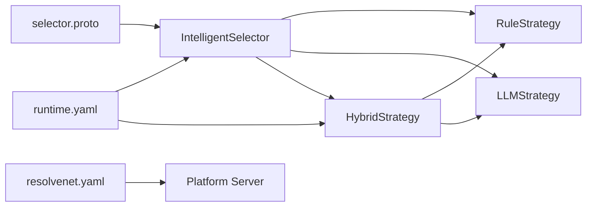

**Diagram sources**
- [selector.py:35-41](file://python/src/resolvenet/selector/selector.py#L35-L41)
- [hybrid_strategy.py:23-25](file://python/src/resolvenet/selector/strategies/hybrid_strategy.py#L23-L25)
- [runtime.yaml:11-13](file://configs/runtime.yaml#L11-L13)
- [resolvenet.yaml:3-6](file://configs/resolvenet.yaml#L3-L6)
- [selector.proto:10-14](file://api/proto/resolvenet/v1/selector.proto#L10-L14)

**Section sources**
- [selector.py:35-41](file://python/src/resolvenet/selector/selector.py#L35-L41)
- [hybrid_strategy.py:23-25](file://python/src/resolvenet/selector/strategies/hybrid_strategy.py#L23-L25)
- [runtime.yaml:11-13](file://configs/runtime.yaml#L11-L13)
- [resolvenet.yaml:3-6](file://configs/resolvenet.yaml#L3-L6)

## Performance Considerations
- Strategy selection:
  - Hybrid is recommended for production to balance latency and accuracy
  - Adjust confidence_threshold per workload characteristics
- Optimization tips:
  - Use lightweight models for rule classification
  - Cache repeated computations where feasible
  - Set LLM timeouts to prevent blocking
- Configuration levers:
  - Tune selector.default_strategy and selector.confidence_threshold in runtime.yaml
  - Configure platform service addresses in resolvenet.yaml

[No sources needed since this section provides general guidance]

## Troubleshooting Guide
- Symptom: Low routing accuracy
  - Cause: Insufficient rule coverage or inappropriate confidence_threshold
  - Action: Expand rule_strategy patterns and adjust runtime.yaml threshold
- Symptom: High latency
  - Cause: Frequent LLM fallbacks
  - Action: Increase confidence_threshold or pre-enrich context to improve rule matches
- Symptom: Misclassification of intent
  - Cause: IntentAnalyzer placeholder implementation
  - Action: Integrate with an LLM-based classifier and validate with test_selector.py scenarios

**Section sources**
- [test_selector.py:8-30](file://python/tests/unit/test_selector.py#L8-L30)
- [hybrid_strategy.py:21](file://python/src/resolvenet/selector/strategies/hybrid_strategy.py#L21)
- [runtime.yaml:12-13](file://configs/runtime.yaml#L12-L13)

## Conclusion
The Intelligent Selector system provides a modular, extensible framework for dynamic capability routing. By separating concerns across intent analysis, context enrichment, and strategy-driven decision-making, it enables both deterministic and adaptive routing. Production readiness requires implementing the IntentAnalyzer, ContextEnricher, and RouteDecider, integrating LLM providers for LLMStrategy, and tuning configuration for optimal performance.

[No sources needed since this section summarizes without analyzing specific files]

## Appendices

### Strategy Configuration Examples
- Default strategy and threshold:
  - selector.default_strategy: hybrid
  - selector.confidence_threshold: 0.7
- Example rule pattern structure:
  - pattern: regex expression
  - route_type: one of fta, skill, rag, direct
  - target: optional skill/workflow identifier
  - confidence: 0.0–1.0

**Section sources**
- [runtime.yaml:11-13](file://configs/runtime.yaml#L11-L13)
- [intelligent-selector.md:5-17](file://docs/architecture/intelligent-selector.md#L5-L17)

### Custom Strategy Development
- Implement a new strategy class with a decide method that returns a RouteDecision
- Register the strategy in IntelligentSelector._strategies
- Optionally integrate with runtime.yaml to select the strategy at startup

**Section sources**
- [selector.py:35-41](file://python/src/resolvenet/selector/selector.py#L35-L41)

### Selector API Reference
- gRPC service: SelectorService
  - ClassifyIntent: input, conversation_id, context → intent_type, confidence, entities, metadata
  - Route: input, intent_type, agent_id, context → decision, reasoning

**Section sources**
- [selector.proto:10-40](file://api/proto/resolvenet/v1/selector.proto#L10-L40)