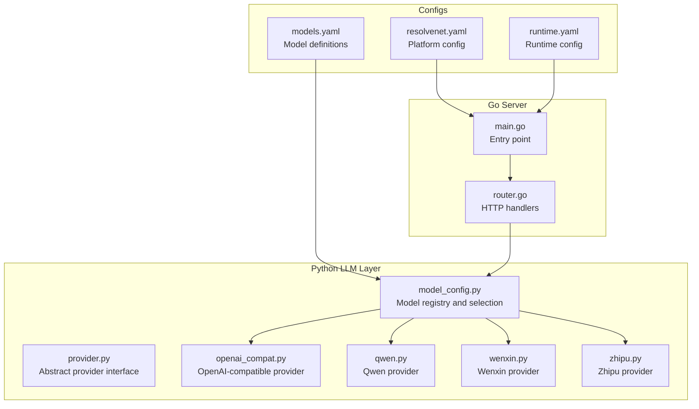
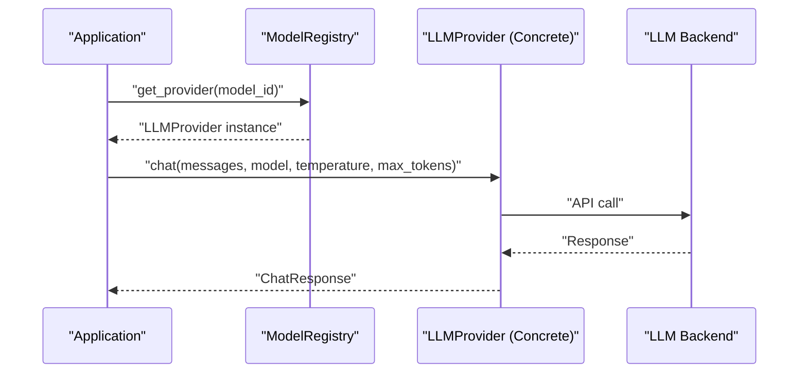
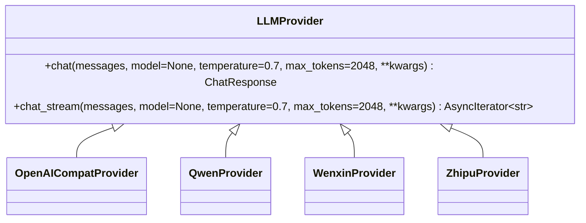
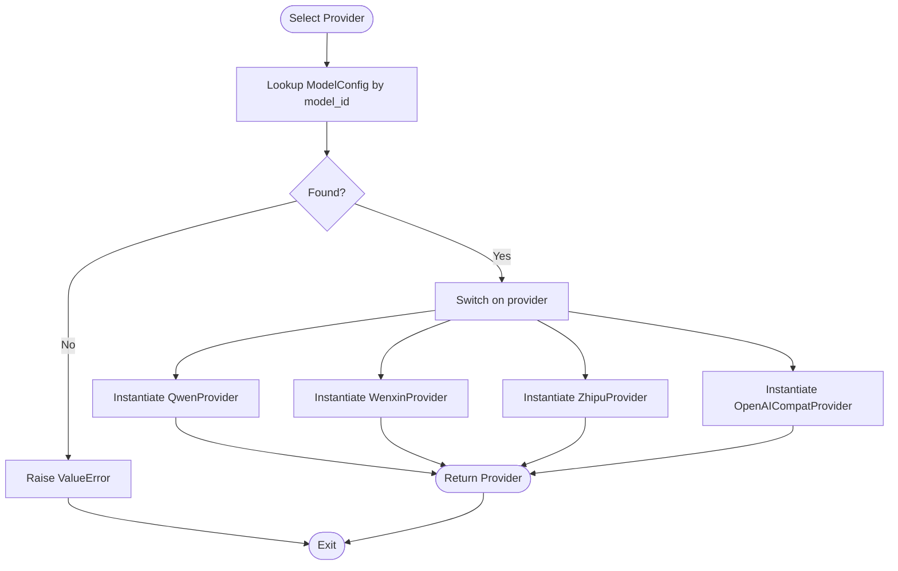
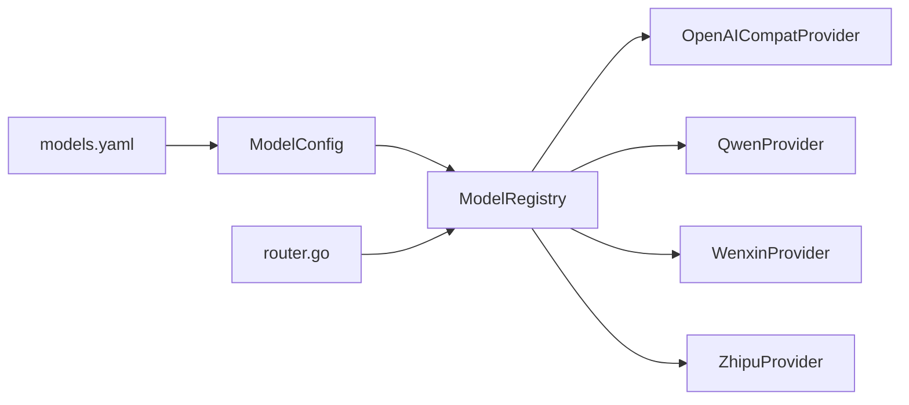

# LLM Provider Abstraction

<cite>
**Referenced Files in This Document**
- [provider.py](file://python/src/resolvenet/llm/provider.py)
- [model_config.py](file://python/src/resolvenet/llm/model_config.py)
- [openai_compat.py](file://python/src/resolvenet/llm/openai_compat.py)
- [qwen.py](file://python/src/resolvenet/llm/qwen.py)
- [wenxin.py](file://python/src/resolvenet/llm/wenxin.py)
- [zhipu.py](file://python/src/resolvenet/llm/zhipu.py)
- [models.yaml](file://configs/models.yaml)
- [resolvenet.yaml](file://configs/resolvenet.yaml)
- [runtime.yaml](file://configs/runtime.yaml)
- [router.go](file://pkg/server/router.go)
- [main.go](file://cmd/resolvenet-server/main.go)
</cite>

## Table of Contents
1. [Introduction](#introduction)
2. [Project Structure](#project-structure)
3. [Core Components](#core-components)
4. [Architecture Overview](#architecture-overview)
5. [Detailed Component Analysis](#detailed-component-analysis)
6. [Dependency Analysis](#dependency-analysis)
7. [Performance Considerations](#performance-considerations)
8. [Troubleshooting Guide](#troubleshooting-guide)
9. [Conclusion](#conclusion)
10. [Appendices](#appendices)

## Introduction
This document describes the LLM provider abstraction layer that enables multi-provider LLM integration. It covers the abstract provider interface, model configuration management, provider-specific implementations for major Chinese LLM providers (Qwen, Wenxin, Zhipu), and an OpenAI-compatible provider for standard LLM integration. It also documents the model configuration system, provider selection logic, and practical guidance for extending the system with new providers, tuning model parameters, and optimizing provider selection for cost and performance.

## Project Structure
The LLM provider abstraction resides in the Python package under python/src/resolvenet/llm. The configuration for models is defined in configs/models.yaml, while platform-wide configuration is defined in configs/resolvenet.yaml and configs/runtime.yaml. The Go server exposes endpoints related to model management and acts as the orchestrator for platform services.

**Diagram sources**
- [provider.py:27-77](file://python/src/resolvenet/llm/provider.py#L27-L77)
- [model_config.py:23-69](file://python/src/resolvenet/llm/model_config.py#L23-L69)
- [openai_compat.py:13-57](file://python/src/resolvenet/llm/openai_compat.py#L13-L57)
- [qwen.py:13-57](file://python/src/resolvenet/llm/qwen.py#L13-L57)
- [wenxin.py:13-52](file://python/src/resolvenet/llm/wenxin.py#L13-L52)
- [zhipu.py:13-51](file://python/src/resolvenet/llm/zhipu.py#L13-L51)
- [models.yaml:1-31](file://configs/models.yaml#L1-L31)
- [resolvenet.yaml:1-34](file://configs/resolvenet.yaml#L1-L34)
- [runtime.yaml:1-18](file://configs/runtime.yaml#L1-L18)
- [router.go:162-182](file://pkg/server/router.go#L162-L182)
- [main.go:1-56](file://cmd/resolvenet-server/main.go#L1-L56)

**Section sources**
- [provider.py:1-77](file://python/src/resolvenet/llm/provider.py#L1-L77)
- [model_config.py:1-70](file://python/src/resolvenet/llm/model_config.py#L1-L70)
- [models.yaml:1-31](file://configs/models.yaml#L1-L31)
- [resolvenet.yaml:1-34](file://configs/resolvenet.yaml#L1-L34)
- [runtime.yaml:1-18](file://configs/runtime.yaml#L1-L18)
- [router.go:162-182](file://pkg/server/router.go#L162-L182)
- [main.go:1-56](file://cmd/resolvenet-server/main.go#L1-L56)

## Core Components
- Abstract provider interface: Defines the contract for chat and streaming chat completion across providers.
- Message and response models: Typed structures for chat messages and provider responses.
- Model configuration and registry: Centralized model definitions and provider instantiation logic.
- Provider implementations: Concrete providers for Qwen, Wenxin, Zhipu, and OpenAI-compatible APIs.

Key responsibilities:
- Abstract provider interface ensures uniform method signatures for chat and streaming chat across all providers.
- Model registry maps model identifiers to provider instances, enabling dynamic provider selection based on model configuration.
- Provider implementations encapsulate provider-specific initialization, API calls, and streaming behavior.

**Section sources**
- [provider.py:11-77](file://python/src/resolvenet/llm/provider.py#L11-L77)
- [model_config.py:10-69](file://python/src/resolvenet/llm/model_config.py#L10-L69)
- [openai_compat.py:13-57](file://python/src/resolvenet/llm/openai_compat.py#L13-L57)
- [qwen.py:13-57](file://python/src/resolvenet/llm/qwen.py#L13-L57)
- [wenxin.py:13-52](file://python/src/resolvenet/llm/wenxin.py#L13-L52)
- [zhipu.py:13-51](file://python/src/resolvenet/llm/zhipu.py#L13-L51)

## Architecture Overview
The LLM provider abstraction follows a layered architecture:
- Application code invokes the model registry to resolve a model to a provider instance.
- The provider executes chat or streaming chat calls against the respective backend.
- Configuration files define model metadata and credentials, which the registry consumes to instantiate providers.

**Diagram sources**
- [model_config.py:41-69](file://python/src/resolvenet/llm/model_config.py#L41-L69)
- [provider.py:34-76](file://python/src/resolvenet/llm/provider.py#L34-L76)
- [openai_compat.py:30-56](file://python/src/resolvenet/llm/openai_compat.py#L30-L56)
- [qwen.py:27-56](file://python/src/resolvenet/llm/qwen.py#L27-L56)
- [wenxin.py:25-51](file://python/src/resolvenet/llm/wenxin.py#L25-L51)
- [zhipu.py:24-50](file://python/src/resolvenet/llm/zhipu.py#L24-L50)

## Detailed Component Analysis

### Abstract Provider Interface
The abstract provider defines two asynchronous methods:
- chat: synchronous completion generation returning a typed response.
- chat_stream: streaming completion yielding content chunks.

Both methods accept standardized parameters including messages, model, temperature, and max_tokens, ensuring consistent behavior across providers.

**Diagram sources**
- [provider.py:27-77](file://python/src/resolvenet/llm/provider.py#L27-L77)
- [openai_compat.py:13-57](file://python/src/resolvenet/llm/openai_compat.py#L13-L57)
- [qwen.py:13-57](file://python/src/resolvenet/llm/qwen.py#L13-L57)
- [wenxin.py:13-52](file://python/src/resolvenet/llm/wenxin.py#L13-L52)
- [zhipu.py:13-51](file://python/src/resolvenet/llm/zhipu.py#L13-L51)

**Section sources**
- [provider.py:27-77](file://python/src/resolvenet/llm/provider.py#L27-L77)

### Model Configuration and Registry
The model configuration system consists of:
- ModelConfig: Pydantic model capturing model identity, provider type, model name, credentials, defaults, and extra provider-specific settings.
- ModelRegistry: Manages registration, lookup, listing, and provider instantiation.

Provider selection logic:
- The registry resolves a model_id to a ModelConfig and instantiates the corresponding provider class based on the provider field.
- Supported providers include qwen, wenxin, zhipu, and openai-compat.

**Diagram sources**
- [model_config.py:41-69](file://python/src/resolvenet/llm/model_config.py#L41-L69)

**Section sources**
- [model_config.py:10-69](file://python/src/resolvenet/llm/model_config.py#L10-L69)
- [models.yaml:1-31](file://configs/models.yaml#L1-L31)

### OpenAI-Compatible Provider
The OpenAICompatProvider implements the abstract interface for any OpenAI-compatible API endpoint. It supports:
- Configurable base_url and default_model.
- Placeholder implementations awaiting HTTP client integration.

Usage scenarios:
- Local inference servers (e.g., vLLM, Ollama, LM Studio, LocalAI).
- Cloud-hosted OpenAI-compatible endpoints.

**Section sources**
- [openai_compat.py:13-57](file://python/src/resolvenet/llm/openai_compat.py#L13-L57)

### Qwen Provider (Alibaba DashScope)
The QwenProvider targets Alibaba’s DashScope-compatible API and supports multiple Qwen variants. It:
- Uses a default model and a predefined base URL, with optional override.
- Provides placeholders for HTTP client integration and token usage reporting.

Capabilities:
- Supports qwen-turbo, qwen-plus, qwen-max, and long-context variants.

**Section sources**
- [qwen.py:13-57](file://python/src/resolvenet/llm/qwen.py#L13-L57)

### Wenxin Provider (Baidu ERNIE Bot)
The WenxinProvider targets Baidu’s Qianfan API and supports:
- Multiple ERNIE variants.
- Constructor accepts both API key and secret key.

**Section sources**
- [wenxin.py:13-52](file://python/src/resolvenet/llm/wenxin.py#L13-L52)

### Zhipu Provider (GLM)
The ZhipuProvider targets Zhipu AI’s API and supports:
- Multiple GLM variants.
- Constructor accepts API key.

**Section sources**
- [zhipu.py:13-51](file://python/src/resolvenet/llm/zhipu.py#L13-L51)

### Provider Selection Logic
Provider selection is centralized in the ModelRegistry.get_provider method:
- Validates model existence.
- Instantiates the appropriate provider class based on the provider field.
- Delegates credential and base URL handling to each provider constructor.

Operational notes:
- The provider field in model configurations determines the provider class.
- OpenAI-compatible provider is used when provider equals openai-compat.

**Section sources**
- [model_config.py:41-69](file://python/src/resolvenet/llm/model_config.py#L41-L69)

### Model Configuration Management
Model configuration is defined in YAML and includes:
- id: unique model identifier.
- provider: provider type (qwen, wenxin, zhipu, openai-compat).
- model_name: provider-side model identifier.
- api_key/base_url/secret_key: credentials and endpoints.
- default_temperature and max_tokens: defaults for generation.
- extra: provider-specific settings.

Examples in configs/models.yaml demonstrate:
- Qwen variants with differing max_tokens.
- Wenxin ERNIE variant with API and secret keys.
- Zhipu GLM variant with API key.

**Section sources**
- [models.yaml:1-31](file://configs/models.yaml#L1-L31)

### Server Integration and Model Management Endpoints
The Go server exposes HTTP endpoints for model management:
- List models endpoint returns empty model list and total count.
- Add model, get config, and update config endpoints are not implemented yet.

These endpoints are part of the broader platform services and coordinate with the Python LLM layer via runtime and gateway integrations.

**Section sources**
- [router.go:162-182](file://pkg/server/router.go#L162-L182)
- [resolvenet.yaml:1-34](file://configs/resolvenet.yaml#L1-L34)
- [runtime.yaml:1-18](file://configs/runtime.yaml#L1-L18)
- [main.go:1-56](file://cmd/resolvenet-server/main.go#L1-L56)

## Dependency Analysis
The LLM provider abstraction exhibits low coupling and high cohesion:
- Abstract provider interface decouples application code from provider specifics.
- Model registry centralizes provider selection and instantiation.
- Provider implementations encapsulate provider-specific logic.

External dependencies:
- Python provider implementations currently contain placeholder comments indicating HTTP client integration is pending.
- Go server configuration files define platform-level settings that influence runtime behavior.

**Diagram sources**
- [model_config.py:10-69](file://python/src/resolvenet/llm/model_config.py#L10-L69)
- [openai_compat.py:13-57](file://python/src/resolvenet/llm/openai_compat.py#L13-L57)
- [qwen.py:13-57](file://python/src/resolvenet/llm/qwen.py#L13-L57)
- [wenxin.py:13-52](file://python/src/resolvenet/llm/wenxin.py#L13-L52)
- [zhipu.py:13-51](file://python/src/resolvenet/llm/zhipu.py#L13-L51)
- [models.yaml:1-31](file://configs/models.yaml#L1-L31)
- [router.go:162-182](file://pkg/server/router.go#L162-L182)

**Section sources**
- [model_config.py:10-69](file://python/src/resolvenet/llm/model_config.py#L10-L69)
- [models.yaml:1-31](file://configs/models.yaml#L1-L31)
- [router.go:162-182](file://pkg/server/router.go#L162-L182)

## Performance Considerations
- Streaming support: Implement chat_stream consistently across providers to reduce latency and improve user experience.
- Token limits: Tune max_tokens per model to balance quality and cost.
- Temperature: Adjust default_temperature per model to control creativity vs. determinism.
- Endpoint selection: Prefer regional or optimized base URLs for providers to minimize latency.
- Caching: Reuse provider instances per model where feasible to avoid repeated initialization overhead.

[No sources needed since this section provides general guidance]

## Troubleshooting Guide
Common issues and resolutions:
- Model not found: Ensure the model_id exists in the registry and matches the configuration file.
- Provider instantiation errors: Verify provider-specific credentials and base URLs are set correctly.
- Streaming not working: Confirm chat_stream is implemented for the selected provider.
- Endpoint connectivity: Validate base_url and API keys for cloud providers.

Operational checks:
- Review server logs for provider debug messages.
- Confirm platform configuration values in resolvenet.yaml and runtime.yaml.

**Section sources**
- [model_config.py:50-52](file://python/src/resolvenet/llm/model_config.py#L50-L52)
- [resolvenet.yaml:1-34](file://configs/resolvenet.yaml#L1-L34)
- [runtime.yaml:1-18](file://configs/runtime.yaml#L1-L18)

## Conclusion
The LLM provider abstraction layer cleanly separates concerns between model configuration, provider selection, and provider implementations. It supports major Chinese LLM providers and OpenAI-compatible APIs, with a straightforward extension mechanism for new providers. By leveraging the model registry and configuration files, teams can manage diverse model parameters, optimize provider selection for cost and performance, and integrate seamlessly with platform services.

[No sources needed since this section summarizes without analyzing specific files]

## Appendices

### Adding a New Provider Implementation
Steps:
- Define a new provider class inheriting from LLMProvider.
- Implement chat and chat_stream with provider-specific API integration.
- Register the provider in ModelRegistry.get_provider with a unique provider value.
- Add a model entry in models.yaml with the new provider value and required credentials.

Example references:
- Abstract interface definition: [provider.py:27-77](file://python/src/resolvenet/llm/provider.py#L27-L77)
- Provider selection logic: [model_config.py:41-69](file://python/src/resolvenet/llm/model_config.py#L41-L69)
- Example provider implementations: [openai_compat.py:13-57](file://python/src/resolvenet/llm/openai_compat.py#L13-L57), [qwen.py:13-57](file://python/src/resolvenet/llm/qwen.py#L13-L57), [wenxin.py:13-52](file://python/src/resolvenet/llm/wenxin.py#L13-L52), [zhipu.py:13-51](file://python/src/resolvenet/llm/zhipu.py#L13-L51)

**Section sources**
- [provider.py:27-77](file://python/src/resolvenet/llm/provider.py#L27-L77)
- [model_config.py:41-69](file://python/src/resolvenet/llm/model_config.py#L41-L69)
- [openai_compat.py:13-57](file://python/src/resolvenet/llm/openai_compat.py#L13-L57)
- [qwen.py:13-57](file://python/src/resolvenet/llm/qwen.py#L13-L57)
- [wenxin.py:13-52](file://python/src/resolvenet/llm/wenxin.py#L13-L52)
- [zhipu.py:13-51](file://python/src/resolvenet/llm/zhipu.py#L13-L51)

### Configuring Model Parameters
Guidelines:
- Set id, provider, model_name, and credentials in models.yaml.
- Adjust default_temperature and max_tokens to align with model capabilities and use case.
- Use extra for provider-specific options.

References:
- Model configuration schema: [model_config.py:10-21](file://python/src/resolvenet/llm/model_config.py#L10-L21)
- Example entries: [models.yaml:1-31](file://configs/models.yaml#L1-L31)

**Section sources**
- [model_config.py:10-21](file://python/src/resolvenet/llm/model_config.py#L10-L21)
- [models.yaml:1-31](file://configs/models.yaml#L1-L31)

### Optimizing Provider Selection Strategies
Recommendations:
- Route by capability: Select providers based on model_name and supported variants.
- Cost-aware routing: Prefer lower-cost providers for routine tasks; reserve higher-capability providers for specialized workloads.
- Latency-aware routing: Choose providers with optimal base_url proximity and reliability.
- Dynamic selection: Extend ModelRegistry.get_provider to incorporate health checks and real-time metrics.

[No sources needed since this section provides general guidance]