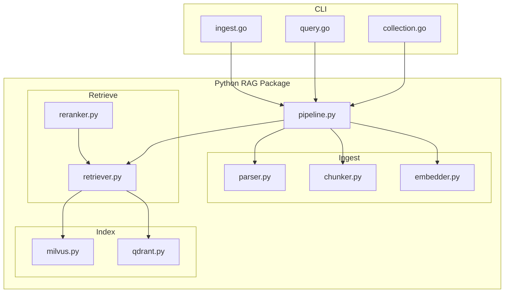
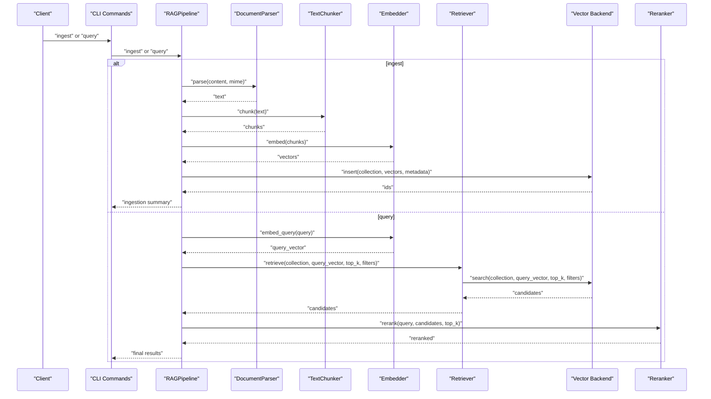
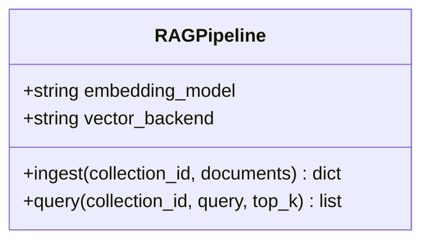
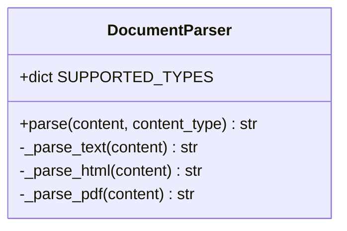
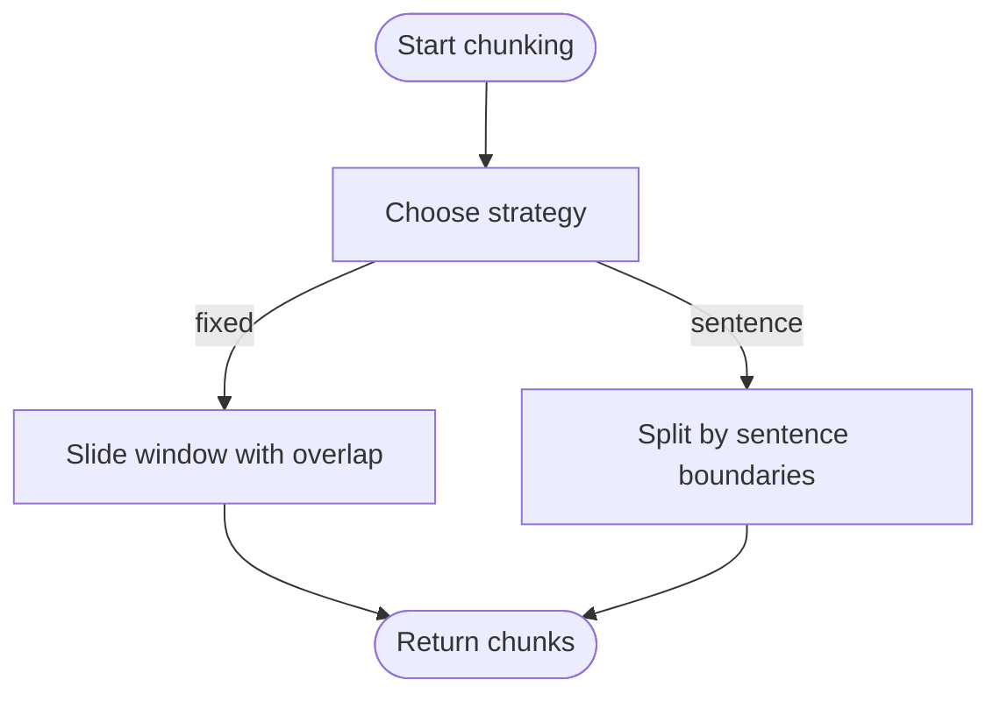
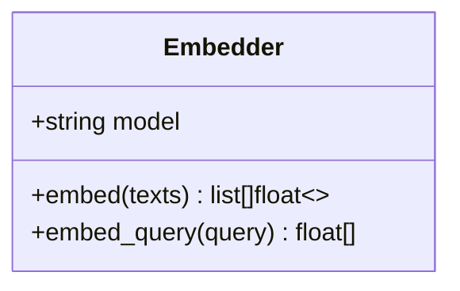
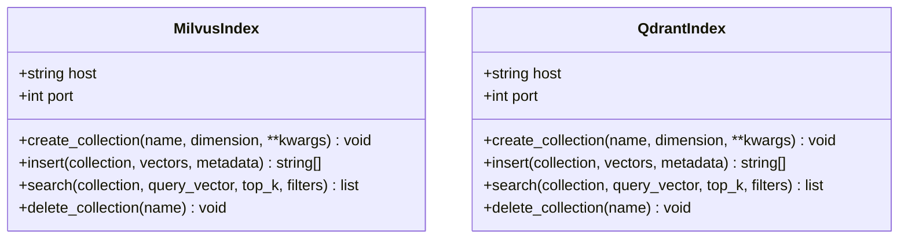
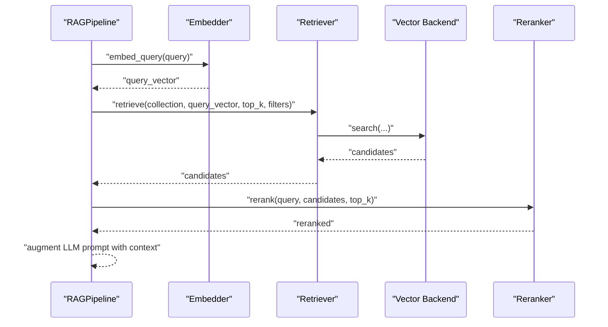
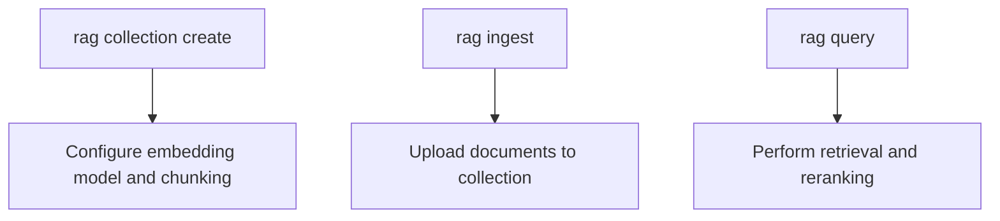
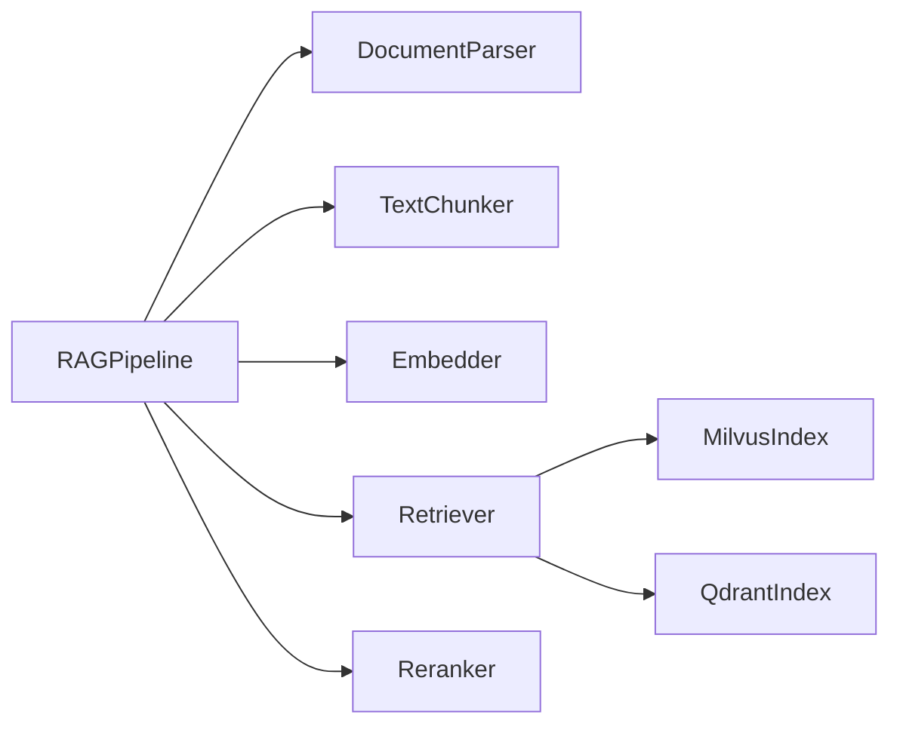

# RAG Pipeline

<cite>
**Referenced Files in This Document**
- [pipeline.py](file://python/src/resolvenet/rag/pipeline.py)
- [milvus.py](file://python/src/resolvenet/rag/index/milvus.py)
- [qdrant.py](file://python/src/resolvenet/rag/index/qdrant.py)
- [parser.py](file://python/src/resolvenet/rag/ingest/parser.py)
- [chunker.py](file://python/src/resolvenet/rag/ingest/chunker.py)
- [embedder.py](file://python/src/resolvenet/rag/ingest/embedder.py)
- [retriever.py](file://python/src/resolvenet/rag/retrieve/retriever.py)
- [reranker.py](file://python/src/resolvenet/rag/retrieve/reranker.py)
- [ingest.go](file://internal/cli/rag/ingest.go)
- [query.go](file://internal/cli/rag/query.go)
- [collection.go](file://internal/cli/rag/collection.go)
- [test_rag_pipeline.py](file://python/tests/unit/test_rag_pipeline.py)
- [resolvenet.yaml](file://configs/resolvenet.yaml)
- [rag-pipeline.md](file://docs/zh/rag-pipeline.md)
- [configuration.md](file://docs/zh/configuration.md)
</cite>

## Table of Contents
1. [Introduction](#introduction)
2. [Project Structure](#project-structure)
3. [Core Components](#core-components)
4. [Architecture Overview](#architecture-overview)
5. [Detailed Component Analysis](#detailed-component-analysis)
6. [Dependency Analysis](#dependency-analysis)
7. [Performance Considerations](#performance-considerations)
8. [Troubleshooting Guide](#troubleshooting-guide)
9. [Conclusion](#conclusion)
10. [Appendices](#appendices)

## Introduction
This document describes the Retrieval-Augmented Generation (RAG) pipeline that powers knowledge-intensive operations in the system. It covers the ingestion workflow (parsing, chunking, embedding, indexing), vector indexing backends (Milvus and Qdrant), semantic retrieval (similarity search and cross-encoder reranking), and augmented generation. It also provides configuration guidance, customization options for embedding providers, retrieval optimization tips, and integration patterns with the intelligent selector.

## Project Structure
The RAG implementation is primarily located under the Python package resolvenet/rag, with supporting CLI commands for ingestion and querying under internal/cli/rag. Configuration examples for vector backends are documented in the project’s documentation.

**Diagram sources**
- [pipeline.py:11-75](file://python/src/resolvenet/rag/pipeline.py#L11-L75)
- [parser.py:8-49](file://python/src/resolvenet/rag/ingest/parser.py#L8-L49)
- [chunker.py:6-73](file://python/src/resolvenet/rag/ingest/chunker.py#L6-L73)
- [embedder.py:11-49](file://python/src/resolvenet/rag/ingest/embedder.py#L11-L49)
- [milvus.py:11-54](file://python/src/resolvenet/rag/index/milvus.py#L11-L54)
- [qdrant.py:11-52](file://python/src/resolvenet/rag/index/qdrant.py#L11-L52)
- [retriever.py:11-42](file://python/src/resolvenet/rag/retrieve/retriever.py#L11-L42)
- [reranker.py:11-41](file://python/src/resolvenet/rag/retrieve/reranker.py#L11-L41)
- [ingest.go:9-27](file://internal/cli/rag/ingest.go#L9-L27)
- [query.go:9-29](file://internal/cli/rag/query.go#L9-L29)
- [collection.go:9-80](file://internal/cli/rag/collection.go#L9-L80)

**Section sources**
- [pipeline.py:11-75](file://python/src/resolvenet/rag/pipeline.py#L11-L75)
- [milvus.py:11-54](file://python/src/resolvenet/rag/index/milvus.py#L11-L54)
- [qdrant.py:11-52](file://python/src/resolvenet/rag/index/qdrant.py#L11-L52)
- [parser.py:8-49](file://python/src/resolvenet/rag/ingest/parser.py#L8-L49)
- [chunker.py:6-73](file://python/src/resolvenet/rag/ingest/chunker.py#L6-L73)
- [embedder.py:11-49](file://python/src/resolvenet/rag/ingest/embedder.py#L11-L49)
- [retriever.py:11-42](file://python/src/resolvenet/rag/retrieve/retriever.py#L11-L42)
- [reranker.py:11-41](file://python/src/resolvenet/rag/retrieve/reranker.py#L11-L41)
- [ingest.go:9-27](file://internal/cli/rag/ingest.go#L9-L27)
- [query.go:9-29](file://internal/cli/rag/query.go#L9-L29)
- [collection.go:9-80](file://internal/cli/rag/collection.go#L9-L80)

## Core Components
- RAGPipeline orchestrates the full lifecycle: ingestion, indexing, retrieval, and augmented generation. It exposes async ingest and query methods and holds configuration for embedding model and vector backend selection.
- Parser extracts text from supported content types (plain text, markdown, HTML, PDF).
- Chunker splits text into overlapping segments using fixed-size or sentence-based strategies.
- Embedder generates dense vector representations for chunks and queries.
- MilvusIndex and QdrantIndex provide asynchronous vector storage operations (create, insert, search, delete).
- Retriever performs vector similarity search against the selected backend.
- Reranker improves result quality by re-ranking candidates using a cross-encoder model.

**Section sources**
- [pipeline.py:11-75](file://python/src/resolvenet/rag/pipeline.py#L11-L75)
- [parser.py:8-49](file://python/src/resolvenet/rag/ingest/parser.py#L8-L49)
- [chunker.py:6-73](file://python/src/resolvenet/rag/ingest/chunker.py#L6-L73)
- [embedder.py:11-49](file://python/src/resolvenet/rag/ingest/embedder.py#L11-L49)
- [milvus.py:11-54](file://python/src/resolvenet/rag/index/milvus.py#L11-L54)
- [qdrant.py:11-52](file://python/src/resolvenet/rag/index/qdrant.py#L11-L52)
- [retriever.py:11-42](file://python/src/resolvenet/rag/retrieve/retriever.py#L11-L42)
- [reranker.py:11-41](file://python/src/resolvenet/rag/retrieve/reranker.py#L11-L41)

## Architecture Overview
The RAG pipeline follows a modular, asynchronous design. At a high level:
- Ingestion: Parse raw content → Chunk text → Embed chunks → Insert into vector store
- Retrieval: Embed query → Similarity search → Optional reranking → Return top-k chunks
- Augmented generation: Inject retrieved context into prompts for LLM responses

**Diagram sources**
- [pipeline.py:28-75](file://python/src/resolvenet/rag/pipeline.py#L28-L75)
- [parser.py:21-32](file://python/src/resolvenet/rag/ingest/parser.py#L21-L32)
- [chunker.py:25-39](file://python/src/resolvenet/rag/ingest/chunker.py#L25-L39)
- [embedder.py:23-48](file://python/src/resolvenet/rag/ingest/embedder.py#L23-L48)
- [retriever.py:21-41](file://python/src/resolvenet/rag/retrieve/retriever.py#L21-L41)
- [milvus.py:38-48](file://python/src/resolvenet/rag/index/milvus.py#L38-L48)
- [qdrant.py:37-47](file://python/src/resolvenet/rag/index/qdrant.py#L37-L47)
- [reranker.py:21-40](file://python/src/resolvenet/rag/retrieve/reranker.py#L21-L40)

## Detailed Component Analysis

### RAGPipeline Orchestration
- Purpose: Central coordinator for ingestion and querying.
- Key responsibilities:
  - Ingest: Accepts documents, logs counts, and returns a structured summary.
  - Query: Accepts a query string, logs the request, and returns top-k results.
- Extensibility: Initialize with embedding model and vector backend identifiers to select implementations downstream.

**Diagram sources**
- [pipeline.py:11-75](file://python/src/resolvenet/rag/pipeline.py#L11-L75)

**Section sources**
- [pipeline.py:11-75](file://python/src/resolvenet/rag/pipeline.py#L11-L75)

### Document Parsing
- Supported types: text/plain, text/markdown, text/html, application/pdf.
- Behavior: Dispatch to specialized parsers based on MIME type; fallback to text parsing.
- Extensibility: Add new parsers by extending SUPPORTED_TYPES and implementing a method.

**Diagram sources**
- [parser.py:8-49](file://python/src/resolvenet/rag/ingest/parser.py#L8-L49)

**Section sources**
- [parser.py:8-49](file://python/src/resolvenet/rag/ingest/parser.py#L8-L49)

### Text Chunking
- Strategies:
  - fixed: Fixed-length windows with overlap.
  - sentence: Sentence boundary splitting with configurable chunk size.
  - semantic: Placeholder for future semantic segmentation.
- Tuning: Adjust chunk_size and chunk_overlap per content type and retrieval goals.

**Diagram sources**
- [chunker.py:25-73](file://python/src/resolvenet/rag/ingest/chunker.py#L25-L73)

**Section sources**
- [chunker.py:6-73](file://python/src/resolvenet/rag/ingest/chunker.py#L6-L73)
- [test_rag_pipeline.py:6-19](file://python/tests/unit/test_rag_pipeline.py#L6-L19)

### Embedding Generation
- Model selection: Supports configurable embedding model identifier.
- Operations:
  - embed(texts): Batch embeddings for chunks.
  - embed_query(query): Single-query embedding for retrieval.
- Implementation note: Currently returns placeholder vectors; production requires connecting to an embedding provider via the gateway.

**Diagram sources**
- [embedder.py:11-49](file://python/src/resolvenet/rag/ingest/embedder.py#L11-L49)

**Section sources**
- [embedder.py:11-49](file://python/src/resolvenet/rag/ingest/embedder.py#L11-L49)

### Vector Index Backends
- MilvusIndex
  - Host/port configuration.
  - Methods: create_collection, insert, search, delete_collection.
  - Strengths: mature, distributed, strong similarity search on dense vectors.
- QdrantIndex
  - Host/port configuration.
  - Methods: create_collection, insert, search, delete_collection.
  - Strengths: rich filtering and payload management, good for development and small-scale production.

**Diagram sources**
- [milvus.py:11-54](file://python/src/resolvenet/rag/index/milvus.py#L11-L54)
- [qdrant.py:11-52](file://python/src/resolvenet/rag/index/qdrant.py#L11-L52)

**Section sources**
- [milvus.py:11-54](file://python/src/resolvenet/rag/index/milvus.py#L11-L54)
- [qdrant.py:11-52](file://python/src/resolvenet/rag/index/qdrant.py#L11-L52)
- [rag-pipeline.md:502-545](file://docs/zh/rag-pipeline.md#L502-L545)
- [configuration.md:471-534](file://docs/zh/configuration.md#L471-L534)

### Retrieval and Reranking
- Retriever
  - Performs similarity search against the configured vector backend.
  - Supports optional metadata filters and top-k selection.
- Reranker
  - Applies cross-encoder reranking to refine candidate order.
  - Returns top-k results after re-ranking.

**Diagram sources**
- [retriever.py:11-42](file://python/src/resolvenet/rag/retrieve/retriever.py#L11-L42)
- [reranker.py:11-41](file://python/src/resolvenet/rag/retrieve/reranker.py#L11-L41)
- [milvus.py:38-48](file://python/src/resolvenet/rag/index/milvus.py#L38-L48)
- [qdrant.py:37-47](file://python/src/resolvenet/rag/index/qdrant.py#L37-L47)

**Section sources**
- [retriever.py:11-42](file://python/src/resolvenet/rag/retrieve/retriever.py#L11-L42)
- [reranker.py:11-41](file://python/src/resolvenet/rag/retrieve/reranker.py#L11-L41)

### CLI Integration for RAG
- rag collection create: Creates a collection with configurable embedding model and chunking strategy.
- rag collection list/delete: Lists or deletes collections.
- rag ingest: Ingests documents into a collection from a path.
- rag query: Queries a collection with a given text and top-k.

**Diagram sources**
- [collection.go:33-49](file://internal/cli/rag/collection.go#L33-L49)
- [ingest.go:9-27](file://internal/cli/rag/ingest.go#L9-L27)
- [query.go:9-29](file://internal/cli/rag/query.go#L9-L29)

**Section sources**
- [collection.go:9-80](file://internal/cli/rag/collection.go#L9-L80)
- [ingest.go:9-27](file://internal/cli/rag/ingest.go#L9-L27)
- [query.go:9-29](file://internal/cli/rag/query.go#L9-L29)

## Dependency Analysis
- Cohesion: Each module encapsulates a single responsibility (parsing, chunking, embedding, indexing, retrieval, reranking).
- Coupling:
  - RAGPipeline depends on Parser, Chunker, Embedder, Retriever, and Reranker.
  - Retriever depends on the vector backend abstraction (MilvusIndex or QdrantIndex).
  - Embedder and vector backends are currently placeholders; production requires integrating with external providers.
- External dependencies: Vector backends (Milvus, Qdrant) and embedding providers are not yet wired in the current code snapshot.

**Diagram sources**
- [pipeline.py:11-75](file://python/src/resolvenet/rag/pipeline.py#L11-L75)
- [parser.py:8-49](file://python/src/resolvenet/rag/ingest/parser.py#L8-L49)
- [chunker.py:6-73](file://python/src/resolvenet/rag/ingest/chunker.py#L6-L73)
- [embedder.py:11-49](file://python/src/resolvenet/rag/ingest/embedder.py#L11-L49)
- [retriever.py:11-42](file://python/src/resolvenet/rag/retrieve/retriever.py#L11-L42)
- [milvus.py:11-54](file://python/src/resolvenet/rag/index/milvus.py#L11-L54)
- [qdrant.py:11-52](file://python/src/resolvenet/rag/index/qdrant.py#L11-L52)
- [reranker.py:11-41](file://python/src/resolvenet/rag/retrieve/reranker.py#L11-L41)

**Section sources**
- [pipeline.py:11-75](file://python/src/resolvenet/rag/pipeline.py#L11-L75)
- [retriever.py:11-42](file://python/src/resolvenet/rag/retrieve/retriever.py#L11-L42)
- [milvus.py:11-54](file://python/src/resolvenet/rag/index/milvus.py#L11-L54)
- [qdrant.py:11-52](file://python/src/resolvenet/rag/index/qdrant.py#L11-L52)
- [embedder.py:11-49](file://python/src/resolvenet/rag/ingest/embedder.py#L11-L49)
- [reranker.py:11-41](file://python/src/resolvenet/rag/retrieve/reranker.py#L11-L41)

## Performance Considerations
- Chunking strategy and size:
  - Larger chunks preserve context but reduce granularity; smaller chunks improve precision but increase index size and latency.
  - Adjust chunk_size and chunk_overlap according to content type and retrieval goals.
- Embedding model:
  - Choose models optimized for your language and domain.
  - Consider batch sizes and latency when generating embeddings.
- Vector backend tuning:
  - Milvus: Tune index_type, metric_type, nlist, nprobe, and HNSW parameters for recall and latency.
  - Qdrant: Configure HNSW and optimizer settings for local deployments.
- Retrieval optimization:
  - Use metadata filters to narrow search space.
  - Apply reranking selectively to top-k candidates to balance accuracy and latency.

[No sources needed since this section provides general guidance]

## Troubleshooting Guide
- Ingestion returns zero chunks:
  - Verify parser support for the content type and ensure content is not empty.
  - Confirm chunker parameters produce non-empty chunks.
- Empty retrieval results:
  - Check that embeddings were generated and inserted successfully.
  - Validate vector backend connectivity and collection existence.
- Slow retrieval:
  - Reduce top_k or apply metadata filters earlier.
  - Consider backend-specific index tuning (e.g., nprobe for IVF).
- Reranking disabled:
  - Ensure reranker is invoked and top_k is set appropriately.

[No sources needed since this section provides general guidance]

## Conclusion
The RAG pipeline is designed as a modular, extensible system. Current implementations provide the foundational building blocks for ingestion, indexing, retrieval, and reranking. Production readiness requires wiring up embedding providers and vector backends, configuring backend-specific parameters, and optimizing chunking and retrieval strategies for your workload.

[No sources needed since this section summarizes without analyzing specific files]

## Appendices

### Pipeline Configuration Examples
- Platform service configuration (networking, database, telemetry) is defined in the platform configuration file.
- Vector store configuration examples for Milvus and Qdrant are documented with connection, indexing, and optimization parameters.

**Section sources**
- [resolvenet.yaml:1-34](file://configs/resolvenet.yaml#L1-L34)
- [rag-pipeline.md:502-545](file://docs/zh/rag-pipeline.md#L502-L545)
- [configuration.md:471-534](file://docs/zh/configuration.md#L471-L534)

### Custom Embedding Providers
- The Embedder class accepts a model identifier. Extend it to integrate with external embedding APIs or local models.
- Ensure consistent vector dimensionality and normalization to match backend expectations.

**Section sources**
- [embedder.py:11-49](file://python/src/resolvenet/rag/ingest/embedder.py#L11-L49)

### Retrieval Optimization Tips
- Use sentence-based chunking for conversational topics and semantic chunking for long-form technical content.
- Apply metadata filters to reduce search space.
- Tune top_k and reranking thresholds to balance latency and accuracy.

**Section sources**
- [chunker.py:6-73](file://python/src/resolvenet/rag/ingest/chunker.py#L6-L73)
- [retriever.py:11-42](file://python/src/resolvenet/rag/retrieve/retriever.py#L11-L42)
- [reranker.py:11-41](file://python/src/resolvenet/rag/retrieve/reranker.py#L11-L41)
- [rag-pipeline.md:565-579](file://docs/zh/rag-pipeline.md#L565-L579)

### Integration Patterns with the Intelligent Selector
- Use the selector to route queries to the most suitable collection or strategy based on intent and context enrichment.
- Combine selector outputs with RAGPipeline.query to dynamically choose retrieval parameters and reranking.

[No sources needed since this section provides general guidance]