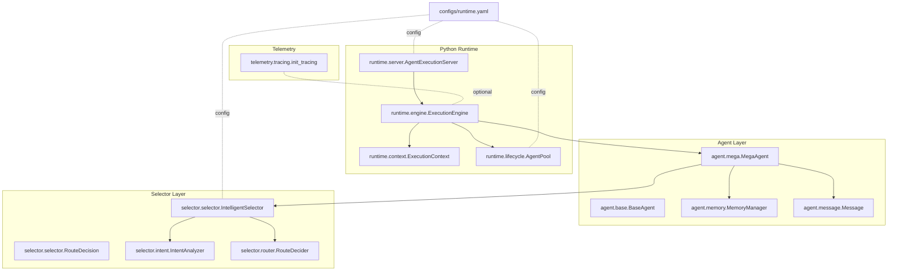
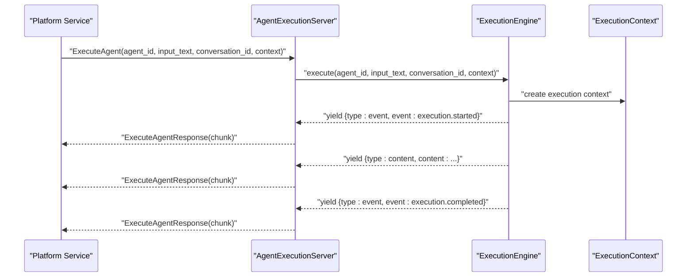
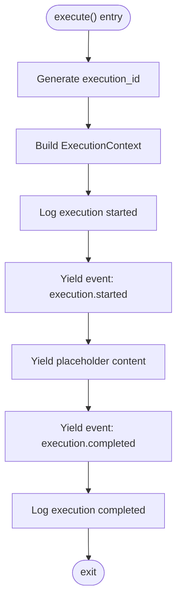
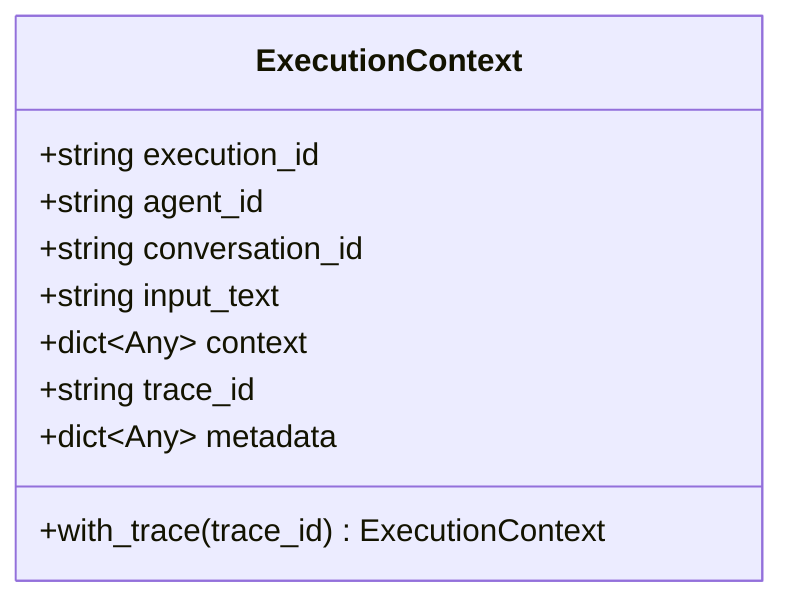
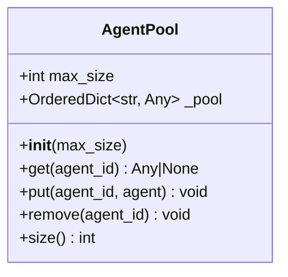
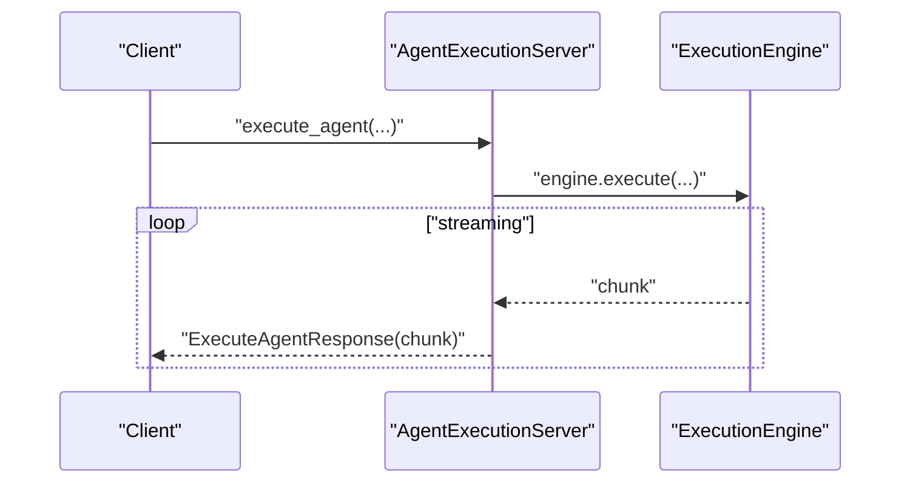
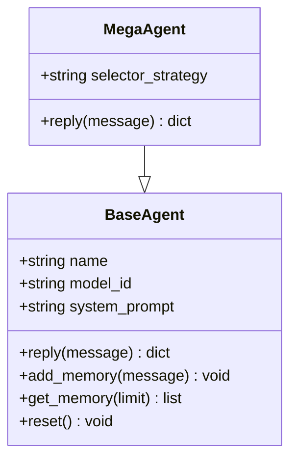
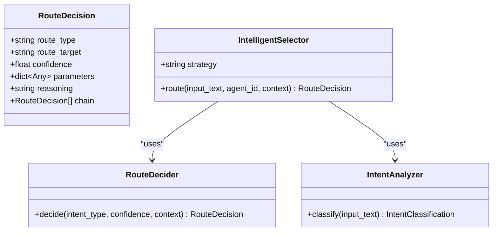
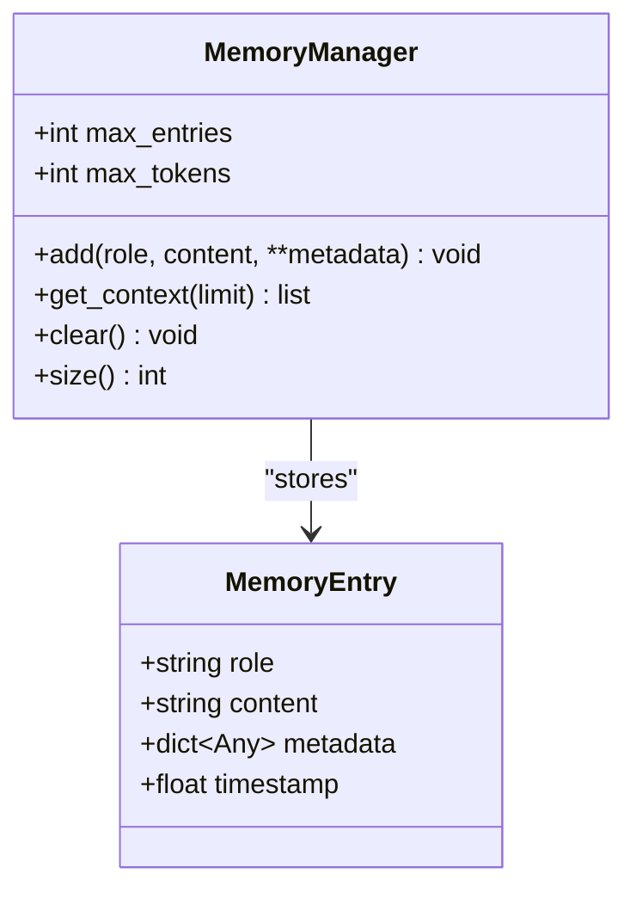
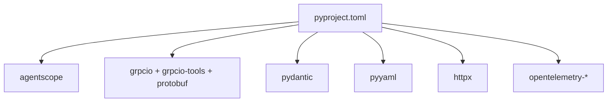

# Runtime Engine

<cite>
**Referenced Files in This Document**
- [engine.py](file://python/src/resolvenet/runtime/engine.py)
- [context.py](file://python/src/resolvenet/runtime/context.py)
- [lifecycle.py](file://python/src/resolvenet/runtime/lifecycle.py)
- [server.py](file://python/src/resolvenet/runtime/server.py)
- [base.py](file://python/src/resolvenet/agent/base.py)
- [mega.py](file://python/src/resolvenet/agent/mega.py)
- [memory.py](file://python/src/resolvenet/agent/memory.py)
- [message.py](file://python/src/resolvenet/agent/message.py)
- [selector.py](file://python/src/resolvenet/selector/selector.py)
- [router.py](file://python/src/resolvenet/selector/router.py)
- [intent.py](file://python/src/resolvenet/selector/intent.py)
- [tracing.py](file://python/src/resolvenet/telemetry/tracing.py)
- [runtime.yaml](file://configs/runtime.yaml)
- [pyproject.toml](file://python/pyproject.toml)
</cite>

## Table of Contents
1. [Introduction](#introduction)
2. [Project Structure](#project-structure)
3. [Core Components](#core-components)
4. [Architecture Overview](#architecture-overview)
5. [Detailed Component Analysis](#detailed-component-analysis)
6. [Dependency Analysis](#dependency-analysis)
7. [Performance Considerations](#performance-considerations)
8. [Troubleshooting Guide](#troubleshooting-guide)
9. [Conclusion](#conclusion)
10. [Appendices](#appendices)

## Introduction
This document describes the Python runtime engine that orchestrates agent execution and integrates with the AgentScope ecosystem. It covers the execution engine architecture, agent lifecycle management, context handling, execution coordination across subsystems (FTA, Skills, RAG), the gRPC server implementation for platform integration, and the context management system that maintains conversation history, execution metadata, and state persistence. It also documents lifecycle hooks, integration patterns, extensibility points, and debugging techniques.

## Project Structure
The runtime engine resides under the Python package and coordinates with agent abstractions, selector logic, and telemetry. The configuration file defines runtime defaults for server binding, agent pooling, selector behavior, and telemetry toggles.

**Diagram sources**
- [engine.py:14-89](file://python/src/resolvenet/runtime/engine.py#L14-L89)
- [context.py:9-35](file://python/src/resolvenet/runtime/context.py#L9-L35)
- [lifecycle.py:12-52](file://python/src/resolvenet/runtime/lifecycle.py#L12-L52)
- [server.py:11-61](file://python/src/resolvenet/runtime/server.py#L11-L61)
- [base.py:11-62](file://python/src/resolvenet/agent/base.py#L11-L62)
- [mega.py:13-74](file://python/src/resolvenet/agent/mega.py#L13-L74)
- [memory.py:19-52](file://python/src/resolvenet/agent/memory.py#L19-L52)
- [message.py:20-51](file://python/src/resolvenet/agent/message.py#L20-L51)
- [selector.py:24-100](file://python/src/resolvenet/selector/selector.py#L24-L100)
- [router.py:10-40](file://python/src/resolvenet/selector/router.py#L10-L40)
- [intent.py:17-39](file://python/src/resolvenet/selector/intent.py#L17-L39)
- [tracing.py:10-26](file://python/src/resolvenet/telemetry/tracing.py#L10-L26)
- [runtime.yaml:1-18](file://configs/runtime.yaml#L1-L18)

**Section sources**
- [engine.py:14-89](file://python/src/resolvenet/runtime/engine.py#L14-L89)
- [context.py:9-35](file://python/src/resolvenet/runtime/context.py#L9-L35)
- [lifecycle.py:12-52](file://python/src/resolvenet/runtime/lifecycle.py#L12-L52)
- [server.py:11-61](file://python/src/resolvenet/runtime/server.py#L11-L61)
- [runtime.yaml:1-18](file://configs/runtime.yaml#L1-L18)

## Core Components
- ExecutionEngine: Orchestrates a single agent execution, creates an execution context, emits lifecycle events, and streams results. It currently yields placeholder content and events while the agent loading, selector invocation, and subsystem execution are pending implementation.
- ExecutionContext: Immutable-like data container holding execution identifiers, conversation context, input text, optional additional context, trace ID, and mutable metadata.
- AgentPool: Manages agent instances with LRU eviction semantics and exposes get/put/remove operations.
- AgentExecutionServer: gRPC server facade that starts/stops the server and delegates ExecuteAgent requests to the execution engine.
- BaseAgent/MegaAgent: Agent abstractions that integrate with AgentScope and expose reply, memory, and reset capabilities. The MegaAgent integrates the Intelligent Selector for routing decisions.
- Selector stack: IntelligentSelector composes IntentAnalyzer and RouteDecider with pluggable strategies (LLM, rule, hybrid) to produce RouteDecision outcomes.
- Telemetry: Optional OpenTelemetry tracing initialization hook.

**Section sources**
- [engine.py:14-89](file://python/src/resolvenet/runtime/engine.py#L14-L89)
- [context.py:9-35](file://python/src/resolvenet/runtime/context.py#L9-L35)
- [lifecycle.py:12-52](file://python/src/resolvenet/runtime/lifecycle.py#L12-L52)
- [server.py:11-61](file://python/src/resolvenet/runtime/server.py#L11-L61)
- [base.py:11-62](file://python/src/resolvenet/agent/base.py#L11-L62)
- [mega.py:13-74](file://python/src/resolvenet/agent/mega.py#L13-L74)
- [selector.py:24-100](file://python/src/resolvenet/selector/selector.py#L24-L100)
- [router.py:10-40](file://python/src/resolvenet/selector/router.py#L10-L40)
- [intent.py:17-39](file://python/src/resolvenet/selector/intent.py#L17-L39)
- [tracing.py:10-26](file://python/src/resolvenet/telemetry/tracing.py#L10-L26)

## Architecture Overview
The runtime engine is designed around asynchronous execution and streaming responses. The server accepts ExecuteAgent requests, constructs an execution context, and delegates to the execution engine. The engine emits structured events and content chunks, and the server translates them into ExecuteAgentResponse chunks for the platform.

**Diagram sources**
- [server.py:38-60](file://python/src/resolvenet/runtime/server.py#L38-L60)
- [engine.py:25-89](file://python/src/resolvenet/runtime/engine.py#L25-L89)
- [context.py:9-35](file://python/src/resolvenet/runtime/context.py#L9-L35)

## Detailed Component Analysis

### Execution Engine
Responsibilities:
- Create an execution context with unique identifiers and conversation continuity.
- Emit lifecycle events before and after execution.
- Stream content chunks and structured events to the caller.
- Coordinate agent loading, selector invocation, and subsystem execution (pending implementation).

Key behaviors:
- Asynchronous iterator yielding structured chunks with "type" and payload keys.
- Uses UUIDs for execution and conversation IDs when not provided.
- Logs execution start and completion with contextual metadata.

**Diagram sources**
- [engine.py:25-89](file://python/src/resolvenet/runtime/engine.py#L25-L89)
- [context.py:9-35](file://python/src/resolvenet/runtime/context.py#L9-L35)

**Section sources**
- [engine.py:14-89](file://python/src/resolvenet/runtime/engine.py#L14-L89)

### Context Management
ExecutionContext encapsulates:
- Identifiers: execution_id, agent_id, conversation_id, input_text.
- Context: arbitrary additional context dictionary.
- Observability: optional trace_id.
- Metadata: mutable dictionary for accumulating execution metadata.

Methods:
- with_trace: returns a copy of the context with a new trace_id.

Usage:
- Passed into the execution engine to maintain continuity across steps.
- Used to correlate logs and telemetry.

**Diagram sources**
- [context.py:9-35](file://python/src/resolvenet/runtime/context.py#L9-L35)

**Section sources**
- [context.py:9-35](file://python/src/resolvenet/runtime/context.py#L9-L35)

### Agent Lifecycle Management
AgentPool:
- Maintains an ordered cache of agents with LRU eviction.
- Provides get/put/remove operations and exposes current size.
- Logs evictions when capacity is exceeded.

**Diagram sources**
- [lifecycle.py:12-52](file://python/src/resolvenet/runtime/lifecycle.py#L12-L52)

Lifecycle hooks:
- Initialization: AgentPool construction sets capacity and internal storage.
- Execution phase: get/put are used to lazily instantiate and cache agents.
- Cleanup: Evicted agents are logged; future enhancements can call cleanup on evicted instances.

**Section sources**
- [lifecycle.py:12-52](file://python/src/resolvenet/runtime/lifecycle.py#L12-L52)

### gRPC Server Implementation
AgentExecutionServer:
- Hosts and ports are configurable via constructor.
- start(): Initializes and starts the gRPC server (placeholder).
- stop(): Gracefully shuts down the server (placeholder).
- execute_agent(): Delegates to ExecutionEngine and streams responses.

Integration pattern:
- The server acts as a bridge between platform services and the Python runtime.
- Responses are streamed back to the platform as ExecuteAgentResponse chunks.

**Diagram sources**
- [server.py:18-60](file://python/src/resolvenet/runtime/server.py#L18-L60)
- [engine.py:25-89](file://python/src/resolvenet/runtime/engine.py#L25-L89)

**Section sources**
- [server.py:11-61](file://python/src/resolvenet/runtime/server.py#L11-L61)

### Agent Abstractions and Routing
BaseAgent:
- Provides reply(message) for processing input and generating assistant replies.
- Manages short-term memory with add/get/clear/reset.
- Integrates with AgentScope in production.

MegaAgent:
- Extends BaseAgent and owns the Intelligent Selector.
- Performs routing decisions and returns metadata about the chosen route.

**Diagram sources**
- [base.py:11-62](file://python/src/resolvenet/agent/base.py#L11-L62)
- [mega.py:13-74](file://python/src/resolvenet/agent/mega.py#L13-L74)

Selector stack:
- IntelligentSelector: Chooses among LLM, rule, or hybrid strategies to produce RouteDecision.
- RouteDecision: Carries route_type, route_target, confidence, parameters, reasoning, and chain.
- IntentAnalyzer: Classifies intent and confidence.
- RouteDecider: Finalizes routing decision.

**Diagram sources**
- [selector.py:13-100](file://python/src/resolvenet/selector/selector.py#L13-L100)
- [router.py:10-40](file://python/src/resolvenet/selector/router.py#L10-L40)
- [intent.py:8-39](file://python/src/resolvenet/selector/intent.py#L8-L39)

**Section sources**
- [base.py:11-62](file://python/src/resolvenet/agent/base.py#L11-L62)
- [mega.py:13-74](file://python/src/resolvenet/agent/mega.py#L13-L74)
- [selector.py:24-100](file://python/src/resolvenet/selector/selector.py#L24-L100)
- [router.py:10-40](file://python/src/resolvenet/selector/router.py#L10-L40)
- [intent.py:17-39](file://python/src/resolvenet/selector/intent.py#L17-L39)

### Memory and Message Types
MemoryManager:
- Stores MemoryEntry items with role, content, metadata, and timestamp.
- Enforces a maximum number of entries and supports context retrieval for LLM calls.

Message types:
- Message: Role-based messages with optional name and metadata.
- ToolCall and ToolResult: Structured tool invocation and results.

**Diagram sources**
- [memory.py:9-52](file://python/src/resolvenet/agent/memory.py#L9-L52)
- [message.py:20-51](file://python/src/resolvenet/agent/message.py#L20-L51)

**Section sources**
- [memory.py:19-52](file://python/src/resolvenet/agent/memory.py#L19-L52)
- [message.py:11-51](file://python/src/resolvenet/agent/message.py#L11-L51)

### Telemetry Integration
Optional OpenTelemetry tracing can be initialized with a service name and endpoint. This enables distributed tracing across the runtime and platform boundaries.

**Section sources**
- [tracing.py:10-26](file://python/src/resolvenet/telemetry/tracing.py#L10-L26)

## Dependency Analysis
External dependencies relevant to the runtime engine include AgentScope, gRPC, protobuf, pydantic, YAML, HTTP client, and OpenTelemetry SDKs. These enable agent integration, RPC communication, data modeling, configuration, HTTP operations, and observability.

**Diagram sources**
- [pyproject.toml:19-29](file://python/pyproject.toml#L19-L29)

**Section sources**
- [pyproject.toml:19-29](file://python/pyproject.toml#L19-L29)

## Performance Considerations
- Streaming responses: The engine yields content and events incrementally to reduce latency and memory overhead.
- LRU caching: AgentPool prevents unbounded memory growth by evicting least recently used agents.
- Configurable thresholds: Selector confidence thresholds and telemetry toggles allow tuning for production workloads.
- Async-first design: Asynchronous execution enables concurrency and efficient I/O handling.

[No sources needed since this section provides general guidance]

## Troubleshooting Guide
Common issues and debugging techniques:
- Execution hangs or missing events: Verify that the engine yields "execution.started" and "execution.completed" events and that the server streams chunks to the platform.
- Missing conversation continuity: Ensure conversation_id is preserved across requests and that ExecutionContext is constructed with the provided value.
- Agent pool evictions: Monitor logs for evicted agent IDs and consider increasing max_size or adjusting selector strategy to reduce churn.
- Selector ambiguity: Adjust selector strategy (LLM/rule/hybrid) and confidence thresholds to improve routing accuracy.
- Telemetry gaps: Confirm tracing initialization is called and the endpoint is reachable.

**Section sources**
- [engine.py:52-88](file://python/src/resolvenet/runtime/engine.py#L52-L88)
- [lifecycle.py:38-40](file://python/src/resolvenet/runtime/lifecycle.py#L38-L40)
- [runtime.yaml:7-17](file://configs/runtime.yaml#L7-L17)

## Conclusion
The runtime engine provides a modular, extensible foundation for orchestrating agent execution, managing contexts, and coordinating routing decisions. While several subsystems are placeholders for production integration, the architecture supports incremental development with clear extension points for agent loading, selector strategies, and subsystem execution.

[No sources needed since this section summarizes without analyzing specific files]

## Appendices

### Configuration Reference
- server.host/port: Network binding for the gRPC server.
- agent_pool.max_size: Maximum number of cached agents.
- selector.default_strategy/confidence_threshold: Routing strategy and confidence threshold.
- telemetry.enabled/service_name: Telemetry toggle and service name.

**Section sources**
- [runtime.yaml:3-17](file://configs/runtime.yaml#L3-L17)

### Integration Patterns
- Custom selector strategies: Extend the selector stack with new strategies and register them in IntelligentSelector.
- Custom agent types: Subclass BaseAgent to add domain-specific capabilities and integrate with AgentScope.
- Custom lifecycle extensions: Add cleanup routines in AgentPool.put when eviction occurs.
- Debugging runtime operations: Enable telemetry, inspect ExecutionContext metadata, and verify event ordering in the engine.

**Section sources**
- [selector.py:35-41](file://python/src/resolvenet/selector/selector.py#L35-L41)
- [base.py:20-33](file://python/src/resolvenet/agent/base.py#L20-L33)
- [lifecycle.py:37-42](file://python/src/resolvenet/runtime/lifecycle.py#L37-L42)
- [tracing.py:10-26](file://python/src/resolvenet/telemetry/tracing.py#L10-L26)