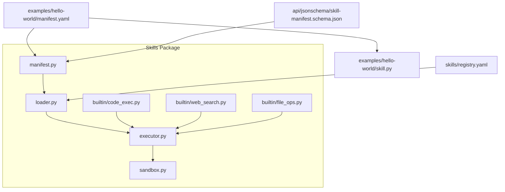
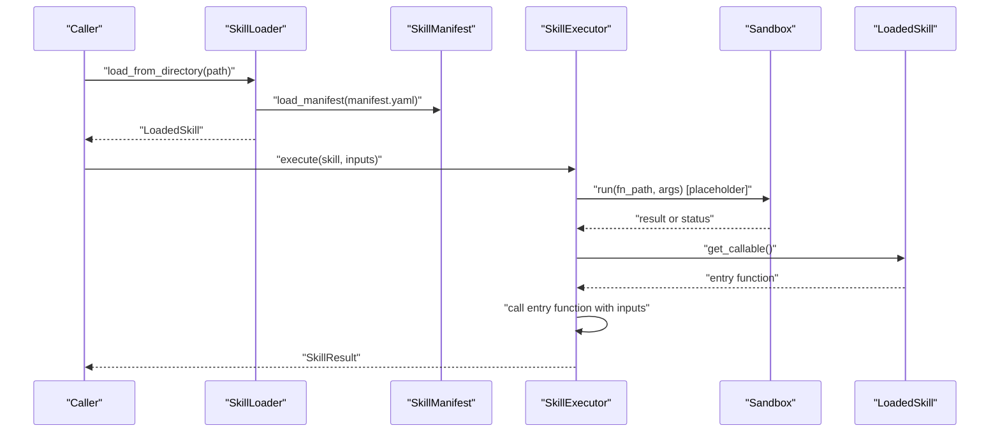
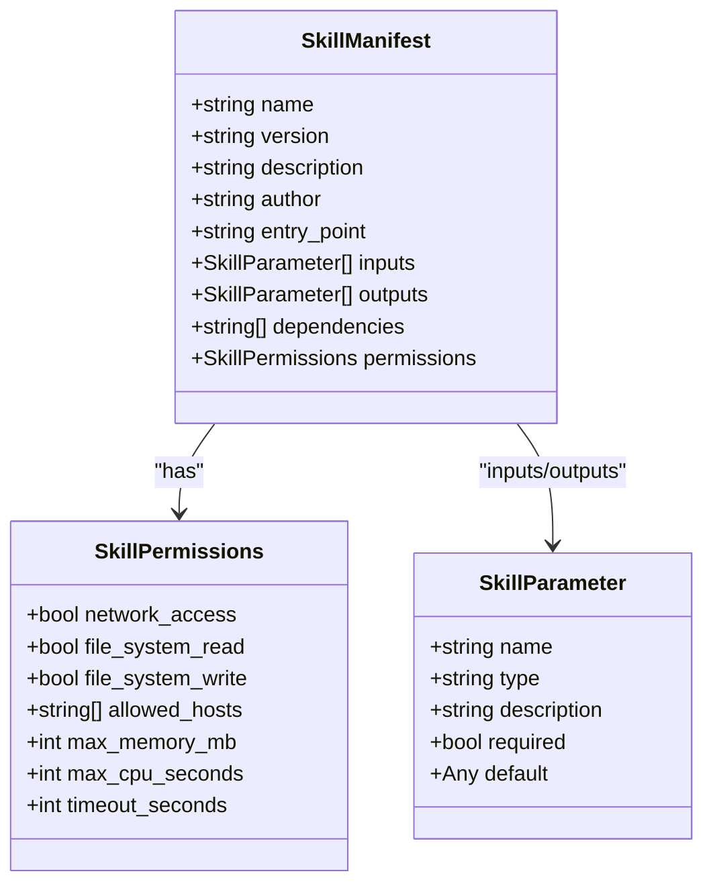
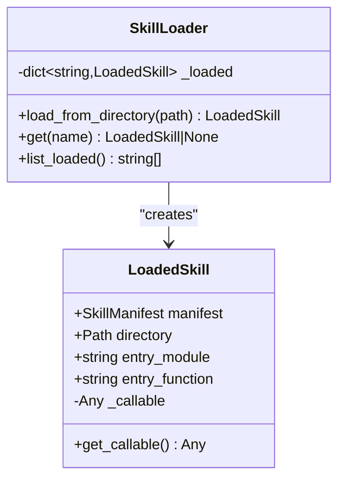
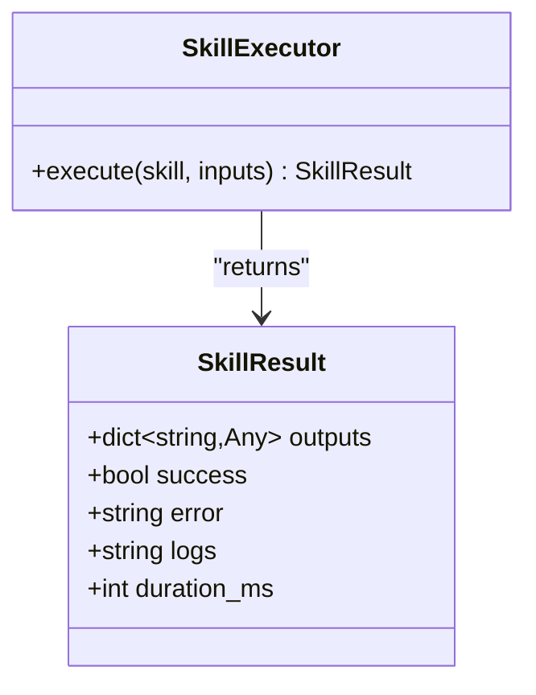
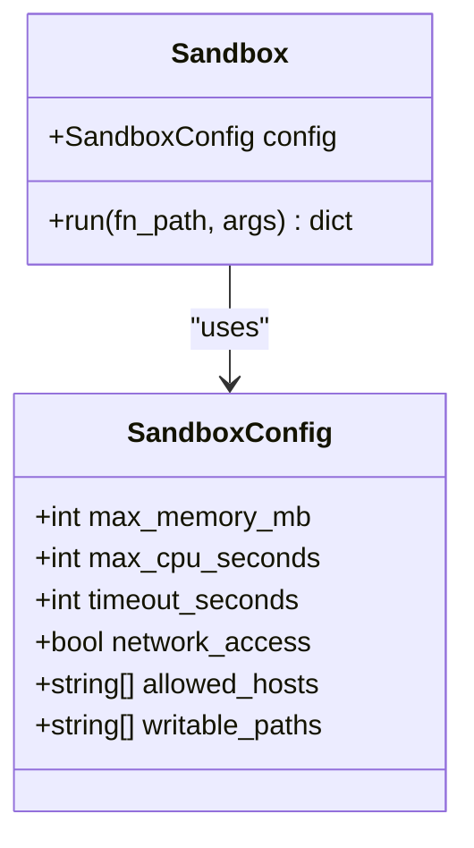
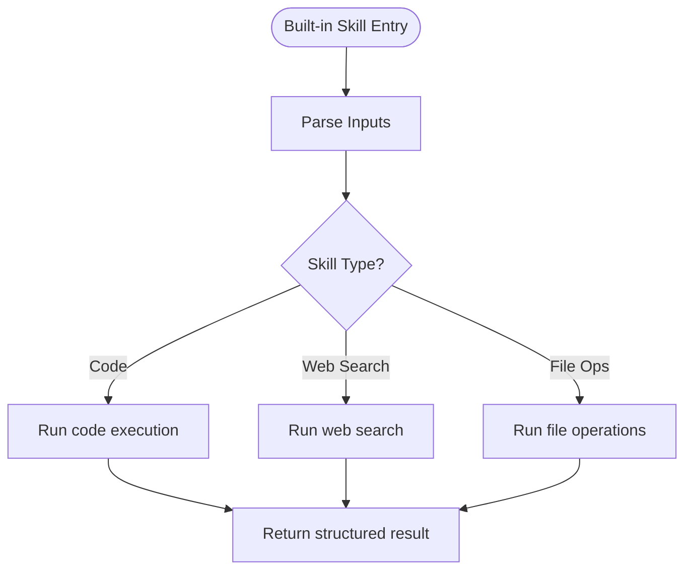
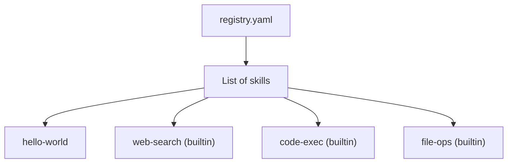
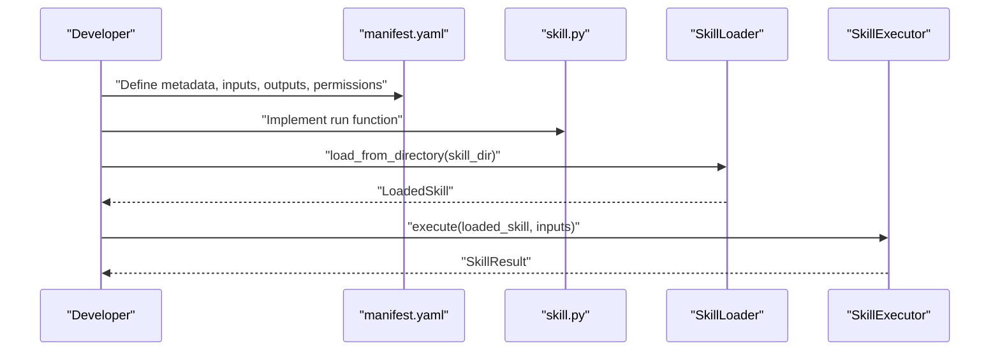
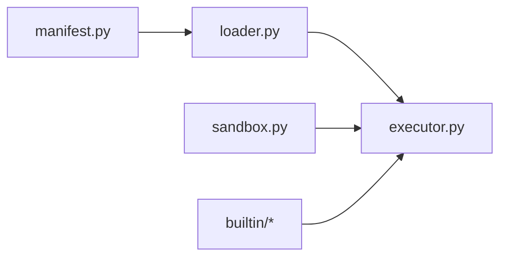

# Agent Skill System

<cite>
**Referenced Files in This Document**
- [manifest.py](file://python/src/resolvenet/skills/manifest.py)
- [loader.py](file://python/src/resolvenet/skills/loader.py)
- [executor.py](file://python/src/resolvenet/skills/executor.py)
- [sandbox.py](file://python/src/resolvenet/skills/sandbox.py)
- [code_exec.py](file://python/src/resolvenet/skills/builtin/code_exec.py)
- [web_search.py](file://python/src/resolvenet/skills/builtin/web_search.py)
- [file_ops.py](file://python/src/resolvenet/skills/builtin/file_ops.py)
- [registry.yaml](file://skills/registry.yaml)
- [manifest.yaml](file://skills/examples/hello-world/manifest.yaml)
- [skill.py](file://skills/examples/hello-world/skill.py)
- [skill-example.yaml](file://configs/examples/skill-example.yaml)
- [skill-manifest.schema.json](file://api/jsonschema/skill-manifest.schema.json)
- [__init__.py](file://python/src/resolvenet/skills/__init__.py)
</cite>

## Table of Contents
1. [Introduction](#introduction)
2. [Project Structure](#project-structure)
3. [Core Components](#core-components)
4. [Architecture Overview](#architecture-overview)
5. [Detailed Component Analysis](#detailed-component-analysis)
6. [Dependency Analysis](#dependency-analysis)
7. [Performance Considerations](#performance-considerations)
8. [Troubleshooting Guide](#troubleshooting-guide)
9. [Conclusion](#conclusion)
10. [Appendices](#appendices)

## Introduction
The Agent Skill System provides a plugin-based extensibility framework for agents. It centers on a manifest-based configuration that defines skill metadata, parameters, dependencies, and permissions. A loader discovers and validates skills from local directories and a community registry, while an executor orchestrates safe, controlled execution with resource limits and timeouts. Built-in skills demonstrate capabilities for code execution, web search, and file operations, with explicit placeholders for sandboxing and permission enforcement. This document explains the system’s design, implementation, and operational guidance.

## Project Structure
The skill system spans Python modules under the skills package, example skills, and configuration assets:
- Manifest parsing and validation
- Discovery and loading from local directories and registry
- Execution orchestration and result modeling
- Sandbox abstraction for isolation
- Built-in skills with placeholder implementations
- Example manifests and configurations
- JSON Schema for manifest validation

**Diagram sources**
- [manifest.py:1-59](file://python/src/resolvenet/skills/manifest.py#L1-L59)
- [loader.py:1-90](file://python/src/resolvenet/skills/loader.py#L1-L90)
- [executor.py:1-85](file://python/src/resolvenet/skills/executor.py#L1-L85)
- [sandbox.py:1-56](file://python/src/resolvenet/skills/sandbox.py#L1-L56)
- [code_exec.py:1-25](file://python/src/resolvenet/skills/builtin/code_exec.py#L1-L25)
- [web_search.py:1-25](file://python/src/resolvenet/skills/builtin/web_search.py#L1-L25)
- [file_ops.py:1-26](file://python/src/resolvenet/skills/builtin/file_ops.py#L1-L26)
- [manifest.yaml:1-21](file://skills/examples/hello-world/manifest.yaml#L1-L21)
- [skill.py:1-14](file://skills/examples/hello-world/skill.py#L1-L14)
- [registry.yaml:1-24](file://skills/registry.yaml#L1-L24)
- [skill-manifest.schema.json:1-74](file://api/jsonschema/skill-manifest.schema.json#L1-L74)

**Section sources**
- [__init__.py:1-2](file://python/src/resolvenet/skills/__init__.py#L1-L2)
- [manifest.py:1-59](file://python/src/resolvenet/skills/manifest.py#L1-L59)
- [loader.py:1-90](file://python/src/resolvenet/skills/loader.py#L1-L90)
- [executor.py:1-85](file://python/src/resolvenet/skills/executor.py#L1-L85)
- [sandbox.py:1-56](file://python/src/resolvenet/skills/sandbox.py#L1-L56)
- [code_exec.py:1-25](file://python/src/resolvenet/skills/builtin/code_exec.py#L1-L25)
- [web_search.py:1-25](file://python/src/resolvenet/skills/builtin/web_search.py#L1-L25)
- [file_ops.py:1-26](file://python/src/resolvenet/skills/builtin/file_ops.py#L1-L26)
- [manifest.yaml:1-21](file://skills/examples/hello-world/manifest.yaml#L1-L21)
- [skill.py:1-14](file://skills/examples/hello-world/skill.py#L1-L14)
- [registry.yaml:1-24](file://skills/registry.yaml#L1-L24)
- [skill-manifest.schema.json:1-74](file://api/jsonschema/skill-manifest.schema.json#L1-L74)

## Core Components
- Manifest and Permissions: Defines skill identity, entry point, inputs/outputs, dependencies, and permissions with defaults for resource caps and timeouts.
- Loader: Discovers skills from local directories, parses manifests, and prepares callable entry points.
- Executor: Validates inputs, executes skills, captures timing and errors, and returns structured results.
- Sandbox: Abstraction for isolating execution with resource limits, network/file restrictions, and timeouts.
- Built-in Skills: Demonstrations for code execution, web search, and file operations with placeholder implementations awaiting sandboxing.

**Section sources**
- [manifest.py:11-59](file://python/src/resolvenet/skills/manifest.py#L11-L59)
- [loader.py:15-90](file://python/src/resolvenet/skills/loader.py#L15-L90)
- [executor.py:14-85](file://python/src/resolvenet/skills/executor.py#L14-L85)
- [sandbox.py:11-56](file://python/src/resolvenet/skills/sandbox.py#L11-L56)
- [code_exec.py:8-25](file://python/src/resolvenet/skills/builtin/code_exec.py#L8-L25)
- [web_search.py:8-25](file://python/src/resolvenet/skills/builtin/web_search.py#L8-L25)
- [file_ops.py:8-26](file://python/src/resolvenet/skills/builtin/file_ops.py#L8-L26)

## Architecture Overview
The system follows a manifest-driven discovery pattern. The loader resolves a skill’s entry point from its manifest, imports the module lazily, and invokes the exported function. The executor wraps execution with timing and error handling. The sandbox abstraction is designed to enforce resource limits and restrict capabilities prior to invoking the callable.

**Diagram sources**
- [loader.py:27-57](file://python/src/resolvenet/skills/loader.py#L27-L57)
- [manifest.py:47-59](file://python/src/resolvenet/skills/manifest.py#L47-L59)
- [executor.py:20-66](file://python/src/resolvenet/skills/executor.py#L20-L66)
- [sandbox.py:35-55](file://python/src/resolvenet/skills/sandbox.py#L35-L55)
- [loader.py:84-89](file://python/src/resolvenet/skills/loader.py#L84-L89)

## Detailed Component Analysis

### Manifest and Permissions Model
The manifest defines:
- Identity: name, version, description, author
- Behavior: entry_point, inputs, outputs, dependencies
- Security: permissions controlling network access, file system read/write, allowed hosts, and resource/time limits

Validation is supported by a Pydantic model and a JSON Schema definition for external tooling and CI checks.

**Diagram sources**
- [manifest.py:11-59](file://python/src/resolvenet/skills/manifest.py#L11-L59)

**Section sources**
- [manifest.py:11-59](file://python/src/resolvenet/skills/manifest.py#L11-L59)
- [skill-manifest.schema.json:1-74](file://api/jsonschema/skill-manifest.schema.json#L1-L74)

### Skill Loader
The loader:
- Reads a manifest from a skill directory
- Parses the entry_point into module and function parts
- Lazily imports the module and retrieves the function
- Caches loaded skills by name for reuse

**Diagram sources**
- [loader.py:15-90](file://python/src/resolvenet/skills/loader.py#L15-L90)

**Section sources**
- [loader.py:15-90](file://python/src/resolvenet/skills/loader.py#L15-L90)

### Skill Executor
The executor:
- Measures execution time
- Invokes the skill’s callable with validated inputs
- Wraps results in a structured SkillResult
- Captures exceptions and records error messages

**Diagram sources**
- [executor.py:14-85](file://python/src/resolvenet/skills/executor.py#L14-L85)

**Section sources**
- [executor.py:14-85](file://python/src/resolvenet/skills/executor.py#L14-L85)

### Sandbox Abstraction
The sandbox provides a configuration envelope for resource and capability constraints:
- CPU/memory/timeouts
- Network access controls and allowed host lists
- File system read-only with optional writable workspace

Current implementation logs a placeholder status indicating sandboxing is pending.

**Diagram sources**
- [sandbox.py:11-56](file://python/src/resolvenet/skills/sandbox.py#L11-L56)

**Section sources**
- [sandbox.py:11-56](file://python/src/resolvenet/skills/sandbox.py#L11-L56)

### Built-in Skills
Three built-in skills demonstrate capabilities:
- Code execution: accepts code and language, returning execution metadata
- Web search: accepts query and result count, returning structured results
- File operations: accepts operation type and path, returning success metadata

All three currently return placeholder results indicating sandboxing and permission enforcement are pending.

**Diagram sources**
- [code_exec.py:8-25](file://python/src/resolvenet/skills/builtin/code_exec.py#L8-L25)
- [web_search.py:8-25](file://python/src/resolvenet/skills/builtin/web_search.py#L8-L25)
- [file_ops.py:8-26](file://python/src/resolvenet/skills/builtin/file_ops.py#L8-L26)

**Section sources**
- [code_exec.py:8-25](file://python/src/resolvenet/skills/builtin/code_exec.py#L8-L25)
- [web_search.py:8-25](file://python/src/resolvenet/skills/builtin/web_search.py#L8-L25)
- [file_ops.py:8-26](file://python/src/resolvenet/skills/builtin/file_ops.py#L8-L26)

### Community Skill Registry
The registry enumerates community skills with metadata and indicates whether a skill is built-in. It supports discovery and installation workflows.

**Diagram sources**
- [registry.yaml:1-24](file://skills/registry.yaml#L1-L24)

**Section sources**
- [registry.yaml:1-24](file://skills/registry.yaml#L1-L24)

### Example Skill Development
A minimal example demonstrates:
- A manifest with name, version, description, author, entry_point, inputs, outputs, and permissions
- A skill module exporting a run function compatible with the manifest

**Diagram sources**
- [manifest.yaml:1-21](file://skills/examples/hello-world/manifest.yaml#L1-L21)
- [skill.py:4-14](file://skills/examples/hello-world/skill.py#L4-L14)
- [loader.py:27-57](file://python/src/resolvenet/skills/loader.py#L27-L57)
- [executor.py:20-66](file://python/src/resolvenet/skills/executor.py#L20-L66)

**Section sources**
- [manifest.yaml:1-21](file://skills/examples/hello-world/manifest.yaml#L1-L21)
- [skill.py:1-14](file://skills/examples/hello-world/skill.py#L1-L14)

## Dependency Analysis
The loader depends on the manifest parser to validate and construct a manifest object. The executor depends on the loader to obtain a callable and on the sandbox abstraction for isolation. Built-in skills are invoked by the executor when configured as the entry point.

**Diagram sources**
- [manifest.py:47-59](file://python/src/resolvenet/skills/manifest.py#L47-L59)
- [loader.py:10-10](file://python/src/resolvenet/skills/loader.py#L10-L10)
- [executor.py:9-9](file://python/src/resolvenet/skills/executor.py#L9-L9)
- [sandbox.py:35-55](file://python/src/resolvenet/skills/sandbox.py#L35-L55)

**Section sources**
- [loader.py:10-10](file://python/src/resolvenet/skills/loader.py#L10-L10)
- [executor.py:9-9](file://python/src/resolvenet/skills/executor.py#L9-L9)

## Performance Considerations
- Resource limits: Configure max_memory_mb, max_cpu_seconds, and timeout_seconds in the manifest permissions to bound execution cost and prevent resource exhaustion.
- Concurrency: The executor does not currently implement concurrency control; introduce a semaphore or pool to limit concurrent executions per agent or globally.
- Monitoring: Capture duration_ms in SkillResult and emit metrics for latency, throughput, and failure rates.
- Sandboxing: Enforce resource limits and network/file restrictions in the sandbox to avoid noisy-neighbor effects.

[No sources needed since this section provides general guidance]

## Troubleshooting Guide
Common issues and remedies:
- Manifest validation failures: Ensure name, version, and entry_point conform to schema and semantic versioning. Verify inputs/outputs types and permissions.
- Import errors: Confirm entry_point module path exists and exports the named function; check Python path and package structure.
- Execution errors: Inspect SkillResult.error and logs; verify inputs match manifest schema and permissions.
- Sandbox not active: Placeholder status indicates sandboxing is not implemented; enable resource limits and isolation before production use.

**Section sources**
- [skill-manifest.schema.json:1-74](file://api/jsonschema/skill-manifest.schema.json#L1-L74)
- [loader.py:36-57](file://python/src/resolvenet/skills/loader.py#L36-L57)
- [executor.py:57-66](file://python/src/resolvenet/skills/executor.py#L57-L66)
- [sandbox.py:51-55](file://python/src/resolvenet/skills/sandbox.py#L51-L55)

## Conclusion
The Agent Skill System establishes a robust foundation for plugin-based agent capabilities through manifest-driven configuration, discovery, and execution. While the loader and executor provide the orchestration backbone, the sandbox abstraction and built-in skills indicate clear paths for secure, constrained execution. By tightening manifest validation, implementing sandboxing, and adding concurrency and monitoring, the system can evolve into a production-ready skill platform.

[No sources needed since this section summarizes without analyzing specific files]

## Appendices

### Manifest Configuration Reference
- Required fields: name, version, entry_point
- Optional fields: description, author, inputs, outputs, dependencies
- Permissions: network_access, file_system_read, file_system_write, allowed_hosts, max_memory_mb, max_cpu_seconds, timeout_seconds

**Section sources**
- [manifest.py:33-44](file://python/src/resolvenet/skills/manifest.py#L33-L44)
- [skill-manifest.schema.json:6-71](file://api/jsonschema/skill-manifest.schema.json#L6-L71)

### Example Configuration
- Example skill configuration demonstrates declaring a builtin skill, its entry point, inputs, and permissions.

**Section sources**
- [skill-example.yaml:1-23](file://configs/examples/skill-example.yaml#L1-L23)

### Security Best Practices
- Minimize permissions: Keep network_access and file_system_write disabled unless required.
- Scope allowed_hosts: Limit outbound connections to trusted domains.
- Enforce resource caps: Set conservative max_memory_mb and timeout_seconds aligned with workload characteristics.
- Isolate execution: Implement sandboxing with resource limits, restricted syscalls, and network/file policies.

[No sources needed since this section provides general guidance]