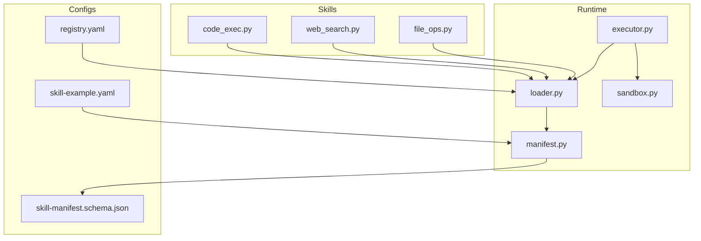
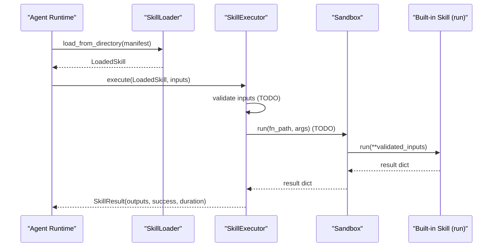
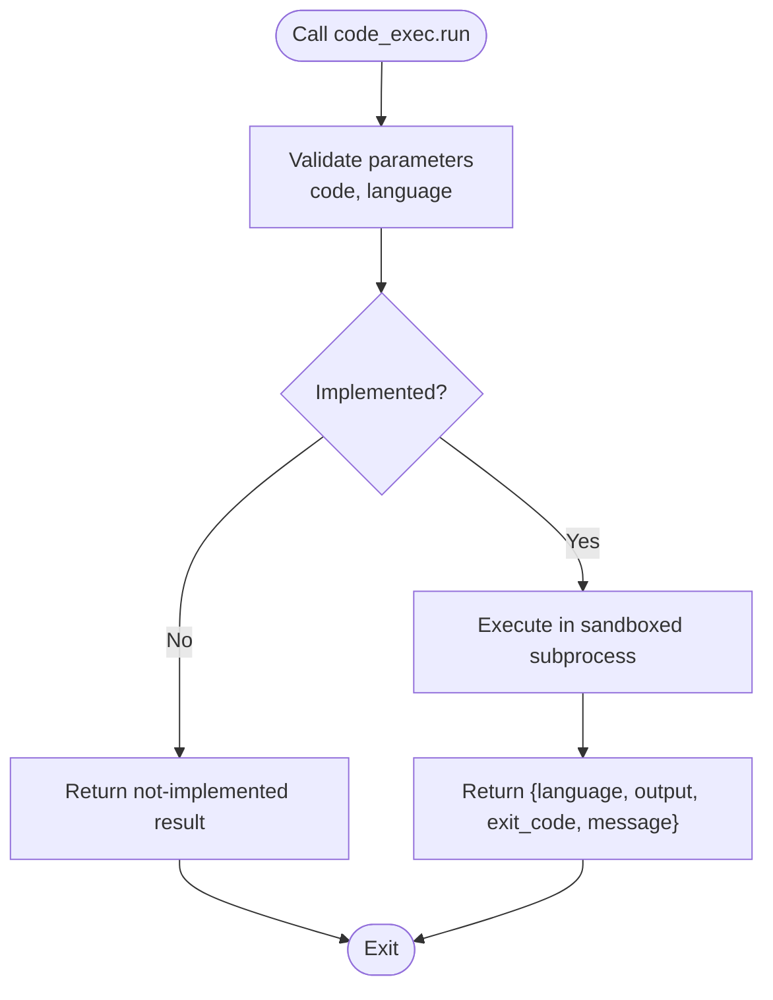
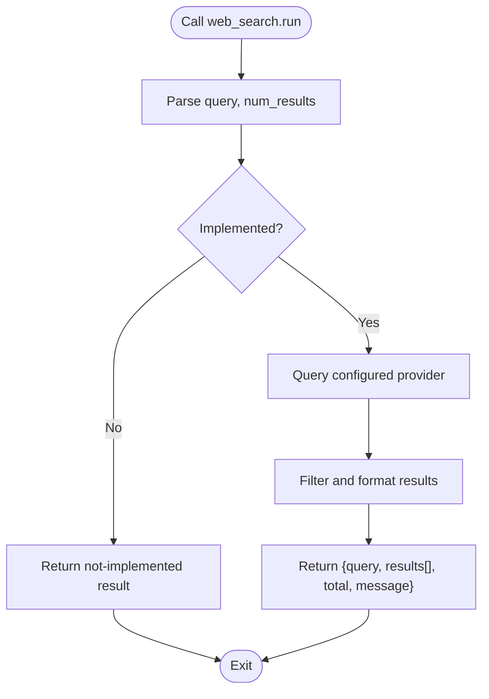
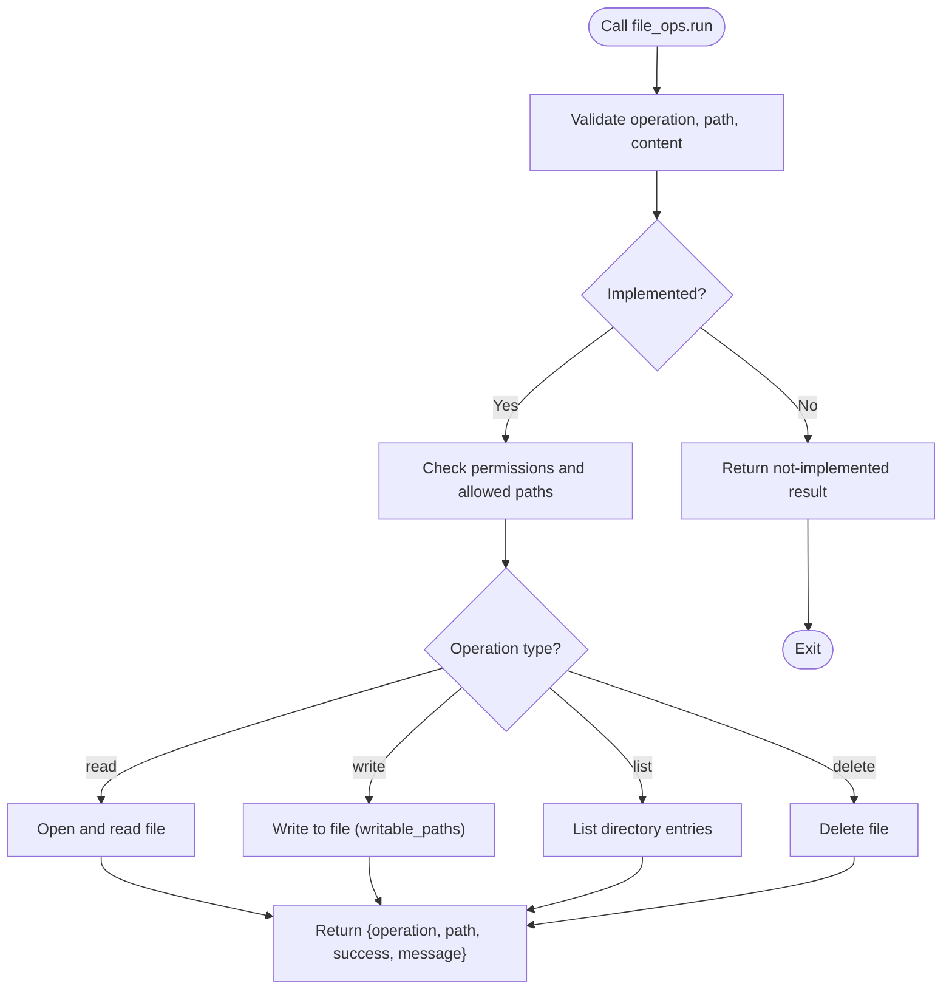
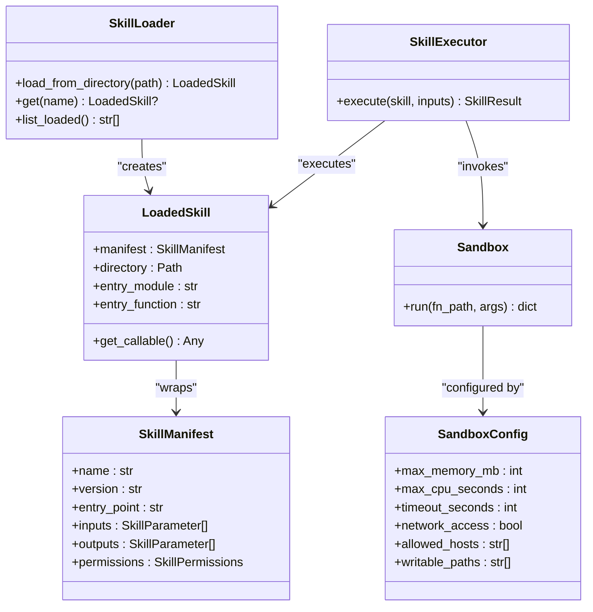

# Built-in Skills Library

<cite>
**Referenced Files in This Document**
- [code_exec.py](file://python/src/resolvenet/skills/builtin/code_exec.py)
- [web_search.py](file://python/src/resolvenet/skills/builtin/web_search.py)
- [file_ops.py](file://python/src/resolvenet/skills/builtin/file_ops.py)
- [executor.py](file://python/src/resolvenet/skills/executor.py)
- [sandbox.py](file://python/src/resolvenet/skills/sandbox.py)
- [loader.py](file://python/src/resolvenet/skills/loader.py)
- [manifest.py](file://python/src/resolvenet/skills/manifest.py)
- [skill-manifest.schema.json](file://api/jsonschema/skill-manifest.schema.json)
- [skill-example.yaml](file://configs/examples/skill-example.yaml)
- [registry.yaml](file://skills/registry.yaml)
- [web-search manifest.yaml](file://docs/demo/demo/skills/web-search/manifest.yaml)
- [hello-world manifest.yaml](file://skills/examples/hello-world/manifest.yaml)
- [workflow-fta-example.yaml](file://configs/examples/workflow-fta-example.yaml)
</cite>

## Table of Contents
1. [Introduction](#introduction)
2. [Project Structure](#project-structure)
3. [Core Components](#core-components)
4. [Architecture Overview](#architecture-overview)
5. [Detailed Component Analysis](#detailed-component-analysis)
6. [Dependency Analysis](#dependency-analysis)
7. [Performance Considerations](#performance-considerations)
8. [Troubleshooting Guide](#troubleshooting-guide)
9. [Conclusion](#conclusion)
10. [Appendices](#appendices)

## Introduction
This document describes the built-in skills library that ships with the platform. It focuses on three core capabilities:
- code_exec: Safe code execution with language support and sandboxing
- web_search: Internet research with query processing and result formatting
- file_ops: File system operations with security restrictions

It explains implementation details, security considerations, configuration options, API specifications, and usage examples. It also covers how built-in skills integrate with the skill loader, manifest system, and agent workflows.

## Project Structure
The built-in skills live under the Python package for skills and are organized by feature. They are complemented by a loader, manifest schema, and sandboxing infrastructure that enforces permissions and resource limits.

**Diagram sources**
- [code_exec.py:1-25](file://python/src/resolvenet/skills/builtin/code_exec.py#L1-L25)
- [web_search.py:1-25](file://python/src/resolvenet/skills/builtin/web_search.py#L1-L25)
- [file_ops.py:1-26](file://python/src/resolvenet/skills/builtin/file_ops.py#L1-L26)
- [loader.py:1-90](file://python/src/resolvenet/skills/loader.py#L1-L90)
- [executor.py:1-85](file://python/src/resolvenet/skills/executor.py#L1-L85)
- [sandbox.py:1-56](file://python/src/resolvenet/skills/sandbox.py#L1-L56)
- [manifest.py:1-59](file://python/src/resolvenet/skills/manifest.py#L1-L59)
- [skill-manifest.schema.json:1-74](file://api/jsonschema/skill-manifest.schema.json#L1-L74)
- [skill-example.yaml:1-23](file://configs/examples/skill-example.yaml#L1-L23)
- [registry.yaml:1-24](file://skills/registry.yaml#L1-L24)

**Section sources**
- [code_exec.py:1-25](file://python/src/resolvenet/skills/builtin/code_exec.py#L1-L25)
- [web_search.py:1-25](file://python/src/resolvenet/skills/builtin/web_search.py#L1-L25)
- [file_ops.py:1-26](file://python/src/resolvenet/skills/builtin/file_ops.py#L1-L26)
- [loader.py:1-90](file://python/src/resolvenet/skills/loader.py#L1-L90)
- [manifest.py:1-59](file://python/src/resolvenet/skills/manifest.py#L1-L59)
- [executor.py:1-85](file://python/src/resolvenet/skills/executor.py#L1-L85)
- [sandbox.py:1-56](file://python/src/resolvenet/skills/sandbox.py#L1-L56)
- [skill-manifest.schema.json:1-74](file://api/jsonschema/skill-manifest.schema.json#L1-L74)
- [skill-example.yaml:1-23](file://configs/examples/skill-example.yaml#L1-L23)
- [registry.yaml:1-24](file://skills/registry.yaml#L1-L24)

## Core Components
- code_exec: Provides a placeholder run function with typed parameters for code and language. Currently returns a not-implemented status and is intended to be backed by a sandboxed executor.
- web_search: Provides a placeholder run function with query and result count parameters. Returns a not-implemented status and is intended to be backed by a configurable search provider.
- file_ops: Provides a placeholder run function supporting read, write, list, and delete operations with path and optional content. Returns a not-implemented status pending permission enforcement.

These skills share a common pattern: they expose a run function with documented parameters and return a dictionary result. They are designed to be loaded via the skill loader and executed by the executor with sandboxing.

**Section sources**
- [code_exec.py:8-24](file://python/src/resolvenet/skills/builtin/code_exec.py#L8-L24)
- [web_search.py:8-24](file://python/src/resolvenet/skills/builtin/web_search.py#L8-L24)
- [file_ops.py:8-25](file://python/src/resolvenet/skills/builtin/file_ops.py#L8-L25)

## Architecture Overview
The runtime composes skills through a manifest-driven loader, validates inputs, executes in a sandboxed environment, and returns structured results.

**Diagram sources**
- [loader.py:27-57](file://python/src/resolvenet/skills/loader.py#L27-L57)
- [executor.py:20-66](file://python/src/resolvenet/skills/executor.py#L20-L66)
- [sandbox.py:35-55](file://python/src/resolvenet/skills/sandbox.py#L35-L55)
- [code_exec.py:8-24](file://python/src/resolvenet/skills/builtin/code_exec.py#L8-L24)
- [web_search.py:8-24](file://python/src/resolvenet/skills/builtin/web_search.py#L8-L24)
- [file_ops.py:8-25](file://python/src/resolvenet/skills/builtin/file_ops.py#L8-L25)

## Detailed Component Analysis

### code_exec
- Purpose: Execute code in a sandboxed environment with language support.
- Parameters:
  - code: string, required
  - language: string, optional, default depends on implementation
- Expected outputs:
  - language: string
  - output: string
  - exit_code: integer
  - message: string
- Current state: Placeholder implementation returns not-implemented status.
- Security considerations:
  - Requires a sandbox with CPU/memory/time limits, disabled network, and restricted filesystem.
  - Should enforce allowed languages and sanitize inputs.
- Configuration options:
  - Permissions: network_access, file_system_read, file_system_write, allowed_hosts, timeout_seconds, max_memory_mb, max_cpu_seconds.
  - These are declared in the skill manifest and enforced by the sandbox.
- Usage example:
  - Load via registry or manifest pointing to the built-in module entry point.
  - Invoke with code and language parameters.
- Integration:
  - Used by the executor and sandbox; ensure manifest permissions match desired restrictions.

**Diagram sources**
- [code_exec.py:8-24](file://python/src/resolvenet/skills/builtin/code_exec.py#L8-L24)
- [sandbox.py:23-55](file://python/src/resolvenet/skills/sandbox.py#L23-L55)

**Section sources**
- [code_exec.py:8-24](file://python/src/resolvenet/skills/builtin/code_exec.py#L8-L24)
- [manifest.py:11-21](file://python/src/resolvenet/skills/manifest.py#L11-L21)
- [skill-manifest.schema.json:44-71](file://api/jsonschema/skill-manifest.schema.json#L44-L71)
- [registry.yaml:15-18](file://skills/registry.yaml#L15-L18)

### web_search
- Purpose: Search the web for a given query and return formatted results.
- Parameters:
  - query: string, required
  - num_results: integer, optional, default 5
- Expected outputs:
  - query: string
  - results: array
  - total: integer
  - message: string
- Current state: Placeholder implementation returns not-implemented status.
- Security considerations:
  - Requires network access permission and allowed host restrictions.
  - Should validate and sanitize queries; limit result count and response size.
- Configuration options:
  - Permissions: network_access, allowed_hosts, timeout_seconds, max_memory_mb, max_cpu_seconds.
- Usage example:
  - Load via registry or manifest pointing to the built-in module entry point.
  - Invoke with query and optional num_results.
- Integration:
  - Used by the executor and sandbox; ensure manifest permissions allow network access.

**Diagram sources**
- [web_search.py:8-24](file://python/src/resolvenet/skills/builtin/web_search.py#L8-L24)
- [web-search manifest.yaml:34-44](file://docs/demo/demo/skills/web-search/manifest.yaml#L34-L44)

**Section sources**
- [web_search.py:8-24](file://python/src/resolvenet/skills/builtin/web_search.py#L8-L24)
- [web-search manifest.yaml:1-51](file://docs/demo/demo/skills/web-search/manifest.yaml#L1-L51)
- [skill-example.yaml:9-22](file://configs/examples/skill-example.yaml#L9-L22)
- [registry.yaml:10-13](file://skills/registry.yaml#L10-L13)

### file_ops
- Purpose: Perform file system operations with security restrictions.
- Parameters:
  - operation: string, required, one of read, write, list, delete
  - path: string, required
  - content: string, optional, for write operations
- Expected outputs:
  - operation: string
  - path: string
  - success: boolean
  - message: string
- Current state: Placeholder implementation returns not-implemented status.
- Security considerations:
  - Requires explicit file_system_read/write permissions.
  - Must restrict writable paths and prevent traversal attacks.
- Configuration options:
  - Permissions: file_system_read, file_system_write, writable_paths, timeout_seconds, max_memory_mb, max_cpu_seconds.
- Usage example:
  - Load via registry or manifest pointing to the built-in module entry point.
  - Invoke with operation, path, and optional content.
- Integration:
  - Used by the executor and sandbox; ensure manifest permissions align with intended operations.

**Diagram sources**
- [file_ops.py:8-25](file://python/src/resolvenet/skills/builtin/file_ops.py#L8-L25)
- [manifest.py:11-21](file://python/src/resolvenet/skills/manifest.py#L11-L21)

**Section sources**
- [file_ops.py:8-25](file://python/src/resolvenet/skills/builtin/file_ops.py#L8-L25)
- [manifest.py:11-21](file://python/src/resolvenet/skills/manifest.py#L11-L21)
- [registry.yaml:20-23](file://skills/registry.yaml#L20-L23)

## Dependency Analysis
The loader discovers skills from directories and constructs LoadedSkill instances. The executor orchestrates execution, while the sandbox defines resource and access constraints. The manifest schema validates skill metadata and permissions.

**Diagram sources**
- [loader.py:15-90](file://python/src/resolvenet/skills/loader.py#L15-L90)
- [executor.py:14-85](file://python/src/resolvenet/skills/executor.py#L14-L85)
- [sandbox.py:11-55](file://python/src/resolvenet/skills/sandbox.py#L11-L55)
- [manifest.py:33-59](file://python/src/resolvenet/skills/manifest.py#L33-L59)

**Section sources**
- [loader.py:15-90](file://python/src/resolvenet/skills/loader.py#L15-L90)
- [executor.py:14-85](file://python/src/resolvenet/skills/executor.py#L14-L85)
- [sandbox.py:11-55](file://python/src/resolvenet/skills/sandbox.py#L11-L55)
- [manifest.py:11-59](file://python/src/resolvenet/skills/manifest.py#L11-L59)

## Performance Considerations
- Resource limits: Enforce CPU seconds, memory MB, and wall-clock timeouts to prevent resource exhaustion.
- Network restrictions: Limit outbound connections to allow-listed hosts to reduce latency and security risk.
- File system restrictions: Mount read-only filesystems and allow only designated writable paths.
- Execution isolation: Use a subprocess per skill invocation to isolate failures and enforce limits.
- Output validation: Normalize and cap result sizes to avoid oversized payloads.

[No sources needed since this section provides general guidance]

## Troubleshooting Guide
- Not implemented results: Built-in skills currently return a not-implemented status. Implement sandboxing and provider integrations to enable full functionality.
- Permission denials: Verify manifest permissions and ensure the sandbox configuration matches declared capabilities.
- Loading errors: Confirm the manifest path and entry point format. Ensure the module is importable and the function name exists.
- Execution failures: Review SkillResult error fields and logs captured during execution.

**Section sources**
- [code_exec.py:18-24](file://python/src/resolvenet/skills/builtin/code_exec.py#L18-L24)
- [web_search.py:18-24](file://python/src/resolvenet/skills/builtin/web_search.py#L18-L24)
- [file_ops.py:19-25](file://python/src/resolvenet/skills/builtin/file_ops.py#L19-L25)
- [executor.py:57-66](file://python/src/resolvenet/skills/executor.py#L57-L66)

## Conclusion
The built-in skills library establishes a foundation for code execution, web search, and file operations. While current implementations are placeholders, the loader, manifest schema, sandbox, and executor provide a clear path to secure, configurable, and auditable skill execution. By filling in the implementation gaps and aligning manifests with security policies, teams can safely integrate these capabilities into agent workflows.

[No sources needed since this section summarizes without analyzing specific files]

## Appendices

### API Specifications and Parameter Requirements
- code_exec.run
  - Parameters: code (string, required), language (string, optional)
  - Outputs: language (string), output (string), exit_code (integer), message (string)
- web_search.run
  - Parameters: query (string, required), num_results (integer, optional)
  - Outputs: query (string), results (array), total (integer), message (string)
- file_ops.run
  - Parameters: operation (string, required), path (string, required), content (string, optional)
  - Outputs: operation (string), path (string), success (boolean), message (string)

**Section sources**
- [code_exec.py:8-24](file://python/src/resolvenet/skills/builtin/code_exec.py#L8-L24)
- [web_search.py:8-24](file://python/src/resolvenet/skills/builtin/web_search.py#L8-L24)
- [file_ops.py:8-25](file://python/src/resolvenet/skills/builtin/file_ops.py#L8-L25)

### Security Implications and Safe Usage Practices
- Permissions:
  - code_exec: Consider enabling network_access only if external APIs are required; restrict allowed_hosts; set strict timeouts and memory caps.
  - web_search: Enable network_access; define allowed_hosts for trusted providers; limit num_results; sanitize query.
  - file_ops: Enable file_system_read/write only when necessary; restrict writable_paths; prevent path traversal.
- Safe usage:
  - Always validate and constrain inputs.
  - Use the sandbox to enforce resource and network policies.
  - Log execution durations and outcomes for observability.

**Section sources**
- [manifest.py:11-21](file://python/src/resolvenet/skills/manifest.py#L11-L21)
- [skill-manifest.schema.json:60-71](file://api/jsonschema/skill-manifest.schema.json#L60-L71)
- [sandbox.py:23-55](file://python/src/resolvenet/skills/sandbox.py#L23-L55)

### Integration Examples
- Using built-in skills in workflows:
  - Reference skills by name in workflow definitions and attach parameters as needed.
  - Example workflow demonstrates combining skills with other evaluators and gates.

**Section sources**
- [workflow-fta-example.yaml:1-50](file://configs/examples/workflow-fta-example.yaml#L1-L50)