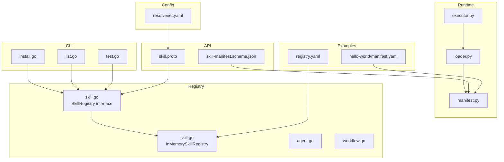
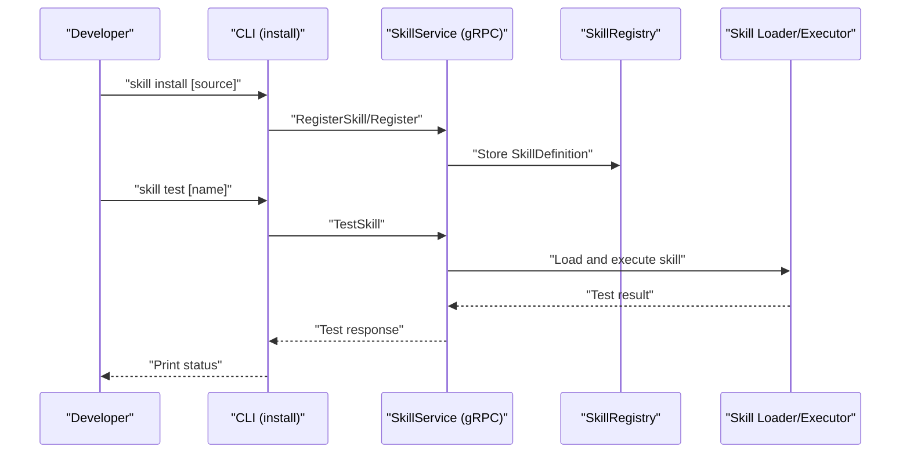
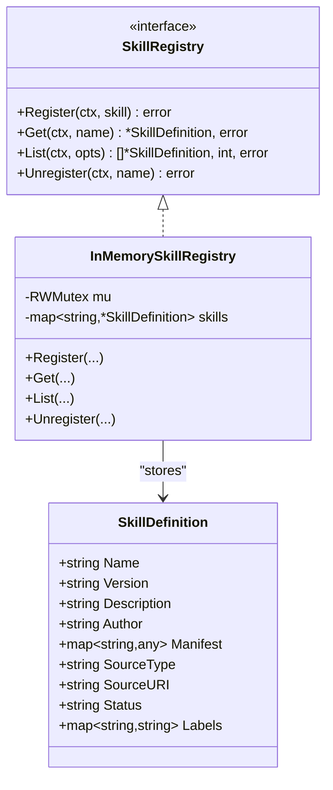
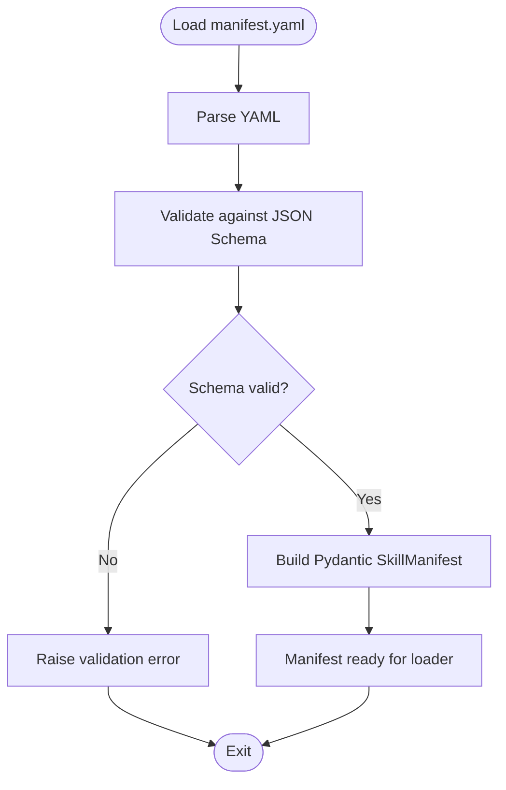
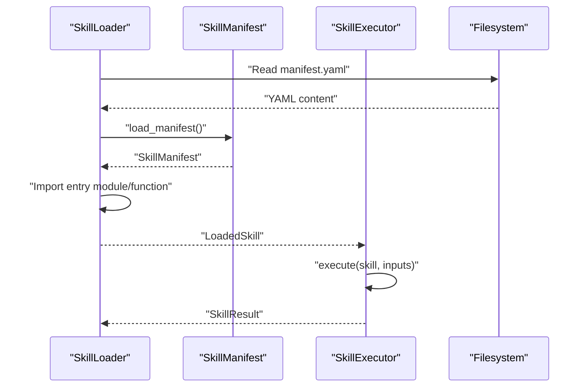
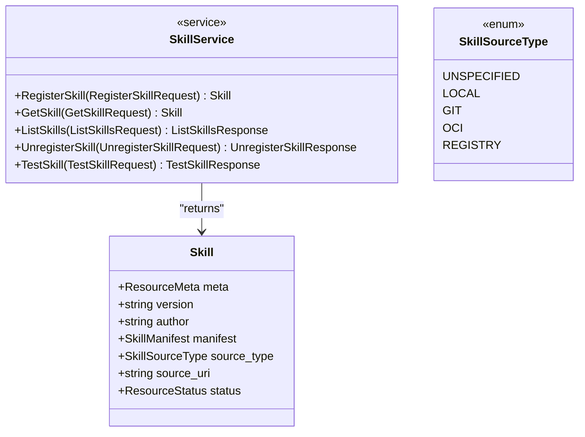
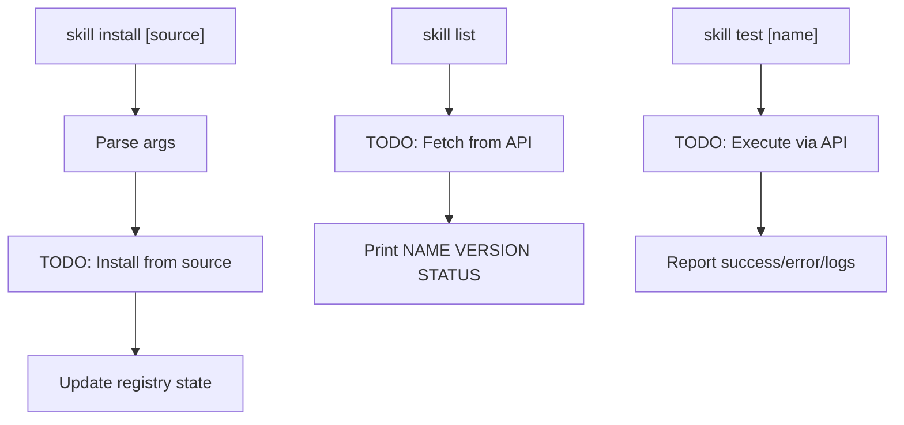
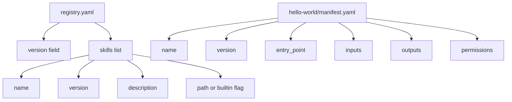
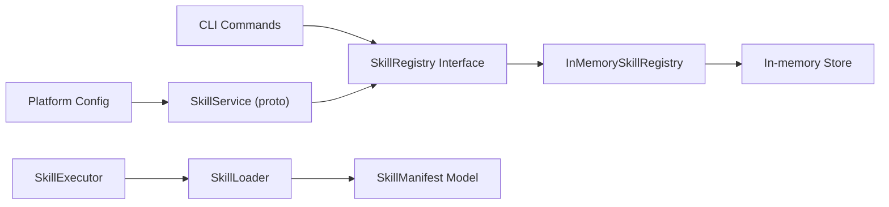

# Community Skill Registry

<cite>
**Referenced Files in This Document**
- [registry.yaml](file://skills/registry.yaml)
- [skill.go](file://pkg/registry/skill.go)
- [agent.go](file://pkg/registry/agent.go)
- [workflow.go](file://pkg/registry/workflow.go)
- [skill-manifest.schema.json](file://api/jsonschema/skill-manifest.schema.json)
- [manifest.py](file://python/src/resolvenet/skills/manifest.py)
- [loader.py](file://python/src/resolvenet/skills/loader.py)
- [executor.py](file://python/src/resolvenet/skills/executor.py)
- [skill.proto](file://api/proto/resolvenet/v1/skill.proto)
- [install.go](file://internal/cli/skill/install.go)
- [list.go](file://internal/cli/skill/list.go)
- [test.go](file://internal/cli/skill/test.go)
- [resolvenet.yaml](file://configs/resolvenet.yaml)
- [CONTRIBUTING.md](file://CONTRIBUTING.md)
- [SECURITY.md](file://SECURITY.md)
</cite>

## Table of Contents
1. [Introduction](#introduction)
2. [Project Structure](#project-structure)
3. [Core Components](#core-components)
4. [Architecture Overview](#architecture-overview)
5. [Detailed Component Analysis](#detailed-component-analysis)
6. [Dependency Analysis](#dependency-analysis)
7. [Performance Considerations](#performance-considerations)
8. [Troubleshooting Guide](#troubleshooting-guide)
9. [Conclusion](#conclusion)
10. [Appendices](#appendices)

## Introduction
This document describes the community skill registry system that powers skill sharing and distribution in the platform. It explains the registry.yaml structure, skill metadata and versioning, distribution channels, and the underlying architecture for skill submission, review, approval, discovery, and execution. It also documents contribution guidelines, quality assurance, security review processes, and best practices for developing and maintaining community skills.

## Project Structure
The registry spans several layers:
- Registry definition and in-memory storage for skills, agents, and workflows
- JSON Schema and Python Pydantic models for skill manifest validation
- Protocol Buffers defining the SkillService API contract
- CLI commands for installing, listing, and testing skills
- Example registry and skill manifests
- Platform configuration for services and runtime

**Diagram sources**
- [install.go:1-41](file://internal/cli/skill/install.go#L1-L41)
- [list.go:1-23](file://internal/cli/skill/list.go#L1-L23)
- [test.go:1-22](file://internal/cli/skill/test.go#L1-L22)
- [loader.py:1-90](file://python/src/resolvenet/skills/loader.py#L1-L90)
- [manifest.py:1-59](file://python/src/resolvenet/skills/manifest.py#L1-L59)
- [executor.py:1-85](file://python/src/resolvenet/skills/executor.py#L1-L85)
- [skill.go:1-80](file://pkg/registry/skill.go#L1-L80)
- [agent.go:1-103](file://pkg/registry/agent.go#L1-L103)
- [workflow.go:1-94](file://pkg/registry/workflow.go#L1-L94)
- [skill.proto:1-101](file://api/proto/resolvenet/v1/skill.proto#L1-L101)
- [skill-manifest.schema.json:1-74](file://api/jsonschema/skill-manifest.schema.json#L1-L74)
- [resolvenet.yaml:1-34](file://configs/resolvenet.yaml#L1-L34)
- [registry.yaml:1-24](file://skills/registry.yaml#L1-L24)
- [hello-world/manifest.yaml:1-21](file://skills/examples/hello-world/manifest.yaml#L1-L21)

**Section sources**
- [registry.yaml:1-24](file://skills/registry.yaml#L1-L24)
- [skill.go:1-80](file://pkg/registry/skill.go#L1-L80)
- [agent.go:1-103](file://pkg/registry/agent.go#L1-L103)
- [workflow.go:1-94](file://pkg/registry/workflow.go#L1-L94)
- [skill-manifest.schema.json:1-74](file://api/jsonschema/skill-manifest.schema.json#L1-L74)
- [manifest.py:1-59](file://python/src/resolvenet/skills/manifest.py#L1-L59)
- [loader.py:1-90](file://python/src/resolvenet/skills/loader.py#L1-L90)
- [executor.py:1-85](file://python/src/resolvenet/skills/executor.py#L1-L85)
- [skill.proto:1-101](file://api/proto/resolvenet/v1/skill.proto#L1-L101)
- [install.go:1-41](file://internal/cli/skill/install.go#L1-L41)
- [list.go:1-23](file://internal/cli/skill/list.go#L1-L23)
- [test.go:1-22](file://internal/cli/skill/test.go#L1-L22)
- [resolvenet.yaml:1-34](file://configs/resolvenet.yaml#L1-L34)

## Core Components
- Registry interfaces and in-memory implementations for skills, agents, and workflows
- Skill manifest schema and Python manifest model for validation and parsing
- Skill loader and executor for discovery, import, sandboxing, and execution
- SkillService gRPC API for registration, listing, retrieval, and testing
- CLI commands for installation, listing, and testing skills
- Example registry and skill manifests demonstrating structure and fields

Key capabilities:
- Define skill metadata (name, version, description, author)
- Declare entry points, inputs/outputs, dependencies, and permissions
- Support multiple distribution channels (local, git, OCI, registry)
- Provide in-memory registry for development and prototyping
- Enforce manifest validation via JSON Schema and Pydantic models

**Section sources**
- [skill.go:9-28](file://pkg/registry/skill.go#L9-L28)
- [agent.go:9-28](file://pkg/registry/agent.go#L9-L28)
- [workflow.go:9-26](file://pkg/registry/workflow.go#L9-L26)
- [skill-manifest.schema.json:6-46](file://api/jsonschema/skill-manifest.schema.json#L6-L46)
- [manifest.py:11-44](file://python/src/resolvenet/skills/manifest.py#L11-L44)
- [loader.py:15-66](file://python/src/resolvenet/skills/loader.py#L15-L66)
- [executor.py:14-85](file://python/src/resolvenet/skills/executor.py#L14-L85)
- [skill.proto:10-36](file://api/proto/resolvenet/v1/skill.proto#L10-L36)

## Architecture Overview
The registry architecture separates concerns across CLI, runtime, registry storage, and API layers. Developers create skills with manifests, optionally publish them to the registry, and users install and test skills via CLI or API.

**Diagram sources**
- [install.go:26-38](file://internal/cli/skill/install.go#L26-L38)
- [skill.proto:11-16](file://api/proto/resolvenet/v1/skill.proto#L11-L16)
- [skill.go:23-28](file://pkg/registry/skill.go#L23-L28)
- [loader.py:24-57](file://python/src/resolvenet/skills/loader.py#L24-L57)
- [executor.py:20-66](file://python/src/resolvenet/skills/executor.py#L20-L66)

## Detailed Component Analysis

### Registry Definition and Storage
The registry defines a SkillDefinition with metadata and source attributes, and exposes a SkillRegistry interface with register, get, list, and unregister operations. An in-memory implementation supports development and testing.

**Diagram sources**
- [skill.go:9-28](file://pkg/registry/skill.go#L9-L28)
- [skill.go:30-79](file://pkg/registry/skill.go#L30-L79)

**Section sources**
- [skill.go:9-79](file://pkg/registry/skill.go#L9-L79)

### Skill Manifest Schema and Validation
The skill manifest schema enforces required fields (name, version, entry_point) and optional metadata. It defines parameter types and permission constraints. The Python manifest model mirrors the schema for runtime validation.

**Diagram sources**
- [skill-manifest.schema.json:6-46](file://api/jsonschema/skill-manifest.schema.json#L6-L46)
- [manifest.py:33-58](file://python/src/resolvenet/skills/manifest.py#L33-L58)

**Section sources**
- [skill-manifest.schema.json:1-74](file://api/jsonschema/skill-manifest.schema.json#L1-L74)
- [manifest.py:1-59](file://python/src/resolvenet/skills/manifest.py#L1-L59)

### Skill Discovery and Execution
The loader discovers skills from directories, imports the entry point, and prepares a LoadedSkill. The executor runs the skill with input validation, sandboxing, and structured results.

**Diagram sources**
- [loader.py:24-57](file://python/src/resolvenet/skills/loader.py#L24-L57)
- [executor.py:20-66](file://python/src/resolvenet/skills/executor.py#L20-L66)

**Section sources**
- [loader.py:1-90](file://python/src/resolvenet/skills/loader.py#L1-L90)
- [executor.py:1-85](file://python/src/resolvenet/skills/executor.py#L1-L85)

### API Contract and Distribution Channels
The SkillService defines RPCs for registering, retrieving, listing, unregistering, and testing skills. SkillSourceType enumerates supported distribution channels.

**Diagram sources**
- [skill.proto:10-36](file://api/proto/resolvenet/v1/skill.proto#L10-L36)

**Section sources**
- [skill.proto:1-101](file://api/proto/resolvenet/v1/skill.proto#L1-L101)

### CLI Integration
The CLI skill commands support installation, listing, and testing. These commands coordinate with the registry and runtime to manage skills.

**Diagram sources**
- [install.go:26-38](file://internal/cli/skill/install.go#L26-L38)
- [list.go:9-22](file://internal/cli/skill/list.go#L9-L22)
- [test.go:9-21](file://internal/cli/skill/test.go#L9-L21)

**Section sources**
- [install.go:1-41](file://internal/cli/skill/install.go#L1-L41)
- [list.go:1-23](file://internal/cli/skill/list.go#L1-L23)
- [test.go:1-22](file://internal/cli/skill/test.go#L1-L22)

### Registry Configuration and Examples
The example registry.yaml demonstrates the top-level structure with version and a list of skills, including built-in skills. The example skill manifest shows required fields and permissions.

**Diagram sources**
- [registry.yaml:3-24](file://skills/registry.yaml#L3-L24)
- [hello-world/manifest.yaml:1-21](file://skills/examples/hello-world/manifest.yaml#L1-L21)

**Section sources**
- [registry.yaml:1-24](file://skills/registry.yaml#L1-L24)
- [hello-world/manifest.yaml:1-21](file://skills/examples/hello-world/manifest.yaml#L1-L21)

## Dependency Analysis
The system exhibits layered dependencies:
- CLI depends on registry interfaces and runtime loader
- Runtime loader depends on manifest schema and Python models
- Registry interfaces are implemented by in-memory stores
- API protobufs define contracts consumed by clients
- Configuration ties services and runtime together

**Diagram sources**
- [install.go:1-41](file://internal/cli/skill/install.go#L1-L41)
- [skill.go:23-79](file://pkg/registry/skill.go#L23-L79)
- [loader.py:1-90](file://python/src/resolvenet/skills/loader.py#L1-L90)
- [executor.py:1-85](file://python/src/resolvenet/skills/executor.py#L1-L85)
- [skill.proto:1-101](file://api/proto/resolvenet/v1/skill.proto#L1-L101)
- [resolvenet.yaml:1-34](file://configs/resolvenet.yaml#L1-L34)

**Section sources**
- [skill.go:1-80](file://pkg/registry/skill.go#L1-L80)
- [loader.py:1-90](file://python/src/resolvenet/skills/loader.py#L1-L90)
- [executor.py:1-85](file://python/src/resolvenet/skills/executor.py#L1-L85)
- [skill.proto:1-101](file://api/proto/resolvenet/v1/skill.proto#L1-L101)
- [resolvenet.yaml:1-34](file://configs/resolvenet.yaml#L1-L34)

## Performance Considerations
- Prefer in-memory registries for development; consider persistent stores for production
- Validate manifests early to fail fast during installation
- Use streaming or pagination for listing large catalogs
- Cache loaded skills to avoid repeated imports
- Apply timeouts and resource limits in executors to prevent resource exhaustion

## Troubleshooting Guide
Common issues and resolutions:
- Manifest validation errors: Ensure required fields and correct types per schema
- Entry point import failures: Verify module:function format and availability
- Execution errors: Check permissions, timeouts, and sandbox constraints
- CLI commands not implemented: Expect placeholders marked with TODO in current code

**Section sources**
- [skill-manifest.schema.json:6-46](file://api/jsonschema/skill-manifest.schema.json#L6-L46)
- [manifest.py:47-58](file://python/src/resolvenet/skills/manifest.py#L47-L58)
- [loader.py:39-57](file://python/src/resolvenet/skills/loader.py#L39-L57)
- [executor.py:57-66](file://python/src/resolvenet/skills/executor.py#L57-L66)
- [install.go:32-37](file://internal/cli/skill/install.go#L32-L37)
- [list.go:17-19](file://internal/cli/skill/list.go#L17-L19)
- [test.go:17-18](file://internal/cli/skill/test.go#L17-L18)

## Conclusion
The community skill registry provides a structured foundation for skill creation, validation, distribution, and execution. With manifest-driven metadata, schema enforcement, and modular runtime components, it supports a robust ecosystem for developers and users. Future enhancements can focus on persistent storage, advanced discovery, moderation workflows, and expanded distribution channels.

## Appendices

### Registry YAML Structure
- Top-level fields: version, skills
- Skill fields: name, version, description, path or builtin flag
- Example reference: [registry.yaml:1-24](file://skills/registry.yaml#L1-L24)

**Section sources**
- [registry.yaml:1-24](file://skills/registry.yaml#L1-L24)

### Skill Manifest Fields
- Required: name, version, entry_point
- Optional: description, author, inputs, outputs, dependencies, permissions
- Reference: [skill-manifest.schema.json:6-46](file://api/jsonschema/skill-manifest.schema.json#L6-L46), [manifest.py:33-44](file://python/src/resolvenet/skills/manifest.py#L33-L44)

**Section sources**
- [skill-manifest.schema.json:1-74](file://api/jsonschema/skill-manifest.schema.json#L1-L74)
- [manifest.py:1-59](file://python/src/resolvenet/skills/manifest.py#L1-L59)

### Distribution Channels
- SkillSourceType includes local, git, OCI, and registry
- Reference: [skill.proto:30-36](file://api/proto/resolvenet/v1/skill.proto#L30-L36)

**Section sources**
- [skill.proto:1-101](file://api/proto/resolvenet/v1/skill.proto#L1-L101)

### Contribution Guidelines
- Issue reporting, PR process, development setup, coding standards
- Reference: [CONTRIBUTING.md:9-88](file://CONTRIBUTING.md#L9-L88)

**Section sources**
- [CONTRIBUTING.md:1-93](file://CONTRIBUTING.md#L1-L93)

### Security Review Processes
- Responsible disclosure, contact, supported versions, best practices
- Reference: [SECURITY.md:1-39](file://SECURITY.md#L1-L39)

**Section sources**
- [SECURITY.md:1-39](file://SECURITY.md#L1-L39)

### Platform Configuration
- Server, database, Redis, NATS, runtime, gateway, telemetry
- Reference: [resolvenet.yaml:1-34](file://configs/resolvenet.yaml#L1-L34)

**Section sources**
- [resolvenet.yaml:1-34](file://configs/resolvenet.yaml#L1-L34)