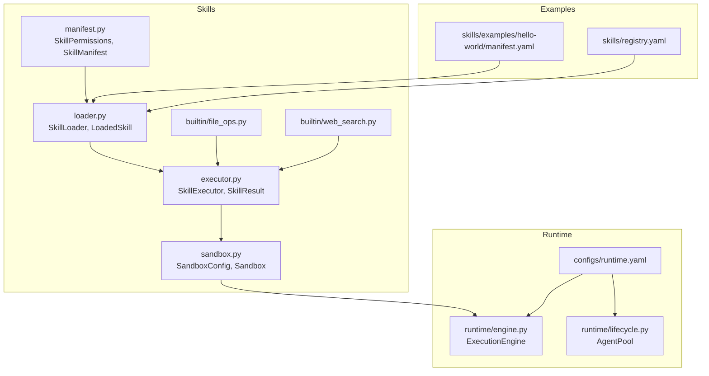
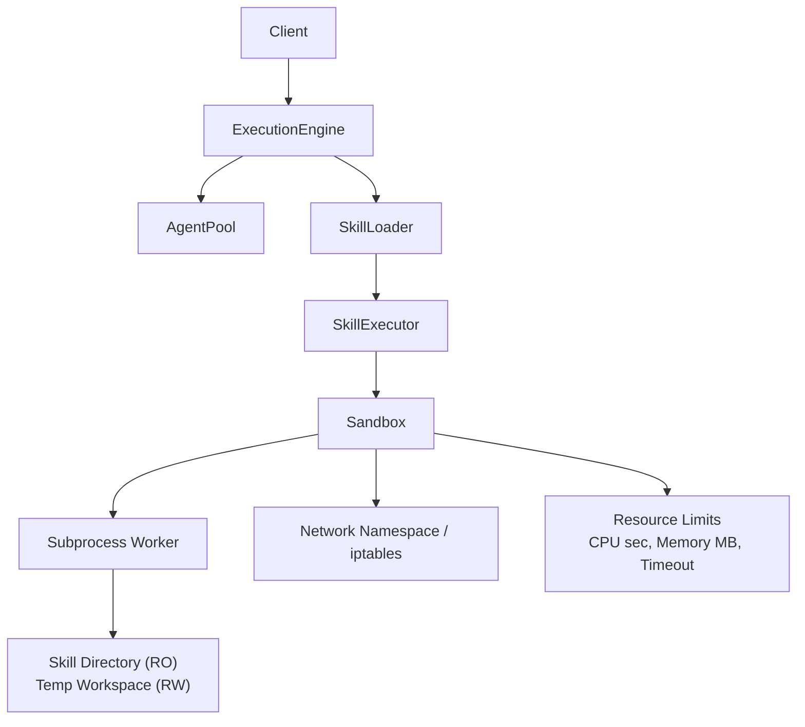
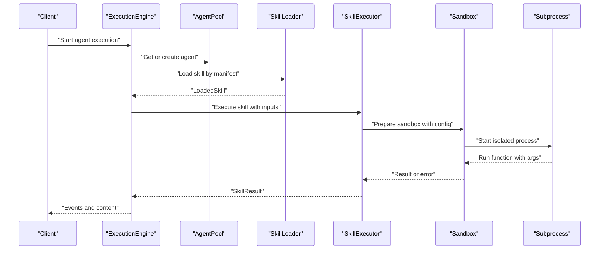
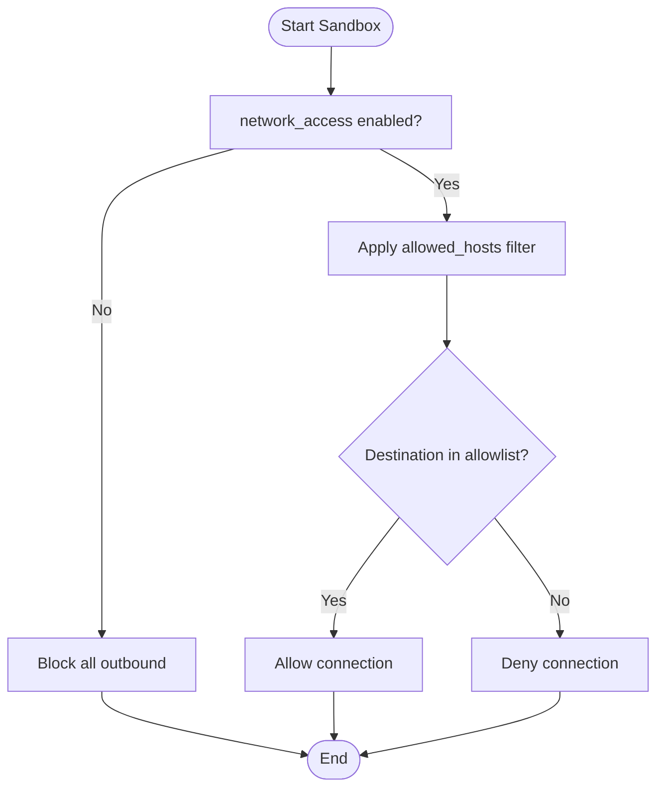
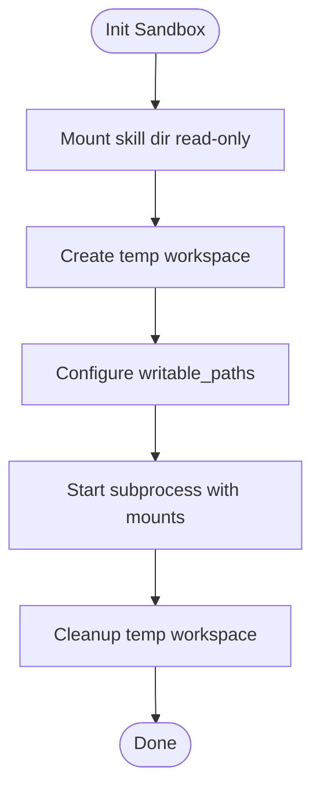
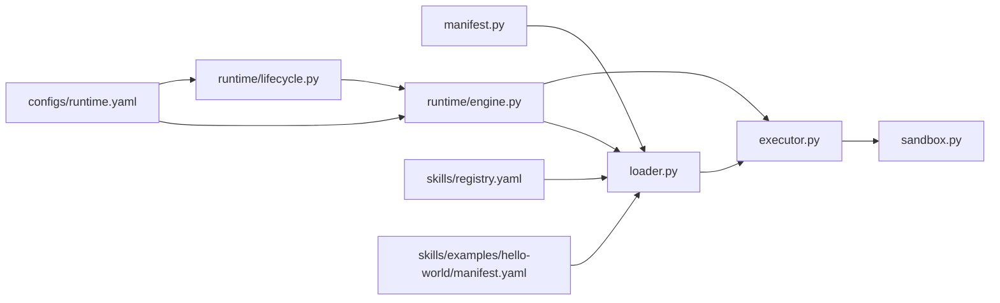

# Sandbox Execution Environment

<cite>
**Referenced Files in This Document**
- [sandbox.py](file://python/src/resolvenet/skills/sandbox.py)
- [executor.py](file://python/src/resolvenet/skills/executor.py)
- [loader.py](file://python/src/resolvenet/skills/loader.py)
- [manifest.py](file://python/src/resolvenet/skills/manifest.py)
- [engine.py](file://python/src/resolvenet/runtime/engine.py)
- [lifecycle.py](file://python/src/resolvenet/runtime/lifecycle.py)
- [manifest.yaml](file://skills/examples/hello-world/manifest.yaml)
- [registry.yaml](file://skills/registry.yaml)
- [runtime.yaml](file://configs/runtime.yaml)
- [file_ops.py](file://python/src/resolvenet/skills/builtin/file_ops.py)
- [web_search.py](file://python/src/resolvenet/skills/builtin/web_search.py)
</cite>

## Table of Contents
1. [Introduction](#introduction)
2. [Project Structure](#project-structure)
3. [Core Components](#core-components)
4. [Architecture Overview](#architecture-overview)
5. [Detailed Component Analysis](#detailed-component-analysis)
6. [Dependency Analysis](#dependency-analysis)
7. [Performance Considerations](#performance-considerations)
8. [Troubleshooting Guide](#troubleshooting-guide)
9. [Conclusion](#conclusion)
10. [Appendices](#appendices)

## Introduction
This document describes the sandbox execution environment for skill operations. It explains the planned sandbox architecture, including process isolation, resource limits enforcement, and security boundaries. It also documents memory management with max_memory_mb limits, CPU time tracking with max_cpu_seconds, and execution timeouts with timeout_seconds protection. Network security controls such as allowed_hosts filtering and network_access restrictions are covered, along with file system security including read-only and write-enabled modes, path restrictions, and temporary directory management. The execution lifecycle from skill loading through completion is outlined, including error handling, resource cleanup, and security auditing. Examples of sandbox configuration, security policy enforcement, and troubleshooting sandbox violations are included, alongside performance considerations and security best practices.

## Project Structure
The sandbox-related functionality spans Python packages under the skills domain and runtime orchestration. Key areas:
- Sandbox configuration and execution shell: python/src/resolvenet/skills/sandbox.py
- Skill loader and runtime orchestration: python/src/resolvenet/skills/loader.py, python/src/resolvenet/runtime/engine.py
- Skill execution wrapper and result model: python/src/resolvenet/skills/executor.py
- Skill manifest and permissions: python/src/resolvenet/skills/manifest.py
- Example skill manifests and registry: skills/examples/hello-world/manifest.yaml, skills/registry.yaml
- Runtime configuration: configs/runtime.yaml
- Built-in skills for file operations and web search: python/src/resolvenet/skills/builtin/file_ops.py, python/src/resolvenet/skills/builtin/web_search.py

**Diagram sources**
- [sandbox.py:11-55](file://python/src/resolvenet/skills/sandbox.py#L11-L55)
- [executor.py:14-85](file://python/src/resolvenet/skills/executor.py#L14-L85)
- [loader.py:15-90](file://python/src/resolvenet/skills/loader.py#L15-L90)
- [manifest.py:11-59](file://python/src/resolvenet/skills/manifest.py#L11-L59)
- [engine.py:14-89](file://python/src/resolvenet/runtime/engine.py#L14-L89)
- [lifecycle.py:12-52](file://python/src/resolvenet/runtime/lifecycle.py#L12-L52)
- [manifest.yaml:16-21](file://skills/examples/hello-world/manifest.yaml#L16-L21)
- [registry.yaml:1-23](file://skills/registry.yaml#L1-L23)
- [runtime.yaml:1-18](file://configs/runtime.yaml#L1-L18)
- [file_ops.py:1-25](file://python/src/resolvenet/skills/builtin/file_ops.py#L1-L25)
- [web_search.py:1-24](file://python/src/resolvenet/skills/builtin/web_search.py#L1-L24)

**Section sources**
- [sandbox.py:11-55](file://python/src/resolvenet/skills/sandbox.py#L11-L55)
- [executor.py:14-85](file://python/src/resolvenet/skills/executor.py#L14-L85)
- [loader.py:15-90](file://python/src/resolvenet/skills/loader.py#L15-L90)
- [manifest.py:11-59](file://python/src/resolvenet/skills/manifest.py#L11-L59)
- [engine.py:14-89](file://python/src/resolvenet/runtime/engine.py#L14-L89)
- [lifecycle.py:12-52](file://python/src/resolvenet/runtime/lifecycle.py#L12-L52)
- [manifest.yaml:16-21](file://skills/examples/hello-world/manifest.yaml#L16-L21)
- [registry.yaml:1-23](file://skills/registry.yaml#L1-L23)
- [runtime.yaml:1-18](file://configs/runtime.yaml#L1-L18)
- [file_ops.py:1-25](file://python/src/resolvenet/skills/builtin/file_ops.py#L1-L25)
- [web_search.py:1-24](file://python/src/resolvenet/skills/builtin/web_search.py#L1-L24)

## Core Components
- SandboxConfig: Defines resource and security parameters for sandbox execution, including max_memory_mb, max_cpu_seconds, timeout_seconds, network_access, allowed_hosts, and writable_paths.
- Sandbox: Provides isolated execution for skills with planned subprocess-based isolation, resource limits, network restrictions, and filesystem restrictions.
- SkillPermissions: Declares permissions in skill manifests, including network_access, file_system_read, file_system_write, allowed_hosts, max_memory_mb, max_cpu_seconds, and timeout_seconds.
- SkillManifest: Parses and validates skill manifests, including permissions and metadata.
- SkillLoader and LoadedSkill: Discover and load skills from directories or registries, resolving entry points and caching loaded instances.
- SkillExecutor: Executes skills with input validation, sandboxing hooks, execution timing, and error handling.
- ExecutionEngine and AgentPool: Orchestrate agent runs, manage agent lifecycle, and coordinate skill execution.

**Section sources**
- [sandbox.py:11-55](file://python/src/resolvenet/skills/sandbox.py#L11-L55)
- [manifest.py:11-59](file://python/src/resolvenet/skills/manifest.py#L11-L59)
- [loader.py:15-90](file://python/src/resolvenet/skills/loader.py#L15-L90)
- [executor.py:14-85](file://python/src/resolvenet/skills/executor.py#L14-L85)
- [engine.py:14-89](file://python/src/resolvenet/runtime/engine.py#L14-L89)
- [lifecycle.py:12-52](file://python/src/resolvenet/runtime/lifecycle.py#L12-L52)

## Architecture Overview
The sandbox architecture is designed around a subprocess-based isolation layer that enforces:
- Process isolation: A dedicated subprocess executes skill code with restricted capabilities.
- Resource limits: CPU seconds, memory MB, and wall-clock timeout are enforced per skill execution.
- Network restrictions: Optional network access with allowed_hosts filtering.
- Filesystem restrictions: Read-only mount of the skill directory with a temporary writable workspace.

**Diagram sources**
- [engine.py:22-89](file://python/src/resolvenet/runtime/engine.py#L22-L89)
- [lifecycle.py:19-46](file://python/src/resolvenet/runtime/lifecycle.py#L19-L46)
- [loader.py:24-57](file://python/src/resolvenet/skills/loader.py#L24-L57)
- [executor.py:20-66](file://python/src/resolvenet/skills/executor.py#L20-L66)
- [sandbox.py:23-55](file://python/src/resolvenet/skills/sandbox.py#L23-L55)

## Detailed Component Analysis

### Sandbox Configuration and Security Policy
- SandboxConfig defines:
  - max_memory_mb: Maximum memory allocation for the subprocess.
  - max_cpu_seconds: CPU time budget per execution.
  - timeout_seconds: Wall-clock timeout for the entire execution.
  - network_access: Enable or disable outbound network access.
  - allowed_hosts: Allowlist of hosts for outbound connections.
  - writable_paths: Paths within the workspace that are writable.
- SkillPermissions mirrors these fields in skill manifests to declare intended security posture.

Security policy enforcement:
- Network: When network_access is disabled, restrict outbound traffic; when enabled, filter outbound requests to allowed_hosts.
- Filesystem: Mount the skill directory read-only; expose a temporary workspace directory as writable.
- Resource: Enforce CPU seconds and memory limits via OS-level resource controls.

**Section sources**
- [sandbox.py:11-21](file://python/src/resolvenet/skills/sandbox.py#L11-L21)
- [manifest.py:11-21](file://python/src/resolvenet/skills/manifest.py#L11-L21)

### Execution Lifecycle
End-to-end flow from skill loading to completion:
1. Skill discovery and loading:
   - SkillLoader.load_from_directory resolves manifest and entry point.
   - LoadedSkill caches the callable function for reuse.
2. Execution orchestration:
   - ExecutionEngine creates an execution context and streams lifecycle events.
   - AgentPool manages agent instances with LRU eviction.
3. Skill execution:
   - SkillExecutor.execute validates inputs, prepares sandbox, and invokes the skill function.
   - Timing and error handling are captured in SkillResult.
4. Sandbox execution:
   - Sandbox.run is the integration point for subprocess isolation and resource enforcement.

**Diagram sources**
- [engine.py:25-83](file://python/src/resolvenet/runtime/engine.py#L25-L83)
- [lifecycle.py:23-46](file://python/src/resolvenet/runtime/lifecycle.py#L23-L46)
- [loader.py:27-57](file://python/src/resolvenet/skills/loader.py#L27-L57)
- [executor.py:20-66](file://python/src/resolvenet/skills/executor.py#L20-L66)
- [sandbox.py:35-55](file://python/src/resolvenet/skills/sandbox.py#L35-L55)

**Section sources**
- [engine.py:25-83](file://python/src/resolvenet/runtime/engine.py#L25-L83)
- [lifecycle.py:23-46](file://python/src/resolvenet/runtime/lifecycle.py#L23-L46)
- [loader.py:27-57](file://python/src/resolvenet/skills/loader.py#L27-L57)
- [executor.py:20-66](file://python/src/resolvenet/skills/executor.py#L20-L66)
- [sandbox.py:35-55](file://python/src/resolvenet/skills/sandbox.py#L35-L55)

### Memory Management and CPU Time Tracking
- Memory: max_memory_mb sets the upper bound for process memory usage. Exceeding this limit triggers termination.
- CPU time: max_cpu_seconds allocates CPU seconds for the process lifetime. The kernel enforces this via CPU accounting.
- Wall-clock timeout: timeout_seconds ensures the entire execution completes within the specified time window.

Implementation approach:
- Use OS-level resource controls (e.g., setrlimit equivalents) to cap memory and CPU.
- Apply a watchdog timer for wall-clock timeout.
- Track elapsed CPU time and remaining budget to preempt long-running tasks.

**Section sources**
- [sandbox.py:15-17](file://python/src/resolvenet/skills/sandbox.py#L15-L17)
- [manifest.py:18-20](file://python/src/resolvenet/skills/manifest.py#L18-L20)

### Network Security Controls
- network_access: When false, block outbound connections; when true, allow only specific hosts.
- allowed_hosts: Wildcard-based allowlist for outbound domains or IPs.
- Enforcement method: Network namespace or iptables rules scoped to the subprocess.

**Diagram sources**
- [sandbox.py:18-19](file://python/src/resolvenet/skills/sandbox.py#L18-L19)
- [manifest.py:14-17](file://python/src/resolvenet/skills/manifest.py#L14-L17)

**Section sources**
- [sandbox.py:18-19](file://python/src/resolvenet/skills/sandbox.py#L18-L19)
- [manifest.py:14-17](file://python/src/resolvenet/skills/manifest.py#L14-L17)

### File System Security
- Read-only mode: The skill’s source directory is mounted read-only inside the subprocess.
- Write-enabled mode: A temporary workspace directory is provided as writable for ephemeral outputs.
- Path restrictions: writable_paths can limit writes to specific locations within the workspace.
- Temporary directory management: A clean, isolated temp directory is created per execution and cleaned up after completion.

**Diagram sources**
- [sandbox.py:20](file://python/src/resolvenet/skills/sandbox.py#L20)
- [sandbox.py:49-50](file://python/src/resolvenet/skills/sandbox.py#L49-L50)

**Section sources**
- [sandbox.py:20](file://python/src/resolvenet/skills/sandbox.py#L20)
- [sandbox.py:49-50](file://python/src/resolvenet/skills/sandbox.py#L49-L50)

### Execution Timeout Protection
- timeout_seconds protects against runaway executions by terminating the subprocess after the deadline.
- Combined with CPU budget and memory caps, it forms a robust safety net.

**Section sources**
- [sandbox.py:17](file://python/src/resolvenet/skills/sandbox.py#L17)
- [manifest.py:20](file://python/src/resolvenet/skills/manifest.py#L20)

### Error Handling, Resource Cleanup, and Security Auditing
- Error handling:
  - SkillExecutor wraps execution in try/catch, records duration, and returns SkillResult with success/error details.
  - Logging captures errors and execution metadata.
- Resource cleanup:
  - Subprocess termination and temp directory removal occur after completion.
  - Pending cleanup tasks should be scheduled on eviction or shutdown.
- Security auditing:
  - Log sandbox execution attempts, configuration, and outcomes.
  - Record violations (e.g., network access denied, memory exceeded) for audit trails.

**Section sources**
- [executor.py:57-66](file://python/src/resolvenet/skills/executor.py#L57-L66)
- [sandbox.py:51-54](file://python/src/resolvenet/skills/sandbox.py#L51-L54)
- [lifecycle.py:39](file://python/src/resolvenet/runtime/lifecycle.py#L39)

### Built-in Skills and Permissions
- file_ops: Placeholder for file operations with permission checks pending implementation.
- web_search: Placeholder for web search with configurable provider; permissions include network_access and allowed_hosts.

**Section sources**
- [file_ops.py:19-25](file://python/src/resolvenet/skills/builtin/file_ops.py#L19-L25)
- [web_search.py:18-24](file://python/src/resolvenet/skills/builtin/web_search.py#L18-L24)

## Dependency Analysis
The following diagram shows key dependencies among sandbox and execution components:

**Diagram sources**
- [manifest.py:33-59](file://python/src/resolvenet/skills/manifest.py#L33-L59)
- [loader.py:15-90](file://python/src/resolvenet/skills/loader.py#L15-L90)
- [executor.py:14-85](file://python/src/resolvenet/skills/executor.py#L14-L85)
- [sandbox.py:23-55](file://python/src/resolvenet/skills/sandbox.py#L23-L55)
- [engine.py:14-89](file://python/src/resolvenet/runtime/engine.py#L14-L89)
- [lifecycle.py:12-52](file://python/src/resolvenet/runtime/lifecycle.py#L12-L52)
- [registry.yaml:1-23](file://skills/registry.yaml#L1-L23)
- [manifest.yaml:16-21](file://skills/examples/hello-world/manifest.yaml#L16-L21)
- [runtime.yaml:1-18](file://configs/runtime.yaml#L1-L18)

**Section sources**
- [manifest.py:33-59](file://python/src/resolvenet/skills/manifest.py#L33-L59)
- [loader.py:15-90](file://python/src/resolvenet/skills/loader.py#L15-L90)
- [executor.py:14-85](file://python/src/resolvenet/skills/executor.py#L14-L85)
- [sandbox.py:23-55](file://python/src/resolvenet/skills/sandbox.py#L23-L55)
- [engine.py:14-89](file://python/src/resolvenet/runtime/engine.py#L14-L89)
- [lifecycle.py:12-52](file://python/src/resolvenet/runtime/lifecycle.py#L12-L52)
- [registry.yaml:1-23](file://skills/registry.yaml#L1-L23)
- [manifest.yaml:16-21](file://skills/examples/hello-world/manifest.yaml#L16-L21)
- [runtime.yaml:1-18](file://configs/runtime.yaml#L1-L18)

## Performance Considerations
- Minimize overhead: Use lightweight subprocess creation and avoid unnecessary serialization.
- Resource tuning: Calibrate max_memory_mb and max_cpu_seconds based on typical skill workloads.
- Concurrency: Limit concurrent sandbox executions to prevent resource contention.
- Monitoring: Track execution durations, memory usage, and failure rates to tune limits.
- Warm-up: Reuse agent instances via AgentPool to reduce cold-start latency.

## Troubleshooting Guide
Common sandbox violations and resolutions:
- Network access denied:
  - Verify network_access flag and allowed_hosts entries in the skill manifest.
  - Confirm the subprocess is not attempting to connect outside the allowlist.
- Memory limit exceeded:
  - Increase max_memory_mb in SandboxConfig or adjust skill logic to reduce memory footprint.
  - Monitor peak memory usage and optimize data structures.
- CPU time exceeded:
  - Raise max_cpu_seconds or refactor long-running loops.
  - Consider batching or pagination to reduce CPU-intensive operations.
- Timeout reached:
  - Increase timeout_seconds cautiously; ensure upstream callers handle partial results.
  - Investigate blocking I/O or external dependencies causing stalls.
- Filesystem permission errors:
  - Ensure writable_paths includes required directories.
  - Confirm the temp workspace is properly mounted and accessible.

Operational checks:
- Review logs for sandbox execution attempts and configuration details.
- Validate skill manifests for correct permissions and entry points.
- Confirm runtime configuration aligns with deployment constraints.

**Section sources**
- [sandbox.py:15-21](file://python/src/resolvenet/skills/sandbox.py#L15-L21)
- [manifest.py:14-21](file://python/src/resolvenet/skills/manifest.py#L14-L21)
- [executor.py:57-66](file://python/src/resolvenet/skills/executor.py#L57-L66)
- [runtime.yaml:7-18](file://configs/runtime.yaml#L7-L18)

## Conclusion
The sandbox execution environment is designed to isolate skill operations while enforcing strict resource and security policies. The current implementation provides configuration structures and placeholders for subprocess-based isolation, resource limits, network filtering, and filesystem restrictions. By integrating these components with the loader, executor, and runtime engine, the system achieves a secure, observable, and controllable execution environment suitable for diverse skill workloads.

## Appendices

### Example Sandbox Configuration
- Skill manifest permissions:
  - network_access: true/false
  - allowed_hosts: list of host patterns
  - file_system_read/write: true/false
  - max_memory_mb: integer
  - max_cpu_seconds: integer
  - timeout_seconds: integer
- Runtime configuration:
  - agent_pool.max_size and eviction policy
  - telemetry settings

**Section sources**
- [manifest.yaml:16-21](file://skills/examples/hello-world/manifest.yaml#L16-L21)
- [runtime.yaml:7-18](file://configs/runtime.yaml#L7-L18)