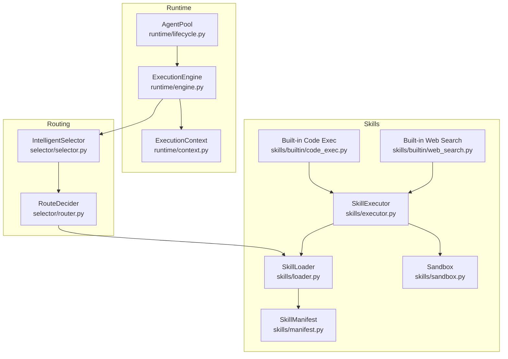
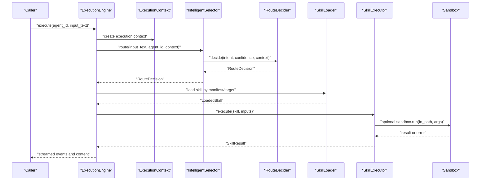
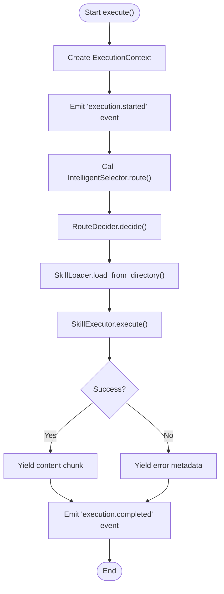
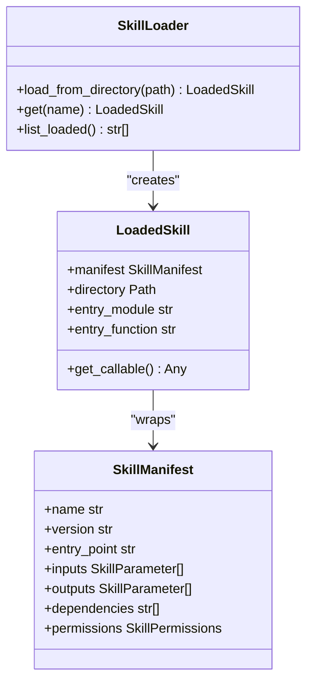
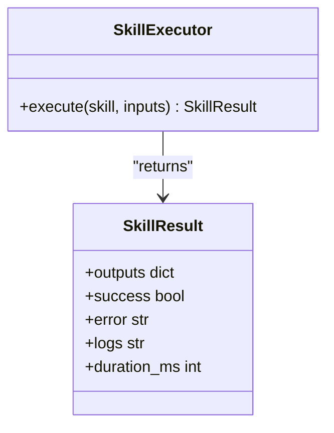
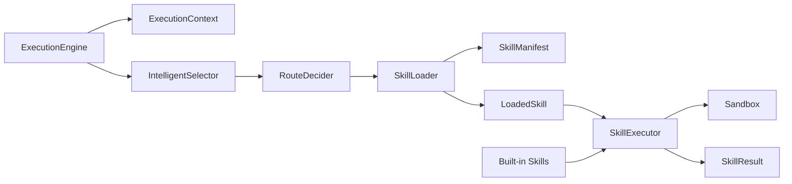

# Skill Executor and Runtime

<cite>
**Referenced Files in This Document**
- [engine.py](file://python/src/resolvenet/runtime/engine.py)
- [context.py](file://python/src/resolvenet/runtime/context.py)
- [lifecycle.py](file://python/src/resolvenet/runtime/lifecycle.py)
- [executor.py](file://python/src/resolvenet/skills/executor.py)
- [loader.py](file://python/src/resolvenet/skills/loader.py)
- [manifest.py](file://python/src/resolvenet/skills/manifest.py)
- [sandbox.py](file://python/src/resolvenet/skills/sandbox.py)
- [code_exec.py](file://python/src/resolvenet/skills/builtin/code_exec.py)
- [web_search.py](file://python/src/resolvenet/skills/builtin/web_search.py)
- [router.py](file://python/src/resolvenet/selector/router.py)
- [selector.py](file://python/src/resolvenet/selector/selector.py)
- [workflow-fta-example.yaml](file://configs/examples/workflow-fta-example.yaml)
- [manifest.yaml](file://skills/examples/hello-world/manifest.yaml)
</cite>

## Table of Contents
1. [Introduction](#introduction)
2. [Project Structure](#project-structure)
3. [Core Components](#core-components)
4. [Architecture Overview](#architecture-overview)
5. [Detailed Component Analysis](#detailed-component-analysis)
6. [Dependency Analysis](#dependency-analysis)
7. [Performance Considerations](#performance-considerations)
8. [Troubleshooting Guide](#troubleshooting-guide)
9. [Conclusion](#conclusion)
10. [Appendices](#appendices)

## Introduction
This document describes the skill executor and runtime management system in the ResolveNet platform. It explains how skills are discovered, loaded, validated, and executed in a controlled environment, how execution contexts are managed, and how routing decisions integrate with skills. It also covers planned sandboxing, resource limits, timeouts, and observability, along with guidance for scaling, monitoring, and troubleshooting.

## Project Structure
The runtime and skill execution system spans Python packages under the resolvenet namespace:
- Runtime orchestration and context: runtime/engine.py, runtime/context.py, runtime/lifecycle.py
- Skill loading and manifests: skills/loader.py, skills/manifest.py
- Execution and sandboxing: skills/executor.py, skills/sandbox.py
- Built-in skills: skills/builtin/code_exec.py, skills/builtin/web_search.py
- Routing integration: selector/selector.py, selector/router.py
- Example configurations and manifests: configs/examples/workflow-fta-example.yaml, skills/examples/hello-world/manifest.yaml

**Diagram sources**
- [engine.py:14-89](file://python/src/resolvenet/runtime/engine.py#L14-L89)
- [context.py:9-35](file://python/src/resolvenet/runtime/context.py#L9-L35)
- [lifecycle.py:12-52](file://python/src/resolvenet/runtime/lifecycle.py#L12-L52)
- [loader.py:15-90](file://python/src/resolvenet/skills/loader.py#L15-L90)
- [manifest.py:11-59](file://python/src/resolvenet/skills/manifest.py#L11-L59)
- [executor.py:14-85](file://python/src/resolvenet/skills/executor.py#L14-L85)
- [sandbox.py:23-56](file://python/src/resolvenet/skills/sandbox.py#L23-L56)
- [code_exec.py:8-25](file://python/src/resolvenet/skills/builtin/code_exec.py#L8-L25)
- [web_search.py:8-25](file://python/src/resolvenet/skills/builtin/web_search.py#L8-L25)
- [selector.py:24-100](file://python/src/resolvenet/selector/selector.py#L24-L100)
- [router.py:10-40](file://python/src/resolvenet/selector/router.py#L10-L40)

**Section sources**
- [engine.py:14-89](file://python/src/resolvenet/runtime/engine.py#L14-L89)
- [context.py:9-35](file://python/src/resolvenet/runtime/context.py#L9-L35)
- [lifecycle.py:12-52](file://python/src/resolvenet/runtime/lifecycle.py#L12-L52)
- [loader.py:15-90](file://python/src/resolvenet/skills/loader.py#L15-L90)
- [manifest.py:11-59](file://python/src/resolvenet/skills/manifest.py#L11-L59)
- [executor.py:14-85](file://python/src/resolvenet/skills/executor.py#L14-L85)
- [sandbox.py:23-56](file://python/src/resolvenet/skills/sandbox.py#L23-L56)
- [code_exec.py:8-25](file://python/src/resolvenet/skills/builtin/code_exec.py#L8-L25)
- [web_search.py:8-25](file://python/src/resolvenet/skills/builtin/web_search.py#L8-L25)
- [selector.py:24-100](file://python/src/resolvenet/selector/selector.py#L24-L100)
- [router.py:10-40](file://python/src/resolvenet/selector/router.py#L10-L40)

## Core Components
- ExecutionEngine orchestrates agent runs, creates ExecutionContext, and emits streaming events. It currently contains placeholders for agent loading, routing, and result streaming.
- ExecutionContext carries execution identifiers, conversation context, and metadata for telemetry correlation.
- AgentPool manages agent instances with LRU eviction to cap memory usage.
- SkillLoader discovers and loads skills from directories, parses manifests, and resolves entry points.
- SkillManifest defines schema for skill metadata, inputs/outputs, dependencies, and permissions.
- SkillExecutor executes loaded skills, measures duration, and returns structured results with success/error state.
- Sandbox defines resource limits and isolation boundaries; current implementation logs a placeholder.
- Built-in skills demonstrate expected entry points and return shapes.
- IntelligentSelector and RouteDecider provide routing decisions that can select skills as a route target.

**Section sources**
- [engine.py:14-89](file://python/src/resolvenet/runtime/engine.py#L14-L89)
- [context.py:9-35](file://python/src/resolvenet/runtime/context.py#L9-L35)
- [lifecycle.py:12-52](file://python/src/resolvenet/runtime/lifecycle.py#L12-L52)
- [loader.py:15-90](file://python/src/resolvenet/skills/loader.py#L15-L90)
- [manifest.py:11-59](file://python/src/resolvenet/skills/manifest.py#L11-L59)
- [executor.py:14-85](file://python/src/resolvenet/skills/executor.py#L14-L85)
- [sandbox.py:23-56](file://python/src/resolvenet/skills/sandbox.py#L23-L56)
- [code_exec.py:8-25](file://python/src/resolvenet/skills/builtin/code_exec.py#L8-L25)
- [web_search.py:8-25](file://python/src/resolvenet/skills/builtin/web_search.py#L8-L25)
- [selector.py:24-100](file://python/src/resolvenet/selector/selector.py#L24-L100)
- [router.py:10-40](file://python/src/resolvenet/selector/router.py#L10-L40)

## Architecture Overview
The runtime architecture integrates routing, skill loading, and execution into a cohesive flow. The ExecutionEngine sets up the execution context and yields events. Routing selects a path (including skills), and the loader resolves the skill’s entry point. The executor runs the skill with optional sandboxing and returns structured results.

**Diagram sources**
- [engine.py:25-89](file://python/src/resolvenet/runtime/engine.py#L25-L89)
- [selector.py:43-72](file://python/src/resolvenet/selector/selector.py#L43-L72)
- [router.py:17-39](file://python/src/resolvenet/selector/router.py#L17-L39)
- [loader.py:27-57](file://python/src/resolvenet/skills/loader.py#L27-L57)
- [executor.py:20-66](file://python/src/resolvenet/skills/executor.py#L20-L66)
- [sandbox.py:35-55](file://python/src/resolvenet/skills/sandbox.py#L35-L55)

## Detailed Component Analysis

### ExecutionEngine
- Purpose: Orchestrates a single agent execution, emitting lifecycle events and content chunks.
- Responsibilities:
  - Creates a unique execution context with identifiers and conversation context.
  - Emits “execution.started” and “execution.completed” events.
  - Streams content chunks during processing.
  - Placeholder for agent loading, routing, and result streaming.
- Observability: Uses structured logging with execution_id and agent_id.

**Diagram sources**
- [engine.py:25-89](file://python/src/resolvenet/runtime/engine.py#L25-L89)
- [selector.py:43-72](file://python/src/resolvenet/selector/selector.py#L43-L72)
- [router.py:17-39](file://python/src/resolvenet/selector/router.py#L17-L39)
- [loader.py:27-57](file://python/src/resolvenet/skills/loader.py#L27-L57)
- [executor.py:20-66](file://python/src/resolvenet/skills/executor.py#L20-L66)

**Section sources**
- [engine.py:14-89](file://python/src/resolvenet/runtime/engine.py#L14-L89)

### ExecutionContext
- Purpose: Holds immutable execution identifiers and mutable metadata/state for a single run.
- Fields: execution_id, agent_id, conversation_id, input_text, context, trace_id, metadata.
- Methods: with_trace to attach a trace ID for distributed tracing.

**Section sources**
- [context.py:9-35](file://python/src/resolvenet/runtime/context.py#L9-L35)

### AgentPool
- Purpose: Manages agent instances with LRU eviction to cap memory usage.
- Behavior: get updates LRU order; put inserts or updates and evicts least recently used when at capacity; remove deletes an entry.
- Notes: Eviction logs indicate cleanup opportunity for evicted agents.

**Section sources**
- [lifecycle.py:12-52](file://python/src/resolvenet/runtime/lifecycle.py#L12-L52)

### SkillLoader and LoadedSkill
- Purpose: Discover and load skills from local directories, parse manifests, and resolve entry points.
- Loading: Reads manifest.yaml, splits entry_point into module and function, imports module, and retrieves function.
- Caching: Keeps loaded skills in memory keyed by name.

**Diagram sources**
- [loader.py:15-90](file://python/src/resolvenet/skills/loader.py#L15-L90)
- [manifest.py:33-59](file://python/src/resolvenet/skills/manifest.py#L33-L59)

**Section sources**
- [loader.py:15-90](file://python/src/resolvenet/skills/loader.py#L15-L90)
- [manifest.py:11-59](file://python/src/resolvenet/skills/manifest.py#L11-L59)

### SkillManifest and Permissions
- Purpose: Define skill schema, parameters, dependencies, and permissions.
- Permissions: Includes network_access, file_system_read/write, allowed_hosts, and resource limits (max_memory_mb, max_cpu_seconds, timeout_seconds).
- Defaults: Permissions defaults align with sandbox configuration.

**Section sources**
- [manifest.py:11-59](file://python/src/resolvenet/skills/manifest.py#L11-L59)

### SkillExecutor and SkillResult
- Purpose: Execute a LoadedSkill with inputs, measure duration, and return structured results.
- Behavior: Resolves callable from LoadedSkill, invokes with inputs, normalizes outputs to dict, captures exceptions, and records duration.
- Result fields: outputs, success, error, logs, duration_ms.

**Diagram sources**
- [executor.py:14-85](file://python/src/resolvenet/skills/executor.py#L14-L85)

**Section sources**
- [executor.py:14-85](file://python/src/resolvenet/skills/executor.py#L14-L85)

### Sandbox and SandboxConfig
- Purpose: Define resource limits and isolation boundaries for skill execution.
- Config fields: max_memory_mb, max_cpu_seconds, timeout_seconds, network_access, allowed_hosts, writable_paths.
- Current state: run method logs a placeholder; future implementation will enforce resource limits and isolation.

**Section sources**
- [sandbox.py:11-56](file://python/src/resolvenet/skills/sandbox.py#L11-L56)

### Built-in Skills
- Code Execution: run function accepts code and language, returning standardized metadata; placeholder implementation indicates sandbox requirement.
- Web Search: run function accepts query and number of results, returning standardized metadata; placeholder implementation indicates provider configuration requirement.

**Section sources**
- [code_exec.py:8-25](file://python/src/resolvenet/skills/builtin/code_exec.py#L8-L25)
- [web_search.py:8-25](file://python/src/resolvenet/skills/builtin/web_search.py#L8-L25)

### Routing Integration
- IntelligentSelector: Chooses among strategies (llm, rule, hybrid) to produce a RouteDecision.
- RouteDecider: Makes a final routing decision given intent, confidence, and context.
- Integration point: RouteDecision can target a skill (e.g., skill:name) or other subsystems.

**Section sources**
- [selector.py:24-100](file://python/src/resolvenet/selector/selector.py#L24-L100)
- [router.py:10-40](file://python/src/resolvenet/selector/router.py#L10-L40)

## Dependency Analysis
- ExecutionEngine depends on ExecutionContext and routes through IntelligentSelector/RouteDecider.
- Selector depends on strategy implementations (pluggable) and produces RouteDecision.
- RouteDecision targets skills resolved by SkillLoader; LoadedSkill depends on SkillManifest.
- SkillExecutor depends on LoadedSkill and optionally Sandbox.
- Built-in skills provide example entry points consumable by the loader.

**Diagram sources**
- [engine.py:25-89](file://python/src/resolvenet/runtime/engine.py#L25-L89)
- [selector.py:43-72](file://python/src/resolvenet/selector/selector.py#L43-L72)
- [router.py:17-39](file://python/src/resolvenet/selector/router.py#L17-L39)
- [loader.py:27-57](file://python/src/resolvenet/skills/loader.py#L27-L57)
- [manifest.py:33-59](file://python/src/resolvenet/skills/manifest.py#L33-L59)
- [executor.py:20-66](file://python/src/resolvenet/skills/executor.py#L20-L66)
- [sandbox.py:35-55](file://python/src/resolvenet/skills/sandbox.py#L35-L55)
- [code_exec.py:8-25](file://python/src/resolvenet/skills/builtin/code_exec.py#L8-L25)
- [web_search.py:8-25](file://python/src/resolvenet/skills/builtin/web_search.py#L8-L25)

**Section sources**
- [engine.py:14-89](file://python/src/resolvenet/runtime/engine.py#L14-L89)
- [selector.py:24-100](file://python/src/resolvenet/selector/selector.py#L24-L100)
- [router.py:10-40](file://python/src/resolvenet/selector/router.py#L10-L40)
- [loader.py:15-90](file://python/src/resolvenet/skills/loader.py#L15-L90)
- [manifest.py:11-59](file://python/src/resolvenet/skills/manifest.py#L11-L59)
- [executor.py:14-85](file://python/src/resolvenet/skills/executor.py#L14-L85)
- [sandbox.py:23-56](file://python/src/resolvenet/skills/sandbox.py#L23-L56)
- [code_exec.py:8-25](file://python/src/resolvenet/skills/builtin/code_exec.py#L8-L25)
- [web_search.py:8-25](file://python/src/resolvenet/skills/builtin/web_search.py#L8-L25)

## Performance Considerations
- Resource limits: Permissions and SandboxConfig define caps for memory, CPU seconds, and wall-clock timeout. These should be tuned per workload and enforced by the sandbox implementation.
- Concurrency: The executor currently executes synchronously. For parallelism, consider batching or worker pools while respecting per-skill resource limits.
- Caching: SkillLoader caches LoadedSkill instances by name to avoid repeated imports. AgentPool evicts least recently used agents to bound memory.
- Streaming: ExecutionEngine yields events and content chunks; ensure producers keep pace with consumers to avoid backpressure.
- Monitoring: Track duration_ms from SkillResult and emit metrics for latency, throughput, and failure rates.

[No sources needed since this section provides general guidance]

## Troubleshooting Guide
Common issues and remedies:
- Skill fails immediately:
  - Verify manifest entry_point resolves to an existing function.
  - Confirm inputs match SkillManifest.inputs schema.
  - Check SkillExecutor exception handling and error field in SkillResult.
- Excessive resource usage:
  - Adjust permissions and SandboxConfig limits.
  - Enforce resource limits in sandbox implementation.
- Timeout or hanging execution:
  - Increase timeout_seconds in manifest or SandboxConfig.
  - Investigate blocking operations in skill code.
- Routing misconfiguration:
  - Validate RouteDecision route_type and parameters.
  - Ensure selector strategy matches intent patterns.
- Agent pool evictions:
  - Reduce max_size or increase capacity if needed.
  - Warm frequently used agents to prevent churn.

**Section sources**
- [executor.py:57-66](file://python/src/resolvenet/skills/executor.py#L57-L66)
- [manifest.py:11-21](file://python/src/resolvenet/skills/manifest.py#L11-L21)
- [sandbox.py:11-21](file://python/src/resolvenet/skills/sandbox.py#L11-L21)
- [lifecycle.py:37-40](file://python/src/resolvenet/runtime/lifecycle.py#L37-L40)
- [selector.py:62-70](file://python/src/resolvenet/selector/selector.py#L62-L70)

## Conclusion
The skill executor and runtime system provides a modular foundation for discovering, validating, and executing skills with structured results and observability. While sandboxing and parallel execution are currently placeholders, the architecture supports incremental enhancements to isolation, concurrency, and resilience. Integrating routing, manifests, and execution contexts enables scalable and maintainable skill orchestration.

[No sources needed since this section summarizes without analyzing specific files]

## Appendices

### Example: Skill Manifest
- Demonstrates inputs, outputs, permissions, and entry_point.
- Used by SkillLoader to resolve the skill’s callable.

**Section sources**
- [manifest.yaml:1-21](file://skills/examples/hello-world/manifest.yaml#L1-L21)

### Example: FTA Workflow with Skill Evaluators
- Shows how FTA nodes can evaluate skills and pass parameters.
- Useful for designing workflows that incorporate skill execution.

**Section sources**
- [workflow-fta-example.yaml:1-50](file://configs/examples/workflow-fta-example.yaml#L1-L50)