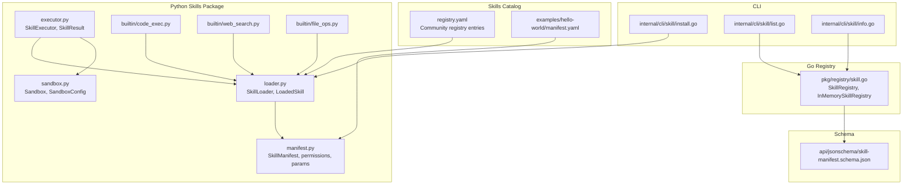
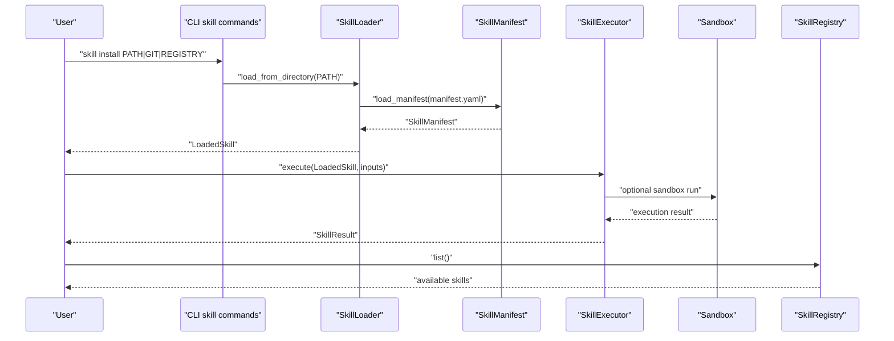
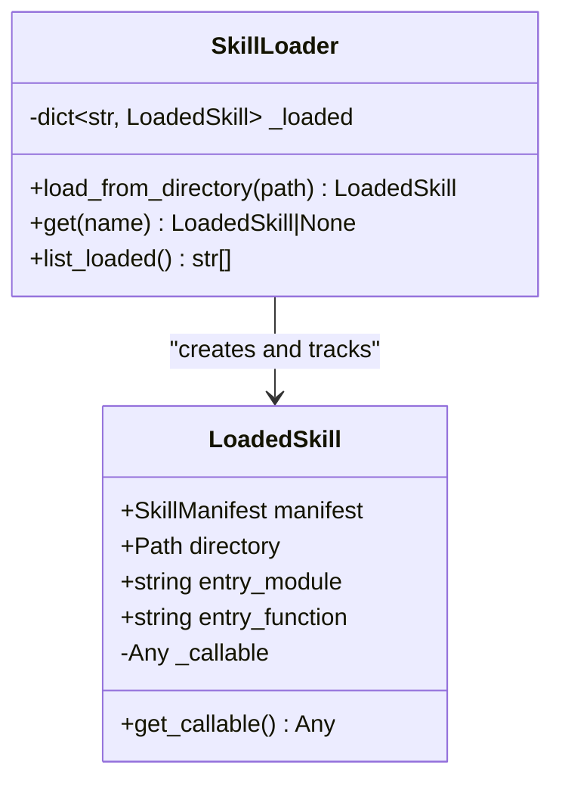
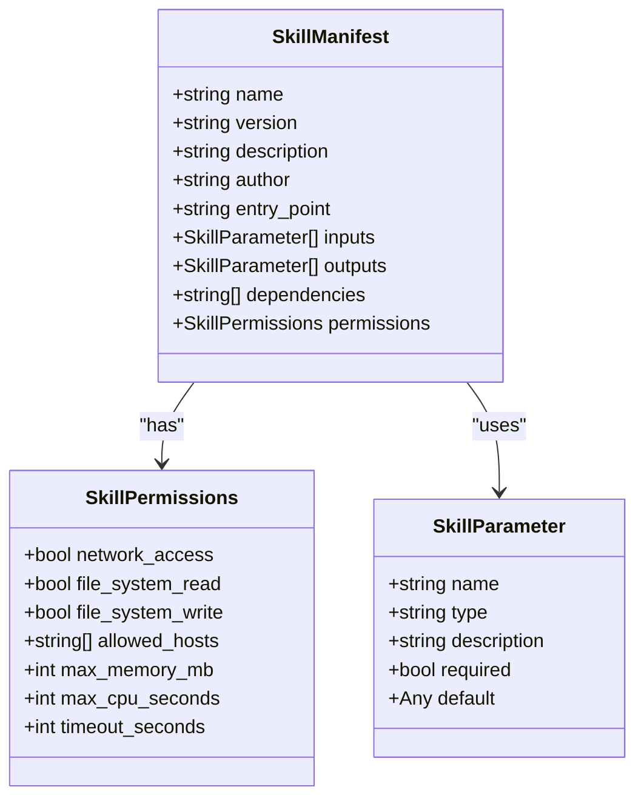
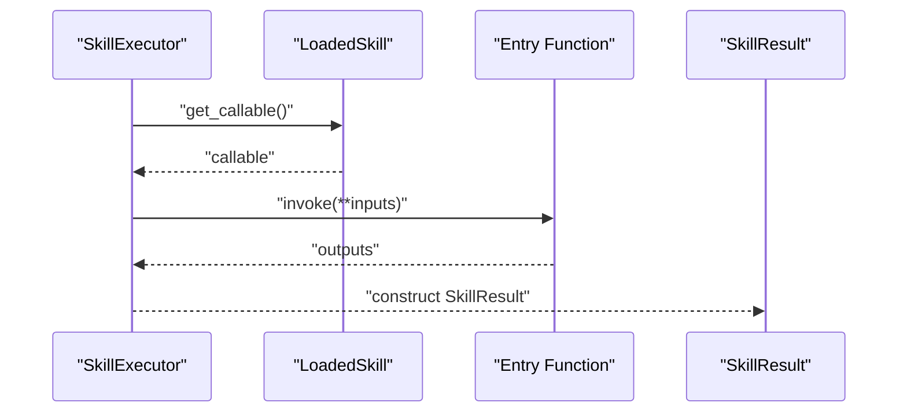
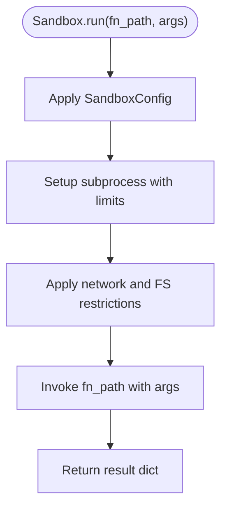
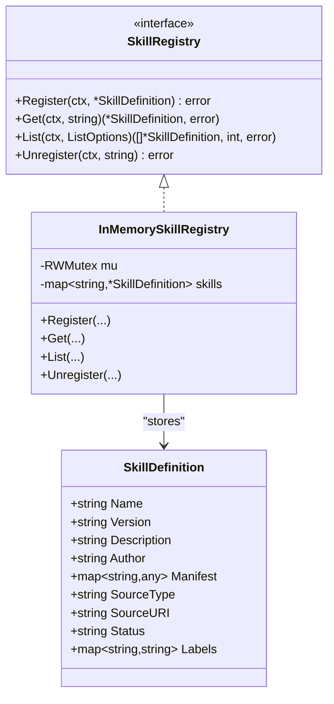
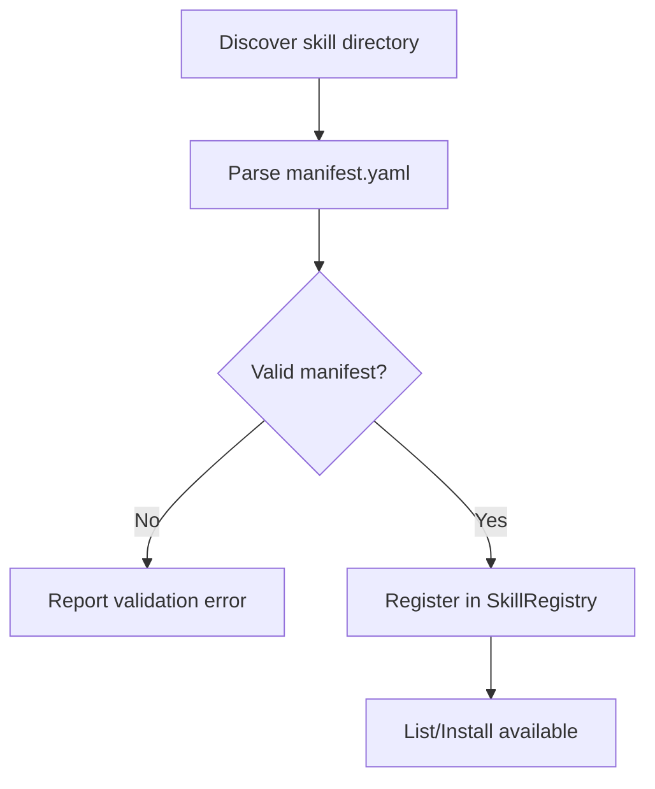
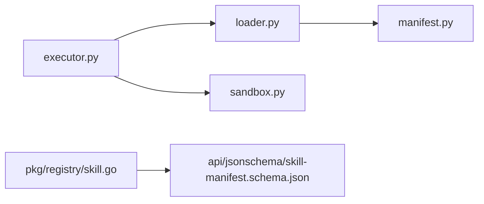

# Skill Loader and Discovery

<cite>
**Referenced Files in This Document**
- [loader.py](file://python/src/resolvenet/skills/loader.py)
- [manifest.py](file://python/src/resolvenet/skills/manifest.py)
- [executor.py](file://python/src/resolvenet/skills/executor.py)
- [sandbox.py](file://python/src/resolvenet/skills/sandbox.py)
- [code_exec.py](file://python/src/resolvenet/skills/builtin/code_exec.py)
- [web_search.py](file://python/src/resolvenet/skills/builtin/web_search.py)
- [file_ops.py](file://python/src/resolvenet/skills/builtin/file_ops.py)
- [registry.yaml](file://skills/registry.yaml)
- [manifest.yaml](file://skills/examples/hello-world/manifest.yaml)
- [skill.go](file://pkg/registry/skill.go)
- [install.go](file://internal/cli/skill/install.go)
- [list.go](file://internal/cli/skill/list.go)
- [info.go](file://internal/cli/skill/info.go)
- [skill-manifest.schema.json](file://api/jsonschema/skill-manifest.schema.json)
</cite>

## Table of Contents
1. [Introduction](#introduction)
2. [Project Structure](#project-structure)
3. [Core Components](#core-components)
4. [Architecture Overview](#architecture-overview)
5. [Detailed Component Analysis](#detailed-component-analysis)
6. [Dependency Analysis](#dependency-analysis)
7. [Performance Considerations](#performance-considerations)
8. [Troubleshooting Guide](#troubleshooting-guide)
9. [Conclusion](#conclusion)
10. [Appendices](#appendices)

## Introduction
This document describes the skill loader and discovery system that enables dynamic discovery, validation, and registration of skills for agents. It covers:
- Directory scanning and manifest validation
- Loading and execution of skills
- Registration and availability tracking
- Integration with the community registry for remote discovery
- Error handling, performance optimization, and troubleshooting

The system is implemented primarily in Python under the skills package, with Go-based registry interfaces and CLI commands supporting installation and listing.

## Project Structure
The skill system spans Python modules for discovery, validation, execution, and sandboxing, along with a small set of built-in skills and a community registry definition.

**Diagram sources**
- [loader.py:15-90](file://python/src/resolvenet/skills/loader.py#L15-L90)
- [manifest.py:11-59](file://python/src/resolvenet/skills/manifest.py#L11-L59)
- [executor.py:14-85](file://python/src/resolvenet/skills/executor.py#L14-L85)
- [sandbox.py:11-56](file://python/src/resolvenet/skills/sandbox.py#L11-L56)
- [code_exec.py:8-25](file://python/src/resolvenet/skills/builtin/code_exec.py#L8-L25)
- [web_search.py:8-25](file://python/src/resolvenet/skills/builtin/web_search.py#L8-L25)
- [file_ops.py:8-26](file://python/src/resolvenet/skills/builtin/file_ops.py#L8-L26)
- [registry.yaml:1-24](file://skills/registry.yaml#L1-L24)
- [manifest.yaml:1-21](file://skills/examples/hello-world/manifest.yaml#L1-L21)
- [skill.go:9-80](file://pkg/registry/skill.go#L9-L80)
- [install.go:26-40](file://internal/cli/skill/install.go#L26-L40)
- [list.go:9-22](file://internal/cli/skill/list.go#L9-L22)
- [info.go:9-21](file://internal/cli/skill/info.go#L9-L21)
- [skill-manifest.schema.json](file://api/jsonschema/skill-manifest.schema.json)

**Section sources**
- [loader.py:15-90](file://python/src/resolvenet/skills/loader.py#L15-L90)
- [manifest.py:11-59](file://python/src/resolvenet/skills/manifest.py#L11-L59)
- [executor.py:14-85](file://python/src/resolvenet/skills/executor.py#L14-L85)
- [sandbox.py:11-56](file://python/src/resolvenet/skills/sandbox.py#L11-L56)
- [registry.yaml:1-24](file://skills/registry.yaml#L1-L24)
- [manifest.yaml:1-21](file://skills/examples/hello-world/manifest.yaml#L1-L21)
- [skill.go:9-80](file://pkg/registry/skill.go#L9-L80)
- [install.go:26-40](file://internal/cli/skill/install.go#L26-L40)
- [list.go:9-22](file://internal/cli/skill/list.go#L9-L22)
- [info.go:9-21](file://internal/cli/skill/info.go#L9-L21)
- [skill-manifest.schema.json](file://api/jsonschema/skill-manifest.schema.json)

## Core Components
- SkillLoader: Discovers and loads skills from local directories, validates manifests, and prepares LoadedSkill instances for execution.
- LoadedSkill: Holds manifest, directory, and entry point metadata; lazily imports and exposes the callable entry function.
- SkillManifest: Pydantic model representing validated skill metadata, parameters, permissions, and dependencies.
- SkillExecutor: Executes loaded skills, collects outputs, and reports execution results and timing.
- Sandbox/SandboxConfig: Defines resource and access constraints for execution isolation.
- Built-in skills: Example skills demonstrating entry points and expected outputs.
- Community registry: Local registry definition listing skills with metadata and source locations.
- Go registry interfaces: SkillRegistry contract and in-memory implementation for development.
- CLI commands: Install, list, and info commands scaffolding for remote discovery and installation.

**Section sources**
- [loader.py:15-90](file://python/src/resolvenet/skills/loader.py#L15-L90)
- [manifest.py:11-59](file://python/src/resolvenet/skills/manifest.py#L11-L59)
- [executor.py:14-85](file://python/src/resolvenet/skills/executor.py#L14-L85)
- [sandbox.py:11-56](file://python/src/resolvenet/skills/sandbox.py#L11-L56)
- [registry.yaml:1-24](file://skills/registry.yaml#L1-L24)
- [skill.go:9-80](file://pkg/registry/skill.go#L9-L80)
- [install.go:26-40](file://internal/cli/skill/install.go#L26-L40)
- [list.go:9-22](file://internal/cli/skill/list.go#L9-L22)
- [info.go:9-21](file://internal/cli/skill/info.go#L9-L21)

## Architecture Overview
The skill loader and discovery system orchestrates three primary flows:
- Local discovery: Scan a directory, parse and validate the manifest, import the entry point, and register the skill.
- Execution: Validate inputs against the manifest, optionally sandbox execution, and collect results.
- Registry integration: Maintain a registry of skills and support listing and installation commands.

**Diagram sources**
- [install.go:26-40](file://internal/cli/skill/install.go#L26-L40)
- [loader.py:27-57](file://python/src/resolvenet/skills/loader.py#L27-L57)
- [manifest.py:47-59](file://python/src/resolvenet/skills/manifest.py#L47-L59)
- [executor.py:20-67](file://python/src/resolvenet/skills/executor.py#L20-L67)
- [sandbox.py:35-55](file://python/src/resolvenet/skills/sandbox.py#L35-L55)
- [skill.go:22-28](file://pkg/registry/skill.go#L22-L28)

## Detailed Component Analysis

### SkillLoader and LoadedSkill
- Responsibilities:
  - Discover skills from a local directory by locating and validating the manifest.
  - Parse the entry point specification and lazily import the callable.
  - Track loaded skills by name for reuse.
- Key behaviors:
  - Validates manifest presence and parses YAML into a typed model.
  - Supports entry point notation with optional function name fallback.
  - Caches the imported callable to avoid repeated imports.

**Diagram sources**
- [loader.py:15-90](file://python/src/resolvenet/skills/loader.py#L15-L90)

**Section sources**
- [loader.py:27-66](file://python/src/resolvenet/skills/loader.py#L27-L66)
- [manifest.py:33-59](file://python/src/resolvenet/skills/manifest.py#L33-L59)

### SkillManifest and Validation
- Responsibilities:
  - Define the schema for skill metadata, parameters, permissions, and dependencies.
  - Load and validate manifest files from YAML.
- Key fields:
  - Identity: name, version, description, author.
  - Behavior: entry_point, inputs, outputs, dependencies.
  - Safety: permissions with resource and access constraints.
- Validation:
  - Uses Pydantic models to enforce field types and defaults.
  - Integrates with JSON schema for stricter validation.

**Diagram sources**
- [manifest.py:11-59](file://python/src/resolvenet/skills/manifest.py#L11-L59)

**Section sources**
- [manifest.py:11-59](file://python/src/resolvenet/skills/manifest.py#L11-L59)
- [skill-manifest.schema.json](file://api/jsonschema/skill-manifest.schema.json)

### SkillExecutor and Results
- Responsibilities:
  - Execute a LoadedSkill with provided inputs.
  - Collect timing, success/failure, and structured outputs.
- Notes:
  - Input validation and sandboxing are marked as TODOs and represent extension points for future implementation.

**Diagram sources**
- [executor.py:20-67](file://python/src/resolvenet/skills/executor.py#L20-L67)
- [loader.py:84-89](file://python/src/resolvenet/skills/loader.py#L84-L89)

**Section sources**
- [executor.py:14-85](file://python/src/resolvenet/skills/executor.py#L14-L85)

### Sandbox and Resource Control
- Responsibilities:
  - Define sandbox configuration for CPU, memory, timeouts, network, and filesystem constraints.
  - Provide a placeholder for sandbox execution (subprocess isolation, seccomp, network namespaces).
- Notes:
  - Current implementation logs but does not enforce isolation; future work includes subprocess setup and OS-level controls.

**Diagram sources**
- [sandbox.py:23-55](file://python/src/resolvenet/skills/sandbox.py#L23-L55)

**Section sources**
- [sandbox.py:11-56](file://python/src/resolvenet/skills/sandbox.py#L11-L56)

### Built-in Skills
- Purpose:
  - Demonstrate entry points and expected output structures for skills.
  - Serve as examples for developers creating custom skills.
- Examples:
  - Web search, file operations, and code execution skills with stubbed implementations.

**Section sources**
- [code_exec.py:8-25](file://python/src/resolvenet/skills/builtin/code_exec.py#L8-L25)
- [web_search.py:8-25](file://python/src/resolvenet/skills/builtin/web_search.py#L8-L25)
- [file_ops.py:8-26](file://python/src/resolvenet/skills/builtin/file_ops.py#L8-L26)

### Community Registry and Discovery
- Local registry:
  - A YAML file enumerates skills with name, version, description, and either a local path or a builtin flag.
  - Used to discover and list available skills locally.
- Remote registry integration:
  - The Go registry interface defines a contract for registering, listing, and retrieving skills.
  - CLI commands are scaffolded to support install and list operations against a remote registry.

**Diagram sources**
- [skill.go:9-80](file://pkg/registry/skill.go#L9-L80)

**Section sources**
- [registry.yaml:1-24](file://skills/registry.yaml#L1-L24)
- [skill.go:22-80](file://pkg/registry/skill.go#L22-L80)
- [install.go:26-40](file://internal/cli/skill/install.go#L26-L40)
- [list.go:9-22](file://internal/cli/skill/list.go#L9-L22)
- [info.go:9-21](file://internal/cli/skill/info.go#L9-L21)

### Skill Registration Workflow
- Metadata extraction:
  - Extract identity, behavior, and permissions from the manifest.
- Dependency resolution:
  - Dependencies listed in the manifest can be resolved by name against the registry.
- Availability tracking:
  - Registry stores skill definitions with source type and URI for later retrieval and installation.

**Diagram sources**
- [loader.py:27-57](file://python/src/resolvenet/skills/loader.py#L27-L57)
- [manifest.py:47-59](file://python/src/resolvenet/skills/manifest.py#L47-L59)
- [skill.go:22-28](file://pkg/registry/skill.go#L22-L28)

**Section sources**
- [loader.py:27-57](file://python/src/resolvenet/skills/loader.py#L27-L57)
- [manifest.py:33-59](file://python/src/resolvenet/skills/manifest.py#L33-L59)
- [skill.go:22-80](file://pkg/registry/skill.go#L22-L80)

### Error Handling During Discovery
- Manifest parsing errors:
  - YAML load failures or schema mismatches raise exceptions surfaced to callers.
- Entry point resolution:
  - Missing module or function names lead to import errors; callers should handle and log appropriately.
- Execution errors:
  - Exceptions during invocation are captured and reported in SkillResult with timing and error messages.

**Section sources**
- [manifest.py:47-59](file://python/src/resolvenet/skills/manifest.py#L47-L59)
- [loader.py:39-57](file://python/src/resolvenet/skills/loader.py#L39-L57)
- [executor.py:57-66](file://python/src/resolvenet/skills/executor.py#L57-L66)

## Dependency Analysis
- Internal dependencies:
  - loader depends on manifest for validation.
  - executor depends on loader for LoadedSkill and on sandbox for isolation.
  - registry interfaces define contracts for registration and listing.
- External dependencies:
  - Pydantic for manifest validation.
  - YAML for manifest parsing.
  - JSON schema for strict validation.

**Diagram sources**
- [loader.py:10-10](file://python/src/resolvenet/skills/loader.py#L10-L10)
- [manifest.py:7-8](file://python/src/resolvenet/skills/manifest.py#L7-L8)
- [executor.py:9-9](file://python/src/resolvenet/skills/executor.py#L9-L9)
- [sandbox.py:1-1](file://python/src/resolvenet/skills/sandbox.py#L1-L1)
- [skill.go:3-7](file://pkg/registry/skill.go#L3-L7)
- [skill-manifest.schema.json](file://api/jsonschema/skill-manifest.schema.json)

**Section sources**
- [loader.py:10-10](file://python/src/resolvenet/skills/loader.py#L10-L10)
- [manifest.py:7-8](file://python/src/resolvenet/skills/manifest.py#L7-L8)
- [executor.py:9-9](file://python/src/resolvenet/skills/executor.py#L9-L9)
- [sandbox.py:1-1](file://python/src/resolvenet/skills/sandbox.py#L1-L1)
- [skill.go:3-7](file://pkg/registry/skill.go#L3-L7)
- [skill-manifest.schema.json](file://api/jsonschema/skill-manifest.schema.json)

## Performance Considerations
- Lazy loading:
  - Entry point modules are imported only when first accessed, reducing startup overhead.
- Caching:
  - LoadedSkill caches the callable to avoid repeated imports.
- Manifest validation:
  - Keep manifests minimal and pre-validate to reduce runtime errors.
- Concurrency:
  - Use asynchronous execution paths for I/O-bound skills and offload CPU-heavy tasks to sandboxed subprocesses.
- Registry caching:
  - Cache registry listings and metadata to minimize network calls during discovery.

[No sources needed since this section provides general guidance]

## Troubleshooting Guide
- Manifest validation fails:
  - Verify required fields and types match the schema; check YAML formatting.
- Entry point not found:
  - Confirm the module path and function name in the manifest; ensure the module is importable.
- Execution errors:
  - Inspect SkillResult for error messages and duration; enable detailed logging.
- Registry issues:
  - Ensure registry entries are present and accessible; confirm CLI commands are wired to the intended backend.

**Section sources**
- [manifest.py:47-59](file://python/src/resolvenet/skills/manifest.py#L47-L59)
- [loader.py:39-57](file://python/src/resolvenet/skills/loader.py#L39-L57)
- [executor.py:57-66](file://python/src/resolvenet/skills/executor.py#L57-L66)
- [skill.go:51-59](file://pkg/registry/skill.go#L51-L59)

## Conclusion
The skill loader and discovery system provides a robust foundation for discovering, validating, and executing skills. It supports local development, manifest-driven validation, and a clear path toward sandboxing and registry integration. Future enhancements should focus on implementing sandbox isolation, input/output schema validation, and full registry-backed installation and listing.

[No sources needed since this section summarizes without analyzing specific files]

## Appendices

### Example: Loading a Local Skill
- Place a skill directory with a manifest and an entry point module.
- Use the loader to load the skill and retrieve the callable for execution.

**Section sources**
- [loader.py:27-57](file://python/src/resolvenet/skills/loader.py#L27-L57)
- [manifest.yaml:1-21](file://skills/examples/hello-world/manifest.yaml#L1-L21)

### Example: Registry Integration
- Use the in-memory registry to register and list skills.
- Extend the CLI to fetch remote registry entries and install skills accordingly.

**Section sources**
- [skill.go:30-80](file://pkg/registry/skill.go#L30-L80)
- [registry.yaml:1-24](file://skills/registry.yaml#L1-L24)
- [install.go:26-40](file://internal/cli/skill/install.go#L26-L40)
- [list.go:9-22](file://internal/cli/skill/list.go#L9-L22)