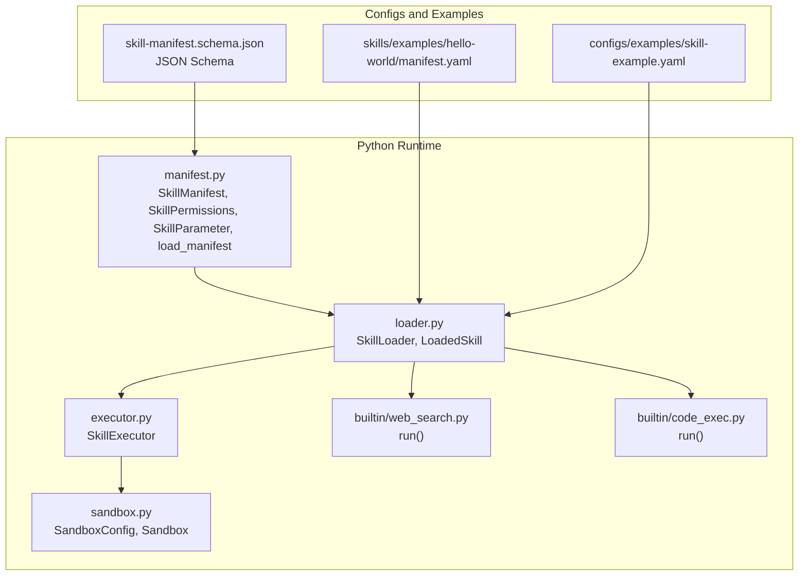
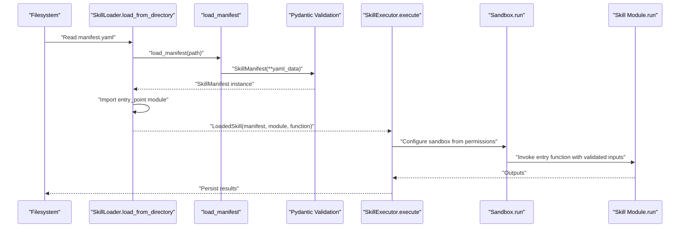
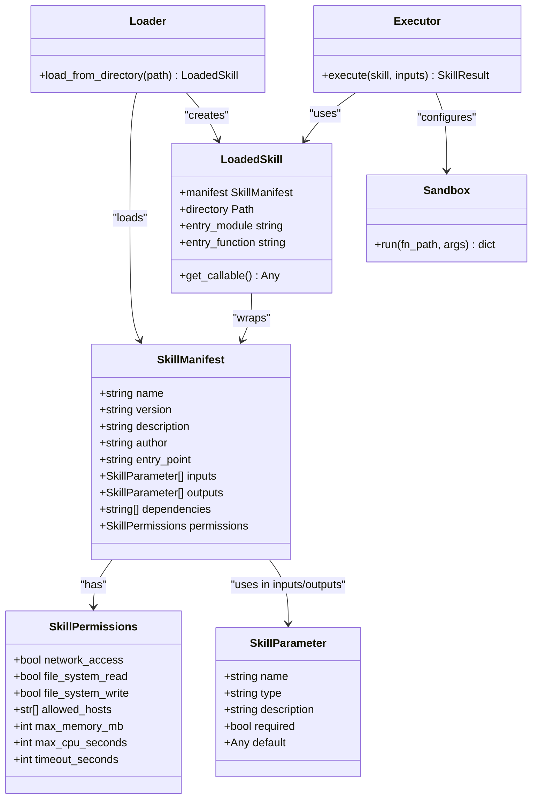
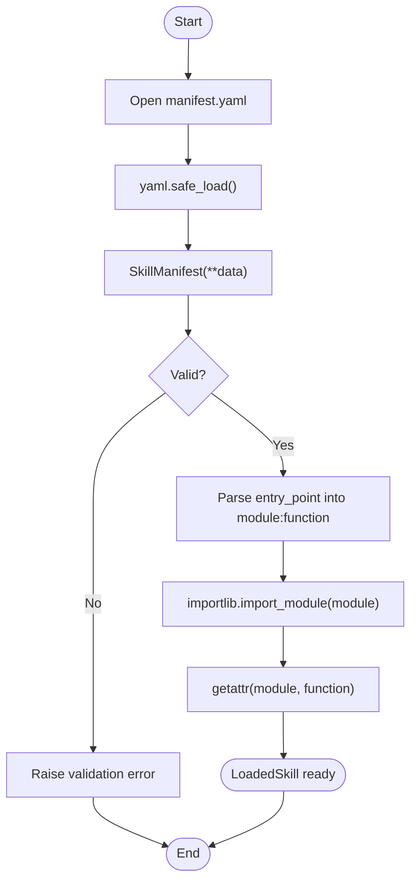
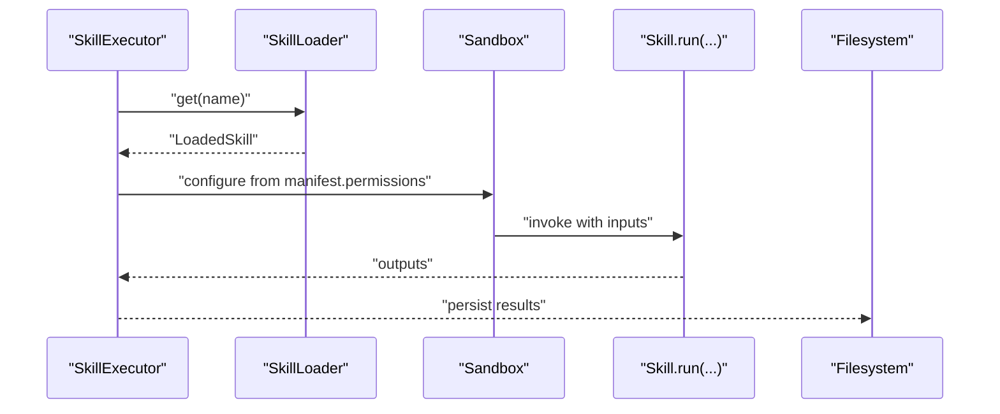
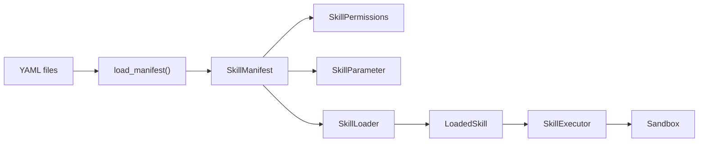

# Skill Manifest and Configuration

<cite>
**Referenced Files in This Document**
- [manifest.py](file://python/src/resolvenet/skills/manifest.py)
- [loader.py](file://python/src/resolvenet/skills/loader.py)
- [executor.py](file://python/src/resolvenet/skills/executor.py)
- [sandbox.py](file://python/src/resolvenet/skills/sandbox.py)
- [web_search.py](file://python/src/resolvenet/skills/builtin/web_search.py)
- [code_exec.py](file://python/src/resolvenet/skills/builtin/code_exec.py)
- [skill-manifest.schema.json](file://api/jsonschema/skill-manifest.schema.json)
- [manifest.yaml](file://skills/examples/hello-world/manifest.yaml)
- [skill-example.yaml](file://configs/examples/skill-example.yaml)
- [test_skill_loader.py](file://python/tests/unit/test_skill_loader.py)
</cite>

## Table of Contents
1. [Introduction](#introduction)
2. [Project Structure](#project-structure)
3. [Core Components](#core-components)
4. [Architecture Overview](#architecture-overview)
5. [Detailed Component Analysis](#detailed-component-analysis)
6. [Dependency Analysis](#dependency-analysis)
7. [Performance Considerations](#performance-considerations)
8. [Troubleshooting Guide](#troubleshooting-guide)
9. [Conclusion](#conclusion)
10. [Appendices](#appendices)

## Introduction
This document explains the skill manifest system used to define skill metadata, parameters, dependencies, and permissions. It covers the SkillManifest class structure, the SkillPermissions model, the SkillParameter model, and the manifest loading/validation process. It also provides practical examples, validation rules, and best practices for secure and robust skill configuration.

## Project Structure
The skill manifest system spans Python modules for parsing and validation, JSON Schema for external validation, and example manifests and built-in skills.

**Diagram sources**
- [manifest.py:11-58](file://python/src/resolvenet/skills/manifest.py#L11-L58)
- [loader.py:15-89](file://python/src/resolvenet/skills/loader.py#L15-L89)
- [executor.py:14-55](file://python/src/resolvenet/skills/executor.py#L14-L55)
- [sandbox.py:11-55](file://python/src/resolvenet/skills/sandbox.py#L11-L55)
- [web_search.py:8-24](file://python/src/resolvenet/skills/builtin/web_search.py#L8-L24)
- [code_exec.py:8-24](file://python/src/resolvenet/skills/builtin/code_exec.py#L8-L24)
- [skill-manifest.schema.json:1-74](file://api/jsonschema/skill-manifest.schema.json#L1-L74)
- [manifest.yaml:1-21](file://skills/examples/hello-world/manifest.yaml#L1-L21)
- [skill-example.yaml:1-23](file://configs/examples/skill-example.yaml#L1-L23)

**Section sources**
- [manifest.py:11-58](file://python/src/resolvenet/skills/manifest.py#L11-L58)
- [loader.py:15-89](file://python/src/resolvenet/skills/loader.py#L15-L89)
- [executor.py:14-55](file://python/src/resolvenet/skills/executor.py#L14-L55)
- [sandbox.py:11-55](file://python/src/resolvenet/skills/sandbox.py#L11-L55)
- [skill-manifest.schema.json:1-74](file://api/jsonschema/skill-manifest.schema.json#L1-L74)
- [manifest.yaml:1-21](file://skills/examples/hello-world/manifest.yaml#L1-L21)
- [skill-example.yaml:1-23](file://configs/examples/skill-example.yaml#L1-L23)

## Core Components
- SkillManifest: Root model representing a skill’s metadata, parameters, dependencies, and permissions.
- SkillPermissions: Declares runtime constraints such as network access, filesystem permissions, allowed hosts, and resource/time limits.
- SkillParameter: Defines inputs and outputs with name, type, description, required flag, and default value.
- load_manifest: Loads and validates a manifest from a YAML file using Pydantic.

Key characteristics:
- SkillManifest enforces required fields and defaults for optional fields.
- SkillPermissions provides sensible defaults for resource/time limits and disables broad access by default.
- SkillParameter supports common JSON-like types and defaults.

**Section sources**
- [manifest.py:11-58](file://python/src/resolvenet/skills/manifest.py#L11-L58)

## Architecture Overview
The manifest system integrates with the loader and executor to discover, validate, and run skills safely.

**Diagram sources**
- [loader.py:27-57](file://python/src/resolvenet/skills/loader.py#L27-L57)
- [manifest.py:47-58](file://python/src/resolvenet/skills/manifest.py#L47-L58)
- [executor.py:20-55](file://python/src/resolvenet/skills/executor.py#L20-L55)
- [sandbox.py:23-55](file://python/src/resolvenet/skills/sandbox.py#L23-L55)

## Detailed Component Analysis

### SkillManifest and Related Models
The manifest models are defined with Pydantic for automatic validation and serialization.

**Diagram sources**
- [manifest.py:11-58](file://python/src/resolvenet/skills/manifest.py#L11-L58)
- [loader.py:68-89](file://python/src/resolvenet/skills/loader.py#L68-L89)
- [executor.py:14-55](file://python/src/resolvenet/skills/executor.py#L14-L55)
- [sandbox.py:23-55](file://python/src/resolvenet/skills/sandbox.py#L23-L55)

**Section sources**
- [manifest.py:11-58](file://python/src/resolvenet/skills/manifest.py#L11-L58)
- [loader.py:68-89](file://python/src/resolvenet/skills/loader.py#L68-L89)

### Manifest Loading and Validation
- YAML parsing: The loader opens the manifest file and parses it using a safe YAML loader.
- Pydantic validation: The parsed dictionary is passed to SkillManifest constructor, which validates types, required fields, and defaults.
- Entry point resolution: The loader splits the entry_point into module and function parts and imports the function lazily.

**Diagram sources**
- [manifest.py:47-58](file://python/src/resolvenet/skills/manifest.py#L47-L58)
- [loader.py:27-57](file://python/src/resolvenet/skills/loader.py#L27-L57)

**Section sources**
- [manifest.py:47-58](file://python/src/resolvenet/skills/manifest.py#L47-L58)
- [loader.py:27-57](file://python/src/resolvenet/skills/loader.py#L27-L57)

### Practical Examples
- Minimal manifest example: Demonstrates basic fields and minimal permissions.
- Configuration example: Shows how a higher-level configuration references a manifest and entry point.

Examples:
- [manifest.yaml:1-21](file://skills/examples/hello-world/manifest.yaml#L1-L21)
- [skill-example.yaml:1-23](file://configs/examples/skill-example.yaml#L1-L23)

Notes:
- The minimal example omits optional fields; defaults apply during validation.
- The configuration example demonstrates how a system-level config references a manifest and entry point.

**Section sources**
- [manifest.yaml:1-21](file://skills/examples/hello-world/manifest.yaml#L1-L21)
- [skill-example.yaml:1-23](file://configs/examples/skill-example.yaml#L1-L23)

### Validation Rules and Schema Requirements
External JSON Schema defines strict rules for manifest fields and types.

Required fields:
- name, version, entry_point

Constraints:
- name: lowercase, digits, hyphens; starts with letter
- version: semantic versioning pattern
- type: enum of supported parameter types
- permissions: boolean defaults and integer defaults for limits

Defaults enforced by models:
- permissions defaults for resource/time limits and access flags
- parameter defaults for required and default values

Validation behavior:
- Missing required fields cause validation errors
- Type mismatches cause validation errors
- Unknown fields may be rejected depending on strictness

**Section sources**
- [skill-manifest.schema.json:6-72](file://api/jsonschema/skill-manifest.schema.json#L6-L72)
- [manifest.py:11-58](file://python/src/resolvenet/skills/manifest.py#L11-L58)

### Execution and Sandboxing
- SkillExecutor executes a LoadedSkill by invoking its entry function with validated inputs.
- Sandbox applies resource/time/network restrictions based on permissions.
- Built-in skills illustrate expected signatures and placeholders for future sandboxing.

**Diagram sources**
- [executor.py:20-55](file://python/src/resolvenet/skills/executor.py#L20-L55)
- [sandbox.py:23-55](file://python/src/resolvenet/skills/sandbox.py#L23-L55)
- [loader.py:59-61](file://python/src/resolvenet/skills/loader.py#L59-L61)

**Section sources**
- [executor.py:20-55](file://python/src/resolvenet/skills/executor.py#L20-L55)
- [sandbox.py:23-55](file://python/src/resolvenet/skills/sandbox.py#L23-L55)
- [web_search.py:8-24](file://python/src/resolvenet/skills/builtin/web_search.py#L8-L24)
- [code_exec.py:8-24](file://python/src/resolvenet/skills/builtin/code_exec.py#L8-L24)

## Dependency Analysis
- manifest.py depends on Pydantic for validation and YAML for parsing.
- loader.py depends on manifest.py and importlib for dynamic imports.
- executor.py depends on loader.py and sandbox.py for execution.
- sandbox.py defines the sandbox configuration and execution interface.
- Examples and configs depend on manifest.py for validation semantics.

**Diagram sources**
- [manifest.py:47-58](file://python/src/resolvenet/skills/manifest.py#L47-L58)
- [loader.py:27-57](file://python/src/resolvenet/skills/loader.py#L27-L57)
- [executor.py:20-55](file://python/src/resolvenet/skills/executor.py#L20-L55)
- [sandbox.py:23-55](file://python/src/resolvenet/skills/sandbox.py#L23-L55)

**Section sources**
- [manifest.py:47-58](file://python/src/resolvenet/skills/manifest.py#L47-L58)
- [loader.py:27-57](file://python/src/resolvenet/skills/loader.py#L27-L57)
- [executor.py:20-55](file://python/src/resolvenet/skills/executor.py#L20-L55)
- [sandbox.py:23-55](file://python/src/resolvenet/skills/sandbox.py#L23-L55)

## Performance Considerations
- Resource limits: Configure max_memory_mb, max_cpu_seconds, and timeout_seconds to prevent resource exhaustion.
- Network access: Enable network_access only when required; restrict allowed_hosts to minimize exposure.
- Filesystem access: Disable read/write permissions unless the skill requires persistent storage.
- Parameter defaults: Provide sensible defaults to reduce runtime branching and improve predictability.

[No sources needed since this section provides general guidance]

## Troubleshooting Guide
Common issues and resolutions:
- Missing required fields: Ensure name, version, and entry_point are present in the manifest.
- Type mismatches: Align field types with the schema (e.g., version must match semantic versioning pattern).
- Permission misuse: Start with minimal permissions and enable only what is necessary.
- Entry point errors: Verify the entry_point format and that the target function exists in the module.
- YAML parsing errors: Validate YAML syntax and indentation.

Validation references:
- Unit tests demonstrate default values and required fields.
- JSON Schema defines constraints and defaults.

**Section sources**
- [test_skill_loader.py:6-23](file://python/tests/unit/test_skill_loader.py#L6-L23)
- [skill-manifest.schema.json:6-72](file://api/jsonschema/skill-manifest.schema.json#L6-L72)

## Conclusion
The skill manifest system provides a structured, validated way to describe skills, their parameters, dependencies, and permissions. By combining Pydantic models, a JSON Schema, and a loader-execution pipeline, the system ensures safety and consistency. Follow the validation rules, keep permissions minimal, and leverage defaults to simplify configuration while maintaining security.

[No sources needed since this section summarizes without analyzing specific files]

## Appendices

### Best Practices for Security-Conscious Permission Declarations
- Principle of least privilege: Start with disabled network_access and filesystem permissions.
- Explicit host allowlisting: If network is required, enumerate allowed_hosts precisely.
- Tight resource caps: Lower max_memory_mb and timeout_seconds for compute-heavy tasks.
- Parameter validation: Define required fields and defaults to avoid runtime surprises.
- Example references:
  - Minimal manifest: [manifest.yaml:1-21](file://skills/examples/hello-world/manifest.yaml#L1-L21)
  - Higher-level configuration example: [skill-example.yaml:1-23](file://configs/examples/skill-example.yaml#L1-L23)

**Section sources**
- [manifest.yaml:1-21](file://skills/examples/hello-world/manifest.yaml#L1-L21)
- [skill-example.yaml:1-23](file://configs/examples/skill-example.yaml#L1-L23)