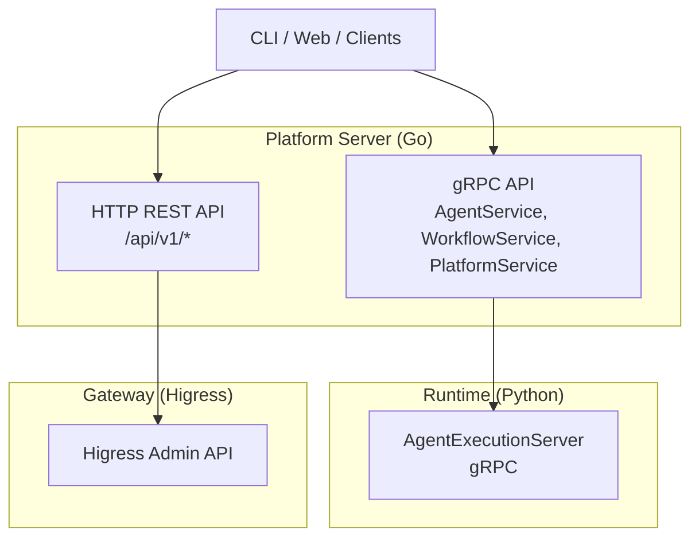
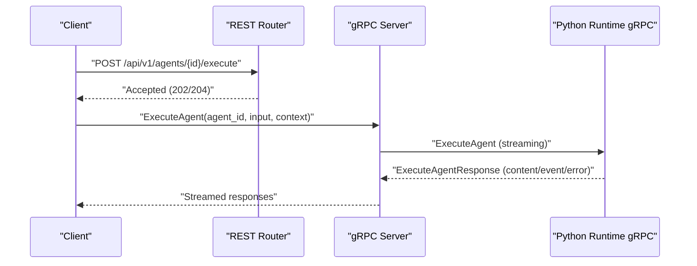
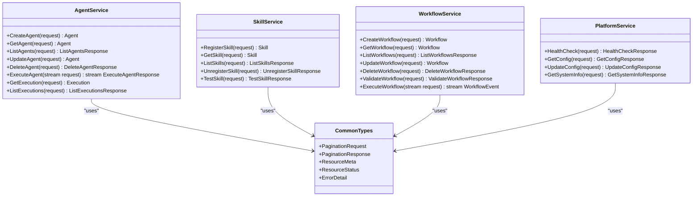
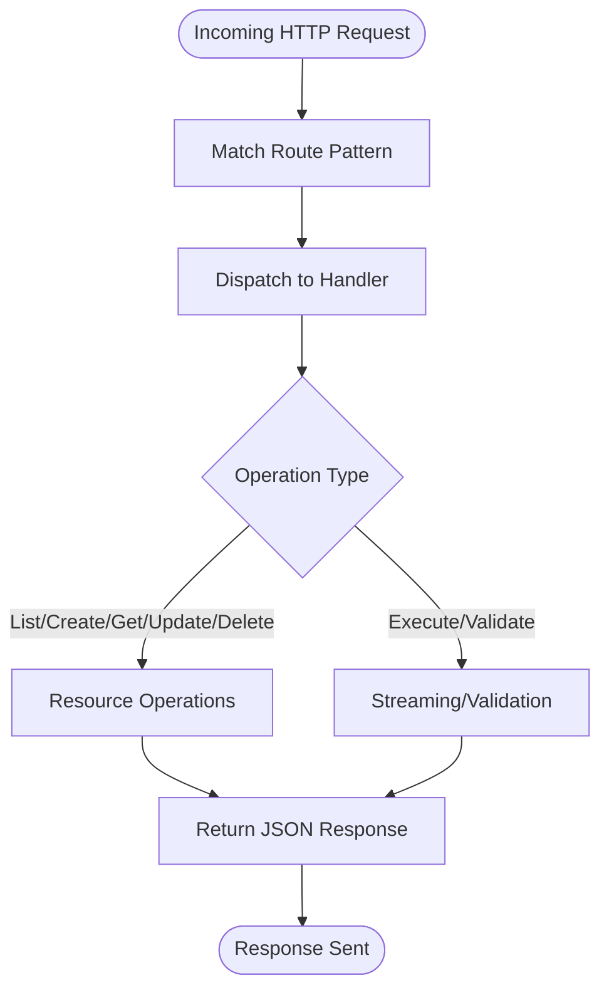
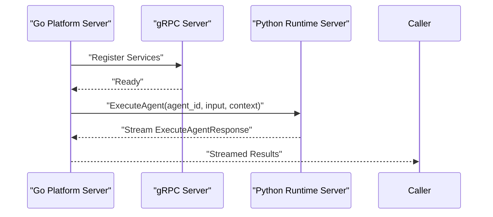
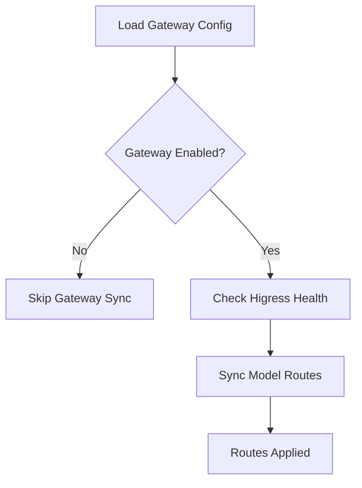
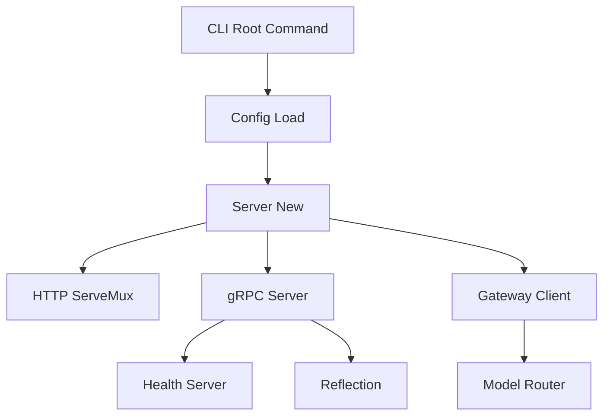

# API Architecture

<cite>
**Referenced Files in This Document**
- [agent.proto](file://api/proto/resolvenet/v1/agent.proto)
- [skill.proto](file://api/proto/resolvenet/v1/skill.proto)
- [workflow.proto](file://api/proto/resolvenet/v1/workflow.proto)
- [platform.proto](file://api/proto/resolvenet/v1/platform.proto)
- [common.proto](file://api/proto/resolvenet/v1/common.proto)
- [router.go](file://pkg/server/router.go)
- [server.go](file://pkg/server/server.go)
- [client.go](file://pkg/gateway/client.go)
- [model_router.go](file://pkg/gateway/model_router.go)
- [resolvenet.yaml](file://configs/resolvenet.yaml)
- [types.go](file://pkg/config/types.go)
- [main.go](file://cmd/resolvenet-server/main.go)
- [root.go](file://internal/cli/root.go)
- [server.py](file://python/src/resolvenet/runtime/server.py)
- [skill-manifest.schema.json](file://api/jsonschema/skill-manifest.schema.json)
</cite>

## Table of Contents
1. [Introduction](#introduction)
2. [Project Structure](#project-structure)
3. [Core Components](#core-components)
4. [Architecture Overview](#architecture-overview)
5. [Detailed Component Analysis](#detailed-component-analysis)
6. [Dependency Analysis](#dependency-analysis)
7. [Performance Considerations](#performance-considerations)
8. [Troubleshooting Guide](#troubleshooting-guide)
9. [Conclusion](#conclusion)
10. [Appendices](#appendices)

## Introduction
This document describes the API architecture of ResolveNet’s platform services, focusing on the Protocol Buffer-based design that enables cross-language communication between the Go platform server and the Python agent runtime. It explains the REST and gRPC endpoint architecture, API contracts for agents, skills, workflows, and platform operations, and how the system integrates with the Higress gateway. It also covers API versioning strategies, backward compatibility, evolution patterns, and the role of API schemas in enabling client SDK development.

## Project Structure
ResolveNet exposes two primary API surfaces:
- REST over HTTP for operational and resource management tasks
- gRPC for high-performance, streaming agent execution between platform services and the Python runtime

The API contracts are defined in Protocol Buffers under the v1 package, with shared types in a common module. The platform server initializes both HTTP and gRPC listeners and registers routes and services. The Higress gateway integration is present via a dedicated client and model router, with configuration managed centrally.

**Diagram sources**
- [router.go:10-55](file://pkg/server/router.go#L10-L55)
- [server.go:34-51](file://pkg/server/server.go#L34-L51)
- [client.go:9-30](file://pkg/gateway/client.go#L9-L30)
- [model_router.go:19-38](file://pkg/gateway/model_router.go#L19-L38)

**Section sources**
- [router.go:10-55](file://pkg/server/router.go#L10-L55)
- [server.go:34-51](file://pkg/server/server.go#L34-L51)
- [resolvenet.yaml:3-34](file://configs/resolvenet.yaml#L3-L34)
- [types.go:14-70](file://pkg/config/types.go#L14-L70)

## Core Components
- Protocol Buffer v1 API definitions for agents, skills, workflows, platform operations, and common types
- REST HTTP router for CRUD and operational endpoints
- gRPC server with health and reflection enabled
- Higress gateway client and model router for upstream LLM routing
- Configuration-driven server addresses and gateway settings
- Python runtime gRPC server for agent execution

Key responsibilities:
- Define canonical message schemas and service interfaces
- Expose REST endpoints for listing, creating, updating, deleting, and executing resources
- Stream execution results via gRPC for real-time feedback
- Integrate with Higress for dynamic model routing and upstream management

**Section sources**
- [agent.proto:11-29](file://api/proto/resolvenet/v1/agent.proto#L11-L29)
- [skill.proto:10-17](file://api/proto/resolvenet/v1/skill.proto#L10-L17)
- [workflow.proto:11-20](file://api/proto/resolvenet/v1/workflow.proto#L11-L20)
- [platform.proto:9-15](file://api/proto/resolvenet/v1/platform.proto#L9-L15)
- [router.go:10-55](file://pkg/server/router.go#L10-L55)
- [server.go:34-51](file://pkg/server/server.go#L34-L51)
- [client.go:9-30](file://pkg/gateway/client.go#L9-L30)
- [model_router.go:19-38](file://pkg/gateway/model_router.go#L19-L38)

## Architecture Overview
The platform server listens on both HTTP and gRPC ports. REST endpoints provide resource management and operational queries, while gRPC services enable high-throughput, streaming agent execution. The Python runtime exposes a gRPC server that the platform can call to execute agents. Higress integration is configured via the gateway client and model router, allowing dynamic model routing and upstream configuration.

**Diagram sources**
- [router.go:18-24](file://pkg/server/router.go#L18-L24)
- [agent.proto:23-28](file://api/proto/resolvenet/v1/agent.proto#L23-L28)
- [server.py:38-61](file://python/src/resolvenet/runtime/server.py#L38-L61)

## Detailed Component Analysis

### Protocol Buffer v1 API Contracts
The v1 API defines canonical message schemas and service interfaces for agents, skills, workflows, and platform operations. Shared types (pagination, resource metadata, status enums) are centralized in the common module.

**Diagram sources**
- [agent.proto:11-29](file://api/proto/resolvenet/v1/agent.proto#L11-L29)
- [skill.proto:10-17](file://api/proto/resolvenet/v1/skill.proto#L10-L17)
- [workflow.proto:11-20](file://api/proto/resolvenet/v1/workflow.proto#L11-L20)
- [platform.proto:9-15](file://api/proto/resolvenet/v1/platform.proto#L9-L15)
- [common.proto:9-49](file://api/proto/resolvenet/v1/common.proto#L9-L49)

**Section sources**
- [agent.proto:11-177](file://api/proto/resolvenet/v1/agent.proto#L11-L177)
- [skill.proto:10-101](file://api/proto/resolvenet/v1/skill.proto#L10-L101)
- [workflow.proto:11-145](file://api/proto/resolvenet/v1/workflow.proto#L11-L145)
- [platform.proto:9-61](file://api/proto/resolvenet/v1/platform.proto#L9-L61)
- [common.proto:9-49](file://api/proto/resolvenet/v1/common.proto#L9-L49)

### REST Endpoint Architecture
The REST router exposes HTTP endpoints for:
- Health and system info
- Agent lifecycle and execution
- Skill registration and testing
- Workflow creation, validation, and execution
- RAG collections and ingestion/query
- Model management
- Configuration retrieval and update

These endpoints return JSON responses and are registered on the HTTP server.

**Diagram sources**
- [router.go:10-55](file://pkg/server/router.go#L10-L55)

**Section sources**
- [router.go:10-55](file://pkg/server/router.go#L10-L55)

### gRPC Endpoint Architecture
The gRPC server is initialized with health checking and reflection support. Services exposed include:
- AgentService for agent lifecycle and streaming execution
- WorkflowService for workflow definition and execution events
- PlatformService for health, config, and system info

The Python runtime exposes a gRPC server for agent execution, enabling the platform to delegate execution to the runtime.

**Diagram sources**
- [server.go:34-51](file://pkg/server/server.go#L34-L51)
- [agent.proto:23-28](file://api/proto/resolvenet/v1/agent.proto#L23-L28)
- [server.py:38-61](file://python/src/resolvenet/runtime/server.py#L38-L61)

**Section sources**
- [server.go:34-51](file://pkg/server/server.go#L34-L51)
- [agent.proto:11-29](file://api/proto/resolvenet/v1/agent.proto#L11-L29)
- [server.py:11-61](file://python/src/resolvenet/runtime/server.py#L11-L61)

### Higress Gateway Integration
The gateway client communicates with the Higress admin API, and the model router synchronizes model routes. Configuration controls whether the gateway is enabled and where the admin URL resides.

**Diagram sources**
- [client.go:25-30](file://pkg/gateway/client.go#L25-L30)
- [model_router.go:33-38](file://pkg/gateway/model_router.go#L33-L38)
- [resolvenet.yaml:25-27](file://configs/resolvenet.yaml#L25-L27)
- [types.go:57-61](file://pkg/config/types.go#L57-L61)

**Section sources**
- [client.go:9-30](file://pkg/gateway/client.go#L9-L30)
- [model_router.go:19-38](file://pkg/gateway/model_router.go#L19-L38)
- [resolvenet.yaml:25-27](file://configs/resolvenet.yaml#L25-L27)
- [types.go:57-61](file://pkg/config/types.go#L57-L61)

### Typical API Interactions and Protobuf Messages
- Agent execution:
  - REST: POST /api/v1/agents/{id}/execute triggers execution
  - gRPC: ExecuteAgent with ExecuteAgentRequest streams ExecuteAgentResponse
  - Messages: ExecuteAgentRequest, ExecuteAgentResponse, ExecutionEvent, ExecutionError
- Skill lifecycle:
  - REST: POST /api/v1/skills registers a skill
  - gRPC: RegisterSkill/RegisterSkillRequest returns Skill
- Workflow lifecycle:
  - REST: POST /api/v1/workflows creates a workflow
  - gRPC: ExecuteWorkflow streams WorkflowEvent messages
  - Messages: Workflow, FaultTree, FTAEvent, FTAGate, WorkflowEvent

**Section sources**
- [router.go:18-39](file://pkg/server/router.go#L18-L39)
- [agent.proto:97-122](file://api/proto/resolvenet/v1/agent.proto#L97-L122)
- [skill.proto:66-100](file://api/proto/resolvenet/v1/skill.proto#L66-L100)
- [workflow.proto:141-145](file://api/proto/resolvenet/v1/workflow.proto#L141-L145)

### API Versioning Strategies, Backward Compatibility, and Evolution
- Package scoping: All API definitions reside under resolvenet.v1, establishing a versioned package namespace suitable for future evolution
- Backward compatibility: Enum additions should preserve UNSPECIFIED as the zero value; new optional fields should not break existing clients
- Evolution patterns:
  - Add new RPCs or messages alongside existing ones
  - Mark deprecated fields with deprecation notices in comments
  - Maintain stable field numbers for core messages
  - Use google.protobuf.Struct for flexible configuration and context payloads
- Client SDK development: Generated stubs from the v1 proto files enable cross-language SDKs for Go, Python, and others

**Section sources**
- [agent.proto:32-39](file://api/proto/resolvenet/v1/agent.proto#L32-L39)
- [workflow.proto:53-79](file://api/proto/resolvenet/v1/workflow.proto#L53-L79)
- [platform.proto:29](file://api/proto/resolvenet/v1/platform.proto#L29)
- [common.proto:42-48](file://api/proto/resolvenet/v1/common.proto#L42-L48)

### Role of API Schemas in Enabling Client SDK Development
- Protocol Buffers define strongly-typed interfaces and messages for cross-language clients
- JSON Schema validates skill manifests, ensuring consistent skill packaging and permissions
- Together, these schemas enable robust client SDKs, automated validation, and predictable integrations

**Section sources**
- [skill-manifest.schema.json:1-74](file://api/jsonschema/skill-manifest.schema.json#L1-L74)

## Dependency Analysis
The platform server composes HTTP and gRPC capabilities, with configuration-driven addresses and optional gateway integration. The CLI provides a persistent server flag and subcommands for interacting with the platform.

**Diagram sources**
- [root.go:33-52](file://internal/cli/root.go#L33-L52)
- [main.go:24-34](file://cmd/resolvenet-server/main.go#L24-L34)
- [server.go:28-51](file://pkg/server/server.go#L28-L51)
- [client.go:16-23](file://pkg/gateway/client.go#L16-L23)
- [model_router.go:25-31](file://pkg/gateway/model_router.go#L25-L31)

**Section sources**
- [root.go:33-52](file://internal/cli/root.go#L33-L52)
- [main.go:24-34](file://cmd/resolvenet-server/main.go#L24-L34)
- [server.go:28-51](file://pkg/server/server.go#L28-L51)
- [client.go:16-23](file://pkg/gateway/client.go#L16-L23)
- [model_router.go:25-31](file://pkg/gateway/model_router.go#L25-L31)

## Performance Considerations
- Prefer gRPC for streaming and high-throughput scenarios (agent execution, workflow events)
- Use pagination messages for list operations to limit payload sizes
- Employ structured context and parameters via google.protobuf.Struct for flexibility without schema churn
- Keep optional fields minimal to reduce serialization overhead

## Troubleshooting Guide
- Health checks:
  - REST: GET /api/v1/health returns platform health status
  - gRPC: Health service available for health probing
- System info:
  - REST: GET /api/v1/system/info returns version and build metadata
- Gateway connectivity:
  - Verify gateway admin URL and enabled flag in configuration
  - Use gateway client health checks and model route synchronization
- Execution streaming:
  - Ensure the Python runtime gRPC server is reachable at the configured address
  - Confirm ExecuteAgentRequest parameters and context are well-formed

**Section sources**
- [router.go:12-16](file://pkg/server/router.go#L12-L16)
- [server.go:37-42](file://pkg/server/server.go#L37-L42)
- [resolvenet.yaml:25-27](file://configs/resolvenet.yaml#L25-L27)
- [types.go:57-61](file://pkg/config/types.go#L57-L61)
- [server.py:18-31](file://python/src/resolvenet/runtime/server.py#L18-L31)

## Conclusion
ResolveNet’s API architecture leverages Protocol Buffers for a stable, versioned contract and combines REST for operational tasks with gRPC for efficient, streaming agent execution. The Higress integration supports dynamic model routing, while configuration-driven settings enable flexible deployments. The presence of JSON Schema for skill manifests further strengthens the developer experience and ensures consistent skill packaging across the platform.

## Appendices
- Configuration keys and defaults are defined in the central configuration file and typed configuration structures
- The CLI provides a persistent server address flag and subcommands for interacting with platform services

**Section sources**
- [resolvenet.yaml:1-34](file://configs/resolvenet.yaml#L1-L34)
- [types.go:14-70](file://pkg/config/types.go#L14-L70)
- [root.go:36-41](file://internal/cli/root.go#L36-L41)