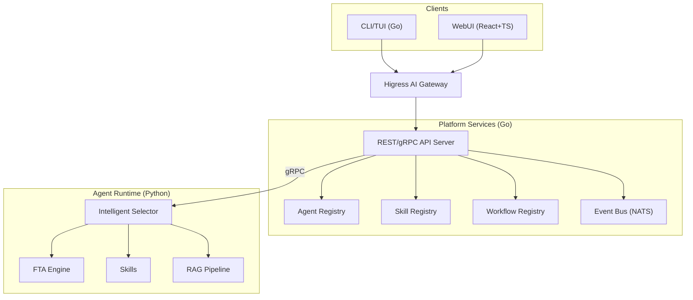
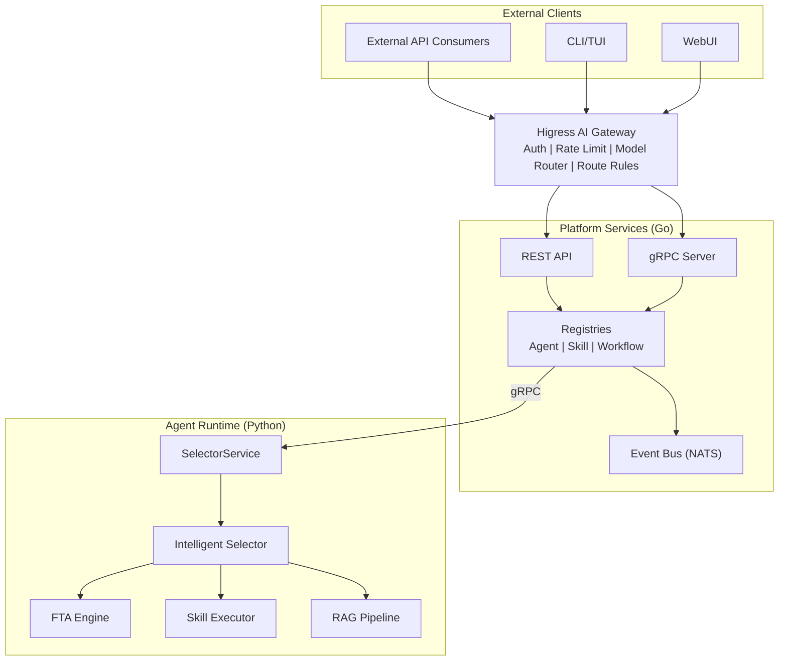
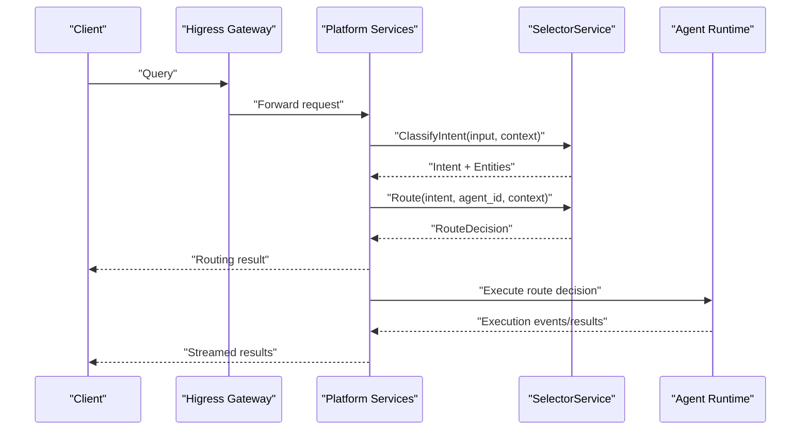
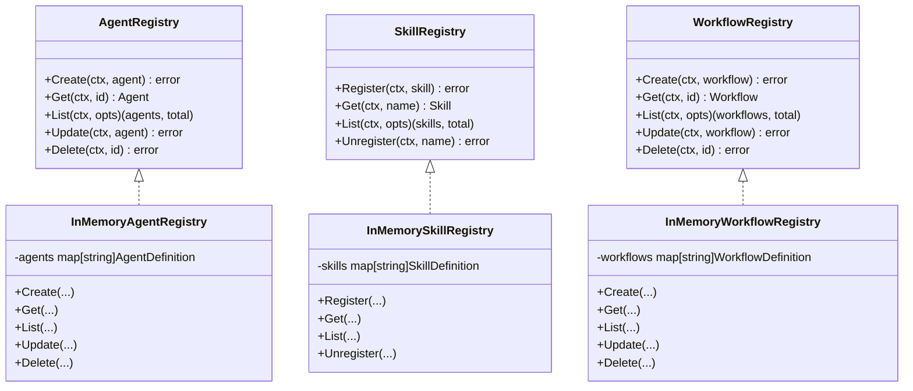
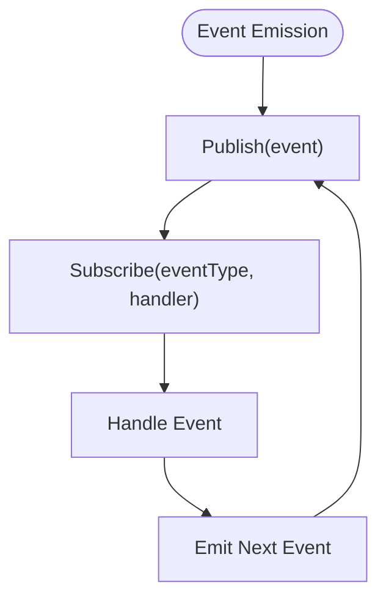
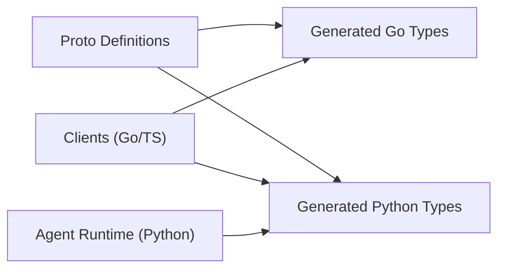
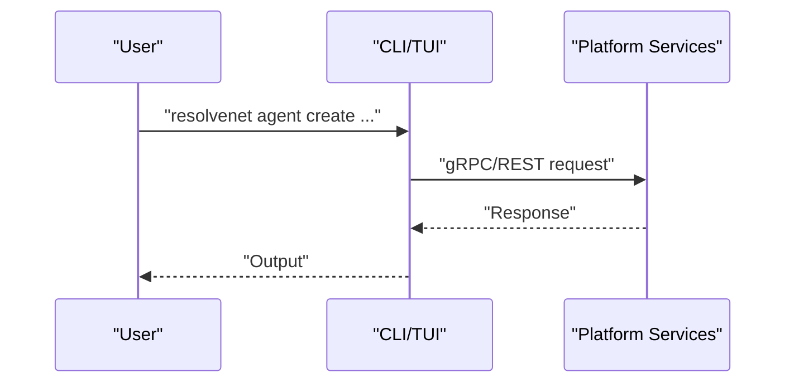
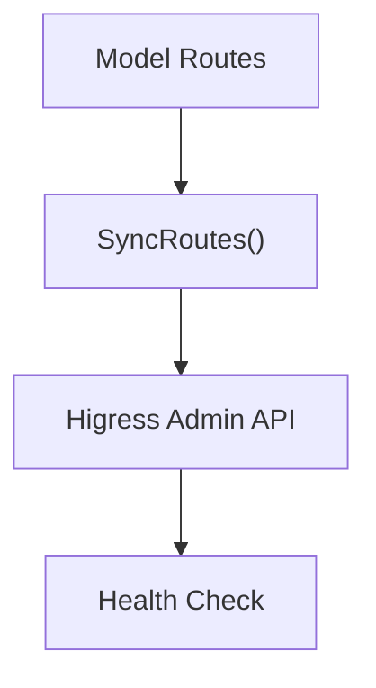
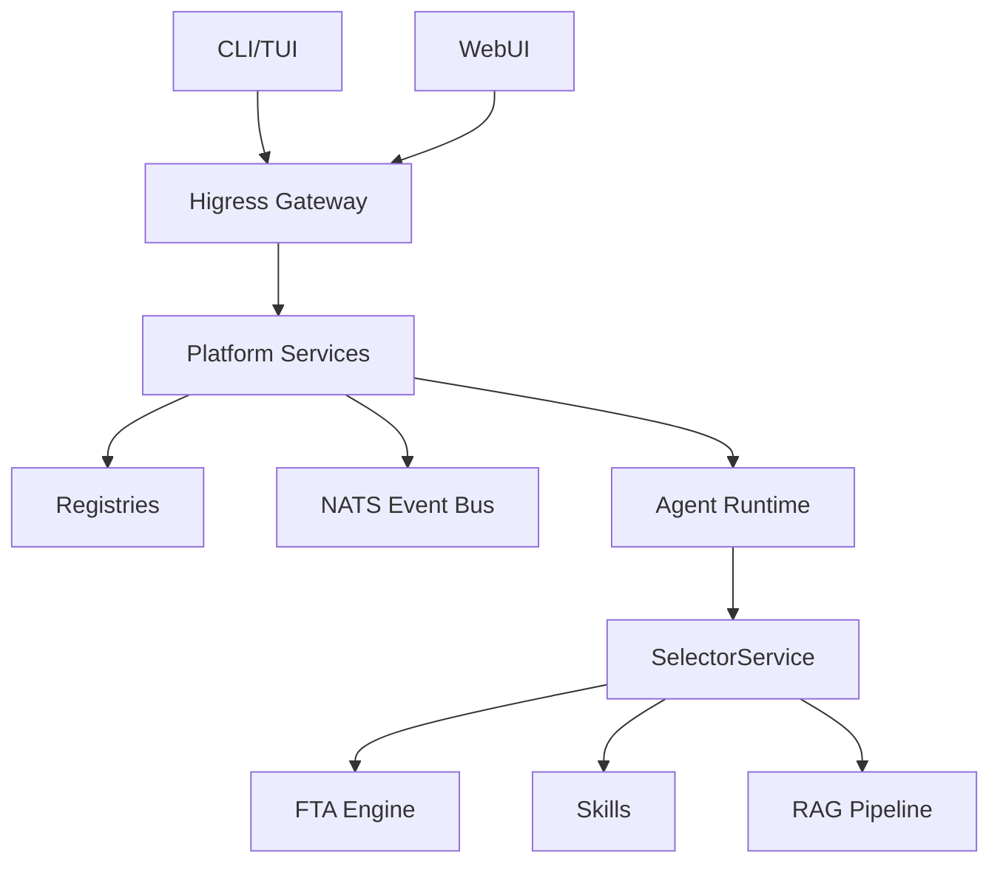

# Architecture and Design

<cite>
**Referenced Files in This Document**
- [README.md](file://README.md)
- [main.go](file://cmd/resolvenet-server/main.go)
- [main.go](file://cmd/resolvenet-cli/main.go)
- [root.go](file://internal/cli/root.go)
- [server.go](file://pkg/server/server.go)
- [platform.proto](file://api/proto/resolvenet/v1/platform.proto)
- [agent.proto](file://api/proto/resolvenet/v1/agent.proto)
- [skill.proto](file://api/proto/resolvenet/v1/skill.proto)
- [workflow.proto](file://api/proto/resolvenet/v1/workflow.proto)
- [selector.proto](file://api/proto/resolvenet/v1/selector.proto)
- [client.go](file://pkg/gateway/client.go)
- [model_router.go](file://pkg/gateway/model_router.go)
- [agent.go](file://pkg/registry/agent.go)
- [skill.go](file://pkg/registry/skill.go)
- [workflow.go](file://pkg/registry/workflow.go)
- [nats.go](file://pkg/event/nats.go)
- [store.go](file://pkg/store/store.go)
</cite>

## Table of Contents
1. [Introduction](#introduction)
2. [Project Structure](#project-structure)
3. [Core Components](#core-components)
4. [Architecture Overview](#architecture-overview)
5. [Detailed Component Analysis](#detailed-component-analysis)
6. [Dependency Analysis](#dependency-analysis)
7. [Performance Considerations](#performance-considerations)
8. [Troubleshooting Guide](#troubleshooting-guide)
9. [Conclusion](#conclusion)
10. [Appendices](#appendices)

## Introduction
ResolveNet is a CNCF-grade Mega Agent platform integrating Agent Skills, Fault Tree Analysis (FTA) Workflows, Retrieval-Augmented Generation (RAG), and an Intelligent Selector that dynamically routes requests among these capabilities. It is built on AgentScope for agent orchestration and Higress for AI gateway functionality. The system supports cloud-native deployment, event-driven architecture using NATS, and a registry pattern for centralized management of agents, skills, and workflows. Cross-cutting concerns include security, observability, and scalability, with Protocol Buffer-based API contracts enabling cross-language communication.

## Project Structure
ResolveNet organizes functionality into distinct layers:
- Client Interfaces: CLI/TUI (Go) and WebUI (React+TS)
- Higress AI Gateway: AI gateway for authentication, rate limiting, and model routing
- Platform Services (Go): REST/gRPC API server, registries, configuration management, and event bus
- Agent Runtime (Python): Agent execution, Intelligent Selector, FTA engine, skills, and RAG pipeline
- Protobuf Contracts: Cross-language API definitions for clients and services

**Diagram sources**
- [README.md:14-46](file://README.md#L14-L46)
- [main.go:1-56](file://cmd/resolvenet-server/main.go#L1-L56)
- [server.go:19-52](file://pkg/server/server.go#L19-L52)
- [agent.go:21-28](file://pkg/registry/agent.go#L21-L28)
- [skill.go:22-28](file://pkg/registry/skill.go#L22-L28)
- [workflow.go:19-26](file://pkg/registry/workflow.go#L19-L26)
- [nats.go:8-14](file://pkg/event/nats.go#L8-L14)
- [client.go:9-14](file://pkg/gateway/client.go#L9-L14)

**Section sources**
- [README.md:10-184](file://README.md#L10-L184)
- [main.go:1-56](file://cmd/resolvenet-server/main.go#L1-L56)
- [server.go:19-52](file://pkg/server/server.go#L19-L52)

## Core Components
- Platform Services (Go)
  - REST/gRPC API server hosting health checks, configuration, and resource management
  - Registries for agents, skills, and workflows
  - Event bus for decoupled inter-component communication
- Higress AI Gateway
  - Authentication, rate limiting, model routing, and route rules
  - Client-facing entry point for external consumers
- Agent Runtime (Python)
  - Intelligent Selector orchestrating intent classification, context enrichment, and routing decisions
  - FTA Engine evaluating fault trees with configurable evaluators
  - Skills subsystem with sandboxed execution and manifest-based configuration
  - RAG Pipeline for document ingestion, vector indexing, and retrieval
- Protocol Buffer Contracts
  - Cross-language API definitions for platform services, agent management, skill management, workflow orchestration, and selector services

**Section sources**
- [README.md:10-58](file://README.md#L10-L58)
- [platform.proto:9-15](file://api/proto/resolvenet/v1/platform.proto#L9-L15)
- [agent.proto:11-29](file://api/proto/resolvenet/v1/agent.proto#L11-L29)
- [skill.proto:10-17](file://api/proto/resolvenet/v1/skill.proto#L10-L17)
- [workflow.proto:11-20](file://api/proto/resolvenet/v1/workflow.proto#L11-L20)
- [selector.proto:10-14](file://api/proto/resolvenet/v1/selector.proto#L10-L14)

## Architecture Overview
ResolveNet employs a microservices pattern with clear service boundaries:
- Clients (CLI/TUI/WebUI) interact with the Higress AI Gateway
- Gateway forwards requests to Platform Services (Go) via REST/gRPC
- Platform Services manage registries and emit events via NATS
- Agent Runtime (Python) receives routing decisions and executes FTA, skills, or RAG

**Diagram sources**
- [README.md:14-46](file://README.md#L14-L46)
- [server.go:34-51](file://pkg/server/server.go#L34-L51)
- [agent.proto:11-29](file://api/proto/resolvenet/v1/agent.proto#L11-L29)
- [selector.proto:10-14](file://api/proto/resolvenet/v1/selector.proto#L10-L14)
- [nats.go:8-14](file://pkg/event/nats.go#L8-L14)

## Detailed Component Analysis

### Intelligent Routing Layer
The Intelligent Selector performs intent classification and routes requests to FTA workflows, agent skills, RAG pipelines, or direct LLM responses. It uses configurable strategies (LLM, rule-based, hybrid) and emits a structured RouteDecision.

**Diagram sources**
- [selector.proto:16-39](file://api/proto/resolvenet/v1/selector.proto#L16-L39)
- [agent.proto:146-162](file://api/proto/resolvenet/v1/agent.proto#L146-L162)

**Section sources**
- [selector.proto:10-14](file://api/proto/resolvenet/v1/selector.proto#L10-L14)
- [agent.proto:146-162](file://api/proto/resolvenet/v1/agent.proto#L146-L162)

### Registry Pattern
ResolveNet centralizes management of agents, skills, and workflows through dedicated registries with in-memory implementations for development and extensible storage backends.

**Diagram sources**
- [agent.go:21-28](file://pkg/registry/agent.go#L21-L28)
- [agent.go:30-41](file://pkg/registry/agent.go#L30-L41)
- [skill.go:22-28](file://pkg/registry/skill.go#L22-L28)
- [skill.go:30-38](file://pkg/registry/skill.go#L30-L38)
- [workflow.go:19-26](file://pkg/registry/workflow.go#L19-L26)
- [workflow.go:28-36](file://pkg/registry/workflow.go#L28-L36)

**Section sources**
- [agent.go:21-28](file://pkg/registry/agent.go#L21-L28)
- [skill.go:22-28](file://pkg/registry/skill.go#L22-L28)
- [workflow.go:19-26](file://pkg/registry/workflow.go#L19-L26)

### Event-Driven Architecture with NATS
Components communicate asynchronously via NATS JetStream, enabling loose coupling and scalability. The event bus supports publishing and subscribing to typed events.

**Diagram sources**
- [nats.go:27-39](file://pkg/event/nats.go#L27-L39)

**Section sources**
- [nats.go:8-14](file://pkg/event/nats.go#L8-L14)
- [nats.go:27-39](file://pkg/event/nats.go#L27-L39)

### Protocol Buffer-Based API Contracts
Cross-language APIs are defined using Protocol Buffers, ensuring consistent serialization and enabling clients in multiple languages to interact with Platform Services and the Agent Runtime.

**Diagram sources**
- [platform.proto:1-61](file://api/proto/resolvenet/v1/platform.proto#L1-L61)
- [agent.proto:1-177](file://api/proto/resolvenet/v1/agent.proto#L1-L177)
- [skill.proto:1-101](file://api/proto/resolvenet/v1/skill.proto#L1-L101)
- [workflow.proto:1-145](file://api/proto/resolvenet/v1/workflow.proto#L1-L145)
- [selector.proto:1-40](file://api/proto/resolvenet/v1/selector.proto#L1-L40)

**Section sources**
- [platform.proto:9-15](file://api/proto/resolvenet/v1/platform.proto#L9-L15)
- [agent.proto:11-29](file://api/proto/resolvenet/v1/agent.proto#L11-L29)
- [skill.proto:10-17](file://api/proto/resolvenet/v1/skill.proto#L10-L17)
- [workflow.proto:11-20](file://api/proto/resolvenet/v1/workflow.proto#L11-L20)
- [selector.proto:10-14](file://api/proto/resolvenet/v1/selector.proto#L10-L14)

### Client Interfaces
- CLI/TUI (Go)
  - Entry point initializes configuration and subcommands for agents, skills, workflows, RAG, configuration, version, dashboard, and serve commands
- WebUI (React+TS)
  - Provides management console and visual FTA workflow editor

**Diagram sources**
- [root.go:19-51](file://internal/cli/root.go#L19-L51)
- [main.go:1-14](file://cmd/resolvenet-cli/main.go#L1-L14)

**Section sources**
- [root.go:19-51](file://internal/cli/root.go#L19-L51)
- [main.go:1-14](file://cmd/resolvenet-cli/main.go#L1-L14)

### Higress AI Gateway
- Manages authentication, rate limiting, and model routing
- Synchronizes routes with upstream providers
- Exposes health checks for monitoring

**Diagram sources**
- [client.go:25-30](file://pkg/gateway/client.go#L25-L30)
- [model_router.go:33-38](file://pkg/gateway/model_router.go#L33-L38)

**Section sources**
- [client.go:9-14](file://pkg/gateway/client.go#L9-L14)
- [model_router.go:8-17](file://pkg/gateway/model_router.go#L8-L17)

## Dependency Analysis
ResolveNet’s architecture exhibits clear separation of concerns:
- Platform Services depend on registries and the event bus
- Agent Runtime depends on SelectorService for routing decisions
- Clients depend on Platform Services via REST/gRPC
- Gateway depends on upstream providers for model routing

**Diagram sources**
- [README.md:14-46](file://README.md#L14-L46)
- [server.go:34-51](file://pkg/server/server.go#L34-L51)
- [agent.proto:11-29](file://api/proto/resolvenet/v1/agent.proto#L11-L29)
- [selector.proto:10-14](file://api/proto/resolvenet/v1/selector.proto#L10-L14)

**Section sources**
- [server.go:34-51](file://pkg/server/server.go#L34-L51)
- [agent.proto:11-29](file://api/proto/resolvenet/v1/agent.proto#L11-L29)
- [selector.proto:10-14](file://api/proto/resolvenet/v1/selector.proto#L10-L14)

## Performance Considerations
- Microservices and event-driven design enable horizontal scaling and improved resilience
- Protocol Buffers reduce serialization overhead compared to JSON
- NATS JetStream supports high-throughput asynchronous messaging
- gRPC enables efficient streaming for long-running agent executions
- Cloud-native deployment via Docker and Kubernetes facilitates auto-scaling and resource management

[No sources needed since this section provides general guidance]

## Troubleshooting Guide
- Health Checks
  - Platform Services expose health endpoints for system status and component health
- Logging and Observability
  - Structured logging and OpenTelemetry instrumentation are integrated across services
- Graceful Shutdown
  - Servers support graceful shutdown on interrupt signals
- Gateway Connectivity
  - Gateway health checks and route synchronization are available for diagnostics

**Section sources**
- [platform.proto:17-27](file://api/proto/resolvenet/v1/platform.proto#L17-L27)
- [main.go:36-52](file://cmd/resolvenet-server/main.go#L36-L52)
- [client.go:25-30](file://pkg/gateway/client.go#L25-L30)
- [model_router.go:33-38](file://pkg/gateway/model_router.go#L33-L38)

## Conclusion
ResolveNet’s architecture combines a robust microservices foundation with an Intelligent Selector that dynamically routes tasks to FTA workflows, agent skills, RAG pipelines, or direct LLM responses. The use of Protocol Buffers ensures cross-language compatibility, while NATS enables scalable, event-driven communication. Centralized registries streamline management of agents, skills, and workflows, and the Higress AI Gateway provides secure, model-aware ingress. Together, these components deliver a cloud-native, enterprise-grade Mega Agent platform.

[No sources needed since this section summarizes without analyzing specific files]

## Appendices

### Technology Stack Choices and Architectural Decisions
- Go for Platform Services: strong concurrency, performance, and ecosystem maturity for building reliable backend services
- Python for Agent Runtime: rich ecosystem for AI/ML, agent orchestration, and scientific computing
- Protocol Buffers: deterministic serialization, schema evolution, and multi-language support
- NATS JetStream: high-performance, durable pub/sub for event-driven workflows
- Higress: enterprise-grade AI gateway with authentication, rate limiting, and model routing
- Kubernetes/Helm/Docker: cloud-native deployment, scalability, and operational simplicity

[No sources needed since this section provides general guidance]