# Data Flow Patterns

<cite>
**Referenced Files in This Document**
- [cmd/resolvenet-server/main.go](file://cmd/resolvenet-server/main.go)
- [pkg/server/server.go](file://pkg/server/server.go)
- [pkg/server/router.go](file://pkg/server/router.go)
- [pkg/config/config.go](file://pkg/config/config.go)
- [pkg/config/types.go](file://pkg/config/types.go)
- [configs/resolvenet.yaml](file://configs/resolvenet.yaml)
- [pkg/event/nats.go](file://pkg/event/nats.go)
- [pkg/gateway/client.go](file://pkg/gateway/client.go)
- [pkg/gateway/model_router.go](file://pkg/gateway/model_router.go)
- [pkg/store/postgres/postgres.go](file://pkg/store/postgres/postgres.go)
- [pkg/store/redis/redis.go](file://pkg/store/redis/redis.go)
- [pkg/server/middleware/auth.go](file://pkg/server/middleware/auth.go)
- [pkg/server/middleware/logging.go](file://pkg/server/middleware/logging.go)
- [pkg/server/middleware/tracing.go](file://pkg/server/middleware/tracing.go)
</cite>

## Table of Contents
1. [Introduction](#introduction)
2. [Project Structure](#project-structure)
3. [Core Components](#core-components)
4. [Architecture Overview](#architecture-overview)
5. [Detailed Component Analysis](#detailed-component-analysis)
6. [Dependency Analysis](#dependency-analysis)
7. [Performance Considerations](#performance-considerations)
8. [Troubleshooting Guide](#troubleshooting-guide)
9. [Conclusion](#conclusion)

## Introduction
This document describes the data flow patterns across the ResolveNet system, focusing on:
- Event-driven architecture using NATS for loose coupling
- Request-response patterns between client interfaces and platform services
- Streaming data flows for real-time updates and progress notifications
- Configuration propagation from YAML files through environment variables to runtime instances
- Persistence patterns using PostgreSQL for state and Redis for caching
- Error propagation, retry mechanisms, and failure handling
- The role of the gateway in request routing and load balancing

## Project Structure
ResolveNet consists of:
- CLI and server entry points
- HTTP/gRPC server with REST endpoints
- Configuration loading via Viper (YAML + environment variables)
- Event bus using NATS (JetStream)
- Persistence stores for PostgreSQL and Redis
- Optional gateway integration for model routing
- Middleware for auth, logging, and tracing

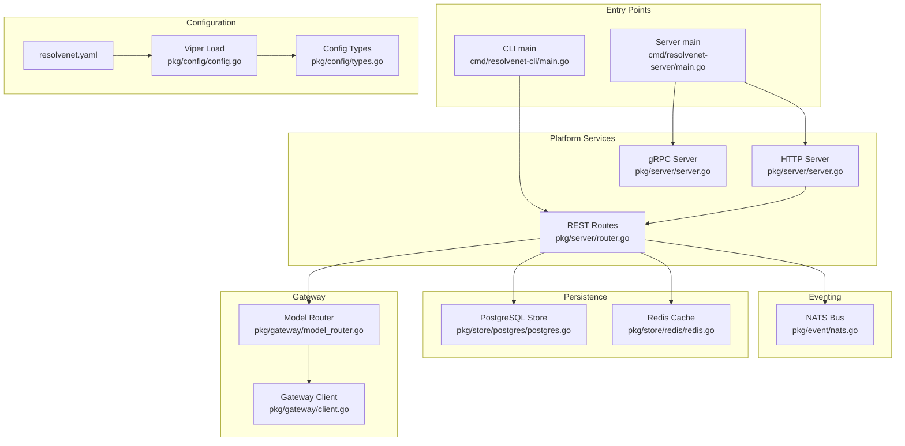

**Diagram sources**
- [cmd/resolvenet-server/main.go:16-55](file://cmd/resolvenet-server/main.go#L16-L55)
- [pkg/server/server.go:27-52](file://pkg/server/server.go#L27-L52)
- [pkg/server/router.go:10-55](file://pkg/server/router.go#L10-L55)
- [pkg/config/config.go:10-62](file://pkg/config/config.go#L10-L62)
- [pkg/config/types.go:3-70](file://pkg/config/types.go#L3-L70)
- [configs/resolvenet.yaml:1-34](file://configs/resolvenet.yaml#L1-L34)
- [pkg/event/nats.go:8-46](file://pkg/event/nats.go#L8-L46)
- [pkg/store/postgres/postgres.go:9-45](file://pkg/store/postgres/postgres.go#L9-L45)
- [pkg/store/redis/redis.go:8-37](file://pkg/store/redis/redis.go#L8-L37)
- [pkg/gateway/client.go:9-31](file://pkg/gateway/client.go#L9-L31)
- [pkg/gateway/model_router.go:8-39](file://pkg/gateway/model_router.go#L8-L39)

**Section sources**
- [cmd/resolvenet-server/main.go:16-55](file://cmd/resolvenet-server/main.go#L16-L55)
- [pkg/server/server.go:27-52](file://pkg/server/server.go#L27-L52)
- [pkg/server/router.go:10-55](file://pkg/server/router.go#L10-L55)
- [pkg/config/config.go:10-62](file://pkg/config/config.go#L10-L62)
- [pkg/config/types.go:3-70](file://pkg/config/types.go#L3-L70)
- [configs/resolvenet.yaml:1-34](file://configs/resolvenet.yaml#L1-L34)

## Core Components
- Configuration system: Loads YAML files from multiple paths, merges environment variables (with RESOLVENET_ prefix and dot-to-underscore replacement), and unmarshals into typed config.
- HTTP/gRPC server: Initializes gRPC with health service and reflection; initializes HTTP mux with REST endpoints; runs both concurrently.
- REST router: Defines endpoints for agents, skills, workflows, RAG, models, and configuration stubs.
- Event bus: NATS-based event bus abstraction for publishing and subscribing to events.
- Persistence: PostgreSQL store and Redis cache abstractions with health and lifecycle hooks.
- Gateway: Optional Higress integration for model routing and health checks.
- Middleware: Authentication, logging, and tracing placeholders.

**Section sources**
- [pkg/config/config.go:10-62](file://pkg/config/config.go#L10-L62)
- [pkg/config/types.go:3-70](file://pkg/config/types.go#L3-L70)
- [pkg/server/server.go:27-52](file://pkg/server/server.go#L27-L52)
- [pkg/server/router.go:10-55](file://pkg/server/router.go#L10-L55)
- [pkg/event/nats.go:8-46](file://pkg/event/nats.go#L8-L46)
- [pkg/store/postgres/postgres.go:9-45](file://pkg/store/postgres/postgres.go#L9-L45)
- [pkg/store/redis/redis.go:8-37](file://pkg/store/redis/redis.go#L8-L37)
- [pkg/gateway/client.go:9-31](file://pkg/gateway/client.go#L9-L31)
- [pkg/gateway/model_router.go:8-39](file://pkg/gateway/model_router.go#L8-L39)
- [pkg/server/middleware/auth.go:8-17](file://pkg/server/middleware/auth.go#L8-L17)
- [pkg/server/middleware/logging.go:19-37](file://pkg/server/middleware/logging.go#L19-L37)
- [pkg/server/middleware/tracing.go:7-18](file://pkg/server/middleware/tracing.go#L7-L18)

## Architecture Overview
ResolveNet employs a hybrid request-response and event-driven architecture:
- Clients interact with the platform via HTTP REST and gRPC.
- Internal components communicate asynchronously via NATS JetStream.
- State is persisted in PostgreSQL; frequently accessed data is cached in Redis.
- Optional gateway integrates with Higress for model routing.

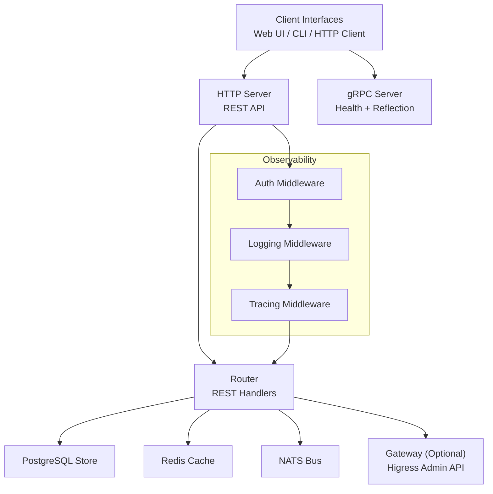

**Diagram sources**
- [pkg/server/server.go:34-52](file://pkg/server/server.go#L34-L52)
- [pkg/server/router.go:10-55](file://pkg/server/router.go#L10-L55)
- [pkg/store/postgres/postgres.go:9-45](file://pkg/store/postgres/postgres.go#L9-L45)
- [pkg/store/redis/redis.go:8-37](file://pkg/store/redis/redis.go#L8-L37)
- [pkg/event/nats.go:8-46](file://pkg/event/nats.go#L8-L46)
- [pkg/gateway/client.go:9-31](file://pkg/gateway/client.go#L9-L31)
- [pkg/server/middleware/auth.go:8-17](file://pkg/server/middleware/auth.go#L8-L17)
- [pkg/server/middleware/logging.go:19-37](file://pkg/server/middleware/logging.go#L19-L37)
- [pkg/server/middleware/tracing.go:7-18](file://pkg/server/middleware/tracing.go#L7-L18)

## Detailed Component Analysis

### Configuration Propagation (YAML → Env → Runtime)
Configuration is loaded using Viper:
- Defaults are set for server, database, Redis, NATS, runtime, gateway, and telemetry.
- YAML files are searched in current directory, /etc/resolvenet, and $HOME/.resolvenet.
- Environment variables use RESOLVENET_ prefix with dots replaced by underscores.
- Unmarshaled into typed Config struct for safe usage across services.

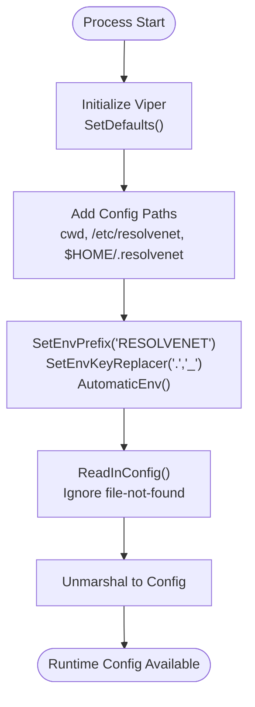

**Diagram sources**
- [pkg/config/config.go:14-59](file://pkg/config/config.go#L14-L59)
- [pkg/config/types.go:3-70](file://pkg/config/types.go#L3-L70)
- [configs/resolvenet.yaml:1-34](file://configs/resolvenet.yaml#L1-L34)

**Section sources**
- [pkg/config/config.go:10-62](file://pkg/config/config.go#L10-L62)
- [pkg/config/types.go:3-70](file://pkg/config/types.go#L3-L70)
- [configs/resolvenet.yaml:1-34](file://configs/resolvenet.yaml#L1-L34)

### HTTP/gRPC Server and Request-Response Flow
The server initializes:
- gRPC server with health service and reflection
- HTTP server with REST routes
- Concurrent startup with graceful shutdown

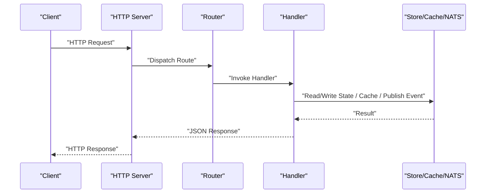

**Diagram sources**
- [pkg/server/server.go:54-103](file://pkg/server/server.go#L54-L103)
- [pkg/server/router.go:10-55](file://pkg/server/router.go#L10-L55)

**Section sources**
- [pkg/server/server.go:27-52](file://pkg/server/server.go#L27-L52)
- [pkg/server/router.go:10-55](file://pkg/server/router.go#L10-L55)

### Event-Driven Architecture with NATS
NATS bus provides asynchronous messaging:
- Publish and Subscribe APIs are exposed
- JetStream integration is planned
- Handlers can subscribe to domain events and react independently

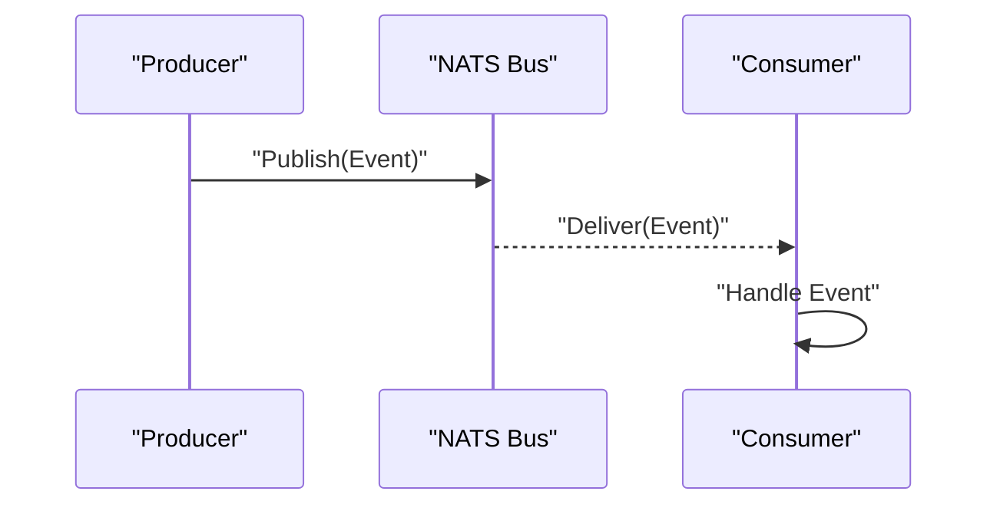

**Diagram sources**
- [pkg/event/nats.go:27-39](file://pkg/event/nats.go#L27-L39)

**Section sources**
- [pkg/event/nats.go:8-46](file://pkg/event/nats.go#L8-L46)

### Persistence Patterns: PostgreSQL and Redis
- PostgreSQL store encapsulates DSN construction and lifecycle methods; migrations are pending.
- Redis cache encapsulates initialization and lifecycle methods; health checks are pending.

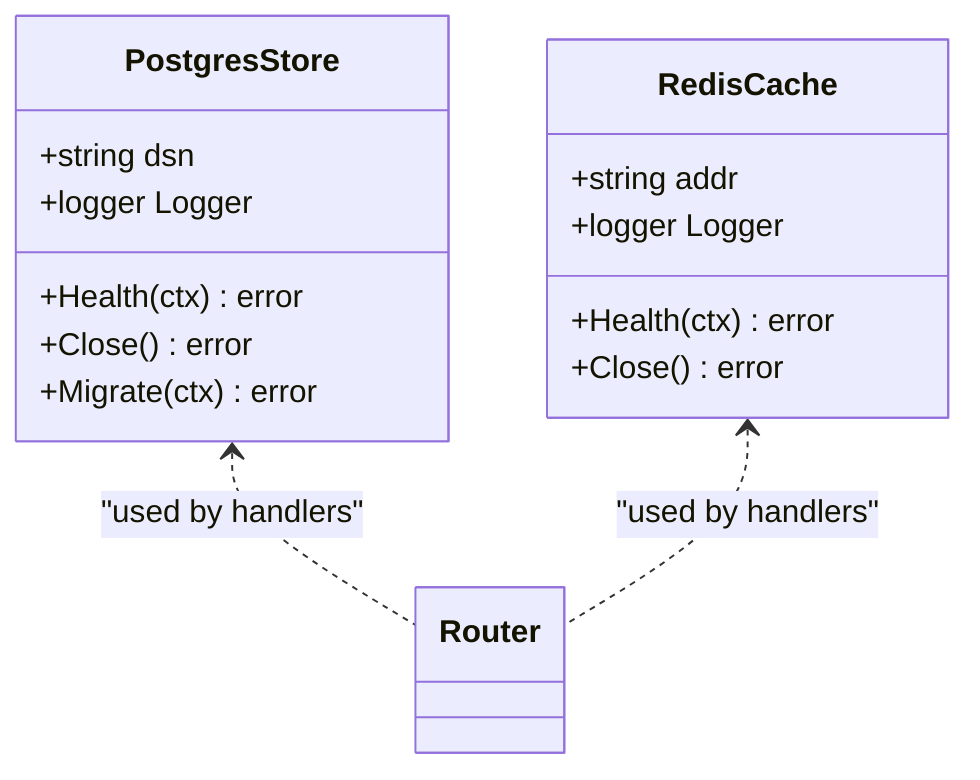

**Diagram sources**
- [pkg/store/postgres/postgres.go:9-45](file://pkg/store/postgres/postgres.go#L9-L45)
- [pkg/store/redis/redis.go:8-37](file://pkg/store/redis/redis.go#L8-L37)

**Section sources**
- [pkg/store/postgres/postgres.go:9-45](file://pkg/store/postgres/postgres.go#L9-L45)
- [pkg/store/redis/redis.go:8-37](file://pkg/store/redis/redis.go#L8-L37)

### Gateway Integration for Routing and Load Balancing
- Gateway client performs health checks against Higress admin API.
- Model router manages LLM model routes and synchronizes with gateway.
- Gateway is configurable and can be disabled.

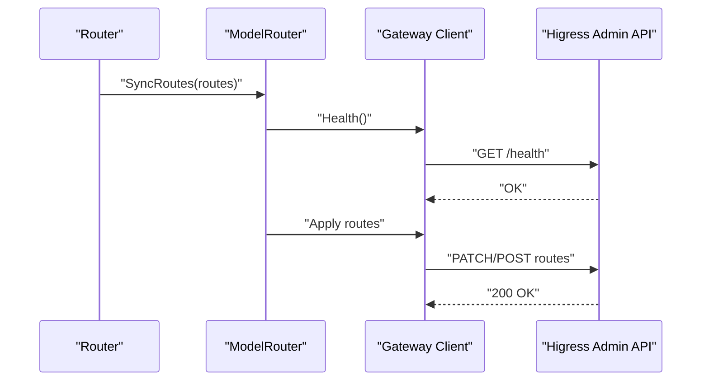

**Diagram sources**
- [pkg/gateway/model_router.go:33-38](file://pkg/gateway/model_router.go#L33-L38)
- [pkg/gateway/client.go:25-30](file://pkg/gateway/client.go#L25-L30)

**Section sources**
- [pkg/gateway/client.go:9-31](file://pkg/gateway/client.go#L9-L31)
- [pkg/gateway/model_router.go:8-39](file://pkg/gateway/model_router.go#L8-L39)
- [pkg/config/types.go:57-61](file://pkg/config/types.go#L57-L61)

### Observability Middleware
- Auth middleware placeholder for token validation.
- Logging middleware wraps response writer and logs method, path, status, duration, and remote address.
- Tracing middleware placeholder for OpenTelemetry spans.

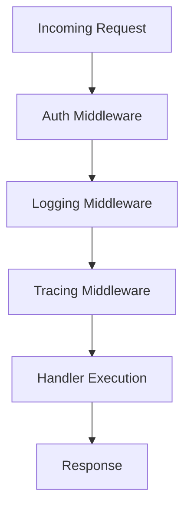

**Diagram sources**
- [pkg/server/middleware/auth.go:8-17](file://pkg/server/middleware/auth.go#L8-L17)
- [pkg/server/middleware/logging.go:19-37](file://pkg/server/middleware/logging.go#L19-L37)
- [pkg/server/middleware/tracing.go:7-18](file://pkg/server/middleware/tracing.go#L7-L18)

**Section sources**
- [pkg/server/middleware/auth.go:8-17](file://pkg/server/middleware/auth.go#L8-L17)
- [pkg/server/middleware/logging.go:19-37](file://pkg/server/middleware/logging.go#L19-L37)
- [pkg/server/middleware/tracing.go:7-18](file://pkg/server/middleware/tracing.go#L7-L18)

### Typical User Workflows

#### Workflow Execution Flow (Request-Response)
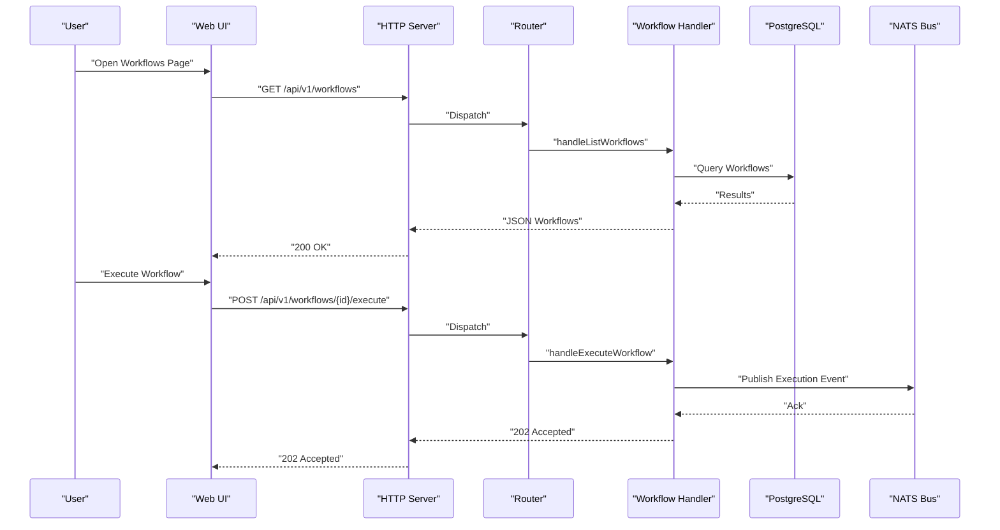

**Diagram sources**
- [pkg/server/router.go:32-40](file://pkg/server/router.go#L32-L40)
- [pkg/event/nats.go:27-32](file://pkg/event/nats.go#L27-L32)
- [pkg/store/postgres/postgres.go:27-31](file://pkg/store/postgres/postgres.go#L27-L31)

#### Real-Time Progress Notifications (Streaming Concept)
While streaming endpoints are not yet implemented, the design supports event-driven progress updates:
- Handlers publish execution events to NATS.
- Subscribers (e.g., WebSocket bridge or long-poll clients) consume events and push updates to clients.

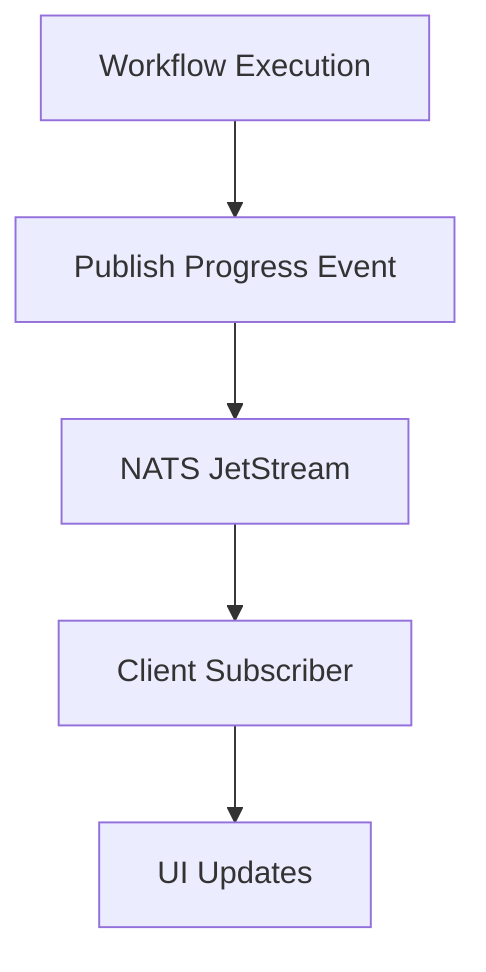

[No sources needed since this diagram shows conceptual workflow, not actual code structure]

## Dependency Analysis
- Entry points depend on configuration and server initialization.
- Server depends on router and configuration.
- Router depends on persistence and eventing abstractions.
- Gateway depends on HTTP client and external Higress admin API.
- Configuration is a central dependency across components.

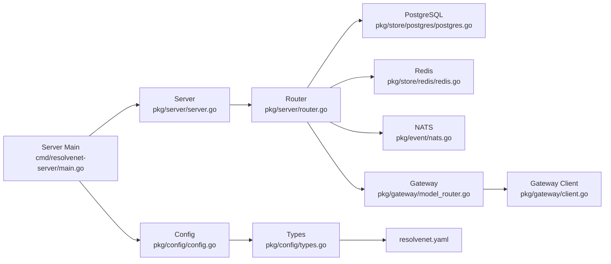

**Diagram sources**
- [cmd/resolvenet-server/main.go:24-30](file://cmd/resolvenet-server/main.go#L24-L30)
- [pkg/config/config.go:10-62](file://pkg/config/config.go#L10-L62)
- [pkg/server/server.go:27-52](file://pkg/server/server.go#L27-L52)
- [pkg/server/router.go:10-55](file://pkg/server/router.go#L10-L55)
- [pkg/store/postgres/postgres.go:9-45](file://pkg/store/postgres/postgres.go#L9-L45)
- [pkg/store/redis/redis.go:8-37](file://pkg/store/redis/redis.go#L8-L37)
- [pkg/event/nats.go:8-46](file://pkg/event/nats.go#L8-L46)
- [pkg/gateway/model_router.go:8-39](file://pkg/gateway/model_router.go#L8-L39)
- [pkg/gateway/client.go:9-31](file://pkg/gateway/client.go#L9-L31)
- [pkg/config/types.go:3-70](file://pkg/config/types.go#L3-L70)
- [configs/resolvenet.yaml:1-34](file://configs/resolvenet.yaml#L1-L34)

**Section sources**
- [cmd/resolvenet-server/main.go:24-30](file://cmd/resolvenet-server/main.go#L24-L30)
- [pkg/config/config.go:10-62](file://pkg/config/config.go#L10-L62)
- [pkg/server/server.go:27-52](file://pkg/server/server.go#L27-L52)
- [pkg/server/router.go:10-55](file://pkg/server/router.go#L10-L55)
- [pkg/config/types.go:3-70](file://pkg/config/types.go#L3-L70)

## Performance Considerations
- Concurrency: HTTP and gRPC servers run concurrently with graceful shutdown.
- Middleware overhead: Logging and tracing are currently placeholders; production deployments should instrument efficiently.
- Persistence: Use connection pooling and migrations for PostgreSQL; leverage Redis TTLs for cache invalidation.
- Eventing: NATS JetStream offers at-least-once delivery semantics; ensure idempotent consumers.

[No sources needed since this section provides general guidance]

## Troubleshooting Guide
- Configuration precedence: YAML files are read from multiple locations; environment variables override YAML values. Verify RESOLVENET_ prefixed variables.
- Server startup errors: Inspect gRPC and HTTP listen/bind failures; check configured addresses.
- Persistence readiness: Implement health checks and migrations for PostgreSQL and Redis.
- Event delivery: NATS bus is a placeholder; implement JetStream connections and subscriptions.
- Gateway reachability: Ensure Higress admin URL is reachable and gateway is enabled when required.

**Section sources**
- [pkg/config/config.go:33-59](file://pkg/config/config.go#L33-L59)
- [pkg/server/server.go:59-98](file://pkg/server/server.go#L59-L98)
- [pkg/store/postgres/postgres.go:27-44](file://pkg/store/postgres/postgres.go#L27-L44)
- [pkg/store/redis/redis.go:26-36](file://pkg/store/redis/redis.go#L26-L36)
- [pkg/event/nats.go:16-45](file://pkg/event/nats.go#L16-L45)
- [pkg/gateway/client.go:25-30](file://pkg/gateway/client.go#L25-L30)

## Conclusion
ResolveNet’s architecture combines REST/gRPC request-response with an event-driven backbone powered by NATS. Configuration is centralized via Viper, enabling flexible deployment across environments. Persistence leverages PostgreSQL for durable state and Redis for caching. The gateway integration provides optional model routing capabilities. While many subsystems are placeholders, the modular design facilitates incremental implementation of streaming updates, robust error handling, and production-grade reliability.