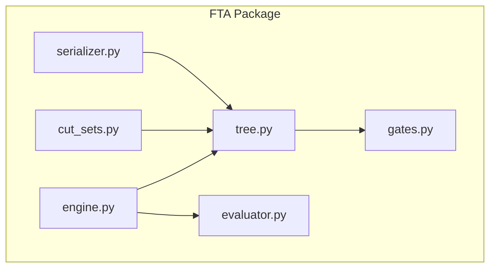
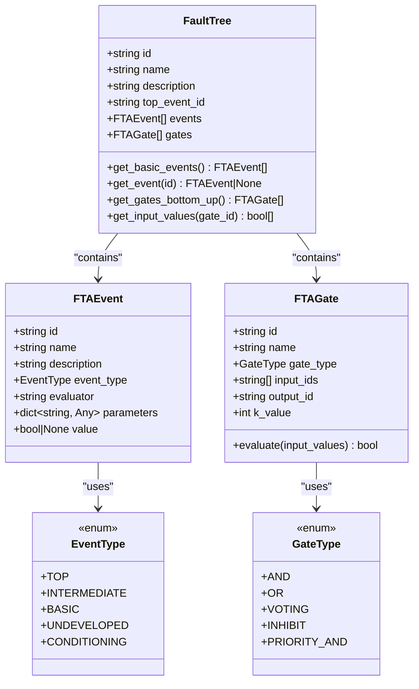
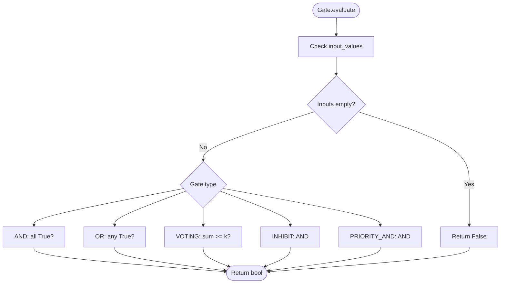
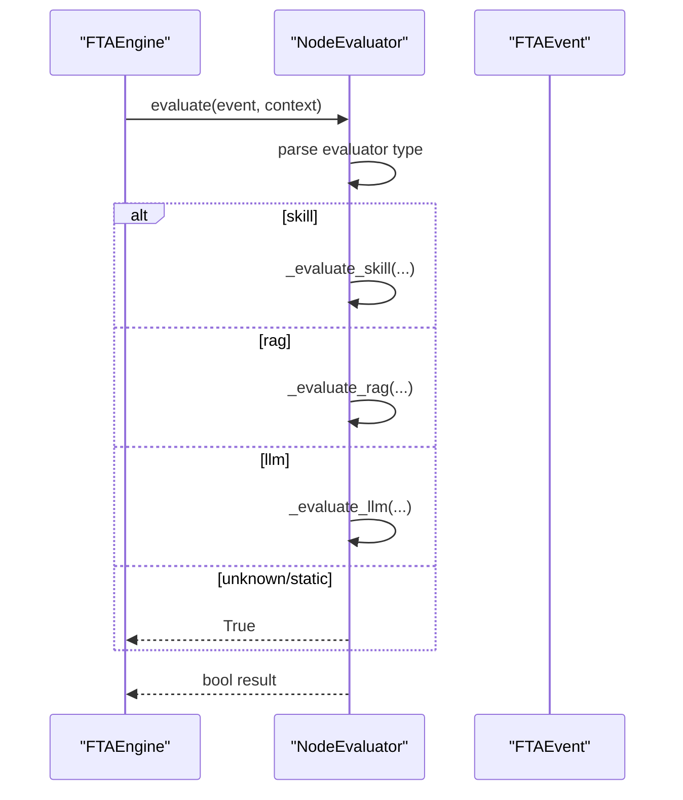
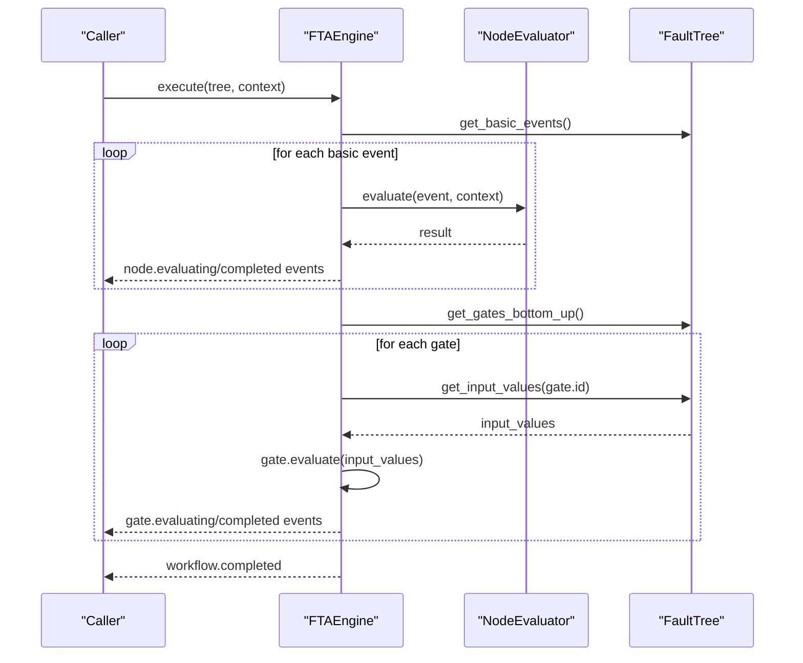
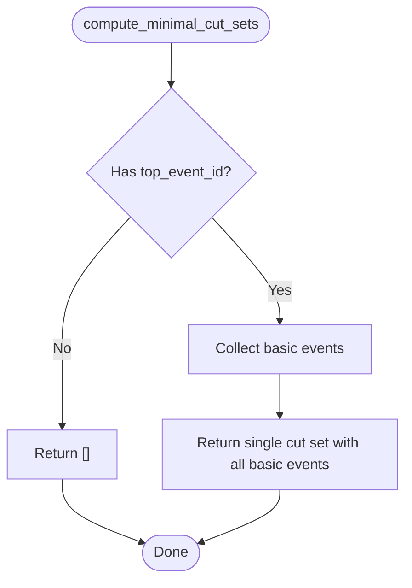
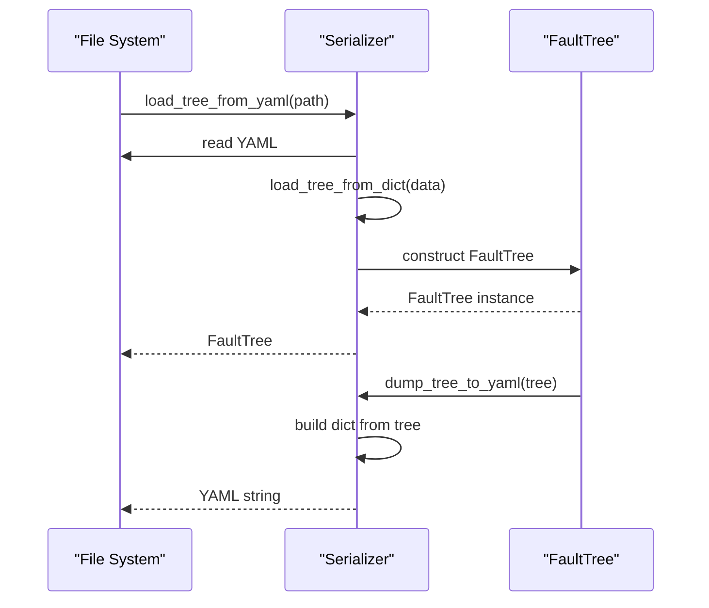
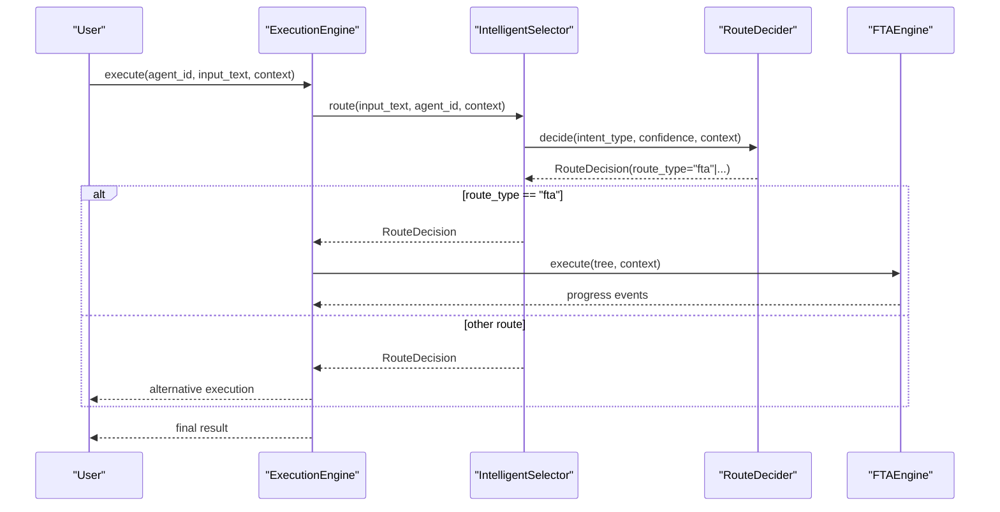
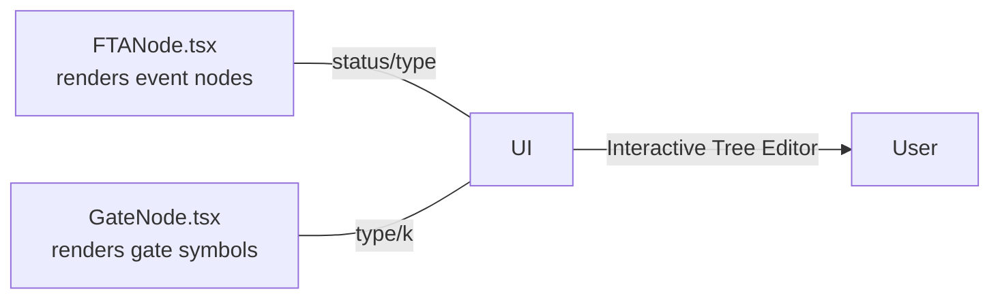
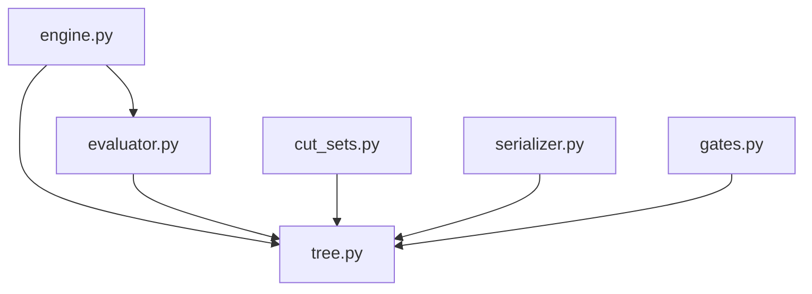

# FTA Engine Architecture

<cite>
**Referenced Files in This Document**
- [engine.py](file://python/src/resolvenet/fta/engine.py)
- [tree.py](file://python/src/resolvenet/fta/tree.py)
- [gates.py](file://python/src/resolvenet/fta/gates.py)
- [evaluator.py](file://python/src/resolvenet/fta/evaluator.py)
- [cut_sets.py](file://python/src/resolvenet/fta/cut_sets.py)
- [serializer.py](file://python/src/resolvenet/fta/serializer.py)
- [test_fta_engine.py](file://python/tests/unit/test_fta_engine.py)
- [sample_fta_tree.yaml](file://python/tests/fixtures/sample_fta_tree.yaml)
- [workflow-fta-example.yaml](file://configs/examples/workflow-fta-example.yaml)
- [fta-engine.md](file://docs/architecture/fta-engine.md)
- [router.py](file://python/src/resolvenet/selector/router.py)
- [selector.py](file://python/src/resolvenet/selector/selector.py)
- [engine.py](file://python/src/resolvenet/runtime/engine.py)
- [FTANode.tsx](file://web/src/components/TreeEditor/FTANode.tsx)
- [GateNode.tsx](file://web/src/components/TreeEditor/GateNode.tsx)
</cite>

## Table of Contents
1. [Introduction](#introduction)
2. [Project Structure](#project-structure)
3. [Core Components](#core-components)
4. [Architecture Overview](#architecture-overview)
5. [Detailed Component Analysis](#detailed-component-analysis)
6. [Dependency Analysis](#dependency-analysis)
7. [Performance Considerations](#performance-considerations)
8. [Troubleshooting Guide](#troubleshooting-guide)
9. [Conclusion](#conclusion)
10. [Appendices](#appendices)

## Introduction
This document describes the Fault Tree Analysis (FTA) Engine architecture within the ResolveNet system. It explains the fault tree structure representation, supported gate types, event evaluation strategies, traversal algorithms, and cut set analysis. It also documents the execution engine’s role in the Intelligent Selector routing system, serialization mechanisms for persisting and loading fault trees, and how FTA results influence routing decisions. Diagrams illustrate relationships among fault events, gates, and system outcomes, along with evaluation strategies and mathematical foundations.

## Project Structure
The FTA engine resides in the Python package under python/src/resolvenet/fta/. The key modules are:
- tree.py: Defines event and gate data structures and the FaultTree container
- gates.py: Provides standalone gate logic helpers
- evaluator.py: Evaluates basic events via skills, RAG, or LLM
- engine.py: Orchestrates execution and yields progress events
- cut_sets.py: Computes minimal cut sets and generates explanations
- serializer.py: Loads and dumps fault trees from/to YAML/dict
- Tests and examples demonstrate usage and expected behavior



**Diagram sources**
- [engine.py:14-83](file://python/src/resolvenet/fta/engine.py#L14-L83)
- [tree.py:30-120](file://python/src/resolvenet/fta/tree.py#L30-L120)
- [gates.py:1-29](file://python/src/resolvenet/fta/gates.py#L1-L29)
- [evaluator.py:13-74](file://python/src/resolvenet/fta/evaluator.py#L13-L74)
- [cut_sets.py:8-49](file://python/src/resolvenet/fta/cut_sets.py#L8-L49)
- [serializer.py:12-113](file://python/src/resolvenet/fta/serializer.py#L12-L113)

**Section sources**
- [fta-engine.md:1-19](file://docs/architecture/fta-engine.md#L1-L19)
- [engine.py:14-83](file://python/src/resolvenet/fta/engine.py#L14-L83)
- [tree.py:30-120](file://python/src/resolvenet/fta/tree.py#L30-L120)

## Core Components
- FaultTree: Container holding tree metadata, events, and gates; provides traversal helpers
- FTAEvent: Represents a node with type (top, intermediate, basic, undeveloped, conditioning), evaluator specification, and optional parameters
- FTAGate: Logical connector with type (AND, OR, VOTING, INHIBIT, PRIORITY_AND), input/output IDs, and k-value for voting gates
- NodeEvaluator: Resolves basic events using skill, RAG, or LLM evaluators
- FTAEngine: Drives execution, yields progress events, and orchestrates bottom-up propagation
- CutSet utilities: Compute minimal cut sets and produce human-readable explanations
- Serializer: Load from YAML/dict and dump to YAML

**Section sources**
- [tree.py:10-120](file://python/src/resolvenet/fta/tree.py#L10-L120)
- [evaluator.py:13-74](file://python/src/resolvenet/fta/evaluator.py#L13-L74)
- [engine.py:14-83](file://python/src/resolvenet/fta/engine.py#L14-L83)
- [cut_sets.py:8-49](file://python/src/resolvenet/fta/cut_sets.py#L8-L49)
- [serializer.py:12-113](file://python/src/resolvenet/fta/serializer.py#L12-L113)

## Architecture Overview
The FTA engine participates in the ResolveNet Intelligent Selector routing system. The Runtime Execution Engine initializes an execution context, invokes the Intelligent Selector to decide a route, and then executes the chosen subsystem (FTA, Skills, or RAG). The FTA engine evaluates basic events and propagates results through gates to compute the top event outcome. Serialization supports persistence and loading of fault trees.

```mermaid
graph TB
RE["Runtime Execution Engine<br/>(execution orchestration)"]
IS["Intelligent Selector<br/>(route decision)"]
DEC["RouteDecider<br/>(final decision)"]
FTA["FTA Engine<br/>(evaluation & traversal)"]
EVAL["NodeEvaluator<br/>(basic event eval)"]
TREE["FaultTree<br/>(events & gates)"]
RE --> IS
IS --> DEC
DEC --> |route_type = "fta"| FTA
FTA --> EVAL
FTA --> TREE
```

**Diagram sources**
- [engine.py:24-83](file://python/src/resolvenet/fta/engine.py#L24-L83)
- [evaluator.py:23-74](file://python/src/resolvenet/fta/evaluator.py#L23-L74)
- [tree.py:82-120](file://python/src/resolvenet/fta/tree.py#L82-L120)
- [engine.py:25-89](file://python/src/resolvenet/runtime/engine.py#L25-L89)
- [selector.py:24-100](file://python/src/resolvenet/selector/selector.py#L24-L100)
- [router.py:17-40](file://python/src/resolvenet/selector/router.py#L17-L40)

## Detailed Component Analysis

### Fault Tree Data Model
The fault tree model defines:
- Event types: top, intermediate, basic, undeveloped, conditioning
- Gate types: AND, OR, VOTING (with k-of-n), INHIBIT, PRIORITY_AND
- Event evaluation metadata: evaluator identifier and parameters
- Gate connectivity: input and output event IDs, plus k-value for voting gates



**Diagram sources**
- [tree.py:10-120](file://python/src/resolvenet/fta/tree.py#L10-L120)

**Section sources**
- [tree.py:10-120](file://python/src/resolvenet/fta/tree.py#L10-L120)

### Gate Evaluation Strategies and Mathematical Foundations
Gate evaluation computes the logical output from input booleans:
- AND: conjunction over inputs
- OR: disjunction over inputs
- VOTING (k-of-n): at least k inputs are true
- INHIBIT: modeled as AND with conditioning input semantics
- PRIORITY_AND: modeled as AND with order dependency semantics



**Diagram sources**
- [tree.py:54-78](file://python/src/resolvenet/fta/tree.py#L54-L78)

**Section sources**
- [tree.py:54-78](file://python/src/resolvenet/fta/tree.py#L54-L78)
- [gates.py:6-29](file://python/src/resolvenet/fta/gates.py#L6-L29)

### Event Evaluation Strategies
Basic events are resolved using an evaluator identifier:
- skill:<target>: invoke a skill via the skill executor
- rag:<collection_id>: query a RAG collection
- llm:<model_hint>: call an LLM for classification
- Unknown/static: default to True



**Diagram sources**
- [engine.py:24-83](file://python/src/resolvenet/fta/engine.py#L24-L83)
- [evaluator.py:23-74](file://python/src/resolvenet/fta/evaluator.py#L23-L74)

**Section sources**
- [evaluator.py:13-74](file://python/src/resolvenet/fta/evaluator.py#L13-L74)

### Tree Traversal and Execution Engine
The engine traverses the tree in two phases:
1. Evaluate basic events and stream progress events
2. Iterate gates in bottom-up order, compute outputs, and stream completion events



**Diagram sources**
- [engine.py:24-83](file://python/src/resolvenet/fta/engine.py#L24-L83)
- [tree.py:92-120](file://python/src/resolvenet/fta/tree.py#L92-L120)

**Section sources**
- [engine.py:24-83](file://python/src/resolvenet/fta/engine.py#L24-L83)
- [tree.py:92-120](file://python/src/resolvenet/fta/tree.py#L92-L120)

### Cut Set Analysis
Minimal cut sets represent the smallest combinations of basic events that cause the top event. The current implementation returns a placeholder set containing all basic events. Human-readable explanations are generated by mapping event IDs to names.



**Diagram sources**
- [cut_sets.py:8-27](file://python/src/resolvenet/fta/cut_sets.py#L8-L27)

**Section sources**
- [cut_sets.py:8-49](file://python/src/resolvenet/fta/cut_sets.py#L8-L49)

### Serialization and Persistence
Fault trees can be loaded from YAML or dictionaries and serialized back to YAML. The serializer preserves event and gate metadata, including evaluator specifications and k-values.



**Diagram sources**
- [serializer.py:12-113](file://python/src/resolvenet/fta/serializer.py#L12-L113)

**Section sources**
- [serializer.py:12-113](file://python/src/resolvenet/fta/serializer.py#L12-L113)
- [sample_fta_tree.yaml:1-23](file://python/tests/fixtures/sample_fta_tree.yaml#L1-L23)
- [workflow-fta-example.yaml:1-50](file://configs/examples/workflow-fta-example.yaml#L1-L50)

### Integration with Intelligent Selector Routing
The Runtime Execution Engine orchestrates the end-to-end flow. The Intelligent Selector classifies intent and enriches context, while RouteDecider makes the final routing decision. The FTA engine is invoked when the selector chooses the FTA route.



**Diagram sources**
- [engine.py:25-89](file://python/src/resolvenet/runtime/engine.py#L25-L89)
- [selector.py:43-100](file://python/src/resolvenet/selector/selector.py#L43-L100)
- [router.py:17-40](file://python/src/resolvenet/selector/router.py#L17-L40)
- [engine.py:24-83](file://python/src/resolvenet/fta/engine.py#L24-L83)

**Section sources**
- [engine.py:25-89](file://python/src/resolvenet/runtime/engine.py#L25-L89)
- [selector.py:24-100](file://python/src/resolvenet/selector/selector.py#L24-L100)
- [router.py:10-40](file://python/src/resolvenet/selector/router.py#L10-L40)

### Frontend Visualization Integration
The web interface renders fault tree nodes and gates:
- FTANode displays event types and evaluation status
- GateNode renders gate symbols (AND, OR, VOTING with k/n)



**Diagram sources**
- [FTANode.tsx:11-37](file://web/src/components/TreeEditor/FTANode.tsx#L11-L37)
- [GateNode.tsx:11-27](file://web/src/components/TreeEditor/GateNode.tsx#L11-L27)

**Section sources**
- [FTANode.tsx:11-37](file://web/src/components/TreeEditor/FTANode.tsx#L11-L37)
- [GateNode.tsx:11-27](file://web/src/components/TreeEditor/GateNode.tsx#L11-L27)

## Dependency Analysis
The FTA engine modules exhibit clear separation of concerns:
- engine.py depends on tree.py and evaluator.py
- tree.py encapsulates data structures and traversal helpers
- evaluator.py depends on tree.py and is designed to integrate with external systems
- cut_sets.py depends on tree.py for traversal and analysis
- serializer.py depends on tree.py for conversion



**Diagram sources**
- [engine.py:8-9](file://python/src/resolvenet/fta/engine.py#L8-L9)
- [evaluator.py:8](file://python/src/resolvenet/fta/evaluator.py#L8)
- [cut_sets.py:5](file://python/src/resolvenet/fta/cut_sets.py#L5)
- [serializer.py:9](file://python/src/resolvenet/fta/serializer.py#L9)
- [gates.py:3](file://python/src/resolvenet/fta/gates.py#L3)

**Section sources**
- [engine.py:8-9](file://python/src/resolvenet/fta/engine.py#L8-L9)
- [evaluator.py:8](file://python/src/resolvenet/fta/evaluator.py#L8)
- [cut_sets.py:5](file://python/src/resolvenet/fta/cut_sets.py#L5)
- [serializer.py:9](file://python/src/resolvenet/fta/serializer.py#L9)
- [gates.py:3](file://python/src/resolvenet/fta/gates.py#L3)

## Performance Considerations
- Bottom-up traversal: The current bottom-up ordering is a placeholder and should be replaced with a proper topological sort for correctness and performance
- Asynchronous evaluation: Basic event evaluation is asynchronous; ensure upstream systems (skills, RAG, LLM) are optimized for concurrency
- Cut set computation: Placeholder implementation returns a single large cut set; replace with efficient algorithms (e.g., MOCUS or Binary Decision Diagrams) for scalability
- Serialization: YAML serialization is straightforward but may be improved with schema validation and incremental updates

## Troubleshooting Guide
Common issues and resolutions:
- Empty input lists to gates: Gates return False when inputs are empty; ensure wiring connects gates to evaluated events
- Unknown evaluator types: Default behavior returns True; verify evaluator identifiers and parameters
- Missing top event ID: Cut set computation returns empty; set a valid top event ID
- Incorrect traversal order: Gates may evaluate before inputs; implement topological sorting for reliable propagation

**Section sources**
- [tree.py:63-64](file://python/src/resolvenet/fta/tree.py#L63-L64)
- [evaluator.py:46-49](file://python/src/resolvenet/fta/evaluator.py#L46-L49)
- [cut_sets.py:20-21](file://python/src/resolvenet/fta/cut_sets.py#L20-L21)
- [tree.py:103-106](file://python/src/resolvenet/fta/tree.py#L103-L106)

## Conclusion
The FTA Engine provides a modular foundation for fault tree evaluation within ResolveNet. Its data model supports diverse gate types and event evaluation strategies, while the execution engine streams progress events for observability. Integration with the Intelligent Selector enables dynamic routing decisions, and serialization supports persistence. Future enhancements should focus on correct traversal ordering, robust cut set computation, and deeper integration with external evaluators.

## Appendices

### Example Fault Trees
- Sample YAML demonstrates a minimal FTA with a top event and OR gate connecting two basic events
- Example workflow YAML shows a more complex tree with intermediate events and multiple evaluators

**Section sources**
- [sample_fta_tree.yaml:1-23](file://python/tests/fixtures/sample_fta_tree.yaml#L1-L23)
- [workflow-fta-example.yaml:1-50](file://configs/examples/workflow-fta-example.yaml#L1-L50)

### Unit Tests Highlights
- Gate logic tests validate AND/OR/VOTING behavior
- Fault tree helpers tests confirm event retrieval and basic event identification

**Section sources**
- [test_fta_engine.py:7-40](file://python/tests/unit/test_fta_engine.py#L7-L40)