# Intelligent Selector Architecture

<cite>
**Referenced Files in This Document**
- [selector.py](file://python/src/resolvenet/selector/selector.py)
- [router.py](file://python/src/resolvenet/selector/router.py)
- [context_enricher.py](file://python/src/resolvenet/selector/context_enricher.py)
- [intent.py](file://python/src/resolvenet/selector/intent.py)
- [llm_strategy.py](file://python/src/resolvenet/selector/strategies/llm_strategy.py)
- [rule_strategy.py](file://python/src/resolvenet/selector/strategies/rule_strategy.py)
- [hybrid_strategy.py](file://python/src/resolvenet/selector/strategies/hybrid_strategy.py)
- [__init__.py](file://python/src/resolvenet/selector/__init__.py)
- [agent.proto](file://api/proto/resolvenet/v1/agent.proto)
- [workflow.proto](file://api/proto/resolvenet/v1/workflow.proto)
- [rag.proto](file://api/proto/resolvenet/v1/rag.proto)
- [selector.proto](file://api/proto/resolvenet/v1/selector.proto)
- [runtime.yaml](file://configs/runtime.yaml)
- [resolvenet.yaml](file://configs/resolvenet.yaml)
</cite>

## Table of Contents
1. [Introduction](#introduction)
2. [Project Structure](#project-structure)
3. [Core Components](#core-components)
4. [Architecture Overview](#architecture-overview)
5. [Detailed Component Analysis](#detailed-component-analysis)
6. [Dependency Analysis](#dependency-analysis)
7. [Performance Considerations](#performance-considerations)
8. [Troubleshooting Guide](#troubleshooting-guide)
9. [Conclusion](#conclusion)

## Introduction
This document describes the Intelligent Selector system, a meta-router that dynamically chooses among multiple execution paths: Fault Tree Analysis (FTA) workflows, agent skills, Retrieval-Augmented Generation (RAG) pipelines, and direct Large Language Model (LLM) responses. The selector operates through three stages: intent analysis, context enrichment, and route decision-making. It supports three routing strategies—rule-based, LLM-based, and a hybrid approach—and integrates with the broader platform via protocol buffers and configuration systems.

## Project Structure
The Intelligent Selector resides in the Python package under `python/src/resolvenet/selector`. It is composed of:
- Core orchestrator and decision models
- Strategy implementations for routing
- Intent analysis and context enrichment utilities
- Protocol buffer definitions for cross-service communication
- Runtime configuration for enabling/disabling features

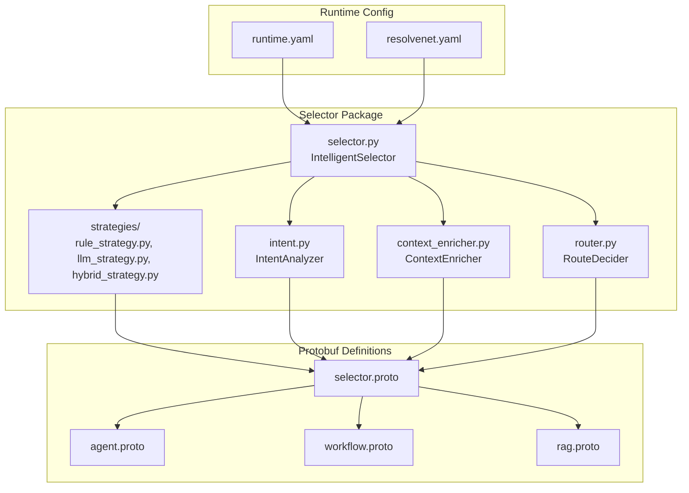

**Diagram sources**
- [selector.py:1-100](file://python/src/resolvenet/selector/selector.py#L1-L100)
- [router.py:1-40](file://python/src/resolvenet/selector/router.py#L1-L40)
- [intent.py:1-39](file://python/src/resolvenet/selector/intent.py#L1-L39)
- [context_enricher.py:1-47](file://python/src/resolvenet/selector/context_enricher.py#L1-L47)
- [rule_strategy.py:1-77](file://python/src/resolvenet/selector/strategies/rule_strategy.py#L1-L77)
- [llm_strategy.py:1-44](file://python/src/resolvenet/selector/strategies/llm_strategy.py#L1-L44)
- [hybrid_strategy.py:1-42](file://python/src/resolvenet/selector/strategies/hybrid_strategy.py#L1-L42)
- [selector.proto](file://api/proto/resolvenet/v1/selector.proto)
- [agent.proto](file://api/proto/resolvenet/v1/agent.proto)
- [workflow.proto](file://api/proto/resolvenet/v1/workflow.proto)
- [rag.proto](file://api/proto/resolvenet/v1/rag.proto)
- [runtime.yaml](file://configs/runtime.yaml)
- [resolvenet.yaml](file://configs/resolvenet.yaml)

**Section sources**
- [selector.py:1-100](file://python/src/resolvenet/selector/selector.py#L1-L100)
- [__init__.py:1-6](file://python/src/resolvenet/selector/__init__.py#L1-L6)

## Core Components
- IntelligentSelector: Orchestrates the three-stage routing pipeline and delegates to selected strategies.
- RouteDecision: Standardized output model containing route type, target, confidence, reasoning chain, and parameters.
- IntentAnalyzer: Classifies user intent and extracts entities/metadata.
- ContextEnricher: Augments the request with system state such as available skills, active workflows, RAG collections, and conversation history.
- RouteDecider: Makes the final routing decision given intent and enriched context.
- Strategies: Pluggable routing strategies (rule, LLM, hybrid) that produce RouteDecision objects.

Key implementation references:
- [selector.py:24-100](file://python/src/resolvenet/selector/selector.py#L24-L100)
- [intent.py:8-39](file://python/src/resolvenet/selector/intent.py#L8-L39)
- [context_enricher.py:8-47](file://python/src/resolvenet/selector/context_enricher.py#L8-L47)
- [router.py:10-40](file://python/src/resolvenet/selector/router.py#L10-L40)
- [llm_strategy.py:10-44](file://python/src/resolvenet/selector/strategies/llm_strategy.py#L10-L44)
- [rule_strategy.py:11-77](file://python/src/resolvenet/selector/strategies/rule_strategy.py#L11-L77)
- [hybrid_strategy.py:12-42](file://python/src/resolvenet/selector/strategies/hybrid_strategy.py#L12-L42)

**Section sources**
- [selector.py:13-72](file://python/src/resolvenet/selector/selector.py#L13-L72)
- [intent.py:8-39](file://python/src/resolvenet/selector/intent.py#L8-L39)
- [context_enricher.py:8-47](file://python/src/resolvenet/selector/context_enricher.py#L8-L47)
- [router.py:10-40](file://python/src/resolvenet/selector/router.py#L10-L40)

## Architecture Overview
The Intelligent Selector sits at the platform's entry point, receiving user input and deciding the optimal execution path. It integrates with:
- Agent subsystem for agent-specific context
- Workflow subsystem for FTA and workflow availability
- RAG subsystem for knowledge collections
- Skills registry for tool availability
- LLM providers for intent classification and routing decisions

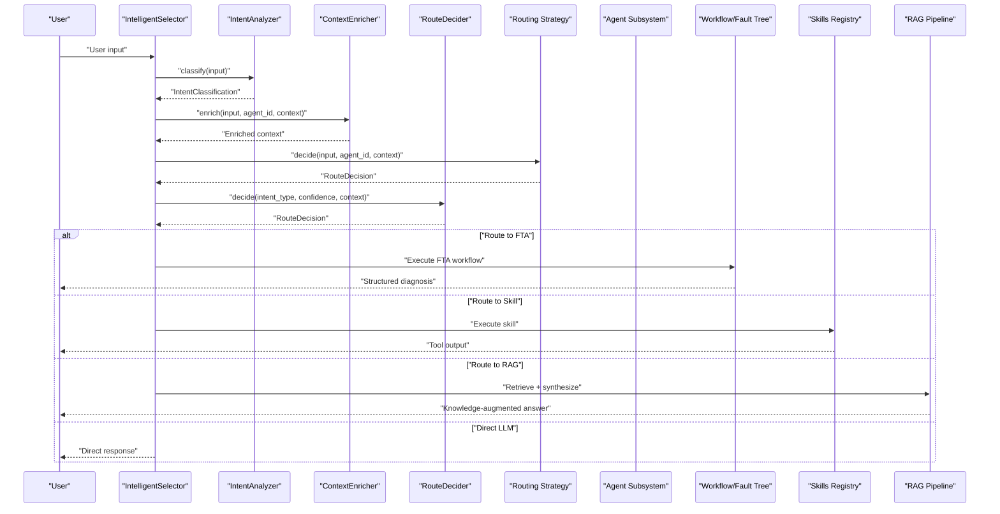

**Diagram sources**
- [selector.py:43-72](file://python/src/resolvenet/selector/selector.py#L43-L72)
- [intent.py:24-39](file://python/src/resolvenet/selector/intent.py#L24-L39)
- [context_enricher.py:16-47](file://python/src/resolvenet/selector/context_enricher.py#L16-L47)
- [router.py:17-40](file://python/src/resolvenet/selector/router.py#L17-L40)
- [rule_strategy.py:35-77](file://python/src/resolvenet/selector/strategies/rule_strategy.py#L35-L77)
- [llm_strategy.py:33-44](file://python/src/resolvenet/selector/strategies/llm_strategy.py#L33-L44)
- [hybrid_strategy.py:27-42](file://python/src/resolvenet/selector/strategies/hybrid_strategy.py#L27-L42)

## Detailed Component Analysis

### IntelligentSelector Orchestration
The orchestrator coordinates intent analysis, context enrichment, and strategy selection. It exposes a single async route method that returns a standardized RouteDecision. Strategy selection is pluggable and defaults to hybrid.

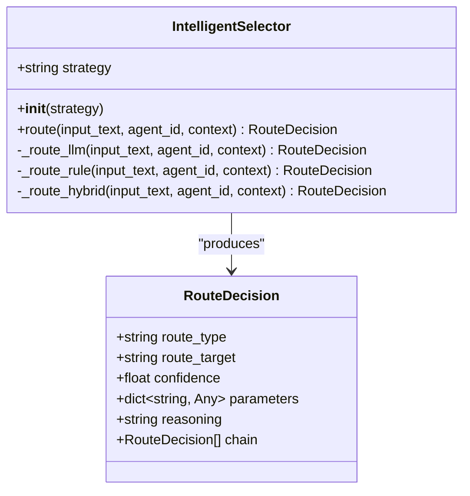

**Diagram sources**
- [selector.py:24-100](file://python/src/resolvenet/selector/selector.py#L24-L100)

**Section sources**
- [selector.py:24-100](file://python/src/resolvenet/selector/selector.py#L24-L100)

### Intent Analysis
IntentAnalyzer classifies user input into intent categories with confidence scores and optional entities/metadata. Current implementation returns a default classification; production deployments will integrate with LLM-based classification.

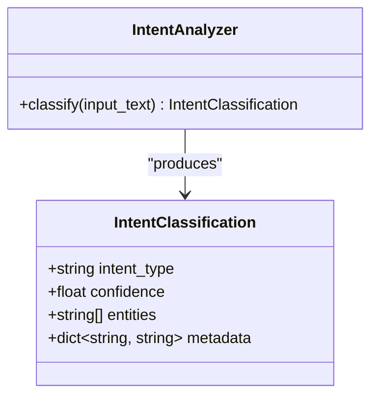

**Diagram sources**
- [intent.py:8-39](file://python/src/resolvenet/selector/intent.py#L8-L39)

**Section sources**
- [intent.py:17-39](file://python/src/resolvenet/selector/intent.py#L17-L39)

### Context Enrichment
ContextEnricher augments the request with system state to improve routing accuracy. It currently stubs out integrations for skills, workflows, RAG collections, and conversation history.

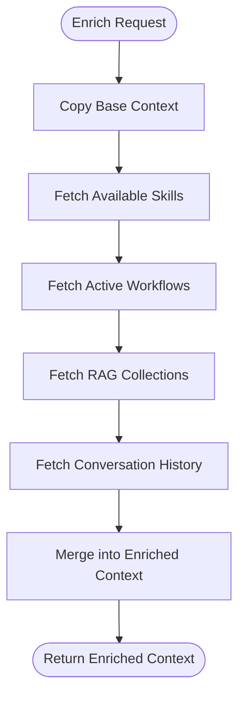

**Diagram sources**
- [context_enricher.py:16-47](file://python/src/resolvenet/selector/context_enricher.py#L16-L47)

**Section sources**
- [context_enricher.py:8-47](file://python/src/resolvenet/selector/context_enricher.py#L8-L47)

### Route Decision Engine
RouteDecider consumes intent classification and enriched context to select the final route. The current implementation defaults to direct responses while preserving a framework for sophisticated logic.

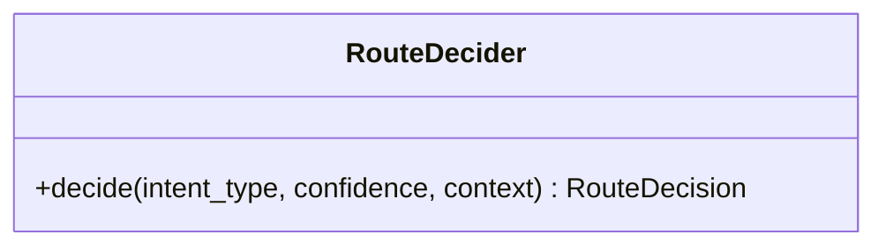

**Diagram sources**
- [router.py:10-40](file://python/src/resolvenet/selector/router.py#L10-L40)

**Section sources**
- [router.py:17-40](file://python/src/resolvenet/selector/router.py#L17-L40)

### Routing Strategies

#### Rule-Based Strategy
Uses predefined regex patterns to quickly classify requests into FTA, skills, or RAG routes. Provides deterministic, high-confidence decisions for known patterns.

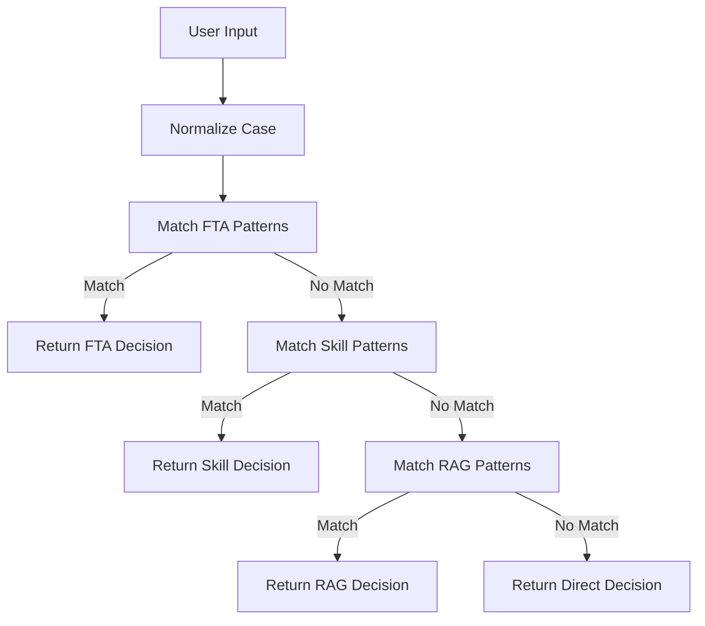

**Diagram sources**
- [rule_strategy.py:35-77](file://python/src/resolvenet/selector/strategies/rule_strategy.py#L35-L77)

**Section sources**
- [rule_strategy.py:11-77](file://python/src/resolvenet/selector/strategies/rule_strategy.py#L11-L77)

#### LLM-Based Strategy
Prompts an LLM to classify the appropriate route, incorporating available skills, workflows, and RAG collections. Returns structured JSON with route type, target, confidence, and reasoning.

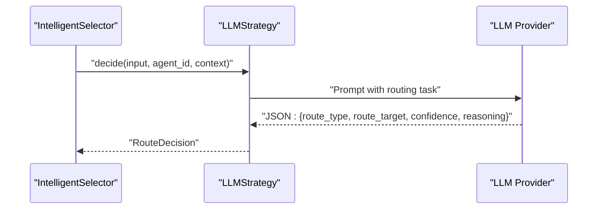

**Diagram sources**
- [llm_strategy.py:33-44](file://python/src/resolvenet/selector/strategies/llm_strategy.py#L33-L44)

**Section sources**
- [llm_strategy.py:10-44](file://python/src/resolvenet/selector/strategies/llm_strategy.py#L10-L44)

#### Hybrid Strategy
Combines rule-based fast-path with LLM fallback. If rule confidence meets threshold, use rule; otherwise, delegate to LLM.

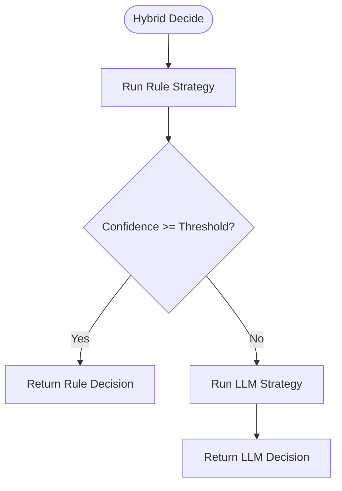

**Diagram sources**
- [hybrid_strategy.py:27-42](file://python/src/resolvenet/selector/strategies/hybrid_strategy.py#L27-L42)

**Section sources**
- [hybrid_strategy.py:12-42](file://python/src/resolvenet/selector/strategies/hybrid_strategy.py#L12-L42)

### Route Evaluation Criteria
- Confidence Scoring: Numeric score representing certainty of the route classification. Used by hybrid strategy to decide between rule and LLM.
- Reasoning Chain: Human-readable explanation aiding observability and debugging.
- Target Selection: Optional target identifier (e.g., specific skill or workflow) included in RouteDecision.
- Multi-hop Routing: RouteDecision supports a chain field to represent composite routing decisions.

References:
- [selector.py:13-22](file://python/src/resolvenet/selector/selector.py#L13-L22)
- [hybrid_strategy.py:21](file://python/src/resolvenet/selector/strategies/hybrid_strategy.py#L21)

**Section sources**
- [selector.py:13-22](file://python/src/resolvenet/selector/selector.py#L13-L22)
- [hybrid_strategy.py:21](file://python/src/resolvenet/selector/strategies/hybrid_strategy.py#L21)

### Integration with Underlying Subsystems
Protocol buffers define the selector interface and integration points with agents, workflows, and RAG pipelines. Configuration files enable runtime toggles for selector features.

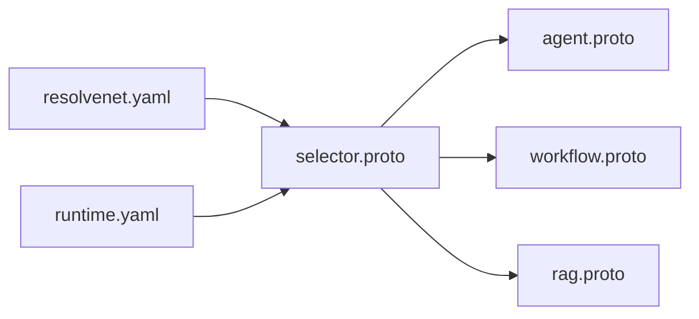

**Diagram sources**
- [selector.proto](file://api/proto/resolvenet/v1/selector.proto)
- [agent.proto](file://api/proto/resolvenet/v1/agent.proto)
- [workflow.proto](file://api/proto/resolvenet/v1/workflow.proto)
- [rag.proto](file://api/proto/resolvenet/v1/rag.proto)
- [resolvenet.yaml](file://configs/resolvenet.yaml)
- [runtime.yaml](file://configs/runtime.yaml)

**Section sources**
- [selector.proto](file://api/proto/resolvenet/v1/selector.proto)
- [agent.proto](file://api/proto/resolvenet/v1/agent.proto)
- [workflow.proto](file://api/proto/resolvenet/v1/workflow.proto)
- [rag.proto](file://api/proto/resolvenet/v1/rag.proto)
- [resolvenet.yaml](file://configs/resolvenet.yaml)
- [runtime.yaml](file://configs/runtime.yaml)

## Dependency Analysis
The selector package maintains loose coupling with subsystems through:
- Strategy interfaces (implemented per strategy)
- Shared data models (IntentClassification, RouteDecision)
- Protocol buffer contracts for inter-service communication
- Configuration-driven feature flags

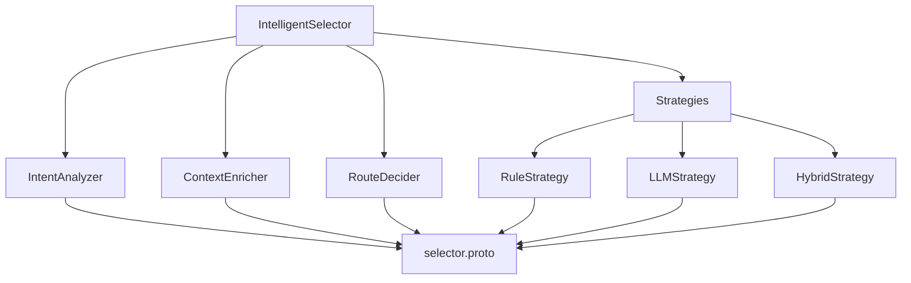

**Diagram sources**
- [selector.py:35-41](file://python/src/resolvenet/selector/selector.py#L35-L41)
- [rule_strategy.py:35-77](file://python/src/resolvenet/selector/strategies/rule_strategy.py#L35-L77)
- [llm_strategy.py:33-44](file://python/src/resolvenet/selector/strategies/llm_strategy.py#L33-L44)
- [hybrid_strategy.py:27-42](file://python/src/resolvenet/selector/strategies/hybrid_strategy.py#L27-L42)
- [intent.py:24-39](file://python/src/resolvenet/selector/intent.py#L24-L39)
- [context_enricher.py:16-47](file://python/src/resolvenet/selector/context_enricher.py#L16-L47)
- [router.py:17-40](file://python/src/resolvenet/selector/router.py#L17-L40)
- [selector.proto](file://api/proto/resolvenet/v1/selector.proto)

**Section sources**
- [selector.py:35-41](file://python/src/resolvenet/selector/selector.py#L35-L41)
- [rule_strategy.py:35-77](file://python/src/resolvenet/selector/strategies/rule_strategy.py#L35-L77)
- [llm_strategy.py:33-44](file://python/src/resolvenet/selector/strategies/llm_strategy.py#L33-L44)
- [hybrid_strategy.py:27-42](file://python/src/resolvenet/selector/strategies/hybrid_strategy.py#L27-L42)

## Performance Considerations
- Strategy Selection: Prefer hybrid strategy for balanced latency and accuracy. Rule strategy offers fastest path for known patterns; LLM strategy adds flexibility at higher latency.
- Confidence Threshold Tuning: Adjust HybridStrategy threshold to minimize LLM fallbacks while maintaining accuracy.
- Context Enrichment Cost: Defer heavy context fetches until necessary; cache frequently accessed metadata.
- Prompt Efficiency: Keep LLM routing prompts concise and include only essential dynamic context (skills, workflows, collections).
- Observability: Use reasoning fields and logging to monitor confidence distributions and route effectiveness.

## Troubleshooting Guide
Common issues and resolutions:
- Low Confidence Decisions: Increase rule coverage or adjust hybrid threshold.
- Misrouted Requests: Review regex patterns in RuleStrategy or refine LLM routing prompt.
- Missing Context: Verify ContextEnricher integrations for skills, workflows, and RAG collections.
- Logging: Inspect selector logs for strategy, route type, target, and confidence metrics.

Operational references:
- [selector.py:62-71](file://python/src/resolvenet/selector/selector.py#L62-L71)
- [hybrid_strategy.py:34-41](file://python/src/resolvenet/selector/strategies/hybrid_strategy.py#L34-L41)

**Section sources**
- [selector.py:62-71](file://python/src/resolvenet/selector/selector.py#L62-L71)
- [hybrid_strategy.py:34-41](file://python/src/resolvenet/selector/strategies/hybrid_strategy.py#L34-L41)

## Conclusion
The Intelligent Selector provides a modular, extensible meta-router for directing user requests across FTA workflows, skills, RAG pipelines, and direct LLM responses. Its staged design—intent analysis, context enrichment, and strategy-driven decision-making—enables both speed and adaptability. As implementations mature, integrating real LLM classification, robust context enrichment, and sophisticated route evaluation will further enhance system reliability and performance.