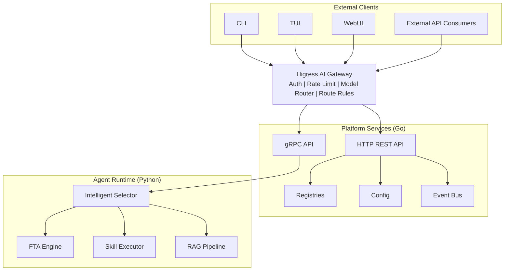
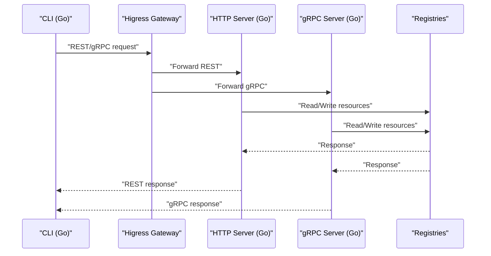
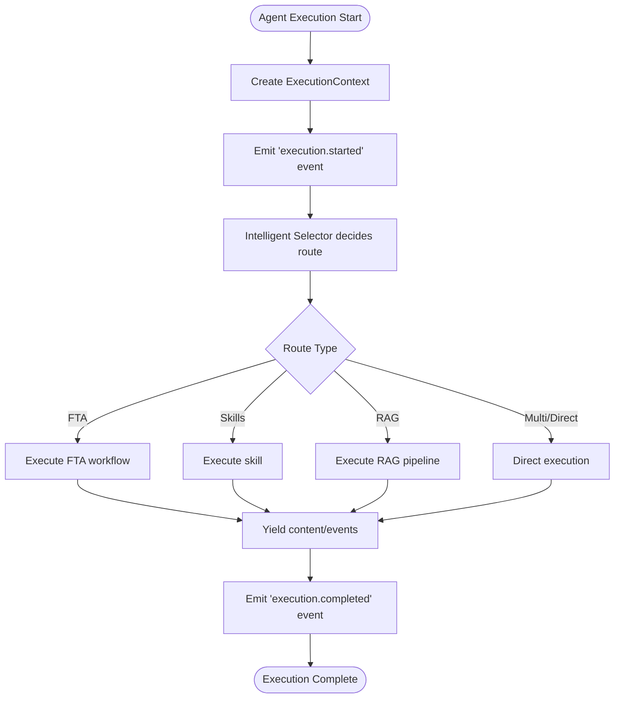
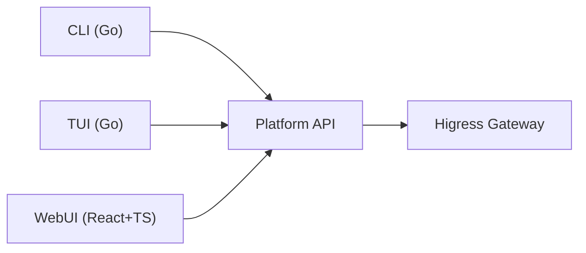
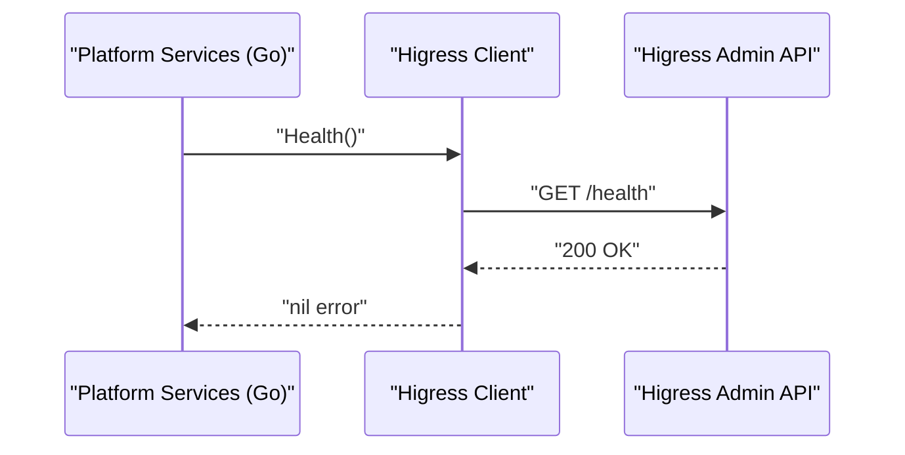
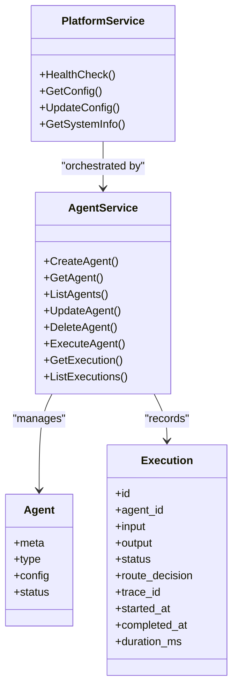
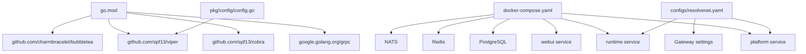

# System Overview

<cite>
**Referenced Files in This Document**
- [README.md](file://README.md)
- [cmd/resolvenet-server/main.go](file://cmd/resolvenet-server/main.go)
- [cmd/resolvenet-cli/main.go](file://cmd/resolvenet-cli/main.go)
- [internal/cli/root.go](file://internal/cli/root.go)
- [pkg/server/server.go](file://pkg/server/server.go)
- [pkg/server/router.go](file://pkg/server/router.go)
- [pkg/gateway/client.go](file://pkg/gateway/client.go)
- [pkg/config/config.go](file://pkg/config/config.go)
- [configs/resolvenet.yaml](file://configs/resolvenet.yaml)
- [api/proto/resolvenet/v1/platform.proto](file://api/proto/resolvenet/v1/platform.proto)
- [api/proto/resolvenet/v1/agent.proto](file://api/proto/resolvenet/v1/agent.proto)
- [python/src/resolvenet/runtime/engine.py](file://python/src/resolvenet/runtime/engine.py)
- [python/src/resolvenet/selector/selector.py](file://python/src/resolvenet/selector/selector.py)
- [python/src/resolvenet/agent/base.py](file://python/src/resolvenet/agent/base.py)
- [web/src/App.tsx](file://web/src/App.tsx)
- [internal/tui/app.go](file://internal/tui/app.go)
- [deploy/docker-compose/docker-compose.yaml](file://deploy/docker-compose/docker-compose.yaml)
- [go.mod](file://go.mod)
</cite>

## Table of Contents
1. [Introduction](#introduction)
2. [Project Structure](#project-structure)
3. [Core Components](#core-components)
4. [Architecture Overview](#architecture-overview)
5. [Detailed Component Analysis](#detailed-component-analysis)
6. [Dependency Analysis](#dependency-analysis)
7. [Performance Considerations](#performance-considerations)
8. [Troubleshooting Guide](#troubleshooting-guide)
9. [Conclusion](#conclusion)

## Introduction
ResolveNet is a CNCF-grade open-source Mega Agent platform that unifies Agent Skills, Fault Tree Analysis (FTA) Workflows, and Retrieval-Augmented Generation (RAG) under an intelligent routing layer. It is built on AgentScope for agent orchestration and Higress for AI gateway capabilities. The system separates concerns into:
- Client interfaces: CLI (Go), TUI (Go), and WebUI (React + TypeScript)
- Higress AI gateway for authentication, rate limiting, and model routing
- Platform services (Go): REST/gRPC API server, registries, configuration management, and event bus
- Agent runtime (Python): Intelligent Selector, FTA engine, skill executor, and RAG pipeline powered by AgentScope

Technology stack highlights:
- Go for platform services and CLI/TUI
- Python for runtime and agent orchestration
- React + TypeScript for WebUI
- Protocol Buffers for API contracts
- Docker and Kubernetes for cloud-native deployment

## Project Structure
ResolveNet organizes code by responsibility and language:
- api/proto: Protocol Buffer definitions for platform and agent APIs
- cmd: Go entry points for server and CLI
- pkg: Go libraries for server, gateway, configuration, storage, telemetry, and registries
- internal: Go CLI and TUI implementations
- python/src: Python runtime with agent, selector, FTA, skills, RAG, and telemetry modules
- web: React + TypeScript WebUI with routing and pages
- deploy: Docker, Docker Compose, and Helm/Kubernetes manifests
- configs: Default configuration files and examples
- skills: Community skill registry and manifests
- docs: Architecture and user documentation

```mermaid
graph TB
subgraph "Clients"
CLI["CLI (Go)"]
TUI["TUI (Go)"]
WebUI["WebUI (React+TS)"]
end
GW["Higress AI Gateway"]
subgraph "Platform Services (Go)"
API["REST/gRPC API Server"]
CFG["Config Manager"]
REG["Registries<br/>Agent/Skill/Workflow"]
EVT["Event Bus"]
end
subgraph "Runtime (Python)"
SEL["Intelligent Selector"]
FTA["FTA Engine"]
SKL["Skill Executor"]
RAG["RAG Pipeline"]
end
CLI --> GW
TUI --> GW
WebUI --> GW
GW --> API
API --> REG
API --> EVT
API <- --> SEL
SEL --> FTA
SEL --> SKL
SEL --> RAG
```

**Diagram sources**
- [README.md:14-46](file://README.md#L14-L46)
- [cmd/resolvenet-server/main.go:16-55](file://cmd/resolvenet-server/main.go#L16-L55)
- [pkg/server/server.go:27-52](file://pkg/server/server.go#L27-L52)
- [python/src/resolvenet/selector/selector.py:24-100](file://python/src/resolvenet/selector/selector.py#L24-L100)

**Section sources**
- [README.md:116-139](file://README.md#L116-L139)

## Core Components
- Platform Services (Go): Provides REST/gRPC API server, registries, configuration management, and event bus. Exposes health checks and system info endpoints and registers gRPC health and reflection.
- Agent Runtime (Python): Executes agents, orchestrates the Intelligent Selector, and routes to FTA, Skills, or RAG. Implements execution engine and agent base classes.
- CLI/TUI (Go): Command-line and interactive terminal dashboards for managing agents, skills, workflows, and RAG collections.
- WebUI (React+TS): Management console with routing to agent, skill, workflow, and RAG pages, plus a playground and settings.
- Gateway (Higress): AI gateway for authentication, rate limiting, model routing, and route rules.

**Section sources**
- [README.md:141-149](file://README.md#L141-L149)
- [pkg/server/server.go:19-52](file://pkg/server/server.go#L19-L52)
- [python/src/resolvenet/runtime/engine.py:14-89](file://python/src/resolvenet/runtime/engine.py#L14-L89)
- [internal/cli/root.go:19-52](file://internal/cli/root.go#L19-L52)
- [web/src/App.tsx:17-37](file://web/src/App.tsx#L17-L37)
- [pkg/gateway/client.go:9-31](file://pkg/gateway/client.go#L9-L31)

## Architecture Overview
ResolveNet follows a microservices pattern with clear separation between platform services (Go) and runtime execution (Python). The platform services expose REST and gRPC APIs, manage registries, and coordinate with the gateway. The runtime executes agent logic, applies intelligent routing, and performs domain-specific tasks (FTA, skills, RAG).



**Diagram sources**
- [README.md:14-46](file://README.md#L14-L46)
- [pkg/server/server.go:34-51](file://pkg/server/server.go#L34-L51)
- [pkg/server/router.go:11-55](file://pkg/server/router.go#L11-L55)
- [python/src/resolvenet/selector/selector.py:24-100](file://python/src/resolvenet/selector/selector.py#L24-L100)

## Detailed Component Analysis

### Platform Services (Go)
- Responsibilities:
  - Serve REST endpoints for agents, skills, workflows, RAG, models, and configuration
  - Provide gRPC API with health checks and reflection
  - Load and apply configuration from files and environment variables
  - Coordinate registries and event bus
- Entry points:
  - Server startup initializes gRPC and HTTP servers and handles graceful shutdown
  - CLI entry point delegates to Cobra-based commands
- Configuration:
  - Defaults and environment variable overrides via Viper
  - Example configuration file defines server, database, Redis, NATS, runtime, gateway, and telemetry settings



**Diagram sources**
- [cmd/resolvenet-server/main.go:16-55](file://cmd/resolvenet-server/main.go#L16-L55)
- [pkg/server/server.go:54-103](file://pkg/server/server.go#L54-L103)
- [pkg/server/router.go:11-55](file://pkg/server/router.go#L11-L55)
- [pkg/config/config.go:11-62](file://pkg/config/config.go#L11-L62)

**Section sources**
- [cmd/resolvenet-server/main.go:16-55](file://cmd/resolvenet-server/main.go#L16-L55)
- [pkg/server/server.go:19-103](file://pkg/server/server.go#L19-L103)
- [pkg/server/router.go:11-183](file://pkg/server/router.go#L11-L183)
- [pkg/config/config.go:11-62](file://pkg/config/config.go#L11-L62)
- [configs/resolvenet.yaml:1-34](file://configs/resolvenet.yaml#L1-L34)

### Agent Runtime (Python)
- Responsibilities:
  - Execute agents and stream results
  - Orchestrate Intelligent Selector decisions
  - Invoke FTA workflows, skills, and RAG pipelines
- Key modules:
  - Execution engine: creates execution context and yields events/content
  - Selector: LLM/rule/hybrid strategies for routing
  - Agent base: extends AgentScope with memory and telemetry
- Data flow:
  - Engine receives agent_id, input_text, conversation_id, and context
  - Emits execution events and content chunks
  - Selector decides route_type, route_target, and confidence



**Diagram sources**
- [python/src/resolvenet/runtime/engine.py:25-89](file://python/src/resolvenet/runtime/engine.py#L25-L89)
- [python/src/resolvenet/selector/selector.py:43-100](file://python/src/resolvenet/selector/selector.py#L43-L100)

**Section sources**
- [python/src/resolvenet/runtime/engine.py:14-89](file://python/src/resolvenet/runtime/engine.py#L14-L89)
- [python/src/resolvenet/selector/selector.py:24-100](file://python/src/resolvenet/selector/selector.py#L24-L100)
- [python/src/resolvenet/agent/base.py:11-62](file://python/src/resolvenet/agent/base.py#L11-L62)

### Client Interfaces
- CLI (Go):
  - Uses Cobra for subcommands (agent, skill, workflow, rag, config)
  - Persistent flags for server address and configuration file
  - Environment variable binding via Viper
- TUI (Go):
  - Bubble Tea-based interactive dashboard
  - Navigation among dashboard, agents, workflows, and logs
- WebUI (React+TS):
  - React Router-based pages for agents, skills, workflows, RAG, playground, and settings
  - Main layout with header, sidebar, and content area



**Diagram sources**
- [internal/cli/root.go:19-72](file://internal/cli/root.go#L19-L72)
- [internal/tui/app.go:20-102](file://internal/tui/app.go#L20-L102)
- [web/src/App.tsx:17-37](file://web/src/App.tsx#L17-L37)

**Section sources**
- [internal/cli/root.go:19-72](file://internal/cli/root.go#L19-L72)
- [internal/tui/app.go:20-102](file://internal/tui/app.go#L20-L102)
- [web/src/App.tsx:17-37](file://web/src/App.tsx#L17-L37)

### Gateway Integration
- Higress AI gateway:
  - Client wrapper for admin API communication
  - Health check method placeholder
- Configuration:
  - Admin URL and enable flag in configuration
  - Docker Compose demonstrates gateway integration



**Diagram sources**
- [pkg/gateway/client.go:25-31](file://pkg/gateway/client.go#L25-L31)
- [configs/resolvenet.yaml:25-28](file://configs/resolvenet.yaml#L25-L28)

**Section sources**
- [pkg/gateway/client.go:9-31](file://pkg/gateway/client.go#L9-L31)
- [configs/resolvenet.yaml:25-28](file://configs/resolvenet.yaml#L25-L28)
- [deploy/docker-compose/docker-compose.yaml:1-65](file://deploy/docker-compose/docker-compose.yaml#L1-L65)

### API Contracts (Protocol Buffers)
- PlatformService:
  - Health checks, config retrieval/update, and system info
- AgentService:
  - Agent lifecycle (create/get/list/update/delete)
  - Agent execution with streaming responses
  - Execution records and route decisions



**Diagram sources**
- [api/proto/resolvenet/v1/platform.proto:9-61](file://api/proto/resolvenet/v1/platform.proto#L9-L61)
- [api/proto/resolvenet/v1/agent.proto:11-177](file://api/proto/resolvenet/v1/agent.proto#L11-L177)

**Section sources**
- [api/proto/resolvenet/v1/platform.proto:9-61](file://api/proto/resolvenet/v1/platform.proto#L9-L61)
- [api/proto/resolvenet/v1/agent.proto:11-177](file://api/proto/resolvenet/v1/agent.proto#L11-L177)

## Dependency Analysis
- Language and module dependencies:
  - Go modules include grpc, viper, cobra, bubbletea, and lipgloss
  - Python runtime depends on AgentScope and third-party providers
- Deployment dependencies:
  - Docker Compose defines platform, runtime, webui, PostgreSQL, Redis, and NATS services
- Configuration precedence:
  - File paths and environment variables with RESOLVENET_ prefix



**Diagram sources**
- [go.mod:5-52](file://go.mod#L5-L52)
- [deploy/docker-compose/docker-compose.yaml:3-65](file://deploy/docker-compose/docker-compose.yaml#L3-L65)
- [pkg/config/config.go:11-62](file://pkg/config/config.go#L11-L62)
- [configs/resolvenet.yaml:1-34](file://configs/resolvenet.yaml#L1-L34)

**Section sources**
- [go.mod:5-52](file://go.mod#L5-L52)
- [deploy/docker-compose/docker-compose.yaml:3-65](file://deploy/docker-compose/docker-compose.yaml#L3-L65)
- [pkg/config/config.go:11-62](file://pkg/config/config.go#L11-L62)
- [configs/resolvenet.yaml:1-34](file://configs/resolvenet.yaml#L1-L34)

## Performance Considerations
- Microservices separation enables independent scaling of platform services and runtime.
- gRPC with health checks and reflection supports efficient internal communication.
- Streaming responses from agent execution improve latency for long-running tasks.
- Cloud-native deployment with Docker and Kubernetes facilitates horizontal scaling and observability.

## Troubleshooting Guide
- Server startup and shutdown:
  - Verify configuration loading and server addresses
  - Check graceful shutdown behavior on SIGINT/SIGTERM
- Gateway connectivity:
  - Confirm gateway admin URL and enable flag
  - Implement and test health checks
- Runtime execution:
  - Validate execution context creation and event emission
  - Ensure selector routing decisions align with expectations
- Configuration:
  - Confirm environment variable overrides and config file paths

**Section sources**
- [cmd/resolvenet-server/main.go:16-55](file://cmd/resolvenet-server/main.go#L16-L55)
- [pkg/gateway/client.go:25-31](file://pkg/gateway/client.go#L25-L31)
- [python/src/resolvenet/runtime/engine.py:25-89](file://python/src/resolvenet/runtime/engine.py#L25-L89)
- [pkg/config/config.go:11-62](file://pkg/config/config.go#L11-L62)

## Conclusion
ResolveNet’s architecture cleanly separates platform services (Go) from runtime execution (Python), enabling scalable, maintainable, and cloud-native operation. The use of Protocol Buffers for API contracts, Higress for gateway capabilities, and modern client interfaces (CLI, TUI, WebUI) provides a robust foundation for agent orchestration, intelligent routing, and domain-specific workflows.