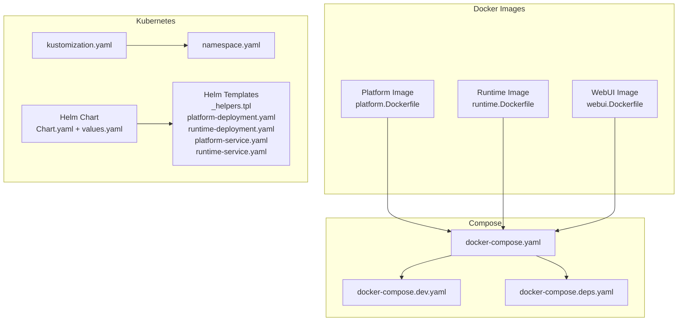
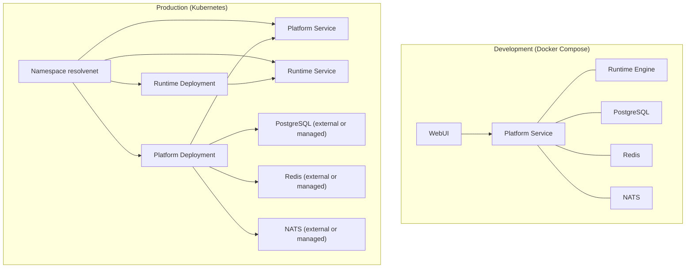
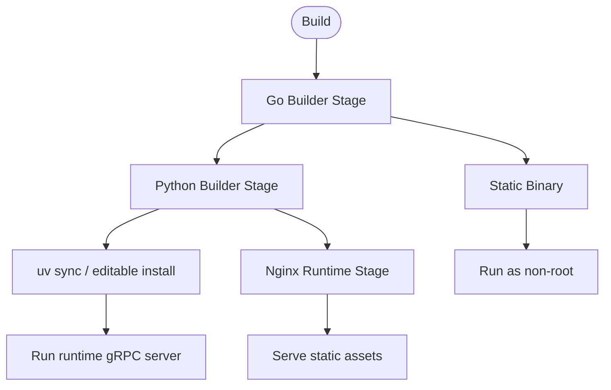
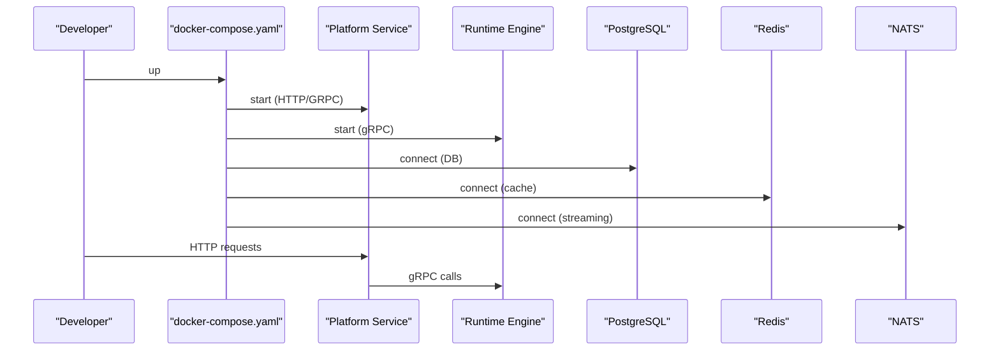
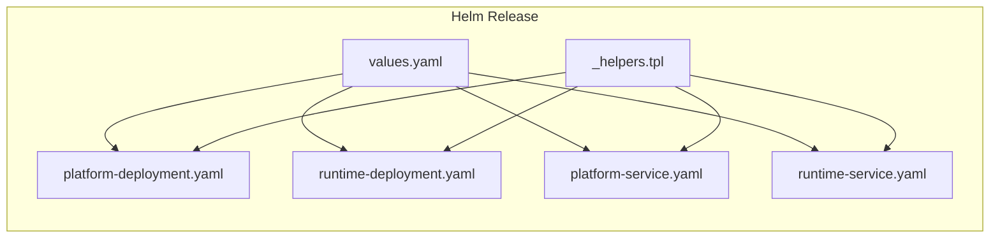
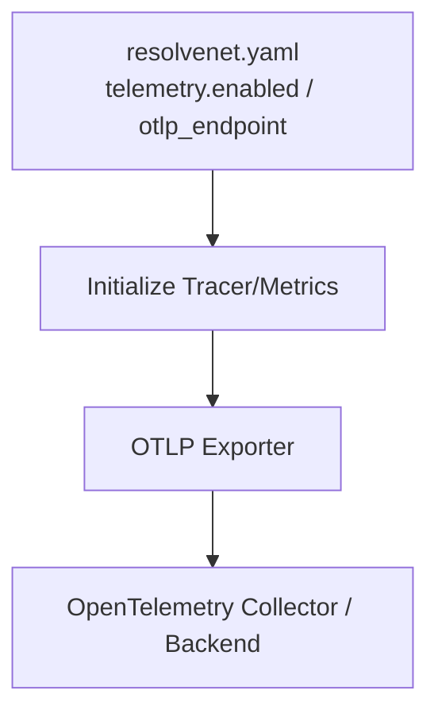
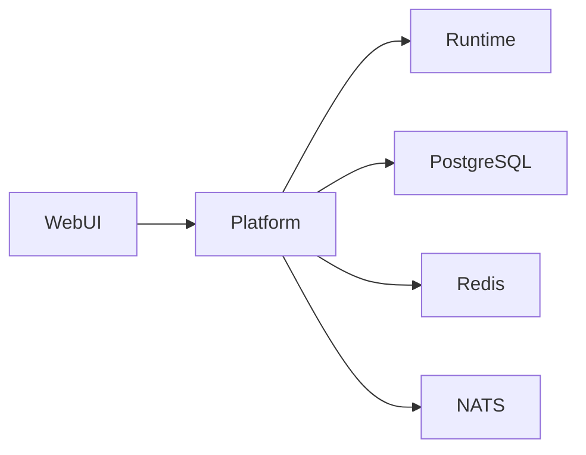

# Cloud-Native Deployment

<cite>
**Referenced Files in This Document**
- [platform.Dockerfile](file://deploy/docker/platform.Dockerfile)
- [runtime.Dockerfile](file://deploy/docker/runtime.Dockerfile)
- [webui.Dockerfile](file://deploy/docker/webui.Dockerfile)
- [docker-compose.yaml](file://deploy/docker-compose/docker-compose.yaml)
- [docker-compose.dev.yaml](file://deploy/docker-compose/docker-compose.dev.yaml)
- [docker-compose.deps.yaml](file://deploy/docker-compose/docker-compose.deps.yaml)
- [kustomization.yaml](file://deploy/k8s/kustomization.yaml)
- [namespace.yaml](file://deploy/k8s/namespace.yaml)
- [Chart.yaml](file://deploy/helm/resolvenet/Chart.yaml)
- [_helpers.tpl](file://deploy/helm/resolvenet/templates/_helpers.tpl)
- [values.yaml](file://deploy/helm/resolvenet/values.yaml)
- [platform-deployment.yaml](file://deploy/helm/resolvenet/templates/platform-deployment.yaml)
- [runtime-deployment.yaml](file://deploy/helm/resolvenet/templates/runtime-deployment.yaml)
- [platform-service.yaml](file://deploy/helm/resolvenet/templates/platform-service.yaml)
- [runtime-service.yaml](file://deploy/helm/resolvenet/templates/runtime-service.yaml)
- [resolvenet.yaml](file://configs/resolvenet.yaml)
- [tracer.go](file://pkg/telemetry/tracer.go)
- [metrics.go](file://pkg/telemetry/metrics.go)
</cite>

## Table of Contents
1. [Introduction](#introduction)
2. [Project Structure](#project-structure)
3. [Core Components](#core-components)
4. [Architecture Overview](#architecture-overview)
5. [Detailed Component Analysis](#detailed-component-analysis)
6. [Dependency Analysis](#dependency-analysis)
7. [Performance Considerations](#performance-considerations)
8. [Troubleshooting Guide](#troubleshooting-guide)
9. [Conclusion](#conclusion)
10. [Appendices](#appendices)

## Introduction
This document describes ResolveNet’s cloud-native deployment options across Docker, Docker Compose, and Kubernetes (Kustomize and Helm). It covers containerization strategy, development orchestration, production-grade deployments, service discovery and load balancing, scaling, observability via OpenTelemetry, security considerations, and operational guidance.

## Project Structure
ResolveNet provides:
- Three Dockerfiles for platform services, runtime engine, and WebUI
- Docker Compose stacks for local development and standalone dependencies
- Kubernetes manifests via Kustomize and Helm chart templates for production

**Diagram sources**
- [platform.Dockerfile:1-26](file://deploy/docker/platform.Dockerfile#L1-L26)
- [runtime.Dockerfile:1-22](file://deploy/docker/runtime.Dockerfile#L1-L22)
- [webui.Dockerfile:1-22](file://deploy/docker/webui.Dockerfile#L1-L22)
- [docker-compose.yaml:1-65](file://deploy/docker-compose/docker-compose.yaml#L1-L65)
- [docker-compose.dev.yaml:1-17](file://deploy/docker-compose/docker-compose.dev.yaml#L1-L17)
- [docker-compose.deps.yaml:1-37](file://deploy/docker-compose/docker-compose.deps.yaml#L1-L37)
- [kustomization.yaml:1-5](file://deploy/k8s/kustomization.yaml#L1-L5)
- [namespace.yaml:1-7](file://deploy/k8s/namespace.yaml#L1-L7)
- [Chart.yaml:1-18](file://deploy/helm/resolvenet/Chart.yaml#L1-L18)
- [_helpers.tpl:1-41](file://deploy/helm/resolvenet/templates/_helpers.tpl#L1-L41)
- [platform-deployment.yaml:1-39](file://deploy/helm/resolvenet/templates/platform-deployment.yaml#L1-L39)
- [runtime-deployment.yaml:1-27](file://deploy/helm/resolvenet/templates/runtime-deployment.yaml#L1-L27)
- [platform-service.yaml:1-18](file://deploy/helm/resolvenet/templates/platform-service.yaml#L1-L18)
- [runtime-service.yaml:1-15](file://deploy/helm/resolvenet/templates/runtime-service.yaml#L1-L15)

**Section sources**
- [platform.Dockerfile:1-26](file://deploy/docker/platform.Dockerfile#L1-L26)
- [runtime.Dockerfile:1-22](file://deploy/docker/runtime.Dockerfile#L1-L22)
- [webui.Dockerfile:1-22](file://deploy/docker/webui.Dockerfile#L1-L22)
- [docker-compose.yaml:1-65](file://deploy/docker-compose/docker-compose.yaml#L1-L65)
- [docker-compose.dev.yaml:1-17](file://deploy/docker-compose/docker-compose.dev.yaml#L1-L17)
- [docker-compose.deps.yaml:1-37](file://deploy/docker-compose/docker-compose.deps.yaml#L1-L37)
- [kustomization.yaml:1-5](file://deploy/k8s/kustomization.yaml#L1-L5)
- [namespace.yaml:1-7](file://deploy/k8s/namespace.yaml#L1-L7)
- [Chart.yaml:1-18](file://deploy/helm/resolvenet/Chart.yaml#L1-L18)
- [_helpers.tpl:1-41](file://deploy/helm/resolvenet/templates/_helpers.tpl#L1-L41)
- [values.yaml:1-66](file://deploy/helm/resolvenet/values.yaml#L1-L66)
- [platform-deployment.yaml:1-39](file://deploy/helm/resolvenet/templates/platform-deployment.yaml#L1-L39)
- [runtime-deployment.yaml:1-27](file://deploy/helm/resolvenet/templates/runtime-deployment.yaml#L1-L27)
- [platform-service.yaml:1-18](file://deploy/helm/resolvenet/templates/platform-service.yaml#L1-L18)
- [runtime-service.yaml:1-15](file://deploy/helm/resolvenet/templates/runtime-service.yaml#L1-L15)

## Core Components
- Platform service: Go-based HTTP/gRPC server exposing health checks and acting as the primary API gateway.
- Runtime engine: Python-based gRPC server hosting skills and workflows.
- WebUI: Static site served via Nginx, fronted by the platform service in production or exposed directly in development.

Key runtime ports:
- Platform HTTP: 8080
- Platform gRPC: 9090
- Runtime gRPC: 9091
- WebUI HTTP: 80

**Section sources**
- [platform.Dockerfile:23-25](file://deploy/docker/platform.Dockerfile#L23-L25)
- [runtime.Dockerfile:19-21](file://deploy/docker/runtime.Dockerfile#L19-L21)
- [webui.Dockerfile:19-21](file://deploy/docker/webui.Dockerfile#L19-L21)
- [resolvenet.yaml:3-24](file://configs/resolvenet.yaml#L3-L24)

## Architecture Overview
ResolveNet supports two primary deployment modes:
- Docker Compose for development and local iteration
- Kubernetes (Kustomize + Helm) for production with managed dependencies

**Diagram sources**
- [docker-compose.yaml:3-61](file://deploy/docker-compose/docker-compose.yaml#L3-L61)
- [kustomization.yaml:1-5](file://deploy/k8s/kustomization.yaml#L1-L5)
- [namespace.yaml:1-7](file://deploy/k8s/namespace.yaml#L1-L7)
- [platform-deployment.yaml:1-39](file://deploy/helm/resolvenet/templates/platform-deployment.yaml#L1-L39)
- [runtime-deployment.yaml:1-27](file://deploy/helm/resolvenet/templates/runtime-deployment.yaml#L1-L27)
- [platform-service.yaml:1-18](file://deploy/helm/resolvenet/templates/platform-service.yaml#L1-L18)
- [runtime-service.yaml:1-15](file://deploy/helm/resolvenet/templates/runtime-service.yaml#L1-L15)

## Detailed Component Analysis

### Containerization Strategy
- Platform service: Multi-stage Go build with static binary and minimal Alpine runtime. Exposes HTTP and gRPC ports and runs as non-root.
- Runtime engine: Python slim image with uv for dependency management. Runs the runtime gRPC server.
- WebUI: Nginx serving prebuilt static assets; exposes HTTP 80.

**Diagram sources**
- [platform.Dockerfile:1-26](file://deploy/docker/platform.Dockerfile#L1-L26)
- [runtime.Dockerfile:1-22](file://deploy/docker/runtime.Dockerfile#L1-L22)
- [webui.Dockerfile:1-22](file://deploy/docker/webui.Dockerfile#L1-L22)

**Section sources**
- [platform.Dockerfile:1-26](file://deploy/docker/platform.Dockerfile#L1-L26)
- [runtime.Dockerfile:1-22](file://deploy/docker/runtime.Dockerfile#L1-L22)
- [webui.Dockerfile:1-22](file://deploy/docker/webui.Dockerfile#L1-L22)

### Docker Compose Setup (Development)
- Full stack: platform, runtime, webui, postgres, redis, nats.
- Dependencies orchestrated via service links and environment variables.
- Development overrides:
  - Platform runs the Go server directly with hot reload via mounted source.
  - Runtime mounts Python sources and runs the module directly.

**Diagram sources**
- [docker-compose.yaml:3-61](file://deploy/docker-compose/docker-compose.yaml#L3-L61)
- [docker-compose.dev.yaml:3-16](file://deploy/docker-compose/docker-compose.dev.yaml#L3-L16)

**Section sources**
- [docker-compose.yaml:1-65](file://deploy/docker-compose/docker-compose.yaml#L1-L65)
- [docker-compose.dev.yaml:1-17](file://deploy/docker-compose/docker-compose.dev.yaml#L1-L17)

### Kubernetes Deployment (Kustomize + Helm)
- Kustomize defines a namespace for scoping.
- Helm chart provides:
  - Values for images, replicas, ports, and resource requests/limits
  - Deployments for platform and runtime
  - Services for internal routing
  - Optional PostgreSQL, Redis, and NATS via subcharts (enabled by default in values)

**Diagram sources**
- [values.yaml:1-66](file://deploy/helm/resolvenet/values.yaml#L1-L66)
- [_helpers.tpl:1-41](file://deploy/helm/resolvenet/templates/_helpers.tpl#L1-L41)
- [platform-deployment.yaml:1-39](file://deploy/helm/resolvenet/templates/platform-deployment.yaml#L1-L39)
- [runtime-deployment.yaml:1-27](file://deploy/helm/resolvenet/templates/runtime-deployment.yaml#L1-L27)
- [platform-service.yaml:1-18](file://deploy/helm/resolvenet/templates/platform-service.yaml#L1-L18)
- [runtime-service.yaml:1-15](file://deploy/helm/resolvenet/templates/runtime-service.yaml#L1-L15)

**Section sources**
- [kustomization.yaml:1-5](file://deploy/k8s/kustomization.yaml#L1-L5)
- [namespace.yaml:1-7](file://deploy/k8s/namespace.yaml#L1-L7)
- [Chart.yaml:1-18](file://deploy/helm/resolvenet/Chart.yaml#L1-L18)
- [values.yaml:1-66](file://deploy/helm/resolvenet/values.yaml#L1-L66)
- [_helpers.tpl:1-41](file://deploy/helm/resolvenet/templates/_helpers.tpl#L1-L41)
- [platform-deployment.yaml:1-39](file://deploy/helm/resolvenet/templates/platform-deployment.yaml#L1-L39)
- [runtime-deployment.yaml:1-27](file://deploy/helm/resolvenet/templates/runtime-deployment.yaml#L1-L27)
- [platform-service.yaml:1-18](file://deploy/helm/resolvenet/templates/platform-service.yaml#L1-L18)
- [runtime-service.yaml:1-15](file://deploy/helm/resolvenet/templates/runtime-service.yaml#L1-L15)

### Helm Chart Structure and Customization
- Chart identity and metadata defined in Chart.yaml.
- Centralized configuration in values.yaml:
  - Images and tags for platform, runtime, webui
  - Ports and probes for platform
  - Resource requests/limits for both workloads
  - Optional embedded PostgreSQL, Redis, NATS
  - Ingress disabled by default; configure host/path as needed

Customization examples:
- Scale platform or runtime by adjusting replicaCount
- Pin images with tags for reproducible deployments
- Tune CPU/memory requests/limits per workload
- Enable ingress and set host/path for external exposure
- Disable embedded databases and point to managed services

**Section sources**
- [Chart.yaml:1-18](file://deploy/helm/resolvenet/Chart.yaml#L1-L18)
- [values.yaml:1-66](file://deploy/helm/resolvenet/values.yaml#L1-L66)

### Service Discovery, Load Balancing, and Scaling
- Internal service discovery:
  - Kubernetes: Services expose ClusterIP endpoints; platform and runtime are addressable by DNS name within the cluster.
  - Compose: Services communicate via service names as hostnames.
- Load balancing:
  - Kubernetes: ClusterIP services distribute traffic across pod replicas.
  - Compose: No explicit LB; rely on single-container or Swarm/overlay networks.
- Scaling:
  - Adjust replicaCount in values.yaml for platform and runtime.
  - Horizontal Pod Autoscaling can be added via K8s autoscaling manifests if desired.

**Section sources**
- [platform-service.yaml:1-18](file://deploy/helm/resolvenet/templates/platform-service.yaml#L1-L18)
- [runtime-service.yaml:1-15](file://deploy/helm/resolvenet/templates/runtime-service.yaml#L1-L15)
- [values.yaml:3-66](file://deploy/helm/resolvenet/values.yaml#L3-L66)

### Environment-Specific Deployment Configurations
- Development:
  - Use docker-compose.yaml for full stack.
  - Use docker-compose.dev.yaml to run platform and runtime in development mode with source mounts.
  - Use docker-compose.deps.yaml to provision PostgreSQL, Redis, NATS, and optional Milvus stack.
- Staging:
  - Use Helm with values.yaml tuned for staging (e.g., higher resource requests, enable ingress, point to managed DB/Redis/NATS).
- Production:
  - Use Helm with production-grade values (e.g., pinned image tags, strict resource limits, ingress enabled, managed infrastructure).

Note: The provided Compose files define ports and service names; adjust ingress.hosts and service ports accordingly when enabling ingress.

**Section sources**
- [docker-compose.yaml:1-65](file://deploy/docker-compose/docker-compose.yaml#L1-L65)
- [docker-compose.dev.yaml:1-17](file://deploy/docker-compose/docker-compose.dev.yaml#L1-L17)
- [docker-compose.deps.yaml:1-37](file://deploy/docker-compose/docker-compose.deps.yaml#L1-L37)
- [values.yaml:45-53](file://deploy/helm/resolvenet/values.yaml#L45-L53)

### Observability and OpenTelemetry Integration
- Platform configuration supports telemetry toggles and OTLP endpoint.
- Telemetry initialization exists in the codebase for tracer and metrics providers.
- To enable production observability:
  - Set telemetry.enabled and otlp_endpoint in configuration.
  - Configure an OpenTelemetry collector or sidecar/exporter in Kubernetes.
  - Ensure network policies allow outbound to the collector endpoint.

**Diagram sources**
- [resolvenet.yaml:29-34](file://configs/resolvenet.yaml#L29-L34)
- [tracer.go:8-21](file://pkg/telemetry/tracer.go#L8-L21)
- [metrics.go:7-12](file://pkg/telemetry/metrics.go#L7-L12)

**Section sources**
- [resolvenet.yaml:29-34](file://configs/resolvenet.yaml#L29-L34)
- [tracer.go:8-21](file://pkg/telemetry/tracer.go#L8-L21)
- [metrics.go:7-12](file://pkg/telemetry/metrics.go#L7-L12)

## Dependency Analysis
ResolveNet components depend on:
- Platform service depends on PostgreSQL, Redis, NATS, and Runtime engine.
- Runtime engine depends on platform for orchestration and on external systems for persistence and streaming.
- WebUI depends on platform for API access.

**Diagram sources**
- [docker-compose.yaml:3-61](file://deploy/docker-compose/docker-compose.yaml#L3-L61)
- [resolvenet.yaml:7-24](file://configs/resolvenet.yaml#L7-L24)

**Section sources**
- [docker-compose.yaml:1-65](file://deploy/docker-compose/docker-compose.yaml#L1-L65)
- [resolvenet.yaml:1-34](file://configs/resolvenet.yaml#L1-L34)

## Performance Considerations
- Resource sizing:
  - Start with provided defaults in values.yaml and adjust based on observed CPU and memory usage.
  - Increase runtime limits for heavy skills/workflows; increase platform limits under high concurrency.
- Probes:
  - Platform uses HTTP health checks; ensure endpoints are responsive under load.
- Network:
  - Keep platform and runtime close to shared caches (Redis) and databases (PostgreSQL) to reduce latency.
- Caching:
  - Use Redis for session/state caching; monitor hit rates and tune capacity.
- Storage:
  - Persist PostgreSQL data; ensure adequate disk IOPS for concurrent writes.

[No sources needed since this section provides general guidance]

## Troubleshooting Guide
Common issues and resolutions:
- Platform health check failures:
  - Verify HTTP port binding and health endpoint availability.
  - Confirm database, Redis, and NATS connectivity.
- Runtime gRPC connection errors:
  - Ensure runtime service is reachable at configured gRPC address.
  - Check firewall/network policies blocking port 9091.
- WebUI not loading:
  - Confirm platform is proxying or serving UI assets.
  - Check ingress configuration and host/path settings.
- Database connectivity:
  - Validate credentials and network routes to PostgreSQL.
- Redis connectivity:
  - Verify address and credentials; confirm service is reachable.
- NATS connectivity:
  - Ensure NATS URL and JetStream configuration are correct.

Operational tips:
- Use Kubernetes events and logs to diagnose startup and runtime issues.
- Enable verbose logging during investigation.
- Temporarily scale down replicas to isolate contention.

**Section sources**
- [platform-deployment.yaml:29-38](file://deploy/helm/resolvenet/templates/platform-deployment.yaml#L29-L38)
- [values.yaml:45-53](file://deploy/helm/resolvenet/values.yaml#L45-L53)
- [docker-compose.yaml:11-19](file://deploy/docker-compose/docker-compose.yaml#L11-L19)

## Conclusion
ResolveNet offers a clear cloud-native path from local development with Docker Compose to production with Kubernetes and Helm. The separation of concerns into platform, runtime, and WebUI enables independent scaling and maintenance. With optional embedded dependencies and flexible ingress configuration, teams can tailor deployments to development, staging, and production needs while integrating observability and operational controls.

[No sources needed since this section summarizes without analyzing specific files]

## Appendices

### Appendix A: Port Reference
- Platform HTTP: 8080
- Platform gRPC: 9090
- Runtime gRPC: 9091
- WebUI HTTP: 80

**Section sources**
- [platform.Dockerfile:23-25](file://deploy/docker/platform.Dockerfile#L23-L25)
- [runtime.Dockerfile:19-21](file://deploy/docker/runtime.Dockerfile#L19-L21)
- [webui.Dockerfile:19-21](file://deploy/docker/webui.Dockerfile#L19-L21)
- [resolvenet.yaml:3-24](file://configs/resolvenet.yaml#L3-L24)

### Appendix B: Security Considerations
- Secrets management:
  - Store sensitive configuration (database passwords, Redis auth, NATS tokens) in Kubernetes Secrets or environment injection.
  - Avoid committing secrets to source control.
- Network policies:
  - Restrict inbound traffic to platform and webui services.
  - Limit outbound traffic to trusted collectors and managed services.
- Ingress:
  - Enable TLS termination at the ingress controller.
  - Set appropriate host and path rules; avoid wildcard exposure.
- Least privilege:
  - Run containers as non-root where possible.
  - Limit capabilities and mount only necessary volumes.

[No sources needed since this section provides general guidance]