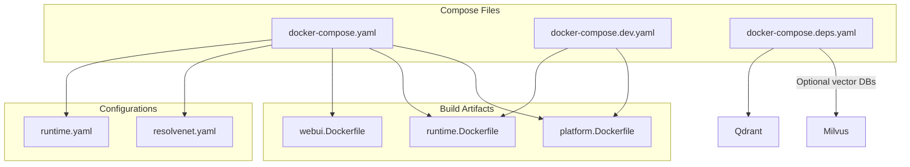
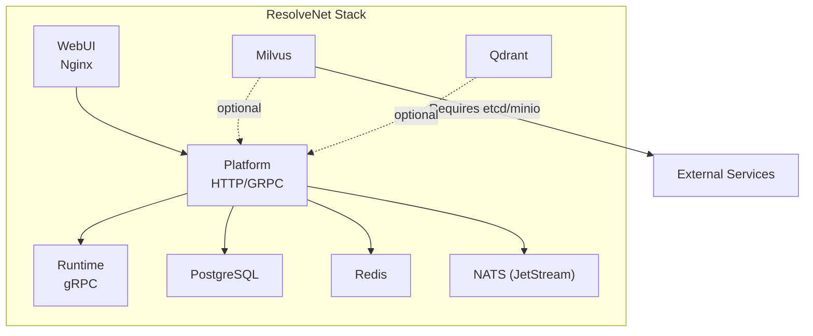
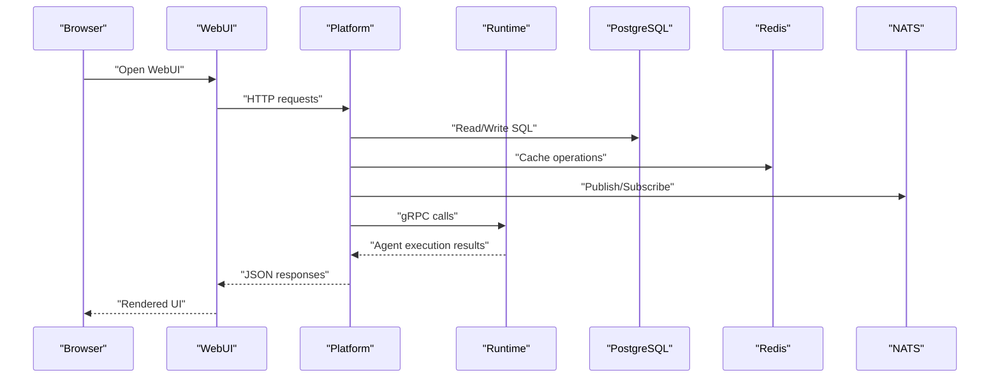
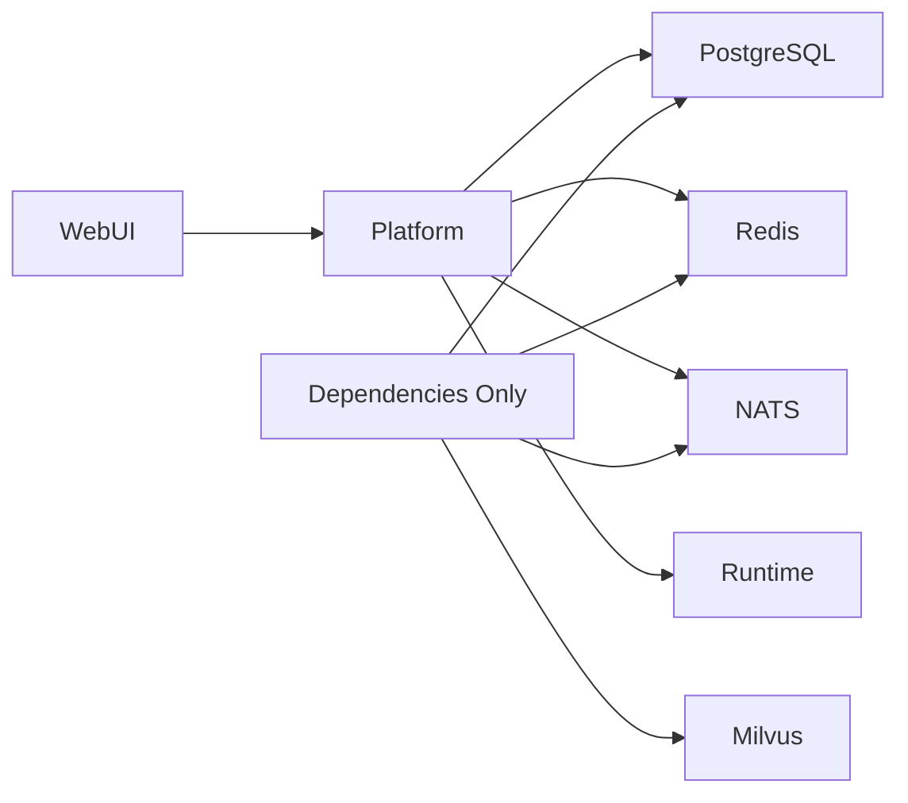

# Docker Compose Environment

<cite>
**Referenced Files in This Document**
- [docker-compose.yaml](file://deploy/docker-compose/docker-compose.yaml)
- [docker-compose.dev.yaml](file://deploy/docker-compose/docker-compose.dev.yaml)
- [docker-compose.deps.yaml](file://deploy/docker-compose/docker-compose.deps.yaml)
- [platform.Dockerfile](file://deploy/docker/platform.Dockerfile)
- [runtime.Dockerfile](file://deploy/docker/runtime.Dockerfile)
- [webui.Dockerfile](file://deploy/docker/webui.Dockerfile)
- [resolvenet.yaml](file://configs/resolvenet.yaml)
- [runtime.yaml](file://configs/runtime.yaml)
- [milvus.py](file://python/src/resolvenet/rag/index/milvus.py)
- [qdrant.py](file://python/src/resolvenet/rag/index/qdrant.py)
</cite>

## Table of Contents
1. [Introduction](#introduction)
2. [Project Structure](#project-structure)
3. [Core Components](#core-components)
4. [Architecture Overview](#architecture-overview)
5. [Detailed Component Analysis](#detailed-component-analysis)
6. [Dependency Analysis](#dependency-analysis)
7. [Performance Considerations](#performance-considerations)
8. [Troubleshooting Guide](#troubleshooting-guide)
9. [Conclusion](#conclusion)
10. [Appendices](#appendices)

## Introduction
This document explains the Docker Compose environments for ResolveNet, covering orchestration of the platform, runtime, WebUI, PostgreSQL, Redis, NATS, and optional vector databases (Milvus and Qdrant). It details service dependencies, startup ordering, inter-container communication, development hot-reload configurations, and operational best practices for local deployments. It also provides guidance for scaling services, customizing environment variables, and resolving common issues such as port conflicts and data persistence.

## Project Structure
ResolveNet’s Docker Compose setup is organized into three primary compose files:
- Full-stack orchestration for production-like local runs
- Development-specific compose enabling hot reload and iterative builds
- Dependency-only compose for standalone database services

**Diagram sources**
- [docker-compose.yaml:1-65](file://deploy/docker-compose/docker-compose.yaml#L1-L65)
- [docker-compose.dev.yaml:1-17](file://deploy/docker-compose/docker-compose.dev.yaml#L1-L17)
- [docker-compose.deps.yaml:1-37](file://deploy/docker-compose/docker-compose.deps.yaml#L1-L37)
- [platform.Dockerfile:1-26](file://deploy/docker/platform.Dockerfile#L1-L26)
- [runtime.Dockerfile:1-22](file://deploy/docker/runtime.Dockerfile#L1-L22)
- [webui.Dockerfile:1-22](file://deploy/docker/webui.Dockerfile#L1-L22)
- [resolvenet.yaml:1-34](file://configs/resolvenet.yaml#L1-L34)
- [runtime.yaml:1-18](file://configs/runtime.yaml#L1-L18)

**Section sources**
- [docker-compose.yaml:1-65](file://deploy/docker-compose/docker-compose.yaml#L1-L65)
- [docker-compose.dev.yaml:1-17](file://deploy/docker-compose/docker-compose.dev.yaml#L1-L17)
- [docker-compose.deps.yaml:1-37](file://deploy/docker-compose/docker-compose.deps.yaml#L1-L37)

## Core Components
This section describes each service and its role in the ResolveNet stack.

- Platform service
  - Exposes HTTP and gRPC ports for API and metrics.
  - Connects to PostgreSQL, Redis, NATS, and the Runtime service via container DNS.
  - Depends on database and messaging infrastructure.

- Runtime service
  - Provides agent runtime over gRPC.
  - Listens on a dedicated port for agent execution.

- WebUI service
  - Serves the frontend via Nginx.
  - Depends on the Platform service for API connectivity.

- PostgreSQL
  - Persistent relational store for application data.
  - Mounted volume ensures durability across restarts.

- Redis
  - In-memory cache/store used by the platform.

- NATS
  - Streaming broker configured with JetStream enabled.

- Optional vector databases
  - Milvus and Qdrant are available for RAG workloads.
  - Milvus requires etcd and MinIO; Qdrant exposes its own port.

**Section sources**
- [docker-compose.yaml:4-39](file://deploy/docker-compose/docker-compose.yaml#L4-L39)
- [docker-compose.deps.yaml:4-34](file://deploy/docker-compose/docker-compose.deps.yaml#L4-L34)
- [resolvenet.yaml:3-24](file://configs/resolvenet.yaml#L3-L24)
- [runtime.yaml:3-18](file://configs/runtime.yaml#L3-L18)

## Architecture Overview
The following diagram maps the full-stack deployment, showing inter-service dependencies and communication paths.

**Diagram sources**
- [docker-compose.yaml:4-39](file://deploy/docker-compose/docker-compose.yaml#L4-L39)
- [docker-compose.deps.yaml:27-34](file://deploy/docker-compose/docker-compose.deps.yaml#L27-L34)

## Detailed Component Analysis

### Full-Stack Orchestration (docker-compose.yaml)
- Services and ports
  - Platform: binds HTTP and metrics ports.
  - Runtime: binds gRPC port.
  - WebUI: binds frontend port mapped to container port 80.
  - PostgreSQL: binds default port with mounted volume.
  - Redis: binds default port.
  - NATS: binds client and management ports with JetStream enabled.

- Environment wiring
  - Platform sets connection strings for database, cache, messaging, and runtime gRPC address.
  - Runtime sets listening host and port for gRPC.

- Startup order
  - Platform depends on PostgreSQL, Redis, and NATS.
  - WebUI depends on Platform.
  - Runtime does not declare explicit dependencies; ensure it starts after Platform.

- Inter-container networking
  - Services communicate using service names as hostnames within the Compose network.

- Volumes and persistence
  - PostgreSQL data is persisted via named volume.
  - No persistent volumes are defined for Redis or NATS; data is ephemeral.

- Vector database note
  - Milvus and Qdrant are not included in this compose file; use the dependency-only compose for vector DBs.

**Section sources**
- [docker-compose.yaml:4-65](file://deploy/docker-compose/docker-compose.yaml#L4-L65)
- [resolvenet.yaml:7-24](file://configs/resolvenet.yaml#L7-L24)
- [runtime.yaml:3-6](file://configs/runtime.yaml#L3-L6)

### Development Orchestration (docker-compose.dev.yaml)
- Hot reload and iterative development
  - Platform service uses a multi-stage build targeting a builder stage and mounts the Go source tree for live updates.
  - Runtime service mounts the Python package and runs via uv for rapid iteration.
  - Commands launch the respective servers directly for fast feedback loops.

- Ports and environment
  - Platform HTTP address is set for local binding.
  - Runtime uses uv to execute the Python module.

- Notes
  - This compose file focuses on platform and runtime; it does not include WebUI, databases, or NATS by default.
  - Use the dependency-only compose to provision supporting services when needed.

**Section sources**
- [docker-compose.dev.yaml:4-17](file://deploy/docker-compose/docker-compose.dev.yaml#L4-L17)

### Dependency-Only Orchestration (docker-compose.deps.yaml)
- Purpose
  - Provides standalone database services for local development and testing without the platform or runtime.

- Included services
  - PostgreSQL, Redis, NATS (with JetStream), and Milvus.
  - Milvus requires etcd and MinIO; these are external dependencies referenced by Milvus.

- Ports and persistence
  - PostgreSQL data persisted via named volume.
  - Milvus port exposed for vector operations.

- Vector database backends
  - Milvus backend is implemented in Python and expects a Milvus instance.
  - Qdrant backend is implemented in Python and expects a Qdrant instance.

**Section sources**
- [docker-compose.deps.yaml:4-37](file://deploy/docker-compose/docker-compose.deps.yaml#L4-L37)
- [milvus.py:18-21](file://python/src/resolvenet/rag/index/milvus.py#L18-L21)
- [qdrant.py:18-21](file://python/src/resolvenet/rag/index/qdrant.py#L18-L21)

### Container Images and Build Process
- Platform image
  - Multi-stage build: fetches Go modules, builds a static binary, then runs on a minimal Alpine base with non-root user and exposed ports.

- Runtime image
  - Python slim base with uv installed; synchronizes dependencies and runs the Python module as a non-root user.

- WebUI image
  - Node build stage installs and builds the frontend; Nginx serves the built assets with a custom configuration.

**Section sources**
- [platform.Dockerfile:1-26](file://deploy/docker/platform.Dockerfile#L1-L26)
- [runtime.Dockerfile:1-22](file://deploy/docker/runtime.Dockerfile#L1-L22)
- [webui.Dockerfile:1-22](file://deploy/docker/webui.Dockerfile#L1-L22)

### Configuration Files
- Platform configuration
  - Defines HTTP and gRPC addresses, database credentials, Redis address, NATS URL, runtime gRPC address, and telemetry settings.

- Runtime configuration
  - Defines server host/port, agent pool sizing, selector defaults, and telemetry settings.

- Environment variable overrides
  - Compose environment blocks override defaults in configuration files.
  - Example overrides include database host, cache address, NATS URL, and runtime gRPC address.

**Section sources**
- [resolvenet.yaml:3-34](file://configs/resolvenet.yaml#L3-L34)
- [runtime.yaml:3-18](file://configs/runtime.yaml#L3-L18)
- [docker-compose.yaml:11-29](file://deploy/docker-compose/docker-compose.yaml#L11-L29)

## Architecture Overview

**Diagram sources**
- [docker-compose.yaml:4-39](file://deploy/docker-compose/docker-compose.yaml#L4-L39)
- [resolvenet.yaml:7-24](file://configs/resolvenet.yaml#L7-L24)
- [runtime.yaml:3-6](file://configs/runtime.yaml#L3-L6)

## Detailed Component Analysis

### Service Dependencies and Startup Ordering
- Explicit dependencies
  - Platform depends on PostgreSQL, Redis, and NATS.
  - WebUI depends on Platform.
  - Runtime does not declare explicit dependencies; ensure it starts after Platform.

- Network dependencies
  - Platform connects to PostgreSQL, Redis, NATS, and Runtime using service names as hostnames.
  - WebUI communicates with Platform via HTTP.

- Recommendations
  - Use health checks or wait-for-it scripts if strict ordering is required.
  - Keep NATS JetStream enabled for streaming features.

**Section sources**
- [docker-compose.yaml:16-39](file://deploy/docker-compose/docker-compose.yaml#L16-L39)
- [resolvenet.yaml:19-23](file://configs/resolvenet.yaml#L19-L23)

### Inter-Container Communication
- Hostnames
  - Use service names as hostnames inside the Compose network.
  - Examples: postgres, redis, nats, runtime.

- Ports
  - Platform exposes HTTP and gRPC ports.
  - Runtime exposes gRPC port.
  - WebUI serves on port 80 inside the container; mapped to a host port externally.
  - PostgreSQL, Redis, NATS expose standard ports.

**Section sources**
- [docker-compose.yaml:8-61](file://deploy/docker-compose/docker-compose.yaml#L8-L61)

### Development-Specific Compose (Hot Reload)
- Platform
  - Uses a builder stage and mounts the Go source tree.
  - Runs the server via go run for immediate feedback.

- Runtime
  - Mounts the Python package and runs via uv for quick iteration.

- When to use
  - Ideal for local development where frequent code changes occur.
  - Combine with dependency-only compose for databases and messaging.

**Section sources**
- [docker-compose.dev.yaml:4-17](file://deploy/docker-compose/docker-compose.dev.yaml#L4-L17)

### Dependency-Only Compose (Standalone Databases)
- Includes
  - PostgreSQL, Redis, NATS (JetStream), and Milvus.
  - Milvus requires etcd and MinIO; ensure they are available in your environment.

- Use cases
  - Local testing of RAG pipelines.
  - Isolated database development.

**Section sources**
- [docker-compose.deps.yaml:4-37](file://deploy/docker-compose/docker-compose.deps.yaml#L4-L37)

### Vector Database Backends
- Milvus
  - Backend class initializes with host/port and exposes CRUD-like methods.
  - Requires external etcd and MinIO endpoints.

- Qdrant
  - Backend class initializes with host/port and exposes CRUD-like methods.

- Selection
  - Choose one backend for local development or use the dependency-only compose to provision Milvus.

**Section sources**
- [milvus.py:18-21](file://python/src/resolvenet/rag/index/milvus.py#L18-L21)
- [qdrant.py:18-21](file://python/src/resolvenet/rag/index/qdrant.py#L18-L21)

## Dependency Analysis

**Diagram sources**
- [docker-compose.yaml:4-39](file://deploy/docker-compose/docker-compose.yaml#L4-L39)
- [docker-compose.deps.yaml:4-34](file://deploy/docker-compose/docker-compose.deps.yaml#L4-L34)

**Section sources**
- [docker-compose.yaml:16-39](file://deploy/docker-compose/docker-compose.yaml#L16-L39)
- [docker-compose.deps.yaml:27-34](file://deploy/docker-compose/docker-compose.deps.yaml#L27-L34)

## Performance Considerations
- Resource allocation
  - Increase CPU/memory limits for services under load (e.g., PostgreSQL, Milvus).
- Database tuning
  - Tune PostgreSQL shared buffers and WAL settings for write-heavy workloads.
  - Enable connection pooling in the platform.
- NATS throughput
  - Monitor JetStream disk usage and retention policies.
- Vector database sizing
  - Provision sufficient storage and memory for Milvus or Qdrant indices.
- Metrics and observability
  - Enable telemetry in configuration files for metrics and traces.
  - Expose Prometheus-compatible metrics endpoints where supported.

[No sources needed since this section provides general guidance]

## Troubleshooting Guide
- Port conflicts
  - If a host port is already in use, change the mapping in the compose file or free the conflicting port.
  - Verify that PostgreSQL, Redis, NATS, Milvus, and WebUI ports are not duplicated.

- Data persistence
  - PostgreSQL data persists via a named volume; ensure the volume exists and has adequate disk space.
  - Redis and NATS are ephemeral by default; enable persistence if required.

- Service readiness
  - Platform may fail to start if dependent services are unavailable.
  - Add health checks or retry logic to delay Platform startup until dependencies are ready.

- Vector database connectivity
  - Milvus requires etcd and MinIO; ensure these are reachable from Milvus.
  - Verify Milvus port exposure and firewall rules.

- Environment mismatches
  - Confirm that environment variables in compose match the configuration files.
  - Validate that service hostnames resolve correctly within the Compose network.

**Section sources**
- [docker-compose.yaml:40-65](file://deploy/docker-compose/docker-compose.yaml#L40-L65)
- [docker-compose.deps.yaml:27-34](file://deploy/docker-compose/docker-compose.deps.yaml#L27-L34)

## Conclusion
ResolveNet’s Docker Compose setup provides flexible deployment modes:
- Full-stack orchestration for integrated development and demos.
- Development compose for hot-reload and rapid iteration.
- Dependency-only compose for standalone database services and vector DBs.

By understanding service dependencies, environment overrides, and persistence, teams can reliably run ResolveNet locally, scale services as needed, and troubleshoot common issues effectively.

[No sources needed since this section summarizes without analyzing specific files]

## Appendices

### Local Development Setup Examples
- Run the full stack
  - Use the full-stack compose file to start Platform, Runtime, WebUI, PostgreSQL, Redis, and NATS.
- Run development servers
  - Use the development compose file to run Platform and Runtime with hot reload.
  - Optionally combine with dependency-only compose for databases.
- Scale services
  - Scale Platform or Runtime replicas as supported by their implementations.
  - For databases, adjust resource limits and consider clustering for Milvus.

[No sources needed since this section provides general guidance]

### Environment Variable Overrides
- Platform
  - Override database host, cache address, NATS URL, and runtime gRPC address.
- Runtime
  - Override server host and port.
- WebUI
  - Configure reverse proxy behavior via Nginx configuration in the image.

**Section sources**
- [docker-compose.yaml:11-29](file://deploy/docker-compose/docker-compose.yaml#L11-L29)
- [resolvenet.yaml:7-24](file://configs/resolvenet.yaml#L7-L24)
- [runtime.yaml:3-6](file://configs/runtime.yaml#L3-L6)

### Monitoring and Telemetry
- Enable telemetry in configuration files for metrics and traces.
- Expose metrics endpoints and integrate with a monitoring stack as needed.

**Section sources**
- [resolvenet.yaml:29-34](file://configs/resolvenet.yaml#L29-L34)
- [runtime.yaml:15-18](file://configs/runtime.yaml#L15-L18)