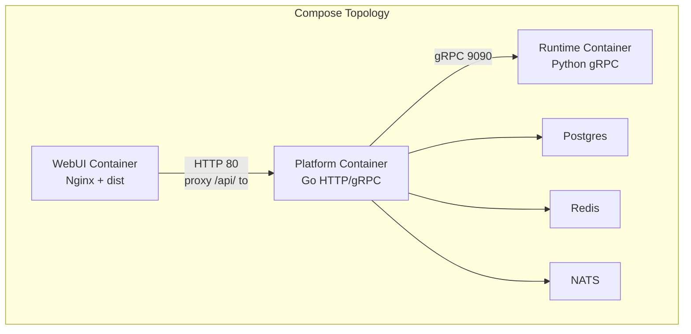
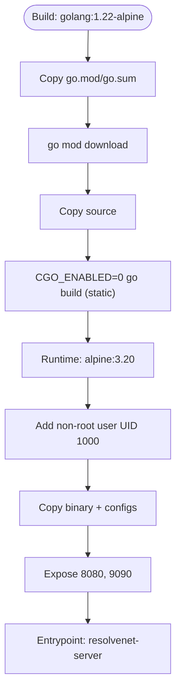
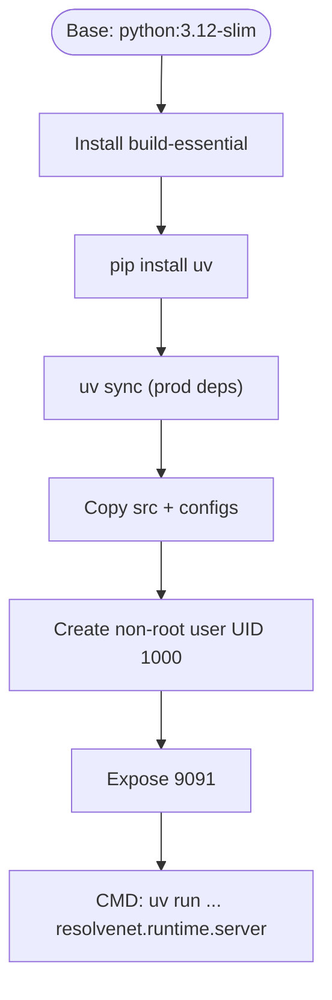
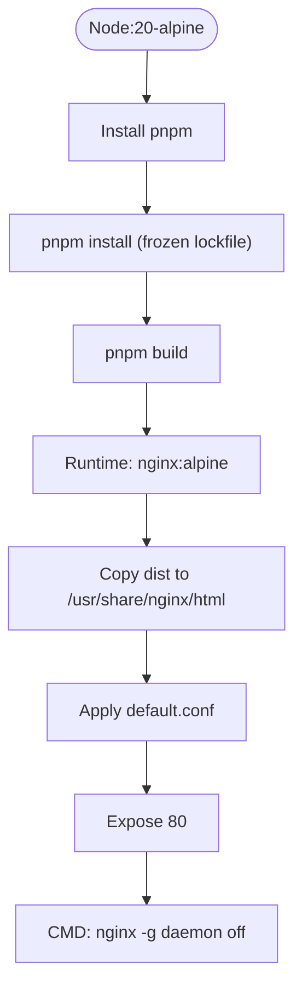
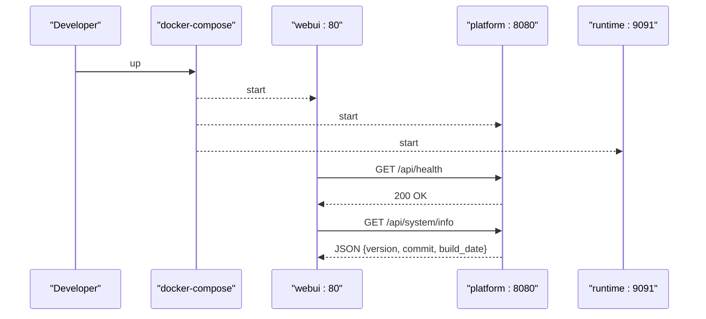
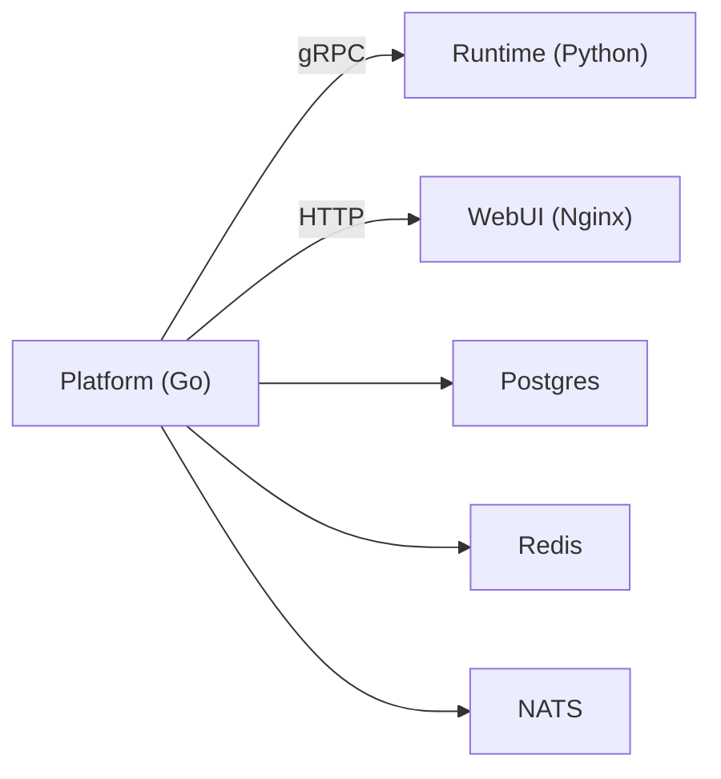

# Docker Containers

<cite>
**Referenced Files in This Document**
- [platform.Dockerfile](file://deploy/docker/platform.Dockerfile)
- [runtime.Dockerfile](file://deploy/docker/runtime.Dockerfile)
- [webui.Dockerfile](file://deploy/docker/webui.Dockerfile)
- [nginx.conf](file://deploy/docker/nginx.conf)
- [docker-compose.yaml](file://deploy/docker-compose/docker-compose.yaml)
- [docker-compose.dev.yaml](file://deploy/docker-compose/docker-compose.dev.yaml)
- [docker-compose.deps.yaml](file://deploy/docker-compose/docker-compose.deps.yaml)
- [resolvenet.yaml](file://configs/resolvenet.yaml)
- [runtime.yaml](file://configs/runtime.yaml)
- [values.yaml](file://deploy/helm/resolvenet/values.yaml)
- [Chart.yaml](file://deploy/helm/resolvenet/Chart.yaml)
- [kustomization.yaml](file://deploy/k8s/kustomization.yaml)
- [server.go](file://pkg/server/server.go)
- [router.go](file://pkg/server/router.go)
- [server.py](file://python/src/resolvenet/runtime/server.py)
- [pyproject.toml](file://python/pyproject.toml)
- [package.json](file://web/package.json)
</cite>

## Table of Contents
1. [Introduction](#introduction)
2. [Project Structure](#project-structure)
3. [Core Components](#core-components)
4. [Architecture Overview](#architecture-overview)
5. [Detailed Component Analysis](#detailed-component-analysis)
6. [Dependency Analysis](#dependency-analysis)
7. [Performance Considerations](#performance-considerations)
8. [Troubleshooting Guide](#troubleshooting-guide)
9. [Conclusion](#conclusion)
10. [Appendices](#appendices)

## Introduction
This document explains ResolveNet’s Docker containerization strategy across three images:
- platform.Dockerfile: Multi-stage build for backend services (Go), exposing HTTP and gRPC endpoints.
- runtime.Dockerfile: Python agent runtime built with uv, exposing a gRPC endpoint for agent execution.
- webui.Dockerfile: Multi-stage React frontend built with Vite and served via Nginx.

It covers build stages, base image choices, dependency management, security hardening, networking, port mappings, volume strategies, Nginx reverse proxy configuration, environment variables, health checks, and operational best practices.

## Project Structure
ResolveNet’s containerization is defined under deploy/docker and orchestrated via docker-compose and Helm. The platform service runs a Go binary, the runtime service runs a Python gRPC server, and the WebUI is served by Nginx after a Vite build.



**Diagram sources**
- [docker-compose.yaml:1-65](file://deploy/docker-compose/docker-compose.yaml#L1-L65)
- [nginx.conf:1-18](file://deploy/docker/nginx.conf#L1-L18)

**Section sources**
- [platform.Dockerfile:1-26](file://deploy/docker/platform.Dockerfile#L1-L26)
- [runtime.Dockerfile:1-22](file://deploy/docker/runtime.Dockerfile#L1-L22)
- [webui.Dockerfile:1-22](file://deploy/docker/webui.Dockerfile#L1-L22)
- [docker-compose.yaml:1-65](file://deploy/docker-compose/docker-compose.yaml#L1-L65)

## Core Components
- Platform image (Go backend)
  - Multi-stage build: builder (golang:1.22-alpine) compiles a static Linux binary; runtime (alpine:3.20) runs the binary as non-root user.
  - Exposes HTTP (8080) and gRPC (9090).
  - Copies configuration files into /etc/resolvenet/.
- Runtime image (Python agent runtime)
  - Base: python:3.12-slim; installs build-essential; uses uv for dependency installation.
  - Exposes gRPC port (9091).
  - Runs the Python module resolvenet.runtime.server.
- WebUI image (React + Nginx)
  - Multi-stage: Node builder (node:20-alpine) installs pnpm and builds with Vite; Nginx runtime serves /usr/share/nginx/html.
  - Nginx proxies /api/ to platform:8080.

**Section sources**
- [platform.Dockerfile:1-26](file://deploy/docker/platform.Dockerfile#L1-L26)
- [runtime.Dockerfile:1-22](file://deploy/docker/runtime.Dockerfile#L1-L22)
- [webui.Dockerfile:1-22](file://deploy/docker/webui.Dockerfile#L1-L22)
- [nginx.conf:1-18](file://deploy/docker/nginx.conf#L1-L18)

## Architecture Overview
The platform service exposes HTTP and gRPC endpoints. The runtime service exposes a gRPC endpoint for agent execution. The WebUI container proxies API requests to the platform service and serves the SPA. Compose orchestrates platform, runtime, WebUI, Postgres, Redis, and NATS.

```mermaid
graph TB
subgraph "Network: resolvenet_default"
A["webui:80 -> nginx<br/>proxy /api/ -> platform:8080"]
B["platform:8080/9090"]
C["runtime:9091"]
D["postgres:5432"]
E["redis:6379"]
F["nats:4222/8222"]
end
A --> B
B <- --> C
B --> D
B --> E
B --> F
```

**Diagram sources**
- [docker-compose.yaml:1-65](file://deploy/docker-compose/docker-compose.yaml#L1-L65)
- [nginx.conf:11-16](file://deploy/docker/nginx.conf#L11-L16)

**Section sources**
- [docker-compose.yaml:1-65](file://deploy/docker-compose/docker-compose.yaml#L1-L65)
- [nginx.conf:1-18](file://deploy/docker/nginx.conf#L1-18)

## Detailed Component Analysis

### Platform Image (Go Backend)
- Build stages:
  - Builder stage: golang:1.22-alpine with git/make; downloads Go modules; builds a static Linux binary.
  - Runtime stage: alpine:3.20 with ca-certificates and tzdata; adds non-root user; copies binary and configs; sets user and exposed ports.
- Security hardening:
  - Non-root user (UID 1000) and minimal base image reduce attack surface.
  - Static binary reduces external library dependencies.
- Networking:
  - Exposes 8080 (HTTP) and 9090 (gRPC).
- Environment variables:
  - Uses RESOLVENET_DATABASE_HOST, RESOLVENET_REDIS_ADDR, RESOLVENET_NATS_URL, RESOLVENET_RUNTIME_GRPC_ADDR.
- Health checks:
  - gRPC health service registered; HTTP health endpoint stub exists in router.



**Diagram sources**
- [platform.Dockerfile:1-26](file://deploy/docker/platform.Dockerfile#L1-L26)

**Section sources**
- [platform.Dockerfile:1-26](file://deploy/docker/platform.Dockerfile#L1-L26)
- [resolvenet.yaml:3-34](file://configs/resolvenet.yaml#L3-L34)
- [server.go:37-42](file://pkg/server/server.go#L37-L42)
- [router.go:57-59](file://pkg/server/router.go#L57-L59)

### Runtime Image (Python Agent Runtime)
- Build stages:
  - Base: python:3.12-slim; installs build-essential; installs uv.
  - Installs Python dependencies via uv sync or fallback pip install -e.
  - Copies Python source and configs; creates non-root user; exposes 9091.
- Security hardening:
  - Non-root user and minimal base image.
- Networking:
  - Exposes 9091 for gRPC agent execution.
- Environment variables:
  - RESOLVENET_RUNTIME_HOST and RESOLVENET_RUNTIME_PORT configured in compose.



**Diagram sources**
- [runtime.Dockerfile:1-22](file://deploy/docker/runtime.Dockerfile#L1-L22)

**Section sources**
- [runtime.Dockerfile:1-22](file://deploy/docker/runtime.Dockerfile#L1-L22)
- [pyproject.toml:19-29](file://python/pyproject.toml#L19-L29)
- [runtime.yaml:3-18](file://configs/runtime.yaml#L3-L18)

### WebUI Image (React + Nginx)
- Build stages:
  - Node builder: node:20-alpine; installs pnpm; installs dependencies; builds with Vite.
  - Runtime: nginx:alpine; copies dist to /usr/share/nginx/html; applies custom nginx.conf.
- Nginx reverse proxy:
  - Listens on 80; serves static assets; proxies /api/ to platform:8080; forwards Host/X-Real-IP/X-Forwarded-For headers.
- Port mapping:
  - Publishes 3000:80 for local development convenience.



**Diagram sources**
- [webui.Dockerfile:1-22](file://deploy/docker/webui.Dockerfile#L1-L22)
- [nginx.conf:1-18](file://deploy/docker/nginx.conf#L1-L18)

**Section sources**
- [webui.Dockerfile:1-22](file://deploy/docker/webui.Dockerfile#L1-L22)
- [nginx.conf:1-18](file://deploy/docker/nginx.conf#L1-L18)
- [package.json:6-14](file://web/package.json#L6-L14)

### Orchestration and Networking
- docker-compose defines four services:
  - platform: builds platform.Dockerfile, maps 8080/9090, sets environment variables for downstream services, depends_on postgres, redis, nats.
  - runtime: builds runtime.Dockerfile, maps 9091, sets runtime host/port.
  - webui: builds webui.Dockerfile, maps 3000:80, depends_on platform.
  - postgres, redis, nats: standalone services with published ports and persistent volumes (where applicable).
- docker-compose.dev targets the builder stage for platform and mounts source for live iteration; runtime mounts Python source and runs the module directly.
- docker-compose.deps provides a minimal set of dependencies (postgres, redis, nats, and Milvus stack).



**Diagram sources**
- [docker-compose.yaml:1-65](file://deploy/docker-compose/docker-compose.yaml#L1-L65)
- [router.go:57-67](file://pkg/server/router.go#L57-L67)

**Section sources**
- [docker-compose.yaml:1-65](file://deploy/docker-compose/docker-compose.yaml#L1-L65)
- [docker-compose.dev.yaml:1-17](file://deploy/docker-compose/docker-compose.dev.yaml#L1-L17)
- [docker-compose.deps.yaml:1-37](file://deploy/docker-compose/docker-compose.deps.yaml#L1-L37)

## Dependency Analysis
- Internal dependencies:
  - Platform registers gRPC health service and reflection for debugging.
  - Platform HTTP router includes a health endpoint stub and system info handler.
  - Runtime server module defines an async gRPC server class and execution method.
- External dependencies:
  - Python runtime depends on agentscope, grpcio, protobuf, pydantic, httpx, opentelemetry, and optional RAG clients.
- Helm values define default images and resource requests/limits for platform, runtime, and webui.



**Diagram sources**
- [server.go:37-42](file://pkg/server/server.go#L37-L42)
- [router.go:57-67](file://pkg/server/router.go#L57-L67)
- [server.py:18-61](file://python/src/resolvenet/runtime/server.py#L18-L61)
- [values.yaml:3-66](file://deploy/helm/resolvenet/values.yaml#L3-L66)

**Section sources**
- [server.go:37-42](file://pkg/server/server.go#L37-L42)
- [router.go:57-67](file://pkg/server/router.go#L57-L67)
- [server.py:18-61](file://python/src/resolvenet/runtime/server.py#L18-L61)
- [pyproject.toml:19-39](file://python/pyproject.toml#L19-L39)
- [values.yaml:3-66](file://deploy/helm/resolvenet/values.yaml#L3-L66)

## Performance Considerations
- Build optimization:
  - Static Go binary reduces runtime dependencies and improves startup speed.
  - uv for Python dependency resolution accelerates installs compared to pip alone.
- Resource allocation (Helm):
  - Platform: CPU requests/limits around 100m–500m; memory requests/limits around 128Mi–512Mi.
  - Runtime: CPU requests/limits around 200m–2000m; memory requests/limits around 256Mi–2Gi.
  - WebUI: lightweight Nginx serving static assets.
- Networking:
  - Nginx proxy minimizes latency for API calls and supports keep-alive.
- Observability:
  - Platform enables gRPC health service and reflection.
  - Platform configuration supports OTLP metrics collection.

[No sources needed since this section provides general guidance]

## Troubleshooting Guide
- WebUI cannot reach API:
  - Verify Nginx proxy configuration routes /api/ to platform:8080.
  - Confirm platform service is reachable from webui network namespace.
- Platform health check failures:
  - Ensure gRPC health service is registered and HTTP health endpoint is reachable.
  - Check platform logs for binding errors on 8080/9090.
- Runtime connection refused:
  - Confirm runtime is listening on 9091 and platform resolves runtime hostname correctly.
  - Validate RESOLVENET_RUNTIME_GRPC_ADDR in platform environment.
- Python dependencies missing:
  - Ensure uv sync completes; if lockfile is missing, fallback to editable install is supported.
- Ports already in use:
  - Adjust host port mappings in docker-compose (e.g., 3000:80, 8080:8080, 9090:9090, 9091:9091).
- Persistent data:
  - Postgres data volume persists across restarts; confirm volume is mounted and permissions are correct.

**Section sources**
- [nginx.conf:11-16](file://deploy/docker/nginx.conf#L11-L16)
- [server.go:37-42](file://pkg/server/server.go#L37-L42)
- [router.go:57-59](file://pkg/server/router.go#L57-L59)
- [docker-compose.yaml:8-38](file://deploy/docker-compose/docker-compose.yaml#L8-L38)

## Conclusion
ResolveNet’s containerization leverages multi-stage builds, minimal base images, and non-root users to improve security and performance. The platform service integrates gRPC health checks and reflection, while the WebUI proxies API traffic through Nginx. Compose and Helm provide flexible orchestration for local development and production deployments.

[No sources needed since this section summarizes without analyzing specific files]

## Appendices

### Building and Running Individual Containers
- Build platform image:
  - docker build -f deploy/docker/platform.Dockerfile -t resolvenet-platform:latest ../..
- Build runtime image:
  - docker build -f deploy/docker/runtime.Dockerfile -t resolvenet-runtime:latest ../..
- Build WebUI image:
  - docker build -f deploy/docker/webui.Dockerfile -t resolvenet-webui:latest ../..
- Run with docker-compose:
  - docker-compose up -d
- Development mode (platform builder stage + live reload):
  - docker-compose -f deploy/docker-compose/docker-compose.dev.yaml up

**Section sources**
- [platform.Dockerfile:1-26](file://deploy/docker/platform.Dockerfile#L1-L26)
- [runtime.Dockerfile:1-22](file://deploy/docker/runtime.Dockerfile#L1-L22)
- [webui.Dockerfile:1-22](file://deploy/docker/webui.Dockerfile#L1-L22)
- [docker-compose.yaml:1-65](file://deploy/docker-compose/docker-compose.yaml#L1-L65)
- [docker-compose.dev.yaml:1-17](file://deploy/docker-compose/docker-compose.dev.yaml#L1-L17)

### Environment Variables Reference
- Platform service:
  - RESOLVENET_DATABASE_HOST, RESOLVENET_REDIS_ADDR, RESOLVENET_NATS_URL, RESOLVENET_RUNTIME_GRPC_ADDR
- Runtime service:
  - RESOLVENET_RUNTIME_HOST, RESOLVENET_RUNTIME_PORT
- Example values are defined in configuration files and compose files.

**Section sources**
- [docker-compose.yaml:11-29](file://deploy/docker-compose/docker-compose.yaml#L11-L29)
- [resolvenet.yaml:7-23](file://configs/resolvenet.yaml#L7-L23)
- [runtime.yaml:3-5](file://configs/runtime.yaml#L3-L5)

### Health Checks
- Platform:
  - gRPC health service registered for liveness/readiness probing.
  - HTTP health endpoint stub returns “healthy”.
- Runtime:
  - gRPC server class defined; readiness requires server initialization.

**Section sources**
- [server.go:37-42](file://pkg/server/server.go#L37-L42)
- [router.go:57-59](file://pkg/server/router.go#L57-L59)
- [server.py:23-36](file://python/src/resolvenet/runtime/server.py#L23-L36)

### Kubernetes and Helm Notes
- Helm chart defines default images and resource requests/limits for platform, runtime, and webui.
- Kustomization references namespace resources.

**Section sources**
- [values.yaml:3-66](file://deploy/helm/resolvenet/values.yaml#L3-L66)
- [Chart.yaml:1-18](file://deploy/helm/resolvenet/Chart.yaml#L1-L18)
- [kustomization.yaml:1-5](file://deploy/k8s/kustomization.yaml#L1-L5)