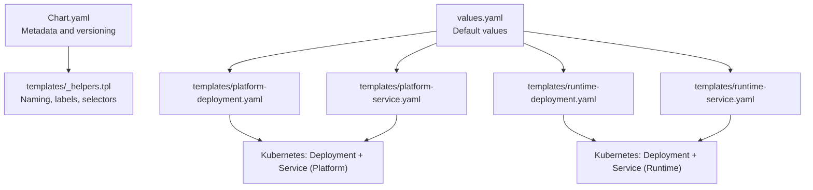
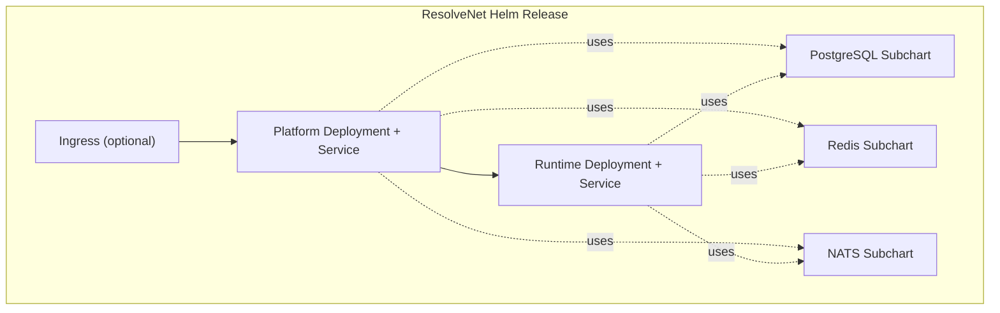
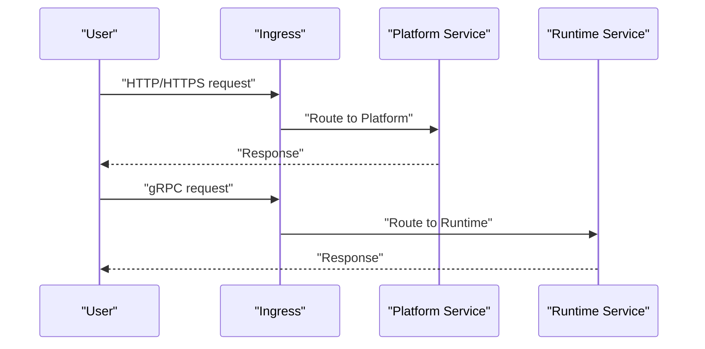
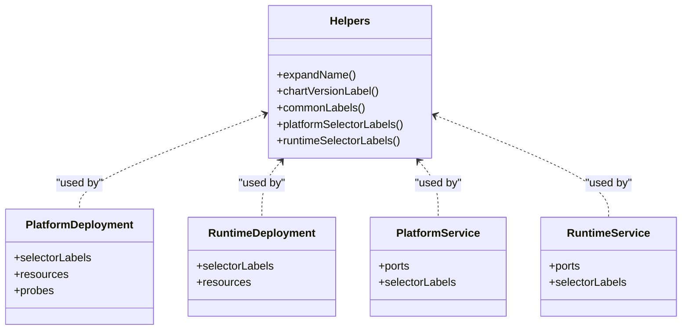
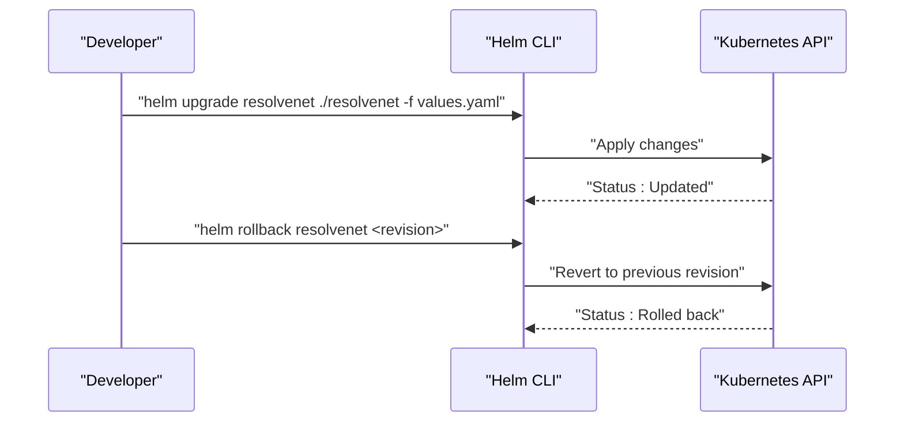
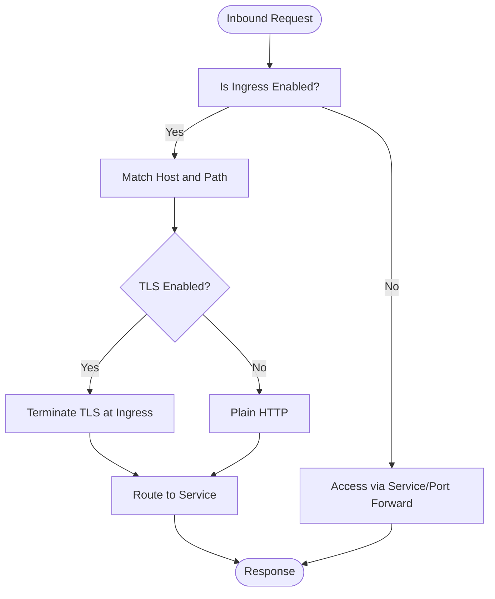
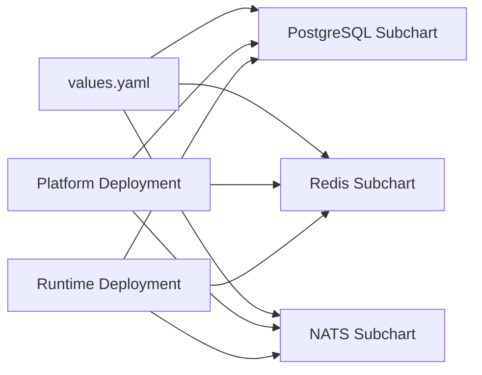

# Helm Charts

<cite>
**Referenced Files in This Document**
- [Chart.yaml](file://deploy/helm/resolvenet/Chart.yaml)
- [values.yaml](file://deploy/helm/resolvenet/values.yaml)
- [_helpers.tpl](file://deploy/helm/resolvenet/templates/_helpers.tpl)
- [platform-deployment.yaml](file://deploy/helm/resolvenet/templates/platform-deployment.yaml)
- [platform-service.yaml](file://deploy/helm/resolvenet/templates/platform-service.yaml)
- [runtime-deployment.yaml](file://deploy/helm/resolvenet/templates/runtime-deployment.yaml)
- [runtime-service.yaml](file://deploy/helm/resolvenet/templates/runtime-service.yaml)
- [deployment.md](file://docs/zh/deployment.md)
- [Makefile](file://Makefile)
</cite>

## Table of Contents
1. [Introduction](#introduction)
2. [Project Structure](#project-structure)
3. [Core Components](#core-components)
4. [Architecture Overview](#architecture-overview)
5. [Detailed Component Analysis](#detailed-component-analysis)
6. [Dependency Analysis](#dependency-analysis)
7. [Performance Considerations](#performance-considerations)
8. [Troubleshooting Guide](#troubleshooting-guide)
9. [Conclusion](#conclusion)
10. [Appendices](#appendices)

## Introduction
This document provides comprehensive guidance for deploying ResolveNet using the Helm chart included in the repository. It explains the chart metadata and structure, the values configuration for environment-specific settings, the template helpers and generated manifests, and practical deployment examples for development, staging, and production. It also covers upgrades, rollbacks, configuration drift management, integrations with external systems (cloud storage, managed databases, monitoring), and troubleshooting common Helm issues.

## Project Structure
The Helm chart resides under deploy/helm/resolvenet and includes:
- Chart metadata and packaging definition
- Default values for platform, runtime, optional webui, ingress, and dependency charts (PostgreSQL, Redis, NATS)
- Reusable template helpers for naming, labels, and selectors
- Kubernetes manifests for platform and runtime deployments and services

**Diagram sources**
- [Chart.yaml:1-18](file://deploy/helm/resolvenet/Chart.yaml#L1-L18)
- [_helpers.tpl:1-41](file://deploy/helm/resolvenet/templates/_helpers.tpl#L1-L41)
- [values.yaml:1-66](file://deploy/helm/resolvenet/values.yaml#L1-L66)
- [platform-deployment.yaml:1-39](file://deploy/helm/resolvenet/templates/platform-deployment.yaml#L1-L39)
- [platform-service.yaml:1-18](file://deploy/helm/resolvenet/templates/platform-service.yaml#L1-L18)
- [runtime-deployment.yaml:1-27](file://deploy/helm/resolvenet/templates/runtime-deployment.yaml#L1-L27)
- [runtime-service.yaml:1-15](file://deploy/helm/resolvenet/templates/runtime-service.yaml#L1-L15)

**Section sources**
- [Chart.yaml:1-18](file://deploy/helm/resolvenet/Chart.yaml#L1-L18)
- [values.yaml:1-66](file://deploy/helm/resolvenet/values.yaml#L1-L66)
- [_helpers.tpl:1-41](file://deploy/helm/resolvenet/templates/_helpers.tpl#L1-L41)
- [platform-deployment.yaml:1-39](file://deploy/helm/resolvenet/templates/platform-deployment.yaml#L1-L39)
- [platform-service.yaml:1-18](file://deploy/helm/resolvenet/templates/platform-service.yaml#L1-L18)
- [runtime-deployment.yaml:1-27](file://deploy/helm/resolvenet/templates/runtime-deployment.yaml#L1-L27)
- [runtime-service.yaml:1-15](file://deploy/helm/resolvenet/templates/runtime-service.yaml#L1-L15)

## Core Components
- Chart metadata and versioning
  - Chart type: application
  - Version and appVersion: 0.1.0
  - Keywords and maintainers
- Default values
  - Platform service: replica count, image repository/tag/pull policy, HTTP and gRPC ports, CPU/memory requests/limits
  - Runtime service: replica count, image repository/tag/pull policy, port, CPU/memory requests/limits
  - Optional webui: replica count, image repository/tag/pull policy, service port
  - Ingress: enabled flag, class name, host and path configuration
  - Dependencies: PostgreSQL, Redis, NATS with defaults for credentials and database name
- Template helpers
  - Name expansion, chart-version label, common labels, and selector labels for platform and runtime components

**Section sources**
- [Chart.yaml:1-18](file://deploy/helm/resolvenet/Chart.yaml#L1-L18)
- [values.yaml:1-66](file://deploy/helm/resolvenet/values.yaml#L1-L66)
- [_helpers.tpl:1-41](file://deploy/helm/resolvenet/templates/_helpers.tpl#L1-L41)

## Architecture Overview
The chart provisions two primary services:
- Platform service (Go): exposes HTTP and gRPC endpoints and includes health probes
- Runtime service (Python/AgentScope): exposes a gRPC endpoint

Optional integrations include:
- Ingress for external access
- PostgreSQL, Redis, and NATS managed via subcharts
- Monitoring via ServiceMonitors (as shown in extended examples)

**Diagram sources**
- [platform-deployment.yaml:1-39](file://deploy/helm/resolvenet/templates/platform-deployment.yaml#L1-L39)
- [platform-service.yaml:1-18](file://deploy/helm/resolvenet/templates/platform-service.yaml#L1-L18)
- [runtime-deployment.yaml:1-27](file://deploy/helm/resolvenet/templates/runtime-deployment.yaml#L1-L27)
- [runtime-service.yaml:1-15](file://deploy/helm/resolvenet/templates/runtime-service.yaml#L1-L15)
- [values.yaml:45-66](file://deploy/helm/resolvenet/values.yaml#L45-L66)

## Detailed Component Analysis

### Chart Metadata and Versioning
- Chart type: application
- Chart version: 0.1.0
- App version: 0.1.0
- Keywords: agent, ai, llm, fta, rag
- Maintainer contact and source repository

Best practices:
- Increment chart version on structural changes
- Keep appVersion aligned with built artifacts
- Use keywords to improve discoverability

**Section sources**
- [Chart.yaml:1-18](file://deploy/helm/resolvenet/Chart.yaml#L1-L18)

### Values Configuration
Key value groups and their roles:
- platform
  - replicaCount: number of platform pods
  - image: repository, tag, pullPolicy
  - service: HTTP and gRPC ports
  - resources: CPU/memory requests and limits
- runtime
  - replicaCount: number of runtime pods
  - image: repository, tag, pullPolicy
  - service: gRPC port
  - resources: CPU/memory requests and limits
- webui
  - replicaCount, image, pullPolicy, service port
- ingress
  - enabled, className, hosts with paths and pathTypes
- postgresql
  - enabled, auth username/password/database
- redis
  - enabled
- nats
  - enabled

Environment-specific overrides:
- Development: lower replicas, smaller resource requests/limits, ingress disabled
- Staging: moderate replicas/resources, ingress enabled with TLS, managed DBs
- Production: higher replicas, strict resource limits, ingress with TLS, managed cloud DBs and monitoring

Note: The repository’s English documentation focuses on Docker Compose and Kustomize for local development. The Chinese deployment guide provides richer examples for Helm usage, including ingress TLS, GPU hints, and monitoring.

**Section sources**
- [values.yaml:1-66](file://deploy/helm/resolvenet/values.yaml#L1-L66)
- [deployment.md:162-310](file://docs/zh/deployment.md#L162-L310)

### Template Helpers (_helpers.tpl)
Reusable logic:
- Chart name expansion and chart-version label
- Common labels for managed-by and part-of
- Selector labels for platform and runtime components

Usage:
- Consistent naming across resources
- Unified labels for observability and selection
- Stable selector labels for rolling updates

**Section sources**
- [_helpers.tpl:1-41](file://deploy/helm/resolvenet/templates/_helpers.tpl#L1-L41)

### Platform Deployment and Service
- Deployment
  - Selects pods via selector labels
  - Container ports: HTTP and gRPC
  - Resources from values
  - Health probes on HTTP path
- Service
  - ClusterIP exposing HTTP and gRPC ports
  - Selector labels for platform

Operational notes:
- Ensure platform readiness before routing traffic
- Configure probes to match application health endpoints

**Section sources**
- [platform-deployment.yaml:1-39](file://deploy/helm/resolvenet/templates/platform-deployment.yaml#L1-L39)
- [platform-service.yaml:1-18](file://deploy/helm/resolvenet/templates/platform-service.yaml#L1-L18)

### Runtime Deployment and Service
- Deployment
  - Selects pods via selector labels
  - Container port: gRPC
  - Resources from values
- Service
  - ClusterIP exposing gRPC port
  - Selector labels for runtime

Operational notes:
- Runtime typically communicates with platform over gRPC
- Ensure network policies allow inter-pod communication

**Section sources**
- [runtime-deployment.yaml:1-27](file://deploy/helm/resolvenet/templates/runtime-deployment.yaml#L1-L27)
- [runtime-service.yaml:1-15](file://deploy/helm/resolvenet/templates/runtime-service.yaml#L1-L15)

### Ingress Configuration
- Enable ingress per environment
- Define className, host, and pathType
- Optionally enable TLS with a secret name

Example scenarios:
- Development: ingress disabled; access via port-forward or ClusterIP
- Staging/Production: ingress enabled with TLS and proper DNS resolution

**Section sources**
- [values.yaml:45-53](file://deploy/helm/resolvenet/values.yaml#L45-L53)
- [deployment.md:194-206](file://docs/zh/deployment.md#L194-L206)

### Secret Management
- Store sensitive values (DB passwords, LLM keys) in Kubernetes Secrets or external secret managers
- Reference secrets in values or manifests
- Recommended tools: External Secrets, Sealed Secrets

**Section sources**
- [deployment.md:661-722](file://docs/zh/deployment.md#L661-L722)

### Persistent Volume Claims and Storage
- PostgreSQL and Redis subcharts support persistence
- Configure persistence size and storageClass in values
- For advanced storage (e.g., cloud storage backends), mount volumes or configure providers via environment variables

**Section sources**
- [values.yaml:54-66](file://deploy/helm/resolvenet/values.yaml#L54-L66)
- [deployment.md:243-275](file://docs/zh/deployment.md#L243-L275)

### Deployment Customization Options
- Feature toggles: enable/disable webui, ingress, and subcharts
- Resource tuning: adjust CPU/memory requests/limits per workload
- Networking: expose via LoadBalancer/NodePort or Ingress
- Observability: enable ServiceMonitors and integrate with Prometheus

**Section sources**
- [values.yaml:1-66](file://deploy/helm/resolvenet/values.yaml#L1-L66)
- [deployment.md:283-288](file://docs/zh/deployment.md#L283-L288)

## Architecture Overview

**Diagram sources**
- [platform-service.yaml:1-18](file://deploy/helm/resolvenet/templates/platform-service.yaml#L1-L18)
- [runtime-service.yaml:1-15](file://deploy/helm/resolvenet/templates/runtime-service.yaml#L1-L15)
- [values.yaml:45-53](file://deploy/helm/resolvenet/values.yaml#L45-L53)

## Detailed Component Analysis

### Class Diagram: Template Helpers and Labels

**Diagram sources**
- [_helpers.tpl:1-41](file://deploy/helm/resolvenet/templates/_helpers.tpl#L1-L41)
- [platform-deployment.yaml:1-39](file://deploy/helm/resolvenet/templates/platform-deployment.yaml#L1-L39)
- [runtime-deployment.yaml:1-27](file://deploy/helm/resolvenet/templates/runtime-deployment.yaml#L1-L27)
- [platform-service.yaml:1-18](file://deploy/helm/resolvenet/templates/platform-service.yaml#L1-L18)
- [runtime-service.yaml:1-15](file://deploy/helm/resolvenet/templates/runtime-service.yaml#L1-L15)

### Sequence Diagram: Upgrade and Rollback

**Diagram sources**
- [deployment.md:299-309](file://docs/zh/deployment.md#L299-L309)

### Flowchart: Ingress Path Resolution

**Diagram sources**
- [values.yaml:45-53](file://deploy/helm/resolvenet/values.yaml#L45-L53)

## Dependency Analysis
- Chart-level dependencies
  - PostgreSQL, Redis, NATS are optional subcharts controlled by values
- Runtime dependencies
  - Platform and Runtime both depend on PostgreSQL, Redis, and NATS
- External integrations
  - Cloud storage backends can be configured via environment variables
  - Managed databases (e.g., AWS RDS, Azure Database) can be referenced via external values
  - Monitoring: Prometheus Operator ServiceMonitor

**Diagram sources**
- [values.yaml:54-66](file://deploy/helm/resolvenet/values.yaml#L54-L66)
- [platform-deployment.yaml:1-39](file://deploy/helm/resolvenet/templates/platform-deployment.yaml#L1-L39)
- [runtime-deployment.yaml:1-27](file://deploy/helm/resolvenet/templates/runtime-deployment.yaml#L1-L27)

**Section sources**
- [values.yaml:54-66](file://deploy/helm/resolvenet/values.yaml#L54-L66)
- [deployment.md:243-288](file://docs/zh/deployment.md#L243-L288)

## Performance Considerations
- Right-size replicas and resources per workload
- Use horizontal pod autoscaling (HPA) for dynamic scaling
- Separate workloads onto dedicated nodes with taints/tolerations or affinity
- Monitor latency and throughput; tune probes and timeouts accordingly
- For GPU workloads, follow upstream guidance for device plugin and scheduling

[No sources needed since this section provides general guidance]

## Troubleshooting Guide
Common Helm issues and resolutions:
- Chart validation errors
  - Ensure Chart.yaml fields are present and valid
  - Validate values.yaml against the schema used by the chart
- Template rendering problems
  - Use helm template to render locally and inspect YAML
  - Check helper function usage and value interpolation
- Dependency conflicts
  - Disable conflicting subcharts (e.g., disable embedded DBs when using managed services)
  - Align versions and feature flags across dependencies
- Health and connectivity
  - Verify readiness/liveness probe paths
  - Confirm service ports and selectors match deployments
- Secrets and credentials
  - Ensure Secrets exist and are mounted correctly
  - Use external secret managers for secure distribution

**Section sources**
- [deployment.md:299-309](file://docs/zh/deployment.md#L299-L309)
- [Makefile:180-193](file://Makefile#L180-L193)

## Conclusion
The ResolveNet Helm chart provides a concise yet flexible foundation for deploying the platform and runtime services alongside essential infrastructure dependencies. By leveraging values overrides, template helpers, and optional integrations, teams can tailor deployments to development, staging, and production environments while maintaining operational reliability and observability.

[No sources needed since this section summarizes without analyzing specific files]

## Appendices

### Installation Examples by Environment
- Development
  - Use default values; keep ingress disabled; rely on port-forward for access
- Staging
  - Enable ingress with TLS; set moderate replicas and resources; enable monitoring
- Production
  - Use managed databases; enable TLS; enforce strict resource limits; enable monitoring and alerting

**Section sources**
- [values.yaml:1-66](file://deploy/helm/resolvenet/values.yaml#L1-L66)
- [deployment.md:194-206](file://docs/zh/deployment.md#L194-L206)
- [deployment.md:283-288](file://docs/zh/deployment.md#L283-L288)

### Upgrades, Rollbacks, and Drift Management
- Upgrades
  - Use helm upgrade with targeted values files
- Rollbacks
  - Use helm rollback to revert to a previous revision
- Drift management
  - Track values in version control
  - Use helm diff (if installed) to preview changes before applying

**Section sources**
- [deployment.md:299-309](file://docs/zh/deployment.md#L299-L309)

### Integrations with External Systems
- Cloud storage
  - Configure via environment variables or mounted volumes
- Managed databases
  - Override PostgreSQL/Redis connection details in values
- Monitoring
  - Enable ServiceMonitors and integrate with Prometheus

**Section sources**
- [deployment.md:243-288](file://docs/zh/deployment.md#L243-L288)