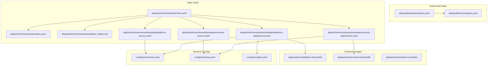
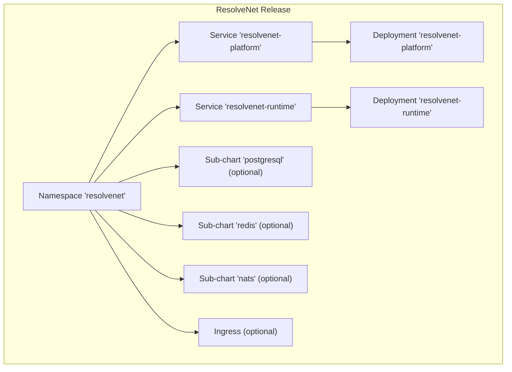
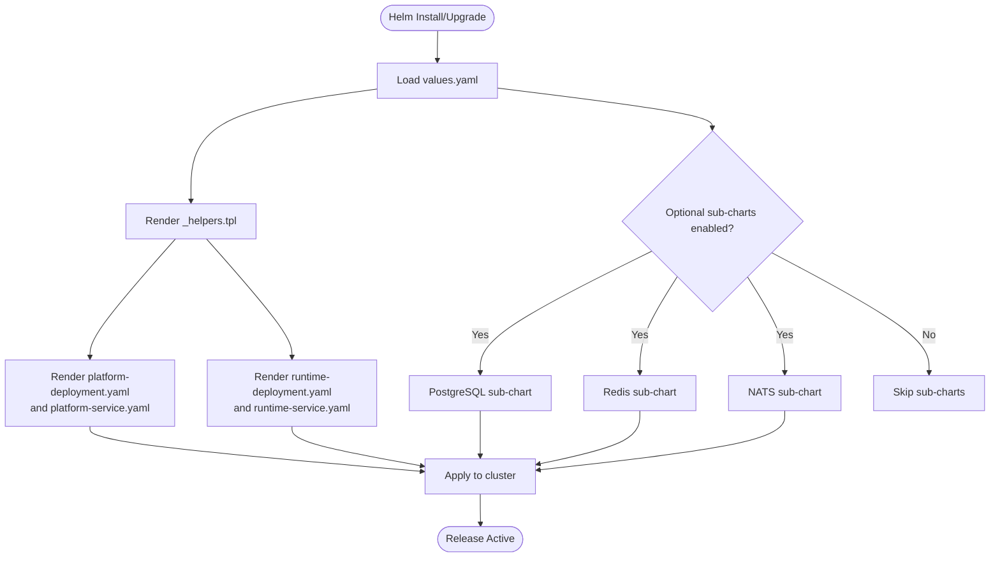
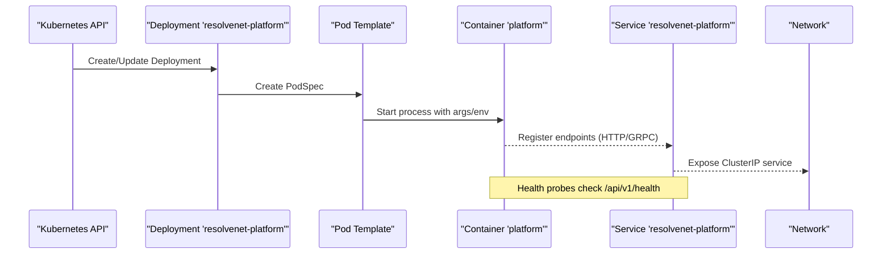
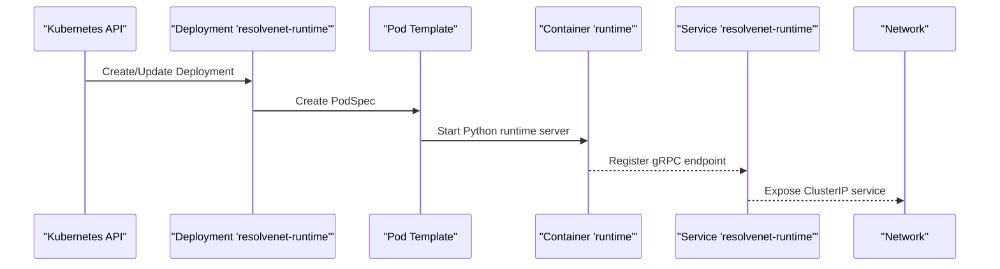
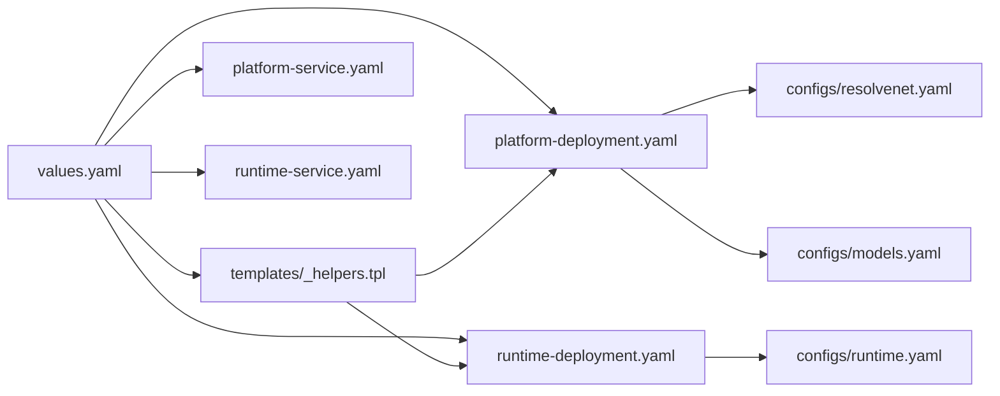

# Kubernetes Deployment

<cite>
**Referenced Files in This Document**
- [kustomization.yaml](file://deploy/k8s/kustomization.yaml)
- [namespace.yaml](file://deploy/k8s/namespace.yaml)
- [Chart.yaml](file://deploy/helm/resolvenet/Chart.yaml)
- [values.yaml](file://deploy/helm/resolvenet/values.yaml)
- [_helpers.tpl](file://deploy/helm/resolvenet/templates/_helpers.tpl)
- [platform-deployment.yaml](file://deploy/helm/resolvenet/templates/platform-deployment.yaml)
- [platform-service.yaml](file://deploy/helm/resolvenet/templates/platform-service.yaml)
- [runtime-deployment.yaml](file://deploy/helm/resolvenet/templates/runtime-deployment.yaml)
- [runtime-service.yaml](file://deploy/helm/resolvenet/templates/runtime-service.yaml)
- [platform.Dockerfile](file://deploy/docker/platform.Dockerfile)
- [runtime.Dockerfile](file://deploy/docker/runtime.Dockerfile)
- [webui.Dockerfile](file://deploy/docker/webui.Dockerfile)
- [resolvenet.yaml](file://configs/resolvenet.yaml)
- [runtime.yaml](file://configs/runtime.yaml)
- [models.yaml](file://configs/models.yaml)
</cite>

## Table of Contents
1. [Introduction](#introduction)
2. [Project Structure](#project-structure)
3. [Core Components](#core-components)
4. [Architecture Overview](#architecture-overview)
5. [Detailed Component Analysis](#detailed-component-analysis)
6. [Dependency Analysis](#dependency-analysis)
7. [Performance Considerations](#performance-considerations)
8. [Troubleshooting Guide](#troubleshooting-guide)
9. [Conclusion](#conclusion)
10. [Appendices](#appendices)

## Introduction
This document describes ResolveNet’s Kubernetes deployment strategy, focusing on the Kustomization base for namespace provisioning and the Helm chart for multi-environment deployments. It explains the Helm chart structure covering platform and runtime services, services, and optional ingress, and documents the current stateful and stateless service configurations. It also outlines recommended extensions for service mesh integration, pod security, resource quotas, cloud provider-specific storage and load balancing, autoscaling, rolling updates, blue-green strategies, and observability with Prometheus, Grafana, ELK, and distributed tracing.

## Project Structure
ResolveNet provides two complementary deployment mechanisms:
- Kustomization base for namespace provisioning
- Helm chart for application services and optional sub-charts (PostgreSQL, Redis, NATS)

**Diagram sources**
- [kustomization.yaml:1-5](file://deploy/k8s/kustomization.yaml#L1-L5)
- [namespace.yaml:1-7](file://deploy/k8s/namespace.yaml#L1-L7)
- [Chart.yaml:1-18](file://deploy/helm/resolvenet/Chart.yaml#L1-L18)
- [values.yaml:1-66](file://deploy/helm/resolvenet/values.yaml#L1-L66)
- [_helpers.tpl:1-41](file://deploy/helm/resolvenet/templates/_helpers.tpl#L1-L41)
- [platform-deployment.yaml:1-39](file://deploy/helm/resolvenet/templates/platform-deployment.yaml#L1-L39)
- [platform-service.yaml:1-18](file://deploy/helm/resolvenet/templates/platform-service.yaml#L1-L18)
- [runtime-deployment.yaml:1-27](file://deploy/helm/resolvenet/templates/runtime-deployment.yaml#L1-L27)
- [runtime-service.yaml:1-15](file://deploy/helm/resolvenet/templates/runtime-service.yaml#L1-L15)
- [platform.Dockerfile:1-26](file://deploy/docker/platform.Dockerfile#L1-L26)
- [runtime.Dockerfile:1-22](file://deploy/docker/runtime.Dockerfile#L1-L22)
- [webui.Dockerfile:1-22](file://deploy/docker/webui.Dockerfile#L1-L22)
- [resolvenet.yaml:1-34](file://configs/resolvenet.yaml#L1-L34)
- [runtime.yaml:1-18](file://configs/runtime.yaml#L1-L18)
- [models.yaml:1-31](file://configs/models.yaml#L1-L31)

**Section sources**
- [kustomization.yaml:1-5](file://deploy/k8s/kustomization.yaml#L1-L5)
- [namespace.yaml:1-7](file://deploy/k8s/namespace.yaml#L1-L7)
- [Chart.yaml:1-18](file://deploy/helm/resolvenet/Chart.yaml#L1-L18)
- [values.yaml:1-66](file://deploy/helm/resolvenet/values.yaml#L1-L66)
- [_helpers.tpl:1-41](file://deploy/helm/resolvenet/templates/_helpers.tpl#L1-L41)
- [platform-deployment.yaml:1-39](file://deploy/helm/resolvenet/templates/platform-deployment.yaml#L1-L39)
- [platform-service.yaml:1-18](file://deploy/helm/resolvenet/templates/platform-service.yaml#L1-L18)
- [runtime-deployment.yaml:1-27](file://deploy/helm/resolvenet/templates/runtime-deployment.yaml#L1-L27)
- [runtime-service.yaml:1-15](file://deploy/helm/resolvenet/templates/runtime-service.yaml#L1-L15)
- [platform.Dockerfile:1-26](file://deploy/docker/platform.Dockerfile#L1-L26)
- [runtime.Dockerfile:1-22](file://deploy/docker/runtime.Dockerfile#L1-L22)
- [webui.Dockerfile:1-22](file://deploy/docker/webui.Dockerfile#L1-L22)
- [resolvenet.yaml:1-34](file://configs/resolvenet.yaml#L1-L34)
- [runtime.yaml:1-18](file://configs/runtime.yaml#L1-L18)
- [models.yaml:1-31](file://configs/models.yaml#L1-L31)

## Core Components
- Namespace base: Creates the resolvenet namespace with app.kubernetes.io/part-of labeling for organizational alignment.
- Helm chart: Defines the application release with platform and runtime workloads, services, and optional ingress. PostgreSQL, Redis, and NATS are configured as optional sub-charts via values.
- Container images: Platform (Go), Runtime (Python), and WebUI (Nginx) images are built from dedicated Dockerfiles and exposed on the documented ports.

Key capabilities present:
- Namespaces for environment isolation
- Helm-driven releases with configurable replicas, images, ports, and resource requests/limits
- Health probes for platform service
- Optional ingress disabled by default in values

Recommended additions for production:
- Ingress controller and TLS
- PersistentVolumeClaims for stateful services
- PodSecurityPolicy or Pod Security Standards
- ResourceQuotas and LimitRanges
- HorizontalPodAutoscaler
- Rolling updates and blue/green strategies
- Observability integrations (Prometheus/Grafana, ELK, OpenTelemetry)

**Section sources**
- [namespace.yaml:1-7](file://deploy/k8s/namespace.yaml#L1-L7)
- [Chart.yaml:1-18](file://deploy/helm/resolvenet/Chart.yaml#L1-L18)
- [values.yaml:1-66](file://deploy/helm/resolvenet/values.yaml#L1-L66)
- [platform-deployment.yaml:1-39](file://deploy/helm/resolvenet/templates/platform-deployment.yaml#L1-L39)
- [runtime-deployment.yaml:1-27](file://deploy/helm/resolvenet/templates/runtime-deployment.yaml#L1-L27)
- [platform-service.yaml:1-18](file://deploy/helm/resolvenet/templates/platform-service.yaml#L1-L18)
- [runtime-service.yaml:1-15](file://deploy/helm/resolvenet/templates/runtime-service.yaml#L1-L15)
- [platform.Dockerfile:1-26](file://deploy/docker/platform.Dockerfile#L1-L26)
- [runtime.Dockerfile:1-22](file://deploy/docker/runtime.Dockerfile#L1-L22)
- [webui.Dockerfile:1-22](file://deploy/docker/webui.Dockerfile#L1-L22)

## Architecture Overview
The deployment architecture centers on a Helm chart that provisions:
- Platform service: exposes HTTP and gRPC ports, includes health probes
- Runtime service: exposes gRPC port for agents
- Optional sub-charts: PostgreSQL, Redis, NATS
- Optional ingress: disabled by default

**Diagram sources**
- [namespace.yaml:1-7](file://deploy/k8s/namespace.yaml#L1-L7)
- [platform-service.yaml:1-18](file://deploy/helm/resolvenet/templates/platform-service.yaml#L1-L18)
- [platform-deployment.yaml:1-39](file://deploy/helm/resolvenet/templates/platform-deployment.yaml#L1-L39)
- [runtime-service.yaml:1-15](file://deploy/helm/resolvenet/templates/runtime-service.yaml#L1-L15)
- [runtime-deployment.yaml:1-27](file://deploy/helm/resolvenet/templates/runtime-deployment.yaml#L1-L27)
- [values.yaml:45-66](file://deploy/helm/resolvenet/values.yaml#L45-L66)

## Detailed Component Analysis

### Kustomization Base
- Purpose: Establishes the resolvenet namespace and labels for organizational tagging.
- Usage: Apply via kubectl apply -k deploy/k8s or integrate into CI/CD pipelines.

**Section sources**
- [kustomization.yaml:1-5](file://deploy/k8s/kustomization.yaml#L1-L5)
- [namespace.yaml:1-7](file://deploy/k8s/namespace.yaml#L1-L7)

### Helm Chart Structure
- Chart metadata: Name, description, version, maintainers, sources.
- Values: Defaults for platform, runtime, webui, ingress, and optional sub-charts.
- Templates: Helpers, platform deployment/service, runtime deployment/service.

**Diagram sources**
- [Chart.yaml:1-18](file://deploy/helm/resolvenet/Chart.yaml#L1-L18)
- [values.yaml:1-66](file://deploy/helm/resolvenet/values.yaml#L1-L66)
- [_helpers.tpl:1-41](file://deploy/helm/resolvenet/templates/_helpers.tpl#L1-L41)
- [platform-deployment.yaml:1-39](file://deploy/helm/resolvenet/templates/platform-deployment.yaml#L1-L39)
- [platform-service.yaml:1-18](file://deploy/helm/resolvenet/templates/platform-service.yaml#L1-L18)
- [runtime-deployment.yaml:1-27](file://deploy/helm/resolvenet/templates/runtime-deployment.yaml#L1-L27)
- [runtime-service.yaml:1-15](file://deploy/helm/resolvenet/templates/runtime-service.yaml#L1-L15)

**Section sources**
- [Chart.yaml:1-18](file://deploy/helm/resolvenet/Chart.yaml#L1-L18)
- [values.yaml:1-66](file://deploy/helm/resolvenet/values.yaml#L1-L66)
- [_helpers.tpl:1-41](file://deploy/helm/resolvenet/templates/_helpers.tpl#L1-L41)

### Platform Service
- Deployment: Container image from values, ports, probes, and resource requests/limits.
- Service: ClusterIP exposing HTTP and gRPC ports with selector labels.
- Probes: HTTP GET health endpoint for readiness/liveness.

**Diagram sources**
- [platform-deployment.yaml:1-39](file://deploy/helm/resolvenet/templates/platform-deployment.yaml#L1-L39)
- [platform-service.yaml:1-18](file://deploy/helm/resolvenet/templates/platform-service.yaml#L1-L18)
- [values.yaml:3-18](file://deploy/helm/resolvenet/values.yaml#L3-L18)

**Section sources**
- [platform-deployment.yaml:1-39](file://deploy/helm/resolvenet/templates/platform-deployment.yaml#L1-L39)
- [platform-service.yaml:1-18](file://deploy/helm/resolvenet/templates/platform-service.yaml#L1-L18)
- [values.yaml:3-18](file://deploy/helm/resolvenet/values.yaml#L3-L18)

### Runtime Service
- Deployment: Container image from values, gRPC port, resource requests/limits.
- Service: ClusterIP exposing gRPC port with selector labels.

**Diagram sources**
- [runtime-deployment.yaml:1-27](file://deploy/helm/resolvenet/templates/runtime-deployment.yaml#L1-L27)
- [runtime-service.yaml:1-15](file://deploy/helm/resolvenet/templates/runtime-service.yaml#L1-L15)
- [values.yaml:20-34](file://deploy/helm/resolvenet/values.yaml#L20-L34)

**Section sources**
- [runtime-deployment.yaml:1-27](file://deploy/helm/resolvenet/templates/runtime-deployment.yaml#L1-L27)
- [runtime-service.yaml:1-15](file://deploy/helm/resolvenet/templates/runtime-service.yaml#L1-L15)
- [values.yaml:20-34](file://deploy/helm/resolvenet/values.yaml#L20-L34)

### Stateless Services (WebUI)
- Image: Built from webui.Dockerfile using Nginx serving static assets.
- Exposure: Service port defined in values; ingress disabled by default.

**Section sources**
- [webui.Dockerfile:1-22](file://deploy/docker/webui.Dockerfile#L1-L22)
- [values.yaml:36-43](file://deploy/helm/resolvenet/values.yaml#L36-L43)

### Stateful Services (PostgreSQL, Redis)
- PostgreSQL: Enabled by default in values; managed via sub-chart with credentials and database name.
- Redis: Enabled by default in values; managed via sub-chart.
- NATS: Enabled by default in values; managed via sub-chart.

Operational notes:
- For production, bind PersistentVolumeClaims to PostgreSQL and Redis.
- Configure storageClasses per cloud provider (see Appendices).
- Set secrets externally and reference via values overrides.

**Section sources**
- [values.yaml:54-66](file://deploy/helm/resolvenet/values.yaml#L54-L66)

### Ingress Configuration
- Disabled by default; enable and configure className and hosts in values to expose services externally.

**Section sources**
- [values.yaml:45-53](file://deploy/helm/resolvenet/values.yaml#L45-L53)

### Service Mesh Integration
- Recommended: Istio or Linkerd sidecar injection for traffic management, mTLS, and policy enforcement.
- Implementation: Add mesh labels and destination rules in overlays or via Helm values.

[No sources needed since this section provides general guidance]

### Pod Security Policies and Standards
- Recommended: Enforce Pod Security Standards (baseline/restricted) and define PodSecurityContext in deployments.
- Implementation: Add securityContext and PSP admission controllers in cluster configuration.

[No sources needed since this section provides general guidance]

### Resource Quotas and LimitRanges
- Recommended: Define ResourceQuotas per namespace and LimitRanges for CPU/memory defaults.
- Implementation: Create quota manifests and apply to resolvenet namespace.

[No sources needed since this section provides general guidance]

### Cloud Provider Deployment Examples
- AWS: Use gp2/gp3 storage classes and ALB ingress controller for external load balancing.
- GCP: Use pd-standard/pd-balanced and GKE L7 ILB/ALB.
- Azure: Use managed disks and AKS LoadBalancer/AGIC.

[No sources needed since this section provides general guidance]

### Autoscaling and Rollout Strategies
- HorizontalPodAutoscaler: Scale on CPU/memory or custom metrics.
- Rolling updates: Set strategy in Deployment specs; blue/green via label-based routing and dual releases.

[No sources needed since this section provides general guidance]

### Observability
- Metrics: Prometheus scraping via service monitors; Grafana dashboards for platform/runtime.
- Logs: Fluent Bit/Fluentd to Elasticsearch/OpenSearch.
- Tracing: OpenTelemetry collector with Jaeger/Tempo backend.

[No sources needed since this section provides general guidance]

## Dependency Analysis
Helm templates depend on helpers for consistent labels and naming. Platform and runtime services depend on values for images, ports, and resources. Optional sub-charts are controlled by values.

**Diagram sources**
- [values.yaml:1-66](file://deploy/helm/resolvenet/values.yaml#L1-L66)
- [_helpers.tpl:1-41](file://deploy/helm/resolvenet/templates/_helpers.tpl#L1-L41)
- [platform-deployment.yaml:1-39](file://deploy/helm/resolvenet/templates/platform-deployment.yaml#L1-L39)
- [platform-service.yaml:1-18](file://deploy/helm/resolvenet/templates/platform-service.yaml#L1-L18)
- [runtime-deployment.yaml:1-27](file://deploy/helm/resolvenet/templates/runtime-deployment.yaml#L1-L27)
- [runtime-service.yaml:1-15](file://deploy/helm/resolvenet/templates/runtime-service.yaml#L1-L15)
- [resolvenet.yaml:1-34](file://configs/resolvenet.yaml#L1-L34)
- [runtime.yaml:1-18](file://configs/runtime.yaml#L1-L18)
- [models.yaml:1-31](file://configs/models.yaml#L1-L31)

**Section sources**
- [values.yaml:1-66](file://deploy/helm/resolvenet/values.yaml#L1-L66)
- [_helpers.tpl:1-41](file://deploy/helm/resolvenet/templates/_helpers.tpl#L1-L41)
- [platform-deployment.yaml:1-39](file://deploy/helm/resolvenet/templates/platform-deployment.yaml#L1-L39)
- [platform-service.yaml:1-18](file://deploy/helm/resolvenet/templates/platform-service.yaml#L1-L18)
- [runtime-deployment.yaml:1-27](file://deploy/helm/resolvenet/templates/runtime-deployment.yaml#L1-L27)
- [runtime-service.yaml:1-15](file://deploy/helm/resolvenet/templates/runtime-service.yaml#L1-L15)
- [resolvenet.yaml:1-34](file://configs/resolvenet.yaml#L1-L34)
- [runtime.yaml:1-18](file://configs/runtime.yaml#L1-L18)
- [models.yaml:1-31](file://configs/models.yaml#L1-L31)

## Performance Considerations
- Right-size resource requests/limits for platform and runtime workloads.
- Enable autoscaling based on CPU or custom metrics.
- Use local SSDs or optimized storage classes for PostgreSQL/Redis.
- Tune JVM/container GC and Python process pools according to workload.

[No sources needed since this section provides general guidance]

## Troubleshooting Guide
Common issues and resolutions:
- Resource constraints: Increase requests/limits or add HPA; review events and logs.
- Networking problems: Verify Service selectors, endpoints, and network policies; check DNS resolution.
- Service discovery failures: Confirm headless vs ClusterIP services and DNS settings.
- Health probe failures: Adjust initialDelaySeconds and failureThreshold; validate /api/v1/health response.

[No sources needed since this section provides general guidance]

## Conclusion
ResolveNet’s deployment strategy leverages a minimal Kustomization base and a flexible Helm chart. The current chart covers platform and runtime services with optional sub-charts for persistence and messaging. Production readiness requires adding persistent volumes, ingress, autoscaling, security policies, quotas, and robust observability. The provided manifests and values offer a solid foundation for multi-environment deployments across cloud providers.

## Appendices

### Appendix A: Helm Values Reference
- platform: replicaCount, image repository/tag/pullPolicy, http/grpc ports, resources
- runtime: replicaCount, image repository/tag/pullPolicy, port, resources
- webui: replicaCount, image repository/tag/pullPolicy, service port
- ingress: enabled, className, hosts
- postgresql: enabled, auth username/password/database
- redis: enabled
- nats: enabled

**Section sources**
- [values.yaml:1-66](file://deploy/helm/resolvenet/values.yaml#L1-L66)

### Appendix B: Ports and Services
- Platform: HTTP and gRPC ports exposed by service and deployment
- Runtime: gRPC port exposed by service and deployment
- WebUI: HTTP port exposed by service

**Section sources**
- [platform-service.yaml:1-18](file://deploy/helm/resolvenet/templates/platform-service.yaml#L1-L18)
- [runtime-service.yaml:1-15](file://deploy/helm/resolvenet/templates/runtime-service.yaml#L1-L15)
- [values.yaml:9-43](file://deploy/helm/resolvenet/values.yaml#L9-L43)

### Appendix C: Configuration Files
- Platform runtime configuration: server addresses, database, redis, nats, gateway, telemetry
- Runtime configuration: server, agent pool, selector, telemetry
- Model registry: provider/model definitions

**Section sources**
- [resolvenet.yaml:1-34](file://configs/resolvenet.yaml#L1-L34)
- [runtime.yaml:1-18](file://configs/runtime.yaml#L1-L18)
- [models.yaml:1-31](file://configs/models.yaml#L1-L31)