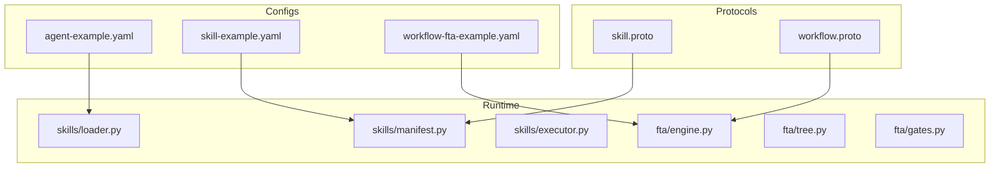
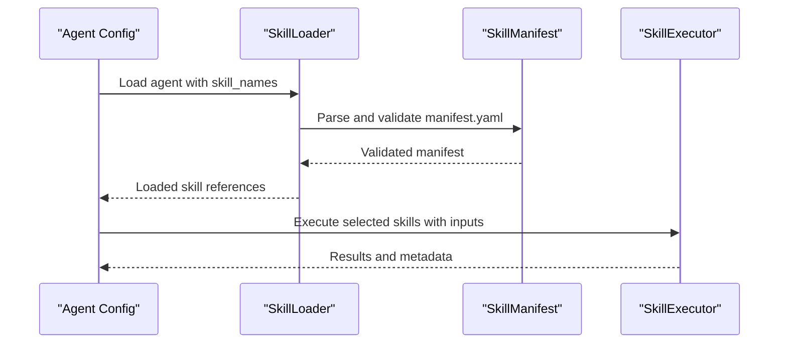
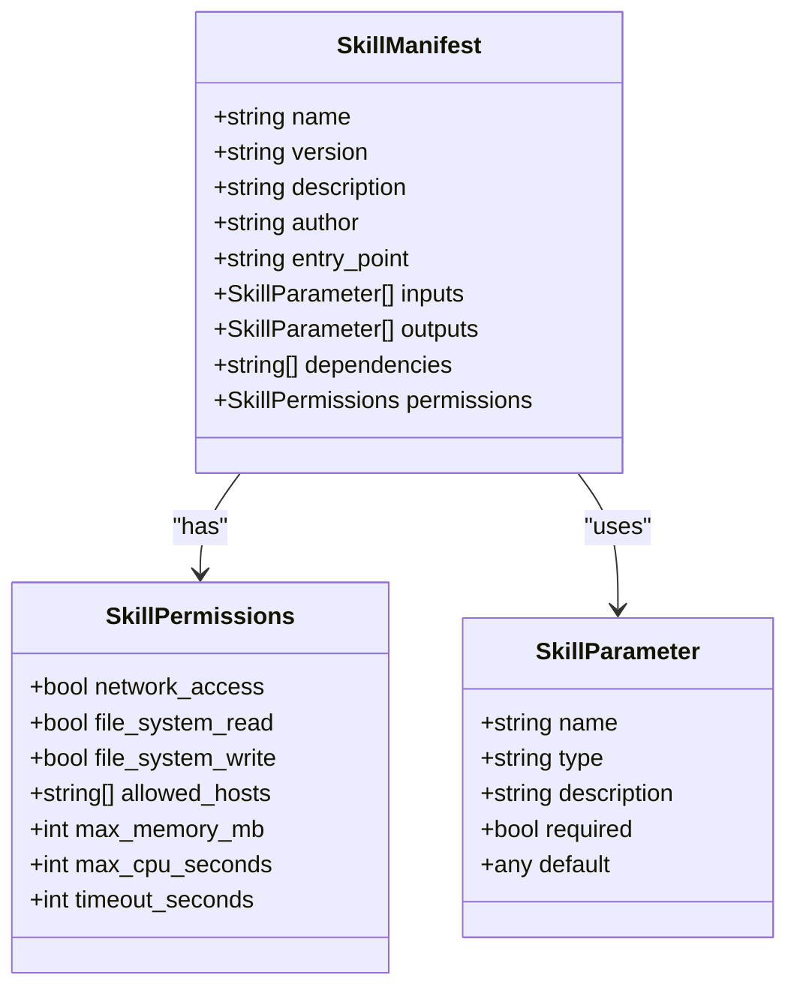
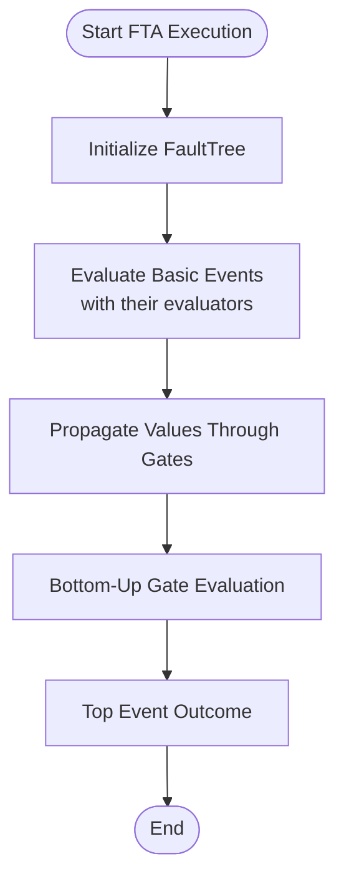
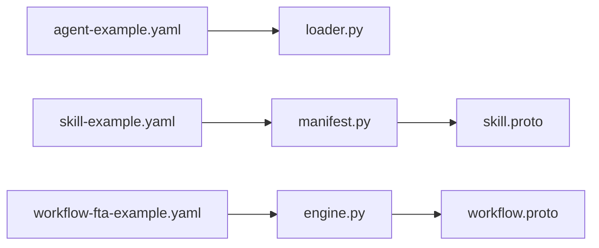

# Configuration Examples and Templates

<cite>
**Referenced Files in This Document**
- [agent-example.yaml](file://configs/examples/agent-example.yaml)
- [skill-example.yaml](file://configs/examples/skill-example.yaml)
- [workflow-fta-example.yaml](file://configs/examples/workflow-fta-example.yaml)
- [skill-manifest.schema.json](file://api/jsonschema/skill-manifest.schema.json)
- [skill.proto](file://api/proto/resolvenet/v1/skill.proto)
- [workflow.proto](file://api/proto/resolvenet/v1/workflow.proto)
- [engine.py](file://python/src/resolvenet/fta/engine.py)
- [tree.py](file://python/src/resolvenet/fta/tree.py)
- [gates.py](file://python/src/resolvenet/fta/gates.py)
- [manifest.py](file://python/src/resolvenet/skills/manifest.py)
- [loader.py](file://python/src/resolvenet/skills/loader.py)
- [executor.py](file://python/src/resolvenet/skills/executor.py)
- [validate.go](file://internal/cli/workflow/validate.go)
- [run.go](file://internal/cli/workflow/run.go)
- [types.go](file://pkg/config/types.go)
</cite>

## Table of Contents
1. [Introduction](#introduction)
2. [Project Structure](#project-structure)
3. [Core Components](#core-components)
4. [Architecture Overview](#architecture-overview)
5. [Detailed Component Analysis](#detailed-component-analysis)
6. [Dependency Analysis](#dependency-analysis)
7. [Performance Considerations](#performance-considerations)
8. [Troubleshooting Guide](#troubleshooting-guide)
9. [Conclusion](#conclusion)
10. [Appendices](#appendices)

## Introduction
This document explains the example configuration files for ResolveNet components and provides practical guidance for building, validating, and troubleshooting configurations. It covers:
- Agent configuration: agent definition, skill assignments, and execution parameters
- Skill configuration: manifest structure, function definitions, and permission settings
- Workflow FTA configuration: fault tree structure, gate definitions, and evaluation parameters

It also includes step-by-step explanations of each configuration element, common modification patterns, templates for different deployment scenarios, and guidance for validation and troubleshooting.

## Project Structure
The configuration examples are located under configs/examples and complement protocol buffers and Python runtime components that parse, validate, and execute the configurations.

**Diagram sources**
- [agent-example.yaml](file://configs/examples/agent-example.yaml)
- [skill-example.yaml](file://configs/examples/skill-example.yaml)
- [workflow-fta-example.yaml](file://configs/examples/workflow-fta-example.yaml)
- [skill.proto](file://api/proto/resolvenet/v1/skill.proto)
- [workflow.proto](file://api/proto/resolvenet/v1/workflow.proto)
- [manifest.py](file://python/src/resolvenet/skills/manifest.py)
- [loader.py](file://python/src/resolvenet/skills/loader.py)
- [executor.py](file://python/src/resolvenet/skills/executor.py)
- [engine.py](file://python/src/resolvenet/fta/engine.py)
- [tree.py](file://python/src/resolvenet/fta/tree.py)
- [gates.py](file://python/src/resolvenet/fta/gates.py)

**Section sources**
- [agent-example.yaml](file://configs/examples/agent-example.yaml)
- [skill-example.yaml](file://configs/examples/skill-example.yaml)
- [workflow-fta-example.yaml](file://configs/examples/workflow-fta-example.yaml)

## Core Components
This section explains the three example configuration files and their roles in the system.

- Agent configuration example
  - Purpose: Defines an agent’s identity, type, description, model selection, system prompt, assigned skills, and selector configuration.
  - Key elements:
    - agent.name: Unique identifier for the agent
    - agent.type: Agent type (e.g., mega)
    - agent.description: Human-readable description
    - agent.config.model_id: LLM model identifier
    - agent.config.system_prompt: Prompt template for the agent
    - agent.config.skill_names: List of skill names assigned to the agent
    - agent.config.selector_config.strategy: Selector strategy (e.g., hybrid)
    - agent.config.selector_config.confidence_threshold: Threshold for intent classification

- Skill configuration example
  - Purpose: Declares a skill’s metadata, source location, entry point, inputs, outputs, dependencies, and permissions.
  - Key elements:
    - skill.name: Unique skill name
    - skill.version: Semantic version
    - skill.source_type: Source type (e.g., builtin)
    - skill.source_uri: URI pointing to the skill source
    - skill.description: Description of the skill
    - skill.manifest.entry_point: Python module:function reference
    - skill.manifest.inputs: Parameter definitions with name, type, required flag, and default
    - skill.manifest.permissions: Permissions such as network access, timeouts, and resource limits

- Workflow FTA configuration example
  - Purpose: Describes a Fault Tree Analysis workflow with top-level event, intermediate and basic events, and logical gates.
  - Key elements:
    - tree.id: Workflow identifier
    - tree.name: Human-readable name
    - tree.description: Description
    - tree.top_event_id: Identifier of the top event
    - tree.events: List of events with id, name, type, evaluator, and parameters
    - tree.gates: Logical connectors with id, name, type, input ids, output id, and optional k-value for voting gates

**Section sources**
- [agent-example.yaml](file://configs/examples/agent-example.yaml)
- [skill-example.yaml](file://configs/examples/skill-example.yaml)
- [workflow-fta-example.yaml](file://configs/examples/workflow-fta-example.yaml)

## Architecture Overview
The configuration examples integrate with the protocol buffer definitions and Python runtime components to enable agent orchestration, skill execution, and FTA evaluation.

**Diagram sources**
- [agent-example.yaml](file://configs/examples/agent-example.yaml)
- [loader.py](file://python/src/resolvenet/skills/loader.py)
- [manifest.py](file://python/src/resolvenet/skills/manifest.py)
- [executor.py](file://python/src/resolvenet/skills/executor.py)

## Detailed Component Analysis

### Agent Configuration Analysis
- Agent definition
  - agent.name: Used as the agent’s unique identifier across the system
  - agent.type: Determines agent capabilities and routing behavior
  - agent.description: Optional human-readable description
- Execution parameters
  - agent.config.model_id: Selects the underlying LLM model
  - agent.config.system_prompt: Provides the system prompt template for the agent
  - agent.config.skill_names: Lists skills available to the agent
  - agent.config.selector_config.strategy: Selector strategy (e.g., hybrid)
  - agent.config.selector_config.confidence_threshold: Threshold for selecting actions

Common modifications:
- Change model_id to switch LLM providers or models
- Adjust system_prompt to tailor agent behavior
- Add or remove skill_names to control agent capabilities
- Tune selector_config.confidence_threshold for stricter or looser intent classification

**Section sources**
- [agent-example.yaml](file://configs/examples/agent-example.yaml)

### Skill Configuration Analysis
- Manifest structure
  - skill.name and skill.version: Unique identity and versioning
  - skill.source_type and skill.source_uri: Source location and type
  - skill.description: Human-readable description
- Function definitions
  - skill.manifest.entry_point: Python module:function reference for the skill entry point
  - skill.manifest.inputs: Parameter schema with name, type, required flag, and default
  - skill.manifest.outputs: Optional output schema
  - skill.manifest.dependencies: Optional list of dependencies
- Permission settings
  - skill.manifest.permissions.network_access: Allow network access
  - skill.manifest.permissions.file_system_read: Allow read access
  - skill.manifest.permissions.file_system_write: Allow write access
  - skill.manifest.permissions.allowed_hosts: Allowed host list
  - skill.manifest.permissions.max_memory_mb: Memory limit in MB
  - skill.manifest.permissions.max_cpu_seconds: CPU time limit in seconds
  - skill.manifest.permissions.timeout_seconds: Execution timeout in seconds

Validation and schema
- JSON Schema enforces required fields and types for manifests
- Protocol buffer definitions provide canonical message types for skill registration and invocation

Common modifications:
- Add or refine inputs with appropriate types and defaults
- Tighten or relax permissions based on security posture
- Update entry_point to point to a new module or function

**Diagram sources**
- [skill-manifest.schema.json](file://api/jsonschema/skill-manifest.schema.json)
- [skill.proto](file://api/proto/resolvenet/v1/skill.proto)
- [manifest.py](file://python/src/resolvenet/skills/manifest.py)

**Section sources**
- [skill-example.yaml](file://configs/examples/skill-example.yaml)
- [skill-manifest.schema.json](file://api/jsonschema/skill-manifest.schema.json)
- [skill.proto](file://api/proto/resolvenet/v1/skill.proto)
- [manifest.py](file://python/src/resolvenet/skills/manifest.py)

### Workflow FTA Configuration Analysis
- Fault tree structure
  - tree.id, tree.name, tree.description: Identifiers and metadata
  - tree.top_event_id: Root event to evaluate
  - tree.events: Nodes representing top, intermediate, and basic events
    - Basic events specify an evaluator and parameters
- Gate definitions
  - tree.gates: Logical connectors (AND, OR, VOTING, INHIBIT, PRIORITY-AND)
  - Gates connect input events to an output event
  - Voting gates support a k-of-n threshold via k_value

Evaluation parameters
- Events carry evaluator identifiers and parameters passed to the evaluator
- Gates compute outcomes based on input values and gate semantics

**Diagram sources**
- [workflow-fta-example.yaml](file://configs/examples/workflow-fta-example.yaml)
- [engine.py](file://python/src/resolvenet/fta/engine.py)
- [tree.py](file://python/src/resolvenet/fta/tree.py)
- [gates.py](file://python/src/resolvenet/fta/gates.py)

**Section sources**
- [workflow-fta-example.yaml](file://configs/examples/workflow-fta-example.yaml)
- [workflow.proto](file://api/proto/resolvenet/v1/workflow.proto)
- [engine.py](file://python/src/resolvenet/fta/engine.py)
- [tree.py](file://python/src/resolvenet/fta/tree.py)
- [gates.py](file://python/src/resolvenet/fta/gates.py)

## Dependency Analysis
The configuration files depend on protocol buffer definitions and Python runtime components for validation and execution.

**Diagram sources**
- [agent-example.yaml](file://configs/examples/agent-example.yaml)
- [skill-example.yaml](file://configs/examples/skill-example.yaml)
- [workflow-fta-example.yaml](file://configs/examples/workflow-fta-example.yaml)
- [loader.py](file://python/src/resolvenet/skills/loader.py)
- [manifest.py](file://python/src/resolvenet/skills/manifest.py)
- [engine.py](file://python/src/resolvenet/fta/engine.py)
- [skill.proto](file://api/proto/resolvenet/v1/skill.proto)
- [workflow.proto](file://api/proto/resolvenet/v1/workflow.proto)

**Section sources**
- [loader.py](file://python/src/resolvenet/skills/loader.py)
- [manifest.py](file://python/src/resolvenet/skills/manifest.py)
- [engine.py](file://python/src/resolvenet/fta/engine.py)
- [skill.proto](file://api/proto/resolvenet/v1/skill.proto)
- [workflow.proto](file://api/proto/resolvenet/v1/workflow.proto)

## Performance Considerations
- Skill execution
  - Use permissions to constrain resource usage (memory, CPU time, timeout) to avoid runaway workloads
  - Prefer smaller default parameter sets to reduce unnecessary computation
- Agent routing
  - Tune selector_config.confidence_threshold to balance accuracy and responsiveness
- FTA evaluation
  - Keep the number of basic events and gates minimal to reduce evaluation overhead
  - Use appropriate gate types to reflect real-world dependencies and reduce redundant checks

[No sources needed since this section provides general guidance]

## Troubleshooting Guide
Common configuration errors and resolutions:
- Agent configuration
  - Missing agent.name or invalid type: Ensure agent.name is set and agent.type matches supported values
  - Invalid model_id: Verify model_id exists in the configured model registry
  - Empty skill_names: Include at least one valid skill name present in the skill registry
  - Selector threshold out of range: Keep confidence_threshold between 0 and 1
- Skill configuration
  - Missing required manifest fields: Ensure name, version, and entry_point are present
  - Invalid input types: Align input types with schema expectations
  - Overly permissive permissions: Limit network_access, file_system_* permissions, and tighten allowed_hosts
- Workflow FTA configuration
  - Missing top_event_id: Ensure tree.top_event_id references an existing event
  - Undefined evaluator: Confirm evaluator identifiers match registered skills or RAG collections
  - Invalid gate connections: Verify gate input_ids and output_id refer to existing events
  - Unsupported gate type: Use supported gate types (AND, OR, VOTING, INHIBIT, PRIORITY-AND)

Validation and testing approaches:
- Use the CLI validate command for workflow definitions
- Use the CLI run command to execute workflows and stream events
- Validate skill manifests programmatically using the manifest loader and schema

**Section sources**
- [validate.go](file://internal/cli/workflow/validate.go)
- [run.go](file://internal/cli/workflow/run.go)
- [manifest.py](file://python/src/resolvenet/skills/manifest.py)
- [loader.py](file://python/src/resolvenet/skills/loader.py)

## Conclusion
The example configuration files provide a foundation for building agents, skills, and FTA workflows in ResolveNet. By understanding each configuration element, applying the recommended modification patterns, and leveraging validation and testing approaches, you can assemble robust and secure deployments tailored to your use cases.

[No sources needed since this section summarizes without analyzing specific files]

## Appendices

### Templates for Deployment Scenarios
- Minimal agent template
  - Define agent.name, agent.type, agent.config.model_id, and a small set of essential skill_names
  - Keep agent.config.selector_config.simple for straightforward routing
- Production-grade agent template
  - Increase selector_config.confidence_threshold for stricter routing
  - Include comprehensive skill_names aligned with operational needs
- Skill template
  - Provide clear skill.name and semantic versioning
  - Define precise inputs with required flags and defaults
  - Configure conservative permissions and explicit dependencies
- FTA workflow template
  - Start with a single top event and a few basic events
  - Use OR gates to combine independent evidence sources
  - Introduce AND gates for combined conditions and VOTING gates for majority rules

[No sources needed since this section provides general guidance]

### Configuration Validation Checklist
- Agent
  - agent.name is unique and non-empty
  - agent.type is supported
  - agent.config.model_id is valid
  - agent.config.skill_names reference existing skills
- Skill
  - skill.name and skill.version conform to schema
  - skill.manifest.entry_point resolves to a valid function
  - skill.manifest.inputs align with expected types
  - skill.manifest.permissions are appropriately scoped
- Workflow FTA
  - tree.top_event_id exists in tree.events
  - tree.events[].evaluator references valid skills or RAG collections
  - tree.gates connect valid input_ids and output_id
  - Gate types are supported and parameters are valid

[No sources needed since this section provides general guidance]