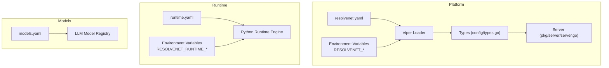
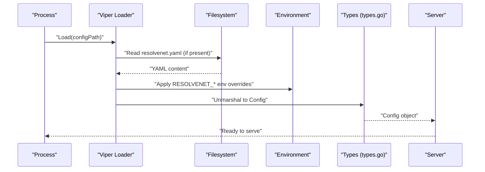
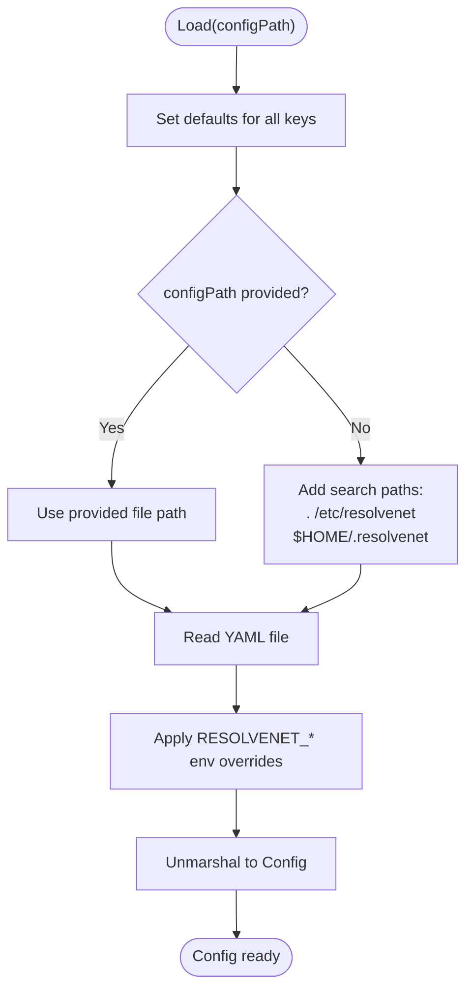
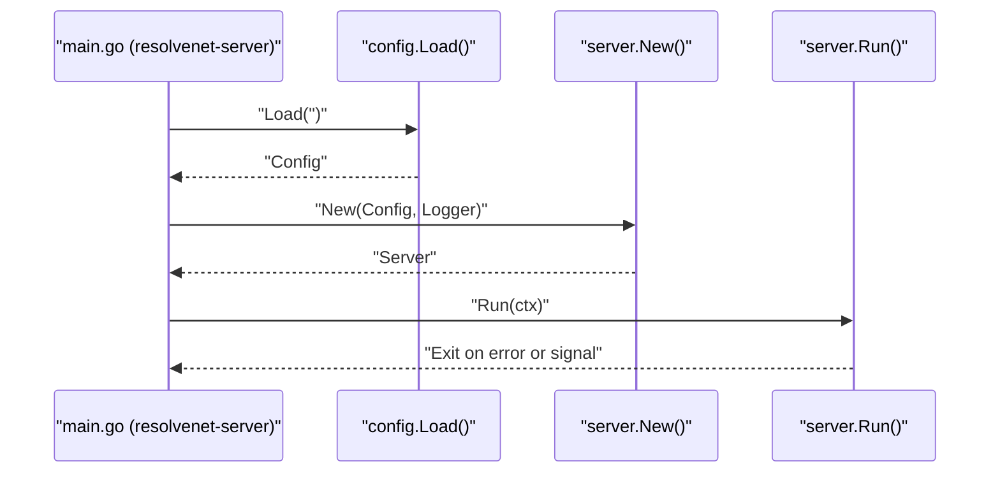
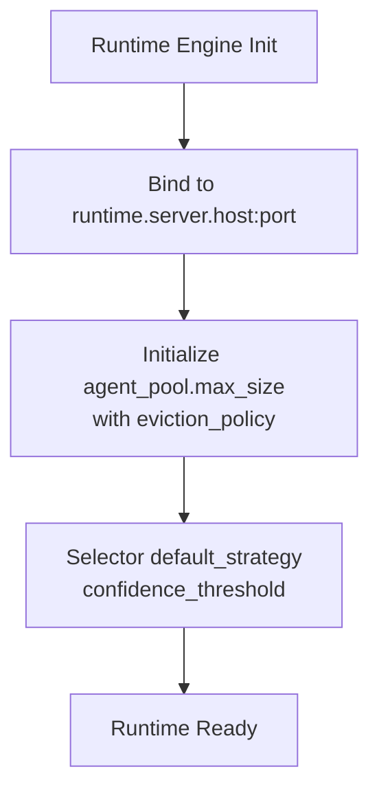
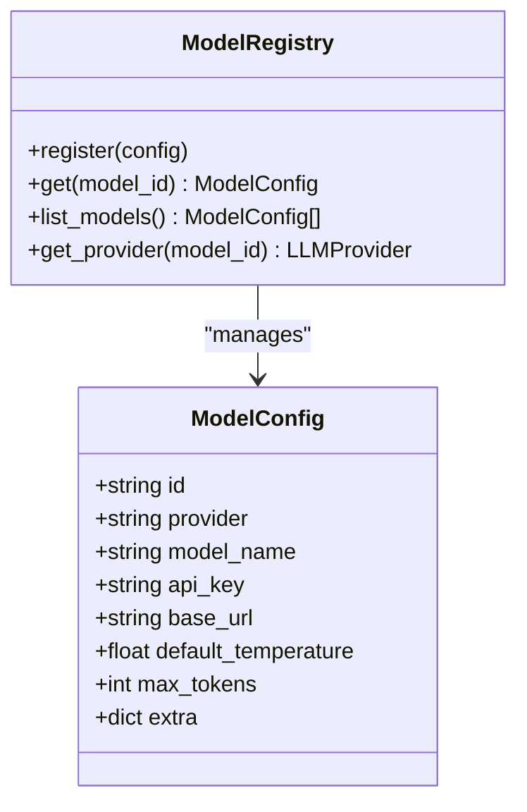
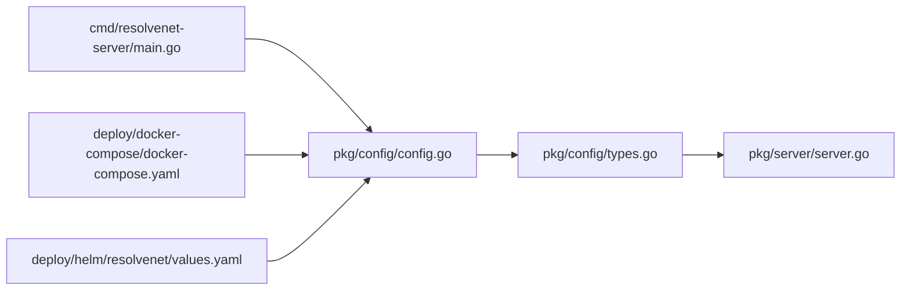

# Configuration Management

<cite>
**Referenced Files in This Document**
- [resolvenet.yaml](file://configs/resolvenet.yaml)
- [runtime.yaml](file://configs/runtime.yaml)
- [models.yaml](file://configs/models.yaml)
- [config.go](file://pkg/config/config.go)
- [types.go](file://pkg/config/types.go)
- [server.go](file://pkg/server/server.go)
- [main.go (resolvenet-server)](file://cmd/resolvenet-server/main.go)
- [docker-compose.yaml](file://deploy/docker-compose/docker-compose.yaml)
- [values.yaml](file://deploy/helm/resolvenet/values.yaml)
- [root.go (CLI)](file://internal/cli/root.go)
- [config.go (CLI config)](file://internal/cli/config/config.go)
- [engine.py (Runtime)](file://python/src/resolvenet/runtime/engine.py)
- [model_config.py (LLM)](file://python/src/resolvenet/llm/model_config.py)
</cite>

## Table of Contents
1. [Introduction](#introduction)
2. [Project Structure](#project-structure)
3. [Core Components](#core-components)
4. [Architecture Overview](#architecture-overview)
5. [Detailed Component Analysis](#detailed-component-analysis)
6. [Dependency Analysis](#dependency-analysis)
7. [Performance Considerations](#performance-considerations)
8. [Troubleshooting Guide](#troubleshooting-guide)
9. [Conclusion](#conclusion)
10. [Appendices](#appendices)

## Introduction
This document explains ResolveNet’s configuration management system. It covers the hierarchical configuration architecture using YAML files and environment variable overrides, the locations and priority order for loading settings, and detailed explanations of the main platform configuration (resolvenet.yaml), runtime configuration (runtime.yaml), and models configuration (models.yaml). It also documents environment variable override patterns, security considerations for sensitive data, validation and defaults, troubleshooting, and guidance for different deployment scenarios.

## Project Structure
ResolveNet organizes configuration into three primary YAML files:
- Platform configuration: resolvenet.yaml
- Runtime configuration: runtime.yaml
- LLM models registry: models.yaml

These files are loaded by the platform and runtime components, with environment variables overriding YAML values. Deployment manifests demonstrate environment variable usage for containerized setups.

**Diagram sources**
- [resolvenet.yaml:1-34](file://configs/resolvenet.yaml#L1-L34)
- [runtime.yaml:1-18](file://configs/runtime.yaml#L1-L18)
- [models.yaml:1-31](file://configs/models.yaml#L1-L31)
- [config.go:10-62](file://pkg/config/config.go#L10-L62)
- [types.go:3-70](file://pkg/config/types.go#L3-L70)
- [server.go:27-52](file://pkg/server/server.go#L27-L52)
- [engine.py:1-89](file://python/src/resolvenet/runtime/engine.py#L1-L89)
- [model_config.py:10-69](file://python/src/resolvenet/llm/model_config.py#L10-L69)

**Section sources**
- [resolvenet.yaml:1-34](file://configs/resolvenet.yaml#L1-L34)
- [runtime.yaml:1-18](file://configs/runtime.yaml#L1-L18)
- [models.yaml:1-31](file://configs/models.yaml#L1-L31)
- [config.go:10-62](file://pkg/config/config.go#L10-L62)
- [types.go:3-70](file://pkg/config/types.go#L3-L70)
- [server.go:27-52](file://pkg/server/server.go#L27-L52)
- [engine.py:1-89](file://python/src/resolvenet/runtime/engine.py#L1-L89)
- [model_config.py:10-69](file://python/src/resolvenet/llm/model_config.py#L10-L69)

## Core Components
- Platform configuration (resolvenet.yaml): Defines server addresses, database credentials, Redis, NATS, runtime gRPC address, gateway settings, and telemetry.
- Runtime configuration (runtime.yaml): Controls runtime server binding, agent pool sizing and eviction policy, selector defaults, and telemetry.
- Models configuration (models.yaml): Declares LLM providers, model identifiers, provider names, model names, and default token/temperature settings.

**Section sources**
- [resolvenet.yaml:3-34](file://configs/resolvenet.yaml#L3-L34)
- [runtime.yaml:3-18](file://configs/runtime.yaml#L3-L18)
- [models.yaml:3-31](file://configs/models.yaml#L3-L31)

## Architecture Overview
ResolveNet uses Viper to load configuration from YAML files and environment variables. The platform loads resolvenet.yaml, while the runtime consumes runtime.yaml. The models registry is consumed by Python components.

**Diagram sources**
- [config.go:11-62](file://pkg/config/config.go#L11-L62)
- [types.go:3-12](file://pkg/config/types.go#L3-L12)
- [server.go:28-52](file://pkg/server/server.go#L28-L52)

## Detailed Component Analysis

### Platform Configuration (resolvenet.yaml)
- Purpose: Central configuration for platform services including HTTP/gRPC server addresses, database connection, Redis, NATS, runtime gRPC endpoint, gateway, and telemetry.
- Key sections and fields:
  - server.http_addr, server.grpc_addr
  - database.host, database.port, database.user, database.password, database.dbname, database.sslmode
  - redis.addr, redis.db
  - nats.url
  - runtime.grpc_addr
  - gateway.admin_url, gateway.enabled
  - telemetry.enabled, telemetry.otlp_endpoint, telemetry.service_name, telemetry.metrics_enabled

Example reference: [resolvenet.yaml:3-34](file://configs/resolvenet.yaml#L3-L34)

**Section sources**
- [resolvenet.yaml:3-34](file://configs/resolvenet.yaml#L3-L34)

### Runtime Configuration (runtime.yaml)
- Purpose: Controls runtime server binding, agent pool behavior, selector defaults, and telemetry for the agent runtime.
- Key sections and fields:
  - server.host, server.port
  - agent_pool.max_size, agent_pool.eviction_policy
  - selector.default_strategy, selector.confidence_threshold
  - telemetry.enabled, telemetry.service_name

Example reference: [runtime.yaml:3-18](file://configs/runtime.yaml#L3-L18)

**Section sources**
- [runtime.yaml:3-18](file://configs/runtime.yaml#L3-L18)

### Models Configuration (models.yaml)
- Purpose: Declares LLM models and their provider mappings for use by the Python runtime.
- Key entries:
  - models[*].id, models[*].provider, models[*].model_name, models[*].max_tokens, models[*].default_temperature

Example reference: [models.yaml:3-31](file://configs/models.yaml#L3-L31)

**Section sources**
- [models.yaml:3-31](file://configs/models.yaml#L3-L31)

### Configuration Loading and Overrides (Viper)
- Default values: Hardcoded defaults are set for all platform keys to ensure safe operation when files are missing.
- File discovery: If no explicit path is provided, Viper searches in current directory, /etc/resolvenet, and $HOME/.resolvenet for resolvenet.yaml.
- Environment variables: Keys are uppercased and dots replaced with underscores (e.g., server.http_addr becomes RESOLVENET_SERVER_HTTP_ADDR).
- Unmarshal: Viper unmarshals into strongly typed structs.

**Diagram sources**
- [config.go:14-47](file://pkg/config/config.go#L14-L47)
- [config.go:49-62](file://pkg/config/config.go#L49-L62)

**Section sources**
- [config.go:10-62](file://pkg/config/config.go#L10-L62)
- [types.go:3-70](file://pkg/config/types.go#L3-L70)

### Server Initialization and Configuration Usage
- The platform server reads configuration to bind HTTP and gRPC listeners.
- The server creation and serving logic rely on the loaded configuration.

**Diagram sources**
- [main.go (resolvenet-server):24-34](file://cmd/resolvenet-server/main.go#L24-L34)
- [config.go:11-62](file://pkg/config/config.go#L11-L62)
- [server.go:28-52](file://pkg/server/server.go#L28-L52)
- [server.go:55-103](file://pkg/server/server.go#L55-L103)

**Section sources**
- [main.go (resolvenet-server):24-34](file://cmd/resolvenet-server/main.go#L24-L34)
- [server.go:28-52](file://pkg/server/server.go#L28-L52)
- [server.go:55-103](file://pkg/server/server.go#L55-L103)

### Runtime Configuration Consumption (Python)
- The runtime engine initializes execution contexts and uses runtime settings for binding and pooling.
- The Python runtime does not directly consume runtime.yaml in the Go code shown; however, the runtime service binds to the address defined in runtime configuration.

**Diagram sources**
- [runtime.yaml:3-18](file://configs/runtime.yaml#L3-L18)
- [engine.py:22-31](file://python/src/resolvenet/runtime/engine.py#L22-L31)

**Section sources**
- [runtime.yaml:3-18](file://configs/runtime.yaml#L3-L18)
- [engine.py:22-31](file://python/src/resolvenet/runtime/engine.py#L22-L31)

### LLM Models Registry (Python)
- The Python LLM module defines a model registry and provider selection logic based on provider identifiers.
- The registry uses model definitions similar to those in models.yaml.

**Diagram sources**
- [model_config.py:10-69](file://python/src/resolvenet/llm/model_config.py#L10-L69)

**Section sources**
- [model_config.py:10-69](file://python/src/resolvenet/llm/model_config.py#L10-L69)
- [models.yaml:3-31](file://configs/models.yaml#L3-L31)

## Dependency Analysis
- Platform binary depends on the configuration loader to produce a typed configuration object passed to the server.
- Server uses configuration to bind network listeners.
- Docker Compose and Helm charts inject environment variables to override YAML defaults in containerized deployments.

**Diagram sources**
- [main.go (resolvenet-server):24-34](file://cmd/resolvenet-server/main.go#L24-L34)
- [config.go:11-62](file://pkg/config/config.go#L11-L62)
- [types.go:3-12](file://pkg/config/types.go#L3-L12)
- [server.go:28-52](file://pkg/server/server.go#L28-L52)
- [docker-compose.yaml:11-29](file://deploy/docker-compose/docker-compose.yaml#L11-L29)
- [values.yaml:1-66](file://deploy/helm/resolvenet/values.yaml#L1-L66)

**Section sources**
- [main.go (resolvenet-server):24-34](file://cmd/resolvenet-server/main.go#L24-L34)
- [config.go:11-62](file://pkg/config/config.go#L11-L62)
- [types.go:3-12](file://pkg/config/types.go#L3-L12)
- [server.go:28-52](file://pkg/server/server.go#L28-L52)
- [docker-compose.yaml:11-29](file://deploy/docker-compose/docker-compose.yaml#L11-L29)
- [values.yaml:1-66](file://deploy/helm/resolvenet/values.yaml#L1-L66)

## Performance Considerations
- Keep YAML minimal and only include necessary overrides to reduce parsing overhead.
- Prefer environment variables for dynamic runtime adjustments in containers to avoid restarting services when possible.
- Use conservative defaults for agent_pool.max_size and selector thresholds to prevent resource exhaustion under load.

## Troubleshooting Guide
Common issues and resolutions:
- Configuration file not found: Viper ignores missing files during load; defaults apply. Verify search paths and file permissions.
- Unexpected values after override: Confirm environment variable names use RESOLVENET_ prefix and dot-to-underscore replacement (e.g., server.http_addr → RESOLVENET_SERVER_HTTP_ADDR).
- Database connectivity errors: Validate database.host, database.port, database.user, database.password, database.dbname, and database.sslmode.
- Runtime binding failures: Ensure runtime.server.host and runtime.server.port are reachable and not blocked by firewalls.
- Provider misconfiguration: Ensure models.yaml entries match provider identifiers recognized by the Python registry.

Validation and defaults:
- Defaults are set for all platform keys to ensure safe startup when files are absent.
- Unmarshal errors indicate malformed YAML or type mismatches; fix field types and values.

Security considerations:
- Do not commit secrets to YAML files. Use environment variables (RESOLVENET_*).
- Restrict filesystem permissions for configuration directories ($HOME/.resolvenet, /etc/resolvenet).
- In Kubernetes/Helm, prefer Secrets and ConfigMaps over literal environment variables in manifests.

**Section sources**
- [config.go:14-32](file://pkg/config/config.go#L14-L32)
- [config.go:49-62](file://pkg/config/config.go#L49-L62)
- [resolvenet.yaml:7-13](file://configs/resolvenet.yaml#L7-L13)
- [runtime.yaml:3-5](file://configs/runtime.yaml#L3-L5)

## Conclusion
ResolveNet’s configuration system combines YAML files and environment variables with strong defaults, enabling flexible deployment across local, containerized, and orchestrated environments. The platform and runtime configurations are clearly separated, while the models registry supports provider-driven LLM integration. By following the override patterns and security practices outlined here, teams can reliably manage configuration across diverse deployment scenarios.

## Appendices

### Configuration Priority and Locations
- File discovery order (when no explicit path is provided):
  - Current working directory
  - /etc/resolvenet
  - $HOME/.resolvenet
- Environment variable prefix: RESOLVENET_
- Dot notation in keys is converted to underscore (e.g., server.http_addr → RESOLVENET_SERVER_HTTP_ADDR)

**Section sources**
- [config.go:33-47](file://pkg/config/config.go#L33-L47)

### Example Environment Variable Overrides (Docker Compose)
- Platform database and runtime addresses:
  - RESOLVENET_DATABASE_HOST
  - RESOLVENET_REDIS_ADDR
  - RESOLVENET_NATS_URL
  - RESOLVENET_RUNTIME_GRPC_ADDR
- Runtime server binding:
  - RESOLVENET_RUNTIME_HOST
  - RESOLVENET_RUNTIME_PORT

**Section sources**
- [docker-compose.yaml:11-29](file://deploy/docker-compose/docker-compose.yaml#L11-L29)

### Helm Values and Environment Overrides
- Platform and runtime images, replicas, and ports are defined in Helm values.
- Environment variables can still override YAML defaults inside deployed pods.

**Section sources**
- [values.yaml:1-66](file://deploy/helm/resolvenet/values.yaml#L1-L66)

### CLI Configuration Commands
- The CLI exposes config commands to set, get, view, and initialize configuration.
- The CLI also binds a persistent --server flag to viper.

**Section sources**
- [config.go (CLI config):25-83](file://internal/cli/config/config.go#L25-L83)
- [root.go (CLI):36-71](file://internal/cli/root.go#L36-L71)