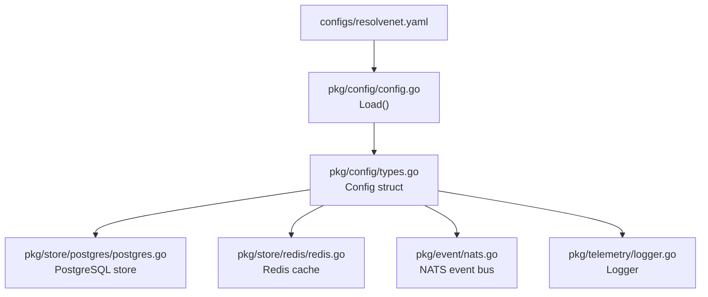
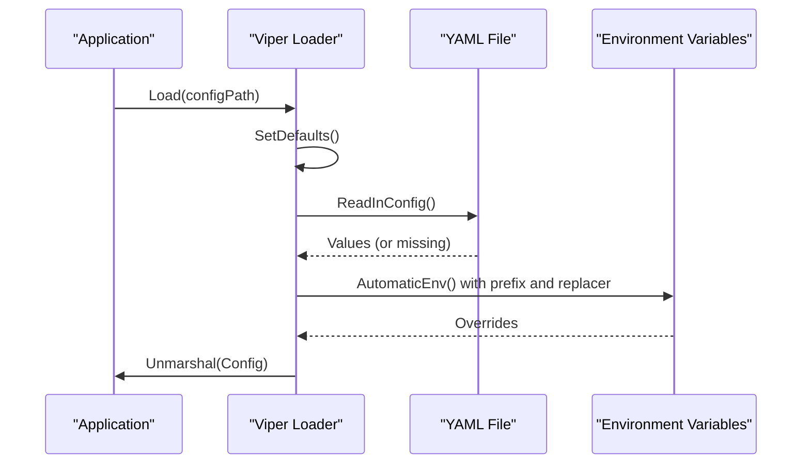
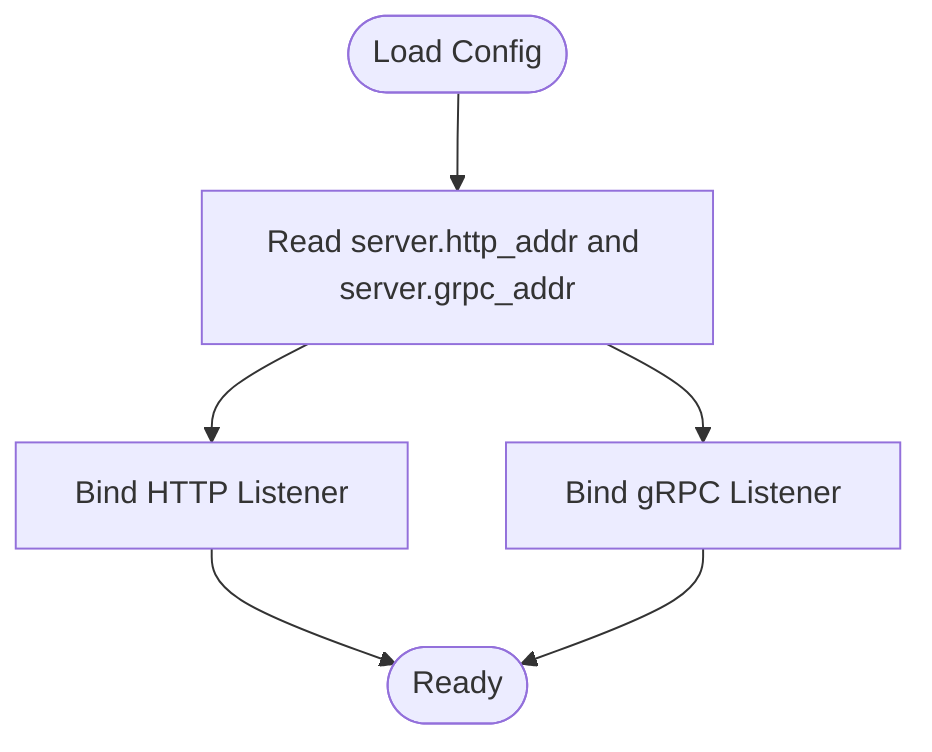
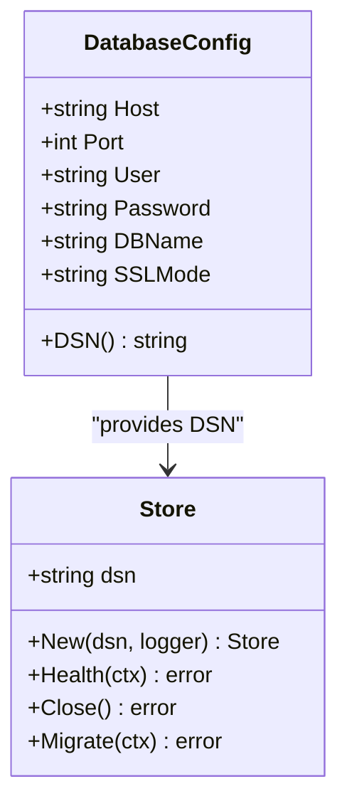
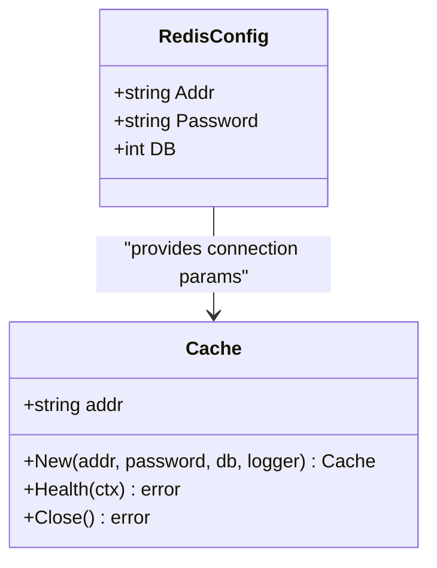
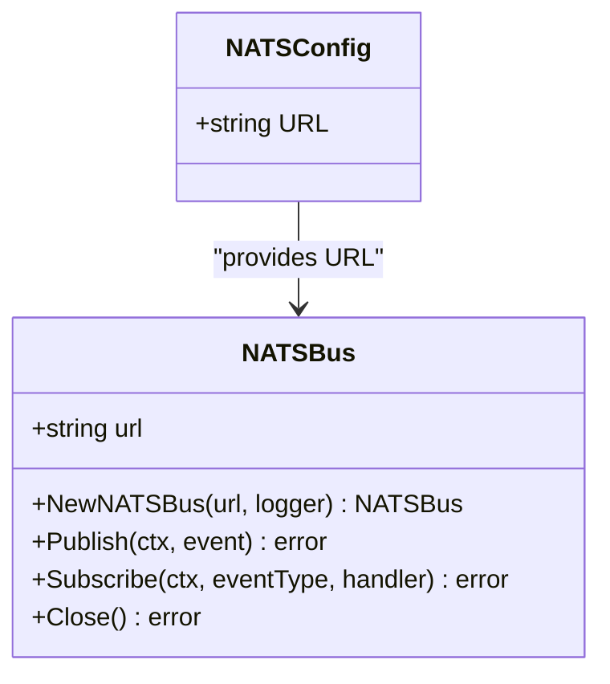
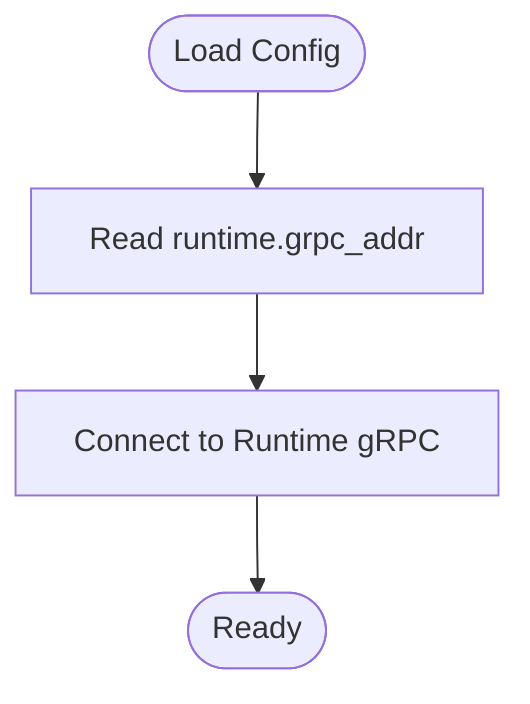
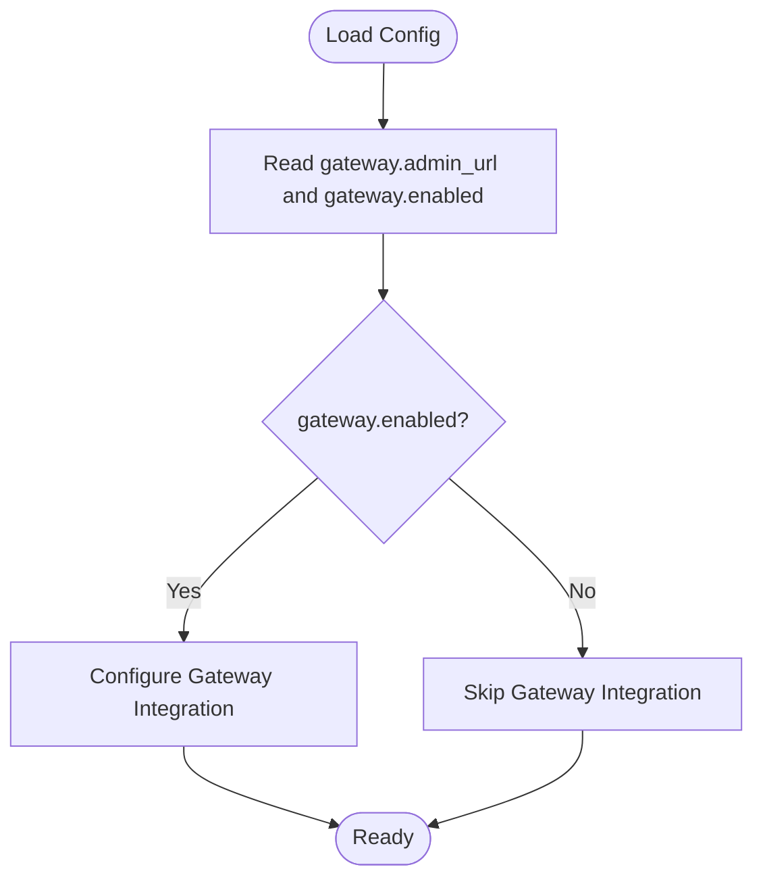
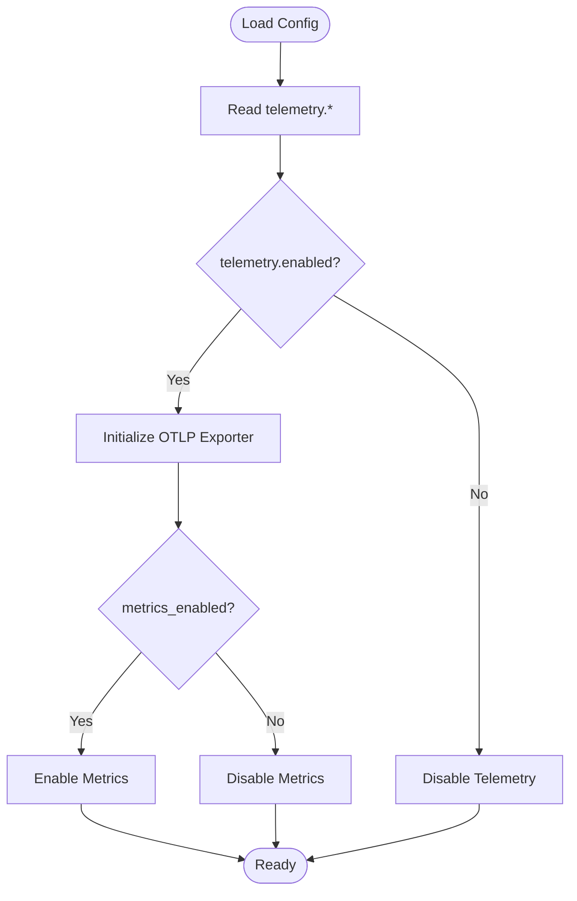
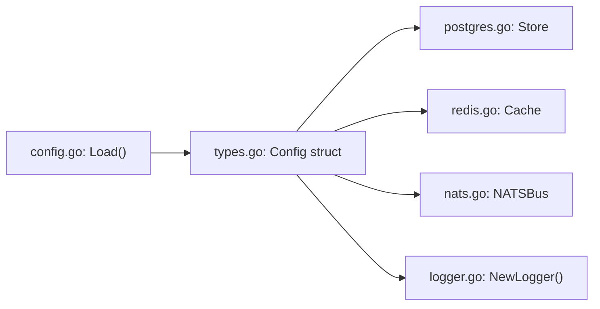

# Main Configuration (resolvenet.yaml)

<cite>
**Referenced Files in This Document**
- [resolvenet.yaml](file://configs/resolvenet.yaml)
- [config.go](file://pkg/config/config.go)
- [types.go](file://pkg/config/types.go)
- [docker-compose.yaml](file://deploy/docker-compose/docker-compose.yaml)
- [docker-compose.dev.yaml](file://deploy/docker-compose/docker-compose.dev.yaml)
- [postgres.go](file://pkg/store/postgres/postgres.go)
- [redis.go](file://pkg/store/redis/redis.go)
- [nats.go](file://pkg/event/nats.go)
- [logger.go](file://pkg/telemetry/logger.go)
</cite>

## Table of Contents
1. [Introduction](#introduction)
2. [Project Structure](#project-structure)
3. [Core Components](#core-components)
4. [Architecture Overview](#architecture-overview)
5. [Detailed Component Analysis](#detailed-component-analysis)
6. [Dependency Analysis](#dependency-analysis)
7. [Performance Considerations](#performance-considerations)
8. [Troubleshooting Guide](#troubleshooting-guide)
9. [Conclusion](#conclusion)
10. [Appendices](#appendices)

## Introduction
This document explains the main ResolveNet configuration file (resolvenet.yaml) and how it drives platform services. It covers the hierarchical structure of the YAML, the role of each section, environment variable overrides, and practical configuration scenarios for development, staging, and production. It also highlights security considerations for sensitive data such as database passwords and API keys.

## Project Structure
The configuration is loaded by the platform and consumed by various subsystems:
- The configuration loader sets defaults, reads the YAML file, applies environment variable overrides, and unmarshals into typed structs.
- The typed configuration defines sections for server, database, Redis, NATS, runtime, gateway, and telemetry.
- Deployment compose files demonstrate environment-specific overrides for containerized deployments.

**Diagram sources**
- [resolvenet.yaml:1-34](file://configs/resolvenet.yaml#L1-L34)
- [config.go:10-62](file://pkg/config/config.go#L10-L62)
- [types.go:3-69](file://pkg/config/types.go#L3-L69)
- [postgres.go:9-24](file://pkg/store/postgres/postgres.go#L9-L24)
- [redis.go:8-24](file://pkg/store/redis/redis.go#L8-L24)
- [nats.go:8-24](file://pkg/event/nats.go#L8-L24)
- [logger.go:8-35](file://pkg/telemetry/logger.go#L8-L35)

**Section sources**
- [resolvenet.yaml:1-34](file://configs/resolvenet.yaml#L1-L34)
- [config.go:10-62](file://pkg/config/config.go#L10-L62)
- [types.go:3-69](file://pkg/config/types.go#L3-L69)

## Core Components
The resolvenet.yaml file organizes configuration into clearly defined sections. Each section corresponds to a typed configuration struct and influences a specific subsystem.

- server: Defines HTTP and gRPC listening addresses for the platform API.
- database: Provides PostgreSQL connection parameters including host, port, user, password, database name, and SSL mode.
- redis: Specifies Redis connection address and database index.
- nats: Sets the NATS server URL for event streaming.
- runtime: Declares the runtime service gRPC address for agent execution.
- gateway: Controls optional Higress gateway admin URL and enablement flag.
- telemetry: Enables observability features, OTLP endpoint, service name, and metrics toggle.

These sections collectively define how the platform binds network services, connects to persistence and messaging systems, exposes optional gateway controls, and enables telemetry.

**Section sources**
- [resolvenet.yaml:3-33](file://configs/resolvenet.yaml#L3-L33)
- [types.go:14-69](file://pkg/config/types.go#L14-L69)

## Architecture Overview
The configuration loading and usage flow is straightforward:
- Defaults are registered for all keys.
- The YAML file is read from well-known locations.
- Environment variables override YAML values using a standardized prefix and dot-to-underscore replacement.
- The merged configuration is unmarshaled into typed structs and passed to subsystems.

**Diagram sources**
- [config.go:11-62](file://pkg/config/config.go#L11-L62)

## Detailed Component Analysis

### Server Configuration
- Purpose: Exposes HTTP and gRPC APIs for the platform.
- Keys:
  - server.http_addr: HTTP listener address.
  - server.grpc_addr: gRPC listener address.
- Behavior: These values are read directly from the configuration and used to bind network listeners.

**Diagram sources**
- [resolvenet.yaml:3-5](file://configs/resolvenet.yaml#L3-L5)
- [types.go:14-18](file://pkg/config/types.go#L14-L18)

**Section sources**
- [resolvenet.yaml:3-5](file://configs/resolvenet.yaml#L3-L5)
- [types.go:14-18](file://pkg/config/types.go#L14-L18)

### Database Configuration
- Purpose: Establishes PostgreSQL connectivity for persistent storage.
- Keys:
  - database.host, database.port, database.user, database.password, database.dbname, database.sslmode.
- Behavior:
  - The configuration struct provides a DSN builder method that composes a connection string from these fields.
  - The store module consumes this DSN to initialize the data store.

**Diagram sources**
- [types.go:20-38](file://pkg/config/types.go#L20-L38)
- [postgres.go:9-24](file://pkg/store/postgres/postgres.go#L9-L24)

**Section sources**
- [resolvenet.yaml:7-13](file://configs/resolvenet.yaml#L7-L13)
- [types.go:20-38](file://pkg/config/types.go#L20-L38)
- [postgres.go:16-24](file://pkg/store/postgres/postgres.go#L16-L24)

### Redis Configuration
- Purpose: Configures the caching layer backed by Redis.
- Keys:
  - redis.addr: Redis server address.
  - redis.db: Database index.
- Behavior: The cache module receives address, password, and DB index to initialize connections.

**Diagram sources**
- [types.go:40-45](file://pkg/config/types.go#L40-L45)
- [redis.go:8-24](file://pkg/store/redis/redis.go#L8-L24)

**Section sources**
- [resolvenet.yaml:15-17](file://configs/resolvenet.yaml#L15-L17)
- [types.go:40-45](file://pkg/config/types.go#L40-L45)
- [redis.go:15-24](file://pkg/store/redis/redis.go#L15-L24)

### NATS Configuration
- Purpose: Enables event streaming via NATS JetStream.
- Keys:
  - nats.url: NATS server URL.
- Behavior: The event bus module initializes and uses this URL for publishing and subscribing to events.

**Diagram sources**
- [types.go:47-50](file://pkg/config/types.go#L47-L50)
- [nats.go:8-24](file://pkg/event/nats.go#L8-L24)

**Section sources**
- [resolvenet.yaml:19-20](file://configs/resolvenet.yaml#L19-L20)
- [types.go:47-50](file://pkg/config/types.go#L47-L50)
- [nats.go:16-24](file://pkg/event/nats.go#L16-L24)

### Runtime Configuration
- Purpose: Defines the runtime service gRPC address for agent execution.
- Keys:
  - runtime.grpc_addr: Runtime gRPC address.
- Behavior: Used by the platform to communicate with the runtime service for agent lifecycle and execution.

**Diagram sources**
- [resolvenet.yaml:22-23](file://configs/resolvenet.yaml#L22-L23)
- [types.go:52-55](file://pkg/config/types.go#L52-L55)

**Section sources**
- [resolvenet.yaml:22-23](file://configs/resolvenet.yaml#L22-L23)
- [types.go:52-55](file://pkg/config/types.go#L52-L55)

### Gateway Configuration
- Purpose: Optional Higress gateway admin URL and enablement flag.
- Keys:
  - gateway.admin_url: Admin console URL.
  - gateway.enabled: Enable/disable gateway integration.
- Behavior: When enabled, the platform integrates with the gateway for traffic management.

**Diagram sources**
- [resolvenet.yaml:25-27](file://configs/resolvenet.yaml#L25-L27)
- [types.go:57-61](file://pkg/config/types.go#L57-L61)

**Section sources**
- [resolvenet.yaml:25-27](file://configs/resolvenet.yaml#L25-L27)
- [types.go:57-61](file://pkg/config/types.go#L57-L61)

### Telemetry Configuration
- Purpose: Enables observability features including metrics and tracing.
- Keys:
  - telemetry.enabled: Enable/disable telemetry.
  - telemetry.otlp_endpoint: OTLP exporter endpoint.
  - telemetry.service_name: Service name for telemetry.
  - telemetry.metrics_enabled: Enable metrics collection.
- Behavior: The logger module supports structured logging with configurable levels and formats.

**Diagram sources**
- [resolvenet.yaml:29-33](file://configs/resolvenet.yaml#L29-L33)
- [types.go:63-69](file://pkg/config/types.go#L63-L69)
- [logger.go:8-35](file://pkg/telemetry/logger.go#L8-L35)

**Section sources**
- [resolvenet.yaml:29-33](file://configs/resolvenet.yaml#L29-L33)
- [types.go:63-69](file://pkg/config/types.go#L63-L69)
- [logger.go:8-35](file://pkg/telemetry/logger.go#L8-L35)

## Dependency Analysis
The configuration loader and typed structs form a clean dependency chain:
- The loader registers defaults, reads the YAML, applies environment overrides, and unmarshals into the Config struct.
- Each subsystem (store, cache, event bus, logger) consumes only the relevant subset of configuration fields.

**Diagram sources**
- [config.go:11-62](file://pkg/config/config.go#L11-L62)
- [types.go:3-69](file://pkg/config/types.go#L3-L69)
- [postgres.go:16-24](file://pkg/store/postgres/postgres.go#L16-L24)
- [redis.go:15-24](file://pkg/store/redis/redis.go#L15-L24)
- [nats.go:16-24](file://pkg/event/nats.go#L16-L24)
- [logger.go:8-35](file://pkg/telemetry/logger.go#L8-L35)

**Section sources**
- [config.go:11-62](file://pkg/config/config.go#L11-L62)
- [types.go:3-69](file://pkg/config/types.go#L3-L69)

## Performance Considerations
- Keep telemetry enabled in production for observability, but tune metrics granularity to avoid overhead.
- Use appropriate SSL modes for databases and secure NATS URLs in production.
- Ensure Redis and PostgreSQL are tuned for concurrent workloads; separate DB instances per environment.
- Bind gRPC and HTTP listeners to loopback or reverse proxies in production to reduce direct exposure.

## Troubleshooting Guide
Common issues and resolutions:
- Configuration file not found: The loader ignores missing files; verify the YAML exists in one of the supported paths or pass a custom config path.
- Environment variable overrides not applied: Confirm the environment variable prefix and dot-to-underscore replacement rules match the expected keys.
- Connectivity failures:
  - For PostgreSQL, verify host, port, user, password, dbname, and sslmode.
  - For Redis, confirm address and DB index.
  - For NATS, ensure the URL is reachable and JetStream is enabled.
- Runtime connectivity: Verify the runtime gRPC address matches the deployed runtime service.

**Section sources**
- [config.go:44-62](file://pkg/config/config.go#L44-L62)
- [resolvenet.yaml:7-33](file://configs/resolvenet.yaml#L7-L33)

## Conclusion
The resolvenet.yaml file centralizes platform configuration across networking, persistence, messaging, runtime, gateway, and telemetry. Its hierarchical structure cleanly maps to typed configuration, enabling safe and predictable initialization of subsystems. Environment variable overrides provide flexibility across environments, while defaults ensure sensible behavior out of the box.

## Appendices

### Configuration Scenarios

- Development
  - Typical setup binds HTTP and gRPC to local ports, uses local Redis and NATS, and disables telemetry.
  - Example overrides via environment variables in development compose:
    - RESOLVENET_SERVER_HTTP_ADDR=":8080"
    - RESOLVENET_SERVER_GRPC_ADDR=":9090"
    - RESOLVENET_REDIS_ADDR="localhost:6379"
    - RESOLVENET_NATS_URL="nats://localhost:4222"
    - RESOLVENET_GATEWAY_ENABLED=false
    - RESOLVENET_TELEMETRY_ENABLED=false

  **Section sources**
  - [docker-compose.dev.yaml:10-12](file://deploy/docker-compose/docker-compose.dev.yaml#L10-L12)

- Staging
  - Use managed services for PostgreSQL, Redis, and NATS; enable telemetry with a staging OTLP endpoint; keep gateway disabled until integrated.
  - Example overrides:
    - RESOLVENET_DATABASE_HOST="staging-postgres.example"
    - RESOLVENET_REDIS_ADDR="staging-redis.example:6379"
    - RESOLVENET_NATS_URL="nats://staging-nats.example:4222"
    - RESOLVENET_TELEMETRY_OTLP_ENDPOINT="staging-otel-collector:4317"
    - RESOLVENET_GATEWAY_ENABLED=false

  **Section sources**
  - [docker-compose.yaml:11-15](file://deploy/docker-compose/docker-compose.yaml#L11-L15)

- Production
  - Use private networks, strong credentials, SSL/TLS enabled, and robust observability.
  - Example overrides:
    - RESOLVENET_DATABASE_HOST="rds-cluster.cluster-xxxx.region.rds.amazonaws.com"
    - RESOLVENET_DATABASE_SSLMODE="require"
    - RESOLVENET_REDIS_ADDR="redis.example:6379"
    - RESOLVENET_NATS_URL="nats://nats.example:4222"
    - RESOLVENET_TELEMETRY_ENABLED=true
    - RESOLVENET_TELEMETRY_METRICS_ENABLED=true
    - RESOLVENET_GATEWAY_ENABLED=true

  **Section sources**
  - [docker-compose.yaml:11-15](file://deploy/docker-compose/docker-compose.yaml#L11-L15)

### Environment Variable Override Patterns
- Prefix: RESOLVENET_
- Separator: Replace dots with underscores in nested keys (e.g., server.http_addr becomes RESOLVENET_SERVER_HTTP_ADDR)
- Supported keys include server.*, database.*, redis.*, nats.*, runtime.*, gateway.*, telemetry.*

**Section sources**
- [config.go:44-47](file://pkg/config/config.go#L44-L47)
- [resolvenet.yaml:3-33](file://configs/resolvenet.yaml#L3-L33)

### Security Considerations
- Database credentials: Prefer environment variables for passwords; avoid committing secrets to source control.
- NATS URLs: Use secure URLs and restrict network access; enable TLS and authentication where available.
- Secrets management: Integrate with a secrets manager in production; mount secrets as environment variables or files.
- Least privilege: Grant minimal required permissions to database and cache users.
- Network isolation: Place services behind firewalls and VPNs; expose only necessary ports externally.