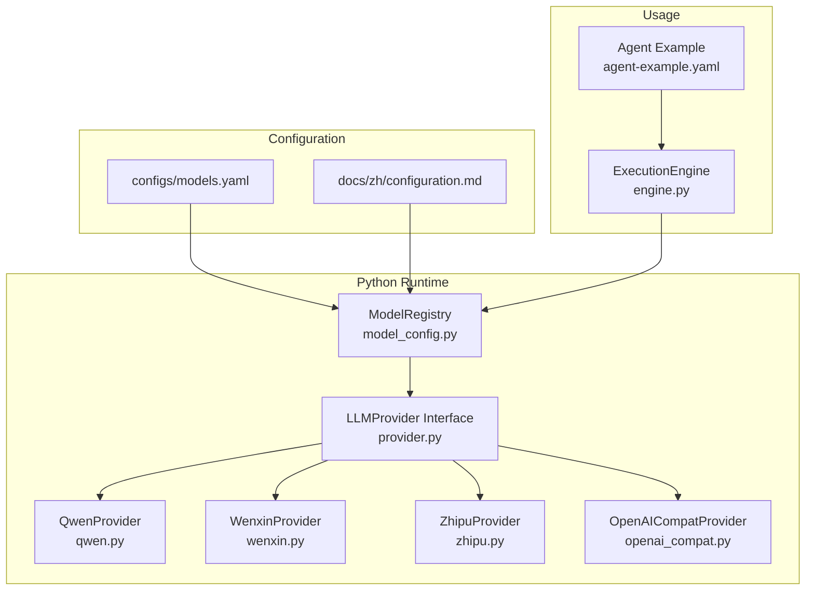
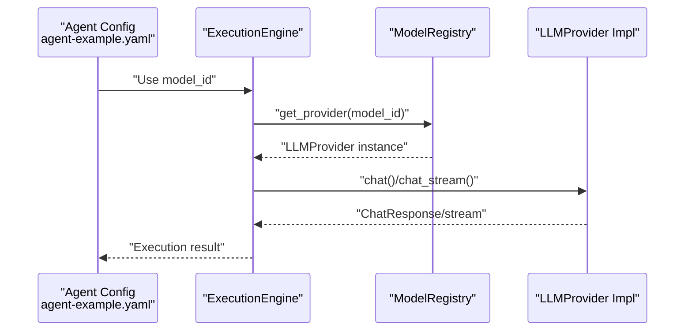
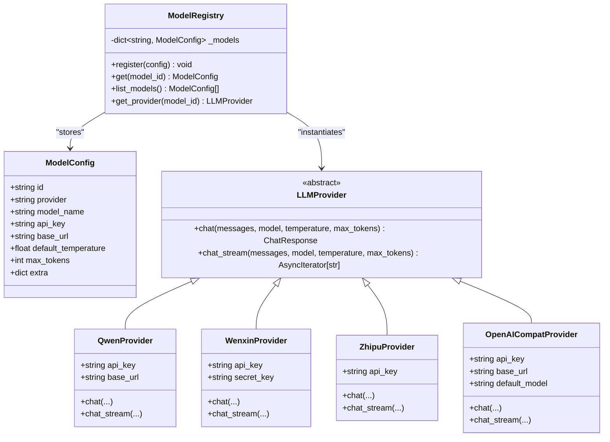
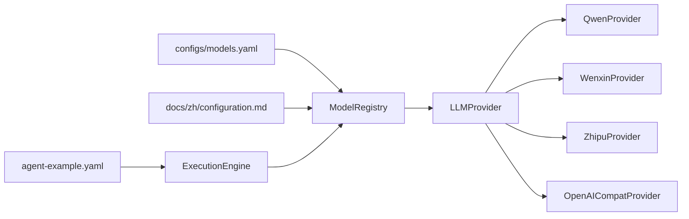

# Models Configuration (models.yaml)

<cite>
**Referenced Files in This Document**
- [models.yaml](file://configs/models.yaml)
- [configuration.md](file://docs/zh/configuration.md)
- [model_config.py](file://python/src/resolvenet/llm/model_config.py)
- [provider.py](file://python/src/resolvenet/llm/provider.py)
- [qwen.py](file://python/src/resolvenet/llm/qwen.py)
- [wenxin.py](file://python/src/resolvenet/llm/wenxin.py)
- [zhipu.py](file://python/src/resolvenet/llm/zhipu.py)
- [openai_compat.py](file://python/src/resolvenet/llm/openai_compat.py)
- [engine.py](file://python/src/resolvenet/runtime/engine.py)
- [agent-example.yaml](file://configs/examples/agent-example.yaml)
</cite>

## Table of Contents
1. [Introduction](#introduction)
2. [Project Structure](#project-structure)
3. [Core Components](#core-components)
4. [Architecture Overview](#architecture-overview)
5. [Detailed Component Analysis](#detailed-component-analysis)
6. [Dependency Analysis](#dependency-analysis)
7. [Performance Considerations](#performance-considerations)
8. [Troubleshooting Guide](#troubleshooting-guide)
9. [Conclusion](#conclusion)
10. [Appendices](#appendices)

## Introduction
This document explains the models configuration system that defines LLM providers and model mappings used by the ResolveNet runtime. It covers:
- Provider definitions for OpenAI-compatible, Qwen, Wenxin, and Zhipu
- Model mapping from logical model IDs to provider implementations
- Authentication configuration and security considerations
- Multi-provider setups and failover strategies
- Model selection strategies, cost optimization, and performance monitoring

## Project Structure
The models configuration is primarily defined in a YAML file and consumed by the Python runtime’s model registry and provider classes. The Go server exposes model-related endpoints that are placeholders today but align with the configuration structure.

**Diagram sources**
- [models.yaml:1-31](file://configs/models.yaml#L1-L31)
- [configuration.md:385-436](file://docs/zh/configuration.md#L385-L436)
- [model_config.py:23-69](file://python/src/resolvenet/llm/model_config.py#L23-L69)
- [provider.py:27-76](file://python/src/resolvenet/llm/provider.py#L27-L76)
- [qwen.py:13-56](file://python/src/resolvenet/llm/qwen.py#L13-L56)
- [wenxin.py:13-51](file://python/src/resolvenet/llm/wenxin.py#L13-L51)
- [zhipu.py:13-50](file://python/src/resolvenet/llm/zhipu.py#L13-L50)
- [openai_compat.py:13-56](file://python/src/resolvenet/llm/openai_compat.py#L13-L56)
- [engine.py:22-89](file://python/src/resolvenet/runtime/engine.py#L22-L89)
- [agent-example.yaml:7-8](file://configs/examples/agent-example.yaml#L7-L8)

**Section sources**
- [models.yaml:1-31](file://configs/models.yaml#L1-L31)
- [configuration.md:385-436](file://docs/zh/configuration.md#L385-L436)
- [model_config.py:23-69](file://python/src/resolvenet/llm/model_config.py#L23-L69)
- [provider.py:27-76](file://python/src/resolvenet/llm/provider.py#L27-L76)
- [qwen.py:13-56](file://python/src/resolvenet/llm/qwen.py#L13-L56)
- [wenxin.py:13-51](file://python/src/resolvenet/llm/wenxin.py#L13-L51)
- [zhipu.py:13-50](file://python/src/resolvenet/llm/zhipu.py#L13-L50)
- [openai_compat.py:13-56](file://python/src/resolvenet/llm/openai_compat.py#L13-L56)
- [engine.py:22-89](file://python/src/resolvenet/runtime/engine.py#L22-L89)
- [agent-example.yaml:7-8](file://configs/examples/agent-example.yaml#L7-L8)

## Core Components
- Model configuration schema: Logical model ID, provider type, model name, optional API keys, base URLs, default temperature, max tokens, and extra provider-specific fields.
- Model registry: Stores configured models and resolves a provider instance by model ID.
- Provider interface: Defines asynchronous chat and streaming chat methods for all providers.
- Provider implementations:
  - Qwen: Alibaba DashScope-compatible endpoint with default model and base URL.
  - Wenxin: Baidu ERNIE Bot requiring API key and secret key.
  - Zhipu: Zhipu GLM models with API key support.
  - OpenAI-compatible: Generic provider for local or third-party OpenAI-compatible APIs.

**Section sources**
- [model_config.py:10-21](file://python/src/resolvenet/llm/model_config.py#L10-L21)
- [model_config.py:23-69](file://python/src/resolvenet/llm/model_config.py#L23-L69)
- [provider.py:27-76](file://python/src/resolvenet/llm/provider.py#L27-L76)
- [qwen.py:13-26](file://python/src/resolvenet/llm/qwen.py#L13-L26)
- [wenxin.py:13-24](file://python/src/resolvenet/llm/wenxin.py#L13-L24)
- [zhipu.py:13-23](file://python/src/resolvenet/llm/zhipu.py#L13-L23)
- [openai_compat.py:13-29](file://python/src/resolvenet/llm/openai_compat.py#L13-L29)

## Architecture Overview
The runtime loads model definitions from YAML, registers them in the model registry, and selects a provider per model ID. Agents reference a model ID, which the registry resolves to a provider instance for chat and streaming operations.

**Diagram sources**
- [agent-example.yaml:7-8](file://configs/examples/agent-example.yaml#L7-L8)
- [engine.py:22-89](file://python/src/resolvenet/runtime/engine.py#L22-L89)
- [model_config.py:33-69](file://python/src/resolvenet/llm/model_config.py#L33-L69)
- [provider.py:34-76](file://python/src/resolvenet/llm/provider.py#L34-L76)

## Detailed Component Analysis

### Model Configuration Schema
- Fields:
  - id: Unique logical model identifier used by agents.
  - provider: One of qwen, wenxin, zhipu, or openai-compat.
  - model_name: Provider-side model identifier.
  - api_key: Secret key for provider authentication.
  - base_url: Override provider base URL (OpenAI-compatible).
  - default_temperature: Sampling temperature for chat requests.
  - max_tokens: Maximum tokens for generation.
  - extra: Arbitrary provider-specific configuration.

Notes:
- The current YAML in configs/models.yaml omits api_key and base_url fields for brevity.
- The Chinese documentation includes these fields and demonstrates environment variable substitution.

**Section sources**
- [models.yaml:3-31](file://configs/models.yaml#L3-L31)
- [configuration.md:387-436](file://docs/zh/configuration.md#L387-L436)
- [model_config.py:10-21](file://python/src/resolvenet/llm/model_config.py#L10-L21)

### Model Registry and Provider Resolution
- The registry stores ModelConfig entries keyed by id.
- get_provider resolves a provider instance based on provider type and returns an initialized provider with credentials and base URL.

**Diagram sources**
- [model_config.py:10-69](file://python/src/resolvenet/llm/model_config.py#L10-L69)
- [provider.py:27-76](file://python/src/resolvenet/llm/provider.py#L27-L76)
- [qwen.py:13-56](file://python/src/resolvenet/llm/qwen.py#L13-L56)
- [wenxin.py:13-51](file://python/src/resolvenet/llm/wenxin.py#L13-L51)
- [zhipu.py:13-50](file://python/src/resolvenet/llm/zhipu.py#L13-L50)
- [openai_compat.py:13-56](file://python/src/resolvenet/llm/openai_compat.py#L13-L56)

**Section sources**
- [model_config.py:23-69](file://python/src/resolvenet/llm/model_config.py#L23-L69)
- [provider.py:27-76](file://python/src/resolvenet/llm/provider.py#L27-L76)

### Provider Implementations

#### Qwen (DashScope)
- Default model and base URL are set internally.
- Accepts api_key and optional base_url override.
- Methods: chat and chat_stream.

**Section sources**
- [qwen.py:13-26](file://python/src/resolvenet/llm/qwen.py#L13-L26)
- [qwen.py:27-56](file://python/src/resolvenet/llm/qwen.py#L27-L56)

#### Wenxin (ERNIE Bot)
- Requires api_key and secret_key.
- Methods: chat and chat_stream.

**Section sources**
- [wenxin.py:13-24](file://python/src/resolvenet/llm/wenxin.py#L13-L24)
- [wenxin.py:25-51](file://python/src/resolvenet/llm/wenxin.py#L25-L51)

#### Zhipu (GLM)
- Requires api_key.
- Methods: chat and chat_stream.

**Section sources**
- [zhipu.py:13-23](file://python/src/resolvenet/llm/zhipu.py#L13-L23)
- [zhipu.py:24-50](file://python/src/resolvenet/llm/zhipu.py#L24-L50)

#### OpenAI-Compatible
- Supports default_model, base_url, and api_key.
- Methods: chat and chat_stream.

**Section sources**
- [openai_compat.py:13-29](file://python/src/resolvenet/llm/openai_compat.py#L13-L29)
- [openai_compat.py:30-56](file://python/src/resolvenet/llm/openai_compat.py#L30-L56)

### Authentication and Security
- API keys are configured per model via api_key.
- For Wenxin, both api_key and secret_key are required.
- Base URLs can be overridden per model for OpenAI-compatible providers.
- Environment variable substitution is supported in the Chinese documentation examples, enabling secure externalized secrets.

Security recommendations:
- Store secrets externally (environment variables or secret managers).
- Restrict base_url to trusted endpoints.
- Prefer short-lived tokens where applicable.
- Audit provider credentials and rotation policies.

**Section sources**
- [configuration.md:395-435](file://docs/zh/configuration.md#L395-L435)
- [wenxin.py:21-23](file://python/src/resolvenet/llm/wenxin.py#L21-L23)
- [qwen.py:23-25](file://python/src/resolvenet/llm/qwen.py#L23-L25)
- [zhipu.py:21-22](file://python/src/resolvenet/llm/zhipu.py#L21-L22)
- [openai_compat.py:20-28](file://python/src/resolvenet/llm/openai_compat.py#L20-L28)

### Multi-Provider Setup and Failover
- Define multiple models with distinct ids and providers.
- Agents select a model_id; the registry resolves the appropriate provider.
- For failover, configure multiple models with the same logical purpose and switch model_id at runtime or via selector logic.

Example pattern:
- Create models with ids like qwen-turbo-secondary, zhipu-legacy.
- Route based on latency, cost, or availability signals.

**Section sources**
- [models.yaml:3-31](file://configs/models.yaml#L3-L31)
- [model_config.py:23-69](file://python/src/resolvenet/llm/model_config.py#L23-L69)

### Model Selection Strategies
- Temperature and max_tokens are configurable per model.
- Select models by capability:
  - Smaller max_tokens for concise tasks.
  - Lower temperature for deterministic outputs.
- Choose providers by region, latency, or cost characteristics.

**Section sources**
- [models.yaml:7-20](file://configs/models.yaml#L7-L20)
- [model_config.py:16-20](file://python/src/resolvenet/llm/model_config.py#L16-L20)

### Cost Optimization Techniques
- Prefer smaller models for low-cost inference when quality allows.
- Tune max_tokens to reduce prompt and completion length.
- Batch operations where supported by downstream systems.
- Monitor provider usage and adjust model allocation dynamically.

[No sources needed since this section provides general guidance]

### Performance Monitoring
- Providers return usage metadata in ChatResponse; capture and export metrics for latency, tokens, and costs.
- Instrument provider calls with tracing and logging.
- Track model-level performance to inform selection and budgeting.

**Section sources**
- [provider.py:18-25](file://python/src/resolvenet/llm/provider.py#L18-L25)

## Dependency Analysis
The runtime depends on the model registry to resolve providers. Agents reference model IDs, which the registry maps to provider implementations.

**Diagram sources**
- [models.yaml:1-31](file://configs/models.yaml#L1-L31)
- [configuration.md:385-436](file://docs/zh/configuration.md#L385-L436)
- [model_config.py:23-69](file://python/src/resolvenet/llm/model_config.py#L23-L69)
- [provider.py:27-76](file://python/src/resolvenet/llm/provider.py#L27-L76)
- [qwen.py:13-56](file://python/src/resolvenet/llm/qwen.py#L13-L56)
- [wenxin.py:13-51](file://python/src/resolvenet/llm/wenxin.py#L13-L51)
- [zhipu.py:13-50](file://python/src/resolvenet/llm/zhipu.py#L13-L50)
- [openai_compat.py:13-56](file://python/src/resolvenet/llm/openai_compat.py#L13-L56)
- [agent-example.yaml:7-8](file://configs/examples/agent-example.yaml#L7-L8)
- [engine.py:22-89](file://python/src/resolvenet/runtime/engine.py#L22-L89)

**Section sources**
- [model_config.py:23-69](file://python/src/resolvenet/llm/model_config.py#L23-L69)
- [engine.py:22-89](file://python/src/resolvenet/runtime/engine.py#L22-L89)

## Performance Considerations
- Use appropriate max_tokens and temperature to balance quality and cost.
- Prefer regional provider endpoints to reduce latency.
- Implement retry and circuit breaker patterns around provider calls.
- Cache embeddings and intermediate results where feasible.

[No sources needed since this section provides general guidance]

## Troubleshooting Guide
Common issues and resolutions:
- Model not found: Ensure the model id exists in the registry and matches agent configuration.
- Authentication failures: Verify api_key presence and correctness; check provider-specific requirements (e.g., secret_key for Wenxin).
- Endpoint connectivity: Confirm base_url accessibility and TLS configuration.
- Streaming not working: Check provider streaming support and network conditions.

**Section sources**
- [model_config.py:50-52](file://python/src/resolvenet/llm/model_config.py#L50-L52)
- [wenxin.py:21-23](file://python/src/resolvenet/llm/wenxin.py#L21-L23)
- [qwen.py:23-25](file://python/src/resolvenet/llm/qwen.py#L23-L25)
- [openai_compat.py:20-28](file://python/src/resolvenet/llm/openai_compat.py#L20-L28)

## Conclusion
The models configuration system provides a flexible, extensible way to define and consume LLM providers. By centralizing provider credentials and endpoint configuration, it enables multi-provider setups, failover strategies, and operational controls for cost and performance.

[No sources needed since this section summarizes without analyzing specific files]

## Appendices

### Example: Agent Using a Model ID
- An agent references model_id to select a provider-defined model.
- The registry resolves the provider and executes chat or streaming calls.

**Section sources**
- [agent-example.yaml:7-8](file://configs/examples/agent-example.yaml#L7-L8)
- [engine.py:22-89](file://python/src/resolvenet/runtime/engine.py#L22-L89)