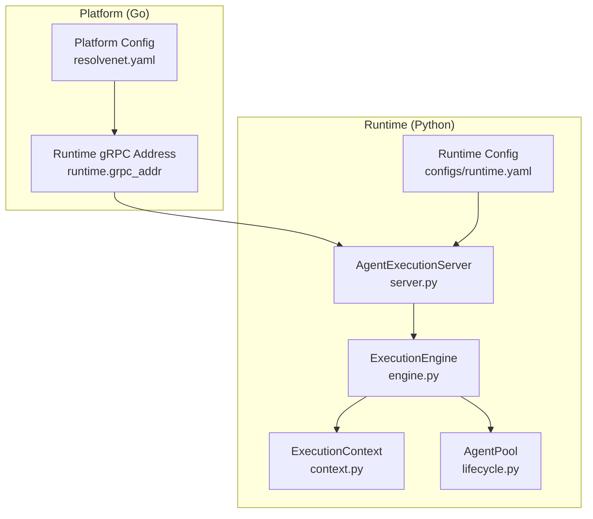
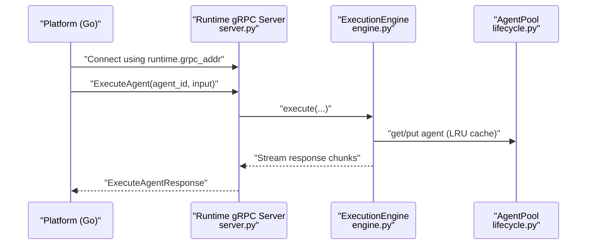
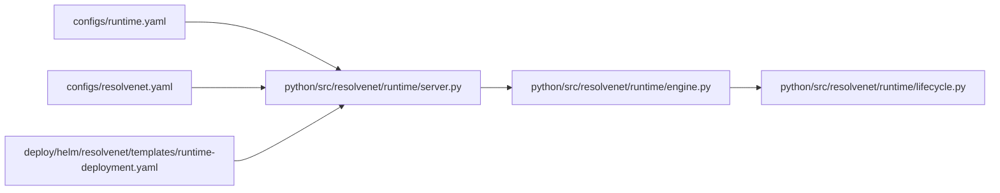

# Runtime Configuration (runtime.yaml)

<cite>
**Referenced Files in This Document**
- [runtime.yaml](file://configs/runtime.yaml)
- [resolvenet.yaml](file://configs/resolvenet.yaml)
- [engine.py](file://python/src/resolvenet/runtime/engine.py)
- [context.py](file://python/src/resolvenet/runtime/context.py)
- [lifecycle.py](file://python/src/resolvenet/runtime/lifecycle.py)
- [server.py](file://python/src/resolvenet/runtime/server.py)
- [config.go](file://pkg/config/config.go)
- [types.go](file://pkg/config/types.go)
- [runtime-deployment.yaml](file://deploy/helm/resolvenet/templates/runtime-deployment.yaml)
- [runtime-service.yaml](file://deploy/helm/resolvenet/templates/runtime-service.yaml)
- [agent-example.yaml](file://configs/examples/agent-example.yaml)
- [manifest.py](file://python/src/resolvenet/skills/manifest.py)
</cite>

## Table of Contents
1. [Introduction](#introduction)
2. [Project Structure](#project-structure)
3. [Core Components](#core-components)
4. [Architecture Overview](#architecture-overview)
5. [Detailed Component Analysis](#detailed-component-analysis)
6. [Dependency Analysis](#dependency-analysis)
7. [Performance Considerations](#performance-considerations)
8. [Troubleshooting Guide](#troubleshooting-guide)
9. [Conclusion](#conclusion)
10. [Appendices](#appendices)

## Introduction
This document explains the runtime configuration system used by the Python agent runtime. It focuses on the runtime configuration file structure, how runtime settings influence agent execution, and how runtime configuration differs from platform configuration. It also covers resource allocation parameters, execution timeouts, memory limits, and concurrency settings, along with validation, defaults, examples, and performance tuning recommendations.

## Project Structure
The runtime configuration is defined in a dedicated YAML file and is consumed by the Python runtime components that orchestrate agent execution. Platform configuration (Go) defines connectivity to the runtime service endpoint, while runtime configuration controls the runtime’s own operational parameters.

**Diagram sources**
- [resolvenet.yaml:22-23](file://configs/resolvenet.yaml#L22-L23)
- [runtime.yaml:3-17](file://configs/runtime.yaml#L3-L17)
- [server.py:18-21](file://python/src/resolvenet/runtime/server.py#L18-L21)
- [engine.py:22-24](file://python/src/resolvenet/runtime/engine.py#L22-L24)
- [context.py:23-29](file://python/src/resolvenet/runtime/context.py#L23-L29)
- [lifecycle.py:19-21](file://python/src/resolvenet/runtime/lifecycle.py#L19-L21)

**Section sources**
- [runtime.yaml:1-18](file://configs/runtime.yaml#L1-L18)
- [resolvenet.yaml:22-23](file://configs/resolvenet.yaml#L22-L23)
- [server.py:18-21](file://python/src/resolvenet/runtime/server.py#L18-L21)
- [engine.py:22-24](file://python/src/resolvenet/runtime/engine.py#L22-L24)
- [context.py:23-29](file://python/src/resolvenet/runtime/context.py#L23-L29)
- [lifecycle.py:19-21](file://python/src/resolvenet/runtime/lifecycle.py#L19-L21)

## Core Components
- Runtime configuration file: Defines runtime service address, agent pool sizing and eviction policy, selector defaults, and telemetry toggles.
- Platform configuration: Defines the runtime gRPC address that the platform uses to connect to the runtime service.
- Python runtime components:
  - AgentExecutionServer: Hosts the gRPC interface and delegates execution to the engine.
  - ExecutionEngine: Orchestrates execution context creation and streams results.
  - ExecutionContext: Holds per-execution state.
  - AgentPool: Manages agent instances with LRU eviction and configurable capacity.

Key runtime configuration keys and defaults:
- server.host: Network bind address for the runtime service.
- server.port: Port for the runtime service.
- agent_pool.max_size: Maximum number of agents held in the pool.
- agent_pool.eviction_policy: Eviction strategy for the agent pool.
- selector.default_strategy: Default routing strategy for the Intelligent Selector.
- selector.confidence_threshold: Confidence threshold for selector decisions.
- telemetry.enabled: Enable/disable telemetry.
- telemetry.service_name: Service name used in telemetry.

**Section sources**
- [runtime.yaml:3-17](file://configs/runtime.yaml#L3-L17)
- [resolvenet.yaml:22-23](file://configs/resolvenet.yaml#L22-L23)
- [server.py:18-21](file://python/src/resolvenet/runtime/server.py#L18-L21)
- [engine.py:22-24](file://python/src/resolvenet/runtime/engine.py#L22-L24)
- [context.py:23-29](file://python/src/resolvenet/runtime/context.py#L23-L29)
- [lifecycle.py:19-21](file://python/src/resolvenet/runtime/lifecycle.py#L19-L21)

## Architecture Overview
The platform (Go) connects to the runtime (Python) via gRPC. The runtime’s own configuration determines how the runtime service binds to the network, how many agents are cached, and how selector defaults behave. The platform configuration supplies the runtime gRPC address used by the platform.

**Diagram sources**
- [resolvenet.yaml:22-23](file://configs/resolvenet.yaml#L22-L23)
- [server.py:56-60](file://python/src/resolvenet/runtime/server.py#L56-L60)
- [engine.py:25-89](file://python/src/resolvenet/runtime/engine.py#L25-L89)
- [lifecycle.py:23-46](file://python/src/resolvenet/runtime/lifecycle.py#L23-L46)

## Detailed Component Analysis

### Runtime Configuration File (runtime.yaml)
- Purpose: Controls runtime service binding, agent caching behavior, selector defaults, and telemetry.
- Scope: Affects runtime service startup, agent pooling, and selector behavior within the runtime.
- Notable keys:
  - server.host, server.port: Network binding for the runtime gRPC server.
  - agent_pool.max_size, agent_pool.eviction_policy: Agent instance caching and eviction.
  - selector.default_strategy, selector.confidence_threshold: Routing strategy and confidence threshold for the selector.
  - telemetry.enabled, telemetry.service_name: Telemetry toggles and service name.

Impact on agent behavior:
- Larger agent_pool.max_size improves throughput by reducing cold starts but increases memory usage.
- LRU eviction_policy ensures least-used agents are evicted when capacity is reached.
- selector.default_strategy and selector.confidence_threshold influence routing decisions made by the Intelligent Selector.

**Section sources**
- [runtime.yaml:3-17](file://configs/runtime.yaml#L3-L17)

### Platform Configuration (resolvenet.yaml)
- Purpose: Defines platform-wide settings and external service endpoints.
- Runtime connectivity: runtime.grpc_addr specifies the runtime gRPC address that the platform uses to communicate with the runtime service.
- Defaults and environment overrides: The platform configuration loader sets defaults and supports environment variable overrides.

How platform and runtime differ:
- Platform configuration governs how the platform connects to the runtime (address and port).
- Runtime configuration governs how the runtime service itself operates (binding, caching, selector defaults, telemetry).

**Section sources**
- [resolvenet.yaml:22-23](file://configs/resolvenet.yaml#L22-L23)
- [config.go:14-31](file://pkg/config/config.go#L14-L31)
- [types.go:52-55](file://pkg/config/types.go#L52-L55)

### Python Runtime Components

#### AgentExecutionServer
- Initializes runtime service host and port from configuration.
- Exposes execute_agent method that delegates to the ExecutionEngine and streams responses.

Operational implications:
- Binding to host/port is controlled by runtime.yaml.
- Streaming responses enables real-time feedback during agent execution.

**Section sources**
- [server.py:18-21](file://python/src/resolvenet/runtime/server.py#L18-L21)
- [server.py:38-60](file://python/src/resolvenet/runtime/server.py#L38-L60)

#### ExecutionEngine
- Creates an ExecutionContext for each execution.
- Streams execution lifecycle events and content chunks.
- Orchestrates agent execution and selector routing (placeholder).

Operational implications:
- ExecutionContext carries execution_id, agent_id, conversation_id, and metadata.
- Engine acts as the central coordinator for agent runs.

**Section sources**
- [engine.py:22-24](file://python/src/resolvenet/runtime/engine.py#L22-L24)
- [engine.py:25-89](file://python/src/resolvenet/runtime/engine.py#L25-L89)
- [context.py:23-29](file://python/src/resolvenet/runtime/context.py#L23-L29)

#### AgentPool (LRU Cache)
- Maintains a bounded cache of agent instances.
- Evicts least-recently-used agents when capacity is exceeded.
- Size is configurable via runtime configuration.

Operational implications:
- Higher max_size reduces latency for repeated agent invocations.
- LRU eviction prevents unbounded growth of cached agents.

**Section sources**
- [lifecycle.py:19-21](file://python/src/resolvenet/runtime/lifecycle.py#L19-L21)
- [lifecycle.py:37-40](file://python/src/resolvenet/runtime/lifecycle.py#L37-L40)

### Selector Defaults
- selector.default_strategy and selector.confidence_threshold are defined in runtime configuration.
- These defaults guide the Intelligent Selector’s routing decisions when not overridden by agent definitions.

Practical usage:
- Agents can override selector defaults via their own configuration (see agent examples).

**Section sources**
- [runtime.yaml:11-13](file://configs/runtime.yaml#L11-L13)
- [agent-example.yaml:15-17](file://configs/examples/agent-example.yaml#L15-L17)

### Skill Permissions and Resource Limits
- Skills define their own resource constraints in manifests:
  - max_memory_mb: Maximum memory usage for a skill execution.
  - max_cpu_seconds: Maximum CPU time allocated.
  - timeout_seconds: Hard timeout for skill execution.
- These are enforced by the skill sandbox and loader.

Note: These are not part of runtime.yaml but are relevant to execution constraints in the runtime.

**Section sources**
- [manifest.py:11-21](file://python/src/resolvenet/skills/manifest.py#L11-L21)

## Dependency Analysis
Runtime configuration influences the runtime service’s behavior and indirectly affects platform-to-runtime communication.

**Diagram sources**
- [runtime.yaml:3-17](file://configs/runtime.yaml#L3-L17)
- [server.py:18-21](file://python/src/resolvenet/runtime/server.py#L18-L21)
- [engine.py:22-24](file://python/src/resolvenet/runtime/engine.py#L22-L24)
- [lifecycle.py:19-21](file://python/src/resolvenet/runtime/lifecycle.py#L19-L21)
- [resolvenet.yaml:22-23](file://configs/resolvenet.yaml#L22-L23)
- [runtime-deployment.yaml:19-25](file://deploy/helm/resolvenet/templates/runtime-deployment.yaml#L19-L25)

**Section sources**
- [runtime.yaml:3-17](file://configs/runtime.yaml#L3-L17)
- [resolvenet.yaml:22-23](file://configs/resolvenet.yaml#L22-L23)
- [server.py:18-21](file://python/src/resolvenet/runtime/server.py#L18-L21)
- [engine.py:22-24](file://python/src/resolvenet/runtime/engine.py#L22-L24)
- [lifecycle.py:19-21](file://python/src/resolvenet/runtime/lifecycle.py#L19-L21)
- [runtime-deployment.yaml:19-25](file://deploy/helm/resolvenet/templates/runtime-deployment.yaml#L19-L25)

## Performance Considerations
- Agent pool sizing:
  - Increase agent_pool.max_size to reduce cold-start latency for frequently reused agents.
  - Monitor memory usage; larger pools consume more RAM.
- Eviction policy:
  - LRU eviction keeps the pool fresh; tune max_size according to workload patterns.
- Selector defaults:
  - Adjust selector.confidence_threshold to balance precision and recall in routing decisions.
- Telemetry:
  - Enabling telemetry adds overhead; disable in high-throughput environments unless needed.
- Platform-to-runtime connectivity:
  - Ensure runtime.grpc_addr points to a reachable endpoint; misconfiguration causes connection failures.

[No sources needed since this section provides general guidance]

## Troubleshooting Guide
Common issues and resolutions:
- Runtime service not reachable:
  - Verify server.host and server.port in runtime.yaml.
  - Confirm runtime.grpc_addr in platform configuration matches the runtime service address.
- Agent pool exhaustion:
  - Increase agent_pool.max_size to accommodate peak concurrency.
  - Observe eviction logs when capacity is hit.
- Selector misrouting:
  - Review selector.default_strategy and selector.confidence_threshold.
  - Override selector settings per agent if needed.
- Telemetry anomalies:
  - Toggle telemetry.enabled and confirm service_name alignment.
- Kubernetes deployment:
  - Validate runtime service port and containerPort in Helm templates.

**Section sources**
- [runtime.yaml:3-17](file://configs/runtime.yaml#L3-L17)
- [resolvenet.yaml:22-23](file://configs/resolvenet.yaml#L22-L23)
- [lifecycle.py:37-40](file://python/src/resolvenet/runtime/lifecycle.py#L37-L40)
- [runtime-deployment.yaml:22-25](file://deploy/helm/resolvenet/templates/runtime-deployment.yaml#L22-L25)

## Conclusion
Runtime configuration controls how the Python agent runtime binds to the network, manages agent instances, and applies selector defaults. Platform configuration dictates how the platform connects to the runtime. Together, they shape agent execution behavior, performance, and reliability. Proper tuning of runtime parameters and alignment with platform settings are essential for optimal operation.

[No sources needed since this section summarizes without analyzing specific files]

## Appendices

### Configuration Validation and Defaults
- Platform configuration defaults and environment override patterns are handled by the platform configuration loader.
- Runtime configuration is validated by the runtime service initialization and used to configure the server and selector defaults.

**Section sources**
- [config.go:14-31](file://pkg/config/config.go#L14-L31)
- [server.py:18-21](file://python/src/resolvenet/runtime/server.py#L18-L21)
- [runtime.yaml:3-17](file://configs/runtime.yaml#L3-L17)

### Examples of Runtime Settings for Different Agent Types
- General-purpose agents:
  - Increase agent_pool.max_size to support frequent reuse.
  - Keep selector.default_strategy at hybrid and adjust selector.confidence_threshold based on domain needs.
- High-concurrency scenarios:
  - Increase agent_pool.max_size and monitor memory usage.
  - Consider enabling telemetry for visibility.
- Low-latency scenarios:
  - Ensure agent_pool.max_size is sufficient to avoid cold starts.
  - Keep selector defaults minimal and rely on agent-specific overrides.

**Section sources**
- [runtime.yaml:7-17](file://configs/runtime.yaml#L7-L17)
- [agent-example.yaml:15-17](file://configs/examples/agent-example.yaml#L15-L17)

### Kubernetes Deployment Notes
- The runtime service is exposed via a Kubernetes Service and deployed as a Deployment with configurable resources.
- Ensure the runtime service port aligns with runtime.yaml and platform configuration.

**Section sources**
- [runtime-deployment.yaml:19-25](file://deploy/helm/resolvenet/templates/runtime-deployment.yaml#L19-L25)
- [runtime-service.yaml:9-12](file://deploy/helm/resolvenet/templates/runtime-service.yaml#L9-L12)