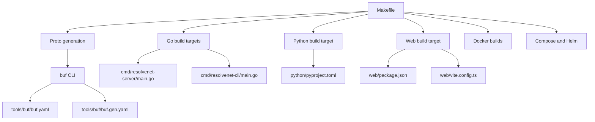
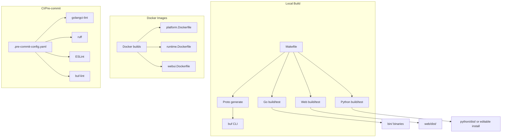
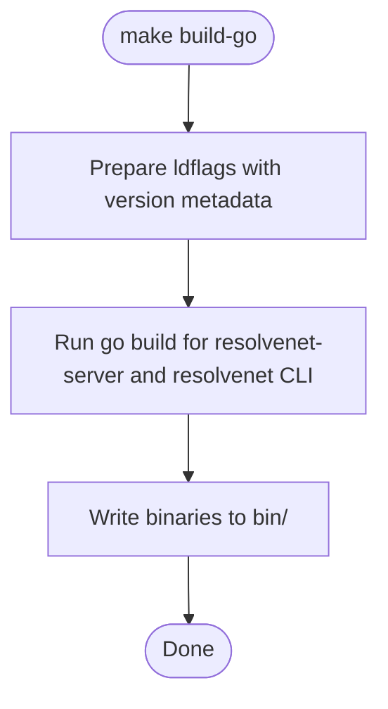
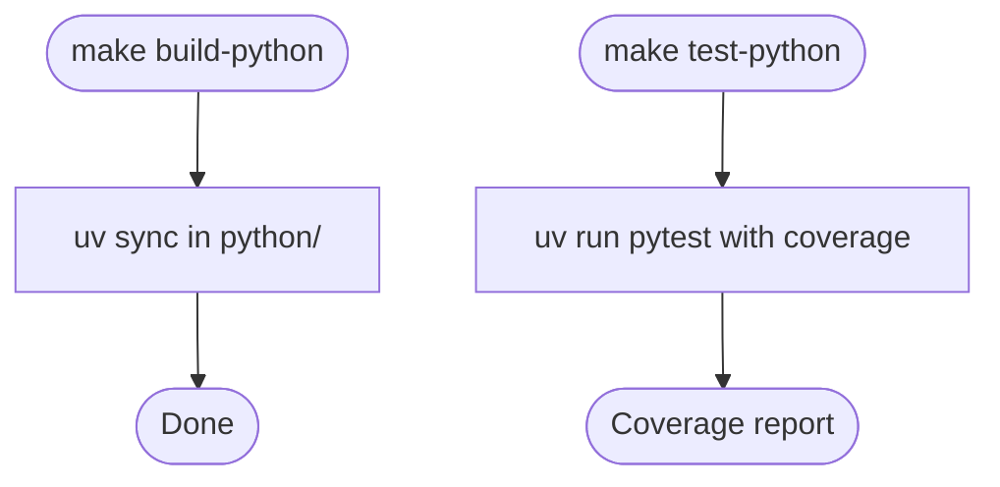
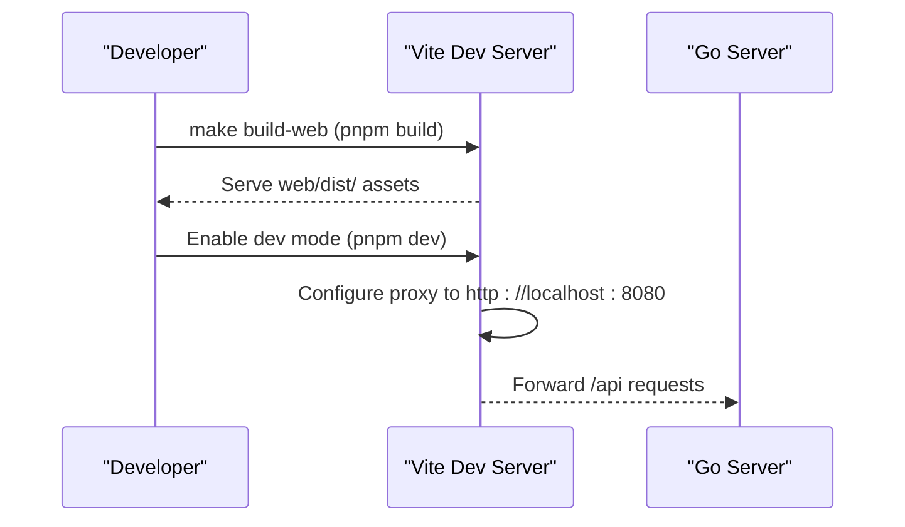
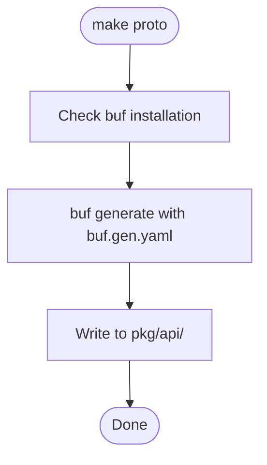
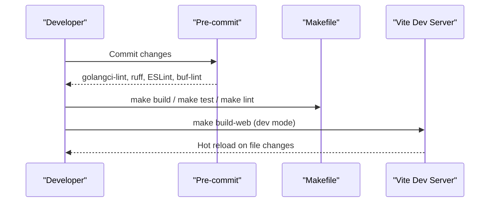
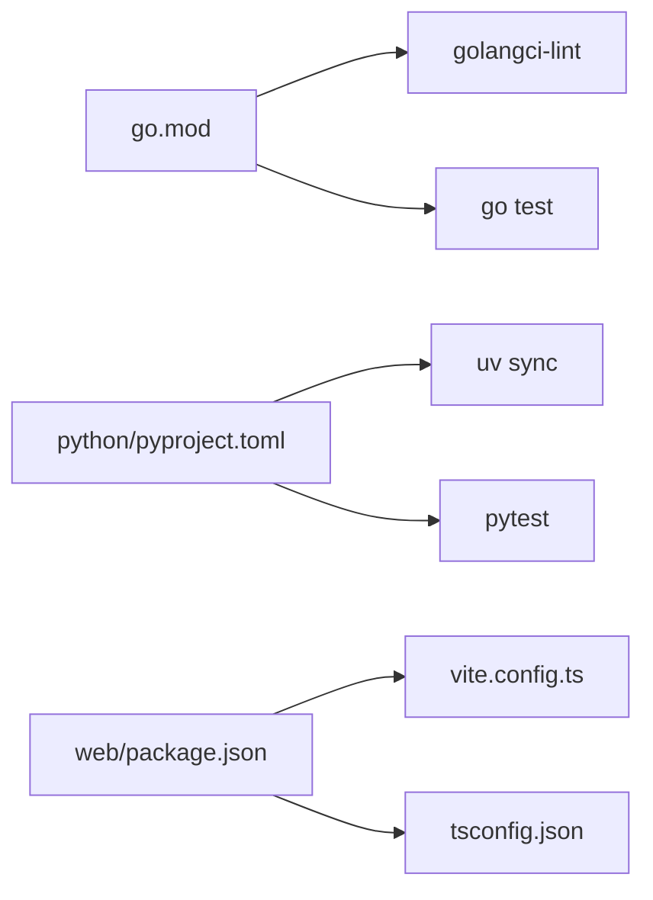

# Build System

<cite>
**Referenced Files in This Document**
- [Makefile](file://Makefile)
- [hack/setup-dev.sh](file://hack/setup-dev.sh)
- [hack/generate-proto.sh](file://hack/generate-proto.sh)
- [hack/lint.sh](file://hack/lint.sh)
- [go.mod](file://go.mod)
- [python/pyproject.toml](file://python/pyproject.toml)
- [web/package.json](file://web/package.json)
- [tools/buf/buf.yaml](file://tools/buf/buf.yaml)
- [tools/buf/buf.gen.yaml](file://tools/buf/buf.gen.yaml)
- [.golangci.yml](file://.golangci.yml)
- [.pre-commit-config.yaml](file://.pre-commit-config.yaml)
- [deploy/docker/platform.Dockerfile](file://deploy/docker/platform.Dockerfile)
- [deploy/docker/runtime.Dockerfile](file://deploy/docker/runtime.Dockerfile)
- [deploy/docker/webui.Dockerfile](file://deploy/docker/webui.Dockerfile)
- [web/vite.config.ts](file://web/vite.config.ts)
- [web/tsconfig.json](file://web/tsconfig.json)
</cite>

## Table of Contents
1. [Introduction](#introduction)
2. [Project Structure](#project-structure)
3. [Core Components](#core-components)
4. [Architecture Overview](#architecture-overview)
5. [Detailed Component Analysis](#detailed-component-analysis)
6. [Dependency Analysis](#dependency-analysis)
7. [Performance Considerations](#performance-considerations)
8. [Troubleshooting Guide](#troubleshooting-guide)
9. [Conclusion](#conclusion)
10. [Appendices](#appendices)

## Introduction
This document describes the build system for ResolveNet’s Makefile-based workflow. It covers all primary build targets (setup-dev, build, test, lint, clean), the Protocol Buffer code generation process using buf CLI and custom scripts, dependency management across Go modules, Python packages, and Node.js applications, and the development workflow including hot reload, testing, and CI preparation. It also documents build optimization techniques, cross-platform compilation considerations, packaging for distribution, troubleshooting, dependency resolution, and performance optimization strategies.

## Project Structure
ResolveNet is a multi-language project composed of:
- Go backend services and CLI
- Python runtime and agent framework
- React-based Web UI
- Protocol Buffer definitions and generated Go bindings
- Dockerfiles for containerized deployment
- Helm charts and Docker Compose for orchestration

**Diagram sources**
- [Makefile:1-220](file://Makefile#L1-L220)
- [tools/buf/buf.yaml:1-13](file://tools/buf/buf.yaml#L1-L13)
- [tools/buf/buf.gen.yaml:1-15](file://tools/buf/buf.gen.yaml#L1-L15)
- [web/package.json:1-44](file://web/package.json#L1-L44)
- [web/vite.config.ts:1-22](file://web/vite.config.ts#L1-L22)

**Section sources**
- [Makefile:1-220](file://Makefile#L1-L220)

## Core Components
This section documents the primary build targets and their roles in the development and release pipeline.

- setup-dev
  - Purpose: Initialize a developer workstation with required tools and dependencies.
  - Behavior: Installs/validates Go, Python, Node; sets up Python virtual environment via uv; installs Node dependencies via pnpm; copies default configuration to user home.
  - Related files: [hack/setup-dev.sh:1-61](file://hack/setup-dev.sh#L1-L61)

- build
  - Purpose: Build all components (Go binaries, Python package, Web UI).
  - Sub-targets:
    - build-go: Builds resolvenet-server and resolvenet CLI using ldflags injected with version metadata.
    - build-python: Uses uv to synchronize dependencies for the Python package.
    - build-web: Installs Node dependencies and runs Vite build for the Web UI.
  - Related files: [Makefile:50-67](file://Makefile#L50-L67)

- test
  - Purpose: Execute unit and integration tests across all languages.
  - Sub-targets:
    - test-go: Runs Go tests with race detector and coverage.
    - test-python: Executes Python tests with pytest and coverage.
    - test-web: Runs Web UI tests with Vitest.
    - test-e2e: Executes end-to-end tests tagged with e2e.
  - Related files: [Makefile:72-91](file://Makefile#L72-L91)

- lint
  - Purpose: Enforce code quality standards across languages and protocols.
  - Sub-targets:
    - lint-go: Runs golangci-lint across Go code.
    - lint-python: Runs ruff check/format and mypy on Python sources.
    - lint-web: Runs ESLint on TypeScript/React sources.
    - lint-proto: Lints Protocol Buffer definitions with buf.
  - Related files: [Makefile:96-117](file://Makefile#L96-L117)

- clean
  - Purpose: Remove generated artifacts and caches.
  - Behavior: Deletes bin directory, coverage outputs, Python cache/build artifacts, Web dist and node_modules.
  - Related files: [Makefile:204-212](file://Makefile#L204-L212)

- fmt
  - Purpose: Auto-format all codebases consistently.
  - Behavior: Formats Go with gofumpt, Python with ruff, and Web UI with Prettier.
  - Related files: [Makefile:213-219](file://Makefile#L213-L219)

- proto and generate
  - Purpose: Generate Go code and gRPC/Gateway stubs from Protocol Buffer definitions.
  - Behavior: Invokes buf generate with configured templates and outputs to pkg/api.
  - Related files: [Makefile:122-129](file://Makefile#L122-L129), [hack/generate-proto.sh:1-17](file://hack/generate-proto.sh#L1-L17), [tools/buf/buf.gen.yaml:1-15](file://tools/buf/buf.gen.yaml#L1-L15)

- docker and docker-* targets
  - Purpose: Build container images for platform service, runtime, and Web UI.
  - Behavior: Uses Dockerfiles under deploy/docker to produce tagged images.
  - Related files: [Makefile:134-152](file://Makefile#L134-L152), [deploy/docker/platform.Dockerfile:1-26](file://deploy/docker/platform.Dockerfile#L1-L26), [deploy/docker/runtime.Dockerfile:1-22](file://deploy/docker/runtime.Dockerfile#L1-L22), [deploy/docker/webui.Dockerfile:1-22](file://deploy/docker/webui.Dockerfile#L1-L22)

- compose-* and helm-* targets
  - Purpose: Orchestrate local stacks and render Helm charts.
  - Behavior: Starts/stops Docker Compose stacks and manages Helm releases.
  - Related files: [Makefile:157-193](file://Makefile#L157-L193)

**Section sources**
- [Makefile:1-220](file://Makefile#L1-L220)
- [hack/setup-dev.sh:1-61](file://hack/setup-dev.sh#L1-L61)
- [hack/generate-proto.sh:1-17](file://hack/generate-proto.sh#L1-L17)
- [tools/buf/buf.gen.yaml:1-15](file://tools/buf/buf.gen.yaml#L1-L15)

## Architecture Overview
The build system orchestrates multiple subsystems:
- Go build and test with ldflags injection for version metadata
- Python packaging and dependency synchronization via uv
- Node.js/Vite-based Web UI with hot reload and proxy to backend
- buf-based Protocol Buffer code generation
- Multi-stage Docker builds for production deployment
- Pre-commit hooks and centralized linters for CI readiness

**Diagram sources**
- [Makefile:1-220](file://Makefile#L1-L220)
- [deploy/docker/platform.Dockerfile:1-26](file://deploy/docker/platform.Dockerfile#L1-L26)
- [deploy/docker/runtime.Dockerfile:1-22](file://deploy/docker/runtime.Dockerfile#L1-L22)
- [deploy/docker/webui.Dockerfile:1-22](file://deploy/docker/webui.Dockerfile#L1-L22)
- [.pre-commit-config.yaml:1-44](file://.pre-commit-config.yaml#L1-L44)

## Detailed Component Analysis

### Go Build and Version Metadata
- Build flags inject version, commit, and build date into binaries.
- Cross-platform builds are supported by setting GOOS in Dockerfile for runtime image.
- Race detection and coverage are enabled for tests.

**Diagram sources**
- [Makefile:23-27](file://Makefile#L23-L27)
- [Makefile:54-58](file://Makefile#L54-L58)

**Section sources**
- [Makefile:23-27](file://Makefile#L23-L27)
- [Makefile:54-58](file://Makefile#L54-L58)

### Python Packaging and Testing
- Python packaging uses hatchling with a dedicated wheel target.
- Dependencies and optional dev groups are declared in pyproject.toml.
- Tests are executed with pytest and coverage enabled.

**Diagram sources**
- [Makefile:60-63](file://Makefile#L60-L63)
- [python/pyproject.toml:44-47](file://python/pyproject.toml#L44-L47)

**Section sources**
- [python/pyproject.toml:1-66](file://python/pyproject.toml#L1-L66)
- [Makefile:60-83](file://Makefile#L60-L83)

### Web UI Build, Hot Reload, and Proxy
- Vite dev server runs on port 3000 with proxy to backend API.
- Production build outputs to web/dist/.
- Tests use Vitest; formatting uses Prettier.

**Diagram sources**
- [Makefile:64-66](file://Makefile#L64-L66)
- [web/vite.config.ts:12-20](file://web/vite.config.ts#L12-L20)
- [web/package.json:6-14](file://web/package.json#L6-L14)

**Section sources**
- [web/vite.config.ts:1-22](file://web/vite.config.ts#L1-L22)
- [web/tsconfig.json:1-26](file://web/tsconfig.json#L1-L26)
- [web/package.json:1-44](file://web/package.json#L1-L44)
- [Makefile:64-87](file://Makefile#L64-L87)

### Protocol Buffer Code Generation
- buf CLI is invoked with a dedicated configuration and generator template.
- Generated Go code and gRPC/Gateway stubs are placed under pkg/api.

**Diagram sources**
- [Makefile:124-126](file://Makefile#L124-L126)
- [hack/generate-proto.sh:6-14](file://hack/generate-proto.sh#L6-L14)
- [tools/buf/buf.gen.yaml:2-15](file://tools/buf/buf.gen.yaml#L2-L15)

**Section sources**
- [tools/buf/buf.yaml:1-13](file://tools/buf/buf.yaml#L1-L13)
- [tools/buf/buf.gen.yaml:1-15](file://tools/buf/buf.gen.yaml#L1-L15)
- [hack/generate-proto.sh:1-17](file://hack/generate-proto.sh#L1-L17)
- [Makefile:124-129](file://Makefile#L124-L129)

### Docker Builds and Distribution
- Multi-stage builds optimize image size and security.
- Platform image compiles statically linked Go binary.
- Runtime image installs uv and synchronizes Python dependencies.
- Web UI image serves built assets via Nginx.

```mermaid
graph TB
subgraph "Platform Image"
PB["builder: golang:1.22-alpine"] --> PBuild["go build -ldflags -s -w"]
PBuild --> PStage["alpine:3.20 runtime"]
PStage --> PExpose["expose 8080,9090"]
end
subgraph "Runtime Image"
RB["python:3.12-slim"] --> RUV["pip install uv"]
RUV --> RSync["uv sync (no-dev)"]
RSync --> RExpose["expose 9091"]
end
subgraph "WebUI Image"
WB["node:20-alpine"] --> WPNPM["pnpm install"]
WPNPM --> WBuild["pnpm build"]
WBuild --> WStage["nginx:alpine runtime"]
WStage --> WExpose["expose 80"]
end
```

**Diagram sources**
- [deploy/docker/platform.Dockerfile:1-26](file://deploy/docker/platform.Dockerfile#L1-L26)
- [deploy/docker/runtime.Dockerfile:1-22](file://deploy/docker/runtime.Dockerfile#L1-L22)
- [deploy/docker/webui.Dockerfile:1-22](file://deploy/docker/webui.Dockerfile#L1-L22)

**Section sources**
- [deploy/docker/platform.Dockerfile:1-26](file://deploy/docker/platform.Dockerfile#L1-L26)
- [deploy/docker/runtime.Dockerfile:1-22](file://deploy/docker/runtime.Dockerfile#L1-L22)
- [deploy/docker/webui.Dockerfile:1-22](file://deploy/docker/webui.Dockerfile#L1-L22)

### Development Workflow and Hot Reload
- Local development uses Vite dev server with proxy to the Go backend.
- Pre-commit hooks enforce formatting and linting before commits.
- Continuous integration readiness is achieved via Makefile targets and buf/golangci-lint configuration.

**Diagram sources**
- [.pre-commit-config.yaml:1-44](file://.pre-commit-config.yaml#L1-L44)
- [Makefile:50-117](file://Makefile#L50-L117)
- [web/vite.config.ts:12-20](file://web/vite.config.ts#L12-L20)

**Section sources**
- [.pre-commit-config.yaml:1-44](file://.pre-commit-config.yaml#L1-L44)
- [Makefile:50-117](file://Makefile#L50-L117)
- [web/vite.config.ts:1-22](file://web/vite.config.ts#L1-L22)

## Dependency Analysis
ResolveNet manages dependencies across three ecosystems with explicit tooling:

- Go modules
  - Declared in go.mod with Go 1.22.7.
  - Indirect dependencies pinned via go.sum.
  - Centralized linting via .golangci.yml.

- Python packages
  - Declared in pyproject.toml with hatchling build backend.
  - Optional groups for RAG and dev tooling.
  - uv used for fast dependency synchronization.

- Node.js applications
  - Package scripts defined in web/package.json.
  - Vite configuration in web/vite.config.ts.
  - TypeScript strictness enforced in web/tsconfig.json.

**Diagram sources**
- [go.mod:1-52](file://go.mod#L1-L52)
- [.golangci.yml:1-69](file://.golangci.yml#L1-L69)
- [python/pyproject.toml:1-66](file://python/pyproject.toml#L1-L66)
- [web/package.json:1-44](file://web/package.json#L1-L44)
- [web/vite.config.ts:1-22](file://web/vite.config.ts#L1-L22)
- [web/tsconfig.json:1-26](file://web/tsconfig.json#L1-L26)

**Section sources**
- [go.mod:1-52](file://go.mod#L1-L52)
- [.golangci.yml:1-69](file://.golangci.yml#L1-L69)
- [python/pyproject.toml:1-66](file://python/pyproject.toml#L1-L66)
- [web/package.json:1-44](file://web/package.json#L1-L44)
- [web/vite.config.ts:1-22](file://web/vite.config.ts#L1-L22)
- [web/tsconfig.json:1-26](file://web/tsconfig.json#L1-L26)

## Performance Considerations
- Static linking and minimal Alpine base images reduce attack surface and startup time.
- Multi-stage builds eliminate build-time dependencies from runtime images.
- Pre-compiling Web UI assets and serving via Nginx improves response latency.
- Using uv for Python dependency resolution accelerates installs compared to pip alone.
- golangci-lint with readonly module mode speeds up CI runs by avoiding network downloads.

[No sources needed since this section provides general guidance]

## Troubleshooting Guide
Common issues and resolutions:

- buf not found during proto generation
  - Ensure buf CLI is installed and on PATH.
  - Re-run the proto target after installation.
  - Related files: [hack/generate-proto.sh:7-10](file://hack/generate-proto.sh#L7-L10), [Makefile:124-126](file://Makefile#L124-L126)

- Missing buf configuration
  - Verify tools/buf/buf.yaml and tools/buf/buf.gen.yaml exist and are valid.
  - Related files: [tools/buf/buf.yaml:1-13](file://tools/buf/buf.yaml#L1-L13), [tools/buf/buf.gen.yaml:1-15](file://tools/buf/buf.gen.yaml#L1-L15)

- Python environment setup failures
  - Confirm uv is installed; the setup script will install it if missing.
  - Use uv sync with dev extras for development.
  - Related files: [hack/setup-dev.sh:26-32](file://hack/setup-dev.sh#L26-L32), [python/pyproject.toml:31-42](file://python/pyproject.toml#L31-L42)

- Node/npm/pnpm issues
  - The setup script installs pnpm globally if missing; otherwise use pnpm commands.
  - Related files: [hack/setup-dev.sh:38-43](file://hack/setup-dev.sh#L38-L43), [web/package.json:6-14](file://web/package.json#L6-L14)

- Docker build errors
  - Ensure Docker is installed and running.
  - Check that Dockerfiles exist and are readable.
  - Related files: [Makefile:138-152](file://Makefile#L138-L152), [deploy/docker/platform.Dockerfile:1-26](file://deploy/docker/platform.Dockerfile#L1-L26), [deploy/docker/runtime.Dockerfile:1-22](file://deploy/docker/runtime.Dockerfile#L1-L22), [deploy/docker/webui.Dockerfile:1-22](file://deploy/docker/webui.Dockerfile#L1-L22)

- Pre-commit hook failures
  - Fix lint/format issues reported by golangci-lint, ruff, ESLint, and buf-lint.
  - Related files: [.pre-commit-config.yaml:1-44](file://.pre-commit-config.yaml#L1-L44), [.golangci.yml:5-30](file://.golangci.yml#L5-L30)

**Section sources**
- [hack/generate-proto.sh:7-10](file://hack/generate-proto.sh#L7-L10)
- [tools/buf/buf.yaml:1-13](file://tools/buf/buf.yaml#L1-L13)
- [tools/buf/buf.gen.yaml:1-15](file://tools/buf/buf.gen.yaml#L1-L15)
- [hack/setup-dev.sh:26-32](file://hack/setup-dev.sh#L26-L32)
- [web/package.json:6-14](file://web/package.json#L6-L14)
- [Makefile:138-152](file://Makefile#L138-L152)
- [.pre-commit-config.yaml:1-44](file://.pre-commit-config.yaml#L1-L44)
- [.golangci.yml:5-30](file://.golangci.yml#L5-L30)

## Conclusion
ResolveNet’s build system integrates Makefile orchestration with buf-based Protocol Buffer generation, uv-powered Python dependency management, and Vite-driven Web UI tooling. Multi-stage Docker builds and pre-commit hooks prepare the project for CI and production deployment. The system emphasizes reproducibility, performance, and developer ergonomics.

[No sources needed since this section summarizes without analyzing specific files]

## Appendices

### Build Targets Reference
- setup-dev: Install prerequisites and set up environments.
- build: Build all components (Go, Python, Web).
- test: Run tests across all components.
- lint: Run linters for Go, Python, Web, and Protobuf.
- clean: Remove generated artifacts.
- fmt: Auto-format all codebases.
- proto/generate: Generate Protocol Buffer code.
- docker/docker-*: Build container images.
- compose-*/helm-*: Orchestrate local stacks and Helm releases.

**Section sources**
- [Makefile:37-219](file://Makefile#L37-L219)