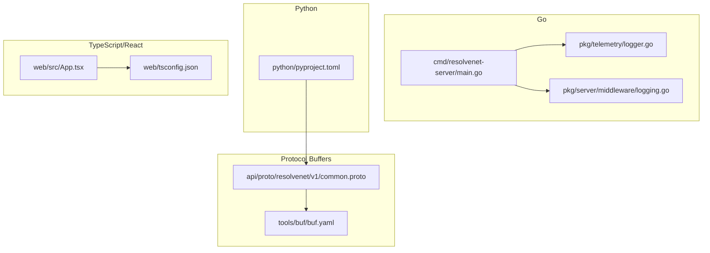
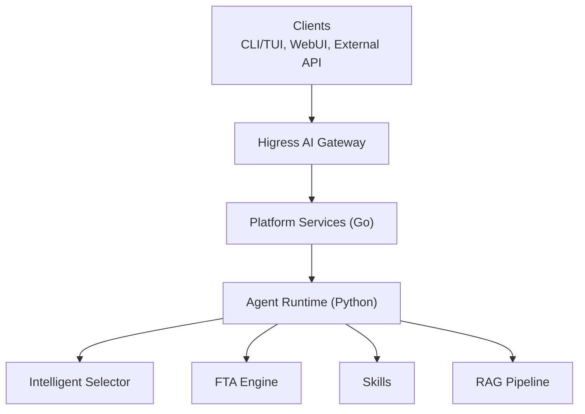
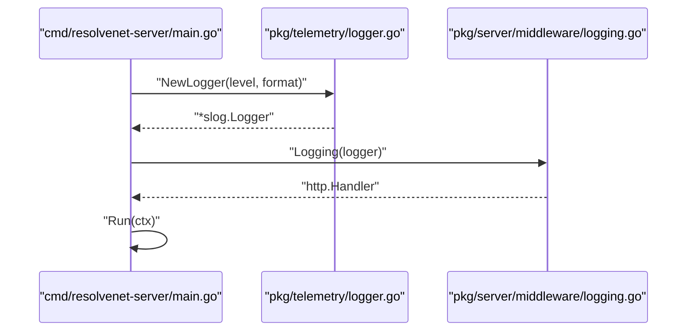
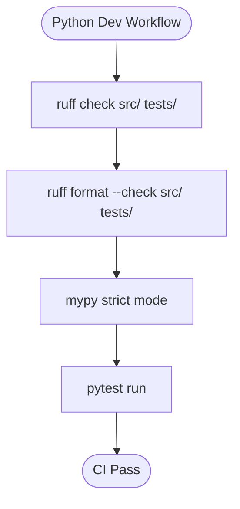
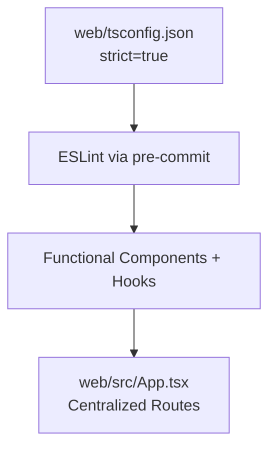
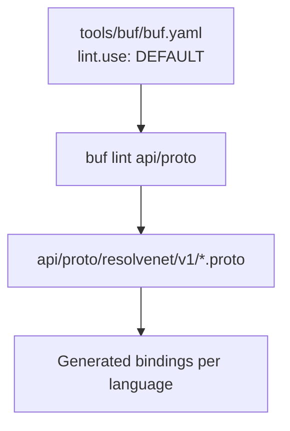
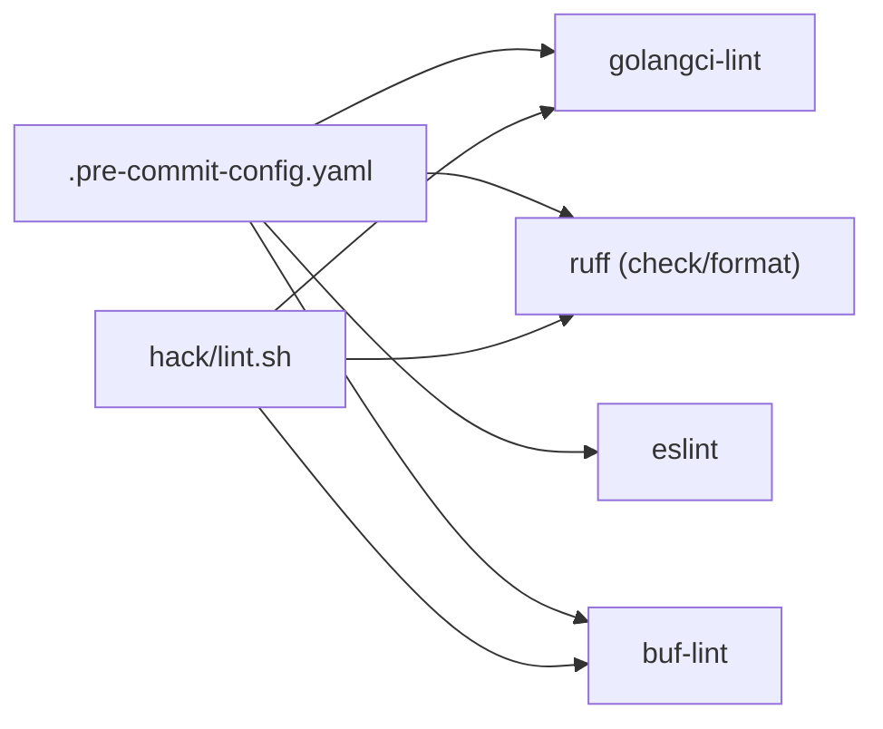

# Coding Standards

<cite>
**Referenced Files in This Document**
- [README.md](file://README.md)
- [CONTRIBUTING.md](file://CONTRIBUTING.md)
- [.golangci.yml](file://.golangci.yml)
- [.pre-commit-config.yaml](file://.pre-commit-config.yaml)
- [go.mod](file://go.mod)
- [cmd/resolvenet-server/main.go](file://cmd/resolvenet-server/main.go)
- [pkg/telemetry/logger.go](file://pkg/telemetry/logger.go)
- [pkg/server/middleware/logging.go](file://pkg/server/middleware/logging.go)
- [python/pyproject.toml](file://python/pyproject.toml)
- [web/src/App.tsx](file://web/src/App.tsx)
- [web/tsconfig.json](file://web/tsconfig.json)
- [api/proto/resolvenet/v1/common.proto](file://api/proto/resolvenet/v1/common.proto)
- [tools/buf/buf.yaml](file://tools/buf/buf.yaml)
- [hack/lint.sh](file://hack/lint.sh)
</cite>

## Table of Contents
1. [Introduction](#introduction)
2. [Project Structure](#project-structure)
3. [Core Components](#core-components)
4. [Architecture Overview](#architecture-overview)
5. [Detailed Component Analysis](#detailed-component-analysis)
6. [Dependency Analysis](#dependency-analysis)
7. [Performance Considerations](#performance-considerations)
8. [Troubleshooting Guide](#troubleshooting-guide)
9. [Conclusion](#conclusion)
10. [Appendices](#appendices)

## Introduction
This document defines the unified coding standards for ResolveNet across Go, Python, TypeScript/React, and Protocol Buffers. It consolidates existing practices evidenced in the repository and establishes enforceable rules for formatting, naming, error handling, and architectural consistency. The standards are derived from Effective Go, gofumpt, PEP 8 via ruff, strict TypeScript configuration, React hooks conventions, Pydantic models, and Buf style guide enforcement.

## Project Structure
ResolveNet is a multi-language project with clear separation of concerns:
- Go: Platform services, CLI/TUI, server, middleware, telemetry, and shared libraries
- Python: Agent runtime, selector, FTA engine, skills, RAG pipeline, and telemetry
- TypeScript/React: WebUI with functional components and hooks
- Protocol Buffers: API contracts under api/proto

**Diagram sources**
- [cmd/resolvenet-server/main.go:1-56](file://cmd/resolvenet-server/main.go#L1-L56)
- [pkg/telemetry/logger.go:1-36](file://pkg/telemetry/logger.go#L1-L36)
- [pkg/server/middleware/logging.go:1-38](file://pkg/server/middleware/logging.go#L1-L38)
- [python/pyproject.toml:1-66](file://python/pyproject.toml#L1-L66)
- [web/src/App.tsx:1-38](file://web/src/App.tsx#L1-L38)
- [web/tsconfig.json:1-26](file://web/tsconfig.json#L1-L26)
- [api/proto/resolvenet/v1/common.proto:1-49](file://api/proto/resolvenet/v1/common.proto#L1-L49)
- [tools/buf/buf.yaml:1-13](file://tools/buf/buf.yaml#L1-L13)

**Section sources**
- [README.md:116-139](file://README.md#L116-L139)

## Core Components
This section summarizes the coding standards per language, grounded in repository evidence.

- Go
  - Formatting: gofumpt enforced by golangci-lint
  - Documentation: exported functions must have documentation comments
  - Logging: structured logging with slog
  - Context: propagate context through function signatures
  - Linting: comprehensive set of linters including revive, gosec, gofumpt, noctx
  - Version: Go 1.22+ as per module and CI

- Python
  - Formatting: ruff format
  - Linting: ruff with selected rules
  - Types: type hints on all public functions
  - Models: Pydantic models for data structures
  - Testing: pytest configuration included
  - Type checking: mypy strict mode

- TypeScript/React
  - Strictness: strict TypeScript configuration
  - Hooks: React hooks conventions
  - Components: functional components exclusively

- Protocol Buffers
  - Style: Buf style guide
  - Validation: buf lint with DEFAULT rules and exceptions

**Section sources**
- [CONTRIBUTING.md:53-80](file://CONTRIBUTING.md#L53-L80)
- [.golangci.yml:1-69](file://.golangci.yml#L1-L69)
- [go.mod:1-52](file://go.mod#L1-L52)
- [python/pyproject.toml:51-66](file://python/pyproject.toml#L51-L66)
- [web/tsconfig.json:1-26](file://web/tsconfig.json#L1-L26)
- [tools/buf/buf.yaml:1-13](file://tools/buf/buf.yaml#L1-L13)

## Architecture Overview
The platform integrates four layers with consistent standards:
- Platform Services (Go): REST/gRPC server, registries, event bus
- Agent Runtime (Python): selector, FTA, skills, RAG
- CLI/TUI (Go): commands and terminal dashboard
- WebUI (React+TS): management console and editors
- Gateway (external): Higress AI gateway for auth and routing

**Diagram sources**
- [README.md:12-46](file://README.md#L12-L46)

## Detailed Component Analysis

### Go Coding Standards
- Effective Go alignment: repository enforces Effective Go guidelines
- gofumpt formatting: enabled via golangci-lint
- Exported function documentation: mandatory for exported functions
- Structured logging with slog: demonstrated in server entrypoint and telemetry
- Context propagation: context used in server startup and signal handling
- Linting coverage: errcheck, govet, gosimple, staticcheck, gosec, revive, whitespace, noctx, among others

**Diagram sources**
- [cmd/resolvenet-server/main.go:16-55](file://cmd/resolvenet-server/main.go#L16-L55)
- [pkg/telemetry/logger.go:8-35](file://pkg/telemetry/logger.go#L8-L35)
- [pkg/server/middleware/logging.go:19-37](file://pkg/server/middleware/logging.go#L19-L37)

**Section sources**
- [CONTRIBUTING.md:55-61](file://CONTRIBUTING.md#L55-L61)
- [.golangci.yml:5-29](file://.golangci.yml#L5-L29)
- [cmd/resolvenet-server/main.go:16-55](file://cmd/resolvenet-server/main.go#L16-L55)
- [pkg/telemetry/logger.go:8-35](file://pkg/telemetry/logger.go#L8-L35)
- [pkg/server/middleware/logging.go:19-37](file://pkg/server/middleware/logging.go#L19-L37)

### Python Coding Standards
- PEP 8 enforcement: ruff selected rules cover E, F, W, I, N, UP, B, A, SIM, TCH
- Formatting: ruff format enforced during CI
- Type hints: required on all public functions
- Pydantic models: recommended for data structures
- Testing: pytest configuration present
- Type checking: mypy strict mode enabled

**Diagram sources**
- [python/pyproject.toml:51-66](file://python/pyproject.toml#L51-L66)
- [hack/lint.sh:11-15](file://hack/lint.sh#L11-L15)

**Section sources**
- [CONTRIBUTING.md:63-69](file://CONTRIBUTING.md#L63-L69)
- [python/pyproject.toml:51-66](file://python/pyproject.toml#L51-L66)
- [hack/lint.sh:11-15](file://hack/lint.sh#L11-L15)

### TypeScript/React Coding Standards
- Strict TypeScript: strict, noUnusedLocals, noUnusedParameters, noFallthroughCasesInSwitch, noUncheckedIndexedAccess
- Functional components: exclusive use of functional components
- Hooks: React hooks conventions applied in components and pages
- Routing: centralized route definitions in App component

**Diagram sources**
- [web/tsconfig.json:14-18](file://web/tsconfig.json#L14-L18)
- [web/src/App.tsx:17-37](file://web/src/App.tsx#L17-L37)
- [.pre-commit-config.yaml:27-38](file://.pre-commit-config.yaml#L27-L38)

**Section sources**
- [CONTRIBUTING.md:70-74](file://CONTRIBUTING.md#L70-L74)
- [web/tsconfig.json:14-18](file://web/tsconfig.json#L14-L18)
- [web/src/App.tsx:17-37](file://web/src/App.tsx#L17-L37)
- [.pre-commit-config.yaml:27-38](file://.pre-commit-config.yaml#L27-L38)

### Protocol Buffer Coding Standards
- Style guide: Buf style guide
- Validation: buf lint with DEFAULT rules and exceptions
- Breaking changes: file-level breaking detection
- Example contract: common.proto demonstrates message and enum conventions

**Diagram sources**
- [tools/buf/buf.yaml:5-12](file://tools/buf/buf.yaml#L5-L12)
- [api/proto/resolvenet/v1/common.proto:1-49](file://api/proto/resolvenet/v1/common.proto#L1-L49)

**Section sources**
- [CONTRIBUTING.md:76-79](file://CONTRIBUTING.md#L76-L79)
- [tools/buf/buf.yaml:5-12](file://tools/buf/buf.yaml#L5-L12)
- [api/proto/resolvenet/v1/common.proto:1-49](file://api/proto/resolvenet/v1/common.proto#L1-L49)

## Dependency Analysis
The project’s linting and formatting toolchain ensures consistent standards across languages.

**Diagram sources**
- [.pre-commit-config.yaml:1-44](file://.pre-commit-config.yaml#L1-L44)
- [hack/lint.sh:1-21](file://hack/lint.sh#L1-L21)

**Section sources**
- [.pre-commit-config.yaml:1-44](file://.pre-commit-config.yaml#L1-L44)
- [hack/lint.sh:1-21](file://hack/lint.sh#L1-L21)

## Performance Considerations
- Prefer structured logging with slog to minimize parsing overhead and improve observability
- Use functional components and hooks in React to reduce unnecessary re-renders
- Keep Protocol Buffer messages compact and avoid excessive nesting to reduce serialization costs
- Enforce type hints and strict mode to catch performance-related issues early

## Troubleshooting Guide
- Go
  - Ensure gofumpt formatting passes before committing
  - Verify exported function documentation exists
  - Confirm context propagation in long-running operations
  - Review golangci-lint output for rule violations

- Python
  - Run ruff check and ruff format locally
  - Ensure type hints are present on public functions
  - Validate Pydantic models for data structures

- TypeScript/React
  - Enable strict mode and fix all TypeScript errors
  - Use functional components and hooks consistently

- Protocol Buffers
  - Run buf lint to validate against style guide
  - Address breaking change warnings before merging

**Section sources**
- [CONTRIBUTING.md:53-80](file://CONTRIBUTING.md#L53-L80)
- [.golangci.yml:5-29](file://.golangci.yml#L5-L29)
- [python/pyproject.toml:51-66](file://python/pyproject.toml#L51-L66)
- [web/tsconfig.json:14-18](file://web/tsconfig.json#L14-L18)
- [tools/buf/buf.yaml:5-12](file://tools/buf/buf.yaml#L5-L12)

## Conclusion
ResolveNet’s coding standards unify development practices across Go, Python, TypeScript/React, and Protocol Buffers. By adhering to Effective Go, ruff, strict TypeScript, and Buf style guide, contributors can maintain a consistent, readable, and reliable codebase. The established toolchain (golangci-lint, ruff, ESLint, buf-lint) and CI scripts ensure compliance and quality.

## Appendices

### Appendix A: Go Standards Checklist
- [ ] gofumpt formatting applied
- [ ] exported functions documented
- [ ] structured logging with slog
- [ ] context propagated through function signatures
- [ ] golangci-lint passes

**Section sources**
- [CONTRIBUTING.md:55-61](file://CONTRIBUTING.md#L55-L61)
- [.golangci.yml:5-29](file://.golangci.yml#L5-L29)

### Appendix B: Python Standards Checklist
- [ ] ruff check and format pass
- [ ] type hints on public functions
- [ ] Pydantic models for data structures
- [ ] mypy strict mode enabled
- [ ] pytest runs successfully

**Section sources**
- [CONTRIBUTING.md:63-69](file://CONTRIBUTING.md#L63-L69)
- [python/pyproject.toml:51-66](file://python/pyproject.toml#L51-L66)

### Appendix C: TypeScript/React Standards Checklist
- [ ] strict TypeScript configuration
- [ ] functional components only
- [ ] hooks used consistently
- [ ] ESLint configured via pre-commit

**Section sources**
- [CONTRIBUTING.md:70-74](file://CONTRIBUTING.md#L70-L74)
- [web/tsconfig.json:14-18](file://web/tsconfig.json#L14-L18)
- [.pre-commit-config.yaml:27-38](file://.pre-commit-config.yaml#L27-L38)

### Appendix D: Protocol Buffer Standards Checklist
- [ ] buf lint passes with DEFAULT rules
- [ ] style guide followed
- [ ] breaking changes addressed

**Section sources**
- [CONTRIBUTING.md:76-79](file://CONTRIBUTING.md#L76-L79)
- [tools/buf/buf.yaml:5-12](file://tools/buf/buf.yaml#L5-L12)