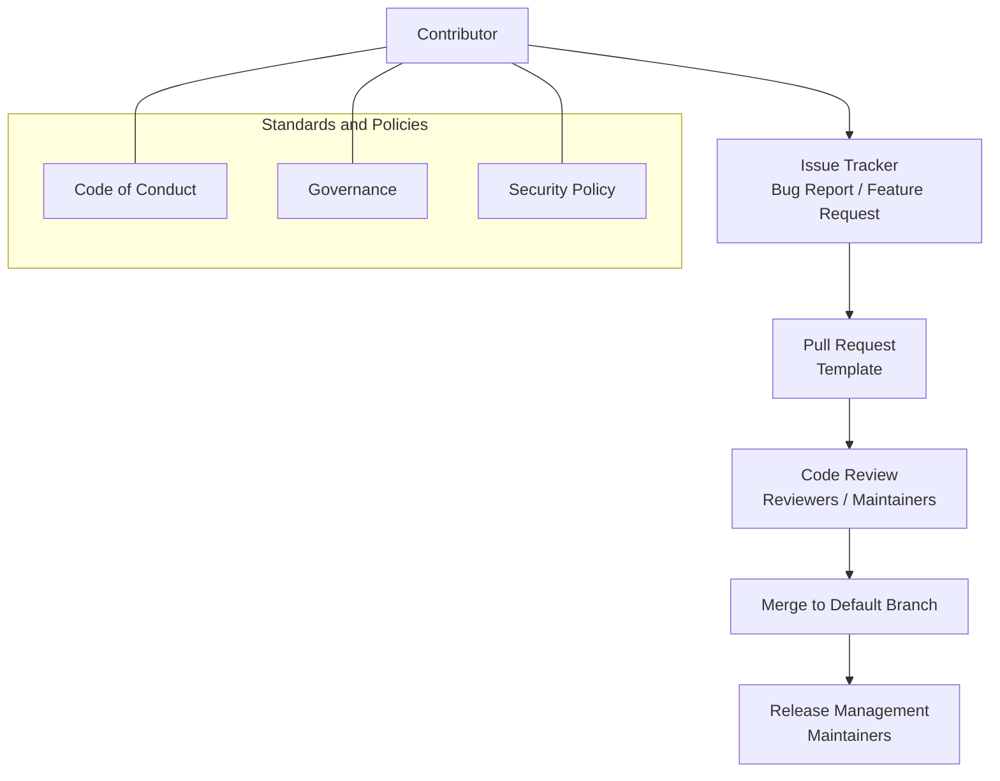
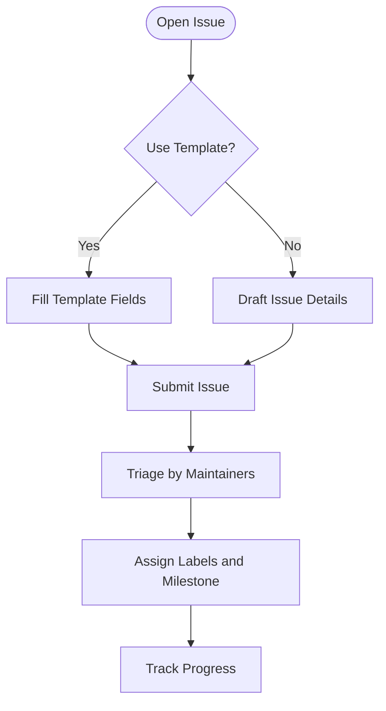
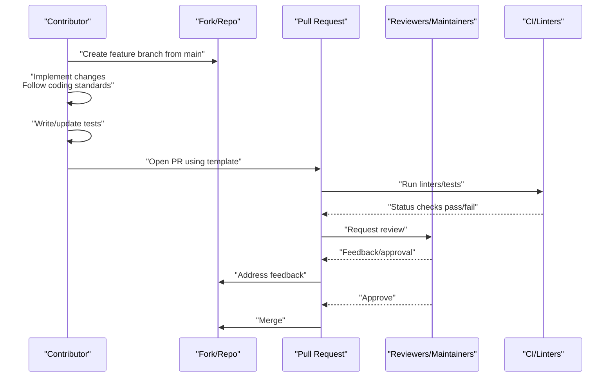
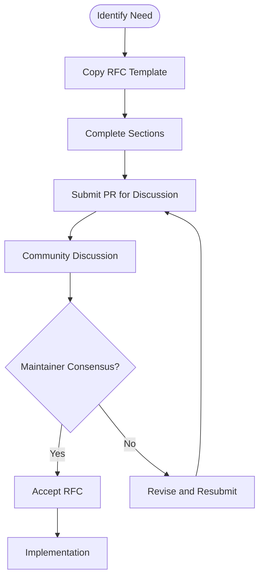
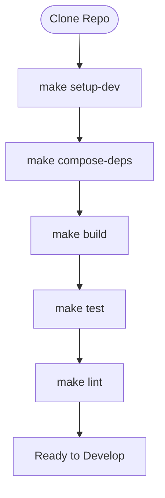
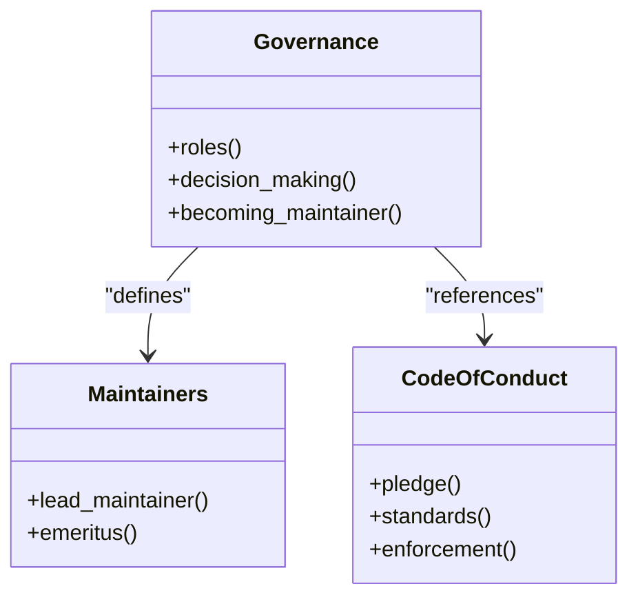
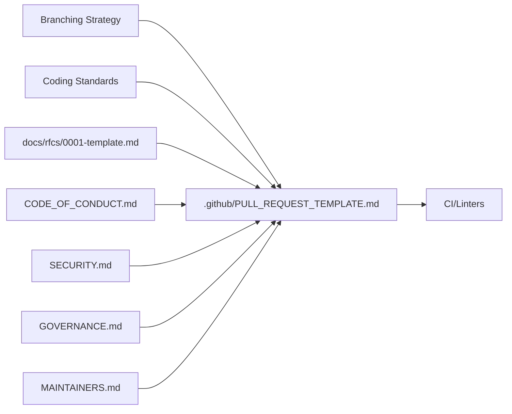

# Contribution Process

<cite>
**Referenced Files in This Document**
- [CONTRIBUTING.md](file://CONTRIBUTING.md)
- [GOVERNANCE.md](file://GOVERNANCE.md)
- [MAINTAINERS.md](file://MAINTAINERS.md)
- [CODE_OF_CONDUCT.md](file://CODE_OF_CONDUCT.md)
- [SECURITY.md](file://SECURITY.md)
- [.github/PULL_REQUEST_TEMPLATE.md](file://.github/PULL_REQUEST_TEMPLATE.md)
- [.github/ISSUE_TEMPLATE/bug_report.md](file://.github/ISSUE_TEMPLATE/bug_report.md)
- [.github/ISSUE_TEMPLATE/feature_request.md](file://.github/ISSUE_TEMPLATE/feature_request.md)
- [docs/rfcs/0001-template.md](file://docs/rfcs/0001-template.md)
- [Makefile](file://Makefile)
- [hack/setup-dev.sh](file://hack/setup-dev.sh)
- [.golangci.yml](file://.golangci.yml)
- [.pre-commit-config.yaml](file://.pre-commit-config.yaml)
- [README.md](file://README.md)
</cite>

## Table of Contents
1. [Introduction](#introduction)
2. [Project Structure](#project-structure)
3. [Core Components](#core-components)
4. [Architecture Overview](#architecture-overview)
5. [Detailed Component Analysis](#detailed-component-analysis)
6. [Dependency Analysis](#dependency-analysis)
7. [Performance Considerations](#performance-considerations)
8. [Troubleshooting Guide](#troubleshooting-guide)
9. [Conclusion](#conclusion)
10. [Appendices](#appendices)

## Introduction
This document defines the complete contribution lifecycle for ResolveNet, from reporting issues to merging pull requests. It explains branching strategy, feature branch creation, pull request submission using templates, code review and approval processes, and the RFC process for significant architectural changes. It also covers issue triage, bug and feature request procedures, community guidelines, code of conduct enforcement, maintainer responsibilities, and guidance for first-time contributors.

## Project Structure
ResolveNet is a multi-language, cloud-native project with distinct components:
- Platform Services (Go): API server, registries, event bus
- Agent Runtime (Python): Agent execution, Intelligent Selector, FTA/Skills/RAG
- CLI/TUI (Go): Command-line interface and terminal dashboard
- WebUI (React+TS): Management console with FTA visual editor
- Gateway (Higress): AI gateway for auth, rate limiting, model routing
- Protobuf definitions and generated code
- Docker, Helm, and Kubernetes deployment assets
- Python and WebUI tests, Go tests, and end-to-end tests

Development tasks are orchestrated via a unified Makefile, with pre-commit hooks and linters ensuring consistent code quality across languages.

**Section sources**
- [README.md:116-139](file://README.md#L116-L139)
- [Makefile:14-21](file://Makefile#L14-L21)
- [Makefile:50-67](file://Makefile#L50-L67)
- [Makefile:72-91](file://Makefile#L72-L91)
- [Makefile:96-117](file://Makefile#L96-L117)

## Core Components
This section outlines the contribution workflow components and policies that govern contributions.

- Branching and feature branches
  - Create feature branches from the default branch (commonly named main).
  - Keep branches focused and short-lived to facilitate review and reduce merge conflicts.

- Pull Requests
  - Use the provided pull request template to structure your submissions.
  - Include a summary, change list, type classification, testing verification, and compliance checklist items.

- Issue Templates
  - Use the bug report and feature request templates to ensure consistent information capture.
  - Search existing issues before filing duplicates.

- Coding Standards
  - Go: Effective Go, formatting with gofumpt, exported function documentation, structured logging, context propagation.
  - Python: PEP 8 via ruff, type hints, Pydantic models, formatting with ruff format.
  - TypeScript/React: strict TypeScript configuration, hooks conventions, functional components.
  - Protocol Buffers: Buf style guide, linting with buf lint.

- RFC Process
  - For significant architectural changes, prepare an RFC using the provided template, submit as a pull request for community discussion, and accept by maintainer consensus.

- Governance and Maintainers
  - Maintainers oversee direction, quality, releases, and merge permissions.
  - Contributors are recognized for code, docs, issues, and reviews.
  - Becoming a maintainer requires sustained contributions, demonstrated understanding, nomination, and approval.

- Code of Conduct
  - All participants must adhere to the Code of Conduct; enforcement contacts are provided.

- Security
  - Do not report vulnerabilities in public issues; use the dedicated security contact.
  - Follow security best practices during contributions.

**Section sources**
- [CONTRIBUTING.md:17-23](file://CONTRIBUTING.md#L17-L23)
- [CONTRIBUTING.md:11-16](file://CONTRIBUTING.md#L11-L16)
- [CONTRIBUTING.md:53-80](file://CONTRIBUTING.md#L53-L80)
- [CONTRIBUTING.md:81-89](file://CONTRIBUTING.md#L81-L89)
- [GOVERNANCE.md:7-28](file://GOVERNANCE.md#L7-L28)
- [MAINTAINERS.md:3-11](file://MAINTAINERS.md#L3-L11)
- [CODE_OF_CONDUCT.md:1-52](file://CODE_OF_CONDUCT.md#L1-L52)
- [SECURITY.md:9-39](file://SECURITY.md#L9-L39)

## Architecture Overview
The contribution workflow integrates issue reporting, feature development, code review, and release management under governance and community standards.

[No sources needed since this diagram shows conceptual workflow, not actual code structure]

## Detailed Component Analysis

### Issue Reporting and Triage
- Use the bug report template to capture environment details, reproduction steps, and expected behavior.
- Use the feature request template to describe the problem, desired solution, alternatives, and context.
- Search existing issues to avoid duplicates.
- Triage is managed by maintainers and community collaborators; labels and assignments are applied as needed.

**Section sources**
- [.github/ISSUE_TEMPLATE/bug_report.md:1-25](file://.github/ISSUE_TEMPLATE/bug_report.md#L1-L25)
- [.github/ISSUE_TEMPLATE/feature_request.md:1-20](file://.github/ISSUE_TEMPLATE/feature_request.md#L1-L20)
- [CONTRIBUTING.md:11-16](file://CONTRIBUTING.md#L11-L16)

### Pull Request Submission and Review
- Branching strategy: Create feature branches from the default branch (main).
- Follow coding standards for each language.
- Add or update tests; ensure all tests pass locally.
- Submit a PR using the provided template and ensure checklist items are addressed.

**Section sources**
- [CONTRIBUTING.md:17-23](file://CONTRIBUTING.md#L17-L23)
- [.github/PULL_REQUEST_TEMPLATE.md:1-28](file://.github/PULL_REQUEST_TEMPLATE.md#L1-L28)
- [.golangci.yml:1-69](file://.golangci.yml#L1-L69)
- [.pre-commit-config.yaml:1-44](file://.pre-commit-config.yaml#L1-L44)

### RFC Process for Architectural Changes
- Copy the RFC template to a new filename and fill in sections: Summary, Motivation, Design, Alternatives Considered, Implementation Plan, and Open Questions.
- Submit the RFC as a pull request for community discussion.
- Acceptance requires maintainer consensus.

**Section sources**
- [CONTRIBUTING.md:81-89](file://CONTRIBUTING.md#L81-L89)
- [docs/rfcs/0001-template.md:1-26](file://docs/rfcs/0001-template.md#L1-L26)

### Development Setup and Local Validation
- Use the Makefile targets to set up the environment, build components, run tests, and lint code.
- The development script enforces prerequisites and installs language-specific toolchains and dependencies.
- Pre-commit hooks automate formatting and linting prior to commits.

**Section sources**
- [CONTRIBUTING.md:25-43](file://CONTRIBUTING.md#L25-L43)
- [Makefile:198-220](file://Makefile#L198-L220)
- [hack/setup-dev.sh:1-61](file://hack/setup-dev.sh#L1-L61)
- [.pre-commit-config.yaml:1-44](file://.pre-commit-config.yaml#L1-L44)

### Governance, Maintainers, and Code of Conduct
- Governance establishes roles (maintainers, contributors, reviewers), decision-making mechanisms (consensus, RFCs, voting), and pathways to becoming a maintainer.
- Maintainers are listed and include lead maintainer designation.
- Code of Conduct defines standards, scope, and enforcement contacts.

**Section sources**
- [GOVERNANCE.md:1-40](file://GOVERNANCE.md#L1-L40)
- [MAINTAINERS.md:1-16](file://MAINTAINERS.md#L1-L16)
- [CODE_OF_CONDUCT.md:1-52](file://CODE_OF_CONDUCT.md#L1-L52)

### Security Reporting and Best Practices
- Report vulnerabilities privately to the designated security contact; do not open public issues.
- Follow security best practices during development and contribution.

**Section sources**
- [SECURITY.md:9-39](file://SECURITY.md#L9-L39)

## Dependency Analysis
The contribution workflow depends on consistent adherence to standards and policies across the repository.

**Diagram sources**
- [.github/PULL_REQUEST_TEMPLATE.md:1-28](file://.github/PULL_REQUEST_TEMPLATE.md#L1-L28)
- [CONTRIBUTING.md:53-89](file://CONTRIBUTING.md#L53-L89)
- [docs/rfcs/0001-template.md:1-26](file://docs/rfcs/0001-template.md#L1-L26)
- [CODE_OF_CONDUCT.md:1-52](file://CODE_OF_CONDUCT.md#L1-L52)
- [SECURITY.md:9-39](file://SECURITY.md#L9-L39)
- [GOVERNANCE.md:1-40](file://GOVERNANCE.md#L1-L40)
- [MAINTAINERS.md:1-16](file://MAINTAINERS.md#L1-L16)

**Section sources**
- [CONTRIBUTING.md:53-89](file://CONTRIBUTING.md#L53-L89)
- [.github/PULL_REQUEST_TEMPLATE.md:1-28](file://.github/PULL_REQUEST_TEMPLATE.md#L1-L28)
- [docs/rfcs/0001-template.md:1-26](file://docs/rfcs/0001-template.md#L1-L26)
- [CODE_OF_CONDUCT.md:1-52](file://CODE_OF_CONDUCT.md#L1-L52)
- [SECURITY.md:9-39](file://SECURITY.md#L9-L39)
- [GOVERNANCE.md:1-40](file://GOVERNANCE.md#L1-L40)
- [MAINTAINERS.md:1-16](file://MAINTAINERS.md#L1-L16)

## Performance Considerations
- Keep feature branches small and focused to minimize review time and reduce merge conflicts.
- Run local tests and linters before submitting PRs to reduce CI failures.
- Use the Makefile targets to streamline builds and validations.

[No sources needed since this section provides general guidance]

## Troubleshooting Guide
- Pre-requisites missing: Ensure Go, Python, Node.js, Buf, Docker, and Docker Compose meet minimum versions.
- Local environment setup: Use the development setup script and Makefile targets to configure dependencies and defaults.
- Lint failures: Address formatting and linting issues indicated by golangci-lint, ruff, ESLint, and buf lint.
- CI failures: Verify tests pass locally and all checklist items in the PR template are satisfied.

**Section sources**
- [CONTRIBUTING.md:45-52](file://CONTRIBUTING.md#L45-L52)
- [hack/setup-dev.sh:8-18](file://hack/setup-dev.sh#L8-L18)
- [.golangci.yml:1-69](file://.golangci.yml#L1-L69)
- [.pre-commit-config.yaml:1-44](file://.pre-commit-config.yaml#L1-L44)
- [Makefile:72-117](file://Makefile#L72-L117)

## Conclusion
ResolveNet’s contribution process emphasizes transparency, quality, and inclusivity. Contributors follow standardized workflows for issues, pull requests, and RFCs, supported by governance, code of conduct, and security policies. Adhering to these processes ensures efficient collaboration and sustainable project growth.

[No sources needed since this section summarizes without analyzing specific files]

## Appendices

### First-Time Contributor Guidance
- Read the contribution guidelines and familiarize yourself with the project architecture.
- Use the development setup script and Makefile to bootstrap your environment.
- Start with good first issues labeled appropriately; engage respectfully per the Code of Conduct.
- For significant changes, propose an RFC to align the community before implementation.

**Section sources**
- [README.md:169-171](file://README.md#L169-L171)
- [CONTRIBUTING.md:25-43](file://CONTRIBUTING.md#L25-L43)
- [CODE_OF_CONDUCT.md:1-52](file://CODE_OF_CONDUCT.md#L1-L52)